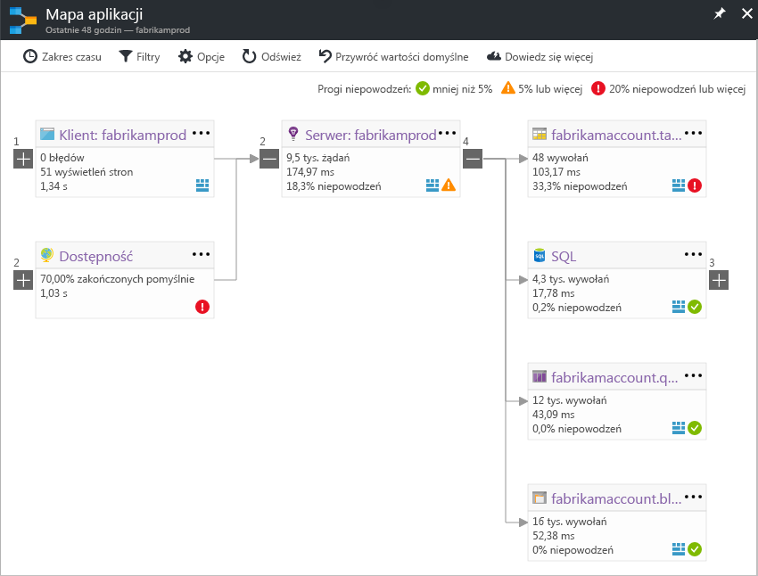

# Mapowanie aplikacji w usłudze Application InsightsApplication Map in Application Insights
W [Azure Application Insights](app-insights-overview.md), mapa aplikacji jest układu wizualnego relacji zależności hello składników aplikacji.In [Azure Application Insights](app-insights-overview.md), Application Map is a visual layout of hello dependency relationships of your application components. Każdy składnik pokazuje wskaźników KPI takich jak toohelp obciążenia, błędów, wydajności i alerty, odnajdywanie dowolny składnik przyczyną problemu z wydajnością lub błędu.Each component shows KPIs such as load, performance, failures, and alerts, toohelp you discover any component causing a performance issue or failure. Kliknij go, z dowolnym toomore składnika szczegółowe diagnostycznych, takich jak zdarzenia usługi Application Insights.You can click through from any component toomore detailed diagnostics, such as Application Insights events. Jeśli aplikacja korzysta z usług Azure, możesz również kliknąć za pośrednictwem diagnostics tooAzure, takie jak zalecenia doradcy bazy danych SQL.If your app uses Azure services, you can also click through tooAzure diagnostics, such as SQL Database Advisor recommendations.

Podobnie jak inne wykresy można przypiąć toohello mapy aplikacji pulpitu nawigacyjnego platformy Azure, gdzie jest pełną funkcjonalność.Like other charts, you can pin an application map toohello Azure dashboard, where it is fully functional. 

## Mapowanie aplikacji hello otwarteOpen hello application map
Mapa hello Otwórz za pomocą bloku omówienie hello aplikacji:Open hello map from hello overview blade for your application:

Mapa Hello pokazuje:hello map shows:

* Testy dostępnościAvailability tests
* Składnik po stronie klienta (monitorowane w ramach hello JavaScript SDK)Client-side component (monitored with hello JavaScript SDK)
* Składnik po stronie serweraServer-side component
* Zależności hello składniki klienta i serweraDependencies of hello client and server components

Można zwijać i rozwijać grupy łącze zależności:You can expand and collapse dependency link groups:

Jeśli masz wiele zależności jednego typu (SQL, HTTP itp.) są zgrupowane.If you have many dependencies of one type (SQL, HTTP etc.), they may appear grouped. 

## Dodatkowych problemówSpot problems
Każdy węzeł ma odpowiednie wskaźniki, jak hello ładowania, wydajności i niepowodzenie szybkości dla tego składnika.Each node has relevant performance indicators, such as hello load, performance, and failure rates for that component. 

Ikonami ostrzeżenia zaznacz możliwych problemów.Warning icons highlight possible problems. Pomarańczowe ostrzeżenie oznacza, że błędy występują w żądaniach, wyświetleń strony lub wywołania zależności.An orange warning means there are failures in requests, page views or dependency calls. Czerwony oznacza współczynnik awaryjności powyżej 5%.Red means a failure rate above 5%. Jeśli chcesz tooadjust tych progów, Otwórz opcje.If you want tooadjust these thresholds, open Options.

Aktywne alerty również Pokaż zapasową:Active alerts also show up: 

Jeśli używasz usług SQL Azure jest ikonę, która pokazuje, kiedy są zalecenia, w jaki sposób można poprawić wydajność.If you use SQL Azure, there's an icon that shows when there are recommendations on how you can improve performance. 

Kliknij żadnych tooget ikona więcej szczegółów:Click any icon tooget more details:

## Kliknij diagnostyczne za pośrednictwemDiagnostic click through
Każdego z węzłów hello na mapie hello oferuje docelowe kliknij za pomocą diagnostyki.Each of hello nodes on hello map offers targeted click through for diagnostics. Opcje Hello będą się różnić w zależności od typu hello hello węzła.hello options vary depending on hello type of hello node.

Dla składników, które są hostowane na platformie Azure opcje hello obejmują toothem łączy bezpośrednich.For components that are hosted in Azure, hello options include direct links toothem.

## Filtry i zakres czasuFilters and time range
Domyślnie mapy hello znajduje się podsumowanie wszystkich danych hello dostępna dla wybranego zakresu czasu hello.By default, hello map summarizes all hello data available for hello chosen time range. Ale filtru nazwy tylko w określonych operacji tooinclude lub zależności.But you can filter it tooinclude only specific operation names or dependencies.

* Nazwa operacji: dotyczy zarówno wyświetleń strony i typy żądania po stronie serwera.Operation name: This includes both page views and server-side request types. Po wybraniu tej opcji hello Mapa pokazuje hello wskaźnika KPI w węźle serwera/klienta hello tylko w operacjach hello wybrane.With this option, hello map shows hello KPI on hello server/client-side node for hello selected operations only. Pokazuje zależności hello wywoływana w kontekście hello tych określonych działań.It shows hello dependencies called in hello context of those specific operations.
* Nazwa podstawowa zależności: dotyczy to również hello AJAX przeglądarki zależności i zależności po stronie serwera.Dependency base name: This includes hello AJAX browser dependencies and server-side dependencies. Jeśli raport dane telemetryczne zależności niestandardowych z hello TrackDependency API pojawią się również w tym miejscu.If you report custom dependency telemetry with hello TrackDependency API, they also appear here. Możesz wybrać tooshow zależności hello na mapie hello.You can select hello dependencies tooshow on hello map. Obecnie to pole wyboru nie filtruje hello żądania po stronie serwera lub hello wyświetleń strony po stronie klienta.Currently this selection does not filter hello server-side requests, or hello client-side page views.

## Zapisz filtrySave filters
w przypadku zastosowania filtrów hello toosave, hello numeru pin filtrowane widoku na [pulpitu nawigacyjnego](app-insights-dashboards.md).toosave hello filters you have applied, pin hello filtered view onto a [dashboard](app-insights-dashboards.md).

## Okienko błęduError pane
Po kliknięciu węzła w mapie hello okienko błędu jest wyświetlany na prawej stronie powitania podsumowania błędów dla tego węzła.When you click a node in hello map, an error pane is displayed on hello right-hand side summarizing failures for that node. Awarie są najpierw pogrupowane według Identyfikatora operacji i pogrupowane według identyfikatora problemu.Failures are grouped first by operation ID and then grouped by problem ID.

Kliknięcie awarii przyjmuje toohello ostatniego wystąpienia tego błędu.Clicking on a failure takes you toohello most recent instance of that failure.

## Kondycja zasobówResource health
W przypadku niektórych typów zasobów kondycja zasobu jest wyświetlany u góry okienka błąd hello hello.For some resource types, resource health is displayed at hello top of hello error pane. Na przykład kliknięcie węzła SQL spowoduje wyświetlenie hello kondycji bazy danych i alerty, które mają być uruchamiane.For example, clicking a SQL node will show hello database health and any alerts that have fired.

Możesz kliknąć hello zasobu Nazwa tooview standardowe omówienie metryki dla tego zasobu.You can click hello resource name tooview standard overview metrics for that resource.

## System end-to-end aplikacji mapyEnd-to-end system app maps

*Wymaga zestawu SDK w wersji 2.3 lub nowszej**Requires SDK version 2.3 or higher*

Jeśli aplikacja ma kilka części — na przykład usługi zaplecza dodatkowo możesz toohello aplikacji sieci web — mogą być prezentowane z ich wszystkich na mapie jednej zintegrowanej aplikacji.If your application has several components - for example, a back-end service in addition toohello web app - then you can show them all on one integrated app map.

Mapa aplikacji Hello znajduje węzły serwera, wykonując wszystkie wywołania zależności HTTP między serwerami z hello zainstalowany zestaw SDK usługi Application Insights.hello app map finds server nodes by following any HTTP dependency calls made between servers with hello Application Insights SDK installed. Każdy zasób usługi Application Insights zakłada, że toocontain jeden serwer.Each Application Insights resource is assumed toocontain one server.

### Mapa aplikacji usługi roli (wersja zapoznawcza)Multi-role app map (preview)

Funkcja mapy usługi roli aplikacji Hello w wersji zapoznawczej pozwala mapy aplikacji hello toouse z wieloma serwerami wysyłania danych toohello tego samego zasobu usługi Application Insights / klucz instrumentacji.hello preview multi-role app map feature allows you toouse hello app map with multiple servers sending data toohello same Application Insights resource  / instrumentation key. Serwery w mapie hello są podzielone przez właściwość cloud_RoleName hello elementów telemetrii.Servers in hello map are segmented by hello cloud_RoleName property on telemetry items. Ustaw *Mapa aplikacji usługi roli* za*na* z hello tooenable bloku podglądy tej konfiguracji.Set *Multi-role Application Map* too*On* from hello Previews blade tooenable this configuration.

Ta metoda może być wskazane w aplikacji micro-services lub w innych sytuacjach, w którym mają być toocorrelate zdarzenia na wielu serwerach w ramach pojedynczego zasobu usługi Application Insights.This approach may be desired in a micro-services application, or in other scenarios where you want toocorrelate events across multiple servers within a single Application Insights resource.

## Połączenia wideoVideo

> [!VIDEO https://channel9.msdn.com/events/Connect/2016/112/player] 

## OpiniaFeedback
Prześlij opinię za pośrednictwem portalu opinie hello.Please provide feedback through hello portal feedback option.

## Następne krokiNext steps

* [Witryna Azure PortalAzure portal](https://portal.azure.com)
