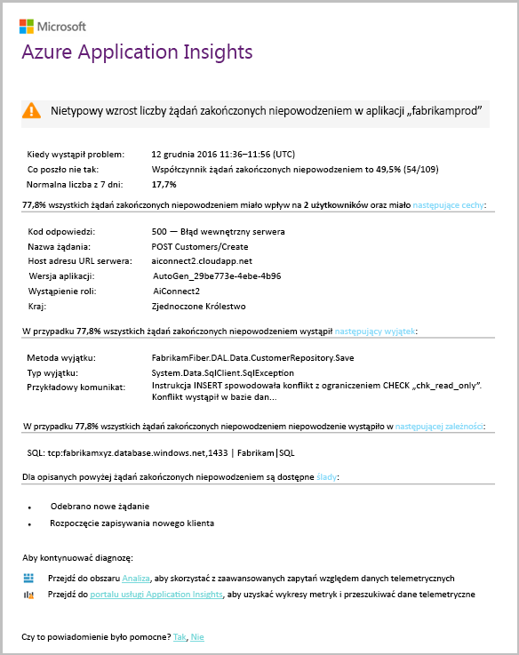

# Omówienie usługi Application Insights dla opracowywania oprogramowaniaOverview of Application Insights for DevOps

Z [usługi Application Insights](app-insights-overview.md), można szybko znaleźć się, jak aplikacja działa i jest używany w przypadku na żywo.With [Application Insights](app-insights-overview.md), you can quickly find out how your app is performing and being used when it's live. W przypadku problemu go informuje o go, pomaga ocenić wpływ hello i pozwalają określić przyczynę hello.If there's a problem, it lets you know about it, helps you assess hello impact, and helps you determine hello cause.

Oto konta od zespołu rozwija aplikacji sieci web:Here's an account from a team that develops web applications:

* *"Kilku dni temu, wdrożyliśmy"drobna"poprawki. Firma Microsoft nie został uruchomiony przebiegu testowego szerokie, ale Niestety niektórych nieoczekiwane zmiany otrzymano scalone hello ładunek, co powoduje niezgodność między przodu hello i zaplecza. Natychmiast uruchamiany naszych alert wzrósł wyjątki serwera, i zostały wprowadziliśmy świadome sytuacji hello. Kilka kliknięć optymalizacji w portalu usługi Application Insights hello dotarliśmy wystarczających informacji z toonarrow callstacks wyjątek w dół hello problem. Firma Microsoft wycofana natychmiast i ograniczone hello uszkodzenia. Application Insights wprowadził ta część hello devops cykl bardzo łatwe i możliwością."**"A couple of days ago, we deployed a 'minor' hotfix. We didn't run a broad test pass, but unfortunately some unexpected change got merged into hello payload, causing incompatibility between hello front and back ends. Immediately, server exceptions surged, our alert fired, and we were made aware of hello situation. A few clicks away on hello Application Insights portal, we got enough information from exception callstacks toonarrow down hello problem. We rolled back immediately and limited hello damage. Application Insights has made this part of hello devops cycle very easy and actionable."*

W tym artykule możemy wykonaj zespołu w banku firmy Fabrikam, że osiąga hello online banków toosee systemu (OBS), jak używać usługi Application Insights tooquickly odpowiadają toocustomers i aktualizacje.In this article we follow a team in Fabrikam Bank that develops hello online banking system (OBS) toosee how they use Application Insights tooquickly respond toocustomers and make updates.  

Hello zespołu działa w cyklu opracowywania oprogramowania pokazana na następującej ilustracji hello:hello team works on a DevOps cycle depicted in hello following illustration:

Wymagania dotyczące źródła danych do ich programowanie zaległości (Lista zadań).Requirements feed into their development backlog (task list). Funkcje te działają w skrócie przebiegów, które często dostarczają oprogramowania pracy — zwykle w formie hello istniejącej aplikacji toohello ulepszenia i rozszerzenia.They work in short sprints, which often deliver working software - usually in hello form of improvements and extensions toohello existing application. aktywnej aplikacji Hello jest często aktualizowana o nowe funkcje.hello live app is frequently updated with new features. Mimo że jest na żywo, zespołu hello monitoruje wydajności i użycia za pomocą hello usługi Application Insights.While it's live, hello team monitors it for performance and usage with hello help of Application Insights. Źródła danych APM do ich zaległości programowanie.This APM data feeds back into their development backlog.

zespół Hello używa usługi Application Insights toomonitor hello sieci web aplikacji ściśle dla:hello team uses Application Insights toomonitor hello live web application closely for:

* Wydajność.Performance. Mają one toounderstand jak czas reakcji zależy od liczby żądań; ile procesora CPU, sieci, dysku i inne zasoby są używane; i gdzie hello wąskich gardeł.They want toounderstand how response times vary with request count; how much CPU, network, disk, and other resources are being used; and where hello bottlenecks are.
* Błędy.Failures. Jeśli istnieją wyjątki żądań zakończonych niepowodzeniem lub jeśli licznik wydajności nie jest poza zakresem doświadczenia, hello tooknow potrzeb zespołu szybko, aby potencjalnie akcji.If there are exceptions or failed requests, or if a performance counter goes outside its comfortable range, hello team needs tooknow rapidly so that they can take action.
* Użycie.Usage. Przypadku nową funkcję, zespołu hello mają tooknow toowhat zakresu, który jest używany i czy użytkownicy mają trudności z nim.Whenever a new feature is released, hello team want tooknow toowhat extent it is used, and whether users have any difficulties with it.

Ta funkcja pozwala skupić się na hello opinii część cyklu hello:Let's focus on hello feedback part of hello cycle:

## Wykryj niską dostępnościDetect poor availability
Marcela Markova jest starszy developer hello OBS zespołu i Trwa liderem hello monitorowania wydajności w trybie online.Marcela Markova is a senior developer on hello OBS team, and takes hello lead on monitoring online performance. Użytkownik konfiguruje kilka [testów dostępności](app-insights-monitor-web-app-availability.md):She sets up several [availability tests](app-insights-monitor-web-app-availability.md):

* Test adresu URL jednym hello strony głównej docelowej dla aplikacji hello http://fabrikambank.com/onlinebanking/.A single-URL test for hello main landing page for hello app, http://fabrikambank.com/onlinebanking/. Ustawia ona kryteria HTTP o kodzie 200 i tekst "Witaj!".She sets criteria of HTTP code 200 and text 'Welcome!'. W przypadku niepowodzenia tego testu jest poważny problem ze hello sieć, serwery hello lub może być problem wdrażania.If this test fails, there's something seriously wrong with hello network or hello servers, or maybe a deployment issue. (Lub ktoś zmienił hello Zapraszamy!(Or someone has changed hello Welcome! komunikat na stronie powitania bez umożliwienie jej znanych).message on hello page without letting her know.)
* Lepszy badanie wieloetapowych, loguje i pobiera bieżącego konta wyświetlania, sprawdzanie kilku szczegółów klucza na każdej stronie.A deeper multi-step test, which logs in and gets a current account listing, checking a few key details on each page. Ten test sprawdza, czy działa baza danych tego hello łączy toohello kont.This test verifies that hello link toohello accounts database is working. Używa identyfikatora klienta fikcyjne: niektóre z nich, które są obsługiwane dla celów testowych.She uses a fictitious customer id: a few of them are maintained for test purposes.

Te testy Konfigurowanie Marcela to pewność, że tego zespołu hello szybko dowiedzieć się o wszelkich awarii.With these tests set up, Marcela is confident that hello team will quickly know about any outage.  

Błędy wyświetlane jako czerwone kropki na wykresie testu sieci web hello:Failures show up as red dots on hello web test chart:

Ale co ważniejsze, alert o niezgodności wysyłany pocztą e-mail toohello zespół deweloperów.But more importantly, an alert about any failure is emailed toohello development team. W ten sposób wiedzą o tym przed hello niemal wszystkich klientów.In that way, they know about it before nearly all hello customers.

## Monitorowanie wydajnościMonitor Performance
Na stronie Przegląd hello w usłudze Application Insights jest wykres przedstawiający różnych [kluczowe metryki](app-insights-web-monitor-performance.md).On hello overview page in Application Insights, there's a chart that shows a variety of [key metrics](app-insights-web-monitor-performance.md).

Czas ładowania strony przeglądarki jest pochodną telemetrii wysyłane bezpośrednio ze stron sieci web.Browser page load time is derived from telemetry sent directly from web pages. Czas odpowiedzi serwera, liczba żądań na serwerze i liczba nieudanych żądań są wszystkie mierzony w powitania serwera sieci web i wysyłane tooApplication szczegółowych informacji z tego miejsca.Server response time, server request count, and failed request count are all measured in hello web server and sent tooApplication Insights from there.

Marcela jest nieco związane z powitania serwera odpowiedzi wykresu.Marcela is slightly concerned with hello server response graph. Ten wykres pokazuje średni czas powitania od kiedy hello serwer odbiera żądanie HTTP z przeglądarki użytkownika i kiedy zwraca odpowiedź hello.This graph shows hello average time between when hello server receives an HTTP request from a user's browser, and when it returns hello response. Jak obciążenia na powitania systemu nie jest toosee nietypowe zachowanie podczas zmiany na tym wykresie.It isn't unusual toosee a variation in this chart, as load on hello system varies. Jednak w takim przypadku wydaje się, że toobe korelacja małych wzrostu hello liczba żądań, a big wzrośnie hello czas odpowiedzi.But in this case, there seems toobe a correlation between small rises in hello count of requests, and big rises in hello response time. Który może wskazywać, że hello system działa tylko podczas pracy z maksymalną wydajnością.That could indicate that hello system is operating just at its limits.

Użytkownik otwiera hello wykresy serwerów:She opens hello Servers charts:

Prawdopodobnie toobe nie znak ograniczenia zasobów, dlatego może być nierówności hello na wykresach odpowiedzi serwera hello są właśnie zbieżność.There seems toobe no sign of resource limitation there, so maybe hello bumps in hello server response charts are just a coincidence.

## Ustaw alerty toomeet celeSet alerts toomeet goals
Niemniej jednak użytkownik chcieliby tookeep oka na powitania czasy odpowiedzi.Nevertheless, she'd like tookeep an eye on hello response times. Jeśli komputery przechodzą zbyt duże, chce tooknow informacji na ten temat natychmiast.If they go too high, she wants tooknow about it immediately.

Dlatego użytkownik ustawia [alert](app-insights-metrics-explorer.md), dla większy niż próg typowy czas odpowiedzi.So she sets an [alert](app-insights-metrics-explorer.md), for response times greater than a typical threshold. Dzięki temu jej pewność, że użytkownik będzie wiadomo o nim gdy czas reakcji wolno.This gives her confidence that she'll know about it if response times are slow.

Alerty można ustawić na różnych innych metryk.Alerts can be set on a wide variety of other metrics. Na przykład można otrzymywać wiadomości e-mail, jeśli wzrośnie liczba wyjątków hello lub niski przechodzi hello dostępnej pamięci lub brak szczytu w żądań klientów.For example, you can receive emails if hello exception count becomes high, or hello available memory goes low, or if there is a peak in client requests.

## Poinformują Cię o alerty o wykryciu inteligentneStay informed with Smart Detection Alerts
Następnego dnia alertów e-mail odbierane z usługi Application Insights.Next day, an alert email does arrive from Application Insights. Jednak gdy użytkownik otwiera, użytkownik stwierdza, że nie jest alertu czasu odpowiedzi hello ona ustawiona.But when she opens it, she finds it isn't hello response time alert that she set. Zamiast tego informuje o tym jej czy został nagły wzrost nieudanych żądań — to znaczy żądań, które zwrócone kodów błędu 500 lub więcej.Instead, it tells her there's been a sudden rise in failed requests - that is, requests that have returned failure codes of 500 or more.

Żądań zakończonych niepowodzeniem są, gdzie umieścić błąd — zwykle po wyjątek w kodzie hello użytkowników.Failed requests are where users have seen an error - typically following an exception thrown in hello code. Może być zobaczy komunikat informujący o tym "Niestety nie można teraz zaktualizować szczegóły".Maybe they see a message saying "Sorry we couldn't update your details right now." Lub bezwzględną najgorszy Zakłopotanie, zrzut stosu wydaje na ekranie powitania użytkownika dzięki uprzejmości: hello serwera sieci web.Or, at absolute embarrassing worst, a stack dump appears on hello user's screen, courtesy of hello web server.

Ten alert jest zaskoczeniem, ponieważ hello czasu, gdy użytkownik przeglądał, hello nie powiodło się żądanie count była encouragingly niski.This alert is a surprise, because hello last time she looked at it, hello failed request count was encouragingly low. Mała liczba błędów jest toobe oczekiwane na serwerze zajęty.A small number of failures is toobe expected in a busy server.

Również nieco zaskoczeniem dla jej ponieważ użytkownik nie ma tooconfigure ten alert.It was also a bit of a surprise for her because she didn't have tooconfigure this alert. Usługa Application Insights obejmują wykrywanie inteligentne.Application Insights include Smart Detection. Automatycznie dostosowuje tooyour aplikacji zwykle awarii wzorzec, "jest używany do" błędy i na konkretnej stronie, lub wysokie obciążenie albo połączonego tooother metryki.It automatically adjusts tooyour app's usual failure pattern, and "gets used to" failures on a particular page, or under high load, or linked tooother metrics. Uruchamia hello alarm tylko wtedy, gdy wzrost powyżej jakie pochodzi tooexpect.It raises hello alarm only if there's a rise above what it comes tooexpect.

Jest to bardzo przydatne wiadomości e-mail.This is a very useful email. Go nie tylko podnieść alarmu.It doesn't just raise an alarm. Robi zbyt wiele hello klasyfikacji i diagnostycznych pracy.It does a lot of hello triage and diagnostic work, too.

Przedstawia on dotyczy ilu użytkowników i strony sieci web lub operacji.It shows how many customers are affected, and which web pages or operations. Marcela można zdecydować, czy potrzebuje tooget hello całego zespołu pracujących na tym, jak szczegółowego fire, lub czy można go zignorować dopiero w następnym tygodniu.Marcela can decide whether she needs tooget hello whole team working on this as a fire drill, or whether it can be ignored until next week.

Hello poczty e-mail zawiera także określonego wyjątek wystąpił, czy - jeszcze bardziej interesującego — awarii hello jest skojarzony z określoną bazę danych tooa wywołania nie powiodło się.hello email also shows that a particular exception occurred, and - even more interesting - that hello failure is associated with failed calls tooa particular database. W tej sekcji wyjaśniono, dlaczego błędów hello nagle pojawił się nawet zespołu w Marcela ostatnio nie wdrożono żadnych aktualizacji.This explains why hello fault suddenly appeared even though Marcela's team has not deployed any updates recently.

Wiodącymi hello polecenia ping Marcella hello zespołu bazy danych na podstawie tej wiadomości e-mail.Marcella pings hello leader of hello database team based on this email. Użytkownik uzyskuje informacje o ich zwolnienie poprawki w hello ostatnich pół godziny; i Niestety, może być mogło być zmiany schematu pomocnicza...She learns that they released a hot fix in hello past half hour; and Oops, maybe there might have been a minor schema change....

Dlatego hello problem znajduje się na toobeing sposób hello stałej, nawet przed badania dzienników i w ciągu 15 minut, jego wynikające.So hello problem is on hello way toobeing fixed, even before investigating logs, and within 15 minutes of it arising. Jednak Marcela kliknie hello łącze tooopen usługi Application Insights.However, Marcela clicks hello link tooopen Application Insights. Użytkownik może uzyskać bazy danych nie powiodło się wywołanie hello skojarzone liście wywołania zależności i otwiera bezpośrednio na żądanie nie powiodło się.It opens straight onto a failed request, and she can see the failed database call in hello associated list of dependency calls.

## Wykryj wyjątkówDetect exceptions
Z niewielki instalacji [wyjątki](app-insights-asp-net-exceptions.md) są automatycznie zgłoszony tooApplication szczegółowych informacji.With a little bit of setup, [exceptions](app-insights-asp-net-exceptions.md) are reported tooApplication Insights automatically. One również można przechwycić jawnie przez zbyt Wstawianie wywołania[funkcji TrackException()](app-insights-api-custom-events-metrics.md#trackexception) hello kodu:They can also be captured explicitly by inserting calls too[TrackException()](app-insights-api-custom-events-metrics.md#trackexception) into hello code:  

    var telemetry = new TelemetryClient();
    ...
    try
    { ...
    }
    catch (Exception ex)
    {
       // Set up some properties:
       var properties = new Dictionary <string, string>
         {{"Game", currentGame.Name}};

       var measurements = new Dictionary <string, double>
         {{"Users", currentGame.Users.Count}};

       // Send hello exception telemetry:
       telemetry.TrackException(ex, properties, measurements);
    }

zespołu Fabrikam Bank Hello powstał praktyki hello zawsze wysyłania danych telemetrycznych z powodu wyjątku braku oczywista odzyskiwania.hello Fabrikam Bank team has evolved hello practice of always sending telemetry on an exception, unless there's an obvious recovery.  

W rzeczywistości jest szersze niż ich strategii: wysyłają dane telemetryczne w każdej sytuacji, gdy powitania klienta są sfrustrowani, w jaki chcieli toodo, czy odpowiadający mu tooan wyjątek w kodzie hello, lub nie.In fact, their strategy is even broader than that: They send telemetry in every case where hello customer is frustrated in what they wanted toodo, whether it corresponds tooan exception in hello code or not. Na przykład jeśli system zewnętrzny transferu między bank hello zwraca komunikat "nie można ukończyć tej transakcji" jakiegoś powodu operacyjne (nie odporności powitania klienta) następnie śledzą tego zdarzenia.For example, if hello external inter-bank transfer system returns a "can't complete this transaction" message for some operational reason (no fault of hello customer) then they track that event.

    var successCode = AttemptTransfer(transferAmount, ...);
    if (successCode < 0)
    {
       var properties = new Dictionary <string, string>
            {{ "Code", returnCode, ... }};
       var measurements = new Dictionary <string, double>
         {{"Value", transferAmount}};
       telemetry.TrackEvent("transfer failed", properties, measurements);
    }

TrackException jest używane tooreport wyjątki, ponieważ wysyła kopię stosu hello.TrackException is used tooreport exceptions because it sends a copy of hello stack. TrackEvent jest tooreport używane inne zdarzenia.TrackEvent is used tooreport other events. Możesz dołączyć wszystkie właściwości, które mogą być przydatne do rozpoznania.You can attach any properties that might be useful in diagnosis.

Wyjątki i zdarzenia wyświetlane w hello [diagnostycznych wyszukiwania](app-insights-diagnostic-search.md) bloku.Exceptions and events show up in hello [Diagnostic Search](app-insights-diagnostic-search.md) blade. Można przejść do szczegółów w nich toosee hello dodatkowe właściwości i ślad stosu.You can drill into them toosee hello additional properties and stack trace.

## Aktywne monitorowanieMonitor proactively
Marcela nie tylko znajdują się wokół oczekiwanie na alerty.Marcela doesn't just sit around waiting for alerts. Wkrótce po każdym ponownego wdrażania, klika przedstawia [czas reakcji](app-insights-web-monitor-performance.md) — zarówno hello ogólną rysunek i liczby tabeli hello najwolniejsze żądania, a także wyjątek.Soon after every redeployment, she takes a look at [response times](app-insights-web-monitor-performance.md) - both hello overall figure and hello table of slowest requests, as well as exception counts.  

Użytkownik ocenić wpływ na wydajność hello każdego wdrożenia zwykle porównanie każdej tydzień z hello ostatnio.She can assess hello performance effect of every deployment, typically comparing each week with hello last. W przypadku nagłego pogorszenia, klika który zgłasza z deweloperami odpowiednich hello.If there's a sudden worsening, she raises that with hello relevant developers.

## Klasyfikacji problemówTriage issues
Klasyfikacja — ocenę ważności hello i zakres problem — jest pierwszym krokiem hello po wykryciu.Triage - assessing hello severity and extent of a problem - is hello first step after detection. Należy nazywamy limit zespołu hello o północy?Should we call out hello team at midnight? Lub może on pozostać do hello dalej wygodny przerwa w hello zaległości?Or can it be left until hello next convenient gap in hello backlog? Istnieją pewne ważne pytania w klasyfikacji.There are some key questions in triage.

Jak często jest wykonywane? Wykresy Hello w bloku omówienie hello nadaj pewien problem tooa perspektywy.How often is it happening? hello charts on hello Overview blade give some perspective tooa problem. Na przykład hello aplikacji firmy Fabrikam wygenerowanych cztery alerty testu sieci web co noc.For example, hello Fabrikam application generated four web test alerts one night. Spojrzenie na wykresie hello w rano hello, zespołu hello mogliby zobaczyć wystąpiły w rzeczywistości niektóre czerwone kropki, jakby nadal większość hello testy zostały zielony.Looking at hello chart in hello morning, hello team could see that there were indeed some red dots, though still most of hello tests were green. Przechodzenia do wykresu dostępności hello szczegółów, jest jasne, czy zostały wszystkie te sporadyczne problemy z lokalizacji jeden test.Drilling into hello availability chart, it was clear that all of these intermittent problems were from one test location. Oczywiście była wpływające na tylko jedną trasę problem z siecią i najprawdopodobniej będzie wyczyść samej siebie.This was obviously a network issue affecting only one route, and would most likely clear itself.  

Z kolei znacznej i stabilnego wzrost wykres hello liczby wyjątków lub czas odpowiedzi to oczywiście element toopanic o.By contrast, a dramatic and stable rise in hello graph of exception counts or response times is obviously something toopanic about.

Działanie przydatne Klasyfikacja jest spróbuj ją samodzielnie.A useful triage tactic is Try It Yourself. Jeśli napotkasz hello sam problem, wiadomo, jest prawdziwe.If you run into hello same problem, you know it's real.

Jaka część użytkowników dotyczy? tooobtain nierównej odpowiedzi, dzielenia współczynnik awaryjności hello przez hello liczba sesji.What fraction of users are affected? tooobtain a rough answer, divide hello failure rate by hello session count.

W przypadku odpowiedzi powolne porównania tabeli hello najwolniejsze odpowiada żądań z hello użycia częstotliwość każdej strony.When there are slow responses, compare hello table of slowest-responding requests with hello usage frequency of each page.

Jak ważna jest scenariusz hello zablokowane?How important is hello blocked scenario? Jeśli jest to problem funkcjonalności blokuje konkretnego scenariusza, czy ma znaczenie znacznie?If this is a functional problem blocking a particular user story, does it matter much? Jeśli klienci nie mogą ich rachunków, jest to poważny; Jeśli nie mogą zmieniać swoje preferencje kolorów ekranu, może być go wykonać.If customers can't pay their bills, this is serious; if they can't change their screen color preferences, maybe it can wait. Witaj szczegółów zdarzenia hello lub wyjątek lub tożsamości hello hello powolne strony, informuje, gdy występują problemy dotyczące klientów.hello detail of hello event or exception, or hello identity of hello slow page, tells you where customers are having trouble.

## Diagnozowanie problemówDiagnose issues
Diagnostyka nie jest dość hello jak w przypadku debugowania.Diagnosis isn't quite hello same as debugging. Przed rozpoczęciem śledzenia hello kod powinien mieć wstępne informacje o tym, dlaczego, gdzie i kiedy występuje problem hello.Before you start tracing through hello code, you should have a rough idea of why, where and when hello issue is occurring.

**Gdy jest wykonywana?**  hello widok historycznych podał wykresów zdarzenia i metryki hello umożliwia łatwe toocorrelate efekty z możliwych przyczyn.**When does it happen?** hello historical view provided by hello event and metric charts makes it easy toocorrelate effects with possible causes. Jeśli występują sporadyczne pików kursów czas lub wyjątku odpowiedzi, obejrzyj liczbę żądań hello: jeśli jego pików na powitania sam czasu, a następnie prawdopodobnie problem z zasobów.If there are intermittent peaks in response time or exception rates, look at hello request count: if it peaks at hello same time, then it looks like a resource problem. Potrzebujesz tooassign więcej procesorów ani pamięci?Do you need tooassign more CPU or memory? Czy jest zależność, która nie może zarządzać hello obciążenia?Or is it a dependency that can't manage hello load?

**Jest to nam?****Is it us?**  Ma gwałtowny spadek wydajności danego typu żądania — na przykład gdy hello odbiorca chce otrzymywać instrukcji konta -, istnieje możliwość może być zewnętrzny podsystemu zamiast aplikacji sieci web.If you have a sudden drop in performance of a particular type of request - for example when hello customer wants an account statement - then there's a possibility it might be an external subsystem rather than your web application. W Eksploratorze metryk wybierz współczynnik awaryjności zależności hello i czas trwania zależności stawki i porównywanie ich historii hello poza kilka godzin lub dni w przypadku problemu hello zostało wykryte.In Metrics Explorer, select hello Dependency Failure rate and Dependency Duration rates and compare their histories over hello past few hours or days with hello problem you detected. Jeśli są korelowanie zmiany, zewnętrznych podsystemu może być tooblame.If there are correlating changes, then an external subsystem might be tooblame.  

Niektóre problemy powolne zależności są problemy używanie funkcji geolokalizacji.Some slow dependency issues are geolocation problems. Bank firmy Fabrikam używa maszyn wirtualnych platformy Azure i wykryte, że ma przypadkowo się one serwera sieci web i serwer kont w różnych krajach.Fabrikam Bank uses Azure virtual machines, and discovered that they had inadvertently located their web server and account server in different countries. Znacznej poprawy został przełączony w tryb przy użyciu funkcji migracji jeden z nich.A dramatic improvement was brought about by migrating one of them.

**Do czego możemy?****What did we do?** Jeśli hello problem nie zostanie wyświetlone toobe w zależności, a jeśli go nie zawsze istnieje, prawdopodobnie jest spowodowany przez ostatnich zmian.If hello issue doesn't appear toobe in a dependency, and if it wasn't always there, it's probably caused by a recent change. Hello historycznych perspektywy podał hello wykresy metryk i zdarzeń umożliwia łatwe toocorrelate nagły zmiany z wdrożeniami.hello historical perspective provided by hello metric and event charts makes it easy toocorrelate any sudden changes with deployments. Który zawęża hello Wyszukaj hello problem.That narrows down hello search for hello problem.

**Co się dzieje?****What's going on?** Niektóre problemy występują rzadko i może być trudne tootrack dół testując w trybie offline.Some problems occur only rarely and can be difficult tootrack down by testing offline. Wszystko, co można zrobić jest tootry toocapture hello błąd, jeśli występuje on na żywo.All we can do is tootry toocapture hello bug when it occurs live. Możesz sprawdzić hello zrzuty stosu w raportach wyjątku.You can inspect hello stack dumps in exception reports. Ponadto można napisać śledzenia wywołań, Twoje struktury rejestrowania ulubionych albo TrackTrace() lub funkcji TrackEvent().In addition, you can write tracing calls, either with your favorite logging framework or with TrackTrace() or TrackEvent().  

Firma Fabrikam miał problem tymczasowy w przypadku transferów między kontami, ale tylko w przypadku niektórych typów kont.Fabrikam had an intermittent problem with inter-account transfers, but only with certain account types. lepsze toounderstand została co dzieje, ich wstawione wywołania TrackTrace() w najważniejszych w kodzie hello dołączanie hello typu konta jako wywołanie tooeach właściwości.toounderstand better what was happening, they inserted TrackTrace() calls at key points in hello code, attaching hello account type as a property tooeach call. Który wprowadzone go łatwo toofilter się tylko te dane śledzenia w wyszukiwaniu diagnostycznych.That made it easy toofilter out just those traces in Diagnostic Search. Wartości parametrów one również dołączone jako właściwości i środki toohello śledzenie wywołań.They also attached parameter values as properties and measures toohello trace calls.

## Odpowiedź toodiscovered problemówRespond toodiscovered issues
Gdy po zdiagnozowaniu problemu hello, możesz wprowadzić toofix planu go.Once you've diagnosed hello issue, you can make a plan toofix it. Może być konieczne tooroll ponownie zmiany lub może być można po prostu przejdź dalej i rozwiąż problem.Maybe you need tooroll back a recent change, or maybe you can just go ahead and fix it. Po zakończeniu poprawka hello usługi Application Insights informuje, czy powiodło się.Once hello fix is done, Application Insights tells you whether you succeeded.  

Zespół deweloperów Fabrikam Bank zająć więcej podejście tooperformance pomiaru niż kiedyś toobefore używały usługi Application Insights.Fabrikam Bank's development team take a more structured approach tooperformance measurement than they used toobefore they used Application Insights.

* Na stronie przeglądu usługi Application Insights hello one wyznaczać cele pod względem określonej miary.They set performance targets in terms of specific measures in hello Application Insights overview page.
* Projekt miary wydajności do aplikacji hello od początku hello, takich jak hello metryki pomiaru postępu użytkownika za pośrednictwem "lejki."They design performance measures into hello application from hello start, such as hello metrics that measure user progress through 'funnels.'  

## Monitorowanie aktywności użytkownikaMonitor user activity
Gdy czas odpowiedzi jest stale prawidłowy i istnieje kilka wyjątków, zespół deweloperów hello może zająć toousability.When response time is consistently good and there are few exceptions, hello dev team can move on toousability. Można traktować jak tooimprove hello użytkowników i sposób tooencourage więcej użytkowników tooachieve hello potrzeby celów.They can think about how tooimprove hello users' experience, and how tooencourage more users tooachieve hello desired goals.

Usługi Application Insights mogą być również używane toolearn, czy użytkownicy z aplikacją.Application Insights can also be used toolearn what users do with an app. Po uruchomieniu sprawnie, co użytkowników, takich jak lub mieć trudności z i jak często wracają zespołu hello chcieliby tooknow funkcji, które są najbardziej popularnych hello.Once it's running smoothly, hello team would like tooknow which features are hello most popular, what users like or have difficulty with, and how often they come back. Która będzie ułatwiała ich priorytety nadchodzących pracy.That will help them prioritize their upcoming work. I ich zaplanować Powodzenie hello toomeasure każdej funkcji jako część hello programowanie cyklu.And they can plan toomeasure hello success of each feature as part of hello development cycle. 

Na przykład za pośrednictwem witryny sieci web hello podróży typowy użytkownik ma Wyczyść "lejka."For example, a typical user journey through hello web site has a clear "funnel." Wielu klientów przyjrzeć się stawki hello różnego rodzaju pożyczki.Many customers look at hello rates of different types of loan. Mniejsza liczba Przejdź toofill w postaci oferty hello.A smaller number go on toofill in hello quotation form. Tych, którzy pobrać oferty kilka Przejdź dalej i wyjmij hello pożyczki.Of those who get a quotation, a few go ahead and take out hello loan.

Biorąc pod uwagę, gdy hello największej liczby klientów porzucić, hello business można pracować się jak tooget więcej użytkowników za pomocą toohello dołu hello lejkowy.By considering where hello greatest numbers of customers drop out, hello business can work out how tooget more users through toohello bottom of hello funnel. W niektórych przypadkach może być błąd środowiska (UX) użytkownika — na przykład przycisk 'Dalej' hello jest toofind twardym lub instrukcje hello nie są oczywiste.In some cases, there might be a user experience (UX) failure - for example, hello 'next' button is hard toofind, or hello instructions aren't obvious. Bardziej prawdopodobne są bardziej znaczących powodów biznesowych do listy dokumentów: może być stawki pożyczki hello są zbyt duże.More likely, there are more significant business reasons for drop-outs: maybe hello loan rates are too high.

Niezależnie od przyczyn hello danych hello pomaga zespołu hello wyglądają co robią użytkownicy.Whatever hello reasons, hello data helps hello team work out what users are doing. Więcej śledzenia wywołania mogą być wstawiane toowork szczegółowe.More tracking calls can be inserted toowork out more detail. Funkcji TrackEvent() mogą być używane toocount wszystkie akcje użytkownika z hello dokładniej z klika przycisk poszczególnych, osiągnięć toosignificant, takich jak płatności poza pożyczki.TrackEvent() can be used toocount any user actions, from hello fine detail of individual button clicks, toosignificant achievements such as paying off a loan.

zespół Hello otrzymuje toohaving używane informacje dotyczące działań użytkownika.hello team is getting used toohaving information about user activity. Dzisiaj zawsze, gdy projekt nową funkcję, działają się, jak będzie uzyskują swoją opinię na temat jej użycia.Nowadays, whenever they design a new feature, they work out how they will get feedback about its usage. Projekt śledzenia wywołań funkcji powitania od początku hello.They design tracking calls into hello feature from hello start. One funkcja hello opinii tooimprove hello w każdym cyklu programowania.They use hello feedback tooimprove hello feature in each development cycle.

[Przeczytaj więcej na temat śledzenia użycia](app-insights-usage-overview.md).[Read more about tracking usage](app-insights-usage-overview.md).

## Zastosuj hello cyklu opracowywania oprogramowaniaApply hello DevOps cycle
To jest tak jak jedno użycie zespołu usługi Application Insights nie tylko toofix poszczególne problemy, ale tooimprove ich cyklu programistycznym.So that's how one team use Application Insights not just toofix individual issues, but tooimprove their development lifecycle. Mam nadzieję, że jej została podana sugestii dotyczących sposobu usługi Application Insights ułatwia zarządzanie aplikacjami wydajności w aplikacjach.I hope it has given you some ideas about how Application Insights can help you with application performance management in your own applications.

## Połączenia wideoVideo

> [!VIDEO https://channel9.msdn.com/events/Connect/2016/112/player]

## Następne krokiNext steps
Możesz rozpocząć pracę na kilka sposobów, w zależności od właściwości hello aplikacji.You can get started in several ways, depending on hello characteristics of your application. Wybierz, co dogodny:Pick what suits you best:

* [Aplikacja sieci web ASP.NETASP.NET web application](app-insights-asp-net.md)
* [Aplikacja sieci web JavaJava web application](app-insights-java-get-started.md)
* [Aplikacja sieci web node.jsNode.js web application](app-insights-nodejs.md)
* Już wdrożone aplikacje hostowane na [IIS](app-insights-monitor-web-app-availability.md), [J2EE](app-insights-java-live.md), lub [Azure](app-insights-azure.md).Already deployed apps, hosted on [IIS](app-insights-monitor-web-app-availability.md), [J2EE](app-insights-java-live.md), or [Azure](app-insights-azure.md).
* [Strony sieci Web](app-insights-javascript.md) -jednej strony, aplikacji lub strony sieci web zwykłej — Użyj tej samodzielnie lub w tooany dodanie hello opcji serwera.[Web pages](app-insights-javascript.md) - Single Page App or ordinary web page - use this on its own or in addition tooany of hello server options.
* [Badania dostępności](app-insights-monitor-web-app-availability.md) tootest aplikacji z hello publicznej sieci internet.[Availability tests](app-insights-monitor-web-app-availability.md) tootest your app from hello public internet.
