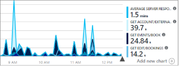

# Co to jest usługa Application Insights?
Usługa Application Insights jest rozszerzalną usługą zarządzania wydajnością aplikacji (APM) dla deweloperów sieci Web na wielu platformach. Użyj go toomonitor aplikacji sieci web na żywo. Usługa automatycznie wykryje nieprawidłowości w zakresie wydajności. Obejmuje on analytics zaawansowanych narzędzi toohelp diagnozować problemy i toounderstand co użytkownicy faktycznie wykonać za pomocą aplikacji.  Zaprojektowano go toohelp stale zwiększyć wydajność i użyteczność. Działa w przypadku aplikacji na różnych platformach w tym .NET, Node.js i J2EE obsługiwanego lokalnie lub w chmurze hello. Integruje się z procesu opracowywania oprogramowania i zawiera punkty połączenia tooa różnych narzędzi programistycznych.

[Spójrz na powitania wprowadzenie animacji](https://www.youtube.com/watch?v=fX2NtGrh-Y0).

## Jak działa usługa Application Insights?
Instalowanie pakietu małych Instrumentacji w aplikacji i skonfigurować zasobu usługi Application Insights w portalu Microsoft Azure hello. Instrumentacja Hello monitoruje aplikację i wysyła portalu toohello danych telemetrycznych. (aplikacji hello można uruchamiane w dowolnym miejscu — nie ma toobe hostowana na platformie Azure).

Instrumentacja nie tylko aplikacji usługi sieci web hello, ale również wszystkich składników tła i hello JavaScript na stronach sieci web hello samodzielnie. 

Ponadto można umieścić w danych telemetrycznych ze środowisk hosta hello, takie jak liczniki wydajności, Diagnostyka Azure lub dzienniki Docker. Można również skonfigurować testów sieci web, które okresowo wysyłają żądania syntetycznych tooyour usługi sieci web.

Witaj wszystkich tych strumieni dane telemetryczne są zintegrowane w portalu Azure, w którym możesz zastosować zaawansowane analityczne i danych pierwotnych toohello narzędzia wyszukiwania.

### Co to jest zmniejszenie hello?
Witaj wpływ na wydajność aplikacji jest bardzo mała. Wywołania śledzenia nie powodują blokowania oraz są łączone w partie i wysłane w oddzielnym wątku.

## Co monitoruje usługa Application Insights?

Usługa Application Insights jest celem hello zespół deweloperów, toohelp zrozumieć, jak aplikacja działa prawidłowo, i jak jest używany. Monitoruje ona:

* **Liczby żądań, czasy reakcji i współczynniki błędów** — dowiedz się, które strony są najbardziej popularne, o jakiej porze dnia i gdzie są Twoi użytkownicy. Zobacz, które strony działają najlepiej. Jeśli Twoje czasy odpowiedzi i częstotliwości awarii są duże, gdy jest więcej żądań, być może masz problem z zasobami. 
* **Współczynniki zależności, czasy reakcji i współczynniki błędów** — dowiedz się, czy usługi zewnętrzne nie spowalniają pracy.
* **Wyjątki** — analizuje statystyki hello zagregowane, lub wybierz określone wystąpienia i przejść do szczegółów w hello ślad stosu i powiązane żądań. Są zgłaszane zarówno wyjątki serwera, jak i przeglądarki.
* **Wydajność ładowania i wyświetleń stron** — zgłoszona przez przeglądarki użytkowników.
* **Wywołania AJAX** ze stron sieci Web — liczba, czasy reakcji i współczynniki błędów.
* **Liczby użytkowników i sesji**.
* **Liczniki wydajności** z serwerów systemu Windows lub Linux, takie jak użycie procesora CPU, pamięci i sieci. 
* **Diagnostyka hosta** z platformy Docker lub Azure. 
* **Diagnostyczne dzienniki śledzenia** z Twojej aplikacji — dzięki temu możesz skorelować zdarzenia śledzenia z żądaniami.
* **Niestandardowe zdarzenia i metryki** napisanie samodzielnie powitania klienta lub serwera kodu tootrack zdarzeń biznesowych takich jak elementy sprzedaży lub gier kupione.

## Gdzie mogę zobaczyć swoją telemetrię?

Istnieje wiele sposobów tooexplore danych. Zapoznaj się z następującymi artykułami:

|  |  |
| --- | --- |
| [**Inteligentne wykrywanie i ręczne alerty**](app-insights-proactive-diagnostics.md) Automatyczne alerty dostosowania aplikacji tooyour normalne wzorców telemetrii i wyzwalacza, gdy coś poza wzorzec zwykle hello jest. Możesz też [ustawić alerty](app-insights-alerts.md) dla konkretnych poziomów metryk niestandardowych lub standardowych. | |
| [**Mapa aplikacji**](app-insights-app-map.md) składniki Hello aplikacji, za pomocą kluczowych metryk i alerty. |  |
| [**Profiler**](app-insights-profiler.md) Sprawdź, czy profile wykonywania hello próbki żądań. | |
| [**Analiza użycia**](app-insights-usage-overview.md) Analiza segmentacji i utrzymywania użytkowników.| |
| [**Wyszukiwanie diagnostyczne danych dla wystąpienia**](app-insights-diagnostic-search.md) Wyszukiwanie i filtrowanie zdarzeń, takich jak żądania, wyjątki, wywołania zależności, dzienniki śledzenia i wyświetlenia stron.  | |
| [**Eksplorator metryk dla danych zagregowanych**](app-insights-metrics-explorer.md) Eksploruj, filtruj i segmentuj zagregowane dane, takie jak liczby żądań, błędów i wyjątków, czasy reakcji, czasy ładowania stron. | |
| [**Pulpity nawigacyjne**](app-insights-dashboards.md#dashboards) Połącz dane z wielu zasobów i udostępnij innym osobom. Doskonały dla wielu składnika aplikacji i ciągłe wyświetlaną w pokoju zespołu hello. | |
| [**Transmisja strumieniowa metryk na żywo**](app-insights-live-stream.md) Podczas wdrażania nowej kompilacji, obejrzyj te wskaźniki wydajności w pobliżu czasie rzeczywistym toomake się, że wszystko działa zgodnie z oczekiwaniami. | |
| [**Analiza**](app-insights-analytics.md) Odpowiedz na trudne pytania dotyczące wydajności i użycia Twojej aplikacji za pomocą tego zaawansowanego języka zapytań. | |
| [**Program Visual Studio**](app-insights-visual-studio.md) Dane wydajności w kodzie hello widoczne. Przechodzenie toocode z śladów stosu.| |
| [**Debuger migawek**](app-insights-snapshot-debugger.md) Debuguje próbki migawek pobrane z operacji na żywo, używając wartości parametrów.| |
| [**Power BI**](app-insights-export-power-bi.md) Integruje metryki użycia z innymi analizami biznesowymi.| |
| [**Interfejs API REST**](https://dev.applicationinsights.io/) Napisać kod zapytania toorun nad metryki i dane pierwotne.|  |
| [**Eksport ciągły**](app-insights-export-telemetry.md) Zbiorcze eksportu toostorage danych pierwotnych, natychmiast po dostarczeniu. | |

## Jak mogę używać usługi Application Insights?

### Monitorowanie
Zainstaluj usługę Application Insights w swojej aplikacji, skonfiguruj [testy sieci Web dostępności](app-insights-monitor-web-app-availability.md) oraz:

* Konfigurowanie [pulpitu nawigacyjnego](app-insights-dashboards.md) w Twojej tookeep pokoju zespołu usługi oka na obciążenia, elastyczność i wydajność hello zależności stronie obciążenia i wywołania AJAX.
* Odnajdywanie hello najwolniejsze i większość Niepowodzenie żądania.
* Obejrzyj [strumień na żywo](app-insights-live-stream.md) podczas wdrażania nowej wersji tooknow natychmiast o obniżenia.

### Wykrywanie, diagnozowanie
Po odebraniu alertu lub odnalezieniu problemu:

* Oceń, na ilu użytkowników ma to wpływ.
* Skoreluj błędy z wyjątkami, wywołaniami i śledzeniem zależności.
* Sprawdź profilera, migawki, zrzuty stosu i dzienniki śledzenia.

### Kompilowanie, mierzenie, poznawanie
[Przeszukiwarki hello](app-insights-usage-overview.md) każdej nowej funkcji wdrażania.

* Planowanie toomeasure używania nowego środowiska użytkownika lub funkcji biznesowych.
* Zapisz niestandardową telemetrię do kodu.
* Programowanie dalej hello podstawowy cykl na dowód twardym z telemetrii.

## Rozpoczęcie pracy
Usługa Application Insights jest jedną z wielu usług hostowanych w Microsoft Azure i dane telemetryczne są wysyłane analizy i prezentacji hello. Dlatego przed wykonaniem jakichkolwiek innych czynności potrzebujesz subskrypcji zbyt[Microsoft Azure](http://azure.com). Jest bezpłatna toosign i wybranie opcji hello podstawowe [cenową planu](https://azure.microsoft.com/pricing/details/application-insights/) z usługi Application Insights jest bezpłatna dopóki aplikacja zwiększył toohave znaczne obciążenie. Jeśli Twoja organizacja już ma subskrypcję, ich można dodać użytkownika tooit konta Microsoft.

Istnieje kilka sposobów tooget uruchomiona. Zacznij od tego, co najlepiej sprawdza się w Twoim przypadku. Można dodać inne hello później.

* **W czasie wykonywania: Instrumentacja aplikacji sieci web na powitania serwera.** Unika się dowolny kod toohello aktualizacji. Należy serwera tooyour dostępu administracyjnego.
  * [**Usługi IIS lokalnie lub na maszynie wirtualnej**](app-insights-monitor-performance-live-website-now.md)
  * [**Aplikacja sieci Web lub maszyna wirtualna na platformie Azure**](app-insights-monitor-performance-live-website-now.md)
  * [**J2EE**](app-insights-java-live.md)
* **W czasie opracowywania: Dodaj kod tooyour usługi Application Insights.** Umożliwia toowrite telemetrii i tooinstrument zaplecza i klasycznych aplikacji niestandardowych.
  * [Program Visual Studio](app-insights-asp-net.md) 2013 Update 2 lub nowszy.
  * Język Java w środowisku [Eclipse](app-insights-java-eclipse.md) lub [innych narzędziach](app-insights-java-get-started.md)
  * [Node.js](app-insights-nodejs.md)
  * [Inne platformy](app-insights-platforms.md)
* **[Instrumentacja stron sieci Web](app-insights-javascript.md)** dla widoku strony, wywołań AJAX i innych telemetrii po stronie klienta.
* **[Testy dostępności](app-insights-monitor-web-app-availability.md)** — regularnie używaj polecenia ping dla witryny sieci Web z naszych serwerów.

## Następne kroki
Rozpocznij pracę w czasie wykonywania za pomocą rozwiązań:

* [Serwer usług IIS](app-insights-monitor-performance-live-website-now.md)
* [Serwer J2EE](app-insights-java-live.md)

Rozpocznij pracę w czasie programowania za pomocą rozwiązań:

* [ASP.NET](app-insights-asp-net.md)
* [Java](app-insights-java-get-started.md)
* [Node.js](app-insights-nodejs.md)

## Pomoc techniczna i opinie
* Pytania i problemy:
  * [Rozwiązywanie problemów][qna]
  * [Forum MSDN](https://social.msdn.microsoft.com/Forums/vstudio/home?forum=ApplicationInsights)
  * [StackOverflow](http://stackoverflow.com/questions/tagged/ms-application-insights)
* Twoje sugestie:
  * [UserVoice](https://visualstudio.uservoice.com/forums/357324)
* Blog:
  * [Blog usługi Application Insights](https://azure.microsoft.com/blog/tag/application-insights)

## Filmy wideo

> [!VIDEO https://channel9.msdn.com/events/Connect/2016/100/player] 

<!--Link references-->

[android]: https://github.com/Microsoft/ApplicationInsights-Android
[azure]: ../insights-perf-analytics.md
[client]: app-insights-javascript.md
[desktop]: app-insights-windows-desktop.md
[detect]: app-insights-detect-triage-diagnose.md
[greenbrown]: app-insights-asp-net.md
[ios]: https://github.com/Microsoft/ApplicationInsights-iOS
[java]: app-insights-java-get-started.md
[knowUsers]: app-insights-web-track-usage.md
[platforms]: app-insights-platforms.md
[portal]: http://portal.azure.com/
[qna]: app-insights-troubleshoot-faq.md
[redfield]: app-insights-monitor-performance-live-website-now.md
