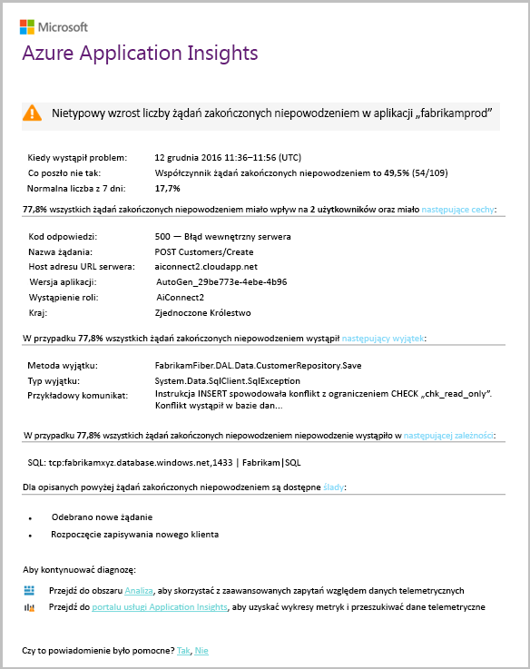

# Inteligentne wykrywanie — błąd anomaliiSmart Detection - Failure Anomalies
[Usługa Application Insights](app-insights-overview.md) automatycznie powiadamia użytkownika, w czasie rzeczywistym near czy Twoja aplikacja sieci web napotyka nietypowym wzroście współczynnika żądań zakończonych niepowodzeniem.[Application Insights](app-insights-overview.md) automatically notifies you in near real time if your web app experiences an abnormal rise in the rate of failed requests. Ta funkcja wykrywa nietypowe wzrost częstotliwość wykonywania żądań HTTP lub wywołania zależności, które ma być zgłaszane nie powiodło się.It detects an unusual rise in the rate of HTTP requests or dependency calls that are reported as failed. Dla żądania żądań zakończonych niepowodzeniem są zwykle z kodami odpowiedź 400 lub nowszej.For requests, failed requests are usually those with response codes of 400 or higher. Aby ułatwić klasyfikowanie i diagnozowanie problemu, analizy właściwości błędy i powiązane dane telemetryczne znajduje się w powiadomienia.To help you triage and diagnose the problem, an analysis of the characteristics of the failures and related telemetry is provided in the notification. Dostępne są także łącza do portalu usługi Application Insights w celu przeprowadzenia dalszej diagnostyki.There are also links to the Application Insights portal for further diagnosis. Funkcja musi żadnych konfiguracji ani konfiguracji, jakiej używa do prognozowania współczynnik awaryjności normalne algorytmów uczenia maszynowego.The feature needs no set-up nor configuration, as it uses machine learning algorithms to predict the normal failure rate.

Ta funkcja działa w przypadku języka Java i ASP.NET aplikacji sieci web hostowanych w chmurze lub na własnych serwerach.This feature works for Java and ASP.NET web apps, hosted in the cloud or on your own servers. Działa także dla wszystkich aplikacji, który generuje dane telemetryczne żądania lub zależności — na przykład jeśli masz roli procesu roboczego, który wywołuje [TrackRequest()](app-insights-api-custom-events-metrics.md#trackrequest) lub [TrackDependency()](app-insights-api-custom-events-metrics.md#trackdependency).It also works for any app that generates request or dependency telemetry - for example, if you have a worker role that calls [TrackRequest()](app-insights-api-custom-events-metrics.md#trackrequest) or [TrackDependency()](app-insights-api-custom-events-metrics.md#trackdependency).

Po skonfigurowaniu [usługi Application Insights dla projektu](app-insights-overview.md), i pod warunkiem aplikacja generuje określoną minimalną ilość danych telemetrycznych, Inteligentne wykrywanie anomalii awarii przejście 24 godziny, aby dowiedzieć się normalne zachowanie aplikacji, zanim zostanie włączone i wysyłać alerty.After setting up [Application Insights for your project](app-insights-overview.md), and provided your app generates a certain minimum amount of telemetry, Smart Detection of failure anomalies takes 24 hours to learn the normal behavior of your app, before it is switched on and can send alerts.

Oto przykładowy alert.Here's a sample alert.

> [!NOTE]
> Domyślnie otrzymasz krótszą poczty format od tego przykładu.By default, you get a shorter format mail than this example. Ale możesz [przełączyć się do tego formatu szczegółowego](#configure-alerts).But you can [switch to this detailed format](#configure-alerts).
>
>

Należy zauważyć, że informuje o tym:Notice that it tells you:

* Współczynnik awaryjności w porównaniu do aplikacji normalne zachowanie.The failure rate compared to normal app behavior.
* Ilu użytkowników dotyczy — aby wiedzieć, ile martwić się.How many users are affected – so you know how much to worry.
* Wzorzec charakterystyczny skojarzone z błędami.A characteristic pattern associated with the failures. W tym przykładzie brak określonej odpowiedzi kod, Nazwa żądania (operacji) i wersji aplikacji.In this example, there’s a particular response code, request name (operation) and app version. Który natychmiast wskazano, gdzie rozpocząć wyszukiwanie w kodzie.That immediately tells you where to start looking in your code. Może to być innych możliwości konkretny system operacyjny klienta lub dotyczących przeglądarki.Other possibilities could be a specific browser or client operating system.
* Wyjątek, ślady dziennika i błąd zależności (baz danych lub innych składników zewnętrznych) który wydaje się być skojarzone z błędami scharakteryzowany.The exception, log traces, and dependency failure (databases or other external components) that appear to be associated with the characterized failures.
* Łącza bezpośrednio do odpowiednich wyszukiwań na telemetrii w usłudze Application Insights.Links directly to relevant searches on the telemetry in Application Insights.

## Zalety inteligentne wykrywaniaBenefits of Smart Detection
Zwykłe [metryki alerty](app-insights-alerts.md) informujące o tym, być może wystąpił problem.Ordinary [metric alerts](app-insights-alerts.md) tell you there might be a problem. Ale inteligentne wykrywanie uruchamiania diagnostyki pracy związanej z, wykonywania partii analizy, w przeciwnym razie trzeba zrobić samodzielnie.But Smart Detection starts the diagnostic work for you, performing a lot of the analysis you would otherwise have to do yourself. Uzyskanie wyników starannie opakowane, pomaga szybko uzyskać dostęp do katalogu głównego problemu.You get the results neatly packaged, helping you to get quickly to the root of the problem.

## Jak to działaHow it works
Inteligentne wykrywanie monitoruje telemetrii odebranych z aplikacji, a w szczególności awariami.Smart  Detection monitors the telemetry received from your app, and in particular the failure rates. Ta zasada oblicza liczbę żądań dla którego `Successful request` właściwość ma wartość false, a liczba zależności wywołań, dla którego `Successful call` właściwość ma wartość false.This rule counts the number of requests for which the `Successful request` property is false, and the number of dependency calls for which the `Successful call` property is false. Dla żądania, domyślnie `Successful request == (resultCode < 400)` (o ile nie zostały zapisane niestandardowy kod [filtru](app-insights-api-filtering-sampling.md#filtering) lub wygenerować własny [TrackRequest](app-insights-api-custom-events-metrics.md#trackrequest) wywołania).For requests, by default, `Successful request == (resultCode < 400)` (unless you have written custom code to [filter](app-insights-api-filtering-sampling.md#filtering) or generate your own [TrackRequest](app-insights-api-custom-events-metrics.md#trackrequest) calls). 

Wydajność aplikacji ma typowy wzorzec zachowania.Your app’s performance has a typical pattern of behavior. Niektóre żądania lub wywołania zależności będą bardziej podatne na błędy niż inne; i ogólną współczynnik awaryjności może do góry w miarę wzrostu obciążenia.Some requests or dependency calls will be more prone to failure than others; and the overall failure rate may go up as load increases. Wykrywanie inteligentne używa machine learning można znaleźć tych nieprawidłowości.Smart Detection uses machine learning to find these anomalies.

Jako dane telemetryczne wejścia usługi Application Insights z aplikacji sieci web, Inteligentne wykrywanie porównuje bieżące zachowanie wzorami występuje w ciągu ostatnich kilku dni.As telemetry comes into Application Insights from your web app, Smart Detection compares the current behavior with the patterns seen over the past few days. Jeżeli w porównaniu z poprzednim wydajności jest nietypowy wzrost częstość niepowodzeń, analiza zostanie wywołany.If an abnormal rise in failure rate is observed by comparison with previous performance, an analysis is triggered.

Po wyzwoleniu analizy usługi dokonuje analizy klastra nieudanych żądań, w celu zidentyfikowania wzorców wartości charakteryzujące niepowodzenia.When an analysis is triggered, the service performs a cluster analysis on the failed request, to try to identify a pattern of values that characterize the failures. W powyższym przykładzie analizy wykrył, że większość awarii nastąpi kod wyniku określone, Nazwa żądania, adres URL serwera hosta i wystąpienia roli.In the example above, the analysis has discovered that most failures are about a specific result code, request name, Server URL host, and role instance. Z kolei analizy wykrył, że właściwości systemu operacyjnego klienta jest rozproszone na wielu wartości, a więc nie ma na liście.By contrast, the analysis has discovered that the client operating system property is distributed over multiple values, and so it is not listed.

Gdy usługi są instrumentowane przy użyciu tych wywołań telemetrii, analizator szuka wyjątek i błąd zależności, które są skojarzone z żądań w klastrze, który zidentyfikował, wraz z przykładem wszystkie dzienniki śledzenia skojarzone z żądaniami.When your service is instrumented with these telemetry calls, the analyser looks for an exception and a dependency failure that are associated with requests in the cluster it has identified, together with an example of any trace logs associated with those requests.

Wynikowa analizy zostanie do Ciebie wysłana jako alertu, chyba że skonfigurowano go nie.The resulting analysis is sent to you as alert, unless you have configured it not to.

Podobnie jak [alerty ręcznie ustawić](app-insights-alerts.md), można sprawdzić stan alertu i skonfiguruj ją w bloku alerty zasobu usługi Application Insights.Like the [alerts you set manually](app-insights-alerts.md), you can inspect the state of the alert and configure it in the Alerts blade of your Application Insights resource. Jednak w przeciwieństwie do innych alertów, nie jest konieczne konfigurowanie wykrywania inteligentne.But unlike other alerts, you don't need to set up or configure Smart Detection. Jeśli chcesz, możesz ją wyłączyć lub zmienić jego docelowych adresów e-mail.If you want, you can disable it or change its target email addresses.

## Konfigurowanie alertówConfigure alerts
Można wyłączyć inteligentne wykrywanie, zmieniać adresatów poczty e-mail, tworzenia elementu webhook lub zgadzaj się na bardziej szczegółowe komunikaty alertów.You can disable Smart Detection, change the email recipients, create a webhook, or opt in to more detailed alert messages.

Otwórz stronę alerty.Open the Alerts page. Błąd anomalii znajduje się wraz z żadnych alertów, należy ręcznie ustawić, które można zobaczyć, czy aktualnie jest w stanie alertu.Failure Anomalies is included along with any alerts that you have set manually, and you can see whether it is currently in the alert state.

Kliknij alert, aby go skonfigurować.Click the alert to configure it.

Powiadomienie, że można wyłączyć inteligentne wykrywanie, ale nie można go usunąć (lub utwórz inny).Notice that you can disable Smart Detection, but you can't delete it (or create another one).

#### Szczegółowe alertówDetailed alerts
Wybranie opcji "Pobierz bardziej szczegółową diagnostykę" wiadomości e-mail będzie zawierać więcej informacji diagnostycznych.If you select "Get more detailed diagnostics" then the email will contain more diagnostic information. Czasami można zdiagnozować problem tylko na podstawie danych w wiadomości e-mail.Sometimes you'll be able to diagnose the problem just from the data in the email.

Istnieje bardzo małe ryzyko, że alert bardziej szczegółowe mogą zawierać poufne informacje, ponieważ zawiera on wyjątek i śledzenia wiadomości.There's a slight risk that the more detailed alert could contain sensitive information, because it includes exception and trace messages. Jednak to się tylko stanie, jeśli kod umożliwia poufne informacje w tych komunikatach.However, this would only happen if your code could allow sensitive information into those messages.

## Klasyfikowane i diagnozowania alertuTriaging and diagnosing an alert
Alert wskazuje, że wykryto nietypowy wzrost częstości nieudanych żądań.An alert indicates that an abnormal rise in the failed request rate was detected. Istnieje prawdopodobieństwo, że istnieje problem związany z aplikacji lub z jego środowiska.It's likely that there is some problem with your app or its environment.

Z odsetek żądań i liczbę użytkowników, których dotyczy problem można zdecydować, jak pilnych jest problem.From the percentage of requests and number of users affected, you can decide how urgent the issue is. W powyższym przykładzie współczynnik awaryjności 22,5% porównuje normalną szybkość % 1, wskazuje, czy zły coś.In the example above, the failure rate of 22.5% compares with a normal rate of 1%, indicates that something bad is going on. Z drugiej strony użytkownicy tylko 11 zostały zainfekowane.On the other hand, only 11 users were affected. Gdyby aplikacji, będzie można ocenić, jak poważny to.If it were your app, you'd be able to assess how serious that is.

W wielu przypadkach można zdiagnozować problem szybko z nazwy żądania, wyjątków, zależności błędu i śledzenia danych udostępnionych.In many cases, you will be able to diagnose the problem quickly from the request name, exception, dependency failure and trace data provided.

Brak niektórych innych operacji.There are some other clues. Na przykład współczynnik awaryjności zależności, w tym przykładzie jest taka sama jak częstotliwość, z wyjątkiem (89.3%).For example, the dependency failure rate in this example is the same as the exception rate (89.3%). Sugeruje to, że wyjątek wynika bezpośrednio z awarią zależności — umożliwiając Wyczyść informacje o tym, gdzie rozpocząć wyszukiwanie w kodzie.This suggests that the exception arises directly from the dependency failure - giving you a clear idea of where to start looking in your code.

Aby zbadać dokładnie, linki w każdej sekcji spowoduje przejście do prostych [stronę wyszukiwania](app-insights-diagnostic-search.md) filtrowane do odpowiednich żądań, wyjątków, zależności lub śledzenia.To investigate further, the links in each section will take you straight to a [search page](app-insights-diagnostic-search.md) filtered to the relevant requests, exception, dependency or traces. Alternatywnie możesz otworzyć [portalu Azure](https://portal.azure.com), przejdź do zasobu usługi Application Insights dla aplikacji i otwarcie bloku błędów.Or you can open the [Azure portal](https://portal.azure.com), navigate to the Application Insights resource for your app, and open the Failures blade.

W tym przykładzie klikając łącze "Wyświetl szczegóły błędów zależności" spowoduje otwarcie bloku wyszukiwania usługi Application Insights.In this example, clicking the 'View dependency failures details' link opens the Application Insights search blade. Zawiera instrukcję SQL, która zawiera przykład główna przyczyna: zostały podane na pola wymagane wartości null, a nie przeszedł sprawdzania poprawności podczas zapisywania operacji.It shows the SQL statement that has an example of the root cause: NULLs were provided at mandatory fields and did not pass validation during the save operation.

## Ostatnie alerty można przeglądaćReview recent alerts

Kliknij przycisk **inteligentne wykrywanie** Aby uzyskać dostęp do najnowszych alertu:Click **Smart Detection** to get to the most recent alert:

## Jaka jest różnica...What's the difference ...
Inteligentne wykrywanie anomalii awarii uzupełnia inne podobne ale różne funkcje usługi Application Insights.Smart Detection of failure anomalies complements other similar but distinct features of Application Insights.

* [Alerty metryki](app-insights-alerts.md) są ustawiane przez Ciebie i monitorować szeroką gamę metryk, takich jak miejsce zajmowane przez procesor CPU, żądań, czasy ładowania stron i tak dalej.[Metric Alerts](app-insights-alerts.md) are set by you and can monitor a wide range of metrics such as CPU occupancy, request rates,  page load times, and so on. Można używać ich, aby ostrzec użytkownika, na przykład, jeśli trzeba dodać więcej zasobów.You can use them to warn you, for example, if you need to add more resources. Z kolei inteligentne wykrywanie anomalii awarii obejmuje niewielki zakres metryki krytycznych (obecnie tylko nieudanych żądań szybkości), przeznaczone do powiadomienia, że można w sposób czasu rzeczywistego, gdy aplikacja sieci web nie powiodło się w pobliżu żądania szybkość zwiększa się znacznie w porównaniu do aplikacji sieci web normalne zachowanie.By contrast, Smart Detection of failure anomalies covers a small range of critical metrics (currently only failed request rate), designed to notify you in near real time manner once your web app's failed request rate increases significantly compared to web app's normal behavior.

    Inteligentne wykrywanie automatycznie dostosowuje progu w odpowiedzi na warunki panujące.Smart Detection automatically adjusts its threshold in response to prevailing conditions.

    Inteligentne wykrywanie uruchamia pracy związanej z diagnostyki.Smart Detection starts the diagnostic work for you.
* [Inteligentne wykrywanie anomalii wydajności](app-insights-proactive-performance-diagnostics.md) również używa komputera analizy nietypowe wzorce w Twoje metryki odnajdywania, a nie przez użytkownika jest wymagana konfiguracja.[Smart Detection of performance anomalies](app-insights-proactive-performance-diagnostics.md) also uses machine intelligence to discover unusual patterns in your metrics, and no configuration by you is required. Ale w przeciwieństwie do inteligentnego wykrywania anomalii awarii, inteligentne wykrywania anomalii wydajności ma na celu znaleźć segmentów sieci kolektora użycia, które mogą być udostępniane nieprawidłowo — na przykład określonych stron na określony typ przeglądarki.But unlike Smart Detection of failure anomalies, the purpose of Smart  Detection of performance anomalies is to find segments of your usage manifold that might be badly served - for example, by specific pages on a specific type of browser. Analiza jest przeprowadzana codziennie, a jeśli dowolny wynik zostanie znaleziony, które mogą być znacznie mniej pilne niż alert.The analysis is performed daily, and if any result is found, it's likely to be much less urgent than an alert. Z kolei analizy w celu wykrycia nieprawidłowości awarii jest wykonywane stale na przychodzące dane telemetryczne, a otrzymasz powiadomienie w ciągu minut Jeśli awariami serwera jest większa, niż oczekiwano.By contrast, the analysis for failure anomalies is performed continuously on incoming telemetry, and you will be notified within minutes if server failure rates are greater than expected.

## Jeśli zostanie wyświetlony alert inteligentne wykrywaniaIf you receive a Smart Detection alert
*Dlaczego otrzymali ten alert?**Why have I received this alert?*

* Wykryliśmy nietypowym wzroście współczynnika żądań zakończonych niepowodzeniem w porównaniu do normalnej linii bazowej poprzedniego okresu.We detected an abnormal rise in failed requests rate compared to the normal baseline of the preceding period. Po analizie błędów i skojarzone dane telemetryczne naszym zdaniem, że istnieje problem, który powinien wyglądać w.After analysis of the failures and associated telemetry, we think that there is a problem that you should look into.

*Powiadomienie oznacza, że problem występuje ostatecznie?**Does the notification mean I definitely have a problem?*

* Spróbujemy alert po wystąpieniu przerw w działaniu aplikacji lub pogorszenia się, ale tylko wtedy można pełni zrozumieć semantykę i wpływa na aplikację lub użytkowników.We try to alert on app disruption or degradation, but only you can fully understand the semantics and the impact on the app or users.

*Tak guys przeglądania danych?**So, you guys look at my data?*

* Nie.No. Usługa jest całkowicie automatyczne.The service is entirely automatic. Tylko otrzymasz powiadomień.Only you get the notifications. Twoje dane są [prywatnej](app-insights-data-retention-privacy.md).Your data is [private](app-insights-data-retention-privacy.md).

*Czy mają subskrybować ten alert?**Do I have to subscribe to this alert?*

* Nie.No. Każda aplikacja, że wysyła żądanie telemetrii ma inteligentne wykrywanie reguły alertów.Every application that sends request telemetry has the Smart Detection alert rule.

*Można anulować subskrypcję lub otrzymywać powiadomień, zamiast tego wysyłane do moich współpracowników?**Can I unsubscribe or get the notifications sent to my colleagues instead?*

* Reguły w alertów, kliknij Tak, reguły wykrywania inteligentne, aby go skonfigurować.Yes, In Alert rules, click the Smart Detection rule to configure it. Wyłącz alert lub zmieniać adresatów alertu.You can disable the alert, or change recipients for the alert.

*Utratą wiadomości e-mail. Gdzie można znaleźć powiadomienia w portalu?**I lost the email. Where can I find the notifications in the portal?*

* W dziennikach działania.In the Activity logs. Na platformie Azure Otwórz zasobu usługi Application Insights dla aplikacji, a następnie wybierz Dzienniki aktywności.In Azure, open the Application Insights resource for your app, then select Activity logs.

*Niektóre alerty są o znanych problemach, a nie chcę do ich odbierania.**Some of the alerts are about known issues and I do not want to receive them.*

* Mamy pomijania alertów w naszej listy prac.We have alert suppression on our backlog.

## Następne krokiNext steps
Te narzędzia diagnostyczne pomóc sprawdzić dane telemetryczne z aplikacji:These diagnostic tools help you inspect the telemetry from your app:

* [Eksplorator metrykMetric explorer](app-insights-metrics-explorer.md)
* [Eksplorator wyszukiwaniaSearch explorer](app-insights-diagnostic-search.md)
* [Analiza - język zaawansowanych zapytańAnalytics - powerful query language](app-insights-analytics-tour.md)

Inteligentne wykryć są całkowicie automatyczne.Smart detections are completely automatic. A może chcesz skonfigurować niektóre alerty więcej?But maybe you'd like to set up some more alerts?

* [Ręcznie skonfigurowanej metryki alertówManually configured metric alerts](app-insights-alerts.md)
* [Dostępność testy sieci webAvailability web tests](app-insights-monitor-web-app-availability.md)
