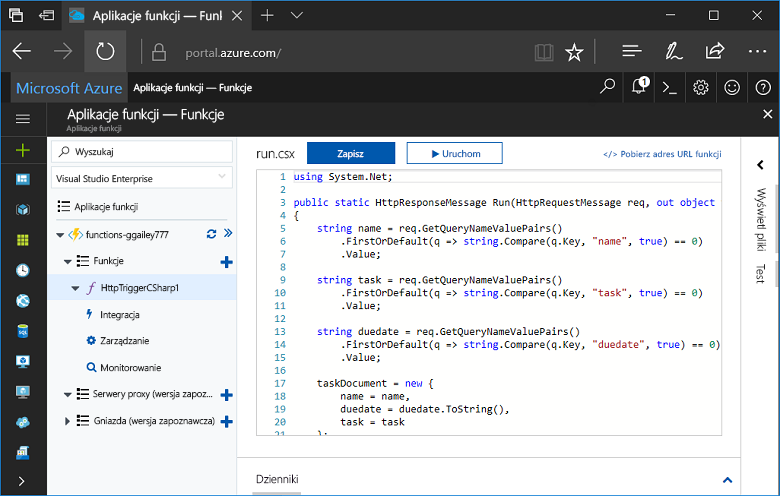
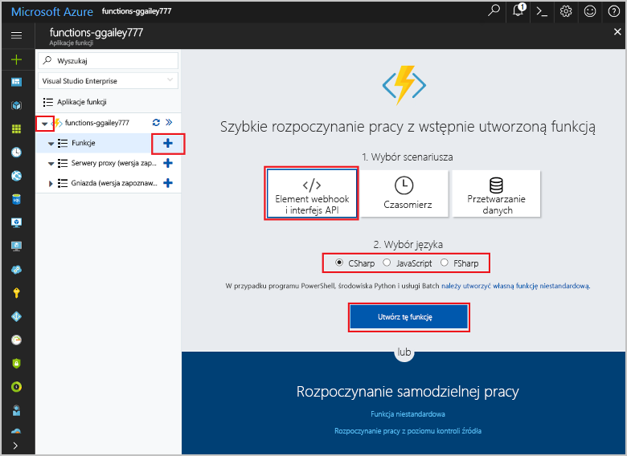
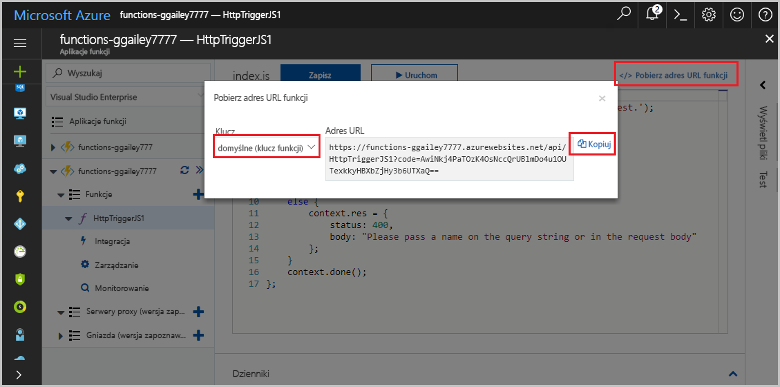
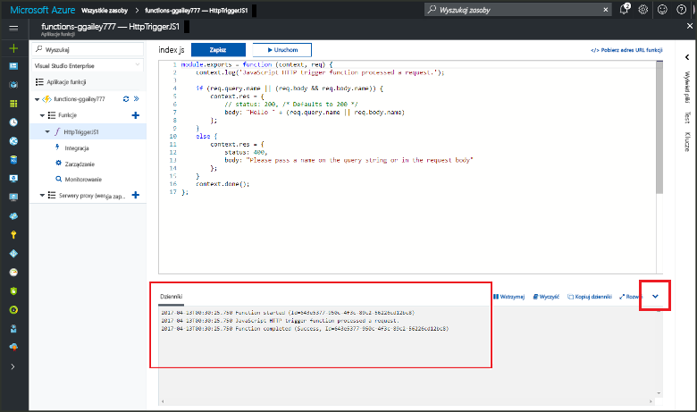

# Tworzenie pierwszej funkcji w hello portalu Azure

Środowisko Azure Functions umożliwia wykonywanie kodu w środowisku bez serwera bez konieczności toofirst tworzenie maszyny Wirtualnej lub opublikować aplikację sieci web. W tym temacie Dowiedz się, jak toouse funkcjonuje toocreate funkcję "hello world" hello portalu Azure.

[!INCLUDE [quickstarts-free-trial-note](../../includes/quickstarts-free-trial-note.md)]

## Zaloguj się za tooAzure

Zaloguj się za toohello [portalu Azure](https://portal.azure.com/).

## Tworzenie aplikacji funkcji

Funkcja aplikacji toohost hello wykonywanie funkcji są wymagane. Aplikacja funkcji umożliwia grupowanie funkcji jako jednostki logicznej, co ułatwia wdrażanie i udostępnianie zasobów oraz zarządzanie nimi. 

[!INCLUDE [Create function app Azure portal](../../includes/functions-create-function-app-portal.md)]

[!INCLUDE [functions-portal-favorite-function-apps](../../includes/functions-portal-favorite-function-apps.md)]

Następnie należy utworzyć funkcji w hello nowej funkcji aplikacji.

## Tworzenie funkcji wyzwalanej przez protokół HTTP

1. Rozwiń węzeł nowej aplikacji funkcji, a następnie kliknij przycisk hello  **+**  obok przycisku zbyt**funkcji**.

2.  W hello **szybkie rozpoczęcie pracy** wybierz pozycję **element WebHook i interfejs API**, **wybierz język** Twojego funkcji, a następnie kliknij przycisk **tworzenia tej funkcji** . 
   
    

Funkcja jest tworzony w wybrany język przy użyciu szablonu hello funkcji HTTP wyzwolone. Możesz uruchomić hello nową funkcję, wysyłając żądania HTTP.

## Funkcja hello testu

1. W nowej funkcji kliknij przycisk **</> Pobierz adres URL funkcji**, wybierz pozycję **domyślne (klawisz funkcji)**, a następnie kliknij przycisk **Kopiuj**. 

    

2. Wklej adres URL funkcji hello w pasku adresu przeglądarki. Dołącz ciągu zapytania hello `&name=<yourname>` toothis hello adresu URL i naciśnij klawisz `Enter` klucza na żądanie hello tooexecute klawiatury. Witaj poniżej znajduje się przykład hello odpowiedź zwrócona przez funkcję hello w przeglądarce Edge hello:

    

    adres URL zawiera klucz, który jest wymagany, domyślnie tooaccess żądania Hello funkcji za pośrednictwem protokołu HTTP.   

3. Po uruchomieniu funkcji informacje śledzenia są zapisywane toohello dzienniki. wyniki śledzenia hello toosee hello poprzednie wykonanie powróć tooyour funkcji w portalu hello i kliknij przycisk hello Strzałka u dołu hello tooexpand ekranie powitania w górę **dzienniki**. 

   

## Oczyszczanie zasobów

[!INCLUDE [Clean up resources](../../includes/functions-quickstart-cleanup.md)]

## Następne kroki

Utworzono aplikację funkcji z prostą funkcją wyzwalaną przez protokół HTTP.  

[!INCLUDE [Next steps note](../../includes/functions-quickstart-next-steps.md)]

Aby uzyskać więcej informacji, zobacz [Powiązania protokołu HTTP i elementów webhook w usłudze Azure Functions](functions-bindings-http-webhook.md).

