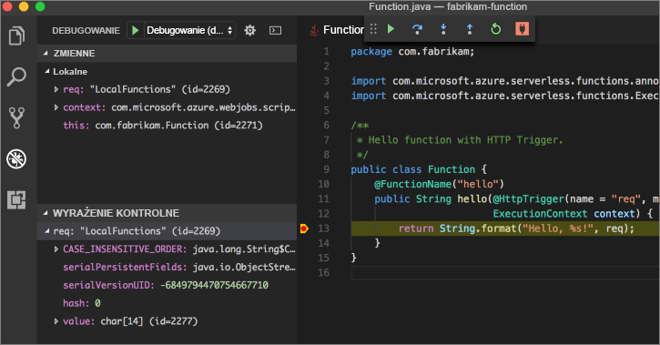

# <a name="create-your-first-function-with-java-and-maven-preview"></a>Tworzenie pierwszej funkcji przy użyciu języka Java i narzędzia Maven (wersja zapoznawcza)

> [!NOTE] 
> Język Java dla usługi Azure Functions jest obecnie w wersji zapoznawczej.

Ten przewodnik Szybki start przeprowadzi Cię przez tworzenie projektu funkcji [bezserwerowej](https://azure.microsoft.com/overview/serverless-computing/) za pomocą narzędzia Maven, testowanie jej lokalnie i wdrażanie w usłudze Azure Functions. Po zakończeniu będziesz mieć działającą na platformie Azure funkcję wyzwalaną przez protokół HTTP.


[!INCLUDE [quickstarts-free-trial-note](../../includes/quickstarts-free-trial-note.md)]

## <a name="prerequisites"></a>Wymagania wstępne
Aby opracowywać aplikacje funkcji przy użyciu języka Java, trzeba mieć zainstalowane następujące składniki:

-  Oprogramowanie [.NET Core](https://www.microsoft.com/net/core), najnowsza wersja.
-  Zestaw [Java Developer Kit](https://www.azul.com/downloads/zulu/), wersja 8.
-  [Interfejs wiersza polecenia platformy Azure](https://docs.microsoft.com/cli/azure)
-  Narzędzie [Apache Maven](https://maven.apache.org), wersja 3.0 lub nowsza.
-  Środowisko [Node.js](https://nodejs.org/download/), wersja 8.6 lub nowsza.

> [!IMPORTANT] 
> Aby wykonać wszystkie czynności opisane w tym przewodniku Szybki start, dla zmiennej środowiskowej JAVA_HOME należy ustawić lokalizację instalacji zestawu JDK.

## <a name="install-the-azure-functions-core-tools"></a>Instalowanie podstawowych narzędzi usługi Azure Functions

[Podstawowe narzędzia usługi Azure Functions w wersji 2.0](https://www.npmjs.com/package/azure-functions-core-tools) zapewniają lokalne środowisko deweloperskie do pisania, uruchamiania i debugowania usługi Azure Functions. Zainstaluj te narzędzia za pomocą menedżera [npm](https://www.npmjs.com/) dołączonego do środowiska [Node.js](https://nodejs.org/).

```
npm install -g azure-functions-core-tools@core
```

> [!NOTE]
> Jeśli podczas instalowania podstawowych narzędzi usługi Azure Functions w wersji 2.0 występują problemy, zobacz [Środowisko uruchomieniowe w wersji 2.x](/azure/azure-functions/functions-run-local#version-2x-runtime).

## <a name="generate-a-new-functions-project"></a>Generowanie nowego projektu usługi Functions

W pustym folderze uruchom następujące polecenie, aby wygenerować projekt usługi Functions z [archetypu narzędzia Maven](https://maven.apache.org/guides/introduction/introduction-to-archetypes.html).

### <a name="linuxmacos"></a>Linux/MacOS

```bash
mvn archetype:generate \
    -DarchetypeGroupId=com.microsoft.azure \
    -DarchetypeArtifactId=azure-functions-archetype 
```

### <a name="windows-cmd"></a>Windows (CMD)
```cmd
mvn archetype:generate ^
    -DarchetypeGroupId=com.microsoft.azure ^
    -DarchetypeArtifactId=azure-functions-archetype
```

W narzędziu Maven zostanie wyświetlony monit o podanie wartości wymaganych do ukończenia generowania projektu. Aby uzyskać informacje o wartościach _groupId_, _artifactId_ i _version_, zobacz materiały referencyjne [Konwencja nazewnictwa narzędzia Maven](https://maven.apache.org/guides/mini/guide-naming-conventions.html). Wartość _appName_ musi być unikatowa w obrębie platformy Azure, dlatego narzędzie Maven generuje domyślną nazwę aplikacji na podstawie wprowadzonej wcześniej wartości _artifactId_. Wartość _packageName_ określa pakiet Java dla generowanego kodu funkcji.

```Output
Define value for property 'groupId': com.fabrikam.functions
Define value for property 'artifactId' : fabrikam-functions
Define value for property 'version' 1.0-SNAPSHOT : 
Define value for property 'package': com.fabrikam.functions
Define value for property 'appName' fabrikam-functions-20170927220323382:
Confirm properties configuration: Y
```

Narzędzie Maven tworzy pliki projektu w nowym folderze o nazwie wartości _artifactId_. Kod wygenerowany w projekcie jest prostą funkcją [wyzwalaną przez protokół HTTP](/azure/azure-functions/functions-bindings-http-webhook), która zwraca treść żądania:

```java
public class Function {
    /**
     * This function listens at endpoint "/api/hello". Two ways to invoke it using "curl" command in bash:
     * 1. curl -d "HTTP Body" {your host}/api/hello
     * 2. curl {your host}/api/hello?name=HTTP%20Query
     */
    @FunctionName("hello")
    public HttpResponseMessage<String> hello(
            @HttpTrigger(name = "req", methods = {"get", "post"}, authLevel = AuthorizationLevel.ANONYMOUS) HttpRequestMessage<Optional<String>> request,
            final ExecutionContext context) {
        context.getLogger().info("Java HTTP trigger processed a request.");

        // Parse query parameter
        String query = request.getQueryParameters().get("name");
        String name = request.getBody().orElse(query);

        if (name == null) {
            return request.createResponse(400, "Please pass a name on the query string or in the request body");
        } else {
            return request.createResponse(200, "Hello, " + name);
        }
    }
}

```

## <a name="run-the-function-locally"></a>Lokalne uruchamianie funkcji

Zmień katalog na nowo utworzony folder projektu, a następnie skompiluj i uruchom funkcję za pomocą narzędzia Maven:

```
cd fabrikam-function
mvn clean package 
mvn azure-functions:run
```

> [!NOTE]
> Jeśli wystąpi wyjątek `javax.xml.bind.JAXBException` w przypadku używania platformy Java 9, zobacz obejście w serwisie [GitHub](https://github.com/jOOQ/jOOQ/issues/6477).

Po uruchomieniu funkcji zostaną wyświetlone następujące dane wyjściowe:

```Output
Listening on http://localhost:7071
Hit CTRL-C to exit...

Http Functions:

   hello: http://localhost:7071/api/hello
```

Wyzwól funkcje z poziomu wiersza polecenia, używając programu curl w nowym terminalu:

```
curl -w '\n' -d LocalFunction http://localhost:7071/api/hello
```

```Output
Hello LocalFunction!
```

Aby zatrzymać wykonywanie kodu funkcji, użyj polecenia `Ctrl-C` w oknie terminala.

## <a name="deploy-the-function-to-azure"></a>Wdrażanie funkcji na platformie Azure

Proces wdrażania w usłudze Azure Functions korzysta z poświadczeń konta z interfejsu wiersza polecenia platformy Azure. [Zaloguj się przy użyciu interfejsu wiersza polecenia platformy Azure](/cli/azure/authenticate-azure-cli?view=azure-cli-latest), a następnie wdróż swój kod w nowej aplikacji usługi Functions, używając elementu docelowego `azure-functions:deploy` narzędzia Maven.

```
az login
mvn azure-functions:deploy
```

Po zakończeniu wdrażania zostanie wyświetlony adres URL umożliwiający uzyskanie dostępu do aplikacji funkcji platformy Azure:

```output
[INFO] Successfully deployed Function App with package.
[INFO] Deleting deployment package from Azure Storage...
[INFO] Successfully deleted deployment package fabrikam-function-20170920120101928.20170920143621915.zip
[INFO] Successfully deployed Function App at https://fabrikam-function-20170920120101928.azurewebsites.net
[INFO] ------------------------------------------------------------------------
```

Przetestuj działanie aplikacji funkcji na platformie Azure, używając programu curl:

```
curl -w '\n' https://fabrikam-function-20170920120101928.azurewebsites.net/api/hello -d AzureFunctions
```

```Output
Hello AzureFunctions!
```

## <a name="next-steps"></a>Następne kroki

Utworzyliśmy aplikację funkcji języka Java z prostym wyzwalaczem HTTP i wdrożyliśmy ją w usłudze Azure Functions.

- Zapoznaj się z [Przewodnikiem dewelopera po funkcjach języka Java](functions-reference-java.md), aby uzyskać więcej informacji na temat tworzenia funkcji języka Java.
- Dodaj do swojego projektu kolejne funkcje z różnymi wyzwalaczami, używając elementu docelowego `azure-functions:add` narzędzia Maven.
- Przeprowadź lokalne debugowanie funkcji za pomocą programu Visual Studio Code. Po zainstalowaniu [pakietu rozszerzenia języka Java](https://marketplace.visualstudio.com/items?itemName=vscjava.vscode-java-pack) i otworzeniu projektu usługi Functions w programie Visual Studio Code [dołącz debuger](https://code.visualstudio.com/Docs/editor/debugging#_launch-configurations) do portu 5005. Następnie ustaw punkt przerwania w edytorze i wyzwól swoją funkcję, gdy będzie uruchomiona lokalnie: .


