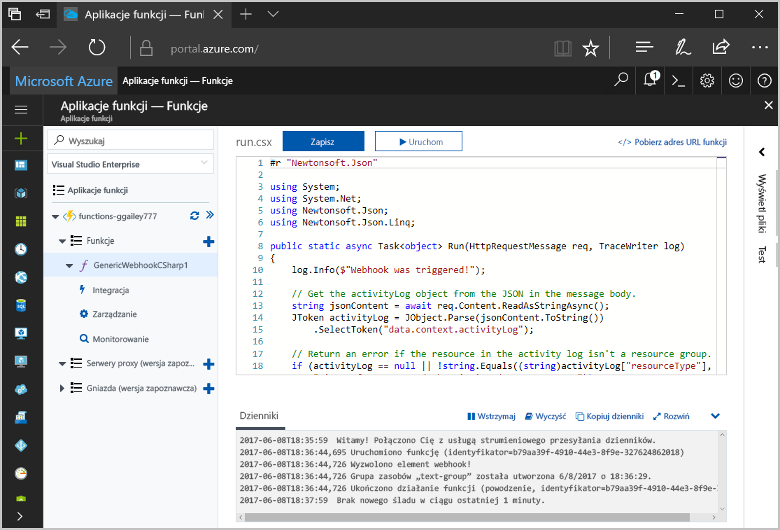
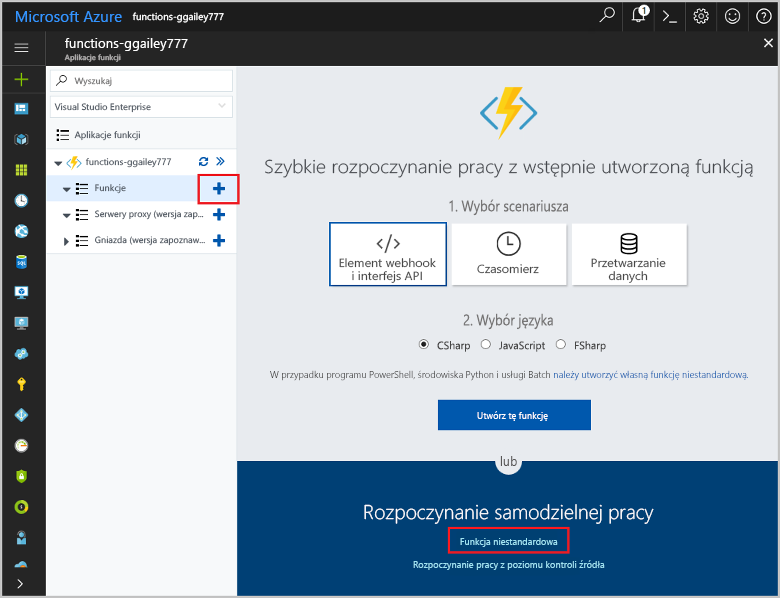
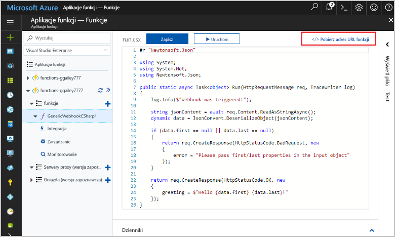
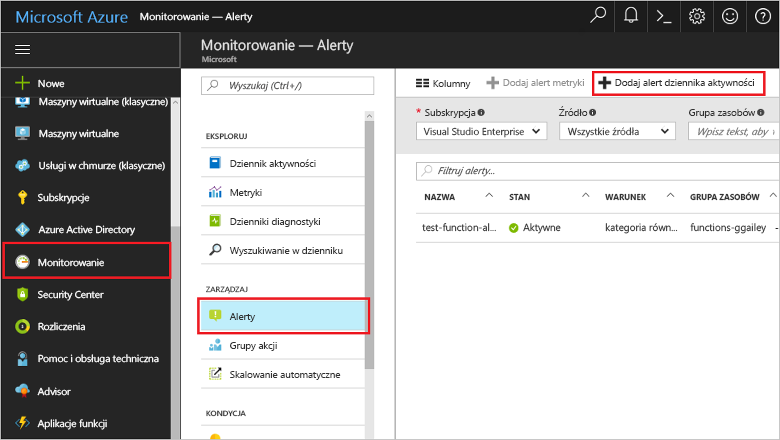
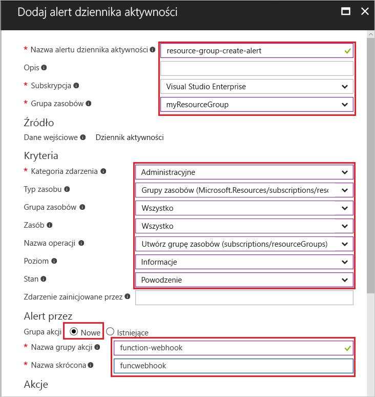
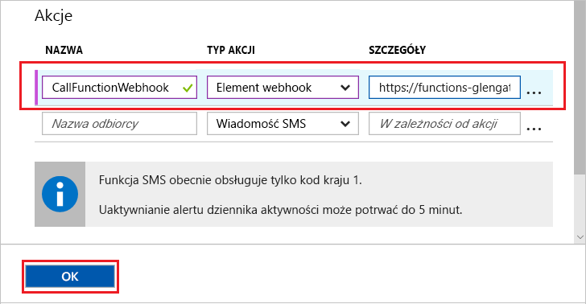
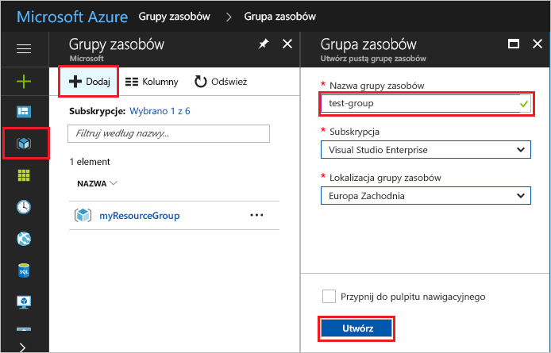
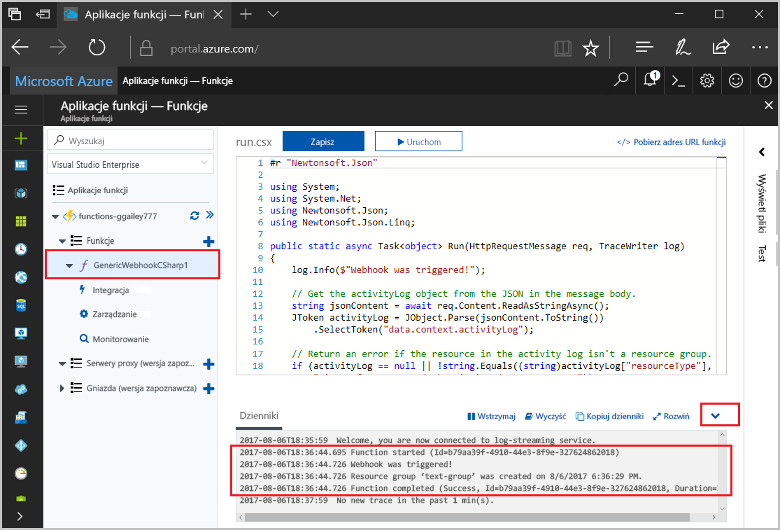

# <a name="create-a-function-triggered-by-a-generic-webhook"></a><span data-ttu-id="f8f24-103">Utwórz funkcję wyzwalane przez ogólny element webhook</span><span class="sxs-lookup"><span data-stu-id="f8f24-103">Create a function triggered by a generic webhook</span></span>

<span data-ttu-id="f8f24-104">Środowisko Azure Functions umożliwia wykonywanie kodu w środowisku bez serwera bez konieczności toofirst tworzenie maszyny Wirtualnej lub opublikować aplikację sieci web.</span><span class="sxs-lookup"><span data-stu-id="f8f24-104">Azure Functions lets you execute your code in a serverless environment without having toofirst create a VM or publish a web application.</span></span> <span data-ttu-id="f8f24-105">Na przykład można skonfigurować toobe funkcji wyzwalanych alertu zgłoszonego przez Azure Monitor.</span><span class="sxs-lookup"><span data-stu-id="f8f24-105">For example, you can configure a function toobe triggered by an alert raised by Azure Monitor.</span></span> <span data-ttu-id="f8f24-106">W tym temacie pokazano, jak tooexecute C# kodu, gdy grupa zasobów jest dodany tooyour subskrypcji.</span><span class="sxs-lookup"><span data-stu-id="f8f24-106">This topic shows you how tooexecute C# code when a resource group is added tooyour subscription.</span></span>   



## <a name="prerequisites"></a><span data-ttu-id="f8f24-108">Wymagania wstępne</span><span class="sxs-lookup"><span data-stu-id="f8f24-108">Prerequisites</span></span> 

<span data-ttu-id="f8f24-109">toocomplete tego samouczka:</span><span class="sxs-lookup"><span data-stu-id="f8f24-109">toocomplete this tutorial:</span></span>

+ <span data-ttu-id="f8f24-110">Jeśli nie masz subskrypcji platformy Azure, przed rozpoczęciem utwórz [bezpłatne konto](https://azure.microsoft.com/free/?WT.mc_id=A261C142F).</span><span class="sxs-lookup"><span data-stu-id="f8f24-110">If you don't have an Azure subscription, create a [free account](https://azure.microsoft.com/free/?WT.mc_id=A261C142F) before you begin.</span></span>

[!INCLUDE [functions-portal-favorite-function-apps](../../includes/functions-portal-favorite-function-apps.md)]

## <a name="create-an-azure-function-app"></a><span data-ttu-id="f8f24-111">Tworzenie aplikacji funkcji platformy Azure</span><span class="sxs-lookup"><span data-stu-id="f8f24-111">Create an Azure Function app</span></span>

[!INCLUDE [Create function app Azure portal](../../includes/functions-create-function-app-portal.md)]

<span data-ttu-id="f8f24-112">Następnie należy utworzyć funkcji w hello nowej funkcji aplikacji.</span><span class="sxs-lookup"><span data-stu-id="f8f24-112">Next, you create a function in hello new function app.</span></span>

## <span data-ttu-id="f8f24-113"><a name="create-function"></a>Utwórz funkcję ogólny element webhook wyzwalane</span><span class="sxs-lookup"><span data-stu-id="f8f24-113"><a name="create-function"></a>Create a generic webhook triggered function</span></span>

1. <span data-ttu-id="f8f24-114">Rozwiń węzeł funkcji aplikacji, a następnie kliknij przycisk hello  **+**  obok przycisku zbyt**funkcji**.</span><span class="sxs-lookup"><span data-stu-id="f8f24-114">Expand your function app and click hello **+** button next too**Functions**.</span></span> <span data-ttu-id="f8f24-115">Jeśli ta funkcja jest hello pierwsza z nich w aplikacji funkcji, wybierz **Niestandardowa funkcja**.</span><span class="sxs-lookup"><span data-stu-id="f8f24-115">If this function is hello first one in your function app, select **Custom function**.</span></span> <span data-ttu-id="f8f24-116">Spowoduje to wyświetlenie hello pełny zestaw szablonów funkcji.</span><span class="sxs-lookup"><span data-stu-id="f8f24-116">This displays hello complete set of function templates.</span></span>

    

2. <span data-ttu-id="f8f24-118">Wybierz hello **ogólny element WebHook - C#** szablonu.</span><span class="sxs-lookup"><span data-stu-id="f8f24-118">Select hello **Generic WebHook - C#** template.</span></span> <span data-ttu-id="f8f24-119">Wpisz nazwę dla funkcji języka C#, a następnie wybierz **Utwórz**.</span><span class="sxs-lookup"><span data-stu-id="f8f24-119">Type a name for your C# function, then select **Create**.</span></span>

      

2. <span data-ttu-id="f8f24-121">W nowych funkcji, kliknij przycisk **adres URL funkcji <> / Get**, następnie skopiuj i Zapisz wartość hello.</span><span class="sxs-lookup"><span data-stu-id="f8f24-121">In your new function, click **</> Get function URL**, then copy and save hello value.</span></span> <span data-ttu-id="f8f24-122">Możesz użyć tej wartości tooconfigure hello elementu webhook.</span><span class="sxs-lookup"><span data-stu-id="f8f24-122">You use this value tooconfigure hello webhook.</span></span> 

    
         
<span data-ttu-id="f8f24-124">Następnie należy utworzyć punkt końcowy elementu webhook w alertu dziennika aktywności w monitorze Azure.</span><span class="sxs-lookup"><span data-stu-id="f8f24-124">Next, you create a webhook endpoint in an activity log alert in Azure Monitor.</span></span> 

## <a name="create-an-activity-log-alert"></a><span data-ttu-id="f8f24-125">Utwórz alert dziennika aktywności</span><span class="sxs-lookup"><span data-stu-id="f8f24-125">Create an activity log alert</span></span>

1. <span data-ttu-id="f8f24-126">W portalu Azure hello kolejno toohello **Monitor** usługi, wybierz opcję **alerty**i kliknij przycisk **alert dziennika aktywności Dodaj**.</span><span class="sxs-lookup"><span data-stu-id="f8f24-126">In hello Azure portal, navigate toohello **Monitor** service, select **Alerts**, and click **Add activity log alert**.</span></span>   

    

2. <span data-ttu-id="f8f24-128">Użyj hello ustawień określonych w tabeli hello:</span><span class="sxs-lookup"><span data-stu-id="f8f24-128">Use hello settings as specified in hello table:</span></span>

    

    | <span data-ttu-id="f8f24-130">Ustawienie</span><span class="sxs-lookup"><span data-stu-id="f8f24-130">Setting</span></span>      |  <span data-ttu-id="f8f24-131">Sugerowana wartość</span><span class="sxs-lookup"><span data-stu-id="f8f24-131">Suggested value</span></span>   | <span data-ttu-id="f8f24-132">Opis</span><span class="sxs-lookup"><span data-stu-id="f8f24-132">Description</span></span>                              |
    | ------------ |  ------- | -------------------------------------------------- |
    | <span data-ttu-id="f8f24-133">**Nazwa alertu dziennika aktywności**</span><span class="sxs-lookup"><span data-stu-id="f8f24-133">**Activity log alert name**</span></span> | <span data-ttu-id="f8f24-134">zasobów grupy Tworzenie alertu</span><span class="sxs-lookup"><span data-stu-id="f8f24-134">resource-group-create-alert</span></span> | <span data-ttu-id="f8f24-135">Nazwa alertu dziennika aktywności hello.</span><span class="sxs-lookup"><span data-stu-id="f8f24-135">Name of hello activity log alert.</span></span> |
    | <span data-ttu-id="f8f24-136">**Subskrypcja**</span><span class="sxs-lookup"><span data-stu-id="f8f24-136">**Subscription**</span></span> | <span data-ttu-id="f8f24-137">Twoja subskrypcja</span><span class="sxs-lookup"><span data-stu-id="f8f24-137">Your subscription</span></span> | <span data-ttu-id="f8f24-138">Subskrypcja Hello są używane w tym samouczku.</span><span class="sxs-lookup"><span data-stu-id="f8f24-138">hello subscription you are using for this tutorial.</span></span> | 
    |  <span data-ttu-id="f8f24-139">**Grupa zasobów**</span><span class="sxs-lookup"><span data-stu-id="f8f24-139">**Resource Group**</span></span> | <span data-ttu-id="f8f24-140">myResourceGroup</span><span class="sxs-lookup"><span data-stu-id="f8f24-140">myResourceGroup</span></span> | <span data-ttu-id="f8f24-141">Grupa zasobów Hello są wdrażane zasoby alertu hello.</span><span class="sxs-lookup"><span data-stu-id="f8f24-141">hello resource group that hello alert resources are deployed to.</span></span> <span data-ttu-id="f8f24-142">Jak funkcja aplikacji ułatwia łatwiejsze tooclean po ukończeniu samouczka hello przy użyciu hello tej samej grupie zasobów.</span><span class="sxs-lookup"><span data-stu-id="f8f24-142">Using hello same resource group as your function app makes it easier tooclean up after you complete hello tutorial.</span></span> |
    | <span data-ttu-id="f8f24-143">**Kategoria zdarzenia**</span><span class="sxs-lookup"><span data-stu-id="f8f24-143">**Event category**</span></span> | <span data-ttu-id="f8f24-144">Administracyjne</span><span class="sxs-lookup"><span data-stu-id="f8f24-144">Administrative</span></span> | <span data-ttu-id="f8f24-145">Ta kategoria zawiera zmiany tooAzure zasobów.</span><span class="sxs-lookup"><span data-stu-id="f8f24-145">This category includes changes made tooAzure resources.</span></span>  |
    | <span data-ttu-id="f8f24-146">**Typ zasobu**</span><span class="sxs-lookup"><span data-stu-id="f8f24-146">**Resource type**</span></span> | <span data-ttu-id="f8f24-147">Grupy zasobów</span><span class="sxs-lookup"><span data-stu-id="f8f24-147">Resource groups</span></span> | <span data-ttu-id="f8f24-148">Filtry działań grupowych tooresource alertów.</span><span class="sxs-lookup"><span data-stu-id="f8f24-148">Filters alerts tooresource group activities.</span></span> |
    | <span data-ttu-id="f8f24-149">**Grupa zasobów**</span><span class="sxs-lookup"><span data-stu-id="f8f24-149">**Resource Group**</span></span><br/><span data-ttu-id="f8f24-150">i **zasobów**</span><span class="sxs-lookup"><span data-stu-id="f8f24-150">and **Resource**</span></span> | <span data-ttu-id="f8f24-151">Wszystkie</span><span class="sxs-lookup"><span data-stu-id="f8f24-151">All</span></span> | <span data-ttu-id="f8f24-152">Monitoruj wszystkie zasoby.</span><span class="sxs-lookup"><span data-stu-id="f8f24-152">Monitor all resources.</span></span> |
    | <span data-ttu-id="f8f24-153">**Nazwa operacji**</span><span class="sxs-lookup"><span data-stu-id="f8f24-153">**Operation name**</span></span> | <span data-ttu-id="f8f24-154">Tworzenie grupy zasobów</span><span class="sxs-lookup"><span data-stu-id="f8f24-154">Create Resource Group</span></span> | <span data-ttu-id="f8f24-155">Filtry działań toocreate alertów.</span><span class="sxs-lookup"><span data-stu-id="f8f24-155">Filters alerts toocreate operations.</span></span> |
    | <span data-ttu-id="f8f24-156">**Poziom**</span><span class="sxs-lookup"><span data-stu-id="f8f24-156">**Level**</span></span> | <span data-ttu-id="f8f24-157">Informacyjny</span><span class="sxs-lookup"><span data-stu-id="f8f24-157">Informational</span></span> | <span data-ttu-id="f8f24-158">Obejmują alerty informacyjne poziomu.</span><span class="sxs-lookup"><span data-stu-id="f8f24-158">Include informational level alerts.</span></span> | 
    | <span data-ttu-id="f8f24-159">**Stan**</span><span class="sxs-lookup"><span data-stu-id="f8f24-159">**Status**</span></span> | <span data-ttu-id="f8f24-160">Powodzenie</span><span class="sxs-lookup"><span data-stu-id="f8f24-160">Succeeded</span></span> | <span data-ttu-id="f8f24-161">Filtry tooactions alerty, które zostały ukończone pomyślnie.</span><span class="sxs-lookup"><span data-stu-id="f8f24-161">Filters alerts tooactions that have completed successfully.</span></span> |
    | <span data-ttu-id="f8f24-162">**Grupy akcji**</span><span class="sxs-lookup"><span data-stu-id="f8f24-162">**Action group**</span></span> | <span data-ttu-id="f8f24-163">Nowy</span><span class="sxs-lookup"><span data-stu-id="f8f24-163">New</span></span> | <span data-ttu-id="f8f24-164">Utwórz nową grupę działań, definiującą hello przyjmuje akcji, gdy zostanie zgłoszony alert.</span><span class="sxs-lookup"><span data-stu-id="f8f24-164">Create a new action group, which defines hello action takes when an alert is raised.</span></span> |
    | <span data-ttu-id="f8f24-165">**Nazwa grupy akcji**</span><span class="sxs-lookup"><span data-stu-id="f8f24-165">**Action group name**</span></span> | <span data-ttu-id="f8f24-166">Element webhook — funkcja</span><span class="sxs-lookup"><span data-stu-id="f8f24-166">function-webhook</span></span> | <span data-ttu-id="f8f24-167">Grupa działań hello tooidentify nazwy.</span><span class="sxs-lookup"><span data-stu-id="f8f24-167">A name tooidentify hello action group.</span></span>  | 
    | <span data-ttu-id="f8f24-168">**Krótka nazwa**</span><span class="sxs-lookup"><span data-stu-id="f8f24-168">**Short name**</span></span> | <span data-ttu-id="f8f24-169">funcwebhook</span><span class="sxs-lookup"><span data-stu-id="f8f24-169">funcwebhook</span></span> | <span data-ttu-id="f8f24-170">Krótka nazwa grupy akcji hello.</span><span class="sxs-lookup"><span data-stu-id="f8f24-170">A short name for hello action group.</span></span> |  

3. <span data-ttu-id="f8f24-171">W **akcje**, Dodaj akcję przy użyciu ustawień hello określoną w tabeli hello:</span><span class="sxs-lookup"><span data-stu-id="f8f24-171">In **Actions**, add an action using hello settings as specified in hello table:</span></span> 

    

    | <span data-ttu-id="f8f24-173">Ustawienie</span><span class="sxs-lookup"><span data-stu-id="f8f24-173">Setting</span></span>      |  <span data-ttu-id="f8f24-174">Sugerowana wartość</span><span class="sxs-lookup"><span data-stu-id="f8f24-174">Suggested value</span></span>   | <span data-ttu-id="f8f24-175">Opis</span><span class="sxs-lookup"><span data-stu-id="f8f24-175">Description</span></span>                              |
    | ------------ |  ------- | -------------------------------------------------- |
    | <span data-ttu-id="f8f24-176">**Nazwa**</span><span class="sxs-lookup"><span data-stu-id="f8f24-176">**Name**</span></span> | <span data-ttu-id="f8f24-177">CallFunctionWebhook</span><span class="sxs-lookup"><span data-stu-id="f8f24-177">CallFunctionWebhook</span></span> | <span data-ttu-id="f8f24-178">Nazwa akcji hello.</span><span class="sxs-lookup"><span data-stu-id="f8f24-178">A name for hello action.</span></span> |
    | <span data-ttu-id="f8f24-179">**Typ akcji**</span><span class="sxs-lookup"><span data-stu-id="f8f24-179">**Action type**</span></span> | <span data-ttu-id="f8f24-180">Webhook</span><span class="sxs-lookup"><span data-stu-id="f8f24-180">Webhook</span></span> | <span data-ttu-id="f8f24-181">alert toohello odpowiedzi Hello jest nosi adresu URL elementu Webhook.</span><span class="sxs-lookup"><span data-stu-id="f8f24-181">hello response toohello alert is that a Webhook URL is called.</span></span> |
    | <span data-ttu-id="f8f24-182">**Szczegóły**</span><span class="sxs-lookup"><span data-stu-id="f8f24-182">**Details**</span></span> | <span data-ttu-id="f8f24-183">Adres URL funkcji</span><span class="sxs-lookup"><span data-stu-id="f8f24-183">Function URL</span></span> | <span data-ttu-id="f8f24-184">Wklej adres URL elementu webhook hello hello funkcji, które wcześniej zostały skopiowane.</span><span class="sxs-lookup"><span data-stu-id="f8f24-184">Paste in hello webhook URL of hello function that you copied earlier.</span></span> |<span data-ttu-id="f8f24-185">v</span><span class="sxs-lookup"><span data-stu-id="f8f24-185">v</span></span>

4. <span data-ttu-id="f8f24-186">Kliknij przycisk **OK** hello toocreate grupy alert i akcji.</span><span class="sxs-lookup"><span data-stu-id="f8f24-186">Click **OK** toocreate hello alert and action group.</span></span>  

<span data-ttu-id="f8f24-187">Element webhook Hello nosi teraz, po utworzeniu grupy zasobów w ramach subskrypcji.</span><span class="sxs-lookup"><span data-stu-id="f8f24-187">hello webhook is now called when a resource group is created in your subscription.</span></span> <span data-ttu-id="f8f24-188">Następnie zaktualizuj kod hello w sieci funkcja toohandle hello dane dziennika JSON w treści żądania hello hello.</span><span class="sxs-lookup"><span data-stu-id="f8f24-188">Next, you update hello code in your function toohandle hello JSON log data in hello body of hello request.</span></span>   

## <a name="update-hello-function-code"></a><span data-ttu-id="f8f24-189">Zaktualizuj kod funkcja hello</span><span class="sxs-lookup"><span data-stu-id="f8f24-189">Update hello function code</span></span>

1. <span data-ttu-id="f8f24-190">Przejdź wstecz tooyour funkcji aplikacji w portalu hello, a następnie rozwiń funkcji.</span><span class="sxs-lookup"><span data-stu-id="f8f24-190">Navigate back tooyour function app in hello portal, and expand your function.</span></span> 

2. <span data-ttu-id="f8f24-191">Zastąp kod skryptu hello C# w funkcji hello w portalu hello hello następującego kodu:</span><span class="sxs-lookup"><span data-stu-id="f8f24-191">Replace hello C# script code in hello function in hello portal with hello following code:</span></span>

    ```csharp
    #r "Newtonsoft.Json"
    
    using System;
    using System.Net;
    using Newtonsoft.Json;
    using Newtonsoft.Json.Linq;
    
    public static async Task<object> Run(HttpRequestMessage req, TraceWriter log)
    {
        log.Info($"Webhook was triggered!");
    
        // Get hello activityLog object from hello JSON in hello message body.
        string jsonContent = await req.Content.ReadAsStringAsync();
        JToken activityLog = JObject.Parse(jsonContent.ToString())
            .SelectToken("data.context.activityLog");
    
        // Return an error if hello resource in hello activity log isn't a resource group. 
        if (activityLog == null || !string.Equals((string)activityLog["resourceType"], 
            "Microsoft.Resources/subscriptions/resourcegroups"))
        {
            log.Error("An error occured");
            return req.CreateResponse(HttpStatusCode.BadRequest, new
            {
                error = "Unexpected message payload or wrong alert received."
            });
        }
    
        // Write information about hello created resource group toohello streaming log.
        log.Info(string.Format("Resource group '{0}' was {1} on {2}.",
            (string)activityLog["resourceGroupName"],
            ((string)activityLog["subStatus"]).ToLower(), 
            (DateTime)activityLog["submissionTimestamp"]));
    
        return req.CreateResponse(HttpStatusCode.OK);    
    }
    ```

<span data-ttu-id="f8f24-192">Teraz można przetestować funkcji hello przez utworzenie nowej grupy zasobów w ramach subskrypcji.</span><span class="sxs-lookup"><span data-stu-id="f8f24-192">Now you can test hello function by creating a new resource group in your subscription.</span></span>

## <a name="test-hello-function"></a><span data-ttu-id="f8f24-193">Funkcja hello testu</span><span class="sxs-lookup"><span data-stu-id="f8f24-193">Test hello function</span></span>

1. <span data-ttu-id="f8f24-194">Kliknij ikonę grupy zasobów hello w lewej hello hello portalu Azure, wybierz opcję **+ Dodaj**, wpisz **Nazwa grupy zasobów**i wybierz **Utwórz** toocreate pustej grupy zasobów.</span><span class="sxs-lookup"><span data-stu-id="f8f24-194">Click hello resource group icon in hello left of hello Azure portal, select **+ Add**, type a **Resource group name**, and select **Create** toocreate an empty resource group.</span></span>
    
    

2. <span data-ttu-id="f8f24-196">Funkcja tooyour wrócić do poprzedniej strony i rozwiń hello **dzienniki** okna.</span><span class="sxs-lookup"><span data-stu-id="f8f24-196">Go back tooyour function and expand hello **Logs** window.</span></span> <span data-ttu-id="f8f24-197">Po utworzeniu grupy zasobów hello hello wyzwalaczy alertu dziennika aktywności hello elementu webhook i wykonuje hello funkcji.</span><span class="sxs-lookup"><span data-stu-id="f8f24-197">After hello resource group is created, hello activity log alert triggers hello webhook and hello function executes.</span></span> <span data-ttu-id="f8f24-198">Zostanie wyświetlony hello nazwę hello zapisane dzienniki toohello nową grupę zasobów.</span><span class="sxs-lookup"><span data-stu-id="f8f24-198">You see hello name of hello new resource group written toohello logs.</span></span>  

    

3. <span data-ttu-id="f8f24-200">(Opcjonalnie) Przejdź wstecz i Usuń grupę zasobów hello, który został utworzony.</span><span class="sxs-lookup"><span data-stu-id="f8f24-200">(Optional) Go back and delete hello resource group that you created.</span></span> <span data-ttu-id="f8f24-201">Należy pamiętać, że to działanie nie powoduje wyzwolenia hello funkcji.</span><span class="sxs-lookup"><span data-stu-id="f8f24-201">Note that this activity doesn't trigger hello function.</span></span> <span data-ttu-id="f8f24-202">Jest to spowodowane Usuń operacje są odfiltrowywane przez hello alertu.</span><span class="sxs-lookup"><span data-stu-id="f8f24-202">This is because delete operations are filtered out by hello alert.</span></span> 

## <a name="clean-up-resources"></a><span data-ttu-id="f8f24-203">Oczyszczanie zasobów</span><span class="sxs-lookup"><span data-stu-id="f8f24-203">Clean up resources</span></span>

[!INCLUDE [Next steps note](../../includes/functions-quickstart-cleanup.md)]

## <a name="next-steps"></a><span data-ttu-id="f8f24-204">Następne kroki</span><span class="sxs-lookup"><span data-stu-id="f8f24-204">Next steps</span></span>

<span data-ttu-id="f8f24-205">Funkcja, która jest uruchamiana, gdy żądanie zostanie odebrane z ogólny element webhook został utworzony.</span><span class="sxs-lookup"><span data-stu-id="f8f24-205">You have created a function that runs when a request is received from a generic webhook.</span></span> 

[!INCLUDE [Next steps note](../../includes/functions-quickstart-next-steps.md)]

<span data-ttu-id="f8f24-206">Aby uzyskać więcej informacji na temat wyzwalaczy elementów webhook, zobacz temat [Powiązania protokołu HTTP i elementów webhook w usłudze Azure Functions](functions-bindings-http-webhook.md).</span><span class="sxs-lookup"><span data-stu-id="f8f24-206">For more information about webhook triggers, see [Azure Functions HTTP and webhook bindings](functions-bindings-http-webhook.md).</span></span> <span data-ttu-id="f8f24-207">Zobacz toolearn więcej informacji na temat tworzenia funkcji w języku C# [dokumentacja dla deweloperów usług Azure funkcje C# skrypt](functions-reference-csharp.md).</span><span class="sxs-lookup"><span data-stu-id="f8f24-207">toolearn more about developing functions in C#, see [Azure Functions C# script developer reference](functions-reference-csharp.md).</span></span>

