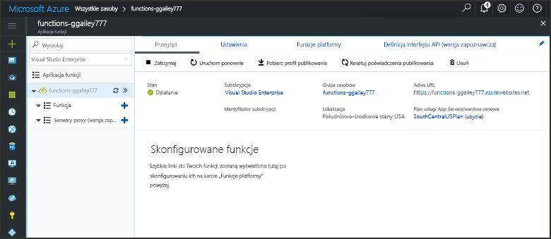
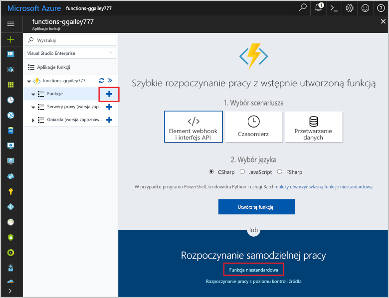

# Tworzenie funkcji wyzwalanej przez element webhook GitHubCreate a function triggered by a GitHub webhook

Dowiedz się, jak toocreate funkcję, która jest wyzwalana przez żądanie HTTP elementu webhook z ładunku specyficzne dla usługi GitHub.Learn how toocreate a function that is triggered by an HTTP webhook request with a GitHub-specific payload.

## Wymagania wstępnePrerequisites

+ Konto w usłudze GitHub z przynajmniej jednym projektem.A GitHub account with at least one project.
+ Subskrypcja platformy Azure.An Azure subscription. Jeśli nie masz subskrypcji, przed rozpoczęciem utwórz [bezpłatne konto](https://azure.microsoft.com/free/?WT.mc_id=A261C142F).If you don't have one, create a [free account](https://azure.microsoft.com/free/?WT.mc_id=A261C142F) before you begin.

[!INCLUDE [functions-portal-favorite-function-apps](../../includes/functions-portal-favorite-function-apps.md)]

## Tworzenie aplikacji funkcji platformy AzureCreate an Azure Function app

[!INCLUDE [Create function app Azure portal](../../includes/functions-create-function-app-portal.md)]

Następnie należy utworzyć funkcji w hello nowej funkcji aplikacji.Next, you create a function in hello new function app.

## Tworzenie funkcji wyzwalanej przez element webhook GitHubCreate a GitHub webhook triggered function

1. Rozwiń węzeł funkcji aplikacji, a następnie kliknij przycisk hello  **+**  obok przycisku zbyt**funkcji**.Expand your function app and click hello **+** button next too**Functions**. Jeśli hello pierwszej funkcji w funkcji aplikacji, wybierz **Niestandardowa funkcja**.If this is hello first function in your function app, select **Custom function**. Spowoduje to wyświetlenie hello pełny zestaw szablonów funkcji.This displays hello complete set of function templates.

    

2. Wybierz hello **GitHub WebHook** szablon odpowiedni język.Select hello **GitHub WebHook** template for your desired language. **Nadaj nazwę funkcji**, a następnie wybierz pozycję **Utwórz**.**Name your function**, then select **Create**.

      

3. W nowych funkcji, kliknij przycisk **adres URL funkcji <> / Get**, następnie skopiuj i Zapisz hello wartości.In your new function, click **</> Get function URL**, then copy and save hello values. Witaj samo dla **<> / GitHub pobrać klucza tajnego**.Do hello same thing for **</> Get GitHub secret**. Użyjesz tych wartości tooconfigure hello elementu webhook w witrynie GitHub.You use these values tooconfigure hello webhook in GitHub.

    

W następnym kroku zostanie utworzony element webhook w repozytorium GitHub.Next, you create a webhook in your GitHub repository.

## Skonfiguruj hello elementu webhookConfigure hello webhook

1. W witrynie GitHub Przejdź repozytorium tooa, którego jesteś właścicielem.In GitHub, navigate tooa repository that you own. Możesz też użyć dowolnego rozwidlonego repozytorium.You can also use any repository that you have forked. Jeśli potrzebujesz toofork repozytorium, użyj <https://github.com/Azure-Samples/functions-quickstart>.If you need toofork a repository, use <https://github.com/Azure-Samples/functions-quickstart>.

1. Kliknij kolejno pozycje **Ustawienia**, **Elementy webhook** i **Dodaj element webhook**.Click **Settings**, then click **Webhooks**, and  **Add webhook**.

    

1. Użyj ustawień określonych w tabeli hello, a następnie kliknij przycisk **Dodawanie elementu webhook**.Use settings as specified in hello table, then click **Add webhook**.

    

| UstawienieSetting | Sugerowana wartośćSuggested value | OpisDescription |
|---|---|---|
| **Adres URL ładunku****Payload URL** | Skopiowana wartośćCopied value | Użyj hello wartość zwrócona przez **adres URL funkcji <> / Get**.Use hello value returned by  **</> Get function URL**. |
| **Wpis tajny****Secret**   | Skopiowana wartośćCopied value | Użyj hello wartość zwrócona przez **<> / GitHub pobrać klucza tajnego**.Use hello value returned by  **</> Get GitHub secret**. |
| **Typ zawartości****Content type** | application/jsonapplication/json | Funkcja Hello oczekuje ładunek JSON.hello function expects a JSON payload. |
| Wyzwalacze zdarzeńEvent triggers | Pozwól mi wybrać pojedyncze zdarzeniaLet me select individual events | Chcemy tylko tootrigger problem komentarz zdarzeń.We only want tootrigger on issue comment events.  |
| | Komentarz dotyczący problemuIssue comment |  |

Teraz, hello elementu webhook jest skonfigurowany tootrigger funkcji w przypadku dodania nowego komentarza problem.Now, hello webhook is configured tootrigger your function when a new issue comment is added.

## Funkcja hello testuTest hello function

1. W repozytorium GitHub Otwórz hello **problemów** kartę w nowym oknie przeglądarki.In your GitHub repository, open hello **Issues** tab in a new browser window.

1. W nowym oknie powitania kliknij **nowy problem**wpisz tytuł, a następnie kliknij przycisk **przesłać nowy problem**.In hello new window, click **New Issue**, type a title, and then click **Submit new issue**.

1. W hello problem, wprowadź komentarz, a następnie kliknij przycisk **komentarz**.In hello issue, type a comment and click **Comment**.

    

1. Toohello portal wrócić do poprzedniej strony i sprawdź dzienniki hello.Go back toohello portal and view hello logs. Wpis śledzenia na nowy tekst komentarza hello powinna zostać wyświetlona.You should see a trace entry with hello new comment text.

     

## Oczyszczanie zasobówClean up resources

[!INCLUDE [Next steps note](../../includes/functions-quickstart-cleanup.md)]

## Następne krokiNext steps

Utworzono funkcję, która jest uruchamiana w momencie otrzymania żądania od elementu webhook GitHub.You have created a function that runs when a request is received from a GitHub webhook.

[!INCLUDE [Next steps note](../../includes/functions-quickstart-next-steps.md)]

Aby uzyskać więcej informacji na temat wyzwalaczy elementów webhook, zobacz temat [Powiązania protokołu HTTP i elementów webhook w usłudze Azure Functions](functions-bindings-http-webhook.md).For more information about webhook triggers, see [Azure Functions HTTP and webhook bindings](functions-bindings-http-webhook.md).
