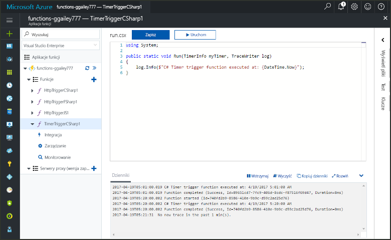
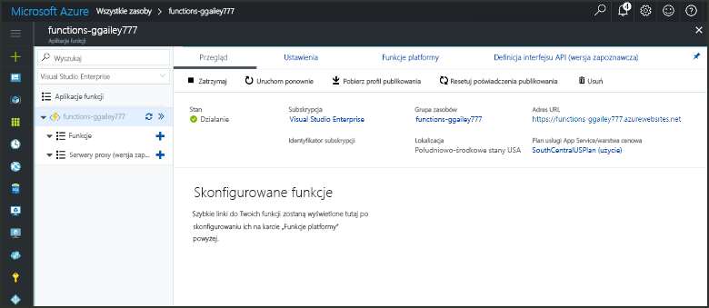
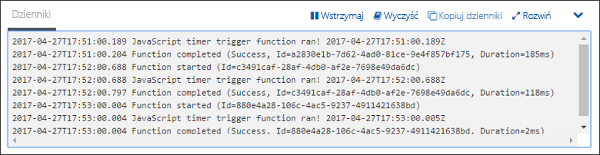
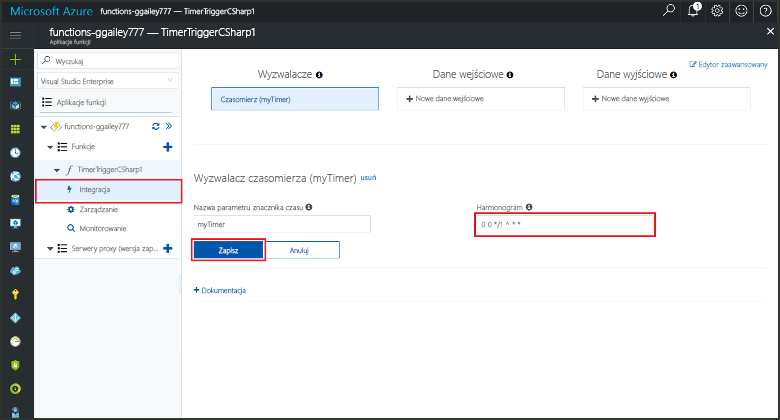

# Tworzenie funkcji wyzwalanej czasomierzem na platformie AzureCreate a function in Azure that is triggered by a timer

Dowiedz się, jak za pomocą usługi Azure Functions utworzyć funkcję uruchamianą zgodnie z określonym harmonogramem.Learn how to use Azure Functions to create a function that runs based a schedule that you define.

## Wymagania wstępnePrerequisites

W celu ukończenia tego samouczka:To complete this tutorial:

+ Jeśli nie masz subskrypcji platformy Azure, przed rozpoczęciem utwórz [bezpłatne konto](https://azure.microsoft.com/free/?WT.mc_id=A261C142F).If you don't have an Azure subscription, create a [free account](https://azure.microsoft.com/free/?WT.mc_id=A261C142F) before you begin.

[!INCLUDE [functions-portal-favorite-function-apps](../../includes/functions-portal-favorite-function-apps.md)]

## Tworzenie aplikacji funkcji platformy AzureCreate an Azure Function app

[!INCLUDE [Create function app Azure portal](../../includes/functions-create-function-app-portal.md)]

Następnie należy utworzyć funkcję w nowej aplikacji funkcji.Next, you create a function in the new function app.

## Tworzenie funkcji wyzwalanej czasomierzemCreate a timer triggered function

1. Rozwiń aplikację funkcji i kliknij przycisk **+** obok pozycji **Funkcje**.Expand your function app and click the **+** button next to **Functions**. Jeśli jest to pierwsza funkcja w aplikacji funkcji, wybierz pozycję **Funkcja niestandardowa**.If this is the first function in your function app, select **Custom function**. Spowoduje to wyświetlenie pełnego zestawu szablonów funkcji.This displays the complete set of function templates.

    

2. Wybierz szablon **TimerTrigger** dla odpowiedniego języka.Select the **TimerTrigger** template for your desired language. Następnie użyj ustawień określonych w tabeli:Then use the settings as specified in the table:

    

    | UstawienieSetting | Sugerowana wartośćSuggested value | OpisDescription |
    |---|---|---|
    | **Nazwa funkcji****Name your function** | TimerTriggerCSharp1TimerTriggerCSharp1 | Określa nazwę funkcji wyzwalanej czasomierzem.Defines the name of your timer triggered function. |
    | **[Harmonogram](http://en.wikipedia.org/wiki/Cron#CRON_expression)****[Schedule](http://en.wikipedia.org/wiki/Cron#CRON_expression)** | 0 \*/1 \* \* \* \*0 \*/1 \* \* \* \* | Składające się z 6 pól [wyrażenie CRON](http://en.wikipedia.org/wiki/Cron#CRON_expression) planujące uruchamianie funkcji co minutę.A six field [CRON expression](http://en.wikipedia.org/wiki/Cron#CRON_expression) that schedules your function to run every minute. |

2. Kliknij przycisk **Utwórz**.Click **Create**. Zostanie utworzona funkcja w wybranym języku uruchamiana co minutę.A function is created in your chosen language that runs every minute.

3. Zweryfikuj uruchomienie, wyświetlając informacje o śledzeniu zapisane w dziennikach.Verify execution by viewing trace information written to the logs.

    

Teraz możesz zmienić harmonogram funkcji tak, aby była uruchamiana rzadziej, na przykład co godzinę.Now, you can change the function's schedule so that it runs less often, such as once every hour. 

## Aktualizowanie harmonogramu czasomierzaUpdate the timer schedule

1. Rozwiń swoją funkcję i kliknij pozycję **Integracja**.Expand your function and click **Integrate**. W tym miejscu określa się powiązania danych wejściowych i wyjściowych dla funkcji oraz ustawia harmonogram.This is where you define input and output bindings for your function and also set the schedule. 

2. W polu **Harmonogram** wprowadź nową wartość `0 0 */1 * * *`, a następnie kliknij przycisk **Zapisz**.Enter a new **Schedule** value of `0 0 */1 * * *`, and then click **Save**.  

Funkcja będzie teraz uruchamiana raz na godzinę.You now have a function that runs once every hour. 

## Oczyszczanie zasobówClean up resources

[!INCLUDE [Next steps note](../../includes/functions-quickstart-cleanup.md)]

## Następne krokiNext steps

Utworzono funkcję uruchamianą zgodnie z harmonogramem.You have created a function that runs based on a schedule.

[!INCLUDE [Next steps note](../../includes/functions-quickstart-next-steps.md)]

Aby uzyskać więcej informacji na temat wyzwalaczy czasomierza, zobacz [Planowanie wykonywania kodu za pomocą usługi Azure Functions](functions-bindings-timer.md).For more information timer triggers, see [Schedule code execution with Azure Functions](functions-bindings-timer.md).