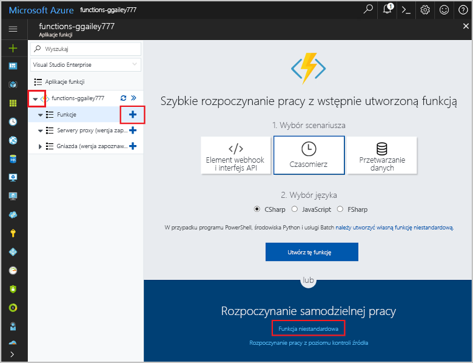

# Tworzenie funkcji wyzwalanej czasomierzem na platformie AzureCreate a function in Azure that is triggered by a timer

Dowiedz się, jak toocreate usługi Azure Functions toouse funkcję, która działa na podstawie zdefiniowanego harmonogramu.Learn how toouse Azure Functions toocreate a function that runs based a schedule that you define.

## Wymagania wstępnePrerequisites

toocomplete tego samouczka:toocomplete this tutorial:

+ Jeśli nie masz subskrypcji platformy Azure, przed rozpoczęciem utwórz [bezpłatne konto](https://azure.microsoft.com/free/?WT.mc_id=A261C142F).If you don't have an Azure subscription, create a [free account](https://azure.microsoft.com/free/?WT.mc_id=A261C142F) before you begin.

[!INCLUDE [functions-portal-favorite-function-apps](../../includes/functions-portal-favorite-function-apps.md)]

## Tworzenie aplikacji funkcji platformy AzureCreate an Azure Function app

[!INCLUDE [Create function app Azure portal](../../includes/functions-create-function-app-portal.md)]

Następnie należy utworzyć funkcji w hello nowej funkcji aplikacji.Next, you create a function in hello new function app.

## Tworzenie funkcji wyzwalanej czasomierzemCreate a timer triggered function

1. Rozwiń węzeł funkcji aplikacji, a następnie kliknij przycisk hello  **+**  obok przycisku zbyt**funkcji**.Expand your function app and click hello **+** button next too**Functions**. Jeśli hello pierwszej funkcji w funkcji aplikacji, wybierz **Niestandardowa funkcja**.If this is hello first function in your function app, select **Custom function**. Spowoduje to wyświetlenie hello pełny zestaw szablonów funkcji.This displays hello complete set of function templates.

    

2. Wybierz hello **TimerTrigger** szablon odpowiedni język.Select hello **TimerTrigger** template for your desired language. Następnie należy użyć ustawień hello określoną w tabeli hello:Then use hello settings as specified in hello table:

    

    | UstawienieSetting | Sugerowana wartośćSuggested value | OpisDescription |
    |---|---|---|
    | **Nazwa funkcji****Name your function** | TimerTriggerCSharp1TimerTriggerCSharp1 | Definiuje nazwę hello funkcji czasomierza wyzwolone.Defines hello name of your timer triggered function. |
    | **[Harmonogram](http://en.wikipedia.org/wiki/Cron#CRON_expression)****[Schedule](http://en.wikipedia.org/wiki/Cron#CRON_expression)** | 0 \*/1 \* \* \* \*0 \*/1 \* \* \* \* | Pole sześć [wyrażenie CRON](http://en.wikipedia.org/wiki/Cron#CRON_expression) która planuje toorun Twojego funkcja co minutę.A six field [CRON expression](http://en.wikipedia.org/wiki/Cron#CRON_expression) that schedules your function toorun every minute. |

2. Kliknij przycisk **Utwórz**.Click **Create**. Zostanie utworzona funkcja w wybranym języku uruchamiana co minutę.A function is created in your chosen language that runs every minute.

3. Wyświetlanie informacji o śledzeniu zapisane dzienniki toohello Sprawdź wykonywania.Verify execution by viewing trace information written toohello logs.

    

Teraz można zmienić harmonogramu hello funkcji wykonywania rzadziej, takich jak co godzinę.Now, you can change hello function's schedule so that it runs less often, such as once every hour. 

## Harmonogram czasomierza hello aktualizacjiUpdate hello timer schedule

1. Rozwiń swoją funkcję i kliknij pozycję **Integracja**.Expand your function and click **Integrate**. Jest to, którym zdefiniować dane wejściowe i wyjściowe powiązań dla funkcji i również ustawić harmonogram hello.This is where you define input and output bindings for your function and also set hello schedule. 

2. W polu **Harmonogram** wprowadź nową wartość `0 0 */1 * * *`, a następnie kliknij przycisk **Zapisz**.Enter a new **Schedule** value of `0 0 */1 * * *`, and then click **Save**.  

Funkcja będzie teraz uruchamiana raz na godzinę.You now have a function that runs once every hour. 

## Oczyszczanie zasobówClean up resources

[!INCLUDE [Next steps note](../../includes/functions-quickstart-cleanup.md)]

## Następne krokiNext steps

Utworzono funkcję uruchamianą zgodnie z harmonogramem.You have created a function that runs based on a schedule.

[!INCLUDE [Next steps note](../../includes/functions-quickstart-next-steps.md)]

Aby uzyskać więcej informacji na temat wyzwalaczy czasomierza, zobacz [Planowanie wykonywania kodu za pomocą usługi Azure Functions](functions-bindings-timer.md).For more information timer triggers, see [Schedule code execution with Azure Functions](functions-bindings-timer.md).