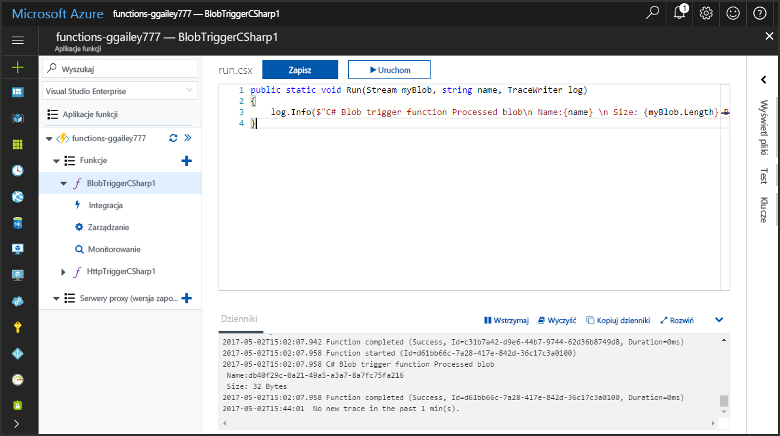
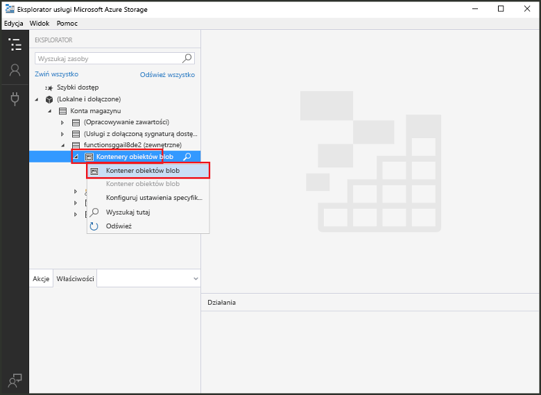
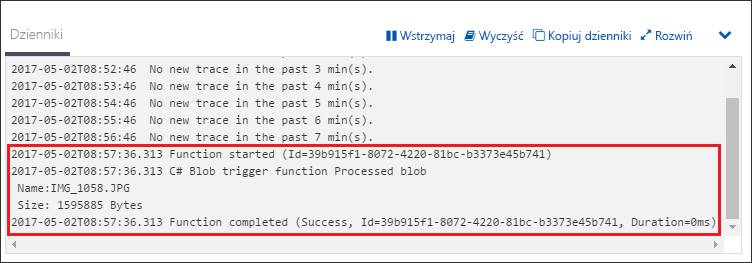

# Tworzenie funkcji wyzwalanej przez magazyn obiektów Blob

Dowiedz się, jak toocreate funkcji wyzwalane, gdy pliki są przekazywane tooor zaktualizowane w magazynie obiektów Blob Azure.

## Wymagania wstępne

+ Pobierz i zainstaluj hello [Eksploratora usługi Microsoft Azure Storage](http://storageexplorer.com/).
+ Subskrypcja platformy Azure. Jeśli nie masz subskrypcji, przed rozpoczęciem utwórz [bezpłatne konto](https://azure.microsoft.com/free/?WT.mc_id=A261C142F).

[!INCLUDE [functions-portal-favorite-function-apps](../../includes/functions-portal-favorite-function-apps.md)]

## Tworzenie aplikacji funkcji platformy Azure

[!INCLUDE [Create function app Azure portal](../../includes/functions-create-function-app-portal.md)]

Następnie należy utworzyć funkcji w hello nowej funkcji aplikacji.

## Tworzenie funkcji wyzwalanej przez magazyn obiektów Blob

1. Rozwiń węzeł funkcji aplikacji, a następnie kliknij przycisk hello  **+**  obok przycisku zbyt**funkcji**. Jeśli hello pierwszej funkcji w funkcji aplikacji, wybierz **Niestandardowa funkcja**. Spowoduje to wyświetlenie hello pełny zestaw szablonów funkcji.

    

2. Wybierz hello **BlobTrigger** szablonu żądany język i użyj hello ustawień określonych w tabeli hello.

    

    | Ustawienie | Sugerowana wartość | Opis |
    |---|---|---|
    | **Ścieżka**   | mycontainer/{nazwa}    | Lokalizacja w monitorowanym magazynie obiektów Blob. Nazwa pliku Hello hello obiektu blob jest przekazywany w powiązaniu hello jako hello _nazwa_ parametru.  |
    | **Połączenie konta magazynu** | AzureWebJobStorage | Użyj połączenia konta magazynu hello już używana przez aplikację funkcji lub Utwórz nową.  |
    | **Nazwa funkcji** | Unikatowa w obrębie aplikacji funkcji | Nazwa funkcji wyzwalanej przez obiekt blob. |

3. Kliknij przycisk **Utwórz** toocreate funkcji.

Następnie połączyć konto magazynu Azure tooyour i utworzyć hello **mojkontener** kontenera.

## Tworzenie kontenera hello

1. W funkcji kliknij pozycję **Integracja**, rozwiń pozycję **Dokumentacja** i skopiuj wartości pól **Nazwa konta** oraz **Klucz konta**. Używasz konta magazynu te poświadczenia tooconnect toohello. Jeśli nawiązano już połączenie konta magazynu, Pomiń toostep 4.

    

1. Uruchom hello [Eksploratora usługi Microsoft Azure Storage](http://storageexplorer.com/) narzędzia, kliknij przycisk hello połączenia powitania po lewej stronie, wybierz **użyć nazwy konta magazynu i klucza**i kliknij przycisk **dalej**.

    

1. Wprowadź hello **nazwa konta** i **klucz konta** z kroku 1, kliknij przycisk **dalej** , a następnie **Connect**. 

    

1. Rozwiń hello dołączony konta magazynu, kliknij prawym przyciskiem myszy **obiektu Blob kontenery**, kliknij przycisk **Tworzenie kontenera obiektów blob**, typu `mycontainer`, a następnie naciśnij klawisz enter.

    

Teraz, gdy masz kontenera obiektów blob można przetestować funkcji hello przekazując kontenera toohello plików.

## Funkcja hello testu

1. W portalu Azure hello, funkcja tooyour przeglądania rozwiń hello **dzienniki** u dołu strony hello i upewnij się, że hello przesyłania strumieniowego tego dziennika nie jest wstrzymana.

1. W programie Storage Explorer rozwiń swoje konto magazynu i wybierz kolejno pozycje **Blob containers** (Kontenery obiektów Blob) oraz **mycontainer**. Kliknij pozycję **Upload** (Przekaż), a następnie pozycję **Upload files...** (Przekaż pliki...).

    

1. W hello **przekazać pliki** okna dialogowego kliknij hello **pliki** pola. Przeglądaj plik tooa na komputerze lokalnym, takich jak plik obrazu, zaznacz go i kliknij **Otwórz** , a następnie **przekazać**.

1. Przejdź wstecz tooyour dzienniki funkcji i sprawdź, czy dany obiekt blob hello został odczytany.

   

    >[!NOTE]
    > Po uruchomieniu aplikacji funkcja hello domyślne użycie planu, może istnieć opóźnienie się tooseveral minut między hello obiektów blob są dodane lub zaktualizowane i hello funkcji inicjowane. Jeśli zależy Ci na małych opóźnieniach w funkcjach wyzwalanych przez obiekty Blob, rozważ uruchomienie aplikacji funkcji w planie usługi App Service.

## Oczyszczanie zasobów

[!INCLUDE [Next steps note](../../includes/functions-quickstart-cleanup.md)]

## Następne kroki

Utworzono funkcję, która jest uruchamiana po dodaniu tooor zaktualizowane obiektu blob w magazynie obiektów Blob. 

[!INCLUDE [Next steps note](../../includes/functions-quickstart-next-steps.md)]

Aby uzyskać więcej informacji na temat wyzwalaczy magazynu obiektów Blob, zobacz [Powiązania magazynu obiektów Blob w usłudze Azure Functions](functions-bindings-storage-blob.md).
