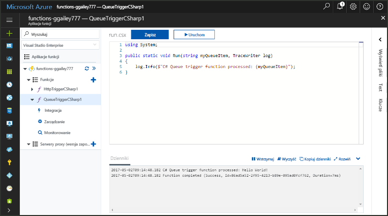
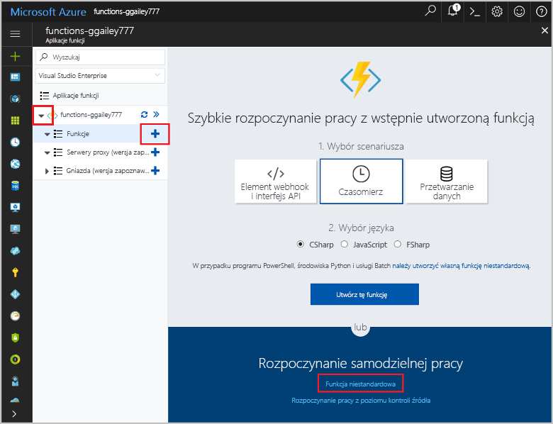
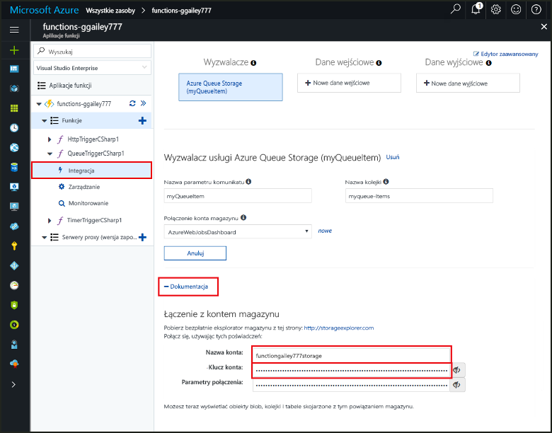
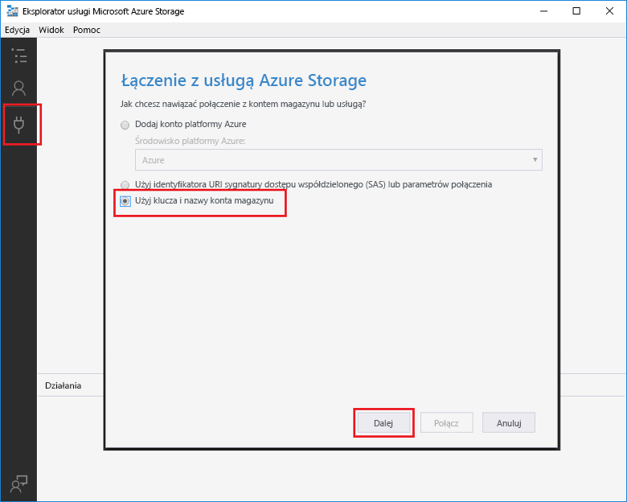
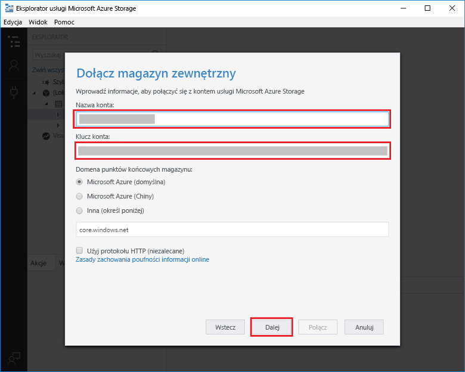
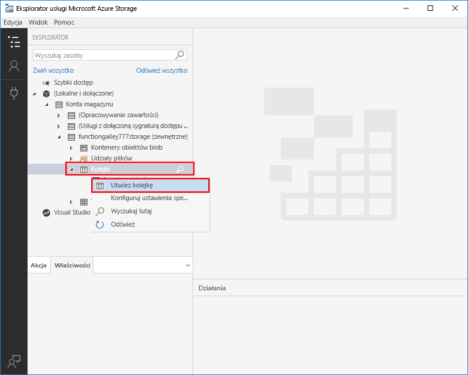
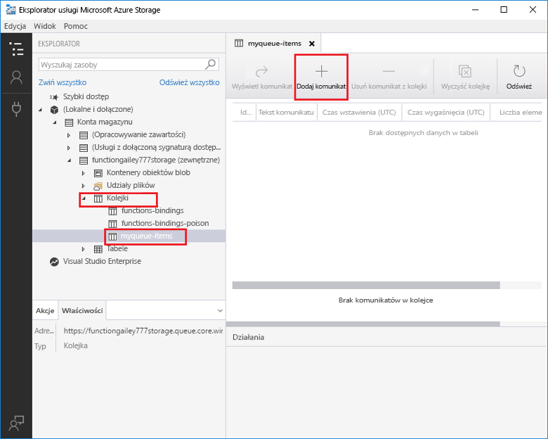
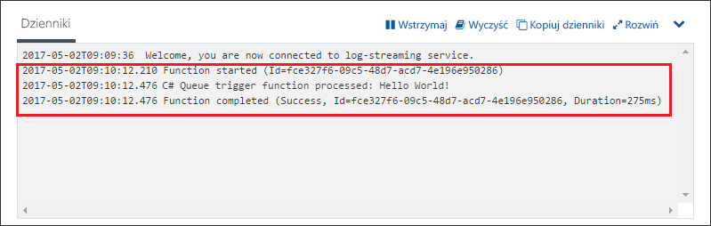

# Tworzenie funkcji wyzwalanej przez usługę Azure Queue Storage

Dowiedz się, jak toocreate funkcji wyzwalane, gdy wiadomości są przesyłane tooan kolejki magazynu Azure.

## Wymagania wstępne

- Pobierz i zainstaluj hello [Eksploratora usługi Microsoft Azure Storage](http://storageexplorer.com/).

- Subskrypcja platformy Azure. Jeśli nie masz subskrypcji, przed rozpoczęciem utwórz [bezpłatne konto](https://azure.microsoft.com/free/?WT.mc_id=A261C142F).

[!INCLUDE [functions-portal-favorite-function-apps](../../includes/functions-portal-favorite-function-apps.md)]

## Tworzenie aplikacji funkcji platformy Azure

[!INCLUDE [Create function app Azure portal](../../includes/functions-create-function-app-portal.md)]

Następnie należy utworzyć funkcji w hello nowej funkcji aplikacji.

## Tworzenie funkcji wyzwalanej przez kolejkę

1. Rozwiń węzeł funkcji aplikacji, a następnie kliknij przycisk hello  **+**  obok przycisku zbyt**funkcji**. Jeśli hello pierwszej funkcji w funkcji aplikacji, wybierz **Niestandardowa funkcja**. Spowoduje to wyświetlenie hello pełny zestaw szablonów funkcji.

    

2. Wybierz hello **QueueTrigger** szablonu żądany język i użyj hello ustawień określonych w tabeli hello.

    
    
    | Ustawienie | Sugerowana wartość | Opis |
    |---|---|---|
    | **Nazwa kolejki**   | myqueue-items    | Nazwa hello kolejki tooconnect tooin Twojego konta magazynu. |
    | **Połączenie konta magazynu** | AzureWebJobStorage | Użyj połączenia konta magazynu hello już używana przez aplikację funkcji lub Utwórz nową.  |
    | **Nazwa funkcji** | Unikatowa w obrębie aplikacji funkcji | Nazwa funkcji wyzwalanej przez kolejkę. |

3. Kliknij przycisk **Utwórz** toocreate funkcji.

Następnie połączyć konto magazynu Azure tooyour i utworzyć hello **elementów Moja_kolejka** kolejki magazynu.

## Utwórz kolejkę hello

1. W funkcji kliknij pozycję **Integracja**, rozwiń pozycję **Dokumentacja** i skopiuj wartości pól **Nazwa konta** oraz **Klucz konta**. Używasz konta magazynu te poświadczenia tooconnect toohello. Jeśli nawiązano już połączenie konta magazynu, Pomiń toostep 4.

    v

1. Uruchom hello [Eksploratora usługi Microsoft Azure Storage](http://storageexplorer.com/) narzędzia, kliknij przycisk hello połączenia powitania po lewej stronie, wybierz **użyć nazwy konta magazynu i klucza**i kliknij przycisk **dalej**.

    

1. Wprowadź hello **nazwa konta** i **klucz konta** z kroku 1, kliknij przycisk **dalej** , a następnie **Connect**.

    

1. Rozwiń hello dołączony konta magazynu, kliknij prawym przyciskiem myszy **kolejek**, kliknij przycisk **Tworzenie kolejki**, typ `myqueue-items`, a następnie naciśnij klawisz enter.

    

Teraz, gdy masz kolejki magazynu można przetestować funkcji hello przez dodanie toohello kolejki komunikatów.

## Funkcja hello testu

1. W portalu Azure hello, funkcja tooyour przeglądania rozwiń hello **dzienniki** u dołu strony hello i upewnij się, że hello przesyłania strumieniowego tego dziennika nie jest wstrzymana.

1. W programie Storage Explorer rozwiń swoje konto magazynu, wybierz kolejno pozycje **Queues** (Kolejki) i **myqueue-items**, a następnie kliknij pozycję **Add message** (Dodaj komunikat).

    

1. Wpisz komunikat „Hello World!” w polu **Message text** (Tekst komunikatu) i kliknij przycisk **OK**.

1. Zaczekaj kilka sekund, a następnie wróć tooyour dzienniki funkcji i sprawdź, czy tej nowej wiadomości powitania został odczytany z kolejki hello.

    

1. W Eksploratorze magazynu kliknij **Odśwież** i sprawdź, że wiadomość hello został przetworzony i nie jest już w kolejce hello.

## Oczyszczanie zasobów

[!INCLUDE [Next steps note](../../includes/functions-quickstart-cleanup.md)]

## Następne kroki

Utworzono funkcję, która jest uruchamiana, gdy wiadomość zostanie dodany tooa magazynu kolejki.

[!INCLUDE [Next steps note](../../includes/functions-quickstart-next-steps.md)]

Aby uzyskać więcej informacji na temat wyzwalaczy usługi Queue Storage, zobacz [Powiązania usługi Queue Storage w usłudze Azure Functions](functions-bindings-storage-queue.md).