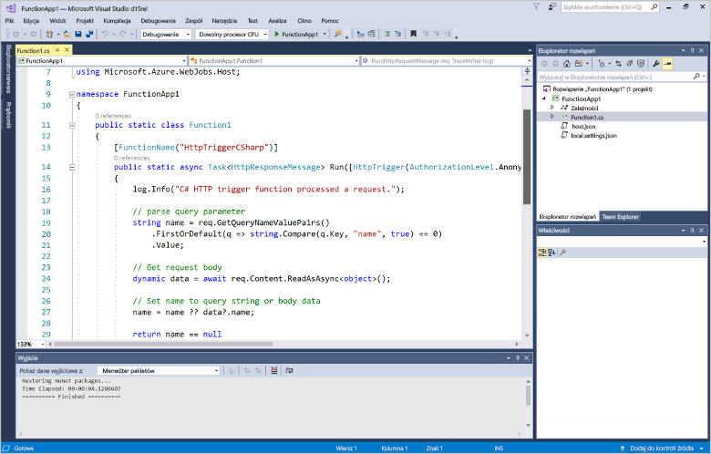
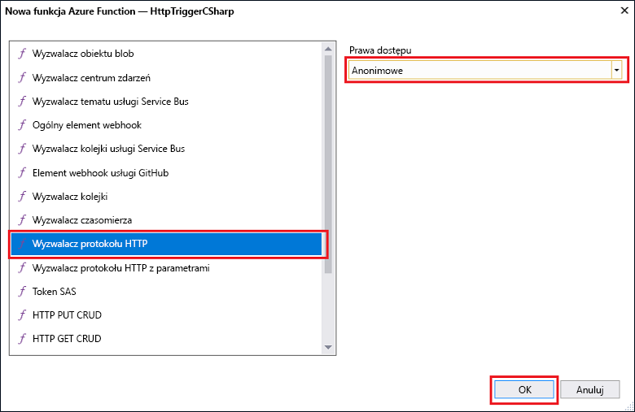

# Tworzenie pierwszej funkcji przy użyciu programu Visual StudioCreate your first function using Visual Studio

Środowisko Azure Functions umożliwia wykonywanie kodu w środowisku bez serwera bez konieczności toofirst tworzenie maszyny Wirtualnej lub opublikować aplikację sieci web.Azure Functions lets you execute your code in a serverless environment without having toofirst create a VM or publish a web application.

W tym temacie dowiesz się, jak toouse hello 2017 usługi Visual Studio tools dla usługi Azure Functions toocreate i przetestować funkcję "hello world", który jest lokalnie.In this topic, you learn how toouse hello Visual Studio 2017 tools for Azure Functions toocreate and test a "hello world" function locally. Następnie będzie publikować tooAzure kodu funkcji hello.You will then publish hello function code tooAzure. Te narzędzia są dostępne jako część hello obciążenia Azure Programowanie w Visual Studio 2017 wersji 15 ustęp 3 lub nowszym.These tools are available as part of hello Azure development workload in Visual Studio 2017 version 15.3, or a later version.

## Wymagania wstępnePrerequisites

toocomplete tego samouczka, instalacji:toocomplete this tutorial, install:

* [Visual Studio 2017 wersji 15 ustęp 3](https://www.visualstudio.com/vs/preview/), łącznie z hello **Azure programowanie** obciążenia.[Visual Studio 2017 version 15.3](https://www.visualstudio.com/vs/preview/), including hello **Azure development** workload.

    
    
    >[!NOTE]  
    Po instalacji lub uaktualnienia tooVisual Studio 2017 wersji 15 ustęp 3, może być również konieczne toomanually aktualizacji hello 2017 usługi Visual Studio tools dla usługi Azure Functions.After you install or upgrade tooVisual Studio 2017 version 15.3, you might also need toomanually update hello Visual Studio 2017 tools for Azure Functions. Można aktualizować hello narzędzi z hello **narzędzia** menu w obszarze **rozszerzenia i aktualizacje...**   >  **Aktualizacje** > **programu Visual Studio Marketplace** > **sieci Web i usługę Azure Functions zadania narzędzia**  >  **Aktualizacji**.You can update hello tools from hello **Tools** menu under **Extensions and Updates...** > **Updates** > **Visual Studio Marketplace** > **Azure Functions and Web Jobs Tools** > **Update**. 

[!INCLUDE [quickstarts-free-trial-note](../../includes/quickstarts-free-trial-note.md)] 

## Tworzenie projektu usługi Azure Functions w programie Visual StudioCreate an Azure Functions project in Visual Studio

[!INCLUDE [Create a project using hello Azure Functions template](../../includes/functions-vstools-create.md)]

Teraz, po utworzeniu projektu hello, można utworzyć swoją pierwszą funkcję.Now that you have created hello project, you can create your first function.

## Utwórz hello — funkcjaCreate hello function

1. W **Eksploratorze rozwiązań** kliknij prawym przyciskiem myszy węzeł projektu i wybierz polecenie **Dodaj** > **Nowy element**.In **Solution Explorer**, right-click on your project node and select **Add** > **New Item**. Wybierz pozycję **Funkcja platformy Azure** i kliknij pozycję **Dodaj**.Select **Azure Function** and click **Add**.

2. Wybierz pozycję **HttpTrigger**, wpisz **nazwę funkcji**, wybierz opcję **Anonimowe** w polu **Prawa dostępu** i kliknij pozycję **Utwórz**.Select **HttpTrigger**, type a **Function Name**, select **Anonymous** for **Access Rights**, and click **Create**. Funkcja Hello tworzone jest dostępny przez żądania HTTP za pomocą dowolnego klienta.hello function created is accessed by an HTTP request from any client. 

    

    Projekt tooyour, który zawiera klasę implementującą kodu funkcji zostanie dodany plik kodu.A code file is added tooyour project that contains a class that implements your function code. Ten kod opiera się na szablonie, który odbiera wartość nazwy i tłumiące echo go.This code is based on a template, which receives a name value and echos it back. Witaj **FunctionName** atrybut ustawia hello nazwę funkcji.hello **FunctionName** attribute sets hello name of your function. Witaj **HttpTrigger** atrybut wskazuje wiadomość hello wyzwala hello funkcji.hello **HttpTrigger** attribute indicates hello message that triggers hello function. 

    

Po utworzeniu funkcji wyzwalanej przez protokół HTTP można ją przetestować na komputerze lokalnym.Now that you have created an HTTP-triggered function, you can test it on your local computer.

## Testowanie funkcji hello lokalnieTest hello function locally

Podstawowe narzędzia usługi Azure Functions umożliwiają uruchamianie projektu usługi Azure Functions na lokalnym komputerze deweloperskim.Azure Functions Core Tools lets you run Azure Functions project on your local development computer. Jesteś zostanie wyświetlony monit o tooinstall, które te narzędzia hello podczas pierwszego uruchomienia funkcji w programie Visual Studio.You are prompted tooinstall these tools hello first time you start a function from Visual Studio.  

1. tootest funkcji, naciśnij klawisz F5.tootest your function, press F5. Po wyświetleniu monitu Zaakceptuj Żądanie hello z toodownload programu Visual Studio i zainstalować narzędzia do podstawowych funkcji platformy Azure (CLI).If prompted, accept hello request from Visual Studio toodownload and install Azure Functions Core (CLI) tools.  Możesz także tooenable wyjątek zapory, aby narzędzia hello mogły obsługiwać żądania HTTP.You may also need tooenable a firewall exception so that hello tools can handle HTTP requests.

2. Adres URL hello kopiowania funkcji ze środowiska uruchomieniowego usługi Azure Functions hello wyjściowej.Copy hello URL of your function from hello Azure Functions runtime output.  

    

3. Wklej adres URL żądania HTTP hello hello do paska adresu przeglądarki.Paste hello URL for hello HTTP request into your browser's address bar. Dołącz ciągu zapytania hello `&name=<yourname>` toothis adresu URL i wykonać hello żądania.Append hello query string `&name=<yourname>` toothis URL and execute hello request. Hello poniżej przedstawiono odpowiedzi hello w hello przeglądarki toohello lokalne żądania GET zwracane przez funkcję hello:hello following shows hello response in hello browser toohello local GET request returned by hello function: 

    

4. toostop debugowanie, kliknij przycisk hello **zatrzymać** przycisk na powitania narzędzi Visual Studio.toostop debugging, click hello **Stop** button on hello Visual Studio toolbar.

Po sprawdzeniu, czy funkcja hello działa poprawnie na komputerze lokalnym, jest tooAzure projektu hello toopublish czasu.After you have verified that hello function runs correctly on your local computer, it's time toopublish hello project tooAzure.

## Publikowanie hello tooAzure projektuPublish hello project tooAzure

Aby opublikować projekt, musisz mieć aplikację funkcji w swojej subskrypcji platformy Azure.You must have a function app in your Azure subscription before you can publish your project. Aplikację funkcji możesz utworzyć bezpośrednio w programie Visual Studio.You can create a function app right from Visual Studio.

[!INCLUDE [Publish hello project tooAzure](../../includes/functions-vstools-publish.md)]

## Testowanie funkcji na platformie AzureTest your function in Azure

1. Skopiuj hello podstawowy adres URL aplikacji funkcji hello ze strony profilu publikowania hello.Copy hello base URL of hello function app from hello Publish profile page. Zastąp hello `localhost:port` część adresu URL hello używane podczas testowania funkcji hello lokalnie z hello nowego podstawowego adresu URL.Replace hello `localhost:port` portion of hello URL you used when testing hello function locally with hello new base URL. Jak wcześniej, upewnij się, że ciąg zapytania hello tooappend `&name=<yourname>` toothis adresu URL i wykonać hello żądania.As before, make sure tooappend hello query string `&name=<yourname>` toothis URL and execute hello request.

    adres URL Hello, która wywołuje HTTP wyzwalane funkcja wygląda następująco:hello URL that calls your HTTP triggered function looks like this:

        http://<functionappname>.azurewebsites.net/api/<functionname>?name=<yourname> 

2. Wklej nowy adres URL dla żądania hello HTTP w pasku adresu przeglądarki.Paste this new URL for hello HTTP request into your browser's address bar. Hello poniżej przedstawiono odpowiedzi hello w hello przeglądarki toohello zdalnego żądania GET zwracane przez funkcję hello:hello following shows hello response in hello browser toohello remote GET request returned by hello function: 

    
 
## Następne krokiNext steps

Użyto aplikacji funkcji toocreate C# dla programu Visual Studio przy użyciu prostych funkcji HTTP wyzwolone.You have used Visual Studio toocreate a C# function app with a simple HTTP triggered function. 

+ toolearn jak tooconfigure toosupport Twojego projektu inne rodzaje wyzwalaczy i powiązań, zobacz hello [Konfiguruj hello projektu dla rozwoju lokalnych](functions-develop-vs.md#configure-the-project-for-local-development) sekcji [narzędzi funkcji Azure dla programu Visual Studio](functions-develop-vs.md).toolearn how tooconfigure your project toosupport other types of triggers and bindings, see hello [Configure hello project for local development](functions-develop-vs.md#configure-the-project-for-local-development) section in [Azure Functions Tools for Visual Studio](functions-develop-vs.md).
+ toolearn więcej informacji na temat lokalnych testowanie i debugowanie przy użyciu hello Azure funkcje podstawowe narzędzia, zobacz [kodu oraz testów usługi Azure Functions lokalnie](functions-run-local.md).toolearn more about local testing and debugging using hello Azure Functions Core Tools, see [Code and test Azure Functions locally](functions-run-local.md). 
+ toolearn więcej informacji na temat tworzenia funkcji jako biblioteki klas .NET, zobacz [.NET przy użyciu biblioteki klas z usługi Azure Functions](functions-dotnet-class-library.md).toolearn more about developing functions as .NET class libraries, see [Using .NET class libraries with Azure Functions](functions-dotnet-class-library.md). 

