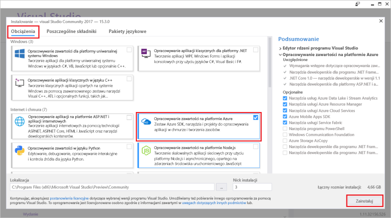

# <a name="azure-functions-tools-for-visual-studio"></a><span data-ttu-id="98d5b-103">Środowisko Azure Functions Tools for Visual Studio</span><span class="sxs-lookup"><span data-stu-id="98d5b-103">Azure Functions Tools for Visual Studio</span></span>  

<span data-ttu-id="98d5b-104">Narzędzi funkcji platformy Azure dla programu Visual Studio 2017 to rozszerzenie dla programu Visual Studio, który pozwala tworzyć, testować i wdrażać funkcje C# na platformie Azure.</span><span class="sxs-lookup"><span data-stu-id="98d5b-104">Azure Functions Tools for Visual Studio 2017 is an extension for Visual Studio that lets you develop, test, and deploy C# functions to Azure.</span></span> <span data-ttu-id="98d5b-105">Jeśli jest to usprawnić pierwszej funkcji platformy Azure, możesz dowiedzieć się więcej, zobacz [wprowadzenie do usługi Azure Functions](functions-overview.md).</span><span class="sxs-lookup"><span data-stu-id="98d5b-105">If this is your first experience with Azure Functions, you can learn more at [An introduction to Azure Functions](functions-overview.md).</span></span>

<span data-ttu-id="98d5b-106">Narzędzia funkcji Azure zapewnia następujące korzyści:</span><span class="sxs-lookup"><span data-stu-id="98d5b-106">The Azure Functions Tools provides the following benefits:</span></span> 

* <span data-ttu-id="98d5b-107">Edytowania, tworzenia i uruchamiania funkcji na komputerze deweloperskim lokalnego.</span><span class="sxs-lookup"><span data-stu-id="98d5b-107">Edit, build, and run functions on your local development computer.</span></span> 
* <span data-ttu-id="98d5b-108">Publikowanie projektu usługi Azure Functions bezpośrednio na platformie Azure.</span><span class="sxs-lookup"><span data-stu-id="98d5b-108">Publish your Azure Functions project directly to Azure.</span></span> 
* <span data-ttu-id="98d5b-109">Użycie zadań Webjob atrybutów w celu zadeklarowania powiązania funkcji bezpośrednio w kodzie C# zamiast utrzymywania osobnych function.json dla powiązania definicje.</span><span class="sxs-lookup"><span data-stu-id="98d5b-109">Use WebJobs attributes to declare function bindings directly in the C# code instead of maintaining a separate function.json for binding definitions.</span></span>
* <span data-ttu-id="98d5b-110">Tworzenie i wdrażanie wstępnie skompilowanym funkcje C#.</span><span class="sxs-lookup"><span data-stu-id="98d5b-110">Develop and deploy pre-compiled C# functions.</span></span> <span data-ttu-id="98d5b-111">Wstępnie skompilowane funkcje umożliwiać wydajności zimnego lepiej niż C# opartych na skryptach funkcji.</span><span class="sxs-lookup"><span data-stu-id="98d5b-111">Pre-complied functions provide a better cold-start performance than C# script-based functions.</span></span> 
* <span data-ttu-id="98d5b-112">Kod funkcji w języku C# przy jednoczesnym zachowaniu wszystkie zalety tworzenia Visual Studio.</span><span class="sxs-lookup"><span data-stu-id="98d5b-112">Code your functions in C# while having all of the benefits of Visual Studio development.</span></span> 

<span data-ttu-id="98d5b-113">W tym temacie przedstawiono sposób użycia narzędzia funkcji Azure dla programu Visual Studio 2017 do opracowywania funkcji w języku C#.</span><span class="sxs-lookup"><span data-stu-id="98d5b-113">This topic shows you how to use the Azure Functions Tools for Visual Studio 2017 to develop your functions in C#.</span></span> <span data-ttu-id="98d5b-114">Możesz również Dowiedz się, jak opublikować projekt na platformie Azure jako zestaw .NET.</span><span class="sxs-lookup"><span data-stu-id="98d5b-114">You also learn how to publish your project to Azure as a .NET assembly.</span></span>

## <a name="prerequisites"></a><span data-ttu-id="98d5b-115">Wymagania wstępne</span><span class="sxs-lookup"><span data-stu-id="98d5b-115">Prerequisites</span></span>

<span data-ttu-id="98d5b-116">Narzędzi funkcji platformy Azure jest uwzględniona w obciążenie Azure programowanie [programu Visual Studio 2017 wersji 15 ustęp 3](https://www.visualstudio.com/vs/), lub jego nowsza wersja.</span><span class="sxs-lookup"><span data-stu-id="98d5b-116">Azure Functions Tools is included in the Azure development workload of [Visual Studio 2017 version 15.3](https://www.visualstudio.com/vs/), or a later version.</span></span> <span data-ttu-id="98d5b-117">Upewnij się, że uwzględniasz **Azure programowanie** obciążenia w instalacji programu Visual Studio 2017 wersji 15 ustęp 3:</span><span class="sxs-lookup"><span data-stu-id="98d5b-117">Make sure you include the **Azure development** workload in your Visual Studio 2017 version 15.3 installation:</span></span>



<span data-ttu-id="98d5b-119">Tworzenie i wdrażanie funkcji, należy również:</span><span class="sxs-lookup"><span data-stu-id="98d5b-119">To create and deploy functions, you also need:</span></span>

* <span data-ttu-id="98d5b-120">Aktywna subskrypcja platformy Azure.</span><span class="sxs-lookup"><span data-stu-id="98d5b-120">An active Azure subscription.</span></span> <span data-ttu-id="98d5b-121">Jeśli nie masz subskrypcji platformy Azure, [wolnego konta](https://azure.microsoft.com/free/?WT.mc_id=A261C142F) są dostępne.</span><span class="sxs-lookup"><span data-stu-id="98d5b-121">If you don't have an Azure subscription, [free accounts](https://azure.microsoft.com/free/?WT.mc_id=A261C142F) are available.</span></span>

* <span data-ttu-id="98d5b-122">Konto magazynu Azure.</span><span class="sxs-lookup"><span data-stu-id="98d5b-122">An Azure Storage account.</span></span> <span data-ttu-id="98d5b-123">Aby utworzyć konto magazynu, zobacz [Utwórz konto magazynu](../storage/common/storage-create-storage-account.md#create-a-storage-account).</span><span class="sxs-lookup"><span data-stu-id="98d5b-123">To create a storage account, see [Create a storage account](../storage/common/storage-create-storage-account.md#create-a-storage-account).</span></span>  
## <a name="create-an-azure-functions-project"></a><span data-ttu-id="98d5b-124">Tworzenie projektu usługi Azure Functions</span><span class="sxs-lookup"><span data-stu-id="98d5b-124">Create an Azure Functions project</span></span> 

[!INCLUDE [Create a project using the Azure Functions](../../includes/functions-vstools-create.md)]


## <a name="configure-the-project-for-local-development"></a><span data-ttu-id="98d5b-125">Konfigurowanie projektu dla rozwoju lokalnych</span><span class="sxs-lookup"><span data-stu-id="98d5b-125">Configure the project for local development</span></span>

<span data-ttu-id="98d5b-126">Podczas tworzenia nowego projektu przy użyciu szablonu usługi Azure Functions, otrzymasz pusty C# projekt, który zawiera następujące pliki:</span><span class="sxs-lookup"><span data-stu-id="98d5b-126">When you create a new project using the Azure Functions template, you get an empty C# project that contains the following files:</span></span>

* <span data-ttu-id="98d5b-127">**Host.JSON**: umożliwia skonfigurowanie hostów funkcji.</span><span class="sxs-lookup"><span data-stu-id="98d5b-127">**host.json**: Lets you configure the Functions host.</span></span> <span data-ttu-id="98d5b-128">Te ustawienia dotyczą zarówno podczas uruchamiania lokalnie i na platformie Azure.</span><span class="sxs-lookup"><span data-stu-id="98d5b-128">These settings apply both when running locally and in Azure.</span></span> <span data-ttu-id="98d5b-129">Aby uzyskać więcej informacji, zobacz [host.json](https://github.com/Azure/azure-webjobs-sdk-script/wiki/host.json) artykule.</span><span class="sxs-lookup"><span data-stu-id="98d5b-129">For more information, see [host.json](https://github.com/Azure/azure-webjobs-sdk-script/wiki/host.json) reference article.</span></span>
    
* <span data-ttu-id="98d5b-130">**Local.Settings.JSON**: przechowuje ustawienia używane podczas uruchamiania lokalnego funkcji.</span><span class="sxs-lookup"><span data-stu-id="98d5b-130">**local.settings.json**: Maintains settings used when running functions locally.</span></span> <span data-ttu-id="98d5b-131">Te ustawienia nie są używane przez platformę Azure, są one używane przez [Azure funkcje podstawowe narzędzia](functions-run-local.md).</span><span class="sxs-lookup"><span data-stu-id="98d5b-131">These settings are not used by Azure, they are used by the [Azure Functions Core Tools](functions-run-local.md).</span></span> <span data-ttu-id="98d5b-132">Użyj tego pliku, aby określić ustawienia, takie jak parametry połączenia do innych usług platformy Azure.</span><span class="sxs-lookup"><span data-stu-id="98d5b-132">Use this file to specify settings, such as connection strings to other Azure services.</span></span> <span data-ttu-id="98d5b-133">Dodaj nowy klucz do **wartości** tablicy dla każdego połączenia wymagany przez funkcje w projekcie.</span><span class="sxs-lookup"><span data-stu-id="98d5b-133">Add a new key to the **Values** array for each connection required by functions in your project.</span></span> <span data-ttu-id="98d5b-134">Aby uzyskać więcej informacji, zobacz [pliku ustawień lokalnych](functions-run-local.md#local-settings-file) w temacie Azure funkcje podstawowe narzędzia.</span><span class="sxs-lookup"><span data-stu-id="98d5b-134">For more information, see [Local settings file](functions-run-local.md#local-settings-file) in the Azure Functions Core Tools topic.</span></span>

<span data-ttu-id="98d5b-135">Środowisko uruchomieniowe Functions używa konta usługi Azure Storage wewnętrznie.</span><span class="sxs-lookup"><span data-stu-id="98d5b-135">The Functions runtime uses an Azure Storage account internally.</span></span> <span data-ttu-id="98d5b-136">W przypadku wyzwolenia wszystkich typów innych niż HTTP i elementów webhook, należy skonfigurować **Values.AzureWebJobsStorage** klucza do prawidłowego ciągu połączenia konta magazynu Azure.</span><span class="sxs-lookup"><span data-stu-id="98d5b-136">For all trigger types other than HTTP and webhooks, you must set the **Values.AzureWebJobsStorage** key to a valid Azure Storage account connection string.</span></span>

[!INCLUDE [Note to not use local storage](../../includes/functions-local-settings-note.md)]

 <span data-ttu-id="98d5b-137">Aby ustawić parametry połączenia konta magazynu:</span><span class="sxs-lookup"><span data-stu-id="98d5b-137">To set the storage account connection string:</span></span>

1. <span data-ttu-id="98d5b-138">W programie Visual Studio Otwórz **Eksplorator chmury**, rozwiń węzeł **konta magazynu** > **Twoje konto magazynu**, a następnie wybierz pozycję **właściwości**i skopiuj **parametry połączenia podstawowej** wartość.</span><span class="sxs-lookup"><span data-stu-id="98d5b-138">In Visual Studio, open **Cloud Explorer**, expand **Storage Account** > **Your Storage Account**, then select **Properties** and copy the **Primary Connection String** value.</span></span>   

2. <span data-ttu-id="98d5b-139">W projekcie, otwórz plik projektu local.settings.json i ustaw wartość **AzureWebJobsStorage** skopiować klucza w parametrach połączenia.</span><span class="sxs-lookup"><span data-stu-id="98d5b-139">In your project, open the local.settings.json project file and set the value of the **AzureWebJobsStorage** key to the connection string you copied.</span></span>

3. <span data-ttu-id="98d5b-140">Powtórz poprzedni krok, aby dodać unikatowy kluczy do **wartości** tablicy dla innych połączeń wymagany przez funkcje.</span><span class="sxs-lookup"><span data-stu-id="98d5b-140">Repeat the previous step to add unique keys to the **Values** array for any other connections required by your functions.</span></span>  

## <a name="create-a-function"></a><span data-ttu-id="98d5b-141">Tworzenie funkcji</span><span class="sxs-lookup"><span data-stu-id="98d5b-141">Create a function</span></span>

<span data-ttu-id="98d5b-142">W przypadku funkcji wstępnie skompilowanym powiązania używane przez funkcję są definiowane przez stosowanie atrybutów w kodzie.</span><span class="sxs-lookup"><span data-stu-id="98d5b-142">In pre-compiled functions, the bindings used by the function are defined by applying attributes in the code.</span></span> <span data-ttu-id="98d5b-143">Korzystając z narzędzi funkcji Azure można utworzyć funkcji z podanych szablonów, te atrybuty są stosowane dla Ciebie.</span><span class="sxs-lookup"><span data-stu-id="98d5b-143">When you use the Azure Functions Tools to create your functions from the provided templates, these attributes are applied for you.</span></span> 

1. <span data-ttu-id="98d5b-144">W **Eksploratorze rozwiązań** kliknij prawym przyciskiem myszy węzeł projektu i wybierz polecenie **Dodaj** > **Nowy element**.</span><span class="sxs-lookup"><span data-stu-id="98d5b-144">In **Solution Explorer**, right-click on your project node and select **Add** > **New Item**.</span></span> <span data-ttu-id="98d5b-145">Wybierz **funkcji platformy Azure**, wpisz **nazwa** klasy, a następnie kliknij przycisk **Dodaj**.</span><span class="sxs-lookup"><span data-stu-id="98d5b-145">Select **Azure Function**, type a **Name** for the class, and click **Add**.</span></span>

2. <span data-ttu-id="98d5b-146">Wybierz wyzwalacz, ustaw właściwości powiązania, a następnie kliknij przycisk **Utwórz**.</span><span class="sxs-lookup"><span data-stu-id="98d5b-146">Choose your trigger, set the binding properties, and click **Create**.</span></span> <span data-ttu-id="98d5b-147">W poniższym przykładzie przedstawiono ustawienia wyzwolenia tworzenia magazynu kolejek funkcji.</span><span class="sxs-lookup"><span data-stu-id="98d5b-147">The following example shows the settings when creating a Queue storage triggered function.</span></span> 

    
    
    <span data-ttu-id="98d5b-148">Klucz ciąg połączenia o nazwie **QueueStorage** zostanie podany, która jest zdefiniowana w pliku local.settings.json.</span><span class="sxs-lookup"><span data-stu-id="98d5b-148">A connection string key named **QueueStorage** is supplied, which is defined in the local.settings.json file.</span></span> 
 
3. <span data-ttu-id="98d5b-149">Sprawdź, czy nowo dodanego klasy.</span><span class="sxs-lookup"><span data-stu-id="98d5b-149">Examine the newly added class.</span></span> <span data-ttu-id="98d5b-150">Zobacz statycznego **Uruchom** — metoda, która ma atrybut **FunctionName** atrybutu.</span><span class="sxs-lookup"><span data-stu-id="98d5b-150">You see a static **Run** method, that is attributed with the **FunctionName** attribute.</span></span> <span data-ttu-id="98d5b-151">Ten atrybut wskazuje, że metoda jest punkt wejścia dla funkcji.</span><span class="sxs-lookup"><span data-stu-id="98d5b-151">This attribute indicates that the method is the entry point for the function.</span></span> 

    <span data-ttu-id="98d5b-152">Na przykład następujące klasy C# reprezentuje podstawowych funkcji magazynu wyzwalane kolejki:</span><span class="sxs-lookup"><span data-stu-id="98d5b-152">For example, the following C# class represents a basic Queue storage triggered function:</span></span>

    ````csharp
    using System;
    using Microsoft.Azure.WebJobs;
    using Microsoft.Azure.WebJobs.Host;
    
    namespace FunctionApp1
    {
        public static class Function1
        {
            [FunctionName("QueueTriggerCSharp")]        
            public static void Run([QueueTrigger("myqueue-items", Connection = "QueueStorage")]string myQueueItem, TraceWriter log)
            {
                log.Info($"C# Queue trigger function processed: {myQueueItem}");
            }
        }
    } 
    ````
 
    <span data-ttu-id="98d5b-153">Atrybut specyficzne dla powiązania jest stosowany do każdego parametru wiązania dostarczony do metody punktu wejścia.</span><span class="sxs-lookup"><span data-stu-id="98d5b-153">A binding-specific attribute is applied to each binding parameter supplied to the entry point method.</span></span> <span data-ttu-id="98d5b-154">Ten atrybut ma informacje o powiązaniu jako parametry.</span><span class="sxs-lookup"><span data-stu-id="98d5b-154">The attribute takes the binding information as parameters.</span></span> <span data-ttu-id="98d5b-155">W poprzednim przykładzie pierwszy parametr ma **QueueTrigger** atrybut, wskazujący funkcję kolejki wyzwolone.</span><span class="sxs-lookup"><span data-stu-id="98d5b-155">In the previous example, The first parameter has a **QueueTrigger** attribute applied, indicating queue triggered function.</span></span> <span data-ttu-id="98d5b-156">Nazwa kolejki i nazwa ustawienie parametrów połączenia są przekazywane jako parametry.</span><span class="sxs-lookup"><span data-stu-id="98d5b-156">The queue name and connection string setting name are passed as parameters.</span></span>  

## <a name="testing-functions"></a><span data-ttu-id="98d5b-157">Testowanie funkcji</span><span class="sxs-lookup"><span data-stu-id="98d5b-157">Testing functions</span></span>

<span data-ttu-id="98d5b-158">Podstawowe narzędzia usługi Azure Functions umożliwiają uruchamianie projektu usługi Azure Functions na lokalnym komputerze deweloperskim.</span><span class="sxs-lookup"><span data-stu-id="98d5b-158">Azure Functions Core Tools lets you run Azure Functions project on your local development computer.</span></span> <span data-ttu-id="98d5b-159">Monit o zainstalowanie tych narzędzi pojawia się przy pierwszym uruchomieniu funkcji w programie Visual Studio.</span><span class="sxs-lookup"><span data-stu-id="98d5b-159">You are prompted to install these tools the first time you start a function from Visual Studio.</span></span>  

<span data-ttu-id="98d5b-160">Aby przetestować funkcję, naciśnij klawisz F5.</span><span class="sxs-lookup"><span data-stu-id="98d5b-160">To test your function, press F5.</span></span> <span data-ttu-id="98d5b-161">Po wyświetleniu monitu zaakceptuj żądanie programu Visual Studio dotyczące pobrania i zainstalowania podstawowych narzędzi usługi Azure Functions (CLI).</span><span class="sxs-lookup"><span data-stu-id="98d5b-161">If prompted, accept the request from Visual Studio to download and install Azure Functions Core (CLI) tools.</span></span>  <span data-ttu-id="98d5b-162">Może także być konieczne włączenie wyjątku zapory, aby umożliwić narzędziom obsługę żądań HTTP.</span><span class="sxs-lookup"><span data-stu-id="98d5b-162">You may also need to enable a firewall exception so that the tools can handle HTTP requests.</span></span>

<span data-ttu-id="98d5b-163">W projekcie jest uruchomiona można przetestować kodu jako może przetestować wdrożonej funkcji.</span><span class="sxs-lookup"><span data-stu-id="98d5b-163">With the project running, you can test your code as you would test deployed function.</span></span> <span data-ttu-id="98d5b-164">Aby uzyskać więcej informacji, zobacz [strategii do testowania kodu w usługi Azure Functions](functions-test-a-function.md).</span><span class="sxs-lookup"><span data-stu-id="98d5b-164">For more information, see [Strategies for testing your code in Azure Functions](functions-test-a-function.md).</span></span> <span data-ttu-id="98d5b-165">Podczas uruchamiania w trybie debugowania, punkty przerwania są osiągane w programie Visual Studio, zgodnie z oczekiwaniami.</span><span class="sxs-lookup"><span data-stu-id="98d5b-165">When running in debug mode, breakpoints are hit in Visual Studio as expected.</span></span> 

<span data-ttu-id="98d5b-166">Na przykład jak przetestować funkcję kolejki wyzwalane zobacz [samouczek Szybki Start — funkcja kolejki wyzwalane](functions-create-storage-queue-triggered-function.md#test-the-function).</span><span class="sxs-lookup"><span data-stu-id="98d5b-166">For an example of how to test a queue triggered function, see the [queue triggered function quickstart tutorial](functions-create-storage-queue-triggered-function.md#test-the-function).</span></span>  

<span data-ttu-id="98d5b-167">Aby dowiedzieć się więcej o korzystaniu z narzędzi podstawowych funkcji Azure, zobacz [kodu i przetestuj usługę Azure functions lokalnie](functions-run-local.md).</span><span class="sxs-lookup"><span data-stu-id="98d5b-167">To learn more about using the Azure Functions Core Tools, see [Code and test Azure functions locally](functions-run-local.md).</span></span>

## <a name="publish-to-azure"></a><span data-ttu-id="98d5b-168">Publikowanie na platformie Azure</span><span class="sxs-lookup"><span data-stu-id="98d5b-168">Publish to Azure</span></span>

[!INCLUDE [Publish the project to Azure](../../includes/functions-vstools-publish.md)]

>[!NOTE]  
><span data-ttu-id="98d5b-169">Wszystkie ustawienia, które zostały dodane w local.settings.json można również dodać do aplikacji funkcji na platformie Azure.</span><span class="sxs-lookup"><span data-stu-id="98d5b-169">Any settings you added in the local.settings.json must be also added to the function app in Azure.</span></span> <span data-ttu-id="98d5b-170">Te ustawienia nie są automatycznie dodawane.</span><span class="sxs-lookup"><span data-stu-id="98d5b-170">These settings are not added automatically.</span></span> <span data-ttu-id="98d5b-171">Wymagane ustawienia można dodać do aplikacji funkcji w jednym z następujących sposobów:</span><span class="sxs-lookup"><span data-stu-id="98d5b-171">You can add required settings to your function app in one of these ways:</span></span>
>
>* <span data-ttu-id="98d5b-172">[Przy użyciu portalu Azure](functions-how-to-use-azure-function-app-settings.md#settings).</span><span class="sxs-lookup"><span data-stu-id="98d5b-172">[Using the Azure portal](functions-how-to-use-azure-function-app-settings.md#settings).</span></span>
>* <span data-ttu-id="98d5b-173">[Przy użyciu `--publish-local-settings` opcja publikowania w Azure funkcje podstawowe narzędzia](functions-run-local.md#publish).</span><span class="sxs-lookup"><span data-stu-id="98d5b-173">[Using the `--publish-local-settings` publish option in the Azure Functions Core Tools](functions-run-local.md#publish).</span></span>
>* <span data-ttu-id="98d5b-174">[Przy użyciu interfejsu wiersza polecenia platformy Azure](/cli/azure/functionapp/config/appsettings#set).</span><span class="sxs-lookup"><span data-stu-id="98d5b-174">[Using the Azure CLI](/cli/azure/functionapp/config/appsettings#set).</span></span> 

## <a name="next-steps"></a><span data-ttu-id="98d5b-175">Następne kroki</span><span class="sxs-lookup"><span data-stu-id="98d5b-175">Next steps</span></span>

<span data-ttu-id="98d5b-176">Aby uzyskać więcej informacji na temat narzędzi funkcji Azure, zobacz sekcję Często zadawane pytania [2017 Visual Studio Tools dla usługi Azure Functions](https://blogs.msdn.microsoft.com/webdev/2017/05/10/azure-function-tools-for-visual-studio-2017/) wpis w blogu.</span><span class="sxs-lookup"><span data-stu-id="98d5b-176">For more information about Azure Functions Tools, see the Common Questions section of the [Visual Studio 2017 Tools for Azure Functions](https://blogs.msdn.microsoft.com/webdev/2017/05/10/azure-function-tools-for-visual-studio-2017/) blog post.</span></span>

<span data-ttu-id="98d5b-177">Aby dowiedzieć się więcej o podstawowych narzędzi funkcji platformy Azure, zobacz [kodu i przetestuj usługę Azure functions lokalnie](functions-run-local.md).</span><span class="sxs-lookup"><span data-stu-id="98d5b-177">To learn more about the Azure Functions Core Tools, see [Code and test Azure functions locally](functions-run-local.md).</span></span>  
<span data-ttu-id="98d5b-178">Aby dowiedzieć się więcej o projektowaniu funkcji jako bibliotek klasy .NET, zobacz [Korzystanie z bibliotek klasy .NET w usłudze Azure Functions](functions-dotnet-class-library.md).</span><span class="sxs-lookup"><span data-stu-id="98d5b-178">To learn more about developing functions as .NET class libraries, see [Using .NET class libraries with Azure Functions](functions-dotnet-class-library.md).</span></span> <span data-ttu-id="98d5b-179">Ten temat zawiera również przykłady tego, jak używać atrybutów, aby zadeklarować różnych typów powiązania obsługiwane przez usługi Azure Functions.</span><span class="sxs-lookup"><span data-stu-id="98d5b-179">This topic also provides examples of how to use attributes to declare the various types of bindings supported by Azure Functions.</span></span>    
