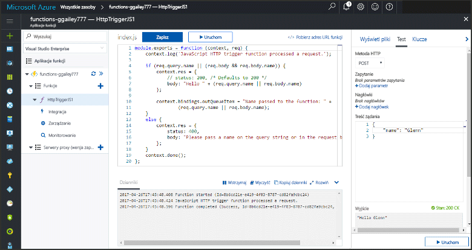
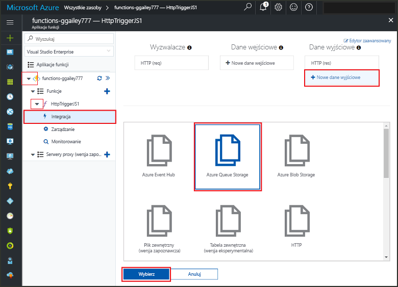
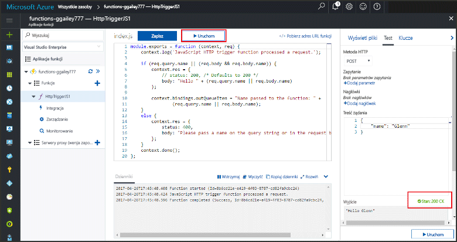
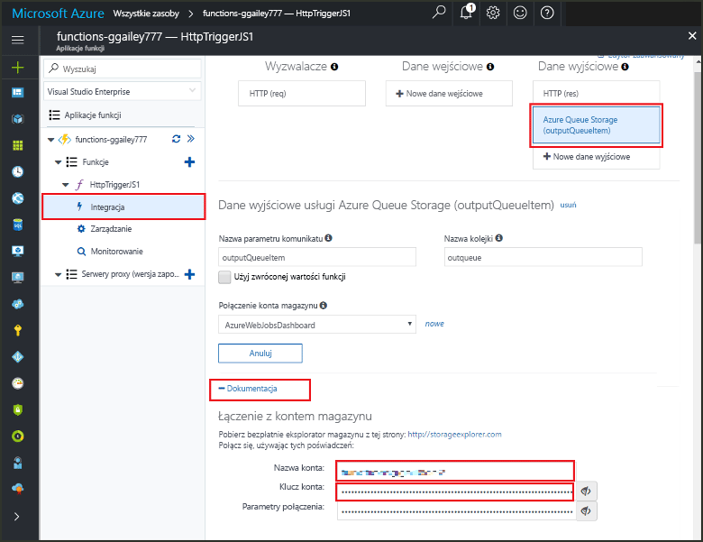

# <a name="add-messages-tooan-azure-storage-queue-using-functions"></a><span data-ttu-id="e1c01-103">Kolejka usługi Azure Storage tooan wiadomości przy użyciu funkcji Dodaj</span><span class="sxs-lookup"><span data-stu-id="e1c01-103">Add messages tooan Azure Storage queue using Functions</span></span>

<span data-ttu-id="e1c01-104">W środowisku Azure Functions powiązań wejściowych i wyjściowych Podaj dane deklaratywne tooconnect tooexternal usługi z funkcji.</span><span class="sxs-lookup"><span data-stu-id="e1c01-104">In Azure Functions, input and output bindings provide a declarative way tooconnect tooexternal service data from your function.</span></span> <span data-ttu-id="e1c01-105">Dowiedz się jak tooupdate istniejącej funkcji przez dodawanie danych wyjściowych powiązania, który wysyła wiadomości tooAzure kolejki magazynu, w tym temacie.</span><span class="sxs-lookup"><span data-stu-id="e1c01-105">In this topic, learn how tooupdate an existing function by adding an output binding that sends messages tooAzure Queue storage.</span></span>  



## <a name="prerequisites"></a><span data-ttu-id="e1c01-107">Wymagania wstępne</span><span class="sxs-lookup"><span data-stu-id="e1c01-107">Prerequisites</span></span> 

[!INCLUDE [Previous topics](../../includes/functions-quickstart-previous-topics.md)]

* <span data-ttu-id="e1c01-108">Zainstaluj hello [Eksploratora usługi Microsoft Azure Storage](http://storageexplorer.com/).</span><span class="sxs-lookup"><span data-stu-id="e1c01-108">Install hello [Microsoft Azure Storage Explorer](http://storageexplorer.com/).</span></span>

## <span data-ttu-id="e1c01-109"><a name="add-binding"></a>Dodawanie powiązania danych wyjściowych</span><span class="sxs-lookup"><span data-stu-id="e1c01-109"><a name="add-binding"></a>Add an output binding</span></span>
 
1. <span data-ttu-id="e1c01-110">Rozwiń aplikację funkcji i funkcję.</span><span class="sxs-lookup"><span data-stu-id="e1c01-110">Expand both your function app and your function.</span></span>

2. <span data-ttu-id="e1c01-111">Wybierz **integracji** i **+ nowe dane wyjściowe**, a następnie wybierz **magazynu kolejek Azure** i wybierz polecenie **wybierz**.</span><span class="sxs-lookup"><span data-stu-id="e1c01-111">Select **Integrate** and **+ New output**, then choose **Azure Queue storage** and choose **Select**.</span></span>
    
    

3. <span data-ttu-id="e1c01-113">Użyj hello ustawień określonych w tabeli hello:</span><span class="sxs-lookup"><span data-stu-id="e1c01-113">Use hello settings as specified in hello table:</span></span> 

    

    | <span data-ttu-id="e1c01-115">Ustawienie</span><span class="sxs-lookup"><span data-stu-id="e1c01-115">Setting</span></span>      |  <span data-ttu-id="e1c01-116">Sugerowana wartość</span><span class="sxs-lookup"><span data-stu-id="e1c01-116">Suggested value</span></span>   | <span data-ttu-id="e1c01-117">Opis</span><span class="sxs-lookup"><span data-stu-id="e1c01-117">Description</span></span>                              |
    | ------------ |  ------- | -------------------------------------------------- |
    | <span data-ttu-id="e1c01-118">**Nazwa kolejki**</span><span class="sxs-lookup"><span data-stu-id="e1c01-118">**Queue name**</span></span>   | <span data-ttu-id="e1c01-119">myqueue-items</span><span class="sxs-lookup"><span data-stu-id="e1c01-119">myqueue-items</span></span>    | <span data-ttu-id="e1c01-120">Nazwa Hello hello kolejki tooconnect tooin Twojego konta magazynu.</span><span class="sxs-lookup"><span data-stu-id="e1c01-120">hello name of hello queue tooconnect tooin your Storage account.</span></span> |
    | <span data-ttu-id="e1c01-121">**Połączenie konta magazynu**</span><span class="sxs-lookup"><span data-stu-id="e1c01-121">**Storage account connection**</span></span> | <span data-ttu-id="e1c01-122">AzureWebJobStorage</span><span class="sxs-lookup"><span data-stu-id="e1c01-122">AzureWebJobStorage</span></span> | <span data-ttu-id="e1c01-123">Użyj połączenia konta magazynu hello już używana przez aplikację funkcji lub Utwórz nową.</span><span class="sxs-lookup"><span data-stu-id="e1c01-123">You can use hello storage account connection already being used by your function app, or create a new one.</span></span>  |
    | <span data-ttu-id="e1c01-124">**Nazwa parametru komunikatu**</span><span class="sxs-lookup"><span data-stu-id="e1c01-124">**Message parameter name**</span></span> | <span data-ttu-id="e1c01-125">outputQueueItem</span><span class="sxs-lookup"><span data-stu-id="e1c01-125">outputQueueItem</span></span> | <span data-ttu-id="e1c01-126">Nazwa Hello hello dane wyjściowe wiązania parametru.</span><span class="sxs-lookup"><span data-stu-id="e1c01-126">hello name of hello output binding parameter.</span></span> | 

4. <span data-ttu-id="e1c01-127">Kliknij przycisk **zapisać** tooadd hello powiązania.</span><span class="sxs-lookup"><span data-stu-id="e1c01-127">Click **Save** tooadd hello binding.</span></span>
 
<span data-ttu-id="e1c01-128">Teraz, gdy masz powiązania wyjściowego zdefiniowana, należy tooupdate hello kodu toouse hello powiązania tooadd tooa kolejka wiadomości.</span><span class="sxs-lookup"><span data-stu-id="e1c01-128">Now that you have an output binding defined, you need tooupdate hello code toouse hello binding tooadd messages tooa queue.</span></span>  

## <a name="update-hello-function-code"></a><span data-ttu-id="e1c01-129">Zaktualizuj kod funkcja hello</span><span class="sxs-lookup"><span data-stu-id="e1c01-129">Update hello function code</span></span>

1. <span data-ttu-id="e1c01-130">Wybierz funkcja toodisplay hello funkcja kodu w edytorze hello.</span><span class="sxs-lookup"><span data-stu-id="e1c01-130">Select your function toodisplay hello function code in hello editor.</span></span> 

2. <span data-ttu-id="e1c01-131">C# funkcji, należy zaktualizować definicję funkcji następujący tooadd hello **outputQueueItem** parametr wiązania magazynu.</span><span class="sxs-lookup"><span data-stu-id="e1c01-131">For a C# function, update your function definition as follows tooadd hello **outputQueueItem** storage binding parameter.</span></span> <span data-ttu-id="e1c01-132">Pomiń ten krok w przypadku funkcji JavaScript.</span><span class="sxs-lookup"><span data-stu-id="e1c01-132">Skip this step for a JavaScript function.</span></span>

    ```cs   
    public static async Task<HttpResponseMessage> Run(HttpRequestMessage req, 
        ICollector<string> outputQueueItem, TraceWriter log)
    {
        ....
    }
    ```

3. <span data-ttu-id="e1c01-133">Dodaj hello następującego kodu toohello funkcja tuż przed hello metoda zwraca.</span><span class="sxs-lookup"><span data-stu-id="e1c01-133">Add hello following code toohello function just before hello method returns.</span></span> <span data-ttu-id="e1c01-134">Użyj hello odpowiedni fragment kodu dla języka hello funkcji.</span><span class="sxs-lookup"><span data-stu-id="e1c01-134">Use hello appropriate snippet for hello language of your function.</span></span>

    ```javascript
    context.bindings.outputQueueItem = "Name passed toohello function: " + 
                (req.query.name || req.body.name);
    ```

    ```cs
    outputQueueItem.Add("Name passed toohello function: " + name);     
    ```

4. <span data-ttu-id="e1c01-135">Wybierz **zapisać** toosave zmiany.</span><span class="sxs-lookup"><span data-stu-id="e1c01-135">Select **Save** toosave changes.</span></span>

<span data-ttu-id="e1c01-136">wartość Hello wyzwalacza HTTP toohello znajduje się w kolejce toohello dodany komunikat.</span><span class="sxs-lookup"><span data-stu-id="e1c01-136">hello value passed toohello HTTP trigger is included in a message added toohello queue.</span></span>
 
## <a name="test-hello-function"></a><span data-ttu-id="e1c01-137">Funkcja hello testu</span><span class="sxs-lookup"><span data-stu-id="e1c01-137">Test hello function</span></span> 

1. <span data-ttu-id="e1c01-138">Po zapisaniu zmian w kodzie hello wybierz **Uruchom**.</span><span class="sxs-lookup"><span data-stu-id="e1c01-138">After hello code changes are saved, select **Run**.</span></span> 

    

2. <span data-ttu-id="e1c01-140">Sprawdź toomake dzienniki hello się upewnić, że funkcja hello zakończyła się pomyślnie.</span><span class="sxs-lookup"><span data-stu-id="e1c01-140">Check hello logs toomake sure that hello function succeeded.</span></span> <span data-ttu-id="e1c01-141">Nową kolejkę o nazwie **outqueue** jest tworzony na koncie magazynu przez hello runtime funkcje powiązania wyjściowego hello najpierw jest używany.</span><span class="sxs-lookup"><span data-stu-id="e1c01-141">A new queue named **outqueue** is created in your Storage account by hello Functions runtime when hello output binding is first used.</span></span>

<span data-ttu-id="e1c01-142">Następnie możesz połączyć tooyour magazynu konta tooverify hello nowej kolejki i wiadomości powitania dodać tooit.</span><span class="sxs-lookup"><span data-stu-id="e1c01-142">Next, you can connect tooyour storage account tooverify hello new queue and hello message you added tooit.</span></span> 

## <a name="connect-toohello-queue"></a><span data-ttu-id="e1c01-143">Połącz toohello kolejki</span><span class="sxs-lookup"><span data-stu-id="e1c01-143">Connect toohello queue</span></span>

<span data-ttu-id="e1c01-144">Pomiń hello pierwsze trzy kroki, jeśli masz już zainstalowany Eksploratora usługi Storage i podłączone tooyour konta magazynu.</span><span class="sxs-lookup"><span data-stu-id="e1c01-144">Skip hello first three steps if you have already installed Storage Explorer and connected it tooyour storage account.</span></span>    

1. <span data-ttu-id="e1c01-145">W funkcji, wybierz **integracji** i hello nowe **magazynu kolejek Azure** powiązania wyjściowego, a następnie rozwiń węzeł **dokumentacji**.</span><span class="sxs-lookup"><span data-stu-id="e1c01-145">In your function, choose **Integrate** and hello new **Azure Queue storage** output binding, then expand **Documentation**.</span></span> <span data-ttu-id="e1c01-146">Skopiuj wartości **Nazwa konta** i **Klucz konta**.</span><span class="sxs-lookup"><span data-stu-id="e1c01-146">Copy both **Account name** and **Account key**.</span></span> <span data-ttu-id="e1c01-147">Używasz konta magazynu te poświadczenia tooconnect toohello.</span><span class="sxs-lookup"><span data-stu-id="e1c01-147">You use these credentials tooconnect toohello storage account.</span></span>
 
    

2. <span data-ttu-id="e1c01-149">Uruchom hello [Eksploratora usługi Microsoft Azure Storage](http://storageexplorer.com/) narzędzie, wybierz hello połączenia powitania po lewej stronie, wybierz **użyć nazwy konta magazynu i klucza**i wybierz **dalej**.</span><span class="sxs-lookup"><span data-stu-id="e1c01-149">Run hello [Microsoft Azure Storage Explorer](http://storageexplorer.com/) tool, select hello connect icon on hello left, choose **Use a storage account name and key**, and select **Next**.</span></span>

    
    
3. <span data-ttu-id="e1c01-151">Wklej hello **nazwa konta** i **klucz konta** z kroku 1 w odpowiednich polach, a następnie wybierz **dalej**, i **Connect**.</span><span class="sxs-lookup"><span data-stu-id="e1c01-151">Paste hello **Account name** and **Account key** from step 1 into their corresponding fields, then select **Next**, and **Connect**.</span></span> 
  
    

4. <span data-ttu-id="e1c01-153">Rozwiń hello dołączony konta magazynu, rozwiń **kolejek** i sprawdź, czy kolejka o nazwie **elementów Moja_kolejka** istnieje.</span><span class="sxs-lookup"><span data-stu-id="e1c01-153">Expand hello attached storage account, expand **Queues** and verify that a queue named **myqueue-items** exists.</span></span> <span data-ttu-id="e1c01-154">Należy również sprawdzić już wiadomość hello kolejki.</span><span class="sxs-lookup"><span data-stu-id="e1c01-154">You should also see a message already in hello queue.</span></span>  
 
    
 

## <a name="clean-up-resources"></a><span data-ttu-id="e1c01-156">Oczyszczanie zasobów</span><span class="sxs-lookup"><span data-stu-id="e1c01-156">Clean up resources</span></span>

[!INCLUDE [Next steps note](../../includes/functions-quickstart-cleanup.md)]

## <a name="next-steps"></a><span data-ttu-id="e1c01-157">Następne kroki</span><span class="sxs-lookup"><span data-stu-id="e1c01-157">Next steps</span></span>

<span data-ttu-id="e1c01-158">Dodano dane wyjściowe powiązania tooan istniejącej funkcji.</span><span class="sxs-lookup"><span data-stu-id="e1c01-158">You have added an output binding tooan existing function.</span></span> 

[!INCLUDE [Next steps note](../../includes/functions-quickstart-next-steps.md)]

<span data-ttu-id="e1c01-159">Aby uzyskać więcej informacji na temat wiązania tooQueue magazynu, zobacz [powiązania kolejki usługi Azure Storage funkcji](functions-bindings-storage-queue.md).</span><span class="sxs-lookup"><span data-stu-id="e1c01-159">For more information about binding tooQueue storage, see [Azure Functions Storage queue bindings](functions-bindings-storage-queue.md).</span></span> 


