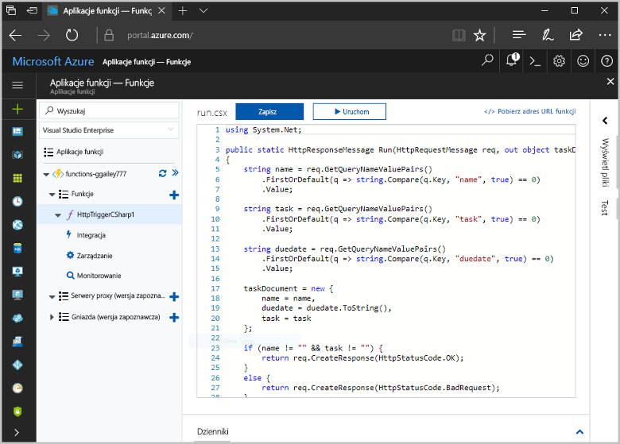
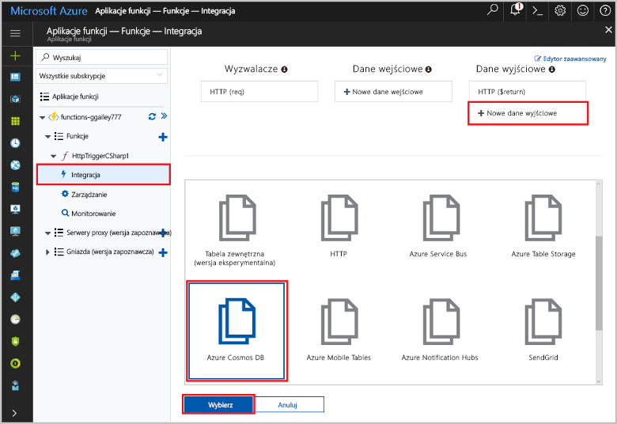
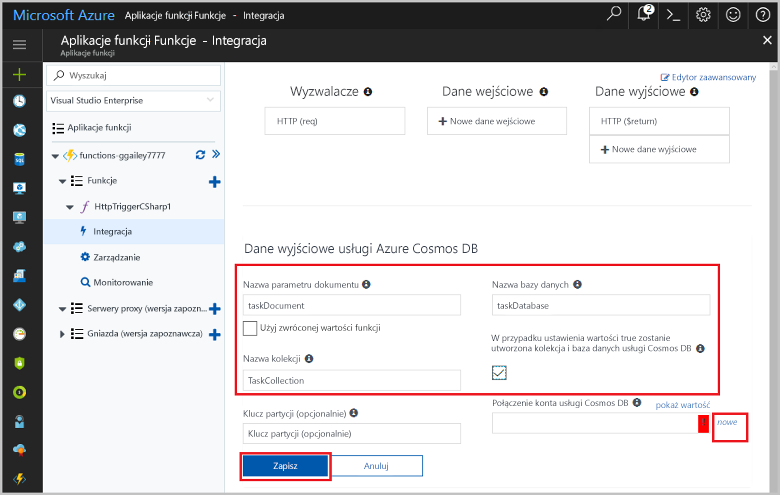
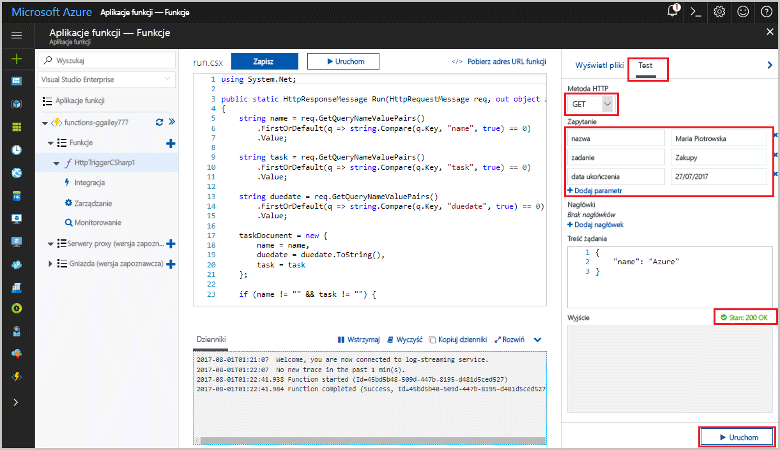
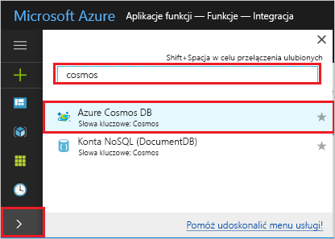
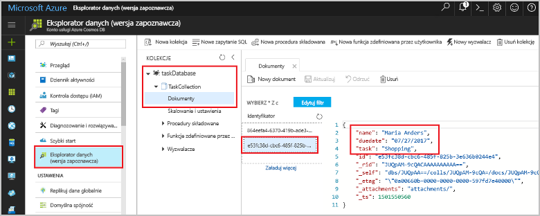

# <a name="store-unstructured-data-using-azure-functions-and-cosmos-db"></a><span data-ttu-id="c0129-104">Przechowywanie danych niestrukturalnych przy użyciu usług Azure Functions i Cosmos DB</span><span class="sxs-lookup"><span data-stu-id="c0129-104">Store unstructured data using Azure Functions and Cosmos DB</span></span>

<span data-ttu-id="c0129-105">[Azure DB rozwiązania Cosmos](https://azure.microsoft.com/services/cosmos-db/) to doskonały sposób toostore bez struktury i dane JSON.</span><span class="sxs-lookup"><span data-stu-id="c0129-105">[Azure Cosmos DB](https://azure.microsoft.com/services/cosmos-db/) is a great way toostore unstructured and JSON data.</span></span> <span data-ttu-id="c0129-106">Dzięki połączeniu usług Azure Functions i Cosmos DB przechowywanie danych staje się szybkie i proste oraz wymaga znacznie krótszego kodu niż w przypadku przechowywania danych w relacyjnej bazie danych.</span><span class="sxs-lookup"><span data-stu-id="c0129-106">Combined with Azure Functions, Cosmos DB makes storing data quick and easy with much less code than required for storing data in a relational database.</span></span>

<span data-ttu-id="c0129-107">W środowisku Azure Functions powiązań wejściowych i wyjściowych Podaj dane deklaratywne tooconnect tooexternal usługi z funkcji.</span><span class="sxs-lookup"><span data-stu-id="c0129-107">In Azure Functions, input and output bindings provide a declarative way tooconnect tooexternal service data from your function.</span></span> <span data-ttu-id="c0129-108">W tym temacie Dowiedz się, jak tooupdate istniejących C# funkcji tooadd powiązania wyjściowego, który przechowywania danych niestrukturalnych w dokumencie DB rozwiązania Cosmos.</span><span class="sxs-lookup"><span data-stu-id="c0129-108">In this topic, learn how tooupdate an existing C# function tooadd an output binding that stores unstructured data in a Cosmos DB document.</span></span> 



## <a name="prerequisites"></a><span data-ttu-id="c0129-110">Wymagania wstępne</span><span class="sxs-lookup"><span data-stu-id="c0129-110">Prerequisites</span></span>

<span data-ttu-id="c0129-111">toocomplete tego samouczka:</span><span class="sxs-lookup"><span data-stu-id="c0129-111">toocomplete this tutorial:</span></span>

[!INCLUDE [Previous quickstart note](../../includes/functions-quickstart-previous-topics.md)]

## <a name="add-an-output-binding"></a><span data-ttu-id="c0129-112">Dodawanie powiązania danych wyjściowych</span><span class="sxs-lookup"><span data-stu-id="c0129-112">Add an output binding</span></span>

1. <span data-ttu-id="c0129-113">Rozwiń aplikację funkcji i funkcję.</span><span class="sxs-lookup"><span data-stu-id="c0129-113">Expand both your function app and your function.</span></span>

1. <span data-ttu-id="c0129-114">Wybierz **integracji** i **+ nowe dane wyjściowe**, które jest w hello z góry po prawej stronie powitania.</span><span class="sxs-lookup"><span data-stu-id="c0129-114">Select **Integrate** and **+ New Output**, which is at hello top right of hello page.</span></span> <span data-ttu-id="c0129-115">Wybierz pozycję **Azure Cosmos DB** i kliknij przycisk **Wybierz**.</span><span class="sxs-lookup"><span data-stu-id="c0129-115">Choose **Azure Cosmos DB**, and click **Select**.</span></span>

    

3. <span data-ttu-id="c0129-117">Użyj hello **wyjście bazy danych Azure rozwiązania Cosmos** ustawień określonych w tabeli hello:</span><span class="sxs-lookup"><span data-stu-id="c0129-117">Use hello **Azure Cosmos DB output** settings as specified in hello table:</span></span> 

    

    | <span data-ttu-id="c0129-119">Ustawienie</span><span class="sxs-lookup"><span data-stu-id="c0129-119">Setting</span></span>      | <span data-ttu-id="c0129-120">Sugerowana wartość</span><span class="sxs-lookup"><span data-stu-id="c0129-120">Suggested value</span></span>  | <span data-ttu-id="c0129-121">Opis</span><span class="sxs-lookup"><span data-stu-id="c0129-121">Description</span></span>                                |
    | ------------ | ---------------- | ------------------------------------------ |
    | <span data-ttu-id="c0129-122">**Nazwa parametru dokumentu**</span><span class="sxs-lookup"><span data-stu-id="c0129-122">**Document parameter name**</span></span> | <span data-ttu-id="c0129-123">taskDocument</span><span class="sxs-lookup"><span data-stu-id="c0129-123">taskDocument</span></span> | <span data-ttu-id="c0129-124">Nazwa, która odwołuje się obiekt DB rozwiązania Cosmos toohello w kodzie.</span><span class="sxs-lookup"><span data-stu-id="c0129-124">Name that refers toohello Cosmos DB object in code.</span></span> |
    | <span data-ttu-id="c0129-125">**Nazwa bazy danych**</span><span class="sxs-lookup"><span data-stu-id="c0129-125">**Database name**</span></span> | <span data-ttu-id="c0129-126">taskDatabase</span><span class="sxs-lookup"><span data-stu-id="c0129-126">taskDatabase</span></span> | <span data-ttu-id="c0129-127">Nazwa bazy danych toosave dokumentów.</span><span class="sxs-lookup"><span data-stu-id="c0129-127">Name of database toosave documents.</span></span> |
    | <span data-ttu-id="c0129-128">**Nazwa kolekcji**</span><span class="sxs-lookup"><span data-stu-id="c0129-128">**Collection name**</span></span> | <span data-ttu-id="c0129-129">TaskCollection</span><span class="sxs-lookup"><span data-stu-id="c0129-129">TaskCollection</span></span> | <span data-ttu-id="c0129-130">Nazwa kolekcji baz danych Cosmos DB.</span><span class="sxs-lookup"><span data-stu-id="c0129-130">Name of collection of Cosmos DB databases.</span></span> |
    | <span data-ttu-id="c0129-131">**Jeśli PRAWDA, tworzy hello rozwiązania Cosmos bazy danych z bazy danych i kolekcji**</span><span class="sxs-lookup"><span data-stu-id="c0129-131">**If true, creates hello Cosmos DB database and collection**</span></span> | <span data-ttu-id="c0129-132">Zaznaczone</span><span class="sxs-lookup"><span data-stu-id="c0129-132">Checked</span></span> | <span data-ttu-id="c0129-133">Kolekcja Hello nie już istnieje, więc można go utworzyć.</span><span class="sxs-lookup"><span data-stu-id="c0129-133">hello collection doesn't already exist, so create it.</span></span> |

4. <span data-ttu-id="c0129-134">Wybierz **nowy** dalej toohello **połączenie dokumentu DB rozwiązania Cosmos** etykiety, a następnie wybierz **+ Utwórz nowy**.</span><span class="sxs-lookup"><span data-stu-id="c0129-134">Select **New** next toohello **Cosmos DB document connection** label, and select **+ Create new**.</span></span> 

5. <span data-ttu-id="c0129-135">Użyj hello **nowe konto** ustawień określonych w tabeli hello:</span><span class="sxs-lookup"><span data-stu-id="c0129-135">Use hello **New account** settings as specified in hello table:</span></span> 

    

    | <span data-ttu-id="c0129-137">Ustawienie</span><span class="sxs-lookup"><span data-stu-id="c0129-137">Setting</span></span>      | <span data-ttu-id="c0129-138">Sugerowana wartość</span><span class="sxs-lookup"><span data-stu-id="c0129-138">Suggested value</span></span>  | <span data-ttu-id="c0129-139">Opis</span><span class="sxs-lookup"><span data-stu-id="c0129-139">Description</span></span>                                |
    | ------------ | ---------------- | ------------------------------------------ |
    | <span data-ttu-id="c0129-140">**Identyfikator**</span><span class="sxs-lookup"><span data-stu-id="c0129-140">**ID**</span></span> | <span data-ttu-id="c0129-141">Nazwa bazy danych</span><span class="sxs-lookup"><span data-stu-id="c0129-141">Name of database</span></span> | <span data-ttu-id="c0129-142">Unikatowy identyfikator dla bazy danych DB rozwiązania Cosmos hello</span><span class="sxs-lookup"><span data-stu-id="c0129-142">Unique ID for hello Cosmos DB database</span></span>  |
    | <span data-ttu-id="c0129-143">**Interfejs API**</span><span class="sxs-lookup"><span data-stu-id="c0129-143">**API**</span></span> | <span data-ttu-id="c0129-144">SQL (DocumentDB)</span><span class="sxs-lookup"><span data-stu-id="c0129-144">SQL (DocumentDB)</span></span> | <span data-ttu-id="c0129-145">Wybierz hello interfejsu API z bazy danych dokumentu.</span><span class="sxs-lookup"><span data-stu-id="c0129-145">Select hello document database API.</span></span>  |
    | <span data-ttu-id="c0129-146">**Subskrypcja**</span><span class="sxs-lookup"><span data-stu-id="c0129-146">**Subscription**</span></span> | <span data-ttu-id="c0129-147">Subskrypcja platformy Azure</span><span class="sxs-lookup"><span data-stu-id="c0129-147">Azure Subscription</span></span> | <span data-ttu-id="c0129-148">Subskrypcja platformy Azure</span><span class="sxs-lookup"><span data-stu-id="c0129-148">Azure Subscription</span></span>  |
    | <span data-ttu-id="c0129-149">**Grupa zasobów**</span><span class="sxs-lookup"><span data-stu-id="c0129-149">**Resource Group**</span></span> | <span data-ttu-id="c0129-150">myResourceGroup</span><span class="sxs-lookup"><span data-stu-id="c0129-150">myResourceGroup</span></span> |  <span data-ttu-id="c0129-151">Użyj hello istniejącą grupę zasobów zawierającą aplikację funkcji.</span><span class="sxs-lookup"><span data-stu-id="c0129-151">Use hello existing resource group that contains your function app.</span></span> |
    | <span data-ttu-id="c0129-152">**Lokalizacja**</span><span class="sxs-lookup"><span data-stu-id="c0129-152">**Location**</span></span>  | <span data-ttu-id="c0129-153">WestEurope</span><span class="sxs-lookup"><span data-stu-id="c0129-153">WestEurope</span></span> | <span data-ttu-id="c0129-154">Wybierz lokalizację w pobliżu tooeither aplikacji funkcji lub tooother aplikacji, które używają hello przechowywanych dokumentów.</span><span class="sxs-lookup"><span data-stu-id="c0129-154">Select a location near tooeither your function app or tooother apps that use hello stored documents.</span></span>  |

6. <span data-ttu-id="c0129-155">Kliknij przycisk **OK** toocreate hello w bazie danych.</span><span class="sxs-lookup"><span data-stu-id="c0129-155">Click **OK** toocreate hello database.</span></span> <span data-ttu-id="c0129-156">Może upłynąć kilka minut toocreate hello bazy danych.</span><span class="sxs-lookup"><span data-stu-id="c0129-156">It may take a few minutes toocreate hello database.</span></span> <span data-ttu-id="c0129-157">Po utworzeniu bazy danych hello parametry połączenia bazy danych hello jest przechowywana jako ustawienie aplikacji funkcji.</span><span class="sxs-lookup"><span data-stu-id="c0129-157">After hello database is created, hello database connection string is stored as a function app setting.</span></span> <span data-ttu-id="c0129-158">nazwę tego ustawienia aplikacji Hello jest wstawiana **rozwiązania Cosmos bazy danych konta połączenia**.</span><span class="sxs-lookup"><span data-stu-id="c0129-158">hello name of this app setting is inserted in **Cosmos DB account connection**.</span></span> 
 
8. <span data-ttu-id="c0129-159">Po ustawieniu parametrów połączenia hello wybierz **zapisać** toocreate hello powiązania.</span><span class="sxs-lookup"><span data-stu-id="c0129-159">After hello connection string is set, select **Save** toocreate hello binding.</span></span>

## <a name="update-hello-function-code"></a><span data-ttu-id="c0129-160">Zaktualizuj kod funkcja hello</span><span class="sxs-lookup"><span data-stu-id="c0129-160">Update hello function code</span></span>

<span data-ttu-id="c0129-161">Zastąp hello istniejącego kodu C# funkcja hello następującego kodu:</span><span class="sxs-lookup"><span data-stu-id="c0129-161">Replace hello existing C# function code with hello following code:</span></span>

```csharp
using System.Net;

public static HttpResponseMessage Run(HttpRequestMessage req, out object taskDocument, TraceWriter log)
{
    string name = req.GetQueryNameValuePairs()
        .FirstOrDefault(q => string.Compare(q.Key, "name", true) == 0)
        .Value;

    string task = req.GetQueryNameValuePairs()
        .FirstOrDefault(q => string.Compare(q.Key, "task", true) == 0)
        .Value;

    string duedate = req.GetQueryNameValuePairs()
        .FirstOrDefault(q => string.Compare(q.Key, "duedate", true) == 0)
        .Value;

    taskDocument = new {
        name = name,
        duedate = duedate.ToString(),
        task = task
    };

    if (name != "" && task != "") {
        return req.CreateResponse(HttpStatusCode.OK);
    }
    else {
        return req.CreateResponse(HttpStatusCode.BadRequest);
    }
}

```
<span data-ttu-id="c0129-162">Ten przykładowy kod odczytuje hello żądania HTTP ciągów zapytania i przypisuje je toofields w hello `taskDocument` obiektu.</span><span class="sxs-lookup"><span data-stu-id="c0129-162">This code sample reads hello HTTP Request query strings and assigns them toofields in hello `taskDocument` object.</span></span> <span data-ttu-id="c0129-163">Witaj `taskDocument` powiązania wysyła dane obiektu hello z tym toobe parametru powiązania przechowywane w bazie danych dokumentu powiązanego hello.</span><span class="sxs-lookup"><span data-stu-id="c0129-163">hello `taskDocument` binding sends hello object data from this binding parameter toobe stored in hello bound document database.</span></span> <span data-ttu-id="c0129-164">Witaj utworzona baza danych jest hello pierwszym uruchomieniu funkcja hello.</span><span class="sxs-lookup"><span data-stu-id="c0129-164">hello database is created hello first time hello function runs.</span></span>

## <a name="test-hello-function-and-database"></a><span data-ttu-id="c0129-165">Funkcja hello testu i bazy danych</span><span class="sxs-lookup"><span data-stu-id="c0129-165">Test hello function and database</span></span>

1. <span data-ttu-id="c0129-166">Witaj w prawym okienku rozwiń i wybierz **testu**.</span><span class="sxs-lookup"><span data-stu-id="c0129-166">Expand hello right window and select **Test**.</span></span> <span data-ttu-id="c0129-167">W obszarze **zapytania**, kliknij przycisk **+ Dodaj parametr** i Dodaj powitania po ciągu zapytania toohello parametry:</span><span class="sxs-lookup"><span data-stu-id="c0129-167">Under **Query**, click **+ Add parameter** and add hello following parameters toohello query string:</span></span>

    + `name`
    + `task`
    + `duedate`

2. <span data-ttu-id="c0129-168">Kliknij pozycję **Uruchom** i sprawdź, czy zwracany jest stan 200.</span><span class="sxs-lookup"><span data-stu-id="c0129-168">Click **Run** and verify that a 200 status is returned.</span></span>

    

1. <span data-ttu-id="c0129-170">Na powitania po lewej stronie powitania portalu Azure, rozwiń pasku ikon hello typu `cosmos` w hello Wyszukaj pola i wybierz pozycję **bazy danych Azure rozwiązania Cosmos**.</span><span class="sxs-lookup"><span data-stu-id="c0129-170">On hello left side of hello Azure portal, expand hello icon bar, type `cosmos` in hello search field, and select **Azure Cosmos DB**.</span></span>

    

2. <span data-ttu-id="c0129-172">Wybierz hello bazy danych została utworzona, następnie wybierz **Eksploratora danych**.</span><span class="sxs-lookup"><span data-stu-id="c0129-172">Select hello database you created, then select **Data Explorer**.</span></span> <span data-ttu-id="c0129-173">Rozwiń węzeł hello **kolekcje** węzłów, wybierz hello nowy dokument i Potwierdź dokumentu hello zawiera wartości ciągu zapytania, wraz z niektóre dodatkowe metadane.</span><span class="sxs-lookup"><span data-stu-id="c0129-173">Expand hello **Collections** nodes, select hello new document, and confirm that hello document contains your query string values, along with some additional metadata.</span></span> 

    

<span data-ttu-id="c0129-175">Pomyślnie dodano wyzwalacza HTTP tooyour powiązania przechowywania danych niestrukturalnych w bazie danych DB rozwiązania Cosmos.</span><span class="sxs-lookup"><span data-stu-id="c0129-175">You have successfully added a binding tooyour HTTP trigger that stores unstructured data in a Cosmos DB database.</span></span>

[!INCLUDE [Clean-up section](../../includes/clean-up-section-portal.md)]

## <a name="next-steps"></a><span data-ttu-id="c0129-176">Następne kroki</span><span class="sxs-lookup"><span data-stu-id="c0129-176">Next steps</span></span>

[!INCLUDE [functions-quickstart-next-steps](../../includes/functions-quickstart-next-steps.md)]

<span data-ttu-id="c0129-177">Aby uzyskać więcej informacji o powiązaniu tooa DB rozwiązania Cosmos w bazie danych, zobacz [powiązania bazy danych Azure funkcji rozwiązania Cosmos](functions-bindings-documentdb.md).</span><span class="sxs-lookup"><span data-stu-id="c0129-177">For more information about binding tooa Cosmos DB database, see [Azure Functions Cosmos DB bindings](functions-bindings-documentdb.md).</span></span>
