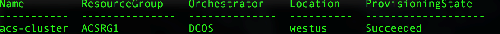

# <a name="deploy-a-docker-container-hosting-solution-using-hello-azure-cli-20"></a>Wdrażanie rozwiązania przy użyciu hello Azure CLI 2.0 hostingu kontener Docker

Użyj hello `az acs` polecenia w toocreate hello Azure CLI 2.0 i zarządzania klastrami usługi kontenera platformy Azure. Można także wdrożyć klaster usługi kontenera platformy Azure przy użyciu hello [portalu Azure](container-service-deployment.md) lub hello interfejsów API usługi kontenera platformy Azure.

Aby uzyskać pomoc dotyczącą `az acs` poleceń, Przekaż hello `-h` polecenia tooany parametru. Na przykład: `az acs create -h`.


## <a name="prerequisites"></a>Wymagania wstępne
toocreate klastra usługi kontenera platformy Azure przy użyciu hello Azure CLI 2.0, należy:
* Konto platformy Azure ([skorzystaj z bezpłatnej wersji próbnej](https://azure.microsoft.com/pricing/free-trial/))
* zainstalować i skonfigurować hello [2.0 interfejsu wiersza polecenia platformy Azure](/cli/azure/install-az-cli2)

## <a name="get-started"></a>Rozpoczęcie pracy 
### <a name="log-in-tooyour-account"></a>Zaloguj się na koncie tooyour
```azurecli
az login 
```

Wykonaj hello toolog monity w interaktywnie. Dla innych metod toolog w, zobacz [wprowadzenie Azure CLI 2.0](/cli/azure/get-started-with-az-cli2).

### <a name="set-your-azure-subscription"></a>Ustawianie swojej subskrypcji platformy Azure

Jeśli masz więcej niż jedną subskrypcją platformy Azure, należy ustawić hello domyślne subskrypcji. Na przykład:

```
az account set --subscription "f66xxxxx-xxxx-xxxx-xxx-zgxxxx33cha5"
```


### <a name="create-a-resource-group"></a>Tworzenie grupy zasobów
Zaleca się utworzenie grupy zasobów dla każdego klastra. Określ region świadczenia usługi Azure, w którym jest [dostępna](https://azure.microsoft.com/en-us/regions/services/) usługa Azure Container Service. Na przykład:

```azurecli
az group create -n acsrg1 -l "westus"
```
Dane wyjściowe są podobne toohello następujące czynności:


## <a name="create-an-azure-container-service-cluster"></a>Tworzenie klastra usługi Azure Container Service

toocreate klaster, użyj `az acs create`.
Nazwa klastra hello i hello nazwę grupy zasobów hello utworzony w poprzednim kroku hello są obowiązkowe parametry. 

Inne dane wejściowe są ustawione wartości toodefault (zobacz po ekranie powitania), chyba że zastąpione za pomocą ich odpowiednich przełączników. Na przykład hello orchestrator jest ustawiana przez domyślny tooDC/OS. A jeśli nie określono, prefiks nazwy DNS jest tworzone na podstawie nazwy klastra hello.


### <a name="quick-acs-create-using-defaults"></a>Szybkie wykonanie polecenia `acs create` z użyciem ustawień domyślnych
Jeśli masz pliku klucza publicznego SSH RSA `id_rsa.pub` w lokalizacji domyślnej hello (lub utworzony dla [OS X i Linux](../../virtual-machines/linux/mac-create-ssh-keys.md) lub [Windows](../../virtual-machines/linux/ssh-from-windows.md)), użyj polecenia takie jak następujące hello:

```azurecli
az acs create -n acs-cluster -g acsrg1 -d applink789
```
Jeśli nie masz klucza publicznego SSH, użyj drugiego polecenia. To polecenie z hello `--generate-ssh-keys` przełącznika je tworzy.

```azurecli
az acs create -n acs-cluster -g acsrg1 -d applink789 --generate-ssh-keys
```

Po wprowadzeniu polecenia hello Poczekaj około 10 minut na powitania toobe klastra utworzone. dane wyjściowe polecenia Hello obejmuje pełni kwalifikowanych nazw domen (FQDN) głównego hello i węzłów agenta i SSH polecenie tooconnect toohello pierwszego serwera głównego. Poniżej przedstawiono skrócone dane wyjściowe:


> [!TIP]
> Witaj [wskazówki Kubernetes](../kubernetes/container-service-kubernetes-walkthrough.md) przedstawia sposób toouse `az acs create` z domyślnej wartości toocreate Kubernetes klastra.
>

## <a name="manage-acs-clusters"></a>Zarządzanie klastrami usługi ACS

Użyj dodatkowych `az acs` polecenia toomanage klastra. Oto kilka przykładów.

### <a name="list-clusters-under-a-subscription"></a>Wyświetlanie listy klastrów w ramach subskrypcji

```azurecli
az acs list --output table
```

### <a name="list-clusters-in-a-resource-group"></a>Wyświetlanie listy klastrów w grupie zasobów

```azurecli
az acs list -g acsrg1 --output table
```




### <a name="display-details-of-a-container-service-cluster"></a>Wyświetlanie szczegółów klastra usługi kontenera

```azurecli
az acs show -g acsrg1 -n acs-cluster --output list
```


### <a name="scale-hello-cluster"></a>Klaster w skali hello
Dozwolone jest skalowanie węzłów agentów zarówno na zewnątrz, jak i do wewnątrz. Witaj parametru `new-agent-count` jest nowy numer hello agentów w klastrze hello ACS.

```azurecli
az acs scale -g acsrg1 -n acs-cluster --new-agent-count 4
```


## <a name="delete-a-container-service-cluster"></a>Usuwanie klastra usługi kontenera
```azurecli
az acs delete -g acsrg1 -n acs-cluster 
```
To polecenie nie powoduje usunięcia wszystkich zasobów (sieci i magazynu) podczas tworzenia usługi kontenera hello utworzone. toodelete wszystkie zasoby, zaleca się wdrażania poszczególnych klastrów w grupie zasobów distinct. Następnie usuń hello grupy zasobów, gdy hello klastra nie jest już wymagane.

## <a name="next-steps"></a>Następne kroki
Teraz, gdy masz działający klaster, możesz zapoznać się z tymi dokumentami, aby uzyskać szczegółowe informacje na temat połączeń i zarządzania:

* [Połącz tooan klastra usługi kontenera platformy Azure](../container-service-connect.md)
* [Współpraca z usługą Azure Container Service i rozwiązaniem DC/OS](container-service-mesos-marathon-rest.md)
* [Współpraca z usługą Azure Container Service i rozwiązaniem Docker Swarm](container-service-docker-swarm.md)
* [Współpraca z usługą Azure Container Service i rozwiązaniem Kubernetes](../kubernetes/container-service-kubernetes-walkthrough.md)