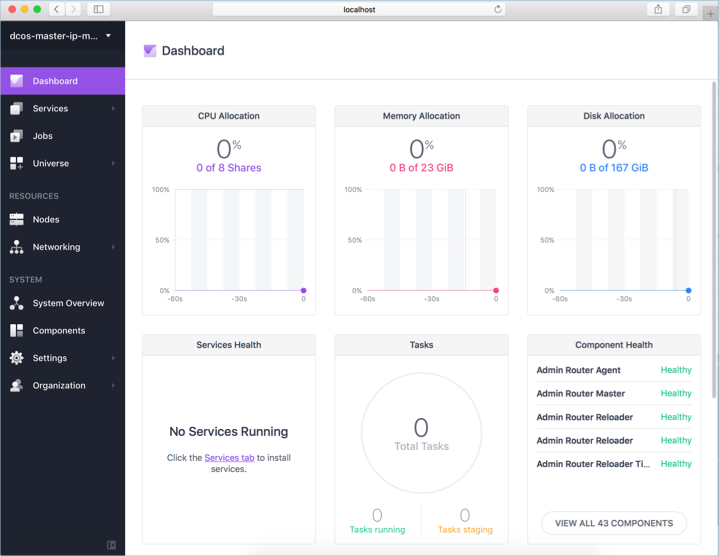

# <a name="deploy-a-dcos-cluster"></a><span data-ttu-id="2f8d7-104">Wdrażanie klastra DC/OS</span><span class="sxs-lookup"><span data-stu-id="2f8d7-104">Deploy a DC/OS cluster</span></span>

<span data-ttu-id="2f8d7-105">DC/OS przewiduje uruchamianie nowoczesnych i konteneryzowanych aplikacji rozproszonej platformy.</span><span class="sxs-lookup"><span data-stu-id="2f8d7-105">DC/OS provides a distributed platform for running modern and containerized applications.</span></span> <span data-ttu-id="2f8d7-106">Z usługi kontenera platformy Azure inicjowania obsługi klastra DC/OS gotowy produkcji jest proste i szybkie.</span><span class="sxs-lookup"><span data-stu-id="2f8d7-106">With Azure Container Service, provisioning of a production ready DC/OS cluster is simple and quick.</span></span> <span data-ttu-id="2f8d7-107">Szczegóły tego szybki start podstawowe kroki potrzebne do wdrożenia DC/OS klastra i uruchom podstawowe obciążenie.</span><span class="sxs-lookup"><span data-stu-id="2f8d7-107">This quick start details the basic steps needed to deploy a DC/OS cluster and run basic workload.</span></span>

<span data-ttu-id="2f8d7-108">Jeśli nie masz subskrypcji platformy Azure, przed rozpoczęciem utwórz [bezpłatne konto](https://azure.microsoft.com/free/?WT.mc_id=A261C142F).</span><span class="sxs-lookup"><span data-stu-id="2f8d7-108">If you don't have an Azure subscription, create a [free account](https://azure.microsoft.com/free/?WT.mc_id=A261C142F) before you begin.</span></span>

<span data-ttu-id="2f8d7-109">Dla tego samouczka wymagany jest interfejs wiersza polecenia platformy Azure w wersji 2.0.4 lub nowszej.</span><span class="sxs-lookup"><span data-stu-id="2f8d7-109">This tutorial requires the Azure CLI version 2.0.4 or later.</span></span> <span data-ttu-id="2f8d7-110">Uruchom polecenie `az --version`, aby dowiedzieć się, jaka wersja jest używana.</span><span class="sxs-lookup"><span data-stu-id="2f8d7-110">Run `az --version` to find the version.</span></span> <span data-ttu-id="2f8d7-111">Jeśli konieczne będzie uaktualnienie, zobacz [Instalowanie interfejsu wiersza polecenia platformy Azure 2.0]( /cli/azure/install-azure-cli).</span><span class="sxs-lookup"><span data-stu-id="2f8d7-111">If you need to upgrade, see [Install Azure CLI 2.0]( /cli/azure/install-azure-cli).</span></span> 

## <a name="log-in-to-azure"></a><span data-ttu-id="2f8d7-112">Zaloguj się do platformy Azure.</span><span class="sxs-lookup"><span data-stu-id="2f8d7-112">Log in to Azure</span></span> 

<span data-ttu-id="2f8d7-113">Zaloguj się do subskrypcji platformy Azure za pomocą polecenia [az login](/cli/azure/#login) i postępuj zgodnie z instrukcjami wyświetlanymi na ekranie.</span><span class="sxs-lookup"><span data-stu-id="2f8d7-113">Log in to your Azure subscription with the [az login](/cli/azure/#login) command and follow the on-screen directions.</span></span>

```azurecli
az login
```

## <a name="create-a-resource-group"></a><span data-ttu-id="2f8d7-114">Tworzenie grupy zasobów</span><span class="sxs-lookup"><span data-stu-id="2f8d7-114">Create a resource group</span></span>

<span data-ttu-id="2f8d7-115">Utwórz grupę zasobów za pomocą polecenia [az group create](/cli/azure/group#create).</span><span class="sxs-lookup"><span data-stu-id="2f8d7-115">Create a resource group with the [az group create](/cli/azure/group#create) command.</span></span> <span data-ttu-id="2f8d7-116">Grupa zasobów platformy Azure to logiczny kontener przeznaczony do wdrażania zasobów platformy Azure i zarządzania nimi.</span><span class="sxs-lookup"><span data-stu-id="2f8d7-116">An Azure resource group is a logical container into which Azure resources are deployed and managed.</span></span> 

<span data-ttu-id="2f8d7-117">Poniższy przykład obejmuje tworzenie grupy zasobów o nazwie *myResourceGroup* w lokalizacji *eastus*.</span><span class="sxs-lookup"><span data-stu-id="2f8d7-117">The following example creates a resource group named *myResourceGroup* in the *eastus* location.</span></span>

```azurecli
az group create --name myResourceGroup --location eastus
```

## <a name="create-dcos-cluster"></a><span data-ttu-id="2f8d7-118">Tworzenie klastra DC/OS</span><span class="sxs-lookup"><span data-stu-id="2f8d7-118">Create DC/OS cluster</span></span>

<span data-ttu-id="2f8d7-119">Tworzenie klastra DC/OS z [az acs utworzyć](/cli/azure/acs#create) polecenia.</span><span class="sxs-lookup"><span data-stu-id="2f8d7-119">Create a DC/OS cluster with the [az acs create](/cli/azure/acs#create) command.</span></span>

<span data-ttu-id="2f8d7-120">Poniższy przykład tworzy klaster DC/OS o nazwie *myDCOSCluster* i tworzy kluczy SSH, jeśli jeszcze nie istnieje.</span><span class="sxs-lookup"><span data-stu-id="2f8d7-120">The following example creates a DC/OS cluster named *myDCOSCluster* and creates SSH keys if they do not already exist.</span></span> <span data-ttu-id="2f8d7-121">Aby użyć określonego zestawu kluczy, użyj opcji `--ssh-key-value`.</span><span class="sxs-lookup"><span data-stu-id="2f8d7-121">To use a specific set of keys, use the `--ssh-key-value` option.</span></span>  

```azurecli
az acs create \
  --orchestrator-type dcos \
  --resource-group myResourceGroup \
  --name myDCOSCluster \
  --generate-ssh-keys
```

<span data-ttu-id="2f8d7-122">Po kilku minutach polecenie zakończeniu i zwraca informacje o wdrożeniu.</span><span class="sxs-lookup"><span data-stu-id="2f8d7-122">After several minutes, the command completes, and returns information about the deployment.</span></span>

## <a name="connect-to-dcos-cluster"></a><span data-ttu-id="2f8d7-123">Łączenie z klastrem DC/OS</span><span class="sxs-lookup"><span data-stu-id="2f8d7-123">Connect to DC/OS cluster</span></span>

<span data-ttu-id="2f8d7-124">Po utworzeniu klastra DC/OS, może być dostęp za pośrednictwem tunelu SSH.</span><span class="sxs-lookup"><span data-stu-id="2f8d7-124">Once a DC/OS cluster has been created, it can be accesses through an SSH tunnel.</span></span> <span data-ttu-id="2f8d7-125">Uruchom następujące polecenie, aby zwrócić publiczny adres IP wzorca DC/OS.</span><span class="sxs-lookup"><span data-stu-id="2f8d7-125">Run the following command to return the public IP address of the DC/OS master.</span></span> <span data-ttu-id="2f8d7-126">Ten adres IP jest przechowywana w zmiennej i używane w następnym kroku.</span><span class="sxs-lookup"><span data-stu-id="2f8d7-126">This IP address is stored in a variable and used in the next step.</span></span>

```azurecli
ip=$(az network public-ip list --resource-group myResourceGroup --query "[?contains(name,'dcos-master')].[ipAddress]" -o tsv)
```

<span data-ttu-id="2f8d7-127">Do tworzenia tunelu SSH, uruchom następujące polecenie, a następnie postępuj zgodnie z wyświetlanymi instrukcjami.</span><span class="sxs-lookup"><span data-stu-id="2f8d7-127">To create the SSH tunnel, run the following command and follow the on-screen instructions.</span></span> <span data-ttu-id="2f8d7-128">Jeśli port 80 jest już w użyciu, polecenie nie powiedzie się.</span><span class="sxs-lookup"><span data-stu-id="2f8d7-128">If port 80 is already in use, the command fails.</span></span> <span data-ttu-id="2f8d7-129">Aktualizacji portu tunelowane do jednego nie korzystać, takich jak `85:localhost:80`.</span><span class="sxs-lookup"><span data-stu-id="2f8d7-129">Update the tunneled port to one not in use, such as `85:localhost:80`.</span></span> 

```azurecli
sudo ssh -i ~/.ssh/id_rsa -fNL 80:localhost:80 -p 2200 azureuser@$ip
```

<span data-ttu-id="2f8d7-130">Można przetestować tunelu SSH przechodząc do `http://localhost`.</span><span class="sxs-lookup"><span data-stu-id="2f8d7-130">The SSH tunnel can be tested by browsing to `http://localhost`.</span></span> <span data-ttu-id="2f8d7-131">Jeśli port innych czy 80 został użyty, Dostosuj lokalizacji do dopasowania.</span><span class="sxs-lookup"><span data-stu-id="2f8d7-131">If a port other that 80 has been used, adjust the location to match.</span></span> 

<span data-ttu-id="2f8d7-132">W przypadku tunelowania SSH została pomyślnie utworzona, jest zwracana portalu DC/OS.</span><span class="sxs-lookup"><span data-stu-id="2f8d7-132">If the SSH tunnel was successfully created, the DC/OS portal is returned.</span></span>



## <a name="install-dcos-cli"></a><span data-ttu-id="2f8d7-134">Instalowanie interfejsu wiersza polecenia DC/OS</span><span class="sxs-lookup"><span data-stu-id="2f8d7-134">Install DC/OS CLI</span></span>

<span data-ttu-id="2f8d7-135">Interfejs wiersza polecenia DC/OS jest używany do zarządzania klastrem DC/OS z wiersza polecenia.</span><span class="sxs-lookup"><span data-stu-id="2f8d7-135">The DC/OS command line interface is used to manage a DC/OS cluster from the command-line.</span></span> <span data-ttu-id="2f8d7-136">Instalowanie przy użyciu interfejsu wiersza polecenia DC/OS [az dcos acs install-cli](/azure/acs/dcos#install-cli) polecenia.</span><span class="sxs-lookup"><span data-stu-id="2f8d7-136">Install the DC/OS cli using the [az acs dcos install-cli](/azure/acs/dcos#install-cli) command.</span></span> <span data-ttu-id="2f8d7-137">Jeśli używasz Azure CloudShell, interfejsu wiersza polecenia DC/OS jest już zainstalowana.</span><span class="sxs-lookup"><span data-stu-id="2f8d7-137">If you are using Azure CloudShell, the DC/OS CLI is already installed.</span></span> 

<span data-ttu-id="2f8d7-138">Jeśli używasz interfejsu wiersza polecenia Azure macOS lub Linux, może być konieczne uruchomienie polecenia z sudo.</span><span class="sxs-lookup"><span data-stu-id="2f8d7-138">If you are running the Azure CLI on macOS or Linux, you might need to run the command with sudo.</span></span>

```azurecli
az acs dcos install-cli
```

<span data-ttu-id="2f8d7-139">Interfejsu wiersza polecenia można było korzystać z klastrem, musi być skonfigurowana do używania tunelu SSH.</span><span class="sxs-lookup"><span data-stu-id="2f8d7-139">Before the CLI can be used with the cluster, it must be configured to use the SSH tunnel.</span></span> <span data-ttu-id="2f8d7-140">Aby to zrobić, uruchom następujące polecenie, dostosowywania port, jeśli to konieczne.</span><span class="sxs-lookup"><span data-stu-id="2f8d7-140">To do so, run the following command, adjusting the port if needed.</span></span>

```azurecli
dcos config set core.dcos_url http://localhost
```

## <a name="run-an-application"></a><span data-ttu-id="2f8d7-141">Uruchamianie aplikacji</span><span class="sxs-lookup"><span data-stu-id="2f8d7-141">Run an application</span></span>

<span data-ttu-id="2f8d7-142">Domyślnie planowania mechanizm dla klastra usługi ACS DC/OS jest Marathon.</span><span class="sxs-lookup"><span data-stu-id="2f8d7-142">The default scheduling mechanism for an ACS DC/OS cluster is Marathon.</span></span> <span data-ttu-id="2f8d7-143">Platformy Marathon umożliwia uruchamianie aplikacji i zarządzanie stanem aplikacji w klastrze DC/OS.</span><span class="sxs-lookup"><span data-stu-id="2f8d7-143">Marathon is used to start an application and manage the state of the application on the DC/OS cluster.</span></span> <span data-ttu-id="2f8d7-144">Aby zaplanować aplikacji za pośrednictwem platformy Marathon, Utwórz plik o nazwie *marathon app.json*i skopiuj do niego następującą zawartość.</span><span class="sxs-lookup"><span data-stu-id="2f8d7-144">To schedule an application through Marathon, create a file named *marathon-app.json*, and copy the following contents into it.</span></span> 

```json
{
  "id": "demo-app",
  "cmd": null,
  "cpus": 1,
  "mem": 32,
  "disk": 0,
  "instances": 1,
  "container": {
    "docker": {
      "image": "nginx",
      "network": "BRIDGE",
      "portMappings": [
        {
          "containerPort": 80,
          "hostPort": 80,
          "protocol": "tcp",
          "name": "80",
          "labels": null
        }
      ]
    },
    "type": "DOCKER"
  },
  "acceptedResourceRoles": [
    "slave_public"
  ]
}
```

<span data-ttu-id="2f8d7-145">Uruchom następujące polecenie, aby zaplanować aplikacji do uruchamiania w klastrze DC/OS.</span><span class="sxs-lookup"><span data-stu-id="2f8d7-145">Run the following command to schedule the application to run on the DC/OS cluster.</span></span>

```azurecli
dcos marathon app add marathon-app.json
```

<span data-ttu-id="2f8d7-146">Aby wyświetlić stan wdrożenia dla aplikacji, uruchom następujące polecenie.</span><span class="sxs-lookup"><span data-stu-id="2f8d7-146">To see the deployment status for the app, run the following command.</span></span>

```azurecli
dcos marathon app list
```

<span data-ttu-id="2f8d7-147">Gdy **oczekiwania** zmienia wartość kolumny z *True* do *False*, wdrażanie aplikacji zostało zakończone.</span><span class="sxs-lookup"><span data-stu-id="2f8d7-147">When the **WAITING** column value switches from *True* to *False*, application deployment has completed.</span></span>

```azurecli
ID     MEM  CPUS  TASKS  HEALTH  DEPLOYMENT  WAITING  CONTAINER  CMD   
/test   32   1     1/1    ---       ---      False      DOCKER   None
```

<span data-ttu-id="2f8d7-148">Pobierz publiczny adres IP agentów klastra DC/OS.</span><span class="sxs-lookup"><span data-stu-id="2f8d7-148">Get the public IP address of the DC/OS cluster agents.</span></span>

```azurecli
az network public-ip list --resource-group myResourceGroup --query "[?contains(name,'dcos-agent')].[ipAddress]" -o tsv
```

<span data-ttu-id="2f8d7-149">Przeglądanie pod tym adresem zwraca domyślnej witryny NGINX.</span><span class="sxs-lookup"><span data-stu-id="2f8d7-149">Browsing to this address returns the default NGINX site.</span></span>


## <a name="delete-dcos-cluster"></a><span data-ttu-id="2f8d7-151">Usuń klaster DC/OS</span><span class="sxs-lookup"><span data-stu-id="2f8d7-151">Delete DC/OS cluster</span></span>

<span data-ttu-id="2f8d7-152">Gdy nie są już potrzebne, można użyć [usunięcie grupy az](/cli/azure/group#delete) polecenia, aby usunąć grupę zasobów, klaster DC/OS i wszystkie powiązane zasoby.</span><span class="sxs-lookup"><span data-stu-id="2f8d7-152">When no longer needed, you can use the [az group delete](/cli/azure/group#delete) command to remove the resource group, DC/OS cluster, and all related resources.</span></span>

```azurecli
az group delete --name myResourceGroup --no-wait
```

## <a name="next-steps"></a><span data-ttu-id="2f8d7-153">Następne kroki</span><span class="sxs-lookup"><span data-stu-id="2f8d7-153">Next steps</span></span>

<span data-ttu-id="2f8d7-154">W tym szybki start wdrożeniu klastra DC/OS i zostało uruchomione proste kontenera Docker w klastrze.</span><span class="sxs-lookup"><span data-stu-id="2f8d7-154">In this quick start, you’ve deployed a DC/OS cluster and have run a simple Docker container on the cluster.</span></span> <span data-ttu-id="2f8d7-155">Aby dowiedzieć się więcej na temat usługi kontenera platformy Azure, nadal samouczki ACS.</span><span class="sxs-lookup"><span data-stu-id="2f8d7-155">To learn more about Azure Container Service, continue to the ACS tutorials.</span></span>

> [!div class="nextstepaction"]
> [<span data-ttu-id="2f8d7-156">Zarządzanie klastrem ACS DC/OS</span><span class="sxs-lookup"><span data-stu-id="2f8d7-156">Manage an ACS DC/OS Cluster</span></span>](container-service-dcos-manage-tutorial.md)