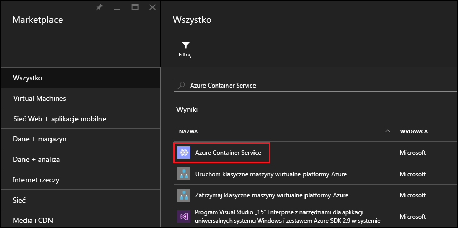
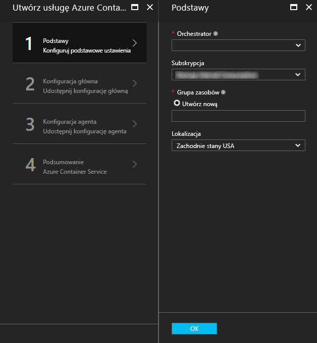
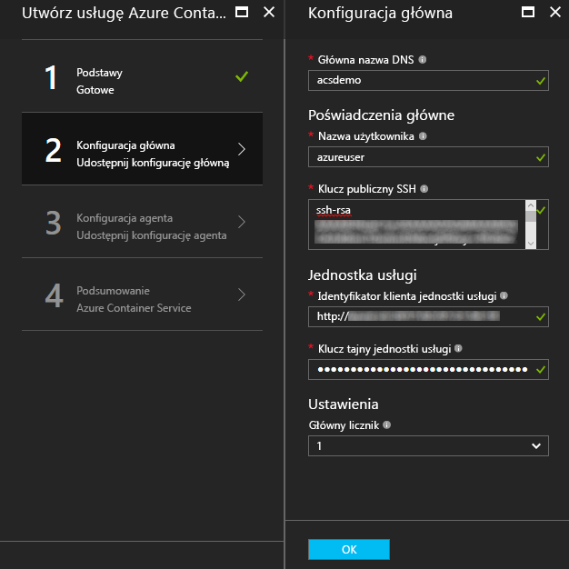
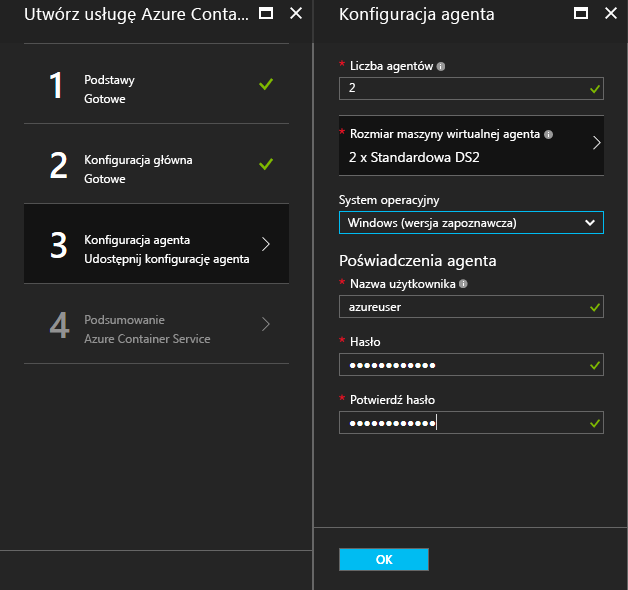
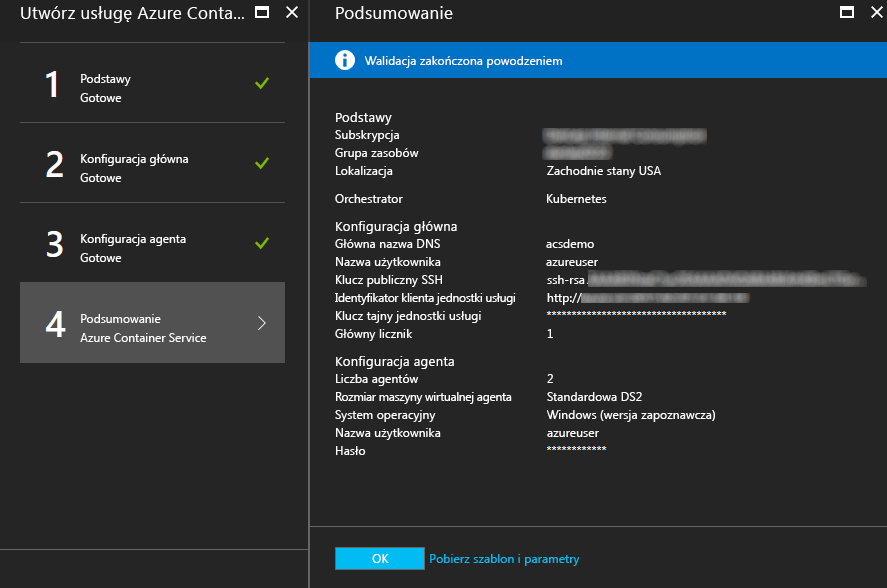
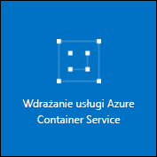

# <a name="deploy-a-docker-container-hosting-solution-using-the-azure-portal"></a><span data-ttu-id="9fc20-104">Wdrażanie rozwiązania hostingu kontenera platformy Docker w witrynie Azure Portal</span><span class="sxs-lookup"><span data-stu-id="9fc20-104">Deploy a Docker container hosting solution using the Azure portal</span></span>


<span data-ttu-id="9fc20-105">Usługa kontenera platformy Azure zapewnia szybkie wdrażanie popularnych rozwiązań typu open source służących do aranżowania i klastrowania kontenerów.</span><span class="sxs-lookup"><span data-stu-id="9fc20-105">Azure Container Service provides rapid deployment of popular open-source container clustering and orchestration solutions.</span></span> <span data-ttu-id="9fc20-106">Ten dokument zawiera opis kroków wdrażania klastra usługi Azure Container Service przy użyciu witryny Azure Portal lub szablonu szybkiego startu usługi Azure Resource Manager.</span><span class="sxs-lookup"><span data-stu-id="9fc20-106">This document walks you through deploying an Azure Container Service cluster by using the Azure portal or an Azure Resource Manager quickstart template.</span></span> 

<span data-ttu-id="9fc20-107">Wdrożenie klastra usługi Azure Container Service jest również możliwe za pomocą [interfejsu wiersza polecenia Azure w wersji 2.0](container-service-create-acs-cluster-cli.md) lub interfejsów API usługi Azure Container Service.</span><span class="sxs-lookup"><span data-stu-id="9fc20-107">You can also deploy an Azure Container Service cluster by using the [Azure CLI 2.0](container-service-create-acs-cluster-cli.md) or the Azure Container Service APIs.</span></span>

<span data-ttu-id="9fc20-108">Aby uzyskać ogólne informacje, zobacz [Wprowadzenie do usługi Azure Container Service](../container-service-intro.md).</span><span class="sxs-lookup"><span data-stu-id="9fc20-108">For background, see [Azure Container Service introduction](../container-service-intro.md).</span></span>


## <a name="prerequisites"></a><span data-ttu-id="9fc20-109">Wymagania wstępne</span><span class="sxs-lookup"><span data-stu-id="9fc20-109">Prerequisites</span></span>

* <span data-ttu-id="9fc20-110">**Subskrypcja platformy Azure**: jeśli jej nie masz, możesz utworzyć konto [bezpłatnej wersji próbnej](http://azure.microsoft.com/pricing/free-trial/?WT.mc_id=AA4C1C935).</span><span class="sxs-lookup"><span data-stu-id="9fc20-110">**Azure subscription**: If you don't have one, sign up for a [free trial](http://azure.microsoft.com/pricing/free-trial/?WT.mc_id=AA4C1C935).</span></span> <span data-ttu-id="9fc20-111">W przypadku większego klastra warto rozważyć subskrypcję opartą na płatności zgodnie z rzeczywistym użyciem lub inne opcje zakupu.</span><span class="sxs-lookup"><span data-stu-id="9fc20-111">For a larger cluster, consider a pay-as-you go subscription or other purchase options.</span></span>

    > [!NOTE]
    > <span data-ttu-id="9fc20-112">Użycie subskrypcji platformy Azure i [limity przydziałów zasobów](../../azure-subscription-service-limits.md), takie jak limity przydziałów rdzeni, mogą ograniczać rozmiar wdrażanego klastra.</span><span class="sxs-lookup"><span data-stu-id="9fc20-112">Your Azure subscription usage and [resource quotas](../../azure-subscription-service-limits.md), such as cores quotas, can limit the size of the cluster you deploy.</span></span> <span data-ttu-id="9fc20-113">Aby zażądać zwiększenia limitu przydziału, otwórz bezpłatnie [żądanie obsługi klienta online](../../azure-supportability/how-to-create-azure-support-request.md).</span><span class="sxs-lookup"><span data-stu-id="9fc20-113">To request a quota increase, open an [online customer support request](../../azure-supportability/how-to-create-azure-support-request.md) at no charge.</span></span>
    >

* <span data-ttu-id="9fc20-114">**Klucz publiczny SSH RSA**: podczas wdrażania za pośrednictwem portalu lub jednego z szablonów szybkiego startu platformy Azure musisz podać klucz publiczny na potrzeby uwierzytelniania na maszynach wirtualnych usługi Azure Container Service.</span><span class="sxs-lookup"><span data-stu-id="9fc20-114">**SSH RSA public key**: When deploying through the portal or one of the Azure quickstart templates, you need to provide the public key for authentication against Azure Container Service virtual machines.</span></span> <span data-ttu-id="9fc20-115">Aby utworzyć klucze RSA Secure Shell (SSH), zobacz wskazówki dla systemów [OS X i Linux](../../virtual-machines/linux/mac-create-ssh-keys.md) lub [Windows](../../virtual-machines/linux/ssh-from-windows.md).</span><span class="sxs-lookup"><span data-stu-id="9fc20-115">To create Secure Shell (SSH) RSA keys, see the [OS X and Linux](../../virtual-machines/linux/mac-create-ssh-keys.md) or [Windows](../../virtual-machines/linux/ssh-from-windows.md) guidance.</span></span> 

* <span data-ttu-id="9fc20-116">**Klucz tajny i identyfikator klienta nazwy głównej usługi** (tylko rozwiązanie Kubernetes): aby uzyskać więcej informacji i wskazówek dotyczących tworzenia nazwy głównej usługi Azure Active Directory, zobacz [About the service principal for a Kubernetes cluster](../kubernetes/container-service-kubernetes-service-principal.md) (Informacje o nazwie głównej usługi dla klastra Kubernetes).</span><span class="sxs-lookup"><span data-stu-id="9fc20-116">**Service principal client ID and secret** (Kubernetes only): For more information and guidance to create an Azure Active Directory service principal, see [About the service principal for a Kubernetes cluster](../kubernetes/container-service-kubernetes-service-principal.md).</span></span>


## <a name="create-a-cluster-by-using-the-azure-portal"></a><span data-ttu-id="9fc20-117">Tworzenie klastra przy użyciu witryny Azure Portal</span><span class="sxs-lookup"><span data-stu-id="9fc20-117">Create a cluster by using the Azure portal</span></span>
1. <span data-ttu-id="9fc20-118">Zaloguj się w witrynie Azure Portal, wybierz pozycję **Nowy** i w portalu Azure Marketplace wyszukaj usługę **Azure Container Service**.</span><span class="sxs-lookup"><span data-stu-id="9fc20-118">Sign in to the Azure portal, select **New**, and search the Azure Marketplace for **Azure Container Service**.</span></span>

      <br />

2. <span data-ttu-id="9fc20-120">Kliknij pozycję **Azure Container Service**, a następnie kliknij przycisk **Utwórz**.</span><span class="sxs-lookup"><span data-stu-id="9fc20-120">Click **Azure Container Service**, and click **Create**.</span></span>

3. <span data-ttu-id="9fc20-121">W bloku **Podstawowe** wprowadź następujące informacje:</span><span class="sxs-lookup"><span data-stu-id="9fc20-121">On the **Basics** blade, enter the following information:</span></span>

    * <span data-ttu-id="9fc20-122">**Koordynator**: wybierz jeden z koordynatorów kontenera w celu wdrożenia go w klastrze.</span><span class="sxs-lookup"><span data-stu-id="9fc20-122">**Orchestrator**: Select one of the container orchestrators to deploy on the cluster.</span></span>
        * <span data-ttu-id="9fc20-123">**DC/OS**: wdraża klaster DC/OS.</span><span class="sxs-lookup"><span data-stu-id="9fc20-123">**DC/OS**: Deploys a DC/OS cluster.</span></span>
        * <span data-ttu-id="9fc20-124">**Swarm**: wdraża klaster Docker Swarm.</span><span class="sxs-lookup"><span data-stu-id="9fc20-124">**Swarm**: Deploys a Docker Swarm cluster.</span></span>
        * <span data-ttu-id="9fc20-125">**Kubernetes**: wdraża klaster Kubernetes.</span><span class="sxs-lookup"><span data-stu-id="9fc20-125">**Kubernetes**: Deploys a Kubernetes cluster.</span></span>
    * <span data-ttu-id="9fc20-126">**Subskrypcja**: wybierz subskrypcję platformy Azure.</span><span class="sxs-lookup"><span data-stu-id="9fc20-126">**Subscription**: Select an Azure subscription.</span></span>
    * <span data-ttu-id="9fc20-127">**Grupa zasobów**: wprowadź nazwę nowej grupy zasobów dla wdrożenia.</span><span class="sxs-lookup"><span data-stu-id="9fc20-127">**Resource group**: Enter the name of a new resource group for the deployment.</span></span>
    * <span data-ttu-id="9fc20-128">**Lokalizacja**: wybierz region platformy Azure dla wdrożenia usługi Azure Container Service.</span><span class="sxs-lookup"><span data-stu-id="9fc20-128">**Location**: Select an Azure region for the Azure Container Service deployment.</span></span> <span data-ttu-id="9fc20-129">Aby uzyskać informacje o dostępności, zobacz [Dostępność produktów według regionów](https://azure.microsoft.com/regions/services/).</span><span class="sxs-lookup"><span data-stu-id="9fc20-129">For availability, check [Products available by region](https://azure.microsoft.com/regions/services/).</span></span>
    
      <br />
    
    <span data-ttu-id="9fc20-131">Aby kontynuować, kliknij przycisk **OK**.</span><span class="sxs-lookup"><span data-stu-id="9fc20-131">Click **OK** when you're ready to proceed.</span></span>

4. <span data-ttu-id="9fc20-132">W bloku **Konfiguracja serwera głównego** wprowadź następujące ustawienia dla węzła głównego (lub węzłów głównych) systemu Linux w klastrze (niektóre ustawienia są unikatowe dla poszczególnych koordynatorów):</span><span class="sxs-lookup"><span data-stu-id="9fc20-132">On the **Master configuration** blade, enter the following settings for the Linux master node or nodes in the cluster (some settings are specific to each orchestrator):</span></span>

    * <span data-ttu-id="9fc20-133">**Nazwa DNS serwera głównego**: prefiks używany do tworzenia unikatowej w pełni kwalifikowanej nazwy domeny (FQDN) dla serwera głównego.</span><span class="sxs-lookup"><span data-stu-id="9fc20-133">**Master DNS name**: The prefix used to create a unique fully qualified domain name (FQDN) for the master.</span></span> <span data-ttu-id="9fc20-134">Nazwa FQDN serwera głównego ma postać *prefiks*mgmt.*lokalizacja*.cloudapp.azure.com.</span><span class="sxs-lookup"><span data-stu-id="9fc20-134">The master FQDN is of the form *prefix*mgmt.*location*.cloudapp.azure.com.</span></span>
    * <span data-ttu-id="9fc20-135">**Nazwa użytkownika**: nazwa użytkownika konta używanego na poszczególnych maszynach wirtualnych z systemem Linux w klastrze.</span><span class="sxs-lookup"><span data-stu-id="9fc20-135">**User name**: The user name for an account on each of the Linux virtual machines in the cluster.</span></span>
    * <span data-ttu-id="9fc20-136">**Klucz publiczny SSH RSA**: dodaj klucz publiczny, który będzie używany do uwierzytelniania na maszynach wirtualnych z systemem Linux.</span><span class="sxs-lookup"><span data-stu-id="9fc20-136">**SSH RSA public key**: Add the public key to be used for authentication against the Linux virtual machines.</span></span> <span data-ttu-id="9fc20-137">Ważne jest, aby ten klucz nie zawierał podziałów wierszy i miał prefiks `ssh-rsa`.</span><span class="sxs-lookup"><span data-stu-id="9fc20-137">It is important that this key contains no line breaks, and it includes the `ssh-rsa` prefix.</span></span> <span data-ttu-id="9fc20-138">Postfiks `username@domain` jest opcjonalny.</span><span class="sxs-lookup"><span data-stu-id="9fc20-138">The `username@domain` postfix is optional.</span></span> <span data-ttu-id="9fc20-139">Klucz powinien wyglądać podobnie do poniższego: **ssh-rsa AAAAB3Nz...<...>...UcyupgH azureuser@linuxvm**.</span><span class="sxs-lookup"><span data-stu-id="9fc20-139">The key should look something like the following: **ssh-rsa AAAAB3Nz...<...>...UcyupgH azureuser@linuxvm**.</span></span> 
    * <span data-ttu-id="9fc20-140">**Nazwa główna usługi**: w przypadku wybrania koordynatora Kubernetes wprowadź **identyfikator klienta nazwy głównej usługi** Azure Active Directory (nazywany również identyfikatorem appId) i **klucz tajny klienta nazwy głównej usługi** (hasło).</span><span class="sxs-lookup"><span data-stu-id="9fc20-140">**Service principal**: If you selected the Kubernetes orchestrator, enter an Azure Active Directory **Service principal client ID** (also called the appId) and **Service principal client secret** (password).</span></span> <span data-ttu-id="9fc20-141">Aby uzyskać więcej informacji, zobacz [About the service principal for a Kubernetes cluster](../kubernetes/container-service-kubernetes-service-principal.md) (Informacje o nazwie głównej usługi dla klastra Kubernetes).</span><span class="sxs-lookup"><span data-stu-id="9fc20-141">For more information, see [About the service principal for a Kubernetes cluster](../kubernetes/container-service-kubernetes-service-principal.md).</span></span>
    * <span data-ttu-id="9fc20-142">**Liczba serwerów głównych**: liczba serwerów głównych w klastrze.</span><span class="sxs-lookup"><span data-stu-id="9fc20-142">**Master count**: The number of masters in the cluster.</span></span>
    * <span data-ttu-id="9fc20-143">**Diagnostyka maszyn wirtualnych**: w przypadku niektórych koordynatorów można włączyć diagnostykę maszyn wirtualnych na serwerach głównych.</span><span class="sxs-lookup"><span data-stu-id="9fc20-143">**VM diagnostics**: For some orchestrators, you can enable VM diagnostics on the masters.</span></span>

      <br />

    <span data-ttu-id="9fc20-145">Aby kontynuować, kliknij przycisk **OK**.</span><span class="sxs-lookup"><span data-stu-id="9fc20-145">Click **OK** when you're ready to proceed.</span></span>

5. <span data-ttu-id="9fc20-146">W bloku **Konfiguracja agenta** wprowadź następujące informacje:</span><span class="sxs-lookup"><span data-stu-id="9fc20-146">On the **Agent configuration** blade, enter the following information:</span></span>

    * <span data-ttu-id="9fc20-147">**Liczba agentów**: w przypadku opcji Docker Swarm lub Kubernetes ta wartość to początkowa liczba agentów w zestawie skalowania agenta.</span><span class="sxs-lookup"><span data-stu-id="9fc20-147">**Agent count**: For Docker Swarm and Kubernetes, this value is the initial number of agents in the agent scale set.</span></span> <span data-ttu-id="9fc20-148">W przypadku opcji DC/OS jest to początkowa liczba agentów w prywatnym zestawie skalowania.</span><span class="sxs-lookup"><span data-stu-id="9fc20-148">For DC/OS, it is the initial number of agents in a private scale set.</span></span> <span data-ttu-id="9fc20-149">Ponadto w przypadku koordynatora DC/OS jest tworzony publiczny zestaw skalowania zawierający wstępnie określoną liczbę agentów.</span><span class="sxs-lookup"><span data-stu-id="9fc20-149">Additionally, a public scale set is created for DC/OS, which contains a predetermined number of agents.</span></span> <span data-ttu-id="9fc20-150">Liczba agentów w tym publicznym zestawie skalowania zależy od liczby serwerów głównych w klastrze: jeden agent publiczny dla jednego serwera głównego i dwóch agentów publicznych dla trzech lub pięciu serwerów głównych.</span><span class="sxs-lookup"><span data-stu-id="9fc20-150">The number of agents in this public scale set is determined by the number of masters in the cluster: one public agent for one master, and two public agents for three or five masters.</span></span>
    * <span data-ttu-id="9fc20-151">**Rozmiar maszyny wirtualnej agenta**: rozmiar maszyn wirtualnych agenta.</span><span class="sxs-lookup"><span data-stu-id="9fc20-151">**Agent virtual machine size**: The size of the agent virtual machines.</span></span>
    * <span data-ttu-id="9fc20-152">**System operacyjny**: to ustawienie jest obecnie dostępne tylko w przypadku wybrania koordynatora Kubernetes.</span><span class="sxs-lookup"><span data-stu-id="9fc20-152">**Operating system**: This setting is currently available only if you selected the Kubernetes orchestrator.</span></span> <span data-ttu-id="9fc20-153">Wybierz dystrybucję systemu Linux lub system operacyjny Windows Server, które będą uruchomione na agentach.</span><span class="sxs-lookup"><span data-stu-id="9fc20-153">Choose either a Linux distribution or a Windows Server operating system to run on the agents.</span></span> <span data-ttu-id="9fc20-154">To ustawienie określa, czy w klastrze można uruchamiać aplikacje kontenera systemu Linux czy Windows.</span><span class="sxs-lookup"><span data-stu-id="9fc20-154">This setting determines whether your cluster can run Linux or Windows container apps.</span></span> 

        > [!NOTE]
        > <span data-ttu-id="9fc20-155">Obsługa kontenerów systemu Windows dla klastrów Kubernetes jest dostępna w wersji zapoznawczej.</span><span class="sxs-lookup"><span data-stu-id="9fc20-155">Windows container support is in preview for Kubernetes clusters.</span></span> <span data-ttu-id="9fc20-156">W przypadku klastrów DC/OS i Swarm tylko agenci systemu Linux są obecnie obsługiwani przez usługę Azure Container Service.</span><span class="sxs-lookup"><span data-stu-id="9fc20-156">On DC/OS and Swarm clusters, only Linux agents are currently supported in Azure Container Service.</span></span>

    * <span data-ttu-id="9fc20-157">**Poświadczenia agentów**: w przypadku wybrania systemu operacyjnego Windows wprowadź **nazwę użytkownika** i **hasło** administratora dla maszyn wirtualnych agentów.</span><span class="sxs-lookup"><span data-stu-id="9fc20-157">**Agent credentials**: If you selected the Windows operating system, enter an administrator **User name** and **Password** for the agent VMs.</span></span> 

      <br />

    <span data-ttu-id="9fc20-159">Aby kontynuować, kliknij przycisk **OK**.</span><span class="sxs-lookup"><span data-stu-id="9fc20-159">Click **OK** when you're ready to proceed.</span></span>

6. <span data-ttu-id="9fc20-160">Po zakończeniu weryfikacji usługi kliknij przycisk **OK**.</span><span class="sxs-lookup"><span data-stu-id="9fc20-160">After service validation finishes, click **OK**.</span></span>

      <br />

7. <span data-ttu-id="9fc20-162">Zapoznaj się z warunkami.</span><span class="sxs-lookup"><span data-stu-id="9fc20-162">Review the terms.</span></span> <span data-ttu-id="9fc20-163">Kliknij przycisk **Utwórz**, aby rozpocząć proces wdrażania.</span><span class="sxs-lookup"><span data-stu-id="9fc20-163">To start the deployment process, click **Create**.</span></span>

    <span data-ttu-id="9fc20-164">Jeśli wybrano opcję przypięcia wdrożenia do witryny Azure Portal, widoczny jest stan wdrożenia.</span><span class="sxs-lookup"><span data-stu-id="9fc20-164">If you've elected to pin the deployment to the Azure portal, you can see the deployment status.</span></span>

      <br />

<span data-ttu-id="9fc20-166">Przeprowadzenie wdrożenia zajmuje kilka minut.</span><span class="sxs-lookup"><span data-stu-id="9fc20-166">The deployment takes several minutes to complete.</span></span> <span data-ttu-id="9fc20-167">Następnie klaster usługi Azure Container Service jest gotowy do użycia.</span><span class="sxs-lookup"><span data-stu-id="9fc20-167">Then, the Azure Container Service cluster is ready for use.</span></span>


## <a name="create-a-cluster-by-using-a-quickstart-template"></a><span data-ttu-id="9fc20-168">Tworzenie klastra przy użyciu szablonu szybkiego startu</span><span class="sxs-lookup"><span data-stu-id="9fc20-168">Create a cluster by using a quickstart template</span></span>
<span data-ttu-id="9fc20-169">Na potrzeby wdrożenia klastra w usłudze Azure Container Service są dostępne szablony szybkiego startu platformy Azure.</span><span class="sxs-lookup"><span data-stu-id="9fc20-169">Azure quickstart templates are available to deploy a cluster in Azure Container Service.</span></span> <span data-ttu-id="9fc20-170">Udostępnione szablony szybkiego startu można modyfikować w celu włączenia dodatkowej lub zaawansowanej konfiguracji platformy Azure.</span><span class="sxs-lookup"><span data-stu-id="9fc20-170">The provided quickstart templates can be modified to include additional or advanced Azure configuration.</span></span> <span data-ttu-id="9fc20-171">Aby utworzyć klaster usługi Azure Container Service za pomocą szablonu szybkiego startu platformy Azure, potrzebna jest subskrypcja platformy Azure.</span><span class="sxs-lookup"><span data-stu-id="9fc20-171">To create an Azure Container Service cluster by using an Azure quickstart template, you need an Azure subscription.</span></span> <span data-ttu-id="9fc20-172">Jeśli jej nie masz, utwórz konto [bezpłatnej wersji próbnej](http://azure.microsoft.com/pricing/free-trial/?WT.mc_id=AA4C1C935).</span><span class="sxs-lookup"><span data-stu-id="9fc20-172">If you don't have one, then sign up for a [free trial](http://azure.microsoft.com/pricing/free-trial/?WT.mc_id=AA4C1C935).</span></span> 

<span data-ttu-id="9fc20-173">Wykonaj następujące kroki, aby wdrożyć klaster przy użyciu szablonu oraz interfejsu wiersza polecenia platformy Azure w wersji 2.0 (zobacz [instrukcje instalacji i konfigurowania](/cli/azure/install-az-cli2)).</span><span class="sxs-lookup"><span data-stu-id="9fc20-173">Follow these steps to deploy a cluster using a template and the Azure CLI 2.0 (see [installation and setup instructions](/cli/azure/install-az-cli2)).</span></span>

> [!NOTE] 
> <span data-ttu-id="9fc20-174">Jeśli korzystasz z systemu Windows, możesz użyć podobnych kroków, aby wdrożyć szablon przy użyciu programu Azure PowerShell.</span><span class="sxs-lookup"><span data-stu-id="9fc20-174">If you're on a Windows system, you can use similar steps to deploy a template using Azure PowerShell.</span></span> <span data-ttu-id="9fc20-175">Zobacz kroki w dalszej części tej sekcji.</span><span class="sxs-lookup"><span data-stu-id="9fc20-175">See steps later in this section.</span></span> <span data-ttu-id="9fc20-176">Szablon możesz także wdrożyć za pośrednictwem [portalu](../../azure-resource-manager/resource-group-template-deploy-portal.md) lub innych metod.</span><span class="sxs-lookup"><span data-stu-id="9fc20-176">You can also deploy a template through the [portal](../../azure-resource-manager/resource-group-template-deploy-portal.md) or other methods.</span></span>

1. <span data-ttu-id="9fc20-177">Aby wdrożyć klaster DC/OS, Docker Swarm lub Kubernetes, wybierz jeden z dostępnych szablonów szybkiego startu usługi GitHub.</span><span class="sxs-lookup"><span data-stu-id="9fc20-177">To deploy a DC/OS, Docker Swarm, or Kubernetes cluster, select one of the available quickstart templates from GitHub.</span></span> <span data-ttu-id="9fc20-178">Częściowa lista została przedstawiona poniżej.</span><span class="sxs-lookup"><span data-stu-id="9fc20-178">A partial list follows.</span></span> <span data-ttu-id="9fc20-179">Szablony DC/OS i Swarm są takie same — różnią się tylko domyślnie wybranym koordynatorem.</span><span class="sxs-lookup"><span data-stu-id="9fc20-179">The DC/OS and Swarm templates are the same, except for the default orchestrator selection.</span></span>

    * [<span data-ttu-id="9fc20-180">Szablon DC/OS</span><span class="sxs-lookup"><span data-stu-id="9fc20-180">DC/OS template</span></span>](https://github.com/Azure/azure-quickstart-templates/tree/master/101-acs-dcos)
    * [<span data-ttu-id="9fc20-181">Szablon Swarm</span><span class="sxs-lookup"><span data-stu-id="9fc20-181">Swarm template</span></span>](https://github.com/Azure/azure-quickstart-templates/tree/master/101-acs-swarm)
    * [<span data-ttu-id="9fc20-182">Szablon Kubernetes</span><span class="sxs-lookup"><span data-stu-id="9fc20-182">Kubernetes template</span></span>](https://github.com/Azure/azure-quickstart-templates/tree/master/101-acs-kubernetes)

2. <span data-ttu-id="9fc20-183">Zaloguj się do konta platformy Azure (`az login`) i upewnij się, że interfejs wiersza polecenia platformy Azure jest połączony z subskrypcją platformy Azure.</span><span class="sxs-lookup"><span data-stu-id="9fc20-183">Log in to your Azure account (`az login`), and make sure that the Azure CLI is connected to your Azure subscription.</span></span> <span data-ttu-id="9fc20-184">Domyślną subskrypcję możesz wyświetlić przy użyciu następującego polecenia:</span><span class="sxs-lookup"><span data-stu-id="9fc20-184">You can see the default subscription by using the following command:</span></span>

    ```azurecli
    az account show
    ```
    
    <span data-ttu-id="9fc20-185">Jeśli masz więcej niż jedną subskrypcję i chcesz ustawić inną subskrypcję domyślną, uruchom polecenie `az account set --subscription` i określ nazwę lub identyfikator subskrypcji.</span><span class="sxs-lookup"><span data-stu-id="9fc20-185">If you have more than one subscription and need to set a different default subscription, run `az account set --subscription` and specify the subscription ID or name.</span></span>

3. <span data-ttu-id="9fc20-186">Najlepszym rozwiązaniem jest użycie dla wdrożenia nowej grupy zasobów.</span><span class="sxs-lookup"><span data-stu-id="9fc20-186">As a best practice, use a new resource group for the deployment.</span></span> <span data-ttu-id="9fc20-187">Aby utworzyć grupę zasobów, użyj polecenia `az group create`, określając lokalizację i nazwę grupy zasobów:</span><span class="sxs-lookup"><span data-stu-id="9fc20-187">To create a resource group, use the `az group create` command specify a resource group name and location:</span></span> 

    ```azurecli
    az group create --name "RESOURCE_GROUP" --location "LOCATION"
    ```

4. <span data-ttu-id="9fc20-188">Utwórz plik JSON zawierający wymagane parametry szablonu.</span><span class="sxs-lookup"><span data-stu-id="9fc20-188">Create a JSON file containing the required template parameters.</span></span> <span data-ttu-id="9fc20-189">Pobierz plik parametrów o nazwie `azuredeploy.parameters.json`, który towarzyszy szablonowi usługi Azure Container Service `azuredeploy.json` w witrynie GitHub.</span><span class="sxs-lookup"><span data-stu-id="9fc20-189">Download the parameters file named `azuredeploy.parameters.json` that accompanies the Azure Container Service template `azuredeploy.json` in GitHub.</span></span> <span data-ttu-id="9fc20-190">Wprowadź wymagane wartości parametrów dla klastra.</span><span class="sxs-lookup"><span data-stu-id="9fc20-190">Enter required parameter values for your cluster.</span></span> 

    <span data-ttu-id="9fc20-191">Aby na przykład użyć [szablonu DC/OS](https://github.com/Azure/azure-quickstart-templates/tree/master/101-acs-dcos), podaj wartości parametrów `dnsNamePrefix` i `sshRSAPublicKey`.</span><span class="sxs-lookup"><span data-stu-id="9fc20-191">For example, to use the [DC/OS template](https://github.com/Azure/azure-quickstart-templates/tree/master/101-acs-dcos), supply parameter values for `dnsNamePrefix` and `sshRSAPublicKey`.</span></span> <span data-ttu-id="9fc20-192">W pliku `azuredeploy.json` można znaleźć opis oraz opcje dla innych parametrów.</span><span class="sxs-lookup"><span data-stu-id="9fc20-192">See the descriptions in `azuredeploy.json` and options for other parameters.</span></span>  
 

5. <span data-ttu-id="9fc20-193">Utwórz klaster usługi Container Service przez przekazanie pliku parametrów wdrożenia przy użyciu następującego polecenia, gdzie:</span><span class="sxs-lookup"><span data-stu-id="9fc20-193">Create a Container Service cluster by passing the deployment parameters file with the following command, where:</span></span>

    * <span data-ttu-id="9fc20-194">**RESOURCE_GROUP** to nazwa grupy zasobów utworzonej w poprzednim kroku.</span><span class="sxs-lookup"><span data-stu-id="9fc20-194">**RESOURCE_GROUP** is the name of the resource group that you created in the previous step.</span></span>
    * <span data-ttu-id="9fc20-195">**DEPLOYMENT_NAME** (opcjonalnie) to nazwa nadawana wdrożeniu.</span><span class="sxs-lookup"><span data-stu-id="9fc20-195">**DEPLOYMENT_NAME** (optional) is a name you give to the deployment.</span></span>
    * <span data-ttu-id="9fc20-196">**TEMPLATE_URI** to lokalizacja pliku wdrożenia `azuredeploy.json`.</span><span class="sxs-lookup"><span data-stu-id="9fc20-196">**TEMPLATE_URI** is the location of the deployment file `azuredeploy.json`.</span></span> <span data-ttu-id="9fc20-197">Ten identyfikator URI musi wskazywać plik nieprzetworzony. Nie może to być wskaźnik do interfejsu użytkownika witryny GitHub.</span><span class="sxs-lookup"><span data-stu-id="9fc20-197">This URI must be the Raw file, not a pointer to the GitHub UI.</span></span> <span data-ttu-id="9fc20-198">Aby znaleźć ten identyfikator URI, wybierz plik `azuredeploy.json` w witrynie GitHub i kliknij przycisk **Raw** (Nieprzetworzone).</span><span class="sxs-lookup"><span data-stu-id="9fc20-198">To find this URI, select the `azuredeploy.json` file in GitHub, and click the **Raw** button.</span></span>  

    ```azurecli
    az group deployment create -g RESOURCE_GROUP -n DEPLOYMENT_NAME --template-uri TEMPLATE_URI --parameters @azuredeploy.parameters.json
    ```

    <span data-ttu-id="9fc20-199">Parametry możesz również podać jako ciąg w formacie JSON w wierszu polecenia.</span><span class="sxs-lookup"><span data-stu-id="9fc20-199">You can also provide parameters as a JSON-formatted string on the command line.</span></span> <span data-ttu-id="9fc20-200">Użyj polecenia podobnego do następującego:</span><span class="sxs-lookup"><span data-stu-id="9fc20-200">Use a command similar to the following:</span></span>

    ```azurecli
    az group deployment create -g RESOURCE_GROUP -n DEPLOYMENT_NAME --template-uri TEMPLATE_URI --parameters "{ \"param1\": {\"value1\"} … }"
    ```

    > [!NOTE]
    > <span data-ttu-id="9fc20-201">Przeprowadzenie wdrożenia zajmuje kilka minut.</span><span class="sxs-lookup"><span data-stu-id="9fc20-201">The deployment takes several minutes to complete.</span></span>
    > 

### <a name="equivalent-powershell-commands"></a><span data-ttu-id="9fc20-202">Równoważne polecenia programu PowerShell</span><span class="sxs-lookup"><span data-stu-id="9fc20-202">Equivalent PowerShell commands</span></span>
<span data-ttu-id="9fc20-203">Szablon klastra usługi Azure Container Service można również wdrożyć przy użyciu programu PowerShell.</span><span class="sxs-lookup"><span data-stu-id="9fc20-203">You can also deploy an Azure Container Service cluster template with PowerShell.</span></span> <span data-ttu-id="9fc20-204">Ten dokument jest oparty na wersji 1.0 [modułu Azure PowerShell](https://azure.microsoft.com/blog/azps-1-0/).</span><span class="sxs-lookup"><span data-stu-id="9fc20-204">This document is based on the version 1.0 [Azure PowerShell module](https://azure.microsoft.com/blog/azps-1-0/).</span></span>

1. <span data-ttu-id="9fc20-205">Aby wdrożyć klaster DC/OS, Docker Swarm lub Kubernetes, wybierz jeden z dostępnych szablonów szybkiego startu usługi GitHub.</span><span class="sxs-lookup"><span data-stu-id="9fc20-205">To deploy a DC/OS, Docker Swarm, or Kubernetes cluster, select one of the available quickstart templates from GitHub.</span></span> <span data-ttu-id="9fc20-206">Częściowa lista została przedstawiona poniżej.</span><span class="sxs-lookup"><span data-stu-id="9fc20-206">A partial list follows.</span></span> <span data-ttu-id="9fc20-207">Zwróć uwagę na to, że szablony DC/OS i Swarm są takie same — różnią się tylko domyślnie wybranym koordynatorem.</span><span class="sxs-lookup"><span data-stu-id="9fc20-207">Note that the DC/OS and Swarm templates are the same, with the exception of the default orchestrator selection.</span></span>

    * [<span data-ttu-id="9fc20-208">Szablon DC/OS</span><span class="sxs-lookup"><span data-stu-id="9fc20-208">DC/OS template</span></span>](https://github.com/Azure/azure-quickstart-templates/tree/master/101-acs-dcos)
    * [<span data-ttu-id="9fc20-209">Szablon Swarm</span><span class="sxs-lookup"><span data-stu-id="9fc20-209">Swarm template</span></span>](https://github.com/Azure/azure-quickstart-templates/tree/master/101-acs-swarm)
    * [<span data-ttu-id="9fc20-210">Szablon Kubernetes</span><span class="sxs-lookup"><span data-stu-id="9fc20-210">Kubernetes template</span></span>](https://github.com/Azure/azure-quickstart-templates/tree/master/101-acs-kubernetes)

2. <span data-ttu-id="9fc20-211">Przed utworzeniem klastra w ramach subskrypcji platformy Azure sprawdź, czy nastąpiło zalogowanie do platformy Azure z poziomu sesji programu PowerShell.</span><span class="sxs-lookup"><span data-stu-id="9fc20-211">Before creating a cluster in your Azure subscription, verify that your PowerShell session has been signed in to Azure.</span></span> <span data-ttu-id="9fc20-212">W tym celu możesz użyć polecenia `Get-AzureRMSubscription`:</span><span class="sxs-lookup"><span data-stu-id="9fc20-212">You can do this with the `Get-AzureRMSubscription` command:</span></span>

    ```powershell
    Get-AzureRmSubscription
    ```

3. <span data-ttu-id="9fc20-213">Jeśli musisz zalogować się do platformy Azure, użyj polecenia `Login-AzureRMAccount`:</span><span class="sxs-lookup"><span data-stu-id="9fc20-213">If you need to sign in to Azure, use the `Login-AzureRMAccount` command:</span></span>

    ```powershell
    Login-AzureRmAccount
    ```

4. <span data-ttu-id="9fc20-214">Najlepszym rozwiązaniem jest użycie dla wdrożenia nowej grupy zasobów.</span><span class="sxs-lookup"><span data-stu-id="9fc20-214">As a best practice, use a new resource group for the deployment.</span></span> <span data-ttu-id="9fc20-215">Aby utworzyć grupę zasobów, użyj polecenia `New-AzureRmResourceGroup`, określając nazwę grupy zasobów i region docelowy:</span><span class="sxs-lookup"><span data-stu-id="9fc20-215">To create a resource group, use the `New-AzureRmResourceGroup` command, and specify a resource group name and destination region:</span></span>

    ```powershell
    New-AzureRmResourceGroup -Name GROUP_NAME -Location REGION
    ```

5. <span data-ttu-id="9fc20-216">Po utworzeniu grupy zasobów możesz utworzyć klaster przy użyciu poniższego polecenia.</span><span class="sxs-lookup"><span data-stu-id="9fc20-216">After you create a resource group, you can create your cluster with the following command.</span></span> <span data-ttu-id="9fc20-217">Identyfikator URI żądanego szablonu jest określany za pomocą parametru `-TemplateUri`.</span><span class="sxs-lookup"><span data-stu-id="9fc20-217">The URI of the desired template is specified with the `-TemplateUri` parameter.</span></span> <span data-ttu-id="9fc20-218">Po uruchomieniu tego polecenia program PowerShell wyświetli monit o wprowadzenie wartości parametrów wdrożenia.</span><span class="sxs-lookup"><span data-stu-id="9fc20-218">When you run this command, PowerShell prompts you for deployment parameter values.</span></span>

    ```powershell
    New-AzureRmResourceGroupDeployment -Name DEPLOYMENT_NAME -ResourceGroupName RESOURCE_GROUP_NAME -TemplateUri TEMPLATE_URI
    ```

#### <a name="provide-template-parameters"></a><span data-ttu-id="9fc20-219">Wprowadzanie parametrów szablonu</span><span class="sxs-lookup"><span data-stu-id="9fc20-219">Provide template parameters</span></span>
<span data-ttu-id="9fc20-220">Jeśli znasz program PowerShell, wiesz, że możesz przechodzić przez dostępne parametry polecenia cmdlet, wpisując znak minus (-), a następnie naciskając klawisz TAB.</span><span class="sxs-lookup"><span data-stu-id="9fc20-220">If you're familiar with PowerShell, you know that you can cycle through the available parameters for a cmdlet by typing a minus sign (-) and then pressing the TAB key.</span></span> <span data-ttu-id="9fc20-221">Ta funkcja działa również w przypadku parametrów zdefiniowanych w szablonie.</span><span class="sxs-lookup"><span data-stu-id="9fc20-221">This same functionality also works with parameters that you define in your template.</span></span> <span data-ttu-id="9fc20-222">Po wpisaniu nazwy szablonu polecenie cmdlet pobiera szablon, analizuje parametry i dynamicznie dodaje parametry szablonu do polecenia.</span><span class="sxs-lookup"><span data-stu-id="9fc20-222">As soon as you type the template name, the cmdlet fetches the template, parses the parameters, and adds the template parameters to the command dynamically.</span></span> <span data-ttu-id="9fc20-223">Dzięki temu można łatwo określić wartości parametrów szablonu.</span><span class="sxs-lookup"><span data-stu-id="9fc20-223">This makes it easy to specify the template parameter values.</span></span> <span data-ttu-id="9fc20-224">A jeśli zapomnisz o podaniu wartości wymaganego parametru, w programie PowerShell zostanie wyświetlony monit dotyczący tej wartości.</span><span class="sxs-lookup"><span data-stu-id="9fc20-224">And, if you forget a required parameter value, PowerShell prompts you for the value.</span></span>

<span data-ttu-id="9fc20-225">Poniżej przedstawiono pełne polecenie, łącznie z parametrami.</span><span class="sxs-lookup"><span data-stu-id="9fc20-225">Here is the full command, with parameters included.</span></span> <span data-ttu-id="9fc20-226">Podaj własne wartości nazw zasobów.</span><span class="sxs-lookup"><span data-stu-id="9fc20-226">Provide your own values for the names of the resources.</span></span>

```powershell
New-AzureRmResourceGroupDeployment -ResourceGroupName RESOURCE_GROUP_NAME-TemplateURI TEMPLATE_URI -adminuser value1 -adminpassword value2 ....
```

## <a name="next-steps"></a><span data-ttu-id="9fc20-227">Następne kroki</span><span class="sxs-lookup"><span data-stu-id="9fc20-227">Next steps</span></span>
<span data-ttu-id="9fc20-228">Teraz, gdy masz działający klaster, możesz zapoznać się z tymi dokumentami, aby uzyskać szczegółowe informacje na temat połączeń i zarządzania:</span><span class="sxs-lookup"><span data-stu-id="9fc20-228">Now that you have a functioning cluster, see these documents for connection and management details:</span></span>

* [<span data-ttu-id="9fc20-229">Łączenie z klastrem usługi Azure Container Service</span><span class="sxs-lookup"><span data-stu-id="9fc20-229">Connect to an Azure Container Service cluster</span></span>](../container-service-connect.md)
* [<span data-ttu-id="9fc20-230">Współpraca z usługą Azure Container Service i rozwiązaniem DC/OS</span><span class="sxs-lookup"><span data-stu-id="9fc20-230">Work with Azure Container Service and DC/OS</span></span>](container-service-mesos-marathon-rest.md)
* [<span data-ttu-id="9fc20-231">Współpraca z usługą Azure Container Service i rozwiązaniem Docker Swarm</span><span class="sxs-lookup"><span data-stu-id="9fc20-231">Work with Azure Container Service and Docker Swarm</span></span>](container-service-docker-swarm.md)
* [<span data-ttu-id="9fc20-232">Współpraca z usługą Azure Container Service i rozwiązaniem Kubernetes</span><span class="sxs-lookup"><span data-stu-id="9fc20-232">Work with Azure Container Service and Kubernetes</span></span>](../kubernetes/container-service-kubernetes-walkthrough.md)
