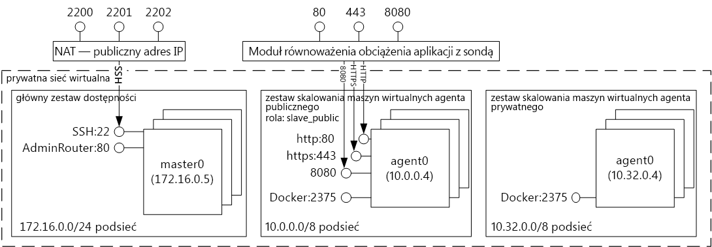
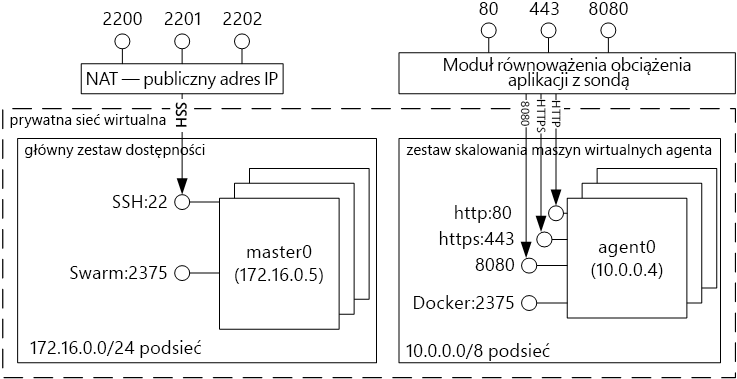

# Kontener tooDocker wprowadzenie hosting rozwiązania z usługą kontenera Azure 
Usługa kontenera platformy Azure uproszczono dla Ciebie toocreate, konfigurowanie i Zarządzanie klastrem maszyn wirtualnych, które są wstępnie skonfigurowane toorun konteneryzowanych aplikacji. Używa ona zoptymalizowanej konfiguracji popularnych narzędzi do planowania i aranżacji typu open source. Umożliwia możesz toouse Twojego posiadane umiejętności lub sięgać duży i rosnącym treści doświadczenia społeczności, toodeploy i Zarządzaj aplikacjami w kontenerze w systemie Microsoft Azure.

Usługa kontenera platformy Azure wykorzystuje hello Docker kontenera format tooensure czy kontenerów aplikacji są w pełni dostosowane. Obsługuje także wybór Marathon i DC/OS, Docker Swarm lub Kubernetes, dzięki czemu można skalować toothousands te aplikacje kontenerów lub nawet dziesiątki tysięcy.

Za pomocą usługi kontenera platformy Azure, możliwość korzystania z funkcji korporacyjnej Azure, zachowując przenośność aplikacji — tym przenośność na powitania aranżacji.

## Korzystanie z usługi Azure Container Service
Naszym celem z usługi kontenera platformy Azure jest tooprovide środowisko macierzyste kontenera za pomocą open source, narzędzia i technologie, które są obecnie popularnością wśród klientów. końcowy toothis uwidaczniamy hello standardowe punkty końcowe interfejsu API z wybranym orchestrator (DC/OS, Docker Swarm lub Kubernetes). Korzystając z tych punktów końcowych, można wykorzystać dowolne oprogramowanie, które jest w stanie mówić toothose punktów końcowych. Na przykład w przypadku hello punktu końcowego hello Docker Swarm można Docker toouse hello-interfejsu wiersza polecenia (CLI). Dla platformy DC/OS możesz wybrać hello DCOS interfejsu wiersza polecenia. W przypadku rozwiązania Kubernetes można wybrać narzędzie `kubectl`.

## Tworzenie klastra platformy Docker za pomocą usługi Azure Container Service
toobegin przy użyciu usługi kontenera platformy Azure, w przypadku wdrażania klastra usługi kontenera platformy Azure za pośrednictwem portalu hello (hello wyszukiwania Marketplace dla **usługi kontenera platformy Azure**), za pomocą szablonu usługi Azure Resource Manager ([Docker Swarm](https://github.com/Azure/azure-quickstart-templates/tree/master/101-acs-swarm), [DC/OS](https://github.com/Azure/azure-quickstart-templates/tree/master/101-acs-dcos), lub [Kubernetes](https://github.com/Azure/azure-quickstart-templates/tree/master/101-acs-kubernetes)), lub z hello [Azure CLI 2.0](container-service-create-acs-cluster-cli.md). Witaj pod warunkiem, że szablony szybkiego startu może być zmodyfikowany tooinclude dodatkowe lub zaawansowanych konfiguracji platformy Azure. Aby uzyskać więcej informacji, zobacz [Wdrażanie klastra usługi Azure Container Service](container-service-deployment.md).

## Wdrażanie aplikacji
Usługa Azure Container Service umożliwia wybranie do aranżacji koordynatora Docker Swarm, DC/OS lub Kubernetes. Sposób wdrażania aplikacji zależy od wybranego programu koordynatora.

### Za pomocą koordynatora DC/OS
DC/OS jest rozproszonego systemu operacyjnego oparte na powitania Apache Mesos systemów rozproszonych jądra. Apache Mesos jest przechowywany na powitania Apache Software Foundation i przedstawiono hello [największych nazw IT](http://mesos.apache.org/documentation/latest/powered-by-mesos/) jako użytkowników i współpracowników.

Systemy DC/OS i Apache Mesos zawierają imponujący zestaw funkcji:

* Sprawdzoną skalowalność
* Zreplikowane przy użyciu usługi Apache ZooKeeper odporne na uszkodzenia elementy główne i podrzędne
* Obsługę kontenerów w formacie aparatu Docker
* Natywną izolację między zadaniami przy użyciu kontenerów systemu Linux
* Planowanie wielu zasobów (pamięci, procesora CPU, dysku i portów)
* Interfejsy API języka Java, Python i C++ do tworzenia nowych aplikacji równoległych
* Interfejs użytkownika sieci Web do wyświetlania stanu klastra

Domyślnie DC/OS systemem usługi kontenera platformy Azure obejmuje hello Marathon aranżacji platformy planowania obciążeń. Jednak dołączonego hello DC/OS wdrażania usług ACS jest hello Universe Mesosphere usług, które można dodać tooyour usługi. Usługi w hello Universe obejmują Spark, Hadoop Cassandra i wiele innych.

#### Przy użyciu platformy Marathon
Marathon jest init całego klastra, a system kontroli dla usług w cgroups — lub w przypadku hello usługi kontenera platformy Azure, kontenery w formacie programu Docker. Platforma Marathon udostępnia interfejs sieci Web, z którego można wdrażać aplikacje. Możesz uzyskać do niej dostęp pod adresem URL, który wygląda podobnie do `http://DNS_PREFIX.REGION.cloudapp.azure.com`, gdzie DNS\_PREFIX i REGION są definiowane w czasie wdrażania. Oczywiście można również podać własną nazwę DNS. Aby uzyskać więcej informacji na temat uruchamiania kontener przy użyciu hello interfejsu użytkownika sieci web Marathon, zobacz [DC/OS zarządzenie kontenerem przy użyciu hello interfejsu użytkownika sieci web Marathon](container-service-mesos-marathon-ui.md).

Umożliwia także hello interfejsów API REST do komunikowania się przy użyciu platformy Marathon. Istnieje wiele bibliotek klienckich, które są dostępne dla każdego narzędzia. Obejmują one różnych językach — i oczywiście przy użyciu protokołu HTTP hello w dowolnym języku. Ponadto wiele popularnych narzędzi DevOps zapewnia obsługę platformy Marathon. Daje to zespołowi operacyjnemu maksymalną elastyczność podczas pracy z klastrem usługi Azure Container Service. Aby uzyskać więcej informacji na temat uruchamiania kontener przy użyciu hello interfejsu API REST platformy Marathon, zobacz [DC/OS zarządzenie kontenerem przy użyciu interfejsu API REST platformy Marathon hello](container-service-mesos-marathon-rest.md).

### Korzystanie z koordynatora Docker Swarm
Koordynator Docker Swarm zapewnia natywne klastrowanie dla platformy Docker. Ponieważ Docker Swarm służy hello standardowe interfejsu API Docker, dowolnego narzędzia, które już komunikuje się z demon Docker można użyć hostów toomultiple skali tootransparently Swarm w usłudze kontenera platformy Azure.

[!INCLUDE [container-service-swarm-mode-note](../../../includes/container-service-swarm-mode-note.md)]

Obsługiwanych narzędzi do zarządzania kontenerami w klastra Swarm obejmują, ale nie są ograniczone do następujących hello:

* Dokku
* Interfejs CLI platformy Docker i narzędzie Docker Compose
* Krane
* Jenkins

### Korzystanie z rozwiązania Kubernetes
Kubernetes to popularne narzędzie koordynatora kontenera na poziomie produkcji typu open source. Narzędzie Kubernetes automatyzuje proces wdrażania i skalowania aplikacji konteneryzowanych oraz zarządzania nimi. Ponieważ to rozwiązanie open source i jest wymuszany przez społeczność open source hello, bezproblemowo działa na usługi kontenera platformy Azure i mogą być używane toodeploy kontenery na dużą skalę w usłudze kontenera platformy Azure.

Narzędzie to obejmuje bogaty zestaw funkcji, m.in.:
* skalowanie w poziomie,
* odnajdywanie usług i równoważenie obciążenia,
* klucze tajne i zarządzanie konfiguracją,
* oparte na interfejsie API zautomatyzowane wprowadzanie i wycofywanie zmian,
* mechanizm samonaprawiania

## Filmy wideo
Wprowadzenie do korzystania z usługi Azure Container Service (podstawy):  

> [!VIDEO https://channel9.msdn.com/Shows/Azure-Friday/Azure-Container-Service-101/player]
>
>

Kompilowanie aplikacji przy użyciu hello usługi kontenera platformy Azure (Build 2016)

> [!VIDEO https://channel9.msdn.com/Events/Build/2016/B822/player]
>
>

## Następne kroki

Wdrażanie klastra usługi kontenera przy użyciu hello [portal](container-service-deployment.md) lub [Azure CLI 2.0](container-service-create-acs-cluster-cli.md).
