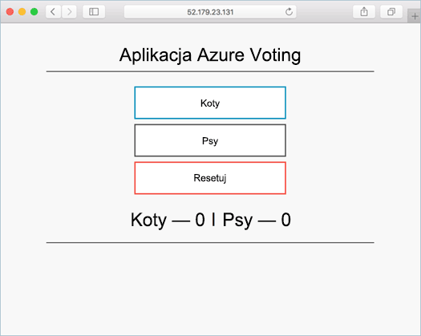

# <a name="deploy-docker-ce-cluster"></a><span data-ttu-id="0c88f-103">Wdrażanie klastra Docker CE</span><span class="sxs-lookup"><span data-stu-id="0c88f-103">Deploy Docker CE cluster</span></span>

<span data-ttu-id="0c88f-104">W tym szybki start klastrze Docker CE jest wdrażane za pomocą hello wiersza polecenia platformy Azure.</span><span class="sxs-lookup"><span data-stu-id="0c88f-104">In this quick start, a Docker CE cluster is deployed using hello Azure CLI.</span></span> <span data-ttu-id="0c88f-105">Następnie wdrożone i uruchomić w klastrze hello aplikacji kontenera wielu składające się z frontonu sieci web oraz wystąpienia pamięci podręcznej Redis.</span><span class="sxs-lookup"><span data-stu-id="0c88f-105">A multi-container application consisting of web front end and a Redis instance is then deployed and run on hello cluster.</span></span> <span data-ttu-id="0c88f-106">Po ukończeniu aplikacji hello jest dostępny za pośrednictwem hello internet.</span><span class="sxs-lookup"><span data-stu-id="0c88f-106">Once completed, hello application is accessible over hello internet.</span></span>

<span data-ttu-id="0c88f-107">Tryb Docker CE w usłudze Azure Container Service jest w wersji zapoznawczej i **nie powinien być używany w przypadku obciążeń produkcyjnych**.</span><span class="sxs-lookup"><span data-stu-id="0c88f-107">Docker CE on Azure Container Service is in preview and **should not be used for production workloads**.</span></span>

<span data-ttu-id="0c88f-108">Jeśli nie masz subskrypcji platformy Azure, przed rozpoczęciem utwórz [bezpłatne konto](https://azure.microsoft.com/free/?WT.mc_id=A261C142F).</span><span class="sxs-lookup"><span data-stu-id="0c88f-108">If you don't have an Azure subscription, create a [free account](https://azure.microsoft.com/free/?WT.mc_id=A261C142F) before you begin.</span></span>

<span data-ttu-id="0c88f-109">Wybierz tooinstall, użyj interfejsu wiersza polecenia hello lokalnie tego przewodnika Szybki Start wymaga działają hello Azure CLI w wersji 2.0.4 lub nowszej.</span><span class="sxs-lookup"><span data-stu-id="0c88f-109">If you choose tooinstall and use hello CLI locally, this quickstart requires that you are running hello Azure CLI version 2.0.4 or later.</span></span> <span data-ttu-id="0c88f-110">Uruchom `az --version` toofind hello wersji.</span><span class="sxs-lookup"><span data-stu-id="0c88f-110">Run `az --version` toofind hello version.</span></span> <span data-ttu-id="0c88f-111">Jeśli potrzebujesz tooinstall lub uaktualniania, zobacz [zainstalować Azure CLI 2.0]( /cli/azure/install-azure-cli).</span><span class="sxs-lookup"><span data-stu-id="0c88f-111">If you need tooinstall or upgrade, see [Install Azure CLI 2.0]( /cli/azure/install-azure-cli).</span></span>

## <a name="create-a-resource-group"></a><span data-ttu-id="0c88f-112">Tworzenie grupy zasobów</span><span class="sxs-lookup"><span data-stu-id="0c88f-112">Create a resource group</span></span>

<span data-ttu-id="0c88f-113">Utwórz grupę zasobów o hello [Tworzenie grupy az](/cli/azure/group#create) polecenia.</span><span class="sxs-lookup"><span data-stu-id="0c88f-113">Create a resource group with hello [az group create](/cli/azure/group#create) command.</span></span> <span data-ttu-id="0c88f-114">Grupa zasobów platformy Azure to logiczna grupa przeznaczona do wdrażania zasobów platformy Azure i zarządzania nimi.</span><span class="sxs-lookup"><span data-stu-id="0c88f-114">An Azure resource group is a logical group in which Azure resources are deployed and managed.</span></span>

<span data-ttu-id="0c88f-115">Witaj poniższy przykład tworzy grupę zasobów o nazwie *myResourceGroup* w hello *ukwest* lokalizacji.</span><span class="sxs-lookup"><span data-stu-id="0c88f-115">hello following example creates a resource group named *myResourceGroup* in hello *ukwest* location.</span></span>

```azurecli-interactive
az group create --name myResourceGroup --location ukwest
```

<span data-ttu-id="0c88f-116">Dane wyjściowe:</span><span class="sxs-lookup"><span data-stu-id="0c88f-116">Output:</span></span>

```json
{
  "id": "/subscriptions/00000000-0000-0000-0000-000000000000/resourceGroups/myResourceGroup",
  "location": "westcentralus",
  "managedBy": null,
  "name": "myResourceGroup",
  "properties": {
    "provisioningState": "Succeeded"
  },
  "tags": null
}
```

## <a name="create-docker-swarm-cluster"></a><span data-ttu-id="0c88f-117">Tworzenie klastra Docker Swarm</span><span class="sxs-lookup"><span data-stu-id="0c88f-117">Create Docker Swarm cluster</span></span>

<span data-ttu-id="0c88f-118">Utwórz klaster Docker CE usługi kontenera platformy Azure z hello [az acs utworzyć](/cli/azure/acs#create) polecenia.</span><span class="sxs-lookup"><span data-stu-id="0c88f-118">Create a Docker CE cluster in Azure Container Service with hello [az acs create](/cli/azure/acs#create) command.</span></span> 

<span data-ttu-id="0c88f-119">Witaj poniższym przykładzie jest tworzony klaster o nazwie *mySwarmCluster* z systemem Linux jednego głównego węzła i trzech węzłów agenta systemu Linux.</span><span class="sxs-lookup"><span data-stu-id="0c88f-119">hello following example creates a cluster named *mySwarmCluster* with one Linux master node and three Linux agent nodes.</span></span>

```azurecli-interactive
az acs create --name mySwarmCluster --orchestrator-type dockerce --resource-group myResourceGroup --generate-ssh-keys
```

<span data-ttu-id="0c88f-120">Po kilku minutach polecenia hello kończy i zwraca informacje o formacie json o hello klastra.</span><span class="sxs-lookup"><span data-stu-id="0c88f-120">After several minutes, hello command completes and returns json formatted information about hello cluster.</span></span>

## <a name="connect-toohello-cluster"></a><span data-ttu-id="0c88f-121">Połącz toohello klastra</span><span class="sxs-lookup"><span data-stu-id="0c88f-121">Connect toohello cluster</span></span>

<span data-ttu-id="0c88f-122">W tym szybki start należy hello nazwę FQDN główny Docker Swarm hello oraz hello Docker agenta puli.</span><span class="sxs-lookup"><span data-stu-id="0c88f-122">Throughout this quick start, you need hello FQDN of both hello Docker Swarm master and hello Docker agent pool.</span></span> <span data-ttu-id="0c88f-123">Uruchom następujące polecenie tooreturn hello zarówno hello master i agenta nazwy FQDN.</span><span class="sxs-lookup"><span data-stu-id="0c88f-123">Run hello following command tooreturn both hello master and agent FQDNs.</span></span>


```bash
az acs list --resource-group myResourceGroup --query '[*].{Master:masterProfile.fqdn,Agent:agentPoolProfiles[0].fqdn}' -o table
```

<span data-ttu-id="0c88f-124">Dane wyjściowe:</span><span class="sxs-lookup"><span data-stu-id="0c88f-124">Output:</span></span>

```bash
Master                                                               Agent
-------------------------------------------------------------------  --------------------------------------------------------------------
myswarmcluster-myresourcegroup-d5b9d4mgmt.ukwest.cloudapp.azure.com  myswarmcluster-myresourcegroup-d5b9d4agent.ukwest.cloudapp.azure.com
```

<span data-ttu-id="0c88f-125">Utwórz wzorzec Swarm toohello tunelu SSH.</span><span class="sxs-lookup"><span data-stu-id="0c88f-125">Create an SSH tunnel toohello Swarm master.</span></span> <span data-ttu-id="0c88f-126">Zastąp `MasterFQDN` adres FQDN hello hello Swarm wzorca.</span><span class="sxs-lookup"><span data-stu-id="0c88f-126">Replace `MasterFQDN` with hello FQDN address of hello Swarm master.</span></span>

```bash
ssh -p 2200 -fNL localhost:2374:/var/run/docker.sock azureuser@MasterFQDN
```

<span data-ttu-id="0c88f-127">Zestaw hello `DOCKER_HOST` zmiennej środowiskowej.</span><span class="sxs-lookup"><span data-stu-id="0c88f-127">Set hello `DOCKER_HOST` environment variable.</span></span> <span data-ttu-id="0c88f-128">Dzięki temu można polecenia docker toorun przed hello Docker Swarm bez nazwy hello toospecify hello hosta.</span><span class="sxs-lookup"><span data-stu-id="0c88f-128">This allows you toorun docker commands against hello Docker Swarm without having toospecify hello name of hello host.</span></span>

```bash
export DOCKER_HOST=localhost:2374
```

<span data-ttu-id="0c88f-129">Wszystko jest teraz gotowy toorun usługi Docker na powitania Docker Swarm.</span><span class="sxs-lookup"><span data-stu-id="0c88f-129">You are now ready toorun Docker services on hello Docker Swarm.</span></span>


## <a name="run-hello-application"></a><span data-ttu-id="0c88f-130">Uruchamianie aplikacji hello</span><span class="sxs-lookup"><span data-stu-id="0c88f-130">Run hello application</span></span>

<span data-ttu-id="0c88f-131">Utwórz plik o nazwie `azure-vote.yaml` i hello kopiowania zawartości do niego.</span><span class="sxs-lookup"><span data-stu-id="0c88f-131">Create a file named `azure-vote.yaml` and copy hello following content into it.</span></span>


```yaml
version: '3'
services:
  azure-vote-back:
    image: redis
    ports:
        - "6379:6379"

  azure-vote-front:
    image: microsoft/azure-vote-front:redis-v1
    environment:
      REDIS: azure-vote-back
    ports:
        - "80:80"
```

<span data-ttu-id="0c88f-132">Uruchom hello [wdrażanie stosu docker](https://docs.docker.com/engine/reference/commandline/stack_deploy/) polecenia toocreate hello Azure głos usługi.</span><span class="sxs-lookup"><span data-stu-id="0c88f-132">Run hello [docker stack deploy](https://docs.docker.com/engine/reference/commandline/stack_deploy/) command toocreate hello Azure Vote service.</span></span>

```bash
docker stack deploy azure-vote --compose-file azure-vote.yaml
```

<span data-ttu-id="0c88f-133">Dane wyjściowe:</span><span class="sxs-lookup"><span data-stu-id="0c88f-133">Output:</span></span>

```bash
Creating network azure-vote_default
Creating service azure-vote_azure-vote-back
Creating service azure-vote_azure-vote-front
```

<span data-ttu-id="0c88f-134">Użyj hello [docker stosu ps](https://docs.docker.com/engine/reference/commandline/stack_ps/) polecenia tooreturn hello stan wdrożenia aplikacji hello.</span><span class="sxs-lookup"><span data-stu-id="0c88f-134">Use hello [docker stack ps](https://docs.docker.com/engine/reference/commandline/stack_ps/) command tooreturn hello deployment status of hello application.</span></span>

```bash
docker stack ps azure-vote
```

<span data-ttu-id="0c88f-135">Raz hello `CURRENT STATE` poszczególnych usług jest `Running`, aplikacja hello jest gotowa.</span><span class="sxs-lookup"><span data-stu-id="0c88f-135">Once hello `CURRENT STATE` of each service is `Running`, hello application is ready.</span></span>

```bash
ID                  NAME                            IMAGE                                 NODE                               DESIRED STATE       CURRENT STATE                ERROR               PORTS
tnklkv3ogu3i        azure-vote_azure-vote-front.1   microsoft/azure-vote-front:redis-v1   swarmm-agentpool0-66066781000004   Running             Running 5 seconds ago                            
lg99i4hy68r9        azure-vote_azure-vote-back.1    redis:latest                          swarmm-agentpool0-66066781000002   Running             Running about a minute ago
```

## <a name="test-hello-application"></a><span data-ttu-id="0c88f-136">Testowanie aplikacji hello</span><span class="sxs-lookup"><span data-stu-id="0c88f-136">Test hello application</span></span>

<span data-ttu-id="0c88f-137">Przeglądaj toohello FQDN hello Swarm agenta puli tootest limit hello Azure głos aplikacji.</span><span class="sxs-lookup"><span data-stu-id="0c88f-137">Browse toohello FQDN of hello Swarm agent pool tootest out hello Azure Vote application.</span></span>



## <a name="delete-cluster"></a><span data-ttu-id="0c88f-139">Usuwanie klastra</span><span class="sxs-lookup"><span data-stu-id="0c88f-139">Delete cluster</span></span>
<span data-ttu-id="0c88f-140">Gdy hello klastra nie jest już potrzebne, można użyć hello [az grupę Usuń](/cli/azure/group#delete) polecenia grupy zasobów hello tooremove, usługi kontenera i wszystkich powiązanych zasobów.</span><span class="sxs-lookup"><span data-stu-id="0c88f-140">When hello cluster is no longer needed, you can use hello [az group delete](/cli/azure/group#delete) command tooremove hello resource group, container service, and all related resources.</span></span>

```azurecli-interactive
az group delete --name myResourceGroup --yes --no-wait
```

## <a name="get-hello-code"></a><span data-ttu-id="0c88f-141">Pobierz kod hello</span><span class="sxs-lookup"><span data-stu-id="0c88f-141">Get hello code</span></span>

<span data-ttu-id="0c88f-142">W tym szybki start kontenera wstępnie utworzony obrazy zostały używane toocreate usługi Docker.</span><span class="sxs-lookup"><span data-stu-id="0c88f-142">In this quick start, pre-created container images have been used toocreate a Docker service.</span></span> <span data-ttu-id="0c88f-143">Witaj związane z kodu aplikacji, plik Dockerfile, i tworzenia plików są dostępne w serwisie GitHub.</span><span class="sxs-lookup"><span data-stu-id="0c88f-143">hello related application code, Dockerfile, and Compose file are available on GitHub.</span></span>

[<span data-ttu-id="0c88f-144">https://github.com/Azure-Samples/azure-voting-app-redis</span><span class="sxs-lookup"><span data-stu-id="0c88f-144">https://github.com/Azure-Samples/azure-voting-app-redis</span></span>](https://github.com/Azure-Samples/azure-voting-app-redis.git)

## <a name="next-steps"></a><span data-ttu-id="0c88f-145">Następne kroki</span><span class="sxs-lookup"><span data-stu-id="0c88f-145">Next steps</span></span>

<span data-ttu-id="0c88f-146">W tym szybki start wdrożyć klaster Docker Swarm i wdrożone tooit wielu kontenera aplikacji.</span><span class="sxs-lookup"><span data-stu-id="0c88f-146">In this quick start, you deployed a Docker Swarm cluster and deployed a multi-container application tooit.</span></span>

<span data-ttu-id="0c88f-147">toolearn temat integracji Docker ciepłych z Visual Studio Team Services, nadal toohello CI/CD z Docker Swarm i VSTS.</span><span class="sxs-lookup"><span data-stu-id="0c88f-147">toolearn about integrating Docker warm with Visual Studio Team Services, continue toohello CI/CD with Docker Swarm and VSTS.</span></span>

> [!div class="nextstepaction"]
> [<span data-ttu-id="0c88f-148">Ciągła integracja/ciągłe dostarczanie z usługami Swarm i VSTS</span><span class="sxs-lookup"><span data-stu-id="0c88f-148">CI/CD with Docker Swarm and VSTS</span></span>](./container-service-docker-swarm-setup-ci-cd.md)