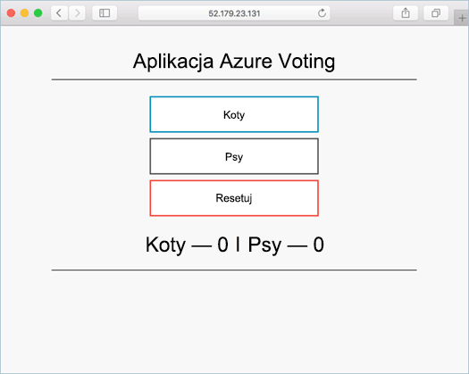

# <a name="deploy-docker-swarm-cluster"></a><span data-ttu-id="e0f6f-103">Wdrażanie klastra Docker Swarm</span><span class="sxs-lookup"><span data-stu-id="e0f6f-103">Deploy Docker Swarm cluster</span></span>

<span data-ttu-id="e0f6f-104">W tym szybki start klaster Docker Swarm jest wdrażane za pomocą hello wiersza polecenia platformy Azure.</span><span class="sxs-lookup"><span data-stu-id="e0f6f-104">In this quick start, a Docker Swarm cluster is deployed using hello Azure CLI.</span></span> <span data-ttu-id="e0f6f-105">Następnie wdrożone i uruchomić w klastrze hello aplikacji kontenera wielu składające się z frontonu sieci web oraz wystąpienia pamięci podręcznej Redis.</span><span class="sxs-lookup"><span data-stu-id="e0f6f-105">A multi-container application consisting of web front end and a Redis instance is then deployed and run on hello cluster.</span></span> <span data-ttu-id="e0f6f-106">Po ukończeniu aplikacji hello jest dostępny za pośrednictwem hello internet.</span><span class="sxs-lookup"><span data-stu-id="e0f6f-106">Once completed, hello application is accessible over hello internet.</span></span>

<span data-ttu-id="e0f6f-107">Jeśli nie masz subskrypcji platformy Azure, przed rozpoczęciem utwórz [bezpłatne konto](https://azure.microsoft.com/free/?WT.mc_id=A261C142F).</span><span class="sxs-lookup"><span data-stu-id="e0f6f-107">If you don't have an Azure subscription, create a [free account](https://azure.microsoft.com/free/?WT.mc_id=A261C142F) before you begin.</span></span>

<span data-ttu-id="e0f6f-108">Ta opcja szybkiego startu wymaga, że używasz wersji interfejsu wiersza polecenia Azure hello 2.0.4 lub nowszym.</span><span class="sxs-lookup"><span data-stu-id="e0f6f-108">This quickstart requires that you are running hello Azure CLI version 2.0.4 or later.</span></span> <span data-ttu-id="e0f6f-109">Uruchom `az --version` toofind hello wersji.</span><span class="sxs-lookup"><span data-stu-id="e0f6f-109">Run `az --version` toofind hello version.</span></span> <span data-ttu-id="e0f6f-110">Jeśli potrzebujesz tooinstall lub uaktualniania, zobacz [zainstalować Azure CLI 2.0]( /cli/azure/install-azure-cli).</span><span class="sxs-lookup"><span data-stu-id="e0f6f-110">If you need tooinstall or upgrade, see [Install Azure CLI 2.0]( /cli/azure/install-azure-cli).</span></span>

## <a name="create-a-resource-group"></a><span data-ttu-id="e0f6f-111">Tworzenie grupy zasobów</span><span class="sxs-lookup"><span data-stu-id="e0f6f-111">Create a resource group</span></span>

<span data-ttu-id="e0f6f-112">Utwórz grupę zasobów o hello [Tworzenie grupy az](/cli/azure/group#create) polecenia.</span><span class="sxs-lookup"><span data-stu-id="e0f6f-112">Create a resource group with hello [az group create](/cli/azure/group#create) command.</span></span> <span data-ttu-id="e0f6f-113">Grupa zasobów platformy Azure to logiczna grupa przeznaczona do wdrażania zasobów platformy Azure i zarządzania nimi.</span><span class="sxs-lookup"><span data-stu-id="e0f6f-113">An Azure resource group is a logical group in which Azure resources are deployed and managed.</span></span>

<span data-ttu-id="e0f6f-114">Witaj poniższy przykład tworzy grupę zasobów o nazwie *myResourceGroup* w hello *westus* lokalizacji.</span><span class="sxs-lookup"><span data-stu-id="e0f6f-114">hello following example creates a resource group named *myResourceGroup* in hello *westus* location.</span></span>

```azurecli-interactive
az group create --name myResourceGroup --location westus
```

<span data-ttu-id="e0f6f-115">Dane wyjściowe:</span><span class="sxs-lookup"><span data-stu-id="e0f6f-115">Output:</span></span>

```json
{
  "id": "/subscriptions/00000000-0000-0000-0000-000000000000/resourceGroups/myResourceGroup",
  "location": "westcentralus",
  "managedBy": null,
  "name": "myResourceGroup",
  "properties": {
    "provisioningState": "Succeeded"
  },
  "tags": null
}
```

## <a name="create-docker-swarm-cluster"></a><span data-ttu-id="e0f6f-116">Tworzenie klastra Docker Swarm</span><span class="sxs-lookup"><span data-stu-id="e0f6f-116">Create Docker Swarm cluster</span></span>

<span data-ttu-id="e0f6f-117">Utwórz klaster Docker Swarm usługi kontenera platformy Azure z hello [az acs utworzyć](/cli/azure/acs#create) polecenia.</span><span class="sxs-lookup"><span data-stu-id="e0f6f-117">Create a Docker Swarm cluster in Azure Container Service with hello [az acs create](/cli/azure/acs#create) command.</span></span> 

<span data-ttu-id="e0f6f-118">Witaj poniższym przykładzie jest tworzony klaster o nazwie *mySwarmCluster* z systemem Linux jednego głównego węzła i trzech węzłów agenta systemu Linux.</span><span class="sxs-lookup"><span data-stu-id="e0f6f-118">hello following example creates a cluster named *mySwarmCluster* with one Linux master node and three Linux agent nodes.</span></span>

```azurecli-interactive
az acs create --name mySwarmCluster --orchestrator-type Swarm --resource-group myResourceGroup --generate-ssh-keys
```

<span data-ttu-id="e0f6f-119">Po kilku minutach polecenia hello kończy i zwraca informacje o formacie json o hello klastra.</span><span class="sxs-lookup"><span data-stu-id="e0f6f-119">After several minutes, hello command completes and returns json formatted information about hello cluster.</span></span>

## <a name="connect-toohello-cluster"></a><span data-ttu-id="e0f6f-120">Połącz toohello klastra</span><span class="sxs-lookup"><span data-stu-id="e0f6f-120">Connect toohello cluster</span></span>

<span data-ttu-id="e0f6f-121">W tym szybki start należy adres IP hello główny Docker Swarm hello oraz hello Docker agenta puli.</span><span class="sxs-lookup"><span data-stu-id="e0f6f-121">Throughout this quick start, you need hello IP address of both hello Docker Swarm master and hello Docker agent pool.</span></span> <span data-ttu-id="e0f6f-122">Uruchom następujące polecenie tooreturn hello oba adresy IP.</span><span class="sxs-lookup"><span data-stu-id="e0f6f-122">Run hello following command tooreturn both IP addresses.</span></span>


```bash
az network public-ip list --resource-group myResourceGroup --query '[*].{Name:name,IPAddress:ipAddress}' -o table
```

<span data-ttu-id="e0f6f-123">Dane wyjściowe:</span><span class="sxs-lookup"><span data-stu-id="e0f6f-123">Output:</span></span>

```bash
Name                                                                 IPAddress
-------------------------------------------------------------------  -------------
swarmm-agent-ip-myswarmcluster-myresourcegroup-d5b9d4agent-66066781  52.179.23.131
swarmm-master-ip-myswarmcluster-myresourcegroup-d5b9d4mgmt-66066781  52.141.37.199
```

<span data-ttu-id="e0f6f-124">Utwórz wzorzec Swarm toohello tunelu SSH.</span><span class="sxs-lookup"><span data-stu-id="e0f6f-124">Create an SSH tunnel toohello Swarm master.</span></span> <span data-ttu-id="e0f6f-125">Zastąp `IPAddress` o adresie IP hello hello Swarm wzorca.</span><span class="sxs-lookup"><span data-stu-id="e0f6f-125">Replace `IPAddress` with hello IP address of hello Swarm master.</span></span>

```bash
ssh -p 2200 -fNL 2375:localhost:2375 azureuser@IPAddress
```

<span data-ttu-id="e0f6f-126">Zestaw hello `DOCKER_HOST` zmiennej środowiskowej.</span><span class="sxs-lookup"><span data-stu-id="e0f6f-126">Set hello `DOCKER_HOST` environment variable.</span></span> <span data-ttu-id="e0f6f-127">Dzięki temu można polecenia docker toorun przed hello Docker Swarm bez nazwy hello toospecify hello hosta.</span><span class="sxs-lookup"><span data-stu-id="e0f6f-127">This allows you toorun docker commands against hello Docker Swarm without having toospecify hello name of hello host.</span></span>

```bash
export DOCKER_HOST=:2375
```

<span data-ttu-id="e0f6f-128">Wszystko jest teraz gotowy toorun usługi Docker na powitania Docker Swarm.</span><span class="sxs-lookup"><span data-stu-id="e0f6f-128">You are now ready toorun Docker services on hello Docker Swarm.</span></span>


## <a name="run-hello-application"></a><span data-ttu-id="e0f6f-129">Uruchamianie aplikacji hello</span><span class="sxs-lookup"><span data-stu-id="e0f6f-129">Run hello application</span></span>

<span data-ttu-id="e0f6f-130">Utwórz plik o nazwie `docker-compose.yaml` i hello kopiowania zawartości do niego.</span><span class="sxs-lookup"><span data-stu-id="e0f6f-130">Create a file named `docker-compose.yaml` and copy hello following content into it.</span></span>

```yaml
version: '3'
services:
  azure-vote-back:
    image: redis
    container_name: azure-vote-back
    ports:
        - "6379:6379"

  azure-vote-front:
    image: microsoft/azure-vote-front:redis-v1
    container_name: azure-vote-front
    environment:
      REDIS: azure-vote-back
    ports:
        - "80:80"
```

<span data-ttu-id="e0f6f-131">Uruchom hello następujące polecenia toocreate hello Azure głos usługi.</span><span class="sxs-lookup"><span data-stu-id="e0f6f-131">Run hello following command toocreate hello Azure Vote service.</span></span>

```bash
docker-compose up -d
```

<span data-ttu-id="e0f6f-132">Dane wyjściowe:</span><span class="sxs-lookup"><span data-stu-id="e0f6f-132">Output:</span></span>

```bash
Creating network "user_default" with hello default driver
Pulling azure-vote-front (microsoft/azure-vote-front:redis-v1)...
swarm-agent-EE873B23000005: Pulling microsoft/azure-vote-front:redis-v1...
swarm-agent-EE873B23000004: Pulling microsoft/azure-vote-front:redis-v1... : downloaded
Pulling azure-vote-back (redis:latest)...
swarm-agent-EE873B23000004: Pulling redis:latest... : downloaded
Creating azure-vote-front ... 
Creating azure-vote-back ... 
Creating azure-vote-front
Creating azure-vote-back ...
```

## <a name="test-hello-application"></a><span data-ttu-id="e0f6f-133">Testowanie aplikacji hello</span><span class="sxs-lookup"><span data-stu-id="e0f6f-133">Test hello application</span></span>

<span data-ttu-id="e0f6f-134">Przeglądaj adres IP toohello hello Swarm agenta puli tootest limit hello Azure głos aplikacji.</span><span class="sxs-lookup"><span data-stu-id="e0f6f-134">Browse toohello IP address of hello Swarm agent pool tootest out hello Azure Vote application.</span></span>



## <a name="delete-cluster"></a><span data-ttu-id="e0f6f-136">Usuwanie klastra</span><span class="sxs-lookup"><span data-stu-id="e0f6f-136">Delete cluster</span></span>
<span data-ttu-id="e0f6f-137">Gdy hello klastra nie jest już potrzebne, można użyć hello [az grupę Usuń](/cli/azure/group#delete) polecenia grupy zasobów hello tooremove, usługi kontenera i wszystkich powiązanych zasobów.</span><span class="sxs-lookup"><span data-stu-id="e0f6f-137">When hello cluster is no longer needed, you can use hello [az group delete](/cli/azure/group#delete) command tooremove hello resource group, container service, and all related resources.</span></span>

```azurecli-interactive
az group delete --name myResourceGroup --yes --no-wait
```

## <a name="get-hello-code"></a><span data-ttu-id="e0f6f-138">Pobierz kod hello</span><span class="sxs-lookup"><span data-stu-id="e0f6f-138">Get hello code</span></span>

<span data-ttu-id="e0f6f-139">W tym szybki start kontenera wstępnie utworzony obrazy zostały używane toocreate usługi Docker.</span><span class="sxs-lookup"><span data-stu-id="e0f6f-139">In this quick start, pre-created container images have been used toocreate a Docker service.</span></span> <span data-ttu-id="e0f6f-140">Witaj związane z kodu aplikacji, plik Dockerfile, i tworzenia plików są dostępne w serwisie GitHub.</span><span class="sxs-lookup"><span data-stu-id="e0f6f-140">hello related application code, Dockerfile, and Compose file are available on GitHub.</span></span>

[<span data-ttu-id="e0f6f-141">https://github.com/Azure-Samples/azure-voting-app-redis</span><span class="sxs-lookup"><span data-stu-id="e0f6f-141">https://github.com/Azure-Samples/azure-voting-app-redis</span></span>](https://github.com/Azure-Samples/azure-voting-app-redis.git)

## <a name="next-steps"></a><span data-ttu-id="e0f6f-142">Następne kroki</span><span class="sxs-lookup"><span data-stu-id="e0f6f-142">Next steps</span></span>

<span data-ttu-id="e0f6f-143">W tym szybki start wdrożyć klaster Docker Swarm i wdrożone tooit wielu kontenera aplikacji.</span><span class="sxs-lookup"><span data-stu-id="e0f6f-143">In this quick start, you deployed a Docker Swarm cluster and deployed a multi-container application tooit.</span></span>

<span data-ttu-id="e0f6f-144">toolearn temat integracji Docker ciepłych z Visual Studio Team Services, nadal toohello CI/CD z Docker Swarm i VSTS.</span><span class="sxs-lookup"><span data-stu-id="e0f6f-144">toolearn about integrating Docker warm with Visual Studio Team Services, continue toohello CI/CD with Docker Swarm and VSTS.</span></span>

> [!div class="nextstepaction"]
> [<span data-ttu-id="e0f6f-145">Ciągła integracja/ciągłe dostarczanie z usługami Swarm i VSTS</span><span class="sxs-lookup"><span data-stu-id="e0f6f-145">CI/CD with Docker Swarm and VSTS</span></span>](./container-service-docker-swarm-setup-ci-cd.md)