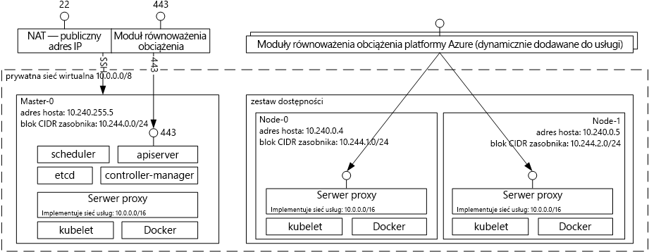

# Wprowadzenie tooAzure usługi kontenera dla KubernetesIntroduction tooAzure Container Service for Kubernetes
Usługa kontenera platformy Azure dla Kubernetes umożliwia proste toocreate, konfigurowanie i Zarządzanie klastrem maszyn wirtualnych, które są wstępnie skonfigurowane toorun konteneryzowanych aplikacji.Azure Container Service for Kubernetes makes it simple toocreate, configure, and manage a cluster of virtual machines that are preconfigured toorun containerized applications. Umożliwia możesz toouse Twojego posiadane umiejętności lub sięgać duży i rosnącym treści doświadczenia społeczności, toodeploy i Zarządzaj aplikacjami w kontenerze w systemie Microsoft Azure.This enables you toouse your existing skills, or draw upon a large and growing body of community expertise, toodeploy and manage container-based applications on Microsoft Azure.

Za pomocą usługi kontenera platformy Azure, można skorzystać z hello korporacyjnej funkcji platformy Azure, zachowując przenośność aplikacji za pośrednictwem Kubernetes i hello Docker format obrazu.By using Azure Container Service, you can take advantage of hello enterprise-grade features of Azure, while still maintaining application portability through Kubernetes and hello Docker image format.

## Używanie usługi Azure Container Service ma potrzeby rozwiązania KubernetesUsing Azure Container Service for Kubernetes
Naszym celem z usługi kontenera platformy Azure jest tooprovide środowisko macierzyste kontenera za pomocą open source, narzędzia i technologie, które są obecnie popularnością wśród klientów.Our goal with Azure Container Service is tooprovide a container hosting environment by using open-source tools and technologies that are popular among our customers today. końcowy toothis uwidaczniamy hello standardowe Kubernetes punkty końcowe interfejsu API.toothis end, we expose hello standard Kubernetes API endpoints. Za pomocą tych standardowych punktów końcowych, można wykorzystać dowolne oprogramowanie, które jest w stanie mówić tooa Kubernetes klastra.By using these standard endpoints, you can leverage any software that is capable of talking tooa Kubernetes cluster. Możesz wybrać narzędzie [kubectl](https://kubernetes.io/docs/user-guide/kubectl-overview/), [helm](https://helm.sh/) lub [draft](https://github.com/Azure/draft).For example, you might choose [kubectl](https://kubernetes.io/docs/user-guide/kubectl-overview/), [helm](https://helm.sh/), or [draft](https://github.com/Azure/draft).

## Tworzenie klastra Kubernetes przy użyciu usługi Azure Container ServiceCreating a Kubernetes cluster using Azure Container Service
toobegin przy użyciu usługi kontenera platformy Azure, wdrażanie klastra usługi kontenera platformy Azure z hello [Azure CLI 2.0](container-service-kubernetes-walkthrough.md) lub za pośrednictwem portalu hello (hello wyszukiwania portalu Marketplace dla **usługi kontenera platformy Azure**).toobegin using Azure Container Service, deploy an Azure Container Service cluster with hello [Azure CLI 2.0](container-service-kubernetes-walkthrough.md) or via hello portal (search hello Marketplace for **Azure Container Service**). Jeśli jesteś użytkownikiem zaawansowanym, który musi mieć większą kontrolę nad hello szablonów usługi Azure Resource Manager, można użyć typu open source hello [aparat acs](https://github.com/Azure/acs-engine) toobuild projektu własne niestandardowe Kubernetes klastra i wdróż je za pośrednictwem hello `az` interfejsu wiersza polecenia.If you are an advanced user who needs more control over hello Azure Resource Manager templates, you can use hello open source [acs-engine](https://github.com/Azure/acs-engine) project toobuild your own custom Kubernetes cluster and deploy it via hello `az` CLI.

### Korzystanie z rozwiązania KubernetesUsing Kubernetes
Narzędzie Kubernetes automatyzuje proces wdrażania i skalowania aplikacji konteneryzowanych oraz zarządzania nimi.Kubernetes automates deployment, scaling, and management of containerized applications. Narzędzie to obejmuje bogaty zestaw funkcji, m.in.:It has a rich set of features including:
* automatyczne pakowanie pudełek,Automatic binpacking
* mechanizm samonaprawianiaSelf-healing
* skalowanie w poziomie,Horizontal scaling
* odnajdywanie usług i równoważenie obciążenia,Service discovery and load balancing
* zautomatyzowane wprowadzanie i wycofywanie zmian,Automated rollouts and rollbacks
* zarządzanie kluczami tajnymi i konfiguracją,Secret and configuration management
* aranżacja magazynu,Storage orchestration
* wykonywanie partii zadań.Batch execution

Diagram architektury rozwiązania Kubernetes wdrażanej za pomocą usługi Azure Container Service:Architectural diagram of Kubernetes deployed via Azure Container Service:

## Filmy wideoVideos

Obsługa klastra Kubernetes w usłudze Azure Container Service (Azure Friday, styczeń 2017 r.):Kubernetes Support in Azure Container Services (Azure Friday, January 2017):

> [!VIDEO https://channel9.msdn.com/Shows/Azure-Friday/Kubernetes-Support-in-Azure-Container-Services/player]
>
>

Narzędzia do tworzenia i wdrażania aplikacji w systemie Kubernetes (Azure OpenDev, czerwiec 2017 r.):Tools for Developing and Deploying Applications on Kubernetes (Azure OpenDev, June 2017):

> [!VIDEO https://channel9.msdn.com/Events/AzureOpenDev/June2017/Tools-for-Developing-and-Deploying-Applications-on-Kubernetes/player]
>
>

## Następne krokiNext steps

Eksploruj hello [szybkiego startu Kubernetes](container-service-kubernetes-walkthrough.md) toobegin dzisiaj Eksplorowanie usługi kontenera platformy Azure.Explore hello [Kubernetes Quickstart](container-service-kubernetes-walkthrough.md) toobegin exploring Azure Container Service today.
