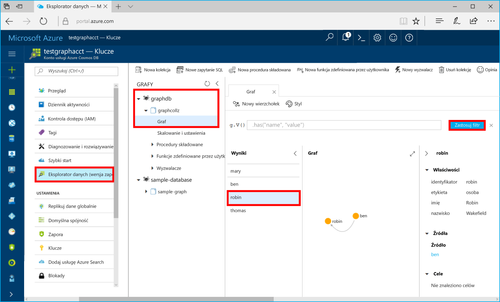

# <a name="azure-cosmos-db-build-a-net-application-using-hello-graph-api"></a><span data-ttu-id="426f2-103">Azure rozwiązania Cosmos bazy danych: Tworzenie aplikacji platformy .NET przy użyciu interfejsu API programu Graph hello</span><span class="sxs-lookup"><span data-stu-id="426f2-103">Azure Cosmos DB: Build a .NET application using hello Graph API</span></span>

<span data-ttu-id="426f2-104">Azure Cosmos DB to rozproszona globalnie wielomodelowa usługa bazy danych firmy Microsoft.</span><span class="sxs-lookup"><span data-stu-id="426f2-104">Azure Cosmos DB is Microsoft’s globally distributed multi-model database service.</span></span> <span data-ttu-id="426f2-105">Można szybko utworzyć i wyszukiwać dokumentu, klucza i wartości i wykres baz danych, które korzystają z dystrybucji globalne hello i możliwości skalowanie w poziomie na podstawowe hello Azure DB rozwiązania Cosmos.</span><span class="sxs-lookup"><span data-stu-id="426f2-105">You can quickly create and query document, key/value, and graph databases, all of which benefit from hello global distribution and horizontal scale capabilities at hello core of Azure Cosmos DB.</span></span> 

<span data-ttu-id="426f2-106">To szybki start pokazano, jak toocreate konta bazy danych Azure rozwiązania Cosmos, bazy danych i wykres (kontener) przy użyciu hello portalu Azure.</span><span class="sxs-lookup"><span data-stu-id="426f2-106">This quick start demonstrates how toocreate an Azure Cosmos DB account, database, and graph (container) using hello Azure portal.</span></span> <span data-ttu-id="426f2-107">Następnie skompilować i uruchomić aplikację konsoli oparty na powitania [interfejsu API programu Graph](graph-sdk-dotnet.md) (wersja zapoznawcza).</span><span class="sxs-lookup"><span data-stu-id="426f2-107">You then build and run a console app built on hello [Graph API](graph-sdk-dotnet.md) (preview).</span></span>  

## <a name="prerequisites"></a><span data-ttu-id="426f2-108">Wymagania wstępne</span><span class="sxs-lookup"><span data-stu-id="426f2-108">Prerequisites</span></span>

<span data-ttu-id="426f2-109">Jeśli nie masz jeszcze programu Visual Studio 2017 r zainstalowany, możesz pobrać i użyć hello **wolnego** [programu Visual Studio 2017 Community Edition](https://www.visualstudio.com/downloads/).</span><span class="sxs-lookup"><span data-stu-id="426f2-109">If you don’t already have Visual Studio 2017 installed, you can download and use hello **free** [Visual Studio 2017 Community Edition](https://www.visualstudio.com/downloads/).</span></span> <span data-ttu-id="426f2-110">Upewnij się, że możesz włączyć **Azure programowanie** podczas instalacji programu Visual Studio hello.</span><span class="sxs-lookup"><span data-stu-id="426f2-110">Make sure that you enable **Azure development** during hello Visual Studio setup.</span></span>

[!INCLUDE [quickstarts-free-trial-note](../../includes/quickstarts-free-trial-note.md)]

## <a name="create-a-database-account"></a><span data-ttu-id="426f2-111">Tworzenie konta bazy danych</span><span class="sxs-lookup"><span data-stu-id="426f2-111">Create a database account</span></span>

[!INCLUDE [cosmos-db-create-dbaccount-graph](../../includes/cosmos-db-create-dbaccount-graph.md)]

## <a name="add-a-graph"></a><span data-ttu-id="426f2-112">Dodawanie grafu</span><span class="sxs-lookup"><span data-stu-id="426f2-112">Add a graph</span></span>

[!INCLUDE [cosmos-db-create-graph](../../includes/cosmos-db-create-graph.md)]

## <a name="clone-hello-sample-application"></a><span data-ttu-id="426f2-113">Klonowanie hello przykładowej aplikacji</span><span class="sxs-lookup"><span data-stu-id="426f2-113">Clone hello sample application</span></span>

<span data-ttu-id="426f2-114">Teraz załóżmy aplikacji w klonowania interfejs API programu Graph z serwisu github, Ustaw ciąg połączenia hello i uruchom go.</span><span class="sxs-lookup"><span data-stu-id="426f2-114">Now let's clone a Graph API app from github, set hello connection string, and run it.</span></span> <span data-ttu-id="426f2-115">Zobaczysz, jak łatwo jest toowork z danymi programowo.</span><span class="sxs-lookup"><span data-stu-id="426f2-115">You'll see how easy it is toowork with data programmatically.</span></span> 

1. <span data-ttu-id="426f2-116">Otwórz okno terminala git, np. git bash, i `cd` tooa katalog roboczy.</span><span class="sxs-lookup"><span data-stu-id="426f2-116">Open a git terminal window, such as git bash, and `cd` tooa working directory.</span></span>  

2. <span data-ttu-id="426f2-117">Hello uruchom następujące polecenie tooclone hello próbki repozytorium.</span><span class="sxs-lookup"><span data-stu-id="426f2-117">Run hello following command tooclone hello sample repository.</span></span> 

    ```bash
    git clone https://github.com/Azure-Samples/azure-cosmos-db-graph-dotnet-getting-started.git
    ```

3. <span data-ttu-id="426f2-118">Następnie otwórz program Visual Studio i hello Otwórz plik rozwiązania.</span><span class="sxs-lookup"><span data-stu-id="426f2-118">Then open Visual Studio and open hello solution file.</span></span> 

## <a name="review-hello-code"></a><span data-ttu-id="426f2-119">Przejrzyj hello kodu</span><span class="sxs-lookup"><span data-stu-id="426f2-119">Review hello code</span></span>

<span data-ttu-id="426f2-120">Upewnijmy szybki przegląd działania wykonywane w aplikacji hello.</span><span class="sxs-lookup"><span data-stu-id="426f2-120">Let's make a quick review of what's happening in hello app.</span></span> <span data-ttu-id="426f2-121">Hello Otwórz plik Program.cs i tam, że te wiersze kodu utworzyć hello zasobów bazy danych Azure rozwiązania Cosmos.</span><span class="sxs-lookup"><span data-stu-id="426f2-121">Open hello Program.cs file and you'll find that these lines of code create hello Azure Cosmos DB resources.</span></span> 

* <span data-ttu-id="426f2-122">zainicjowano Hello DocumentClient.</span><span class="sxs-lookup"><span data-stu-id="426f2-122">hello DocumentClient is initialized.</span></span> <span data-ttu-id="426f2-123">W podglądzie hello dodaliśmy rozszerzenia interfejsu API programu graph na powitania klienta bazy danych Azure rozwiązania Cosmos.</span><span class="sxs-lookup"><span data-stu-id="426f2-123">In hello preview, we added a graph extension API on hello Azure Cosmos DB client.</span></span> <span data-ttu-id="426f2-124">Pracujemy nad klient wykres autonomiczny całkowicie niezależna od hello Azure DB rozwiązania Cosmos klienta i zasobów.</span><span class="sxs-lookup"><span data-stu-id="426f2-124">We are working on a standalone graph client decoupled from hello Azure Cosmos DB client and resources.</span></span>

    ```csharp
    using (DocumentClient client = new DocumentClient(
        new Uri(endpoint),
        authKey,
        new ConnectionPolicy { ConnectionMode = ConnectionMode.Direct, ConnectionProtocol = Protocol.Tcp }))
    ```

* <span data-ttu-id="426f2-125">Tworzenie nowej bazy danych.</span><span class="sxs-lookup"><span data-stu-id="426f2-125">A new database is created.</span></span>

    ```csharp
    Database database = await client.CreateDatabaseIfNotExistsAsync(new Database { Id = "graphdb" });
    ```

* <span data-ttu-id="426f2-126">Tworzenie nowego grafu.</span><span class="sxs-lookup"><span data-stu-id="426f2-126">A new graph is created.</span></span>

    ```csharp
    DocumentCollection graph = await client.CreateDocumentCollectionIfNotExistsAsync(
        UriFactory.CreateDatabaseUri("graphdb"),
        new DocumentCollection { Id = "graph" },
        new RequestOptions { OfferThroughput = 1000 });
    ```
* <span data-ttu-id="426f2-127">Serie kroków Gremlin są wykonywane przy użyciu hello `CreateGremlinQuery` metody.</span><span class="sxs-lookup"><span data-stu-id="426f2-127">A series of Gremlin steps are executed using hello `CreateGremlinQuery` method.</span></span>

    ```csharp
    // hello CreateGremlinQuery method extensions allow you tooexecute Gremlin queries and iterate
    // results asychronously
    IDocumentQuery<dynamic> query = client.CreateGremlinQuery<dynamic>(graph, "g.V().count()");
    while (query.HasMoreResults)
    {
        foreach (dynamic result in await query.ExecuteNextAsync())
        {
            Console.WriteLine($"\t {JsonConvert.SerializeObject(result)}");
        }
    }

    ```

## <a name="update-your-connection-string"></a><span data-ttu-id="426f2-128">Aktualizowanie parametrów połączenia</span><span class="sxs-lookup"><span data-stu-id="426f2-128">Update your connection string</span></span>

<span data-ttu-id="426f2-129">Teraz przejdź wstecz toohello Azure tooget portalu użytkownika informacje o parametrach połączenia i skopiuj go do aplikacji hello.</span><span class="sxs-lookup"><span data-stu-id="426f2-129">Now go back toohello Azure portal tooget your connection string information and copy it into hello app.</span></span>

1. <span data-ttu-id="426f2-130">W programie Visual Studio 2017 r Otwórz plik App.config hello.</span><span class="sxs-lookup"><span data-stu-id="426f2-130">In Visual Studio 2017, open hello App.config file.</span></span> 

2. <span data-ttu-id="426f2-131">W portalu Azure na koncie Azure DB rozwiązania Cosmos powitania kliknij **kluczy** w hello lewy pasek nawigacyjny.</span><span class="sxs-lookup"><span data-stu-id="426f2-131">In hello Azure portal, in your Azure Cosmos DB account, click **Keys** in hello left navigation.</span></span> 

    

3. <span data-ttu-id="426f2-133">Kopia Twojej **identyfikatora URI** wartość z portalu hello i zapewnić ich hello wartość klucza punktu końcowego hello w pliku App.config. Jak pokazano w hello wartość hello toocopy zrzut ekranu poprzedzającym, można użyć przycisku Kopiuj hello.</span><span class="sxs-lookup"><span data-stu-id="426f2-133">Copy your **URI** value from hello portal and make it hello value of hello Endpoint key in App.config. You can use hello copy button as shown in hello preceding screenshot toocopy hello value.</span></span>

    `<add key="Endpoint" value="https://FILLME.documents.azure.com:443" />`

4. <span data-ttu-id="426f2-134">Kopiowania z **klucz podstawowy** wartość z portalu hello i zapewnić ich hello wartość klucza AuthKey hello w pliku App.config, a następnie zapisz zmiany.</span><span class="sxs-lookup"><span data-stu-id="426f2-134">Copy your **PRIMARY KEY** value from hello portal, and make it hello value of hello AuthKey key in App.config, then save your changes.</span></span> 

    `<add key="AuthKey" value="FILLME" />`

<span data-ttu-id="426f2-135">Użytkownik zaktualizował teraz aplikacji z wszystkie informacje hello musi toocommunicate z bazy danych Azure rozwiązania Cosmos.</span><span class="sxs-lookup"><span data-stu-id="426f2-135">You've now updated your app with all hello info it needs toocommunicate with Azure Cosmos DB.</span></span> 

## <a name="run-hello-console-app"></a><span data-ttu-id="426f2-136">Uruchamianie aplikacji konsoli hello</span><span class="sxs-lookup"><span data-stu-id="426f2-136">Run hello console app</span></span>

1. <span data-ttu-id="426f2-137">W programie Visual Studio, kliknij prawym przyciskiem myszy hello **GraphGetStarted** projektu w **Eksploratora rozwiązań** , a następnie kliknij przycisk **Zarządzaj pakietami NuGet**.</span><span class="sxs-lookup"><span data-stu-id="426f2-137">In Visual Studio, right-click on hello **GraphGetStarted** project in **Solution Explorer** and then click **Manage NuGet Packages**.</span></span> 

2. <span data-ttu-id="426f2-138">W hello NuGet **Przeglądaj** wpisz *Microsoft.Azure.Graphs* i sprawdź hello **zawiera wersję wstępną** pole.</span><span class="sxs-lookup"><span data-stu-id="426f2-138">In hello NuGet **Browse** box, type *Microsoft.Azure.Graphs* and check hello **Includes prerelease** box.</span></span> 

3. <span data-ttu-id="426f2-139">Wyniki hello zainstalować hello **Microsoft.Azure.Graphs** biblioteki.</span><span class="sxs-lookup"><span data-stu-id="426f2-139">From hello results, install hello **Microsoft.Azure.Graphs** library.</span></span> <span data-ttu-id="426f2-140">Spowoduje to zainstalowanie hello Azure DB rozwiązania Cosmos wykres rozszerzenie biblioteki pakietu i wszystkie zależności.</span><span class="sxs-lookup"><span data-stu-id="426f2-140">This installs hello Azure Cosmos DB graph extension library package and all dependencies.</span></span>

    <span data-ttu-id="426f2-141">Jeśli zostanie wyświetlony komunikat o przegląd zmian toohello rozwiązania, kliknij przycisk **OK**.</span><span class="sxs-lookup"><span data-stu-id="426f2-141">If you get a message about reviewing changes toohello solution, click **OK**.</span></span> <span data-ttu-id="426f2-142">Jeśli wyświetlany jest komunikat o akceptacji licencji, kliknij pozycję **Akceptuję**.</span><span class="sxs-lookup"><span data-stu-id="426f2-142">If you get a message about license acceptance, click **I accept**.</span></span>

4. <span data-ttu-id="426f2-143">Kliknij polecenie CTRL + F5 toorun hello aplikacji.</span><span class="sxs-lookup"><span data-stu-id="426f2-143">Click CTRL + F5 toorun hello application.</span></span>

   <span data-ttu-id="426f2-144">okno konsoli Hello Wyświetla wierzchołków hello i krawędzi dodawany toohello wykresu.</span><span class="sxs-lookup"><span data-stu-id="426f2-144">hello console window displays hello vertexes and edges being added toohello graph.</span></span> <span data-ttu-id="426f2-145">Gdy hello ukończeniu działania skryptu, naciśnij klawisz ENTER dwukrotnie tooclose okna konsoli hello.</span><span class="sxs-lookup"><span data-stu-id="426f2-145">When hello script completes, press ENTER twice tooclose hello console window.</span></span> 

## <a name="browse-using-hello-data-explorer"></a><span data-ttu-id="426f2-146">Przeglądaj przy użyciu hello Eksploratora danych</span><span class="sxs-lookup"><span data-stu-id="426f2-146">Browse using hello Data Explorer</span></span>

<span data-ttu-id="426f2-147">Można teraz wróć tooData Explorer w hello portalu Azure i Przeglądaj i wyszukiwać nowych danych wykresu.</span><span class="sxs-lookup"><span data-stu-id="426f2-147">You can now go back tooData Explorer in hello Azure portal and browse and query your new graph data.</span></span>

1. <span data-ttu-id="426f2-148">W Eksploratorze danych hello nowej bazy danych zostanie wyświetlona w okienku wykresy hello.</span><span class="sxs-lookup"><span data-stu-id="426f2-148">In Data Explorer, hello new database appears in hello Graphs pane.</span></span> <span data-ttu-id="426f2-149">Rozwiń węzeł **graphdb** i **graphcollz**, a następnie kliknij pozycję **Graf**.</span><span class="sxs-lookup"><span data-stu-id="426f2-149">Expand **graphdb**, **graphcollz**, and then click **Graph**.</span></span>

2. <span data-ttu-id="426f2-150">Kliknij przycisk hello **Zastosuj filtr** przycisk toouse hello domyślne zapytanie tooview wszystkie verticies hello hello wykresie.</span><span class="sxs-lookup"><span data-stu-id="426f2-150">Click hello **Apply Filter** button toouse hello default query tooview all hello verticies in hello graph.</span></span> <span data-ttu-id="426f2-151">Hello dane generowane przez hello Przykładowa aplikacja jest wyświetlana w okienku wykresy hello.</span><span class="sxs-lookup"><span data-stu-id="426f2-151">hello data generated by hello sample app is displayed in hello Graphs pane.</span></span>

    <span data-ttu-id="426f2-152">Można powiększyć i hello wykresu, rozwiń obszar wyświetlania wykresu hello, Dodaj dodatkowe verticies i przenieść verticies na powitania wyświetlić powierzchni.</span><span class="sxs-lookup"><span data-stu-id="426f2-152">You can zoom in and out of hello graph, you can expand hello graph display space, add additional verticies, and move verticies on hello display surface.</span></span>

    

## <a name="review-slas-in-hello-azure-portal"></a><span data-ttu-id="426f2-154">Przejrzyj umowy SLA w hello portalu Azure</span><span class="sxs-lookup"><span data-stu-id="426f2-154">Review SLAs in hello Azure portal</span></span>

[!INCLUDE [cosmosdb-tutorial-review-slas](../../includes/cosmos-db-tutorial-review-slas.md)]

## <a name="clean-up-resources"></a><span data-ttu-id="426f2-155">Oczyszczanie zasobów</span><span class="sxs-lookup"><span data-stu-id="426f2-155">Clean up resources</span></span>

<span data-ttu-id="426f2-156">Jeśli nie będzie toocontinue toouse tej aplikacji, należy usunąć wszystkie zasoby utworzone przez tego przewodnika Szybki Start w hello portalu Azure z hello następujące kroki:</span><span class="sxs-lookup"><span data-stu-id="426f2-156">If you're not going toocontinue toouse this app, delete all resources created by this quickstart in hello Azure portal with hello following steps:</span></span> 

1. <span data-ttu-id="426f2-157">Z menu po lewej stronie powitania w hello portalu Azure, kliknij przycisk **grup zasobów** a następnie kliknij nazwę hello zasobu hello został utworzony.</span><span class="sxs-lookup"><span data-stu-id="426f2-157">From hello left-hand menu in hello Azure portal, click **Resource groups** and then click hello name of hello resource you created.</span></span> 
2. <span data-ttu-id="426f2-158">Na stronie grupy zasobów, kliknij przycisk **usunąć**, wpisz nazwę hello toodelete zasobów hello w polu tekstowym hello, a następnie kliknij **usunąć**.</span><span class="sxs-lookup"><span data-stu-id="426f2-158">On your resource group page, click **Delete**, type hello name of hello resource toodelete in hello text box, and then click **Delete**.</span></span>

## <a name="next-steps"></a><span data-ttu-id="426f2-159">Następne kroki</span><span class="sxs-lookup"><span data-stu-id="426f2-159">Next steps</span></span>

<span data-ttu-id="426f2-160">W tym szybkiego startu kiedy znasz już jak toocreate konto bazy danych Azure rozwiązania Cosmos utworzyć wykres przy użyciu hello Eksploratora danych i uruchom aplikację.</span><span class="sxs-lookup"><span data-stu-id="426f2-160">In this quickstart, you've learned how toocreate an Azure Cosmos DB account, create a graph using hello Data Explorer, and run an app.</span></span> <span data-ttu-id="426f2-161">Teraz możesz tworzyć bardziej złożone zapytania i implementować zaawansowaną logikę przechodzenia grafu za pomocą języka Gremlin.</span><span class="sxs-lookup"><span data-stu-id="426f2-161">You can now build more complex queries and implement powerful graph traversal logic using Gremlin.</span></span> 

> [!div class="nextstepaction"]
> [<span data-ttu-id="426f2-162">Wykonywanie zapytań przy użyciu języka Gremlin</span><span class="sxs-lookup"><span data-stu-id="426f2-162">Query using Gremlin</span></span>](tutorial-query-graph.md)

