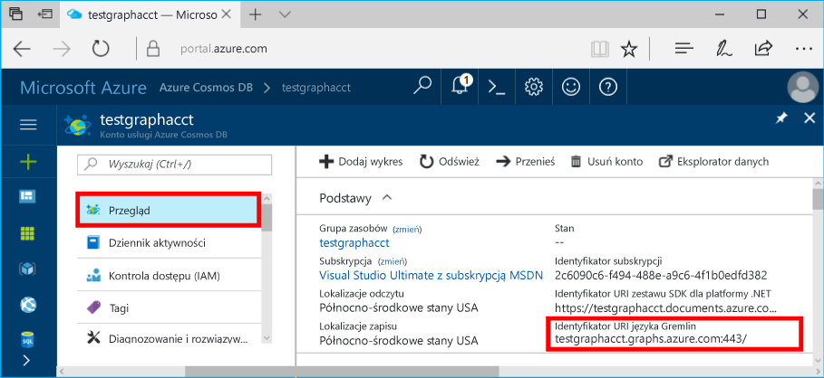

# <a name="azure-cosmos-db-create-query-and-traverse-a-graph-in-the-gremlin-console"></a><span data-ttu-id="df1a8-103">Azure Cosmos DB: Tworzenie elementów, wykonywanie zapytań i przechodzenie grafu w konsoli Gremlin</span><span class="sxs-lookup"><span data-stu-id="df1a8-103">Azure Cosmos DB: Create, query, and traverse a graph in the Gremlin console</span></span>

<span data-ttu-id="df1a8-104">Azure Cosmos DB to rozproszona globalnie wielomodelowa usługa bazy danych firmy Microsoft.</span><span class="sxs-lookup"><span data-stu-id="df1a8-104">Azure Cosmos DB is Microsoft’s globally distributed multi-model database service.</span></span> <span data-ttu-id="df1a8-105">Dzięki wykorzystaniu dystrybucji globalnej i możliwości skalowania poziomego opartego na usłudze Azure Cosmos DB, można szybko tworzyć i za pomocą zapytań badać bazy danych dokumentów, par klucz/wartość i grafów.</span><span class="sxs-lookup"><span data-stu-id="df1a8-105">You can quickly create and query document, key/value, and graph databases, all of which benefit from the global distribution and horizontal scale capabilities at the core of Azure Cosmos DB.</span></span> 

<span data-ttu-id="df1a8-106">Ten przewodnik Szybki start przedstawia sposób tworzenia konta usługi Azure Cosmos DB, bazy danych i grafu (kontenera) przy użyciu witryny Azure Portal oraz korzystania z [konsoli Gremlin](https://tinkerpop.apache.org/docs/current/reference/#gremlin-console) z platformy [Apache TinkerPop](http://tinkerpop.apache.org) do pracy z danymi interfejsu API programu Graph (wersja zapoznawcza).</span><span class="sxs-lookup"><span data-stu-id="df1a8-106">This quick start demonstrates how to create an Azure Cosmos DB account, database, and graph (container) using the Azure portal and then use the [Gremlin Console](https://tinkerpop.apache.org/docs/current/reference/#gremlin-console) from  [Apache TinkerPop](http://tinkerpop.apache.org) to work with Graph API (preview) data.</span></span> <span data-ttu-id="df1a8-107">W tym samouczku utworzysz wierzchołki i krawędzie oraz wykonasz względem nich zapytania, zaktualizujesz właściwość wierzchołka, przejdziesz graf i usuniesz wierzchołek.</span><span class="sxs-lookup"><span data-stu-id="df1a8-107">In this tutorial, you create and query vertices and edges, updating a vertex property, query vertices, traverse the graph, and drop a vertex.</span></span>


<span data-ttu-id="df1a8-109">Konsola Gremlin jest oparta na języku Groovy/Java i działa w systemach Linux, Mac i Windows.</span><span class="sxs-lookup"><span data-stu-id="df1a8-109">The Gremlin console is Groovy/Java based and runs on Linux, Mac, and Windows.</span></span> <span data-ttu-id="df1a8-110">Możesz ją pobrać z [witryny Apache TinkerPop](https://www.apache.org/dyn/closer.lua/tinkerpop/3.2.5/apache-tinkerpop-gremlin-console-3.2.5-bin.zip).</span><span class="sxs-lookup"><span data-stu-id="df1a8-110">You can download it from the [Apache TinkerPop site](https://www.apache.org/dyn/closer.lua/tinkerpop/3.2.5/apache-tinkerpop-gremlin-console-3.2.5-bin.zip).</span></span>

## <a name="prerequisites"></a><span data-ttu-id="df1a8-111">Wymagania wstępne</span><span class="sxs-lookup"><span data-stu-id="df1a8-111">Prerequisites</span></span>

<span data-ttu-id="df1a8-112">Musisz dysponować subskrypcją platformy Azure, aby utworzyć konto usługi Azure Cosmos DB na potrzeby tego przewodnika Szybki start.</span><span class="sxs-lookup"><span data-stu-id="df1a8-112">You need to have an Azure subscription to create an Azure Cosmos DB account for this quickstart.</span></span>

[!INCLUDE [quickstarts-free-trial-note](../../includes/quickstarts-free-trial-note.md)]

<span data-ttu-id="df1a8-113">Należy również zainstalować [konsolę Gremlin](http://tinkerpop.apache.org/).</span><span class="sxs-lookup"><span data-stu-id="df1a8-113">You also need to install the [Gremlin Console](http://tinkerpop.apache.org/).</span></span> <span data-ttu-id="df1a8-114">Użyj wersji 3.2.5 lub nowszej.</span><span class="sxs-lookup"><span data-stu-id="df1a8-114">Use version 3.2.5 or above.</span></span>

## <a name="create-a-database-account"></a><span data-ttu-id="df1a8-115">Tworzenie konta bazy danych</span><span class="sxs-lookup"><span data-stu-id="df1a8-115">Create a database account</span></span>

[!INCLUDE [cosmos-db-create-dbaccount-graph](../../includes/cosmos-db-create-dbaccount-graph.md)]

## <a name="add-a-graph"></a><span data-ttu-id="df1a8-116">Dodawanie grafu</span><span class="sxs-lookup"><span data-stu-id="df1a8-116">Add a graph</span></span>

[!INCLUDE [cosmos-db-create-graph](../../includes/cosmos-db-create-graph.md)]

## <span data-ttu-id="df1a8-117"><a id="ConnectAppService"></a>Łączenie z usługą aplikacji</span><span class="sxs-lookup"><span data-stu-id="df1a8-117"><a id="ConnectAppService"></a>Connect to your app service</span></span>
1. <span data-ttu-id="df1a8-118">Przed uruchomieniem konsoli Gremlin utwórz lub zmodyfikuj plik konfiguracji remote-secure.yaml w katalogu apache-tinkerpop-gremlin-console-3.2.5/conf.</span><span class="sxs-lookup"><span data-stu-id="df1a8-118">Before starting the Gremlin Console, create or modify the remote-secure.yaml configuration file in the apache-tinkerpop-gremlin-console-3.2.5/conf directory.</span></span>
2. <span data-ttu-id="df1a8-119">Wypełnij ustawienia konfiguracji *host*, *port*, *username*, *password*, *connectionPool* i *serializer*:</span><span class="sxs-lookup"><span data-stu-id="df1a8-119">Fill in your *host*, *port*, *username*, *password*, *connectionPool*, and *serializer* configurations:</span></span>

    <span data-ttu-id="df1a8-120">Ustawienie</span><span class="sxs-lookup"><span data-stu-id="df1a8-120">Setting</span></span>|<span data-ttu-id="df1a8-121">Sugerowana wartość</span><span class="sxs-lookup"><span data-stu-id="df1a8-121">Suggested value</span></span>|<span data-ttu-id="df1a8-122">Opis</span><span class="sxs-lookup"><span data-stu-id="df1a8-122">Description</span></span>
    ---|---|---
    <span data-ttu-id="df1a8-123">hosty</span><span class="sxs-lookup"><span data-stu-id="df1a8-123">hosts</span></span>|<span data-ttu-id="df1a8-124">[***.graphs.azure.com]</span><span class="sxs-lookup"><span data-stu-id="df1a8-124">[***.graphs.azure.com]</span></span>|<span data-ttu-id="df1a8-125">Zobacz poniższy zrzut ekranu.</span><span class="sxs-lookup"><span data-stu-id="df1a8-125">See screenshot below.</span></span> <span data-ttu-id="df1a8-126">Jest to wartość identyfikatora URI Gremlin na stronie Przegląd w witrynie Azure Portal w nawiasach kwadratowych z usuniętym fragmentem końcowym :443/.</span><span class="sxs-lookup"><span data-stu-id="df1a8-126">This is the Gremlin URI value on the Overview page of the Azure portal, in square brackets, with the trailing :443/ removed.</span></span><br><br><span data-ttu-id="df1a8-127">Tę wartość można również pobrać z karty Klucze, używając wartości identyfikatora URI po usunięciu ciągu https://, zmianie dokumentów na grafy i usunięciu fragmentu końcowego :443/.</span><span class="sxs-lookup"><span data-stu-id="df1a8-127">This value can also be retrieved from the Keys tab, using the URI value by removing https://, changing documents to graphs, and removing the trailing :443/.</span></span>
    <span data-ttu-id="df1a8-128">port</span><span class="sxs-lookup"><span data-stu-id="df1a8-128">port</span></span>|<span data-ttu-id="df1a8-129">443</span><span class="sxs-lookup"><span data-stu-id="df1a8-129">443</span></span>|<span data-ttu-id="df1a8-130">Ustaw wartość 443.</span><span class="sxs-lookup"><span data-stu-id="df1a8-130">Set to 443.</span></span>
    <span data-ttu-id="df1a8-131">nazwa użytkownika</span><span class="sxs-lookup"><span data-stu-id="df1a8-131">username</span></span>|<span data-ttu-id="df1a8-132">*Twoja nazwa użytkownika*</span><span class="sxs-lookup"><span data-stu-id="df1a8-132">*Your username*</span></span>|<span data-ttu-id="df1a8-133">Zasób w postaci `/dbs/<db>/colls/<coll>`, gdzie `<db>` jest nazwą bazy danych, a `<coll>` oznacza nazwę kolekcji.</span><span class="sxs-lookup"><span data-stu-id="df1a8-133">The resource of the form `/dbs/<db>/colls/<coll>` where `<db>` is your database name and `<coll>` is your collection name.</span></span>
    <span data-ttu-id="df1a8-134">hasło</span><span class="sxs-lookup"><span data-stu-id="df1a8-134">password</span></span>|<span data-ttu-id="df1a8-135">*Twój klucz podstawowy*</span><span class="sxs-lookup"><span data-stu-id="df1a8-135">*Your primary key*</span></span>| <span data-ttu-id="df1a8-136">Zobacz drugi zrzut ekranu poniżej.</span><span class="sxs-lookup"><span data-stu-id="df1a8-136">See second screenshot below.</span></span> <span data-ttu-id="df1a8-137">To jest klucz podstawowy, który można pobrać ze strony Klucze w witrynie Azure Portal, z pola Klucz podstawowy.</span><span class="sxs-lookup"><span data-stu-id="df1a8-137">This is your primary key, which you can retrieve from the Keys page of the Azure portal, in the Primary Key box.</span></span> <span data-ttu-id="df1a8-138">Aby skopiować wartość, użyj przycisku kopiowania po lewej stronie pola.</span><span class="sxs-lookup"><span data-stu-id="df1a8-138">Use the copy button on the left side of the box to copy the value.</span></span>
    <span data-ttu-id="df1a8-139">connectionPool</span><span class="sxs-lookup"><span data-stu-id="df1a8-139">connectionPool</span></span>|<span data-ttu-id="df1a8-140">{enableSsl: true}</span><span class="sxs-lookup"><span data-stu-id="df1a8-140">{enableSsl: true}</span></span>|<span data-ttu-id="df1a8-141">Ustawienie puli połączeń protokołu SSL.</span><span class="sxs-lookup"><span data-stu-id="df1a8-141">Your connection pool setting for SSL.</span></span>
    <span data-ttu-id="df1a8-142">serializer</span><span class="sxs-lookup"><span data-stu-id="df1a8-142">serializer</span></span>|<span data-ttu-id="df1a8-143">{ className: org.apache.tinkerpop.gremlin.</span><span class="sxs-lookup"><span data-stu-id="df1a8-143">{ className: org.apache.tinkerpop.gremlin.</span></span><br><span data-ttu-id="df1a8-144">driver.ser.GraphSONMessageSerializerV1d0,</span><span class="sxs-lookup"><span data-stu-id="df1a8-144">driver.ser.GraphSONMessageSerializerV1d0,</span></span><br> <span data-ttu-id="df1a8-145">config: { serializeResultToString: true }}</span><span class="sxs-lookup"><span data-stu-id="df1a8-145">config: { serializeResultToString: true }}</span></span>|<span data-ttu-id="df1a8-146">Ustaw tę wartość i usuń wszystkie podziały wiersza `\n` podczas wklejania w wartości.</span><span class="sxs-lookup"><span data-stu-id="df1a8-146">Set to this value and delete any `\n` line breaks when pasting in the value.</span></span>

    <span data-ttu-id="df1a8-147">Jako wartość hostów skopiuj wartość **Identyfikator URI Gremlin** ze strony **Przegląd**: </span><span class="sxs-lookup"><span data-stu-id="df1a8-147">For the hosts value, copy the **Gremlin URI** value from the **Overview** page: </span></span>

    <span data-ttu-id="df1a8-148">Jako wartość hasła skopiuj **Klucz podstawowy** ze strony **Klucze**: </span><span class="sxs-lookup"><span data-stu-id="df1a8-148">For the password value, copy the **Primary key** from the **Keys** page: </span></span>


3. <span data-ttu-id="df1a8-149">W terminalu uruchom `bin/gremlin.bat` lub `bin/gremlin.sh`, aby uruchomić [Konsolę Gremlin](http://tinkerpop.apache.org/docs/3.2.5/tutorials/getting-started/).</span><span class="sxs-lookup"><span data-stu-id="df1a8-149">In your terminal, run `bin/gremlin.bat` or `bin/gremlin.sh` to start the [Gremlin Console](http://tinkerpop.apache.org/docs/3.2.5/tutorials/getting-started/).</span></span>
4. <span data-ttu-id="df1a8-150">W terminalu uruchom `:remote connect tinkerpop.server conf/remote-secure.yaml` w celu nawiązania połączenia z usługą aplikacji.</span><span class="sxs-lookup"><span data-stu-id="df1a8-150">In your terminal, run `:remote connect tinkerpop.server conf/remote-secure.yaml` to connect to your app service.</span></span>

    > [!TIP]
    > <span data-ttu-id="df1a8-151">Jeśli zostanie wyświetlony błąd `No appenders could be found for logger`, upewnij się, że zaktualizowano wartość serializatora w pliku remote-secure.yaml, zgodnie z opisem w kroku 2.</span><span class="sxs-lookup"><span data-stu-id="df1a8-151">If you receive the error `No appenders could be found for logger` ensure that you updated the serializer value in the remote-secure.yaml file as described in step 2.</span></span> 

<span data-ttu-id="df1a8-152">Wspaniale!</span><span class="sxs-lookup"><span data-stu-id="df1a8-152">Great!</span></span> <span data-ttu-id="df1a8-153">Teraz, po zakończeniu konfigurowania, zacznijmy uruchamianie poleceń konsoli.</span><span class="sxs-lookup"><span data-stu-id="df1a8-153">Now that we finished the setup, let's start running some console commands.</span></span>

<span data-ttu-id="df1a8-154">Wypróbujmy proste polecenie count().</span><span class="sxs-lookup"><span data-stu-id="df1a8-154">Let's try a simple count() command.</span></span> <span data-ttu-id="df1a8-155">Wpisz następujący tekst w wierszu polecenia konsoli:</span><span class="sxs-lookup"><span data-stu-id="df1a8-155">Type the following into the console at the prompt:</span></span>
```
:> g.V().count()
```

> [!TIP]
> <span data-ttu-id="df1a8-156">Warto zauważyć prefiks `:>` poprzedzający tekst `g.V().count()`.</span><span class="sxs-lookup"><span data-stu-id="df1a8-156">Notice the `:>` that precedes the `g.V().count()` text?</span></span> 
>
> <span data-ttu-id="df1a8-157">Jest to część polecenia, które należy wpisać.</span><span class="sxs-lookup"><span data-stu-id="df1a8-157">This is part of the command you need to type.</span></span> <span data-ttu-id="df1a8-158">Jest to ważne, gdy konsola Gremlin jest używana z usługą Azure Cosmos DB.</span><span class="sxs-lookup"><span data-stu-id="df1a8-158">It is important when using the Gremlin console, with Azure Cosmos DB.</span></span>  
>
> <span data-ttu-id="df1a8-159">Pominięcie tego prefiksu `:>` oznacza, że konsola ma wykonać polecenia lokalnie, często względem grafu w pamięci.</span><span class="sxs-lookup"><span data-stu-id="df1a8-159">Omitting this `:>` prefix instructs the console to execute the command locally, often against an in-memory graph.</span></span>
> <span data-ttu-id="df1a8-160">Użycie tego prefiksu `:>` powoduje wykonanie polecenia zdalnego przez konsolę, w tym przypadku względem usługi Cosmos DB (emulatora localhost lub wystąpienia > Azure).</span><span class="sxs-lookup"><span data-stu-id="df1a8-160">Using this `:>` tells the console to execute a remote command, in this case against Cosmos DB (either the localhost emulator, or an > Azure instance).</span></span>


## <a name="create-vertices-and-edges"></a><span data-ttu-id="df1a8-161">Tworzenie wierzchołków i krawędzi</span><span class="sxs-lookup"><span data-stu-id="df1a8-161">Create vertices and edges</span></span>

<span data-ttu-id="df1a8-162">Zacznijmy od dodania wierzchołków dla pięciu osób: *Thomas*, *Mary Kay*, *Robin*, *Ben* i *Jack*.</span><span class="sxs-lookup"><span data-stu-id="df1a8-162">Let's begin by adding five person vertices for *Thomas*, *Mary Kay*, *Robin*, *Ben*, and *Jack*.</span></span>

<span data-ttu-id="df1a8-163">Dane wejściowe (Thomas):</span><span class="sxs-lookup"><span data-stu-id="df1a8-163">Input (Thomas):</span></span>

```
:> g.addV('person').property('firstName', 'Thomas').property('lastName', 'Andersen').property('age', 44).property('userid', 1)
```

<span data-ttu-id="df1a8-164">Dane wyjściowe:</span><span class="sxs-lookup"><span data-stu-id="df1a8-164">Output:</span></span>

```
==>[id:796cdccc-2acd-4e58-a324-91d6f6f5ed6d,label:person,type:vertex,properties:[firstName:[[id:f02a749f-b67c-4016-850e-910242d68953,value:Thomas]],lastName:[[id:f5fa3126-8818-4fda-88b0-9bb55145ce5c,value:Andersen]],age:[[id:f6390f9c-e563-433e-acbf-25627628016e,value:44]],userid:[[id:796cdccc-2acd-4e58-a324-91d6f6f5ed6d|userid,value:1]]]]
```
<span data-ttu-id="df1a8-165">Dane wejściowe (Mary Kay):</span><span class="sxs-lookup"><span data-stu-id="df1a8-165">Input (Mary Kay):</span></span>

```
:> g.addV('person').property('firstName', 'Mary Kay').property('lastName', 'Andersen').property('age', 39).property('userid', 2)

```

<span data-ttu-id="df1a8-166">Dane wyjściowe:</span><span class="sxs-lookup"><span data-stu-id="df1a8-166">Output:</span></span>

```
==>[id:0ac9be25-a476-4a30-8da8-e79f0119ea5e,label:person,type:vertex,properties:[firstName:[[id:ea0604f8-14ee-4513-a48a-1734a1f28dc0,value:Mary Kay]],lastName:[[id:86d3bba5-fd60-4856-9396-c195ef7d7f4b,value:Andersen]],age:[[id:bc81b78d-30c4-4e03-8f40-50f72eb5f6da,value:39]],userid:[[id:0ac9be25-a476-4a30-8da8-e79f0119ea5e|userid,value:2]]]]

```

<span data-ttu-id="df1a8-167">Dane wejściowe (Robin):</span><span class="sxs-lookup"><span data-stu-id="df1a8-167">Input (Robin):</span></span>

```
:> g.addV('person').property('firstName', 'Robin').property('lastName', 'Wakefield').property('userid', 3)
```

<span data-ttu-id="df1a8-168">Dane wyjściowe:</span><span class="sxs-lookup"><span data-stu-id="df1a8-168">Output:</span></span>

```
==>[id:8dc14d6a-8683-4a54-8d74-7eef1fb43a3e,label:person,type:vertex,properties:[firstName:[[id:ec65f078-7a43-4cbe-bc06-e50f2640dc4e,value:Robin]],lastName:[[id:a3937d07-0e88-45d3-a442-26fcdfb042ce,value:Wakefield]],userid:[[id:8dc14d6a-8683-4a54-8d74-7eef1fb43a3e|userid,value:3]]]]
```

<span data-ttu-id="df1a8-169">Dane wejściowe (Ben):</span><span class="sxs-lookup"><span data-stu-id="df1a8-169">Input (Ben):</span></span>

```
:> g.addV('person').property('firstName', 'Ben').property('lastName', 'Miller').property('userid', 4)

```

<span data-ttu-id="df1a8-170">Dane wyjściowe:</span><span class="sxs-lookup"><span data-stu-id="df1a8-170">Output:</span></span>

```
==>[id:ee86b670-4d24-4966-9a39-30529284b66f,label:person,type:vertex,properties:[firstName:[[id:a632469b-30fc-4157-840c-b80260871e9a,value:Ben]],lastName:[[id:4a08d307-0719-47c6-84ae-1b0b06630928,value:Miller]],userid:[[id:ee86b670-4d24-4966-9a39-30529284b66f|userid,value:4]]]]
```

<span data-ttu-id="df1a8-171">Dane wejściowe (Jack):</span><span class="sxs-lookup"><span data-stu-id="df1a8-171">Input (Jack):</span></span>

```
:> g.addV('person').property('firstName', 'Jack').property('lastName', 'Connor').property('userid', 5)
```

<span data-ttu-id="df1a8-172">Dane wyjściowe:</span><span class="sxs-lookup"><span data-stu-id="df1a8-172">Output:</span></span>

```
==>[id:4c835f2a-ea5b-43bb-9b6b-215488ad8469,label:person,type:vertex,properties:[firstName:[[id:4250824e-4b72-417f-af98-8034aa15559f,value:Jack]],lastName:[[id:44c1d5e1-a831-480a-bf94-5167d133549e,value:Connor]],userid:[[id:4c835f2a-ea5b-43bb-9b6b-215488ad8469|userid,value:5]]]]
```


<span data-ttu-id="df1a8-173">Następnie dodajmy krawędzie dla relacji między tymi osobami.</span><span class="sxs-lookup"><span data-stu-id="df1a8-173">Next, let's add edges for relationships between our people.</span></span>

<span data-ttu-id="df1a8-174">Dane wejściowe (Thomas -> Mary Kay):</span><span class="sxs-lookup"><span data-stu-id="df1a8-174">Input (Thomas -> Mary Kay):</span></span>

```
:> g.V().hasLabel('person').has('firstName', 'Thomas').addE('knows').to(g.V().hasLabel('person').has('firstName', 'Mary Kay'))
```

<span data-ttu-id="df1a8-175">Dane wyjściowe:</span><span class="sxs-lookup"><span data-stu-id="df1a8-175">Output:</span></span>

```
==>[id:c12bf9fb-96a1-4cb7-a3f8-431e196e702f,label:knows,type:edge,inVLabel:person,outVLabel:person,inV:0d1fa428-780c-49a5-bd3a-a68d96391d5c,outV:1ce821c6-aa3d-4170-a0b7-d14d2a4d18c3]
```

<span data-ttu-id="df1a8-176">Dane wejściowe (Thomas -> Robin):</span><span class="sxs-lookup"><span data-stu-id="df1a8-176">Input (Thomas -> Robin):</span></span>

```
:> g.V().hasLabel('person').has('firstName', 'Thomas').addE('knows').to(g.V().hasLabel('person').has('firstName', 'Robin'))
```

<span data-ttu-id="df1a8-177">Dane wyjściowe:</span><span class="sxs-lookup"><span data-stu-id="df1a8-177">Output:</span></span>

```
==>[id:58319bdd-1d3e-4f17-a106-0ddf18719d15,label:knows,type:edge,inVLabel:person,outVLabel:person,inV:3e324073-ccfc-4ae1-8675-d450858ca116,outV:1ce821c6-aa3d-4170-a0b7-d14d2a4d18c3]
```

<span data-ttu-id="df1a8-178">Dane wejściowe (Robin -> Ben):</span><span class="sxs-lookup"><span data-stu-id="df1a8-178">Input (Robin -> Ben):</span></span>

```
:> g.V().hasLabel('person').has('firstName', 'Robin').addE('knows').to(g.V().hasLabel('person').has('firstName', 'Ben'))
```

<span data-ttu-id="df1a8-179">Dane wyjściowe:</span><span class="sxs-lookup"><span data-stu-id="df1a8-179">Output:</span></span>

```
==>[id:889c4d3c-549e-4d35-bc21-a3d1bfa11e00,label:knows,type:edge,inVLabel:person,outVLabel:person,inV:40fd641d-546e-412a-abcc-58fe53891aab,outV:3e324073-ccfc-4ae1-8675-d450858ca116]
```

## <a name="update-a-vertex"></a><span data-ttu-id="df1a8-180">Aktualizowanie wierzchołka</span><span class="sxs-lookup"><span data-stu-id="df1a8-180">Update a vertex</span></span>

<span data-ttu-id="df1a8-181">Zaktualizujmy wierzchołek *Thomas*, podając nowy wiek: *45*.</span><span class="sxs-lookup"><span data-stu-id="df1a8-181">Let's update the *Thomas* vertex with a new age of *45*.</span></span>

<span data-ttu-id="df1a8-182">Dane wejściowe:</span><span class="sxs-lookup"><span data-stu-id="df1a8-182">Input:</span></span>
```
:> g.V().hasLabel('person').has('firstName', 'Thomas').property('age', 45)
```
<span data-ttu-id="df1a8-183">Dane wyjściowe:</span><span class="sxs-lookup"><span data-stu-id="df1a8-183">Output:</span></span>

```
==>[id:ae36f938-210e-445a-92df-519f2b64c8ec,label:person,type:vertex,properties:[firstName:[[id:872090b6-6a77-456a-9a55-a59141d4ebc2,value:Thomas]],lastName:[[id:7ee7a39a-a414-4127-89b4-870bc4ef99f3,value:Andersen]],age:[[id:a2a75d5a-ae70-4095-806d-a35abcbfe71d,value:45]]]]
```

## <a name="query-your-graph"></a><span data-ttu-id="df1a8-184">Wykonywanie zapytania względem grafu</span><span class="sxs-lookup"><span data-stu-id="df1a8-184">Query your graph</span></span>

<span data-ttu-id="df1a8-185">Teraz uruchommy różne zapytania względem grafu.</span><span class="sxs-lookup"><span data-stu-id="df1a8-185">Now, let's run a variety of queries against your graph.</span></span>

<span data-ttu-id="df1a8-186">Najpierw wypróbujmy zapytanie z filtrem, aby zwrócić tylko te osoby, które mają więcej niż 40 lat.</span><span class="sxs-lookup"><span data-stu-id="df1a8-186">First, let's try a query with a filter to return only people who are older than 40 years old.</span></span>

<span data-ttu-id="df1a8-187">Dane wejściowe (zapytanie filtru):</span><span class="sxs-lookup"><span data-stu-id="df1a8-187">Input (filter query):</span></span>

```
:> g.V().hasLabel('person').has('age', gt(40))
```

<span data-ttu-id="df1a8-188">Dane wyjściowe:</span><span class="sxs-lookup"><span data-stu-id="df1a8-188">Output:</span></span>

```
==>[id:ae36f938-210e-445a-92df-519f2b64c8ec,label:person,type:vertex,properties:[firstName:[[id:872090b6-6a77-456a-9a55-a59141d4ebc2,value:Thomas]],lastName:[[id:7ee7a39a-a414-4127-89b4-870bc4ef99f3,value:Andersen]],age:[[id:a2a75d5a-ae70-4095-806d-a35abcbfe71d,value:45]]]]
```

<span data-ttu-id="df1a8-189">Następnie wyświetlmy imiona osób, które mają więcej niż 40 lat.</span><span class="sxs-lookup"><span data-stu-id="df1a8-189">Next, let's project the first name for the people who are older than 40 years old.</span></span>

<span data-ttu-id="df1a8-190">Dane wejściowe (zapytanie filtru i projekcji):</span><span class="sxs-lookup"><span data-stu-id="df1a8-190">Input (filter + projection query):</span></span>

```
:> g.V().hasLabel('person').has('age', gt(40)).values('firstName')
```

<span data-ttu-id="df1a8-191">Dane wyjściowe:</span><span class="sxs-lookup"><span data-stu-id="df1a8-191">Output:</span></span>

```
==>Thomas
```

## <a name="traverse-your-graph"></a><span data-ttu-id="df1a8-192">Przechodzenie grafu</span><span class="sxs-lookup"><span data-stu-id="df1a8-192">Traverse your graph</span></span>

<span data-ttu-id="df1a8-193">Przejdźmy graf w celu zwrócenia wszystkich znajomych Thomasa.</span><span class="sxs-lookup"><span data-stu-id="df1a8-193">Let's traverse the graph to return all of Thomas's friends.</span></span>

<span data-ttu-id="df1a8-194">Dane wejściowe (znajomi Thomasa):</span><span class="sxs-lookup"><span data-stu-id="df1a8-194">Input (friends of Thomas):</span></span>

```
:> g.V().hasLabel('person').has('firstName', 'Thomas').outE('knows').inV().hasLabel('person')
```

<span data-ttu-id="df1a8-195">Dane wyjściowe:</span><span class="sxs-lookup"><span data-stu-id="df1a8-195">Output:</span></span> 

```
==>[id:f04bc00b-cb56-46c4-a3bb-a5870c42f7ff,label:person,type:vertex,properties:[firstName:[[id:14feedec-b070-444e-b544-62be15c7167c,value:Mary Kay]],lastName:[[id:107ab421-7208-45d4-b969-bbc54481992a,value:Andersen]],age:[[id:4b08d6e4-58f5-45df-8e69-6b790b692e0a,value:39]]]]
==>[id:91605c63-4988-4b60-9a30-5144719ae326,label:person,type:vertex,properties:[firstName:[[id:f760e0e6-652a-481a-92b0-1767d9bf372e,value:Robin]],lastName:[[id:352a4caa-bad6-47e3-a7dc-90ff342cf870,value:Wakefield]]]]
```

<span data-ttu-id="df1a8-196">Następnie uzyskajmy kolejną warstwę wierzchołków.</span><span class="sxs-lookup"><span data-stu-id="df1a8-196">Next, let's get the next layer of vertices.</span></span> <span data-ttu-id="df1a8-197">Przejdźmy graf w celu zwrócenia wszystkich osób będących znajomymi znajomych Thomasa.</span><span class="sxs-lookup"><span data-stu-id="df1a8-197">Traverse the graph to return all the friends of Thomas's friends.</span></span>

<span data-ttu-id="df1a8-198">Dane wejściowe (znajomi znajomych Thomasa):</span><span class="sxs-lookup"><span data-stu-id="df1a8-198">Input (friends of friends of Thomas):</span></span>

```
:> g.V().hasLabel('person').has('firstName', 'Thomas').outE('knows').inV().hasLabel('person').outE('knows').inV().hasLabel('person')
```
<span data-ttu-id="df1a8-199">Dane wyjściowe:</span><span class="sxs-lookup"><span data-stu-id="df1a8-199">Output:</span></span>

```
==>[id:a801a0cb-ee85-44ee-a502-271685ef212e,label:person,type:vertex,properties:[firstName:[[id:b9489902-d29a-4673-8c09-c2b3fe7f8b94,value:Ben]],lastName:[[id:e084f933-9a4b-4dbc-8273-f0171265cf1d,value:Miller]]]]
```

## <a name="drop-a-vertex"></a><span data-ttu-id="df1a8-200">Usuwanie wierzchołka</span><span class="sxs-lookup"><span data-stu-id="df1a8-200">Drop a vertex</span></span>

<span data-ttu-id="df1a8-201">Usuńmy teraz wierzchołek z bazy danych grafu.</span><span class="sxs-lookup"><span data-stu-id="df1a8-201">Let's now delete a vertex from the graph database.</span></span>

<span data-ttu-id="df1a8-202">Dane wejściowe (usunięcie wierzchołka Jacka):</span><span class="sxs-lookup"><span data-stu-id="df1a8-202">Input (drop Jack vertex):</span></span>

```
:> g.V().hasLabel('person').has('firstName', 'Jack').drop()
```

## <a name="clear-your-graph"></a><span data-ttu-id="df1a8-203">Czyszczenie grafu</span><span class="sxs-lookup"><span data-stu-id="df1a8-203">Clear your graph</span></span>

<span data-ttu-id="df1a8-204">Na koniec usuńmy z bazy danych wszystkie wierzchołki i krawędzie.</span><span class="sxs-lookup"><span data-stu-id="df1a8-204">Finally, let's clear the database of all vertices and edges.</span></span>

<span data-ttu-id="df1a8-205">Dane wejściowe:</span><span class="sxs-lookup"><span data-stu-id="df1a8-205">Input:</span></span>

```
:> g.E().drop()
:> g.V().drop()
```

<span data-ttu-id="df1a8-206">Gratulacje!</span><span class="sxs-lookup"><span data-stu-id="df1a8-206">Congratulations!</span></span> <span data-ttu-id="df1a8-207">Pomyślnie ukończono samouczek interfejsu API programu Graph w usłudze Azure Cosmos DB!</span><span class="sxs-lookup"><span data-stu-id="df1a8-207">You've completed this Azure Cosmos DB: Graph API tutorial!</span></span>

## <a name="review-slas-in-the-azure-portal"></a><span data-ttu-id="df1a8-208">Przeglądanie umów SLA w witrynie Azure Portal</span><span class="sxs-lookup"><span data-stu-id="df1a8-208">Review SLAs in the Azure portal</span></span>

[!INCLUDE [cosmosdb-tutorial-review-slas](../../includes/cosmos-db-tutorial-review-slas.md)]

## <a name="clean-up-resources"></a><span data-ttu-id="df1a8-209">Oczyszczanie zasobów</span><span class="sxs-lookup"><span data-stu-id="df1a8-209">Clean up resources</span></span>

<span data-ttu-id="df1a8-210">Jeśli nie zamierzasz w przyszłości korzystać z tej aplikacji, wykonaj następujące czynności, aby usunąć wszystkie zasoby utworzone w witrynie Azure Portal w ramach tego przewodnika Szybki start:</span><span class="sxs-lookup"><span data-stu-id="df1a8-210">If you're not going to continue to use this app, delete all resources created by this quickstart in the Azure portal with the following steps:</span></span>  

1. <span data-ttu-id="df1a8-211">W menu znajdującym się po lewej stronie w witrynie Azure Portal kliknij pozycję **Grupy zasobów**, a następnie kliknij nazwę utworzonego zasobu.</span><span class="sxs-lookup"><span data-stu-id="df1a8-211">From the left-hand menu in the Azure portal, click **Resource groups** and then click the name of the resource you created.</span></span> 
2. <span data-ttu-id="df1a8-212">Na stronie grupy zasobów kliknij pozycję **Usuń**, wpisz w polu tekstowym nazwę zasobu do usunięcia, a następnie kliknij pozycję **Usuń**.</span><span class="sxs-lookup"><span data-stu-id="df1a8-212">On your resource group page, click **Delete**, type the name of the resource to delete in the text box, and then click **Delete**.</span></span>

## <a name="next-steps"></a><span data-ttu-id="df1a8-213">Następne kroki</span><span class="sxs-lookup"><span data-stu-id="df1a8-213">Next steps</span></span>

<span data-ttu-id="df1a8-214">W tym przewodniku Szybki start wyjaśniono, jak utworzyć konto usługi Azure Cosmos DB, jak utworzyć graf za pomocą Eksploratora danych oraz jak utworzyć wierzchołki i krawędzie, a także jak przejść graf za pomocą konsoli Gremlin.</span><span class="sxs-lookup"><span data-stu-id="df1a8-214">In this quickstart, you've learned how to create an Azure Cosmos DB account, create a graph using the Data Explorer, create vertices and edges, and traverse your graph using the Gremlin console.</span></span> <span data-ttu-id="df1a8-215">Teraz możesz tworzyć bardziej złożone zapytania i implementować zaawansowaną logikę przechodzenia grafu za pomocą języka Gremlin.</span><span class="sxs-lookup"><span data-stu-id="df1a8-215">You can now build more complex queries and implement powerful graph traversal logic using Gremlin.</span></span> 

> [!div class="nextstepaction"]
> [<span data-ttu-id="df1a8-216">Wykonywanie zapytań przy użyciu języka Gremlin</span><span class="sxs-lookup"><span data-stu-id="df1a8-216">Query using Gremlin</span></span>](tutorial-query-graph.md)
