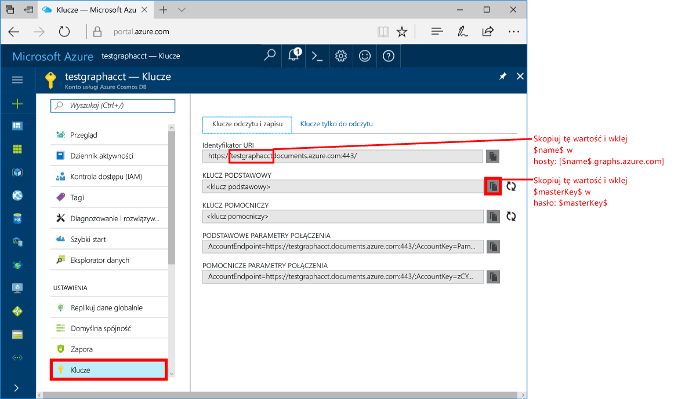
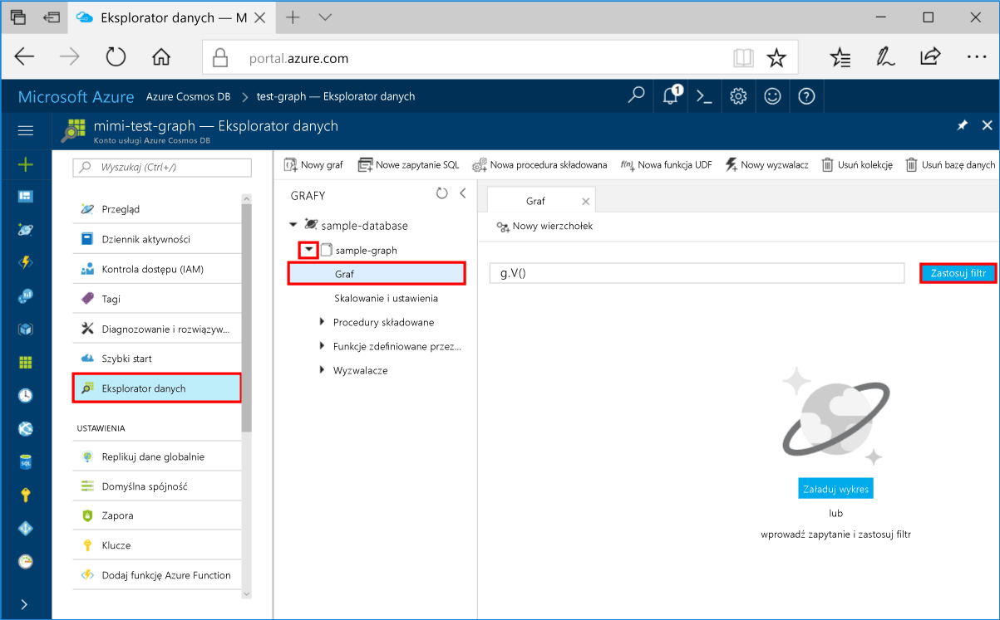
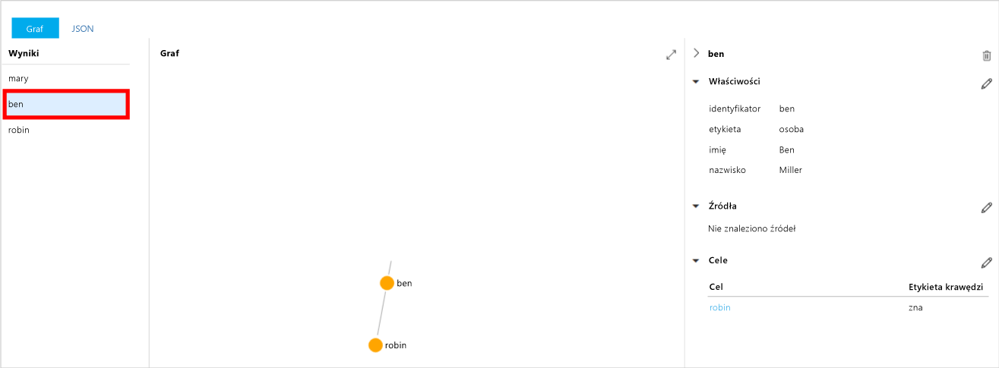
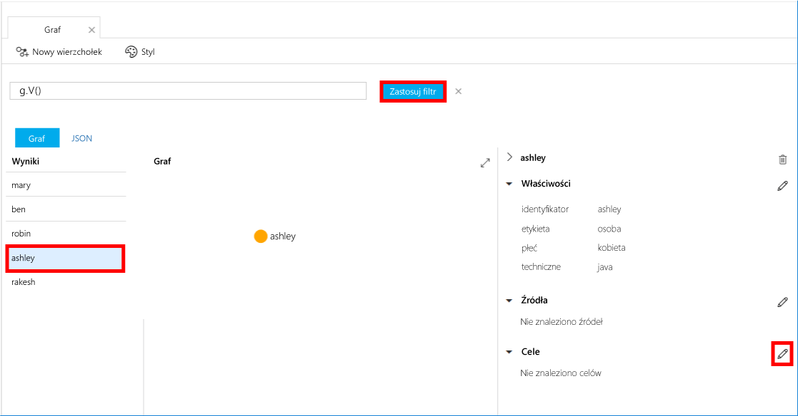
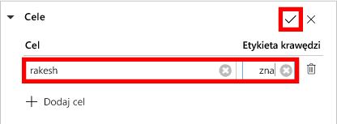
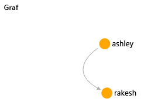

# <a name="azure-cosmos-db-create-a-graph-database-using-java-and-hello-azure-portal"></a>Azure DB rozwiązania Cosmos: Tworzenie bazy danych wykresu przy użyciu języka Java i hello portalu Azure

Azure Cosmos DB to rozproszona globalnie wielomodelowa usługa bazy danych firmy Microsoft. Można szybko utworzyć i wyszukiwać dokumentu, klucza i wartości i wykres baz danych, które korzystają z dystrybucji globalne hello i możliwości skalowanie w poziomie na podstawowe hello Azure DB rozwiązania Cosmos. 

Ta opcja szybkiego startu tworzy wykres bazy danych przy użyciu hello narzędzi portalu platformy Azure dla bazy danych Azure rozwiązania Cosmos. Ta opcja szybkiego startu przedstawiono również sposób tooquickly Utwórz aplikację konsoli języka Java przy użyciu bazy danych wykresu przy użyciu hello OSS [Gremlin Java](https://mvnrepository.com/artifact/org.apache.tinkerpop/gremlin-driver) sterownika. instrukcje Hello tego przewodnika Szybki Start można wykonać w dowolnym systemie operacyjnym, który jest w stanie uruchomić oprogramowanie Java. Ta opcja szybkiego startu zaznajomić z tworzenia i modyfikowania zasobów wykresu w hello interfejsu użytkownika lub programowo, nastąpi swoich preferencji. 

## <a name="prerequisites"></a>Wymagania wstępne

* [Zestaw Java Development Kit (JDK) 1.7+](http://www.oracle.com/technetwork/java/javase/downloads/jdk8-downloads-2133151.html)
    * Uruchom na Ubuntu, `apt-get install default-jdk` tooinstall hello JDK.
    * Jest zainstalowanym hello JDK czy tooset hello JAVA_HOME środowiska zmiennej toopoint toohello folder.
* [Pobierz](http://maven.apache.org/download.cgi) i [zainstaluj](http://maven.apache.org/install.html) archiwum binarne [Maven](http://maven.apache.org/)
    * Na Ubuntu, można uruchomić `apt-get install maven` tooinstall Maven.
* [Git](https://www.git-scm.com/)
    * Na Ubuntu, można uruchomić `sudo apt-get install git` tooinstall Git.

[!INCLUDE [quickstarts-free-trial-note](../../includes/quickstarts-free-trial-note.md)]

## <a name="create-a-database-account"></a>Tworzenie konta bazy danych

Przed utworzeniem bazy danych wykresu, konieczne jest toocreate Gremlin (wykres) konta bazy danych z bazy danych Azure rozwiązania Cosmos.

[!INCLUDE [cosmos-db-create-dbaccount-graph](../../includes/cosmos-db-create-dbaccount-graph.md)]

## <a name="add-a-graph"></a>Dodawanie grafu

Po wykonaniu użyć narzędzia Eksplorator danych hello w hello Azure toocreate portalu bazy danych wykresu. 

1. W portalu Azure, w menu nawigacji po lewej stronie powitania hello kliknij **Eksploratora danych (wersja zapoznawcza)**. 
2. W hello **Eksploratora danych (wersja zapoznawcza)** bloku, kliknij przycisk **nowy wykres**, a następnie wypełnij hello strony przy użyciu hello następujących informacji:

    

    Ustawienie|Sugerowana wartość|Opis
    ---|---|---
    Identyfikator bazy danych|sample-database|Identyfikator Hello nową bazę danych. Nazwy baz danych muszą zawierać od 1 do 255 znaków i nie mogą zawierać znaków `/ \ # ?` ani mieć spacji na końcu.
    Identyfikator grafu|sample-graph|Identyfikator Hello nowego wykresu. Wykres nazwy mają hello wymagania sam znak jako identyfikatory bazy danych.
    Pojemność magazynu| 10 GB|Pozostaw wartość domyślną hello. Jest to hello pojemności hello bazy danych.
    Przepływność|400 jednostek żądania|Pozostaw wartość domyślną hello. Można zwiększać przepływności hello później Chcąc tooreduce opóźnienia.
    Klucz partycji|Pozostaw puste|W celu hello tego przewodnika Szybki Start pozostaw puste hello klucza partycji.

3. Gdy formularz hello jest wypełniane, kliknij przycisk **OK**.

## <a name="clone-hello-sample-application"></a>Klonowanie hello przykładowej aplikacji

Teraz załóżmy sklonować aplikacji przez wykres z serwisu github, Ustaw ciąg połączenia hello i uruchom go. Zobacz, jak łatwo jest toowork z danymi programowo. 

1. Otwórz okno terminala git, np. git bash, i `cd` tooa katalog roboczy.  

2. Hello uruchom następujące polecenie tooclone hello próbki repozytorium. 

    ```bash
    git clone https://github.com/Azure-Samples/azure-cosmos-db-graph-java-getting-started.git
    ```

## <a name="review-hello-code"></a>Przejrzyj hello kodu

Upewnijmy szybki przegląd działania wykonywane w aplikacji hello. Otwórz hello `Program.java` plików z folderu \src\GetStarted hello i Znajdź następujące wiersze kodu. 

* Witaj Gremlin `Client` został zainicjowany z konfiguracji hello w `src/remote.yaml`.

    ```java
    cluster = Cluster.build(new File("src/remote.yaml")).create();
    ...
    client = cluster.connect();
    ```

* Serie kroków Gremlin są wykonywane przy użyciu hello `client.submit` metody.

    ```java
    ResultSet results = client.submit(gremlin);

    CompletableFuture<List<Result>> completableFutureResults = results.all();
    List<Result> resultList = completableFutureResults.get();

    for (Result result : resultList) {
        System.out.println(result.toString());
    }
    ```

## <a name="update-your-connection-string"></a>Aktualizowanie parametrów połączenia

1. Otwórz hello src/remote.yaml pliku. 

3. Wypełnij Twojej *hostów*, *username*, i *hasło* wartości hello src/remote.yaml pliku. pozostałe ustawienia hello Hello nie ma potrzeby toobe zmienione.

    Ustawienie|Sugerowana wartość|Opis
    ---|---|---
    Hosts|[***.graphs.azure.com]|Zobacz hello zrzut ekranu poniżej tej tabeli. Ta wartość jest wartością Gremlin URI hello na stronie Przegląd hello hello portalu Azure w nawiasach kwadratowych spacją hello: 443 / usunięty.<br><br>Tę wartość można również pobrać z karty klucze hello, przy użyciu wartości identyfikatora URI hello usuwanie https://, zmieniając toographs dokumentów i usuwanie końcowe hello: 443 /.
    Nazwa użytkownika|/dbs/sample-database/colls/sample-graph|Witaj zasobów formularza hello `/dbs/<db>/colls/<coll>` gdzie `<db>` oznacza nazwę istniejącej bazy danych i `<coll>` jest istniejącą nazwę kolekcji.
    Hasło|*Twój podstawowy klucz główny*|Zobacz drugi zrzut ekranu hello poniżej tej tabeli. Ta wartość jest klucz podstawowy, który można pobrać ze strony klucze hello hello portalu Azure, w polu klucza podstawowego hello. Skopiuj wartość hello za pomocą przycisku Kopiuj hello hello prawej strony pola hello.

    Dla wartości hostów hello, skopiuj hello **Gremlin URI** wartość z zakresu od hello **omówienie** strony. Jeśli jest pusty, zobacz instrukcje hello hello hostów wiersza w powyższej tabeli o tworzeniu hello Gremlin identyfikatora URI z bloku klucze hello hello.


    W przypadku hello wartość hasła, skopiuj hello **klucza podstawowego** z hello **klucze** bloku: 

## <a name="run-hello-console-app"></a>Uruchamianie aplikacji konsoli hello

1. W oknie terminala git hello `cd` toohello azure-cosmos-db-graph-java-getting-started folderu.

2. W oknie terminala git hello, wpisz `mvn package` tooinstall hello wymaganych pakietów języka Java.

3. W oknie terminala git hello, uruchom `mvn exec:java -D exec.mainClass=GetStarted.Program` w hello toostart okno terminalu aplikacji Java.

Okno terminalu Hello Wyświetla wierzchołków hello dodawany toohello wykresu. Po zakończeniu działania programu hello przełącznika wstecz toohello portalu Azure w przeglądarce internetowej. 

<a id="add-sample-data"></a>
## <a name="review-and-add-sample-data"></a>Przeglądanie i dodawanie przykładowych danych

Teraz można wrócić do poprzedniej strony tooData Explorer i zobacz wierzchołków hello dodawane wykres toohello i dodać dodatkowe dane punktów.

1. W Eksploratorze danych rozwiń hello **bazy danych przykładowych**/**wykres próbki**, kliknij przycisk **wykres**, a następnie kliknij przycisk **Zastosuj filtr**. 

   

2. W hello **wyniki** listy, zwróć uwagę, hello nowi użytkownicy dodawani toohello wykresu. Wybierz **ben** i zwróć uwagę, że został on podłączony toorobin. Można przenosić wierzchołków hello na powitania wykres Eksploratora, powiększać i pomniejszać i rozwiń rozmiar hello hello wykres explorer powierzchni. 

   

3. Dodajmy kilka nowy wykres toohello użytkowników przy użyciu hello Eksploratora danych. Kliknij przycisk hello **nowy wierzchołek** przycisk tooadd danych tooyour wykresu.

   

4. Wprowadź etykietę *osoby* wprowadź hello następujące klucze i wartości toocreate hello pierwszym wierzchołku hello wykresie. Zauważ, że możesz utworzyć unikatowe właściwości dla każdej osoby w grafie. Tylko hello identyfikator klucz jest wymagany.

    key|wartość|Uwagi
    ----|----|----
    id|ashley|Unikatowy identyfikator Hello hello wierzchołka. Jeśli nie określono identyfikatora, zostanie on wygenerowany.
    płeć|kobieta| 
    techniczne | java | 

    > [!NOTE]
    > W tym przewodniku Szybki start tworzymy kolekcję niepartycjonowaną. Jednak jeśli tworzysz kolekcję partycjonowaną, określając klucza partycji podczas tworzenia kolekcji hello, następnie należy klucza partycji hello tooinclude jako klucz w każdy wierzchołek nowe. 

5. Kliknij przycisk **OK**. Może być konieczne tooexpand Twojego toosee ekranu **OK** na powitania dolnej części ekranu hello.

6. Kliknij przycisk **Nowy wierzchołek** ponownie i dodaj kolejnego nowego użytkownika. Wprowadź etykietę *osoby* następnie wprowadź następujące hello kluczy i wartości:

    key|wartość|Uwagi
    ----|----|----
    id|rakesh|Unikatowy identyfikator Hello hello wierzchołka. Jeśli nie określono identyfikatora, zostanie on wygenerowany.
    płeć|mężczyzna| 
    szkoła|MIT| 

7. Kliknij przycisk **OK**. 

8. Kliknij przycisk **Zastosuj filtr** z domyślnymi hello `g.V()` filtru. Teraz Pokaż wszystkich użytkowników hello w hello **wyniki** listy. Dodaj więcej danych, program toolimit filtry wyników. Domyślnie korzysta z Eksploratora danych `g.V()` tooretrieve wszystkich wierzchołków wykres, ale można zmienić tego tooa różnych [zapytania wykres](tutorial-query-graph.md), takich jak `g.V().count()`, tooreturn liczbę wszystkich wierzchołków hello hello wykresu w formacie JSON.

9. Teraz możemy połączyć użytkowników rakesh i ashley. Upewnij się, **Monika** w wybranym hello **wyniki** listy, a następnie kliknij przycisk Edytuj hello obok zbyt**cele** w prawym dolnym. Może być konieczne toowiden Twojego hello toosee okna **właściwości** obszaru.

   

10. W hello **docelowej** wpisz *rakesh*w hello **etykiety krawędzi** wpisz *zna*, a następnie kliknij pole wyboru hello.

   

11. Teraz wybierz **rakesh** z listy wyników hello i zobacz, czy Monika i rakesh są połączone. 

   

    Można również użyć Eksploratora danych toocreate przechowywane procedury, funkcje UDF i logiki biznesowej po stronie serwera tooperform wyzwalaczy również jako przepływności skali. Eksplorator danych udostępnia wszystkie hello wbudowanych programowy dostęp do danych dostępne w hello interfejsów API, ale zapewnia łatwy dostęp do danych tooyour w hello portalu Azure.


## <a name="review-slas-in-hello-azure-portal"></a>Przejrzyj umowy SLA w hello portalu Azure

[!INCLUDE [cosmosdb-tutorial-review-slas](../../includes/cosmos-db-tutorial-review-slas.md)]

## <a name="clean-up-resources"></a>Oczyszczanie zasobów

Jeśli nie będzie toocontinue toouse tej aplikacji, należy usunąć wszystkie zasoby utworzone przez tego przewodnika Szybki Start w hello portalu Azure z hello następujące kroki: 

1. Z menu po lewej stronie powitania w hello portalu Azure, kliknij przycisk **grup zasobów** a następnie kliknij nazwę hello zasobu hello został utworzony. 
2. Na stronie grupy zasobów, kliknij przycisk **usunąć**, wpisz nazwę hello toodelete zasobów hello w polu tekstowym hello, a następnie kliknij **usunąć**.

## <a name="next-steps"></a>Następne kroki

W tym szybkiego startu kiedy znasz już jak toocreate konto bazy danych Azure rozwiązania Cosmos utworzyć wykres przy użyciu hello Eksploratora danych i uruchom aplikację. Teraz możesz tworzyć bardziej złożone zapytania i implementować zaawansowaną logikę przechodzenia grafu za pomocą języka Gremlin. 

> [!div class="nextstepaction"]
> [Wykonywanie zapytań przy użyciu języka Gremlin](tutorial-query-graph.md)

