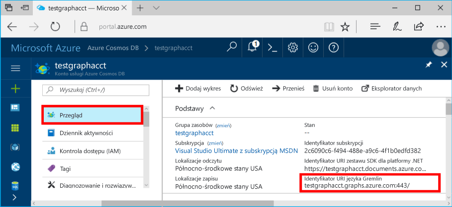

# <a name="azure-cosmos-db-build-a-nodejs-application-by-using-graph-api"></a><span data-ttu-id="cd372-103">Azure Cosmos DB: Tworzenie aplikacji Node.js za pomocą interfejsu API programu Graph</span><span class="sxs-lookup"><span data-stu-id="cd372-103">Azure Cosmos DB: Build a Node.js application by using Graph API</span></span>

<span data-ttu-id="cd372-104">Azure DB rozwiązania Cosmos jest hello globalnie rozproszone wielu modelu bazy danych usługi firmy Microsoft.</span><span class="sxs-lookup"><span data-stu-id="cd372-104">Azure Cosmos DB is hello globally distributed multi-model database service from Microsoft.</span></span> <span data-ttu-id="cd372-105">Można szybko utworzyć i wyszukiwać dokumentu, klucza i wartości i wykres baz danych, które korzystają z dystrybucji globalne hello i możliwości skalowanie w poziomie na podstawowe hello Azure DB rozwiązania Cosmos.</span><span class="sxs-lookup"><span data-stu-id="cd372-105">You can quickly create and query document, key/value, and graph databases, all of which benefit from hello global distribution and horizontal scale capabilities at hello core of Azure Cosmos DB.</span></span> 

<span data-ttu-id="cd372-106">W tym artykule szybki start przedstawiono, jak toocreate bazy danych Azure rozwiązania Cosmos konta dla interfejsu API programu Graph (wersja zapoznawcza), bazy danych i wykres przy użyciu hello portalu Azure.</span><span class="sxs-lookup"><span data-stu-id="cd372-106">This quick-start article demonstrates how toocreate an Azure Cosmos DB account for Graph API (preview), database, and graph by using hello Azure portal.</span></span> <span data-ttu-id="cd372-107">Następnie skompilować i uruchomić aplikację konsoli przy użyciu hello open source [Gremlin Node.js](https://www.npmjs.com/package/gremlin-secure) sterownika.</span><span class="sxs-lookup"><span data-stu-id="cd372-107">You then build and run a console app by using hello open-source [Gremlin Node.js](https://www.npmjs.com/package/gremlin-secure) driver.</span></span>  

> [!NOTE]
> <span data-ttu-id="cd372-108">Moduł npm Hello `gremlin-secure` jest zmodyfikowanej wersji `gremlin` modułu, z obsługą protokołu SSL i SASL wymagane do nawiązywania połączenia z bazy danych Azure rozwiązania Cosmos.</span><span class="sxs-lookup"><span data-stu-id="cd372-108">hello npm module `gremlin-secure` is a modified version of `gremlin` module, with support for SSL and SASL required for connecting with Azure Cosmos DB.</span></span> <span data-ttu-id="cd372-109">Kod źródłowy jest dostępny w usłudze [GitHub](https://github.com/CosmosDB/gremlin-javascript).</span><span class="sxs-lookup"><span data-stu-id="cd372-109">Source code is available on [GitHub](https://github.com/CosmosDB/gremlin-javascript).</span></span>
>

## <a name="prerequisites"></a><span data-ttu-id="cd372-110">Wymagania wstępne</span><span class="sxs-lookup"><span data-stu-id="cd372-110">Prerequisites</span></span>

<span data-ttu-id="cd372-111">Przed uruchomieniem tego przykładu, musi mieć hello następujące wymagania wstępne:</span><span class="sxs-lookup"><span data-stu-id="cd372-111">Before you can run this sample, you must have hello following prerequisites:</span></span>
* <span data-ttu-id="cd372-112">[Node.js](https://nodejs.org/en/) w wersji 0.10.29 lub nowszej</span><span class="sxs-lookup"><span data-stu-id="cd372-112">[Node.js](https://nodejs.org/en/) version v0.10.29 or later</span></span>
* [<span data-ttu-id="cd372-113">Git</span><span class="sxs-lookup"><span data-stu-id="cd372-113">Git</span></span>](http://git-scm.com/)

[!INCLUDE [quickstarts-free-trial-note](../../includes/quickstarts-free-trial-note.md)]

## <a name="create-a-database-account"></a><span data-ttu-id="cd372-114">Tworzenie konta bazy danych</span><span class="sxs-lookup"><span data-stu-id="cd372-114">Create a database account</span></span>

[!INCLUDE [cosmos-db-create-dbaccount-graph](../../includes/cosmos-db-create-dbaccount-graph.md)]

## <a name="add-a-graph"></a><span data-ttu-id="cd372-115">Dodawanie grafu</span><span class="sxs-lookup"><span data-stu-id="cd372-115">Add a graph</span></span>

[!INCLUDE [cosmos-db-create-graph](../../includes/cosmos-db-create-graph.md)]

## <a name="clone-hello-sample-application"></a><span data-ttu-id="cd372-116">Klonowanie hello przykładowej aplikacji</span><span class="sxs-lookup"><span data-stu-id="cd372-116">Clone hello sample application</span></span>

<span data-ttu-id="cd372-117">Teraz załóżmy aplikacji w klonowania interfejs API programu Graph z serwisu GitHub, Ustaw ciąg połączenia hello i uruchom go.</span><span class="sxs-lookup"><span data-stu-id="cd372-117">Now let's clone a Graph API app from GitHub, set hello connection string, and run it.</span></span> <span data-ttu-id="cd372-118">Zobaczysz, jak łatwo jest toowork z danymi programowo.</span><span class="sxs-lookup"><span data-stu-id="cd372-118">You'll see how easy it is toowork with data programmatically.</span></span> 

1. <span data-ttu-id="cd372-119">Otwórz okno terminala Git, np. Git Bash i zmień (za pośrednictwem `cd` polecenie) tooa katalog roboczy.</span><span class="sxs-lookup"><span data-stu-id="cd372-119">Open a Git terminal window, such as Git Bash, and change (via `cd` command) tooa working directory.</span></span>  

2. <span data-ttu-id="cd372-120">Hello uruchom następujące polecenie tooclone hello próbki repozytorium.</span><span class="sxs-lookup"><span data-stu-id="cd372-120">Run hello following command tooclone hello sample repository.</span></span> 

    ```bash
    git clone https://github.com/Azure-Samples/azure-cosmos-db-graph-nodejs-getting-started.git
    ```

3. <span data-ttu-id="cd372-121">Otwórz plik rozwiązania hello w programie Visual Studio.</span><span class="sxs-lookup"><span data-stu-id="cd372-121">Open hello solution file in Visual Studio.</span></span> 

## <a name="review-hello-code"></a><span data-ttu-id="cd372-122">Przejrzyj hello kodu</span><span class="sxs-lookup"><span data-stu-id="cd372-122">Review hello code</span></span>

<span data-ttu-id="cd372-123">Upewnijmy szybki przegląd działania wykonywane w aplikacji hello.</span><span class="sxs-lookup"><span data-stu-id="cd372-123">Let's make a quick review of what's happening in hello app.</span></span> <span data-ttu-id="cd372-124">Otwórz hello `app.js` pliku, a znajdziesz hello następujące wiersze kodu.</span><span class="sxs-lookup"><span data-stu-id="cd372-124">Open hello `app.js` file, and you'll find hello following lines of code.</span></span> 

* <span data-ttu-id="cd372-125">Klient Gremlin Hello jest tworzony.</span><span class="sxs-lookup"><span data-stu-id="cd372-125">hello Gremlin client is created.</span></span>

    ```nodejs
    const client = Gremlin.createClient(
        443, 
        config.endpoint, 
        { 
            "session": false, 
            "ssl": true, 
            "user": `/dbs/${config.database}/colls/${config.collection}`,
            "password": config.primaryKey
        });
    ```

  <span data-ttu-id="cd372-126">Witaj konfiguracje są w `config.js`, które możemy edytować w hello następujących sekcji.</span><span class="sxs-lookup"><span data-stu-id="cd372-126">hello configurations are all in `config.js`, which we edit in hello following section.</span></span>

* <span data-ttu-id="cd372-127">Serie kroków Gremlin są wykonywane z hello `client.execute` metody.</span><span class="sxs-lookup"><span data-stu-id="cd372-127">A series of Gremlin steps are executed with hello `client.execute` method.</span></span>

    ```nodejs
    console.log('Running Count'); 
    client.execute("g.V().count()", { }, (err, results) => {
        if (err) return console.error(err);
        console.log(JSON.stringify(results));
        console.log();
    });
    ```

## <a name="update-your-connection-string"></a><span data-ttu-id="cd372-128">Aktualizowanie parametrów połączenia</span><span class="sxs-lookup"><span data-stu-id="cd372-128">Update your connection string</span></span>

1. <span data-ttu-id="cd372-129">Otwórz hello pliku config.js.</span><span class="sxs-lookup"><span data-stu-id="cd372-129">Open hello config.js file.</span></span> 

2. <span data-ttu-id="cd372-130">Config.js, wypełnij hello config.endpoint klucza z hello **Gremlin URI** wartość z zakresu od hello **omówienie** strony hello portalu Azure.</span><span class="sxs-lookup"><span data-stu-id="cd372-130">In config.js, fill in hello config.endpoint key with hello **Gremlin URI** value from hello **Overview** page of hello Azure portal.</span></span> 

    `config.endpoint = "GRAPHENDPOINT";`

    

   <span data-ttu-id="cd372-132">Jeśli hello **Gremlin URI** wartość jest pusta, możesz wygenerować wartość hello na podstawie hello **klucze** strony w portalu hello, za pomocą hello **URI** wartości, usuwania https:// i zmiana toographs dokumentów.</span><span class="sxs-lookup"><span data-stu-id="cd372-132">If hello **Gremlin URI** value is blank, you can generate hello value from hello **Keys** page in hello portal, using hello **URI** value, removing https://, and changing documents toographs.</span></span>

   <span data-ttu-id="cd372-133">punkt końcowy Gremlin Hello musi być tylko nazwy hosta hello bez numeru portu protokołu/hello, tak samo, jak `mygraphdb.graphs.azure.com` (nie `https://mygraphdb.graphs.azure.com` lub `mygraphdb.graphs.azure.com:433`).</span><span class="sxs-lookup"><span data-stu-id="cd372-133">hello Gremlin endpoint must be only hello host name without hello protocol/port number, like `mygraphdb.graphs.azure.com` (not `https://mygraphdb.graphs.azure.com` or `mygraphdb.graphs.azure.com:433`).</span></span>

3. <span data-ttu-id="cd372-134">Wypełnij w config.js, wartość config.primaryKey hello się przy użyciu hello **klucza podstawowego** wartość z zakresu od hello **klucze** strony hello portalu Azure.</span><span class="sxs-lookup"><span data-stu-id="cd372-134">In config.js, fill in hello config.primaryKey value in with hello **Primary Key** value from hello **Keys** page of hello Azure portal.</span></span> 

    `config.primaryKey = "PRIMARYKEY";`

   

4. <span data-ttu-id="cd372-136">Wprowadź nazwę bazy danych hello i wykres (kontener) nazwę wartości hello config.database i config.collection.</span><span class="sxs-lookup"><span data-stu-id="cd372-136">Enter hello database name, and graph (container) name for hello value of config.database and config.collection.</span></span> 

<span data-ttu-id="cd372-137">Oto przykład wypełnionego pliku config.js:</span><span class="sxs-lookup"><span data-stu-id="cd372-137">Here is an example of what your completed config.js file should look like:</span></span>

```nodejs
var config = {}

// Note that this must not have HTTPS or hello port number
config.endpoint = "testgraphacct.graphs.azure.com";
config.primaryKey = "Pams6e7LEUS7LJ2Qk0fjZf3eGo65JdMWHmyn65i52w8ozPX2oxY3iP0yu05t9v1WymAHNcMwPIqNAEv3XDFsEg==";
config.database = "graphdb"
config.collection = "Persons"

module.exports = config;
```

## <a name="run-hello-console-app"></a><span data-ttu-id="cd372-138">Uruchamianie aplikacji konsoli hello</span><span class="sxs-lookup"><span data-stu-id="cd372-138">Run hello console app</span></span>

1. <span data-ttu-id="cd372-139">Otwórz okno terminala i zmień (za pośrednictwem `cd` polecenie) katalog instalacyjny toohello dla pliku package.json hello, który znajduje się w projekcie hello.</span><span class="sxs-lookup"><span data-stu-id="cd372-139">Open a terminal window and change (via `cd` command) toohello installation directory for hello package.json file that's included in hello project.</span></span>  

2. <span data-ttu-id="cd372-140">Uruchom `npm install` tooinstall hello wymagane moduły npm, w tym `gremlin-secure`.</span><span class="sxs-lookup"><span data-stu-id="cd372-140">Run `npm install` tooinstall hello required npm modules, including `gremlin-secure`.</span></span>

3. <span data-ttu-id="cd372-141">Uruchom `node app.js` w terminalu toostart aplikacji węzła.</span><span class="sxs-lookup"><span data-stu-id="cd372-141">Run `node app.js` in a terminal toostart your node application.</span></span>

## <a name="browse-with-data-explorer"></a><span data-ttu-id="cd372-142">Przeglądanie w Eksploratorze danych</span><span class="sxs-lookup"><span data-stu-id="cd372-142">Browse with Data Explorer</span></span>

<span data-ttu-id="cd372-143">Teraz można wrócić do poprzedniej strony tooData Explorer w hello tooview portalu Azure, zapytania, modyfikowania i pracować z nowych danych wykresu.</span><span class="sxs-lookup"><span data-stu-id="cd372-143">You can now go back tooData Explorer in hello Azure portal tooview, query, modify, and work with your new graph data.</span></span>

<span data-ttu-id="cd372-144">W Eksploratorze danych hello nowej bazy danych jest wyświetlana w hello **wykresy** okienka.</span><span class="sxs-lookup"><span data-stu-id="cd372-144">In Data Explorer, hello new database appears in hello **Graphs** pane.</span></span> <span data-ttu-id="cd372-145">Rozwiń bazę danych hello, następuje hello kolekcji, a następnie kliknij przycisk **wykresu**.</span><span class="sxs-lookup"><span data-stu-id="cd372-145">Expand hello database, followed by hello collection, then click **Graph**.</span></span>

<span data-ttu-id="cd372-146">Hello dane generowane przez hello Przykładowa aplikacja jest wyświetlana w okienku dalej hello w hello **wykres** karcie po kliknięciu **Zastosuj filtr**.</span><span class="sxs-lookup"><span data-stu-id="cd372-146">hello data generated by hello sample app is displayed in hello next pane within hello **Graph** tab when you click **Apply Filter**.</span></span>

<span data-ttu-id="cd372-147">Spróbuj Kończenie `g.V()` z `.has('firstName', 'Thomas')` tootest hello filtru.</span><span class="sxs-lookup"><span data-stu-id="cd372-147">Try completing `g.V()` with `.has('firstName', 'Thomas')` tootest hello filter.</span></span> <span data-ttu-id="cd372-148">Należy pamiętać, że wartość hello jest uwzględniana wielkość liter.</span><span class="sxs-lookup"><span data-stu-id="cd372-148">Do note that hello value is case sensitive.</span></span>

## <a name="review-slas-in-hello-azure-portal"></a><span data-ttu-id="cd372-149">Przejrzyj umowy SLA w hello portalu Azure</span><span class="sxs-lookup"><span data-stu-id="cd372-149">Review SLAs in hello Azure portal</span></span>

[!INCLUDE [cosmosdb-tutorial-review-slas](../../includes/cosmos-db-tutorial-review-slas.md)]

## <a name="clean-up-your-resources"></a><span data-ttu-id="cd372-150">Czyszczenie zasobów</span><span class="sxs-lookup"><span data-stu-id="cd372-150">Clean up your resources</span></span>

<span data-ttu-id="cd372-151">Jeśli nie planujesz toocontinue za pomocą tej aplikacji, należy usunąć wszystkie zasoby, które zostały utworzone w tym artykule, wykonując następujące hello:</span><span class="sxs-lookup"><span data-stu-id="cd372-151">If you do not plan toocontinue using this app, delete all resources that you created in this article by doing hello following:</span></span> 

1. <span data-ttu-id="cd372-152">W portalu Azure, w menu nawigacji po lewej stronie powitania powitania kliknij **grup zasobów**, a następnie kliknij nazwę hello hello zasobu, który został utworzony.</span><span class="sxs-lookup"><span data-stu-id="cd372-152">In hello Azure portal, on hello left navigation menu, click **Resource groups**, and then click hello name of hello resource that you created.</span></span> 
2. <span data-ttu-id="cd372-153">Na stronie grupy zasobów, kliknij przycisk **usunąć**, wpisz nazwę hello toobe zasobów hello usunięte, a następnie kliknij przycisk **usunąć**.</span><span class="sxs-lookup"><span data-stu-id="cd372-153">On your resource group page, click **Delete**, type hello name of hello resource toobe deleted, and then click **Delete**.</span></span>

## <a name="next-steps"></a><span data-ttu-id="cd372-154">Następne kroki</span><span class="sxs-lookup"><span data-stu-id="cd372-154">Next steps</span></span>

<span data-ttu-id="cd372-155">W tym artykule kiedy znasz już jak toocreate konto bazy danych Azure rozwiązania Cosmos utworzyć wykres za pomocą Eksploratora danych i uruchom aplikację.</span><span class="sxs-lookup"><span data-stu-id="cd372-155">In this article, you've learned how toocreate an Azure Cosmos DB account, create a graph by using Data Explorer, and run an app.</span></span> <span data-ttu-id="cd372-156">Teraz możesz tworzyć bardziej złożone zapytania i implementować zaawansowaną logikę przechodzenia grafu za pomocą języka Gremlin.</span><span class="sxs-lookup"><span data-stu-id="cd372-156">You can now build more complex queries and implement powerful graph traversal logic by using Gremlin.</span></span> 

> [!div class="nextstepaction"]
> [<span data-ttu-id="cd372-157">Wykonywanie zapytań przy użyciu języka Gremlin</span><span class="sxs-lookup"><span data-stu-id="cd372-157">Query using Gremlin</span></span>](tutorial-query-graph.md)
