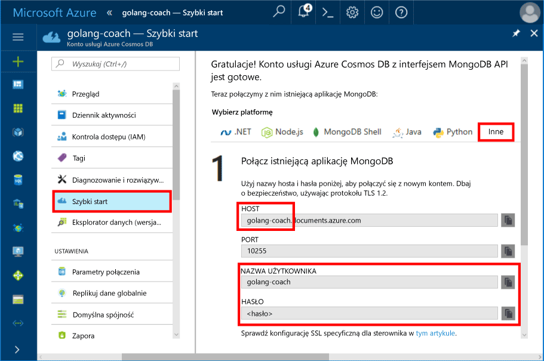
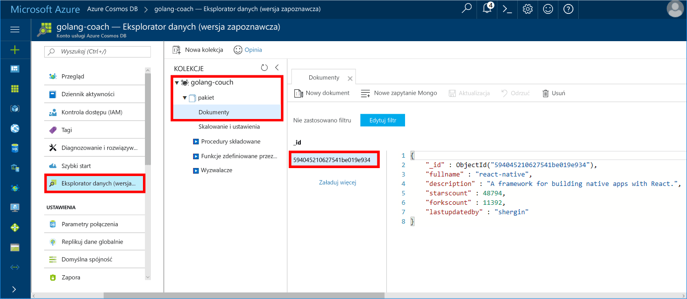

# <a name="azure-cosmos-db-build-a-mongodb-api-console-app-with-golang-and-hello-azure-portal"></a>Azure DB rozwiązania Cosmos: Tworzenie aplikacji konsoli API bazy danych MongoDB z Golang i hello portalu Azure

Azure Cosmos DB to rozproszona globalnie wielomodelowa usługa bazy danych firmy Microsoft. Można szybko utworzyć i wyszukiwać dokumentu, klucza i wartości i wykres baz danych, które korzystają z dystrybucji globalne hello i możliwości skalowanie w poziomie na podstawowe hello Azure DB rozwiązania Cosmos.

Przedstawiono to szybki start jak toouse istniejące [MongoDB](https://docs.microsoft.com/en-us/azure/cosmos-db/mongodb-introduction) aplikacji napisanych w [Golang](https://golang.org/) i podłącz go bazy danych Azure DB rozwiązania Cosmos tooyour, która obsługuje połączenia klienta bazy danych MongoDB.

Innymi słowy aplikacja Golang tylko wie, że nawiązuje połączenie tooa bazy danych przy użyciu interfejsów API bazy danych MongoDB. Jest niewidoczne toohello aplikacji hello dane są przechowywane w usłudze Azure DB rozwiązania Cosmos.

## <a name="prerequisites"></a>Wymagania wstępne

- Subskrypcja platformy Azure. Jeśli nie masz subskrypcji platformy Azure, przed rozpoczęciem utwórz [bezpłatne konto](https://azure.microsoft.com/free).
- [Przejdź](https://golang.org/dl/) oraz podstawową wiedzę na temat hello [Przejdź](https://golang.org/) języka.
- Środowisko IDE — [Gogland](https://www.jetbrains.com/go/) firmy Jetbrains, [Visual Studio Code](https://code.visualstudio.com/) firmy Microsoft lub [Atom](https://atom.io/). W tym samouczku używam środowiska Goglang.

<a id="create-account"></a>
## <a name="create-a-database-account"></a>Tworzenie konta bazy danych

[!INCLUDE [cosmos-db-create-dbaccount](../../includes/cosmos-db-create-dbaccount-mongodb.md)]

## <a name="clone-hello-sample-application"></a>Klonowanie hello przykładowej aplikacji

Klonowanie hello przykładową aplikację i zainstaluj hello wymagane pakiety.

1. Utwórz folder o nazwie CosmosDBSample znajdujące się w folderze GOROOT\src hello, czyli C:\Go\ domyślnie.
2. Uruchom następujące polecenia, używając okno terminalu git np. git bash tooclone hello próbki repozytorium do folderu CosmosDBSample hello hello. 

    ```bash
    git clone https://github.com/Azure-Samples/azure-cosmos-db-mongodb-golang-getting-started.git
    ```
3.  Uruchom następujące polecenie tooget hello mgo pakietów hello. 

    ```
    go get gopkg.in/mgo.v2
    ```

Hello [mgo](http://labix.org/mgo) sterownika (Wymowa jako *mango*) jest [MongoDB](http://www.mongodb.org/) sterownik hello [Przejdź języka](http://golang.org/) implementuje wzbogaconej i również testowane Wybór funkcji w obszarze bardzo prosty interfejs API następujące standardowe idioms Go.

<a id="connection-string"></a>

## <a name="update-your-connection-string"></a>Aktualizowanie parametrów połączenia

Teraz przejdź wstecz toohello Azure tooget portalu użytkownika informacje o parametrach połączenia i skopiuj go do aplikacji hello.

1. Kliknij przycisk **szybki start** w hello menu nawigacji po lewej stronie, a następnie kliknij przycisk **innych** tooview hello ciągu połączenia wymagane przez hello Przejdź aplikacji.

2. W Goglang Otwórz plik main.go hello w katalogu GOROOT\CosmosDBSample hello i zaktualizuj hello następujące wiersze kodu za pomocą hello ciągu połączenia z hello portalu Azure, jak pokazano w powitania po zrzut ekranu. 

    Nazwa bazy danych Hello jest prefiksem hello hello **hosta** wartość w okienku ciąg połączenia portalu Azure hello. Dla konta hello pokazano na poniższym obrazie hello hello Nazwa bazy danych jest szkolić golang.

    ```go
    Database: "hello prefix of hello Host value in hello Azure portal",
    Username: "hello Username in hello Azure portal",
    Password: "hello Password in hello Azure portal",
    ```

    

3. Zapisz plik main.go hello.

## <a name="review-hello-code"></a>Przejrzyj hello kodu

Upewnijmy szybki przegląd co dzieje się w pliku main.go hello. 

### <a name="connecting-hello-go-app-tooazure-cosmos-db"></a>Łączenie hello tooAzure aplikacji przejdź DB rozwiązania Cosmos

Azure DB rozwiązania Cosmos obsługuje hello włączony protokół SSL bazy danych MongoDB. tooan tooconnect MongoDB włączony protokół SSL, należy toodefine hello **DialServer** działać w [mgo. DialInfo](http://gopkg.in/mgo.v2#DialInfo)i użycie hello [tls. *Wybierania* ](http://golang.org/pkg/crypto/tls#Dial) funkcji tooperform hello połączenia.

Witaj następującego fragmentu kodu Golang łączy hello aplikacji przejdź z interfejsu API Azure rozwiązania Cosmos bazy danych MongoDB. Witaj *DialInfo* klasa przechowuje opcje do ustanowienia sesji z klastra bazy danych MongoDB.

```go
// DialInfo holds options for establishing a session with a MongoDB cluster.
dialInfo := &mgo.DialInfo{
    Addrs:    []string{"golang-couch.documents.azure.com:10255"}, // Get HOST + PORT
    Timeout:  60 * time.Second,
    Database: "database", // It can be anything
    Username: "username", // Username
    Password: "Azure database connect password from Azure Portal", // PASSWORD
    DialServer: func(addr *mgo.ServerAddr) (net.Conn, error) {
        return tls.Dial("tcp", addr.String(), &tls.Config{})
    },
}

// Create a session which maintains a pool of socket connections
// tooour Azure Cosmos DB MongoDB database.
session, err := mgo.DialWithInfo(dialInfo)

if err != nil {
    fmt.Printf("Can't connect toomongo, go error %v\n", err)
    os.Exit(1)
}

defer session.Close()

// SetSafe changes hello session safety mode.
// If hello safe parameter is nil, hello session is put in unsafe mode, 
// and writes become fire-and-forget,
// without error checking. hello unsafe mode is faster since operations won't hold on waiting for a confirmation.
// 
session.SetSafe(&mgo.Safe{})
```

Witaj **mgo. Dial()** metoda jest używana w przypadku braku połączenia SSL. Dla połączeń SSL, hello **mgo. DialWithInfo()** wymagana jest metoda.

Wystąpienie hello **{} DialWIthInfo** obiekt jest używany toocreate hello sesji. Po ustanowieniu sesji hello, aby dostęp do kolekcji hello za pomocą następującego fragmentu kodu hello:

```go
collection := session.DB(“database”).C(“package”)
```

<a id="create-document"></a>

### <a name="create-a-document"></a>Tworzenie dokumentu

```go
// Model
type Package struct {
    Id bson.ObjectId  `bson:"_id,omitempty"`
    FullName      string
    Description   string
    StarsCount    int
    ForksCount    int
    LastUpdatedBy string
}

// insert Document in collection
err = collection.Insert(&Package{
    FullName:"react",
    Description:"A framework for building native apps with React.",
    ForksCount: 11392,
    StarsCount:48794,
    LastUpdatedBy:"shergin",

})

if err != nil {
    log.Fatal("Problem inserting data: ", err)
    return
}
```

### <a name="query-or-read-a-document"></a>Wykonywanie zapytania o dokument lub jego odczytywanie

Usługa Azure Cosmos DB obsługuje zaawansowane zapytania o dokumenty JSON przechowywane w każdej kolekcji. Witaj następujący przykładowy kod przedstawia zapytanie, które można uruchomić względem dokumentów hello w kolekcji.

```go
// Get a Document from hello collection
result := Package{}
err = collection.Find(bson.M{"fullname": "react"}).One(&result)
if err != nil {
    log.Fatal("Error finding record: ", err)
    return
}

fmt.Println("Description:", result.Description)
```


### <a name="update-a-document"></a>Aktualizowanie dokumentu

```go
// Update a document
updateQuery := bson.M{"_id": result.Id}
change := bson.M{"$set": bson.M{"fullname": "react-native"}}
err = collection.Update(updateQuery, change)
if err != nil {
    log.Fatal("Error updating record: ", err)
    return
}
```

### <a name="delete-a-document"></a>Usuwanie dokumentu

Usługa Azure Cosmos DB obsługuje usuwanie dokumentów JSON.

```go
// Delete a document
query := bson.M{"_id": result.Id}
err = collection.Remove(query)
if err != nil {
   log.Fatal("Error deleting record: ", err)
   return
}
```
    
## <a name="run-hello-app"></a>Uruchamianie aplikacji hello

1. W Goglang, upewnij się, że Twoje GOPATH (dostępnych w ramach **pliku**, **ustawienia**, **Przejdź**, **GOPATH**) należą: Lokalizacja hello w których hello gopkg został zainstalowany, która jest USERPROFILE\go domyślnie. 
2. Komentarz hello wierszy, które usunąć hello dokumentu, linie 91 96, dzięki czemu można wyświetlić dokumentu powitania po uruchomionej aplikacji hello.
3. W środowisku Goglang kliknij pozycję **Run** (Uruchom), a następnie kliknij pozycję **Run 'Build main.go and run'** (Uruchom „Skompiluj plik main.go i uruchom”).

    Aplikacja Hello zakończeniu i wyświetla opis hello dokumentu hello utworzona w [Utwórz dokument](#create-document).
    
    ```
    Description: A framework for building native apps with React.
    
    Process finished with exit code 0
    ```

    
    
## <a name="review-your-document-in-data-explorer"></a>Przeglądanie dokumentu w Eksploratorze danych

Przejdź wstecz toohello toosee portalu Azure w Eksploratorze danych dokumentu.

1. Kliknij przycisk **Eksploratora danych (wersja zapoznawcza)** w menu nawigacji po lewej stronie powitania, rozwiń węzeł **szkolić golang**, **pakietu**, a następnie kliknij przycisk **dokumenty**. W hello **dokumenty** , kliknij pozycję hello \_identyfikator toodisplay hello dokumentu w okienku po prawej stronie powitania. 

    
    
2. Możesz pracować z wbudowanym dokumentu hello i kliknij przycisk **aktualizacji** toosave go. Można również usunąć hello dokumentu lub tworzenie nowych dokumentów lub zapytań.

## <a name="review-slas-in-hello-azure-portal"></a>Przejrzyj umowy SLA w hello portalu Azure

[!INCLUDE [cosmosdb-tutorial-review-slas](../../includes/cosmos-db-tutorial-review-slas.md)]

## <a name="clean-up-resources"></a>Oczyszczanie zasobów

Jeśli nie będzie toocontinue toouse tej aplikacji, należy usunąć wszystkie zasoby utworzone przez tego przewodnika Szybki Start w hello portalu Azure z hello następujące kroki:

1. Z menu po lewej stronie powitania w hello portalu Azure, kliknij przycisk **grup zasobów** a następnie kliknij nazwę hello zasobu hello został utworzony. 
2. Na stronie grupy zasobów, kliknij przycisk **usunąć**, wpisz nazwę hello toodelete zasobów hello w polu tekstowym hello, a następnie kliknij **usunąć**.

## <a name="next-steps"></a>Następne kroki

W tym szybkiego startu kiedy znasz już jak toocreate konta bazy danych Azure rozwiązania Cosmos i uruchomić aplikację Golang przy użyciu hello interfejsu API dla bazy danych MongoDB. Teraz można importować konto bazy danych rozwiązania Cosmos tooyour dodatkowe dane. 

> [!div class="nextstepaction"]
> [Importowanie danych do bazy danych Azure rozwiązania Cosmos dla hello API bazy danych MongoDB](mongodb-migrate.md)
