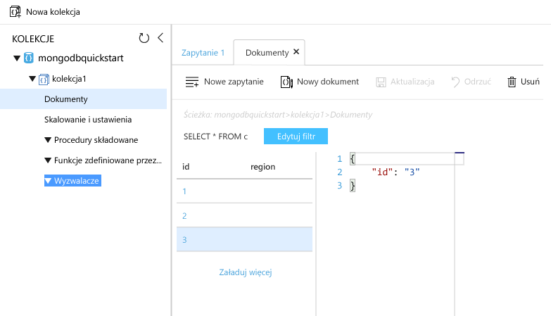

# <a name="azure-cosmos-db-migrate-an-existing-nodejs-mongodb-web-app"></a><span data-ttu-id="1e8ca-103">Azure Cosmos DB: migracja istniejącej aplikacji sieci Web MongoDB w środowisku Node.js</span><span class="sxs-lookup"><span data-stu-id="1e8ca-103">Azure Cosmos DB: Migrate an existing Node.js MongoDB web app</span></span> 

<span data-ttu-id="1e8ca-104">Azure Cosmos DB to rozproszona globalnie wielomodelowa usługa bazy danych firmy Microsoft.</span><span class="sxs-lookup"><span data-stu-id="1e8ca-104">Azure Cosmos DB is Microsoft’s globally distributed multi-model database service.</span></span> <span data-ttu-id="1e8ca-105">Dzięki wykorzystaniu dystrybucji globalnej i możliwości skalowania poziomego opartego na usłudze Azure Cosmos DB, możesz szybko tworzyć i za pomocą zapytań badać bazy danych dokumentów, par klucz/wartość oraz grafów.</span><span class="sxs-lookup"><span data-stu-id="1e8ca-105">You can quickly create and query document, key/value, and graph databases, all of which benefit from the global distribution and horizontal scale capabilities at the core of Azure Cosmos DB.</span></span> 

<span data-ttu-id="1e8ca-106">Ten przewodnik Szybki Start wyjaśnia, jak użyć istniejącej aplikacji [MongoDB](mongodb-introduction.md) napisanej w języku Node.js i połączyć ją z bazą danych usługi Azure Cosmos DB obsługującą połączenia klientów MongoDB.</span><span class="sxs-lookup"><span data-stu-id="1e8ca-106">This quickstart demonstrates how to use an existing [MongoDB](mongodb-introduction.md) app written in Node.js and connect it to your Azure Cosmos DB database, which supports MongoDB client connections.</span></span> <span data-ttu-id="1e8ca-107">Innymi słowy, aplikacja Node.js wie jedynie, że łączy się z bazą danych przy użyciu interfejsów API MongoDB.</span><span class="sxs-lookup"><span data-stu-id="1e8ca-107">In other words, your Node.js application only knows that it's connecting to a database using MongoDB APIs.</span></span> <span data-ttu-id="1e8ca-108">Aplikacja nie wie, że dane są przechowywane w bazie danych usługi Azure Cosmos DB.</span><span class="sxs-lookup"><span data-stu-id="1e8ca-108">It is transparent to the application that the data is stored in Azure Cosmos DB.</span></span>

<span data-ttu-id="1e8ca-109">Gdy wszystko będzie gotowe, aplikacja MEAN (MongoDB, Express, AngularJS i Node.js) będzie uruchomiona dla bazy danych [Azure Cosmos DB](https://azure.microsoft.com/services/cosmos-db/).</span><span class="sxs-lookup"><span data-stu-id="1e8ca-109">When you are done, you will have a MEAN application (MongoDB, Express, AngularJS, and Node.js) running on [Azure Cosmos DB](https://azure.microsoft.com/services/cosmos-db/).</span></span> 


[!INCLUDE [cloud-shell-try-it](../../includes/cloud-shell-try-it.md)]

<span data-ttu-id="1e8ca-111">Jeśli zdecydujesz się zainstalować interfejs wiersza polecenia i korzystać z niego lokalnie, ten temat będzie wymagał interfejsu wiersza polecenia platformy Azure w wersji 2.0 lub nowszej.</span><span class="sxs-lookup"><span data-stu-id="1e8ca-111">If you choose to install and use the CLI locally, this topic requires that you are running the Azure CLI version 2.0 or later.</span></span> <span data-ttu-id="1e8ca-112">Uruchom polecenie `az --version`, aby dowiedzieć się, jaka wersja jest używana.</span><span class="sxs-lookup"><span data-stu-id="1e8ca-112">Run `az --version` to find the version.</span></span> <span data-ttu-id="1e8ca-113">Jeśli konieczna będzie instalacja lub uaktualnienie, zobacz [Instalowanie interfejsu wiersza polecenia platformy Azure 2.0]( /cli/azure/install-azure-cli).</span><span class="sxs-lookup"><span data-stu-id="1e8ca-113">If you need to install or upgrade, see [Install Azure CLI 2.0]( /cli/azure/install-azure-cli).</span></span> 

## <a name="prerequisites"></a><span data-ttu-id="1e8ca-114">Wymagania wstępne</span><span class="sxs-lookup"><span data-stu-id="1e8ca-114">Prerequisites</span></span> 
<span data-ttu-id="1e8ca-115">Oprócz interfejsu wiersza polecenia platformy Azure należy mieć lokalnie zainstalowane środowisko [Node.js](https://nodejs.org/) i usługę [Git](http://www.git-scm.com/downloads) do uruchamiania `npm` i poleceń `git`.</span><span class="sxs-lookup"><span data-stu-id="1e8ca-115">In addition to Azure CLI, you need [Node.js](https://nodejs.org/) and [Git](http://www.git-scm.com/downloads) installed locally to run `npm` and `git` commands.</span></span>

<span data-ttu-id="1e8ca-116">Niezbędna jest praktyczna wiedza na temat Node.js.</span><span class="sxs-lookup"><span data-stu-id="1e8ca-116">You should have working knowledge of Node.js.</span></span> <span data-ttu-id="1e8ca-117">Ten przewodnik Szybki start nie służy do wyjaśnienia ogólnych zasad tworzenia aplikacji w języku Node.js.</span><span class="sxs-lookup"><span data-stu-id="1e8ca-117">This quickstart is not intended to help you with developing Node.js applications in general.</span></span>

## <a name="clone-the-sample-application"></a><span data-ttu-id="1e8ca-118">Klonowanie przykładowej aplikacji</span><span class="sxs-lookup"><span data-stu-id="1e8ca-118">Clone the sample application</span></span>

<span data-ttu-id="1e8ca-119">Otwórz okno terminalu usługi Git, na przykład git bash, i za pomocą polecenia `cd` przejdź do katalogu roboczego.</span><span class="sxs-lookup"><span data-stu-id="1e8ca-119">Open a git terminal window, such as git bash, and `cd` to a working directory.</span></span>  

<span data-ttu-id="1e8ca-120">Uruchom następujące polecenia w celu sklonowania przykładowego repozytorium.</span><span class="sxs-lookup"><span data-stu-id="1e8ca-120">Run the following commands to clone the sample repository.</span></span> <span data-ttu-id="1e8ca-121">To przykładowe repozytorium zawiera domyślną aplikację [MEAN.js](http://meanjs.org/).</span><span class="sxs-lookup"><span data-stu-id="1e8ca-121">This sample repository contains the default [MEAN.js](http://meanjs.org/) application.</span></span> 

```bash
git clone https://github.com/prashanthmadi/mean
```

## <a name="run-the-application"></a><span data-ttu-id="1e8ca-122">Uruchamianie aplikacji</span><span class="sxs-lookup"><span data-stu-id="1e8ca-122">Run the application</span></span>

<span data-ttu-id="1e8ca-123">Zainstaluj wymagane pakiety i uruchom aplikację.</span><span class="sxs-lookup"><span data-stu-id="1e8ca-123">Install the required packages and start the application.</span></span>

```bash
cd mean
npm install
npm start
```

## <a name="log-in-to-azure"></a><span data-ttu-id="1e8ca-124">Zaloguj się do platformy Azure.</span><span class="sxs-lookup"><span data-stu-id="1e8ca-124">Log in to Azure</span></span>

<span data-ttu-id="1e8ca-125">Jeśli używasz zainstalowanego interfejsu wiersza polecenia platformy Azure, zaloguj się do subskrypcji platformy Azure za pomocą polecenia [az login](/cli/azure/#login) i postępuj zgodnie z instrukcjami wyświetlanymi na ekranie.</span><span class="sxs-lookup"><span data-stu-id="1e8ca-125">If you are using an installed Azure CLI, log in to your Azure subscription with the [az login](/cli/azure/#login) command and follow the on-screen directions.</span></span> <span data-ttu-id="1e8ca-126">Ten krok możesz pominąć, jeśli używasz powłoki Azure Cloud Shell.</span><span class="sxs-lookup"><span data-stu-id="1e8ca-126">You can skip this step if you're using the Azure Cloud Shell.</span></span>

```azurecli
az login 
``` 
   
## <a name="add-the-azure-cosmos-db-module"></a><span data-ttu-id="1e8ca-127">Dodawanie modułu Azure Cosmos DB</span><span class="sxs-lookup"><span data-stu-id="1e8ca-127">Add the Azure Cosmos DB module</span></span>

<span data-ttu-id="1e8ca-128">Jeśli używasz zainstalowanego interfejsu wiersza polecenia platformy Azure, sprawdź, czy składnik `cosmosdb` jest już zainstalowany, uruchamiając polecenie `az`.</span><span class="sxs-lookup"><span data-stu-id="1e8ca-128">If you are using an installed Azure CLI, check to see if the `cosmosdb` component is already installed by running the `az` command.</span></span> <span data-ttu-id="1e8ca-129">Jeśli `cosmosdb` znajduje się na liście podstawowych poleceń, przejdź do następnego polecenia.</span><span class="sxs-lookup"><span data-stu-id="1e8ca-129">If `cosmosdb` is in the list of base commands, proceed to the next command.</span></span> <span data-ttu-id="1e8ca-130">Ten krok możesz pominąć, jeśli używasz powłoki Azure Cloud Shell.</span><span class="sxs-lookup"><span data-stu-id="1e8ca-130">You can skip this step if you're using the Azure Cloud Shell.</span></span>

<span data-ttu-id="1e8ca-131">Jeśli `cosmosdb` nie znajduje się na liście podstawowych poleceń, zainstaluj ponownie [Interfejs wiersza polecenia platformy Azure 2.0]( /cli/azure/install-azure-cli).</span><span class="sxs-lookup"><span data-stu-id="1e8ca-131">If `cosmosdb` is not in the list of base commands, reinstall [Azure CLI 2.0]( /cli/azure/install-azure-cli).</span></span>

## <a name="create-a-resource-group"></a><span data-ttu-id="1e8ca-132">Tworzenie grupy zasobów</span><span class="sxs-lookup"><span data-stu-id="1e8ca-132">Create a resource group</span></span>

<span data-ttu-id="1e8ca-133">Utwórz [grupę zasobów](../azure-resource-manager/resource-group-overview.md) za pomocą polecenia [az group create](/cli/azure/group#create).</span><span class="sxs-lookup"><span data-stu-id="1e8ca-133">Create a [resource group](../azure-resource-manager/resource-group-overview.md) with the [az group create](/cli/azure/group#create).</span></span> <span data-ttu-id="1e8ca-134">Grupa zasobów platformy Azure to logiczny kontener przeznaczony do wdrażania zasobów platformy Azure, takich jak aplikacje sieci Web, bazy danych i konta magazynu, oraz zarządzania nimi.</span><span class="sxs-lookup"><span data-stu-id="1e8ca-134">An Azure resource group is a logical container into which Azure resources like web apps, databases and storage accounts are deployed and managed.</span></span> 

<span data-ttu-id="1e8ca-135">Poniższy przykład obejmuje tworzenie grupy zasobów w regionie Europa Zachodnia.</span><span class="sxs-lookup"><span data-stu-id="1e8ca-135">The following example creates a resource group in the West Europe region.</span></span> <span data-ttu-id="1e8ca-136">Wybierz unikatową nazwę grupy zasobów.</span><span class="sxs-lookup"><span data-stu-id="1e8ca-136">Choose a unique name for the resource group.</span></span>

<span data-ttu-id="1e8ca-137">Jeśli korzystasz z powłoki Azure Cloud Shell, kliknij przycisk **Wypróbuj**, postępuj zgodnie z wyświetlanymi na ekranie monitami, aby się zalogować, a następnie skopiuj polecenie do wiersza polecenia.</span><span class="sxs-lookup"><span data-stu-id="1e8ca-137">If you are using Azure Cloud Shell, click **Try It**, follow the onscreen prompts to login, then copy the command into the command prompt.</span></span>

```azurecli-interactive
az group create --name myResourceGroup --location "West Europe"
```

## <a name="create-an-azure-cosmos-db-account"></a><span data-ttu-id="1e8ca-138">Tworzenie konta usługi Azure Cosmos DB</span><span class="sxs-lookup"><span data-stu-id="1e8ca-138">Create an Azure Cosmos DB account</span></span>

<span data-ttu-id="1e8ca-139">Utwórz konto usługi Azure Cosmos DB za pomocą polecenia [az cosmosdb create](/cli/azure/cosmosdb#create).</span><span class="sxs-lookup"><span data-stu-id="1e8ca-139">Create an Azure Cosmos DB account with the [az cosmosdb create](/cli/azure/cosmosdb#create) command.</span></span>

<span data-ttu-id="1e8ca-140">W poniższym poleceniu w miejsce symbolu zastępczego `<cosmosdb-name>` wstaw swoją unikatową nazwę konta usługi Azure Cosmos DB.</span><span class="sxs-lookup"><span data-stu-id="1e8ca-140">In the following command, please substitute your own unique Azure Cosmos DB account name where you see the `<cosmosdb-name>` placeholder.</span></span> <span data-ttu-id="1e8ca-141">Ta nazwa będzie służyć jako część Twojego punktu końcowego usługi Azure Cosmos DB (`https://<cosmosdb-name>.documents.azure.com/`), tak więc musi być unikatowa we wszystkich kontach usługi Azure Cosmos DB na platformie Azure.</span><span class="sxs-lookup"><span data-stu-id="1e8ca-141">This unique name will be used as part of your Azure Cosmos DB endpoint (`https://<cosmosdb-name>.documents.azure.com/`), so the name needs to be unique across all Azure Cosmos DB accounts in Azure.</span></span> 

```azurecli-interactive
az cosmosdb create --name <cosmosdb-name> --resource-group myResourceGroup --kind MongoDB
```

<span data-ttu-id="1e8ca-142">Parametr `--kind MongoDB` umożliwia tworzenie połączeń klienckich MongoDB.</span><span class="sxs-lookup"><span data-stu-id="1e8ca-142">The `--kind MongoDB` parameter enables MongoDB client connections.</span></span>

<span data-ttu-id="1e8ca-143">Po utworzeniu konta usługi Azure Cosmos DB w interfejsie wiersza polecenia platformy Azure zostaną wyświetlone informacje podobne do następujących.</span><span class="sxs-lookup"><span data-stu-id="1e8ca-143">When the Azure Cosmos DB account is created, the Azure CLI shows information similar to the following example.</span></span> 

> [!NOTE]
> <span data-ttu-id="1e8ca-144">W tym przykładzie format JSON jest używany jako format wyjściowy interfejsu wiersza polecenia platformy Azure. Jest to ustawienie domyślne.</span><span class="sxs-lookup"><span data-stu-id="1e8ca-144">This example uses JSON as the Azure CLI output format, which is the default.</span></span> <span data-ttu-id="1e8ca-145">Aby użyć innego formatu wyjściowego, zobacz [Formaty danych wyjściowych dla poleceń interfejsu wiersza polecenia platformy Azure 2.0](https://docs.microsoft.com/cli/azure/format-output-azure-cli).</span><span class="sxs-lookup"><span data-stu-id="1e8ca-145">To use another output format, see [Output formats for Azure CLI 2.0 commands](https://docs.microsoft.com/cli/azure/format-output-azure-cli).</span></span>

```json
{
  "databaseAccountOfferType": "Standard",
  "documentEndpoint": "https://<cosmosdb-name>.documents.azure.com:443/",
  "id": "/subscriptions/00000000-0000-0000-0000-000000000000/resourceGroups/myResourceGroup/providers/Microsoft.Document
DB/databaseAccounts/<cosmosdb-name>",
  "kind": "MongoDB",
  "location": "West Europe",
  "name": "<cosmosdb-name>",
  "readLocations": [
    {
      "documentEndpoint": "https://<cosmosdb-name>-westeurope.documents.azure.com:443/",
      "failoverPriority": 0,
      "id": "<cosmosdb-name>-westeurope",
      "locationName": "West Europe",
      "provisioningState": "Succeeded"
    }
  ],
  "resourceGroup": "myResourceGroup",
  "type": "Microsoft.DocumentDB/databaseAccounts",
  "writeLocations": [
    {
      "documentEndpoint": "https://<cosmosdb-name>-westeurope.documents.azure.com:443/",
      "failoverPriority": 0,
      "id": "<cosmosdb-name>-westeurope",
      "locationName": "West Europe",
      "provisioningState": "Succeeded"
    }
  ]
} 
```

## <a name="connect-your-nodejs-application-to-the-database"></a><span data-ttu-id="1e8ca-146">Połączenie aplikacji Node.js z bazą danych</span><span class="sxs-lookup"><span data-stu-id="1e8ca-146">Connect your Node.js application to the database</span></span>

<span data-ttu-id="1e8ca-147">W tym kroku połączysz swoją przykładową aplikację MEAN.js z nowo utworzoną bazą danych usługi Azure Cosmos DB przy użyciu parametrów połączenia MongoDB.</span><span class="sxs-lookup"><span data-stu-id="1e8ca-147">In this step, you connect your MEAN.js sample application to an Azure Cosmos DB database you just created, using a MongoDB connection string.</span></span> 

<a name="devconfig"></a>
## <a name="configure-the-connection-string-in-your-nodejs-application"></a><span data-ttu-id="1e8ca-148">Konfigurowanie parametrów połączenia w aplikacji Node.js</span><span class="sxs-lookup"><span data-stu-id="1e8ca-148">Configure the connection string in your Node.js application</span></span>

<span data-ttu-id="1e8ca-149">W repozytorium MEAN.js otwórz plik `config/env/local-development.js`.</span><span class="sxs-lookup"><span data-stu-id="1e8ca-149">In your MEAN.js repository, open `config/env/local-development.js`.</span></span>

<span data-ttu-id="1e8ca-150">Zastąp zawartość tego pliku następującym kodem.</span><span class="sxs-lookup"><span data-stu-id="1e8ca-150">Replace the content of this file with the following code.</span></span> <span data-ttu-id="1e8ca-151">Należy również zastąpić dwa symbole zastępcze `<cosmosdb-name>` nazwą konta bazy danych usługi Azure Cosmos DB.</span><span class="sxs-lookup"><span data-stu-id="1e8ca-151">Be sure to also replace the two `<cosmosdb-name>` placeholders with your Azure Cosmos DB account name.</span></span>

```javascript
'use strict';

module.exports = {
  db: {
    uri: 'mongodb://<cosmosdb-name>:<primary_master_key>@<cosmosdb-name>.documents.azure.com:10255/mean-dev?ssl=true&sslverifycertificate=false'
  }
};
```

## <a name="retrieve-the-key"></a><span data-ttu-id="1e8ca-152">Pobieranie klucza</span><span class="sxs-lookup"><span data-stu-id="1e8ca-152">Retrieve the key</span></span>

<span data-ttu-id="1e8ca-153">Aby połączyć się z bazą danych usługi Azure Cosmos DB, niezbędny jest klucz bazy danych.</span><span class="sxs-lookup"><span data-stu-id="1e8ca-153">In order to connect to an Azure Cosmos DB database, you need the database key.</span></span> <span data-ttu-id="1e8ca-154">Aby pobrać klucz podstawowy, użyj polecenia [az cosmosdb list-keys](/cli/azure/cosmosdb#list-keys).</span><span class="sxs-lookup"><span data-stu-id="1e8ca-154">Use the [az cosmosdb list-keys](/cli/azure/cosmosdb#list-keys) command to retrieve the primary key.</span></span>

```azurecli-interactive
az cosmosdb list-keys --name <cosmosdb-name> --resource-group myResourceGroup --query "primaryMasterKey"
```

<span data-ttu-id="1e8ca-155">W interfejsie wiersza polecenia platformy Azure zostaną wyświetlone informacje podobne do następującego przykładu.</span><span class="sxs-lookup"><span data-stu-id="1e8ca-155">The Azure CLI outputs information similar to the following example.</span></span> 

```json
"RUayjYjixJDWG5xTqIiXjC..."
```

<span data-ttu-id="1e8ca-156">Skopiuj wartość `primaryMasterKey`.</span><span class="sxs-lookup"><span data-stu-id="1e8ca-156">Copy the value of `primaryMasterKey`.</span></span> <span data-ttu-id="1e8ca-157">Wklej ją zamiast `<primary_master_key>` w `local-development.js`.</span><span class="sxs-lookup"><span data-stu-id="1e8ca-157">Paste this over the  `<primary_master_key>` in `local-development.js`.</span></span>

<span data-ttu-id="1e8ca-158">Zapisz zmiany.</span><span class="sxs-lookup"><span data-stu-id="1e8ca-158">Save your changes.</span></span>

### <a name="run-the-application-again"></a><span data-ttu-id="1e8ca-159">Uruchom ponownie aplikację.</span><span class="sxs-lookup"><span data-stu-id="1e8ca-159">Run the application again.</span></span>

<span data-ttu-id="1e8ca-160">Uruchom ponownie polecenie `npm start`.</span><span class="sxs-lookup"><span data-stu-id="1e8ca-160">Run `npm start` again.</span></span> 

```bash
npm start
```

<span data-ttu-id="1e8ca-161">Komunikat na konsoli powinien stwierdzać, że środowisko programistyczne jest uruchomione i gotowe do pracy.</span><span class="sxs-lookup"><span data-stu-id="1e8ca-161">A console message should now tell you that the development environment is up and running.</span></span> 

<span data-ttu-id="1e8ca-162">W przeglądarce przejdź do adresu `http://localhost:3000`.</span><span class="sxs-lookup"><span data-stu-id="1e8ca-162">Navigate to `http://localhost:3000` in a browser.</span></span> <span data-ttu-id="1e8ca-163">Kliknij przycisk **Zarejestruj się** w górnym menu i spróbuj utworzyć dwóch fikcyjnych użytkowników.</span><span class="sxs-lookup"><span data-stu-id="1e8ca-163">Click **Sign Up** in the top menu and try to create two dummy users.</span></span> 

<span data-ttu-id="1e8ca-164">Przykładowa aplikacja MEAN.js przechowuje dane użytkowników w bazie danych.</span><span class="sxs-lookup"><span data-stu-id="1e8ca-164">The MEAN.js sample application stores user data in the database.</span></span> <span data-ttu-id="1e8ca-165">Jeśli wszystko przebiega poprawnie i aplikacja MEAN.js automatycznie zaloguje się do utworzonego użytkownika, oznacza to, że połączenie z usługą Azure Cosmos DB działa.</span><span class="sxs-lookup"><span data-stu-id="1e8ca-165">If you are successful and MEAN.js automatically signs into the created user, then your Azure Cosmos DB connection is working.</span></span> 


## <a name="view-data-in-data-explorer"></a><span data-ttu-id="1e8ca-167">Wyświetlanie danych w Eksploratorze danych</span><span class="sxs-lookup"><span data-stu-id="1e8ca-167">View data in Data Explorer</span></span>

<span data-ttu-id="1e8ca-168">Dane przechowywane przez usługę Azure Cosmos DB są dostępne na potrzeby przeglądania, zapytań i uruchamiania logiki biznesowej w witrynie Azure Portal.</span><span class="sxs-lookup"><span data-stu-id="1e8ca-168">Data stored by an Azure Cosmos DB is available to view, query, and run business-logic on in the Azure portal.</span></span>

<span data-ttu-id="1e8ca-169">Aby wyświetlać dane użytkownika utworzone w poprzednim kroku, a także pracować z nimi i wykonywać na nich zapytania, zaloguj się do witryny [Azure Portal](https://portal.azure.com) w przeglądarce sieci Web.</span><span class="sxs-lookup"><span data-stu-id="1e8ca-169">To view, query, and work with the user data created in the previous step, login to the [Azure portal](https://portal.azure.com) in your web browser.</span></span>

<span data-ttu-id="1e8ca-170">W polu wyszukiwania u góry wpisz Azure Cosmos DB.</span><span class="sxs-lookup"><span data-stu-id="1e8ca-170">In the top Search box, type Azure Cosmos DB.</span></span> <span data-ttu-id="1e8ca-171">Po otwarciu bloku konta usługi Cosmos DB wybierz swoje konto usługi Cosmos DB.</span><span class="sxs-lookup"><span data-stu-id="1e8ca-171">When your Cosmos DB account blade opens, select your Cosmos DB account.</span></span> <span data-ttu-id="1e8ca-172">W lewym panelu nawigacyjnym kliknij pozycję Eksplorator danych.</span><span class="sxs-lookup"><span data-stu-id="1e8ca-172">In the left navigation, click Data Explorer.</span></span> <span data-ttu-id="1e8ca-173">Rozwiń kolekcję w okienku Kolekcje. Następnie możesz wyświetlić dokumenty w kolekcji, wysłać zapytanie dotyczące danych, a nawet tworzyć i uruchamiać procedury składowane, wyzwalacze i funkcje definiowane przez użytkownika (UDF).</span><span class="sxs-lookup"><span data-stu-id="1e8ca-173">Expand your collection in the Collections pane, and then you can view the documents in the collection, query the data, and even create and run stored procedures, triggers, and UDFs.</span></span> 




## <a name="deploy-the-nodejs-application-to-azure"></a><span data-ttu-id="1e8ca-175">Wdrażanie aplikacji Node.js na platformie Azure</span><span class="sxs-lookup"><span data-stu-id="1e8ca-175">Deploy the Node.js application to Azure</span></span>

<span data-ttu-id="1e8ca-176">W tym kroku należy wdrożyć aplikację w języku Node.js połączoną z bazą danych MongoDB w usłudze Azure Cosmos DB.</span><span class="sxs-lookup"><span data-stu-id="1e8ca-176">In this step, you deploy your MongoDB-connected Node.js application to Azure Cosmos DB.</span></span>

<span data-ttu-id="1e8ca-177">Można było zauważyć, że plik konfiguracji, który został zmodyfikowany wcześniej, jest przeznaczony dla środowiska programistycznego (`/config/env/local-development.js`).</span><span class="sxs-lookup"><span data-stu-id="1e8ca-177">You may have noticed that the configuration file that you changed earlier is for the development environment (`/config/env/local-development.js`).</span></span> <span data-ttu-id="1e8ca-178">Po wdrożeniu aplikacji w usłudze App Service domyślnie będzie ona uruchamiana w środowisku produkcyjnym.</span><span class="sxs-lookup"><span data-stu-id="1e8ca-178">When you deploy your application to App Service, it will run in the production environment by default.</span></span> <span data-ttu-id="1e8ca-179">Teraz musisz wprowadzić tę samą zmianę w odpowiednim pliku konfiguracji.</span><span class="sxs-lookup"><span data-stu-id="1e8ca-179">So now, you need to make the same change to the respective configuration file.</span></span>

<span data-ttu-id="1e8ca-180">W repozytorium MEAN.js otwórz plik `config/env/production.js`.</span><span class="sxs-lookup"><span data-stu-id="1e8ca-180">In your MEAN.js repository, open `config/env/production.js`.</span></span>

<span data-ttu-id="1e8ca-181">W obiekcie `db` zastąp wartość `uri` tak jak pokazano w poniższym przykładzie.</span><span class="sxs-lookup"><span data-stu-id="1e8ca-181">In the `db` object, replace the value of `uri` as show in the following example.</span></span> <span data-ttu-id="1e8ca-182">Pamiętaj, aby zamienić symbole zastępcze tak jak poprzednio.</span><span class="sxs-lookup"><span data-stu-id="1e8ca-182">Be sure to replace the placeholders as before.</span></span>

```javascript
'mongodb://<cosmosdb-name>:<primary_master_key>@<cosmosdb-name>.documents.azure.com:10255/mean?ssl=true&sslverifycertificate=false',
```

> [!NOTE] 
> <span data-ttu-id="1e8ca-183">Opcja `ssl=true` jest ważna, ponieważ [usługa Azure Cosmos DB wymaga protokołu SSL](connect-mongodb-account.md#connection-string-requirements).</span><span class="sxs-lookup"><span data-stu-id="1e8ca-183">The `ssl=true` option is important because [Azure Cosmos DB requires SSL](connect-mongodb-account.md#connection-string-requirements).</span></span> 
>
>

<span data-ttu-id="1e8ca-184">Na terminalu zatwierdź wszystkie zmiany w środowisku Git.</span><span class="sxs-lookup"><span data-stu-id="1e8ca-184">In the terminal, commit all your changes into Git.</span></span> <span data-ttu-id="1e8ca-185">Możesz skopiować oba polecenia, aby uruchomić je razem.</span><span class="sxs-lookup"><span data-stu-id="1e8ca-185">You can copy both commands to run them together.</span></span>

```bash
git add .
git commit -m "configured MongoDB connection string"
```
## <a name="clean-up-resources"></a><span data-ttu-id="1e8ca-186">Oczyszczanie zasobów</span><span class="sxs-lookup"><span data-stu-id="1e8ca-186">Clean up resources</span></span>

<span data-ttu-id="1e8ca-187">Jeśli nie zamierzasz w przyszłości korzystać z tej aplikacji, wykonaj następujące czynności, aby usunąć wszystkie zasoby utworzone w witrynie Azure Portal w ramach tego przewodnika Szybki start:</span><span class="sxs-lookup"><span data-stu-id="1e8ca-187">If you're not going to continue to use this app, delete all resources created by this quickstart in the Azure portal with the following steps:</span></span>

1. <span data-ttu-id="1e8ca-188">W menu znajdującym się po lewej stronie w witrynie Azure Portal kliknij pozycję **Grupy zasobów**, a następnie kliknij nazwę utworzonego zasobu.</span><span class="sxs-lookup"><span data-stu-id="1e8ca-188">From the left-hand menu in the Azure portal, click **Resource groups** and then click the name of the resource you created.</span></span> 
2. <span data-ttu-id="1e8ca-189">Na stronie grupy zasobów kliknij pozycję **Usuń**, wpisz w polu tekstowym nazwę zasobu do usunięcia, a następnie kliknij pozycję **Usuń**.</span><span class="sxs-lookup"><span data-stu-id="1e8ca-189">On your resource group page, click **Delete**, type the name of the resource to delete in the text box, and then click **Delete**.</span></span>

## <a name="next-steps"></a><span data-ttu-id="1e8ca-190">Następne kroki</span><span class="sxs-lookup"><span data-stu-id="1e8ca-190">Next steps</span></span>

<span data-ttu-id="1e8ca-191">W tym przewodniku Szybki start wyjaśniono sposób tworzenia konta usługi Azure Cosmos DB oraz tworzenia kolekcji MongoDB za pomocą Eksploratora danych.</span><span class="sxs-lookup"><span data-stu-id="1e8ca-191">In this quickstart, you've learned how to create an Azure Cosmos DB account and create a MongoDB collection using the Data Explorer.</span></span> <span data-ttu-id="1e8ca-192">Teraz można migrować dane z bazy danych MongoDB do usługi Azure Cosmos DB.</span><span class="sxs-lookup"><span data-stu-id="1e8ca-192">You can now migrate your MongoDB data to Azure Cosmos DB.</span></span>  

> [!div class="nextstepaction"]
> [<span data-ttu-id="1e8ca-193">Importowanie danych z bazy danych MongoDB do usługi Azure Cosmos DB</span><span class="sxs-lookup"><span data-stu-id="1e8ca-193">Import MongoDB data into Azure Cosmos DB</span></span>](mongodb-migrate.md)
