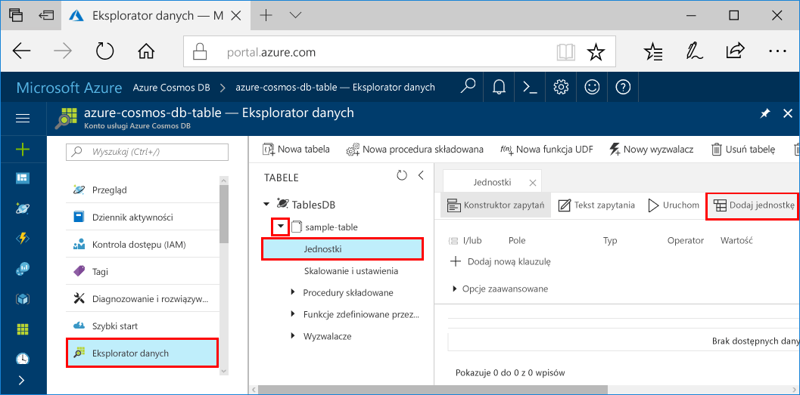

# <a name="azure-cosmos-db-build-a-net-application-using-hello-table-api"></a>Azure rozwiązania Cosmos bazy danych: Tworzenie aplikacji platformy .NET przy użyciu hello tabeli interfejsu API

Azure Cosmos DB to rozproszona globalnie wielomodelowa usługa bazy danych firmy Microsoft. Można szybko utworzyć i wyszukiwać dokumentu, klucza i wartości i wykres baz danych, które korzystają z dystrybucji globalne hello i możliwości skalowanie w poziomie na podstawowe hello Azure DB rozwiązania Cosmos. 

Przedstawiono to szybki start jak toocreate bazy danych Azure rozwiązania Cosmos kont i Utwórz tabelę w ramach tego konta za pomocą hello portalu Azure. Zostanie następnie napisać kod tooinsert, aktualizacji i usuwania jednostek oraz Uruchom kilka zapytań przy użyciu nowego hello [systemu Windows Azure magazynu Premium tabeli](https://aka.ms/premiumtablenuget) pakietu (wersja zapoznawcza) z pakietu NuGet. Ta biblioteka zawiera hello tej samej klasy i metody podpisy jako publiczny hello [zestawu SDK usługi Magazyn Azure z systemem Windows](https://www.nuget.org/packages/WindowsAzure.Storage), ale ma także hello możliwości tooconnect tooAzure DB rozwiązania Cosmos kont przy użyciu hello [tabeli interfejsu API](table-introduction.md) (wersja zapoznawcza). 

## <a name="prerequisites"></a>Wymagania wstępne

Jeśli nie masz jeszcze programu Visual Studio 2017 r zainstalowany, możesz pobrać i użyć hello **wolnego** [programu Visual Studio 2017 Community Edition](https://www.visualstudio.com/downloads/). Upewnij się, że możesz włączyć **Azure programowanie** podczas instalacji programu Visual Studio hello.

[!INCLUDE [quickstarts-free-trial-note](../../includes/quickstarts-free-trial-note.md)]

## <a name="create-a-database-account"></a>Tworzenie konta bazy danych

[!INCLUDE [cosmos-db-create-dbaccount-table](../../includes/cosmos-db-create-dbaccount-table.md)]

## <a name="add-a-table"></a>Dodawanie tabeli

[!INCLUDE [cosmos-db-create-table](../../includes/cosmos-db-create-table.md)]

## <a name="add-sample-data"></a>Dodawanie danych przykładowych

Teraz można dodać danych tooyour nową tabelę za pomocą Eksploratora danych (wersja zapoznawcza).

1. W Eksploratorze danych rozwiń węzeł **sample-table**, kliknij pozycję **Jednostki**, a następnie kliknij przycisk **Dodaj jednostkę**.

   
2. Teraz Dodaj danych toohello PartitionKey wartość pola i wartość RowKey i kliknij przycisk **Dodaj jednostki**.

   
  
    Można teraz dodać więcej jednostek tooyour tabeli, edytować jednostki lub wyszukiwanie danych w Eksploratorze danych. Eksplorator danych jest również, gdzie można skalować przepływność sieci i dodać procedury składowane, funkcje zdefiniowane przez użytkownika i wyzwalaczy tooyour tabeli.

## <a name="clone-hello-sample-application"></a>Klonowanie hello przykładowej aplikacji

Teraz załóżmy sklonować aplikacji przez tabelę z serwisu github, Ustaw ciąg połączenia hello i uruchom go. Zobaczysz, jak łatwo jest toowork z danymi programowo. 

1. Otwórz okno terminala git, np. git bash, i `cd` tooa katalog roboczy.  

2. Hello uruchom następujące polecenie tooclone hello próbki repozytorium. 

    ```bash
    git clone https://github.com/Azure-Samples/azure-cosmos-db-table-dotnet-getting-started.git
    ```

3. Następnie otwórz plik rozwiązania hello w programie Visual Studio. 

## <a name="review-hello-code"></a>Przejrzyj hello kodu

Upewnijmy szybki przegląd działania wykonywane w aplikacji hello. Hello Otwórz plik Program.cs i tam, że te wiersze kodu utworzyć hello zasobów bazy danych Azure rozwiązania Cosmos. 

* Witaj CloudTableClient został zainicjowany.

    ```csharp
    CloudStorageAccount storageAccount = CloudStorageAccount.Parse(connectionString); 
    CloudTableClient tableClient = storageAccount.CreateCloudTableClient();
    ```

* Tworzenie nowej tabeli, jeśli nie istnieje.

    ```csharp
    CloudTable table = tableClient.GetTableReference("people");
    table.CreateIfNotExists();
    ```

* Tworzenie nowego kontenera tabeli. Można zauważyć ten kod tooregular bardzo podobne magazynu tabel Azure SDK. 

    ```csharp
    CustomerEntity item = new CustomerEntity()
                {
                    PartitionKey = Guid.NewGuid().ToString(),
                    RowKey = Guid.NewGuid().ToString(),
                    Email = $"{GetRandomString(6)}@contoso.com",
                    PhoneNumber = "425-555-0102",
                    Bio = GetRandomString(1000)
                };
    ```

## <a name="update-your-connection-string"></a>Aktualizowanie parametrów połączenia

Teraz będziemy informować hello ciągu połączenia, aplikację można rozmawiać tooAzure DB rozwiązania Cosmos. 

1. W programie Visual Studio Otwórz plik app.config hello. 

2. W hello [portalu Azure](http://portal.azure.com/)w hello Azure DB rozwiązania Cosmos w lewo menu nawigacji, kliknij przycisk **ciąg połączenia**. W nowe okienko powitania kliknij przycisk Kopiuj hello hello ciągu połączenia. 

    

3. Wklej hello wartości w pliku app.config hello jako wartość hello hello PremiumStorageConnectionString. 

    `<add key="PremiumStorageConnectionString" 
        value="DefaultEndpointsProtocol=https;AccountName=MYSTORAGEACCOUNT;AccountKey=AUTHKEY;TableEndpoint=https://COSMOSDB.documents.azure.com" />`    

    Możesz pozostawić hello StandardStorageConnectionString jest.

Użytkownik zaktualizował teraz aplikacji z wszystkie informacje hello musi toocommunicate z bazy danych Azure rozwiązania Cosmos. 

## <a name="run-hello-web-app"></a>Uruchamianie aplikacji sieci web hello

1. W programie Visual Studio, kliknij prawym przyciskiem myszy hello **PremiumTableGetStarted** projektu w **Eksploratora rozwiązań** , a następnie kliknij przycisk **Zarządzaj pakietami NuGet**. 

2. W hello NuGet **Przeglądaj** wpisz *WindowsAzure.Storage PremiumTable*.

3. Sprawdź hello **Uwzględnij wersję wstępną** pole. 

4. Wyniki hello zainstalować hello **WindowsAzure.Storage PremiumTable** biblioteki. Spowoduje to zainstalowanie Podgląd hello pakietu interfejsu API Azure rozwiązania Cosmos DB tabeli, a także wszystkie zależności. Należy pamiętać, że jest pakietem NuGet innego niż hello pakietu Windows Azure Storage używane przez Magazyn tabel Azure. 

5. Kliknij polecenie CTRL + F5 toorun hello aplikacji.

    okno konsoli Hello wyświetla dane hello dodane, pobieranie, proszeni, zastąpione i usunięty z tabeli hello. Po ukończeniu działania skryptu hello naciśnij dowolnego okna konsoli hello tooclose klucza. 
    
    

6. Jeśli chcesz, aby toosee hello nowe jednostki w Eksploratorze danych, po prostu komentarz linii 188 208 w pliku program.cs nie są one usunąć, następnie uruchom przykładowe hello ponownie. 

    Teraz wróć do tooData Explorer, kliknij przycisk **Odśwież**, rozwiń hello **osób** tabeli, a następnie kliknij przycisk **jednostek**, a następnie pracy z tym nowych danych. 

    

## <a name="review-slas-in-hello-azure-portal"></a>Przejrzyj umowy SLA w hello portalu Azure

[!INCLUDE [cosmosdb-tutorial-review-slas](../../includes/cosmos-db-tutorial-review-slas.md)]

## <a name="clean-up-resources"></a>Oczyszczanie zasobów

Jeśli nie będzie toocontinue toouse tej aplikacji, należy usunąć wszystkie zasoby utworzone przez tego przewodnika Szybki Start w hello portalu Azure z hello następujące kroki: 

1. Z menu po lewej stronie powitania w hello portalu Azure, kliknij przycisk **grup zasobów** a następnie kliknij nazwę hello zasobu hello został utworzony. 
2. Na stronie grupy zasobów, kliknij przycisk **usunąć**, wpisz nazwę hello toodelete zasobów hello w polu tekstowym hello, a następnie kliknij **usunąć**.

## <a name="next-steps"></a>Następne kroki

W tym szybkiego startu kiedy znasz już jak tworzyć tabel za pomocą Eksploratora danych hello toocreate konto bazy danych Azure rozwiązania Cosmos i uruchom aplikację.  Teraz można badać danych przy użyciu hello tabeli interfejsu API.  

> [!div class="nextstepaction"]
> [Zapytanie, używając hello tabeli interfejsu API](tutorial-query-table.md)

