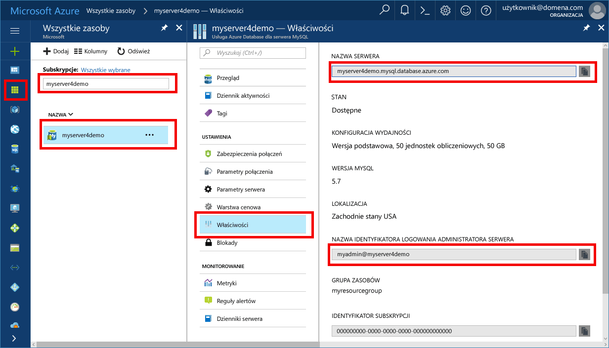

# <a name="migrate-your-mysql-database-by-using-import-and-export"></a><span data-ttu-id="cbf37-103">Migrowanie bazy danych MySQL za pomocą importowania i eksportowania</span><span class="sxs-lookup"><span data-stu-id="cbf37-103">Migrate your MySQL database by using import and export</span></span>
<span data-ttu-id="cbf37-104">W tym artykule opisano dwie typowe tooimporting podejścia i eksportowanie danych tooan Azure bazy danych MySQL serwera przy użyciu narzędzia MySQL Workbench.</span><span class="sxs-lookup"><span data-stu-id="cbf37-104">This article explains two common approaches tooimporting and exporting data tooan Azure Database for MySQL server by using MySQL Workbench.</span></span> 

## <a name="before-you-begin"></a><span data-ttu-id="cbf37-105">Przed rozpoczęciem</span><span class="sxs-lookup"><span data-stu-id="cbf37-105">Before you begin</span></span>
<span data-ttu-id="cbf37-106">toostep za pośrednictwem tego jak tooguide, potrzebne są:</span><span class="sxs-lookup"><span data-stu-id="cbf37-106">toostep through this how-tooguide, you need:</span></span>
- <span data-ttu-id="cbf37-107">Bazy danych Azure dla serwera MySQL, wykonując [utworzenia bazy danych Azure dla serwera MySQL przy użyciu portalu Azure](quickstart-create-mysql-server-database-using-azure-portal.md).</span><span class="sxs-lookup"><span data-stu-id="cbf37-107">An Azure Database for MySQL server, by following [Create an Azure Database for MySQL server using Azure portal](quickstart-create-mysql-server-database-using-azure-portal.md).</span></span>
- <span data-ttu-id="cbf37-108">MySQL Workbench [pobrane](https://dev.mysql.com/downloads/workbench/), lub inny tooimport narzędzie MySQL i eksportu.</span><span class="sxs-lookup"><span data-stu-id="cbf37-108">MySQL Workbench [downloaded](https://dev.mysql.com/downloads/workbench/), or another MySQL tool tooimport and export.</span></span>

## <a name="use-common-tools"></a><span data-ttu-id="cbf37-109">Użyj standardowych narzędzi</span><span class="sxs-lookup"><span data-stu-id="cbf37-109">Use common tools</span></span>
<span data-ttu-id="cbf37-110">Użyj standardowych narzędzi, takich jak MySQL Workbench, Toad lub Navicat tooremotely Połącz się i Importuj lub Eksportuj dane do bazy danych Azure dla programu MySQL.</span><span class="sxs-lookup"><span data-stu-id="cbf37-110">Use common tools such as MySQL Workbench, Toad, or Navicat tooremotely connect and import or export data into Azure Database for MySQL.</span></span> 

<span data-ttu-id="cbf37-111">Użycie tych narzędzi na komputerze klienckim z tooAzure tooconnect połączenia internetowego bazy danych MySQL.</span><span class="sxs-lookup"><span data-stu-id="cbf37-111">Use such tools on your client machine with an Internet connection tooconnect tooAzure Database for MySQL.</span></span> <span data-ttu-id="cbf37-112">Użyj połączenia z protokołem szyfrowania SSL dla najlepsze rozwiązania w zakresie zabezpieczeń, zgodnie z opisem w [łączności Konfigurowanie protokołu SSL w bazie danych Azure dla programu MySQL](concepts-ssl-connection-security.md).</span><span class="sxs-lookup"><span data-stu-id="cbf37-112">Use an SSL-encrypted connection for best security practices, as described in [Configure SSL connectivity in Azure Database for MySQL](concepts-ssl-connection-security.md).</span></span>

<span data-ttu-id="cbf37-113">Nie należy toomove importowanie i eksportowanie lokalizacji specjalne chmury tooany plików, podczas migracji tooAzure bazy danych dla programu MySQL.</span><span class="sxs-lookup"><span data-stu-id="cbf37-113">You do not need toomove your import and export files tooany special cloud location when migrating tooAzure Database for MySQL.</span></span> 

## <a name="create-a-database-on-hello-azure-database-for-mysql-server"></a><span data-ttu-id="cbf37-114">Utwórz bazę danych na hello Azure bazy danych MySQL serwera</span><span class="sxs-lookup"><span data-stu-id="cbf37-114">Create a database on hello Azure Database for MySQL server</span></span>
<span data-ttu-id="cbf37-115">Utwórz pustą bazę danych na hello Azure bazy danych dla serwera MySQL, gdzie chcesz toomigrate hello dane.</span><span class="sxs-lookup"><span data-stu-id="cbf37-115">Create an empty database on hello Azure Database for MySQL server where you want toomigrate hello data.</span></span> <span data-ttu-id="cbf37-116">Za pomocą narzędzia, takie jak bazy danych hello toocreate MySQL Workbench, Toad lub Navicat.</span><span class="sxs-lookup"><span data-stu-id="cbf37-116">Use a tool such as MySQL Workbench, Toad, or Navicat toocreate hello database.</span></span> <span data-ttu-id="cbf37-117">Witaj baza danych może mieć hello sama nazwa jak hello baza danych zawiera dane utworzyć zrzutu hello, lub można utworzyć bazę danych pod inną nazwą.</span><span class="sxs-lookup"><span data-stu-id="cbf37-117">hello database can have hello same name as hello database that contains hello dumped data, or you can create a database with a different name.</span></span>

<span data-ttu-id="cbf37-118">tooget podłączony, Znajdź informacje o połączeniu hello na powitania **właściwości** okienko w bazie danych Azure dla programu MySQL.</span><span class="sxs-lookup"><span data-stu-id="cbf37-118">tooget connected, locate hello connection information on hello **Properties** pane in Azure Database for MySQL.</span></span>



<span data-ttu-id="cbf37-120">Dodaj hello połączenia informacji tooMySQL Workbench.</span><span class="sxs-lookup"><span data-stu-id="cbf37-120">Add hello connection information tooMySQL Workbench.</span></span>


## <a name="determine-when-toouse-import-and-export-techniques-instead-of-a-dump-and-restore"></a><span data-ttu-id="cbf37-122">Określania, kiedy toouse importowania i eksportowania techniki zamiast zrzutu i przywracania</span><span class="sxs-lookup"><span data-stu-id="cbf37-122">Determine when toouse import and export techniques instead of a dump and restore</span></span>
<span data-ttu-id="cbf37-123">Użyj tooimport narzędzia MySQL i eksportowanie bazy danych do bazy danych MySQL Azure w hello następujące scenariusze.</span><span class="sxs-lookup"><span data-stu-id="cbf37-123">Use MySQL tools tooimport and export databases into Azure MySQL Database in hello following scenarios.</span></span> <span data-ttu-id="cbf37-124">W innych sytuacjach mogą korzystać z hello [zrzutu i przywrócić](concepts-migrate-dump-restore.md) zamiast tego podejścia.</span><span class="sxs-lookup"><span data-stu-id="cbf37-124">In other scenarios, you might benefit from using hello [dump and restore](concepts-migrate-dump-restore.md) approach instead.</span></span> 

- <span data-ttu-id="cbf37-125">Gdy potrzebne są tooselectively wybrać kilka tooimport tabel z istniejącej bazy danych MySQL do bazy danych MySQL Azure, jego najlepszych toouse hello importu i eksportu techniki.</span><span class="sxs-lookup"><span data-stu-id="cbf37-125">When you need tooselectively choose a few tables tooimport from an existing MySQL database into Azure MySQL Database, it's best toouse hello import and export technique.</span></span>  <span data-ttu-id="cbf37-126">W ten sposób można pominąć wszystkie zbędne tabele z hello migracji toosave czasu i zasobów.</span><span class="sxs-lookup"><span data-stu-id="cbf37-126">By doing so, you can omit any unneeded tables from hello migration toosave time and resources.</span></span> <span data-ttu-id="cbf37-127">Na przykład użyć hello `--include-tables` lub `--exclude-tables` przełącznik z [mysqlpump](https://dev.mysql.com/doc/refman/5.7/en/mysqlpump.html#option_mysqlpump_include-tables) i hello `--tables` przełącznik z [mysqldump](https://dev.mysql.com/doc/refman/5.7/en/mysqldump.html#option_mysqldump_tables).</span><span class="sxs-lookup"><span data-stu-id="cbf37-127">For example, use hello `--include-tables` or `--exclude-tables` switch with [mysqlpump](https://dev.mysql.com/doc/refman/5.7/en/mysqlpump.html#option_mysqlpump_include-tables) and hello `--tables` switch with [mysqldump](https://dev.mysql.com/doc/refman/5.7/en/mysqldump.html#option_mysqldump_tables).</span></span>
- <span data-ttu-id="cbf37-128">Podczas przenoszenia hello obiektów bazy danych innej niż tabele, jawnie utwórz je.</span><span class="sxs-lookup"><span data-stu-id="cbf37-128">When you're moving hello database objects other than tables, explicitly create those.</span></span> <span data-ttu-id="cbf37-129">Obejmują ograniczenia (klucz podstawowy, klucz obcy, indeksy), widoki, funkcje, procedur, wyzwalaczy i inne bazy danych obiektów, które mają toomigrate.</span><span class="sxs-lookup"><span data-stu-id="cbf37-129">Include constraints (primary key, foreign key, indexes), views, functions, procedures, triggers, and any other database objects that you want toomigrate.</span></span>
- <span data-ttu-id="cbf37-130">Podczas migracji danych z zewnętrznych źródeł danych innego niż bazy danych MySQL, tworzenia plików prostych i zaimportuj je za pomocą [mysqlimport](https://dev.mysql.com/doc/refman/5.7/en/mysqlimport.html).</span><span class="sxs-lookup"><span data-stu-id="cbf37-130">When you're migrating data from external data sources other than a MySQL database, create flat files and import them by using [mysqlimport](https://dev.mysql.com/doc/refman/5.7/en/mysqlimport.html).</span></span>

<span data-ttu-id="cbf37-131">Upewnij się, że wszystkie tabele w bazie danych hello używać aparatu magazynu InnoDB hello podczas ładowania danych do bazy danych Azure dla programu MySQL.</span><span class="sxs-lookup"><span data-stu-id="cbf37-131">Make sure that all tables in hello database use hello InnoDB storage engine when you're loading data into Azure Database for MySQL.</span></span> <span data-ttu-id="cbf37-132">Bazy danych platformy Azure dla programu MySQL obsługuje tylko hello InnoDB aparatu magazynu, więc nie obsługuje aparaty alternatywnych magazynu.</span><span class="sxs-lookup"><span data-stu-id="cbf37-132">Azure Database for MySQL supports only hello InnoDB storage engine, so it doesn't support alternative storage engines.</span></span> <span data-ttu-id="cbf37-133">Jeśli tabele wymagają magazynu alternatywnych aparatów, tooconvert się, że można je toouse hello InnoDB aparat formatu przed hello tooAzure migracji bazy danych dla programu MySQL.</span><span class="sxs-lookup"><span data-stu-id="cbf37-133">If your tables require alternative storage engines, be sure tooconvert them toouse hello InnoDB engine format before hello migration tooAzure Database for MySQL.</span></span> 

<span data-ttu-id="cbf37-134">Na przykład jeśli WordPress lub sieci web aplikacji, który używa aparatu MyISAM hello, najpierw przekonwertuj tabele hello przez migrację danych hello na InnoDB tabel.</span><span class="sxs-lookup"><span data-stu-id="cbf37-134">For example, if you have a WordPress or web app that uses hello MyISAM engine, first convert hello tables by migrating hello data into InnoDB tables.</span></span> <span data-ttu-id="cbf37-135">Następnie należy przywrócić tooAzure bazy danych dla programu MySQL.</span><span class="sxs-lookup"><span data-stu-id="cbf37-135">Then restore tooAzure Database for MySQL.</span></span> <span data-ttu-id="cbf37-136">Użycie klauzuli hello `ENGINE=INNODB` tooset hello aparatu tworzenia spisu, a następnie transfer danych hello do tabeli zgodne hello przed migracją hello.</span><span class="sxs-lookup"><span data-stu-id="cbf37-136">Use hello clause `ENGINE=INNODB` tooset hello engine for creating a table, and then transfer hello data into hello compatible table before hello migration.</span></span> 

   ```sql
   INSERT INTO innodb_table SELECT * FROM myisam_table ORDER BY primary_key_columns
   ```

## <a name="performance-recommendations-for-import-and-export"></a><span data-ttu-id="cbf37-137">Zalecenia dotyczące wydajności importowania i eksportowania</span><span class="sxs-lookup"><span data-stu-id="cbf37-137">Performance recommendations for import and export</span></span>
-   <span data-ttu-id="cbf37-138">Przed załadowaniem danych, należy utworzyć indeksy klastrowane i klucze podstawowe.</span><span class="sxs-lookup"><span data-stu-id="cbf37-138">Create clustered indexes and primary keys before loading data.</span></span> <span data-ttu-id="cbf37-139">Ładowanie danych w kolejności klucza podstawowego.</span><span class="sxs-lookup"><span data-stu-id="cbf37-139">Load data in primary key order.</span></span> 
-   <span data-ttu-id="cbf37-140">Opóźnienie tworzenia indeksów pomocniczych dopiero po danych została załadowana.</span><span class="sxs-lookup"><span data-stu-id="cbf37-140">Delay creation of secondary indexes until after data is loaded.</span></span> <span data-ttu-id="cbf37-141">Tworzenie wszystkich indeksów pomocniczych po załadowaniu.</span><span class="sxs-lookup"><span data-stu-id="cbf37-141">Create all secondary indexes after loading.</span></span> 
-   <span data-ttu-id="cbf37-142">Wyłącz ograniczeń klucza obcego przed załadowaniem.</span><span class="sxs-lookup"><span data-stu-id="cbf37-142">Disable foreign key constraints before loading.</span></span> <span data-ttu-id="cbf37-143">Wyłączenie sprawdzania klucza obcego zapewnia znaczący wzrost wydajności.</span><span class="sxs-lookup"><span data-stu-id="cbf37-143">Disabling foreign key checks provides significant performance gains.</span></span> <span data-ttu-id="cbf37-144">Włącz ograniczenia hello i zweryfikować danych na powitania po hello integralności referencyjnej tooensure obciążenia.</span><span class="sxs-lookup"><span data-stu-id="cbf37-144">Enable hello constraints and verify hello data after hello load tooensure referential integrity.</span></span>
-   <span data-ttu-id="cbf37-145">Ładowanie danych równolegle.</span><span class="sxs-lookup"><span data-stu-id="cbf37-145">Load data in parallel.</span></span> <span data-ttu-id="cbf37-146">Należy unikać zbyt dużo równoległości, które mogłyby spowodować toohit limit zasobów i monitorowanie zasobów przy użyciu metryk hello dostępne w portalu Azure hello.</span><span class="sxs-lookup"><span data-stu-id="cbf37-146">Avoid too much parallelism that would cause you toohit a resource limit, and monitor resources by using hello metrics available in hello Azure portal.</span></span> 
-   <span data-ttu-id="cbf37-147">Użyj podzielonych tabel, gdy jest to konieczne.</span><span class="sxs-lookup"><span data-stu-id="cbf37-147">Use partitioned tables when appropriate.</span></span>

## <a name="import-and-export-by-using-mysql-workbench"></a><span data-ttu-id="cbf37-148">Importowanie i eksportowanie przy użyciu narzędzia MySQL Workbench</span><span class="sxs-lookup"><span data-stu-id="cbf37-148">Import and export by using MySQL Workbench</span></span>
<span data-ttu-id="cbf37-149">Istnieją dwa sposoby tooexport, a następnie zaimportuj dane w MySQL Workbench.</span><span class="sxs-lookup"><span data-stu-id="cbf37-149">There are two ways tooexport and import data in MySQL Workbench.</span></span> <span data-ttu-id="cbf37-150">Każdy służy do innych celów.</span><span class="sxs-lookup"><span data-stu-id="cbf37-150">Each serves a different purpose.</span></span> 

### <a name="table-data-export-and-import-wizards-from-hello-object-browsers-context-menu"></a><span data-ttu-id="cbf37-151">Dane tabeli eksportować i importować kreatorów z menu kontekstowego przeglądarki obiektów hello</span><span class="sxs-lookup"><span data-stu-id="cbf37-151">Table data export and import wizards from hello object browser's context menu</span></span>


<span data-ttu-id="cbf37-153">Kreatorzy Hello dla tabeli danych obsługuje importowania i eksportowania operacje przy użyciu plików CSV i JSON.</span><span class="sxs-lookup"><span data-stu-id="cbf37-153">hello wizards for table data support import and export operations by using CSV and JSON files.</span></span> <span data-ttu-id="cbf37-154">Obejmują one kilka opcji konfiguracji, takich jak separatorów, wybór kolumn i wybór kodowania.</span><span class="sxs-lookup"><span data-stu-id="cbf37-154">They include several configuration options, such as separators, column selection, and encoding selection.</span></span> <span data-ttu-id="cbf37-155">Można wykonywać każdego kreatora względem lokalne lub zdalne połączonych serwerów MySQL.</span><span class="sxs-lookup"><span data-stu-id="cbf37-155">You can perform each wizard against local or remotely connected MySQL servers.</span></span> <span data-ttu-id="cbf37-156">Akcja importu Hello obejmuje tabeli, kolumny i mapowania typu.</span><span class="sxs-lookup"><span data-stu-id="cbf37-156">hello import action includes table, column, and type mapping.</span></span> 

<span data-ttu-id="cbf37-157">Dostępne z tych kreatorów z menu kontekstowego przeglądarki obiektów hello, klikając prawym przyciskiem myszy tabelę.</span><span class="sxs-lookup"><span data-stu-id="cbf37-157">You can access these wizards from hello object browser's context menu by right-clicking a table.</span></span> <span data-ttu-id="cbf37-158">Następnie wybierz opcję **Kreatora eksportu danych tabeli** lub **Kreatora importu danych tabeli**.</span><span class="sxs-lookup"><span data-stu-id="cbf37-158">Then choose either **Table Data Export Wizard** or **Table Data Import Wizard**.</span></span> 

#### <a name="table-data-export-wizard"></a><span data-ttu-id="cbf37-159">Kreator eksportu danych tabeli</span><span class="sxs-lookup"><span data-stu-id="cbf37-159">Table Data Export Wizard</span></span>
<span data-ttu-id="cbf37-160">Witaj poniższy przykład eksportuje plik CSV tooa tabeli hello:</span><span class="sxs-lookup"><span data-stu-id="cbf37-160">hello following example exports hello table tooa CSV file:</span></span> 
1. <span data-ttu-id="cbf37-161">Kliknij prawym przyciskiem myszy hello spis toobe bazy danych hello wyeksportowane.</span><span class="sxs-lookup"><span data-stu-id="cbf37-161">Right-click hello table of hello database toobe exported.</span></span> 
2. <span data-ttu-id="cbf37-162">Wybierz **tabeli Kreator eksportu danych**.</span><span class="sxs-lookup"><span data-stu-id="cbf37-162">Select **Table Data Export Wizard**.</span></span> <span data-ttu-id="cbf37-163">Wybierz hello kolumn toobe wyeksportowane, przesunięcie wiersza (jeśli istnieje) i count (jeśli istnieje).</span><span class="sxs-lookup"><span data-stu-id="cbf37-163">Select hello columns toobe exported, row offset (if any), and count (if any).</span></span> 
3. <span data-ttu-id="cbf37-164">Na powitania **wybierz dane do wyeksportowania** kliknij przycisk **dalej**.</span><span class="sxs-lookup"><span data-stu-id="cbf37-164">On hello **Select data for export** page, click **Next**.</span></span> <span data-ttu-id="cbf37-165">Wybierz ścieżkę pliku hello, CSV lub JSON typu pliku.</span><span class="sxs-lookup"><span data-stu-id="cbf37-165">Select hello file path, CSV, or JSON file type.</span></span> <span data-ttu-id="cbf37-166">Wybierz również hello linii separatora, metody otaczającej ciągów i separator pola.</span><span class="sxs-lookup"><span data-stu-id="cbf37-166">Also select hello line separator, method of enclosing strings, and field separator.</span></span> 
4. <span data-ttu-id="cbf37-167">Na powitania **lokalizacja pliku wyjściowego wybierz** kliknij przycisk **dalej**.</span><span class="sxs-lookup"><span data-stu-id="cbf37-167">On hello **Select output file location** page, click **Next**.</span></span> 
5. <span data-ttu-id="cbf37-168">Na powitania **eksportować dane** kliknij przycisk **dalej**.</span><span class="sxs-lookup"><span data-stu-id="cbf37-168">On hello **Export data** page, click **Next**.</span></span>

#### <a name="table-data-import-wizard"></a><span data-ttu-id="cbf37-169">Kreator importu tabeli danych</span><span class="sxs-lookup"><span data-stu-id="cbf37-169">Table Data Import Wizard</span></span>
<span data-ttu-id="cbf37-170">Witaj poniższy przykład importuje hello tabeli z pliku CSV:</span><span class="sxs-lookup"><span data-stu-id="cbf37-170">hello following example imports hello table from a CSV file:</span></span>
1. <span data-ttu-id="cbf37-171">Kliknij prawym przyciskiem myszy hello spis toobe bazy danych hello zaimportowane.</span><span class="sxs-lookup"><span data-stu-id="cbf37-171">Right-click hello table of hello database toobe imported.</span></span> 
2. <span data-ttu-id="cbf37-172">Wybierz tooand przeglądania hello zaimportowane toobe pliku CSV, a następnie kliknij **dalej**.</span><span class="sxs-lookup"><span data-stu-id="cbf37-172">Browse tooand select hello CSV file toobe imported, and then click **Next**.</span></span> 
3. <span data-ttu-id="cbf37-173">Wybierz tabelę docelową hello (nowego lub istniejącego) i hello zaznacz lub usuń zaznaczenie **Truncate table przed rozpoczęciem importowania** pole wyboru.</span><span class="sxs-lookup"><span data-stu-id="cbf37-173">Select hello destination table (new or existing), and select or clear hello **Truncate table before import** check box.</span></span> <span data-ttu-id="cbf37-174">Kliknij przycisk **Dalej**.</span><span class="sxs-lookup"><span data-stu-id="cbf37-174">Click **Next**.</span></span>
4. <span data-ttu-id="cbf37-175">Wybierz kodowanie i hello toobe kolumn zaimportowane, a następnie kliknij przycisk **dalej**.</span><span class="sxs-lookup"><span data-stu-id="cbf37-175">Select encoding and hello columns toobe imported, and then click **Next**.</span></span> 
5. <span data-ttu-id="cbf37-176">Na powitania **importowania danych** kliknij przycisk **dalej**.</span><span class="sxs-lookup"><span data-stu-id="cbf37-176">On hello **Import data** page, click **Next**.</span></span> <span data-ttu-id="cbf37-177">Kreator Hello odpowiednio importuje hello danych.</span><span class="sxs-lookup"><span data-stu-id="cbf37-177">hello wizard imports hello data accordingly.</span></span>

### <a name="sql-data-export-and-import-wizards-from-hello-navigator-pane"></a><span data-ttu-id="cbf37-178">Danych SQL eksportować i importować kreatorów z okienka Navigator hello</span><span class="sxs-lookup"><span data-stu-id="cbf37-178">SQL data export and import wizards from hello Navigator pane</span></span>
<span data-ttu-id="cbf37-179">Użyj tooexport kreatora lub zaimportować SQL generowane na podstawie MySQL Workbench lub wygenerować hello mysqldump polecenia.</span><span class="sxs-lookup"><span data-stu-id="cbf37-179">Use a wizard tooexport or import SQL generated from MySQL Workbench or generated from hello mysqldump command.</span></span> <span data-ttu-id="cbf37-180">Dostęp do tych kreatorów z hello **Nawigator** okienku lub wybierając **serwera** z hello menu głównego.</span><span class="sxs-lookup"><span data-stu-id="cbf37-180">Access these wizards from hello **Navigator** pane or by selecting **Server** from hello main menu.</span></span> <span data-ttu-id="cbf37-181">Następnie wybierz **eksportu danych** lub **importowania danych**.</span><span class="sxs-lookup"><span data-stu-id="cbf37-181">Then select **Data Export** or **Data Import**.</span></span> 

#### <a name="data-export"></a><span data-ttu-id="cbf37-182">Eksportowanie danych</span><span class="sxs-lookup"><span data-stu-id="cbf37-182">Data Export</span></span>


<span data-ttu-id="cbf37-184">Można użyć hello **eksportu danych** karcie tooexport danych MySQL.</span><span class="sxs-lookup"><span data-stu-id="cbf37-184">You can use hello **Data Export** tab tooexport your MySQL data.</span></span> 
1. <span data-ttu-id="cbf37-185">Wybierz każdego schematu, że mają tooexport, opcjonalnie wybierz schematu obiektów/tabel z każdym ze schematów, a Generowanie hello eksportu.</span><span class="sxs-lookup"><span data-stu-id="cbf37-185">Select each schema that you want tooexport, optionally choose specific schema objects/tables from each schema, and generate hello export.</span></span> <span data-ttu-id="cbf37-186">Opcje konfiguracji obejmują niezależne SQL pliku lub folderu projektu tooa eksportu, zrzutu procedury składowane i zdarzenia lub pominąć danych tabeli.</span><span class="sxs-lookup"><span data-stu-id="cbf37-186">Configuration options include export tooa project folder or self-contained SQL file, dump stored routines and events, or skip table data.</span></span> 
 
   <span data-ttu-id="cbf37-187">Można również użyć **wyeksportować zestawu wyników** tooexport wynik określonego zestawu w hello SQL Edytor tooanother formacie, na przykład woluminów CSV, JSON, HTML i XML.</span><span class="sxs-lookup"><span data-stu-id="cbf37-187">Alternatively, use **Export a Result Set** tooexport a specific result set in hello SQL editor tooanother format, such as CSV, JSON, HTML, and XML.</span></span> 
3. <span data-ttu-id="cbf37-188">Wybierz tooexport obiektów bazy danych hello i skonfiguruj hello powiązane opcje.</span><span class="sxs-lookup"><span data-stu-id="cbf37-188">Select hello database objects tooexport, and configure hello related options.</span></span>
4. <span data-ttu-id="cbf37-189">Kliknij przycisk **Odśwież** tooload hello obiekty.</span><span class="sxs-lookup"><span data-stu-id="cbf37-189">Click **Refresh** tooload hello current objects.</span></span>
5. <span data-ttu-id="cbf37-190">Opcjonalnie można otworzyć hello **zaawansowane opcje** karcie operacji eksportowania hello toorefine.</span><span class="sxs-lookup"><span data-stu-id="cbf37-190">Optionally, open hello **Advanced Options** tab toorefine hello export operation.</span></span> <span data-ttu-id="cbf37-191">Na przykład dodać blokady tabeli, Zastąp Użyj zamiast instrukcji insert i identyfikatory oferty backtick znaków.</span><span class="sxs-lookup"><span data-stu-id="cbf37-191">For example, add table locks, use replace instead of insert statements, and quote identifiers with backtick characters.</span></span>
6. <span data-ttu-id="cbf37-192">Kliknij przycisk **Uruchom eksportowanie** toobegin hello Eksport.</span><span class="sxs-lookup"><span data-stu-id="cbf37-192">Click **Start Export** toobegin hello export process.</span></span>


#### <a name="data-import"></a><span data-ttu-id="cbf37-193">Importowanie danych</span><span class="sxs-lookup"><span data-stu-id="cbf37-193">Data Import</span></span>


<span data-ttu-id="cbf37-195">Można użyć hello **importowania danych** karcie tooimport lub Przywróć wyeksportowanych danych z operacji eksportowania danych hello lub hello mysqldump polecenia.</span><span class="sxs-lookup"><span data-stu-id="cbf37-195">You can use hello **Data Import** tab tooimport or restore exported data from hello data export operation or from hello mysqldump command.</span></span> 
1. <span data-ttu-id="cbf37-196">Wybierz folder projektu hello lub niezależnym pliku SQL, wybierz hello tooimport schematu do lub **nowy** toodefine nowego schematu.</span><span class="sxs-lookup"><span data-stu-id="cbf37-196">Choose hello project folder or self-contained SQL file, choose hello schema tooimport into, or choose **New** toodefine a new schema.</span></span> 
2. <span data-ttu-id="cbf37-197">Kliknij przycisk **Start zaimportować** procesu importowania hello toobegin.</span><span class="sxs-lookup"><span data-stu-id="cbf37-197">Click **Start Import** toobegin hello import process.</span></span>

## <a name="next-steps"></a><span data-ttu-id="cbf37-198">Następne kroki</span><span class="sxs-lookup"><span data-stu-id="cbf37-198">Next steps</span></span>
<span data-ttu-id="cbf37-199">Jako innego sposobu migracji, należy przeczytać [migracji, używając bazy danych MySQL zrzutu i przywrócić w bazie danych Azure dla programu MySQL](concepts-migrate-dump-restore.md).</span><span class="sxs-lookup"><span data-stu-id="cbf37-199">As another migration approach, read [Migrate your MySQL database using dump and restore in Azure Database for MySQL](concepts-migrate-dump-restore.md).</span></span> 
