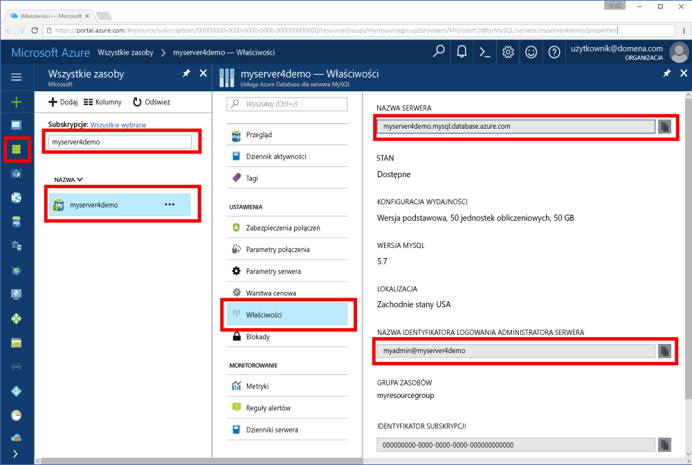

# <a name="azure-database-for-mysql-use-go-language-tooconnect-and-query-data"></a>Bazy danych platformy Azure dla programu MySQL: Użyj Przejdź tooconnect i zapytań danych przy użyciu języka
Ta opcja szybkiego startu przedstawia sposób tooconnect tooan bazy danych platformy Azure dla MySQL przy użyciu kodu hello napisanych w [Przejdź](https://golang.org/) języka z systemu Windows, Ubuntu Linux i Apple macOS platform. Widoczny jest sposób toouse tooquery instrukcji SQL, wstawiania, aktualizowania i usuwania danych w bazie danych hello. W tym artykule przyjęto założenie, że znasz Programowanie przy użyciu Go, ale, czy są nowe tooworking z bazą danych Azure dla programu MySQL.

## <a name="prerequisites"></a>Wymagania wstępne
Ta opcja szybkiego startu używa zasobów hello utworzone w jednym z tych wskazówek jako punktu wyjścia:
- [Tworzenie serwera usługi Azure Database for MySQL za pomocą witryny Azure Portal](./quickstart-create-mysql-server-database-using-azure-portal.md)
- [Tworzenie serwera usługi Azure Database for MySQL za pomocą interfejsu wiersza polecenia platformy Azure](./quickstart-create-mysql-server-database-using-azure-cli.md)

## <a name="install-go-and-mysql-connector"></a>Instalowanie środowiska języka Go i łącznika bazy danych MySQL
Zainstaluj [Przejdź](https://golang.org/doc/install) i hello [Przejdź sterownik sql dla programu MySQL](https://github.com/go-sql-driver/mysql#installation) na własnym komputerze. W zależności od platformy wykonaj kroki hello:

### <a name="windows"></a>Windows
1. [Pobierz](https://golang.org/dl/) i zainstalować Go systemu Microsoft Windows zgodnie z toohello [instrukcje dotyczące instalacji](https://golang.org/doc/install).
2. Uruchom wiersz polecenia hello z hello start menu.
3. Utwórz folder dla projektu, np. `mkdir  %USERPROFILE%\go\src\mysqlgo`.
4. Zmień katalog na folder projektu hello, takich jak `cd %USERPROFILE%\go\src\mysqlgo`.
5. Ustaw zmienne środowiskowe hello do katalogu kodu źródłowego toohello toopoint GOPATH. `set GOPATH=%USERPROFILE%\go`.
6. Zainstaluj hello [Przejdź sterownik sql dla programu mysql](https://github.com/go-sql-driver/mysql#installation) uruchamiając hello `go get github.com/go-sql-driver/mysql` polecenia.

   Podsumowując Zainstaluj Go, a następnie uruchom następujące polecenia w wierszu polecenia hello:
   ```cmd
   mkdir  %USERPROFILE%\go\src\mysqlgo
   cd %USERPROFILE%\go\src\mysqlgo
   set GOPATH=%USERPROFILE%\go
   go get github.com/go-sql-driver/mysql
   ```

### <a name="linux-ubuntu"></a>Linux (Ubuntu)
1. Uruchom program hello powłoki Bash. 
2. Zainstaluj środowisko języka Go, uruchamiając polecenie `sudo apt-get install golang-go`.
3. Utwórz folder dla projektu w katalogu macierzystym, np. `mkdir -p ~/go/src/mysqlgo/`.
4. Zmień katalog na hello folder, takich jak `cd ~/go/src/mysqlgo/`.
5. Zestaw hello GOPATH środowiska zmiennej toopoint tooa prawidłowe źródło katalogu, takiego jak domu bieżący folder przejdź do katalogu. W hello powłoki bash, uruchom `export GOPATH=~/go` tooadd hello Przejdź katalogu jako hello GOPATH dla bieżącej sesji powłoki hello.
6. Zainstaluj hello [Przejdź sterownik sql dla programu mysql](https://github.com/go-sql-driver/mysql#installation) uruchamiając hello `go get github.com/go-sql-driver/mysql` polecenia.

   Podsumowując: uruchom te polecenia programu Bash:
   ```bash
   sudo apt-get install golang-go
   mkdir -p ~/go/src/mysqlgo/
   cd ~/go/src/mysqlgo/
   export GOPATH=~/go/
   go get github.com/go-sql-driver/mysql
   ```

### <a name="apple-macos"></a>Apple macOS
1. Pobierz i zainstaluj Go zgodnie z toohello [instrukcje dotyczące instalacji](https://golang.org/doc/install) platformy do dopasowania. 
2. Uruchom program hello powłoki Bash. 
3. Utwórz folder dla projektu w katalogu macierzystym, np. `mkdir -p ~/go/src/mysqlgo/`.
4. Zmień katalog na hello folder, takich jak `cd ~/go/src/mysqlgo/`.
5. Zestaw hello GOPATH środowiska zmiennej toopoint tooa prawidłowe źródło katalogu, takiego jak domu bieżący folder przejdź do katalogu. W hello powłoki bash, uruchom `export GOPATH=~/go` tooadd hello Przejdź katalogu jako hello GOPATH dla bieżącej sesji powłoki hello.
6. Zainstaluj hello [Przejdź sterownik sql dla programu mysql](https://github.com/go-sql-driver/mysql#installation) uruchamiając hello `go get github.com/go-sql-driver/mysql` polecenia.

   Podsumowując: zainstaluj środowisko języka Go, następnie uruchom te polecenia programu Bash:
   ```bash
   mkdir -p ~/go/src/mysqlgo/
   cd ~/go/src/mysqlgo/
   export GOPATH=~/go/
   go get github.com/go-sql-driver/mysql
   ```

## <a name="get-connection-information"></a>Pobieranie informacji o połączeniu
Pobierz hello połączenia potrzebnych tooconnect toohello bazy danych platformy Azure dla programu MySQL. Należy hello serwera w pełni kwalifikowaną nazwę i poświadczenia logowania.

1. Zaloguj się za toohello [portalu Azure](https://portal.azure.com/).
2. Z menu po lewej stronie powitania w portalu Azure, kliknij przycisk **wszystkie zasoby** i wyszukaj hello serwera, musisz mieć wydłużało, takich jak **myserver4demo**.
3. Kliknij nazwę serwera hello **myserver4demo**.
4. Wybierz powitania serwera **właściwości** strony. Zanotuj hello **nazwy serwera** i **nazwę logowania administratora serwera**.
 
5. Jeśli użytkownik zapomni swoje informacje logowania serwera, przejdź toohello **omówienie** strony nazwę logowania administratora serwera hello tooview i w razie potrzeby zresetowania hasła hello.
   

## <a name="build-and-run-go-code"></a>Kompilowanie i uruchamianie kodu języka Go 
1. toowrite Golang kodu, można użyć edytora zwykłego tekstu, takiego jak Notatnik w systemie Microsoft Windows [vi](http://manpages.ubuntu.com/manpages/xenial/man1/nvi.1.html#contenttoc5) lub [Nano](https://www.nano-editor.org/) Ubuntu lub TextEdit w macOS. Jeśli wolisz bardziej zaawansowane środowisko IDE, wypróbuj rozwiązanie [Gogland](https://www.jetbrains.com/go/) firmy Jetbrains, edytor [Visual Studio Code](https://code.visualstudio.com/) firmy Microsoft lub [Atom](https://atom.io/).
2. Wklej kod Go z sekcjami hello hello do plików tekstowych i zapisać w folderze projektu z rozszerzeniem pliku \*.go, takich jak ścieżki systemu Windows `%USERPROFILE%\go\src\mysqlgo\createtable.go` lub ścieżka systemu Linux `~/go/src/mysqlgo/createtable.go`.
3. Zlokalizuj hello `HOST`, `DATABASE`, `USER`, i `PASSWORD` stałe w kodzie hello i Zastąp hello przykładowe wartości z własne wartości. 
4. Uruchom wiersz polecenia hello lub powłoki bash. Przejdź do folderu projektu. Na przykład w systemie Windows uruchom polecenie `cd %USERPROFILE%\go\src\mysqlgo\`. W systemie Linux: `cd ~/go/src/mysqlgo/`.  Niektóre z wymienionych edytory IDE hello oferują możliwości debugowania i środowiska uruchomieniowego bez konieczności poleceń powłoki.
5. Uruchom kod hello, wpisując polecenie hello `go run createtable.go` toocompile hello aplikacji i uruchom go. 
6. Alternatywnie toobuild hello kodu do natywnej aplikacji, `go build createtable.go`, uruchom `createtable.exe` toorun hello aplikacji.

## <a name="connect-create-table-and-insert-data"></a>Nawiązywanie połączenia, tworzenie tabeli i wstawianie danych
Użyj następujących hello kodu serwera toohello tooconnect, Utwórz tabelę i załadować hello danych przy użyciu **Wstaw** instrukcji SQL. 

Kod Hello importuje trzy pakiety: hello [pakietu sql](https://golang.org/pkg/database/sql/), hello [sterownik Przejdź sql dla programu mysql](https://github.com/go-sql-driver/mysql#installation) jako toocommunicate sterowników, z hello Azure bazy danych MySQL i hello [formatowaniu pakietu](https://golang.org/pkg/fmt/)dla drukowanej dane wejściowe i wyjściowe hello w wierszu polecenia.

Witaj kod wywołuje metodę [sql. Metody Open()](http://go-database-sql.org/accessing.html) tooAzure tooconnect bazy danych MySQL i kontroli hello połączenie za pomocą metody [bazy danych. Ping()](https://golang.org/pkg/database/sql/#DB.Ping). A [dojście do bazy danych](https://golang.org/pkg/database/sql/#DB) jest używana w całym, zawierający puli połączeń hello powitania serwera bazy danych. Witaj Witaj wywołań kodu [Exec()](https://golang.org/pkg/database/sql/#DB.Exec) metody toorun kilka razy niektóre polecenia języka DDL. Kod Hello używa również hello [Prepare()](http://go-database-sql.org/prepared.html) i Exec() toorun przygotowane instrukcje o innych parametrach tooinsert trzech wierszy. Zawsze metody checkError() niestandardowy jest toocheck używane, jeśli wystąpił błąd i awaryjne tooexit.

Zastąp hello `host`, `database`, `user`, i `password` stałe z własne wartości. 

```Go
package main

import (
    "database/sql"
    "fmt"

    _ "github.com/go-sql-driver/mysql"
)

const (
    host     = "myserver4demo.mysql.database.azure.com"
    database = "quickstartdb"
    user     = "myadmin@myserver4demo"
    password = "yourpassword"
)

func checkError(err error) {
    if err != nil {
        panic(err)
    }
}

func main() {

    // Initialize connection string.
    var connectionString = fmt.Sprintf("%s:%s@tcp(%s:3306)/%s?allowNativePasswords=true", user, password, host, database)

    // Initialize connection object.
    db, err := sql.Open("mysql", connectionString)
    checkError(err)
    defer db.Close()

    err = db.Ping()
    checkError(err)
    fmt.Println("Successfully created connection toodatabase.")

    // Drop previous table of same name if one exists.
    _, err = db.Exec("DROP TABLE IF EXISTS inventory;")
    checkError(err)
    fmt.Println("Finished dropping table (if existed).")

    // Create table.
    _, err = db.Exec("CREATE TABLE inventory (id serial PRIMARY KEY, name VARCHAR(50), quantity INTEGER);")
    checkError(err)
    fmt.Println("Finished creating table.")

    // Insert some data into table.
    sqlStatement, err := db.Prepare("INSERT INTO inventory (name, quantity) VALUES (?, ?);")
    res, err := sqlStatement.Exec("banana", 150)
    checkError(err)
    rowCount, err := res.RowsAffected()
    fmt.Printf("Inserted %d row(s) of data.\n", rowCount)

    res, err = sqlStatement.Exec("orange", 154)
    checkError(err)
    rowCount, err = res.RowsAffected()
    fmt.Printf("Inserted %d row(s) of data.\n", rowCount)

    res, err = sqlStatement.Exec("apple", 100)
    checkError(err)
    rowCount, err = res.RowsAffected()
    fmt.Printf("Inserted %d row(s) of data.\n", rowCount)
    fmt.Println("Done.")
}

```

## <a name="read-data"></a>Odczyt danych
Użyj hello następujący kod tooconnect i odczytu hello danych przy użyciu **wybierz** instrukcji SQL. 

Kod Hello importuje trzy pakiety: hello [pakietu sql](https://golang.org/pkg/database/sql/), hello [sterownik Przejdź sql dla programu mysql](https://github.com/go-sql-driver/mysql#installation) jako toocommunicate sterowników, z hello Azure bazy danych MySQL i hello [formatowaniu pakietu](https://golang.org/pkg/fmt/)dla drukowanej dane wejściowe i wyjściowe hello w wierszu polecenia.

Witaj kod wywołuje metodę [sql. Metody Open()](http://go-database-sql.org/accessing.html) tooAzure tooconnect bazy danych MySQL i kontroli hello połączenie za pomocą metody [bazy danych. Ping()](https://golang.org/pkg/database/sql/#DB.Ping). A [dojście do bazy danych](https://golang.org/pkg/database/sql/#DB) jest używana w całym, zawierający puli połączeń hello powitania serwera bazy danych. Witaj Witaj wywołań kodu [Query()](https://golang.org/pkg/database/sql/#DB.Query) polecenia wyboru hello toorun metody. Następnie uruchomieniu [Next()](https://golang.org/pkg/database/sql/#Rows.Next) tooiterate za pomocą zestawu wyników hello i [Scan()](https://golang.org/pkg/database/sql/#Rows.Scan) tooparse hello wartości w kolumnie, zapisywanie hello wartości do zmiennych. Zawsze metody checkError() niestandardowy jest toocheck używane, jeśli wystąpił błąd i awaryjne tooexit.

Zastąp hello `host`, `database`, `user`, i `password` stałe z własne wartości. 

```Go
package main

import (
    "database/sql"
    "fmt"

    _ "github.com/go-sql-driver/mysql"
)

const (
    host     = "myserver4demo.mysql.database.azure.com"
    database = "quickstartdb"
    user     = "myadmin@myserver4demo"
    password = "yourpassword"
)

func checkError(err error) {
    if err != nil {
        panic(err)
    }
}

func main() {

    // Initialize connection string.
    var connectionString = fmt.Sprintf("%s:%s@tcp(%s:3306)/%s?allowNativePasswords=true", user, password, host, database)

    // Initialize connection object.
    db, err := sql.Open("mysql", connectionString)
    checkError(err)
    defer db.Close()

    err = db.Ping()
    checkError(err)
    fmt.Println("Successfully created connection toodatabase.")

    // Variables for printing column data when scanned.
    var (
        id       int
        name     string
        quantity int
    )

    // Read some data from hello table.
    rows, err := db.Query("SELECT id, name, quantity from inventory;")
    checkError(err)
    defer rows.Close()
    fmt.Println("Reading data:")
    for rows.Next() {
        err := rows.Scan(&id, &name, &quantity)
        checkError(err)
        fmt.Printf("Data row = (%d, %s, %d)\n", id, name, quantity)
    }
    err = rows.Err()
    checkError(err)
    fmt.Println("Done.")
}
```

## <a name="update-data"></a>Aktualizowanie danych
Użyj hello następujący kod tooconnect i zaktualizować hello danych przy użyciu **aktualizacji** instrukcji SQL. 

Kod Hello importuje trzy pakiety: hello [pakietu sql](https://golang.org/pkg/database/sql/), hello [sterownik Przejdź sql dla programu mysql](https://github.com/go-sql-driver/mysql#installation) jako toocommunicate sterowników, z hello Azure bazy danych MySQL i hello [formatowaniu pakietu](https://golang.org/pkg/fmt/)dla drukowanej dane wejściowe i wyjściowe hello w wierszu polecenia.

Witaj kod wywołuje metodę [sql. Metody Open()](http://go-database-sql.org/accessing.html) tooAzure tooconnect bazy danych MySQL i kontroli hello połączenie za pomocą metody [bazy danych. Ping()](https://golang.org/pkg/database/sql/#DB.Ping). A [dojście do bazy danych](https://golang.org/pkg/database/sql/#DB) jest używana w całym, zawierający puli połączeń hello powitania serwera bazy danych. Witaj Witaj wywołań kodu [Exec()](https://golang.org/pkg/database/sql/#DB.Exec) polecenia update hello toorun metody. Zawsze metody checkError() niestandardowy jest toocheck używane, jeśli wystąpił błąd i awaryjne tooexit.

Zastąp hello `host`, `database`, `user`, i `password` stałe z własne wartości. 

```Go
package main

import (
    "database/sql"
    "fmt"

    _ "github.com/go-sql-driver/mysql"
)

const (
    host     = "myserver4demo.mysql.database.azure.com"
    database = "quickstartdb"
    user     = "myadmin@myserver4demo"
    password = "yourpassword"
)

func checkError(err error) {
    if err != nil {
        panic(err)
    }
}

func main() {

    // Initialize connection string.
    var connectionString = fmt.Sprintf("%s:%s@tcp(%s:3306)/%s?allowNativePasswords=true", user, password, host, database)

    // Initialize connection object.
    db, err := sql.Open("mysql", connectionString)
    checkError(err)
    defer db.Close()

    err = db.Ping()
    checkError(err)
    fmt.Println("Successfully created connection toodatabase.")

    // Modify some data in table.
    rows, err := db.Exec("UPDATE inventory SET quantity = ? WHERE name = ?", 200, "banana")
    checkError(err)
    rowCount, err := rows.RowsAffected()
    fmt.Printf("Deleted %d row(s) of data.\n", rowCount)
    fmt.Println("Done.")
}
```

## <a name="delete-data"></a>Usuwanie danych
Użyj hello następujący kod tooconnect i usuwanie danych przy użyciu **usunąć** instrukcji SQL. 

Kod Hello importuje trzy pakiety: hello [pakietu sql](https://golang.org/pkg/database/sql/), hello [sterownik Przejdź sql dla programu mysql](https://github.com/go-sql-driver/mysql#installation) jako toocommunicate sterowników, z hello Azure bazy danych MySQL i hello [formatowaniu pakietu](https://golang.org/pkg/fmt/)dla drukowanej dane wejściowe i wyjściowe hello w wierszu polecenia.

Witaj kod wywołuje metodę [sql. Metody Open()](http://go-database-sql.org/accessing.html) tooAzure tooconnect bazy danych MySQL i kontroli hello połączenie za pomocą metody [bazy danych. Ping()](https://golang.org/pkg/database/sql/#DB.Ping). A [dojście do bazy danych](https://golang.org/pkg/database/sql/#DB) jest używana w całym, zawierający puli połączeń hello powitania serwera bazy danych. Witaj Witaj wywołań kodu [Exec()](https://golang.org/pkg/database/sql/#DB.Exec) hello toorun metody Usuwanie polecenia. Zawsze metody checkError() niestandardowy jest toocheck używane, jeśli wystąpił błąd i awaryjne tooexit.

Zastąp hello `host`, `database`, `user`, i `password` stałe z własne wartości. 

```Go
package main

import (
    "database/sql"
    "fmt"
    _ "github.com/go-sql-driver/mysql"
)

const (
    host     = "myserver4demo.mysql.database.azure.com"
    database = "quickstartdb"
    user     = "myadmin@myserver4demo"
    password = "yourpassword"
)

func checkError(err error) {
    if err != nil {
        panic(err)
    }
}

func main() {

    // Initialize connection string.
    var connectionString = fmt.Sprintf("%s:%s@tcp(%s:3306)/%s?allowNativePasswords=true", user, password, host, database)

    // Initialize connection object.
    db, err := sql.Open("mysql", connectionString)
    checkError(err)
    defer db.Close()

    err = db.Ping()
    checkError(err)
    fmt.Println("Successfully created connection toodatabase.")

    // Modify some data in table.
    rows, err := db.Exec("DELETE FROM inventory WHERE name = ?", "orange")
    checkError(err)
    rowCount, err := rows.RowsAffected()
    fmt.Printf("Deleted %d row(s) of data.\n", rowCount)
    fmt.Println("Done.")
}
```

## <a name="next-steps"></a>Następne kroki
> [!div class="nextstepaction"]
> [Migrowanie bazy danych przy użyciu funkcji eksportowania i importowania](./concepts-migrate-import-export.md)
