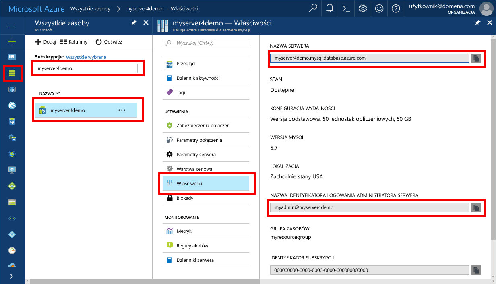

# <a name="design-your-first-azure-database-for-mysql-database"></a><span data-ttu-id="5e135-103">Projektowanie pierwszej bazy danych Azure, aby baza danych MySQL</span><span class="sxs-lookup"><span data-stu-id="5e135-103">Design your first Azure Database for MySQL database</span></span>
<span data-ttu-id="5e135-104">Azure Database for MySQL to usługa zarządzana, która umożliwia uruchamianie i skalowanie w chmurze baz danych MySQL o wysokiej dostępności, a także zarządzanie nimi.</span><span class="sxs-lookup"><span data-stu-id="5e135-104">Azure Database for MySQL is a managed service that enables you to run, manage, and scale highly available MySQL databases in the cloud.</span></span> <span data-ttu-id="5e135-105">Przy użyciu portalu Azure, można łatwo zarządzać serwerem i projektowanie bazy danych.</span><span class="sxs-lookup"><span data-stu-id="5e135-105">Using the Azure portal, you can easily manage your server and design a database.</span></span>

<span data-ttu-id="5e135-106">W tym samouczku, użyj portalu Azure Aby dowiedzieć się, jak:</span><span class="sxs-lookup"><span data-stu-id="5e135-106">In this tutorial, you use the Azure portal to learn how to:</span></span>

> [!div class="checklist"]
> * <span data-ttu-id="5e135-107">Utwórz bazę danych systemu Azure dla programu MySQL</span><span class="sxs-lookup"><span data-stu-id="5e135-107">Create an Azure Database for MySQL</span></span>
> * <span data-ttu-id="5e135-108">Konfigurowanie zapory serwera</span><span class="sxs-lookup"><span data-stu-id="5e135-108">Configure the server firewall</span></span>
> * <span data-ttu-id="5e135-109">Utwórz bazę danych za pomocą narzędzia wiersza polecenia mysql</span><span class="sxs-lookup"><span data-stu-id="5e135-109">Use mysql command-line tool to create a database</span></span>
> * <span data-ttu-id="5e135-110">Ładuj dane przykładowe</span><span class="sxs-lookup"><span data-stu-id="5e135-110">Load sample data</span></span>
> * <span data-ttu-id="5e135-111">Zapytania o dane</span><span class="sxs-lookup"><span data-stu-id="5e135-111">Query data</span></span>
> * <span data-ttu-id="5e135-112">Aktualizowanie danych</span><span class="sxs-lookup"><span data-stu-id="5e135-112">Update data</span></span>
> * <span data-ttu-id="5e135-113">Przywracanie danych</span><span class="sxs-lookup"><span data-stu-id="5e135-113">Restore data</span></span>

## <a name="sign-in-to-the-azure-portal"></a><span data-ttu-id="5e135-114">Logowanie się do witryny Azure Portal</span><span class="sxs-lookup"><span data-stu-id="5e135-114">Sign in to the Azure portal</span></span>
<span data-ttu-id="5e135-115">Otwórz przeglądarkę sieci web Ulubione, a następnie odwiedź [portalu Microsoft Azure](https://portal.azure.com/).</span><span class="sxs-lookup"><span data-stu-id="5e135-115">Open your favorite web browser, and visit the [Microsoft Azure portal](https://portal.azure.com/).</span></span> <span data-ttu-id="5e135-116">Wprowadź swoje poświadczenia, aby zalogować się do portalu.</span><span class="sxs-lookup"><span data-stu-id="5e135-116">Enter your credentials to sign in to the portal.</span></span> <span data-ttu-id="5e135-117">Widok domyślny to pulpit nawigacyjny usług.</span><span class="sxs-lookup"><span data-stu-id="5e135-117">The default view is your service dashboard.</span></span>

## <a name="create-an-azure-database-for-mysql-server"></a><span data-ttu-id="5e135-118">Tworzenie serwera usługi Azure Database for MySQL</span><span class="sxs-lookup"><span data-stu-id="5e135-118">Create an Azure Database for MySQL server</span></span>
<span data-ttu-id="5e135-119">Serwer usługi Azure Database for MySQL jest tworzony za pomocą zdefiniowanego zestawu [zasobów obliczeniowych i przestrzeni dyskowej](./concepts-compute-unit-and-storage.md).</span><span class="sxs-lookup"><span data-stu-id="5e135-119">An Azure Database for MySQL server is created with a defined set of [compute and storage resources](./concepts-compute-unit-and-storage.md).</span></span> <span data-ttu-id="5e135-120">Serwer jest tworzony w ramach [grupy zasobów Azure](https://docs.microsoft.com/en-us/azure/azure-resource-manager/resource-group-overview).</span><span class="sxs-lookup"><span data-stu-id="5e135-120">The server is created within an [Azure resource group](https://docs.microsoft.com/en-us/azure/azure-resource-manager/resource-group-overview).</span></span>

1. <span data-ttu-id="5e135-121">Przejdź do **baz danych** > **bazy danych platformy Azure dla programu MySQL**.</span><span class="sxs-lookup"><span data-stu-id="5e135-121">Navigate to **Databases** > **Azure Database for MySQL**.</span></span> <span data-ttu-id="5e135-122">Jeśli nie można znaleźć serwera MySQL w obszarze **baz danych** kategorii, kliknij przycisk **zobaczyć wszystkie** można wyświetlić wszystkie dostępne bazy danych usługi.</span><span class="sxs-lookup"><span data-stu-id="5e135-122">If you cannot find MySQL Server under **Databases** category, click **See all** to show all available database services.</span></span> <span data-ttu-id="5e135-123">Możesz także wpisać **bazy danych Azure dla programu MySQL** w polu wyszukiwania, aby szybko znaleźć usługi.</span><span class="sxs-lookup"><span data-stu-id="5e135-123">You can also type **Azure Database for MySQL** in the search box to quickly find the service.</span></span>
<span data-ttu-id="5e135-124"></span><span class="sxs-lookup"><span data-stu-id="5e135-124"></span></span>

2. <span data-ttu-id="5e135-125">Kliknij przycisk **bazy danych Azure dla programu MySQL** Kafelek, a następnie kliknij przycisk **Utwórz**.</span><span class="sxs-lookup"><span data-stu-id="5e135-125">Click **Azure Database for MySQL** tile, and then click **Create**.</span></span>

<span data-ttu-id="5e135-126">W naszym przykładzie Wypełnianie bazy danych Azure MySQL formularza z następującymi informacjami:</span><span class="sxs-lookup"><span data-stu-id="5e135-126">In our example, fill out the Azure Database for MySQL form with the following information:</span></span>

| <span data-ttu-id="5e135-127">**Ustawienie**</span><span class="sxs-lookup"><span data-stu-id="5e135-127">**Setting**</span></span> | <span data-ttu-id="5e135-128">**Sugerowana wartość**</span><span class="sxs-lookup"><span data-stu-id="5e135-128">**Suggested value**</span></span> | <span data-ttu-id="5e135-129">**Opis pola**</span><span class="sxs-lookup"><span data-stu-id="5e135-129">**Field Description**</span></span> |
|---|---|---|
| <span data-ttu-id="5e135-130">*Nazwa serwera*</span><span class="sxs-lookup"><span data-stu-id="5e135-130">*Server name*</span></span> | <span data-ttu-id="5e135-131">myserver4demo</span><span class="sxs-lookup"><span data-stu-id="5e135-131">myserver4demo</span></span>  | <span data-ttu-id="5e135-132">Nazwa serwera musi być unikatowa w skali globalnej.</span><span class="sxs-lookup"><span data-stu-id="5e135-132">Server name has to be globally unique.</span></span> |
| <span data-ttu-id="5e135-133">*Subskrypcja*</span><span class="sxs-lookup"><span data-stu-id="5e135-133">*Subscription*</span></span> | <span data-ttu-id="5e135-134">mysubscription</span><span class="sxs-lookup"><span data-stu-id="5e135-134">mysubscription</span></span> | <span data-ttu-id="5e135-135">Wybierz subskrypcję z listy rozwijanej.</span><span class="sxs-lookup"><span data-stu-id="5e135-135">Select your subscription from the drop-down.</span></span> |
| <span data-ttu-id="5e135-136">*Grupa zasobów*</span><span class="sxs-lookup"><span data-stu-id="5e135-136">*Resource group*</span></span> | <span data-ttu-id="5e135-137">myresourcegroup</span><span class="sxs-lookup"><span data-stu-id="5e135-137">myresourcegroup</span></span> | <span data-ttu-id="5e135-138">Utwórz grupę zasobów lub wybierz istniejącą.</span><span class="sxs-lookup"><span data-stu-id="5e135-138">Create a resource group or use an existing one.</span></span> |
| <span data-ttu-id="5e135-139">*Identyfikator logowania administratora serwera*</span><span class="sxs-lookup"><span data-stu-id="5e135-139">*Server admin login*</span></span> | <span data-ttu-id="5e135-140">myadmin</span><span class="sxs-lookup"><span data-stu-id="5e135-140">myadmin</span></span> | <span data-ttu-id="5e135-141">Konfiguracja nazwy konta administratora.</span><span class="sxs-lookup"><span data-stu-id="5e135-141">Setup admin account name.</span></span> |
| <span data-ttu-id="5e135-142">*Hasło*</span><span class="sxs-lookup"><span data-stu-id="5e135-142">*Password*</span></span> |  | <span data-ttu-id="5e135-143">Ustaw silne hasło do konta administratora.</span><span class="sxs-lookup"><span data-stu-id="5e135-143">Set a strong admin account password.</span></span> |
| <span data-ttu-id="5e135-144">*Potwierdź hasło*</span><span class="sxs-lookup"><span data-stu-id="5e135-144">*Confirm password*</span></span> |  | <span data-ttu-id="5e135-145">Potwierdź hasło do konta administratora.</span><span class="sxs-lookup"><span data-stu-id="5e135-145">Confirm the admin account password.</span></span> |
| <span data-ttu-id="5e135-146">*Lokalizacja*</span><span class="sxs-lookup"><span data-stu-id="5e135-146">*Location*</span></span> |  | <span data-ttu-id="5e135-147">Wybierz dostępny region.</span><span class="sxs-lookup"><span data-stu-id="5e135-147">Select an available region.</span></span> |
| <span data-ttu-id="5e135-148">*Wersja*</span><span class="sxs-lookup"><span data-stu-id="5e135-148">*Version*</span></span> | <span data-ttu-id="5e135-149">5.7</span><span class="sxs-lookup"><span data-stu-id="5e135-149">5.7</span></span> | <span data-ttu-id="5e135-150">Wybierz najnowszą wersję.</span><span class="sxs-lookup"><span data-stu-id="5e135-150">Choose the latest version.</span></span> |
| <span data-ttu-id="5e135-151">*Konfigurowanie wydajności*</span><span class="sxs-lookup"><span data-stu-id="5e135-151">*Configure performance*</span></span> | <span data-ttu-id="5e135-152">Podstawowe, 50 obliczeniowe jednostki, 50 GB</span><span class="sxs-lookup"><span data-stu-id="5e135-152">Basic, 50 compute units, 50 GB</span></span>  | <span data-ttu-id="5e135-153">Wybierz pozycje **Warstwa cenowa**, **Jednostki obliczeniowe** i **Magazyn (GB)**, a następnie kliknij przycisk **OK**.</span><span class="sxs-lookup"><span data-stu-id="5e135-153">Choose **Pricing tier**, **Compute Units**, **Storage (GB)**, and then click **OK**.</span></span> |
| <span data-ttu-id="5e135-154">*Przypnij do pulpitu nawigacyjnego*</span><span class="sxs-lookup"><span data-stu-id="5e135-154">*Pin to Dashboard*</span></span> | <span data-ttu-id="5e135-155">Zaznacz</span><span class="sxs-lookup"><span data-stu-id="5e135-155">Check</span></span> | <span data-ttu-id="5e135-156">Zaleca się zaznaczenie tego pola w celu ułatwienia znajdowania serwera.</span><span class="sxs-lookup"><span data-stu-id="5e135-156">Recommended to check this box so you may find the server easily later on</span></span> |
<span data-ttu-id="5e135-157">Następnie kliknij pozycję **Utwórz**.</span><span class="sxs-lookup"><span data-stu-id="5e135-157">Then, click **Create**.</span></span> <span data-ttu-id="5e135-158">Po około dwóch minutach nowy serwer usługi Azure Database for MySQL będzie działać w chmurze.</span><span class="sxs-lookup"><span data-stu-id="5e135-158">In a minute or two, a new Azure Database for MySQL server is running in the cloud.</span></span> <span data-ttu-id="5e135-159">Możesz kliknąć **powiadomienia** przycisk na pasku narzędzi do monitorowania procesu wdrażania.</span><span class="sxs-lookup"><span data-stu-id="5e135-159">You can click **Notifications** button on the toolbar to monitor the deployment process.</span></span>

## <a name="configure-firewall"></a><span data-ttu-id="5e135-160">Konfigurowanie zapory</span><span class="sxs-lookup"><span data-stu-id="5e135-160">Configure firewall</span></span>
<span data-ttu-id="5e135-161">Azure bazy danych dla programu MySQL są chronione przez zaporę.</span><span class="sxs-lookup"><span data-stu-id="5e135-161">Azure Databases for MySQL are protected by a firewall.</span></span> <span data-ttu-id="5e135-162">Domyślnie wszystkie połączenia z serwerem i bazy danych w obrębie serwera są odrzucane.</span><span class="sxs-lookup"><span data-stu-id="5e135-162">By default, all connections to the server and the databases inside the server are rejected.</span></span> <span data-ttu-id="5e135-163">Przed połączeniem się z bazą danych Azure dla programu MySQL po raz pierwszy, należy skonfigurować zaporę tak, aby dodać adres IP komputera klienckiego sieci publicznej (lub zakres adresów IP).</span><span class="sxs-lookup"><span data-stu-id="5e135-163">Before connecting to Azure Database for MySQL for the first time, configure the firewall to add the client machine's public network IP address (or IP address range).</span></span>

1. <span data-ttu-id="5e135-164">Kliknij nowo utworzonego serwera, a następnie kliknij przycisk **zabezpieczenia połączeń**.</span><span class="sxs-lookup"><span data-stu-id="5e135-164">Click your newly created server, and then click **Connection security**.</span></span>
   <span data-ttu-id="5e135-165"></span><span class="sxs-lookup"><span data-stu-id="5e135-165"></span></span>
2. <span data-ttu-id="5e135-166">Możesz **dodać Moje IP**, lub skonfigurować reguły zapory w tym miejscu.</span><span class="sxs-lookup"><span data-stu-id="5e135-166">You can **Add My IP**, or configure firewall rules here.</span></span> <span data-ttu-id="5e135-167">Pamiętaj, aby po utworzeniu reguł kliknąć przycisk **Zapisz**.</span><span class="sxs-lookup"><span data-stu-id="5e135-167">Remember to click **Save** after you have created the rules.</span></span>
<span data-ttu-id="5e135-168">Teraz można podłączyć do serwera przy użyciu narzędzia wiersza polecenia mysql lub MySQL Workbench graficznego interfejsu użytkownika.</span><span class="sxs-lookup"><span data-stu-id="5e135-168">You can now connect to the server using mysql command-line tool or MySQL Workbench GUI tool.</span></span>

> [!TIP]
> <span data-ttu-id="5e135-169">Azure bazy danych MySQL serwera komunikuje się za pośrednictwem portu 3306.</span><span class="sxs-lookup"><span data-stu-id="5e135-169">Azure Database for MySQL server communicates over port 3306.</span></span> <span data-ttu-id="5e135-170">Jeśli próbujesz nawiązać połączenie z sieci firmowej, ruch wychodzący na porcie 3306 może być zablokowany przez zaporę sieciową.</span><span class="sxs-lookup"><span data-stu-id="5e135-170">If you are trying to connect from within a corporate network, outbound traffic over port 3306 may not be allowed by your network's firewall.</span></span> <span data-ttu-id="5e135-171">Jeśli tak, nie można nawiązać serwera Azure MySQL, chyba że dział IT otwiera port 3306.</span><span class="sxs-lookup"><span data-stu-id="5e135-171">If so, you cannot connect to Azure MySQL server unless your IT department opens port 3306.</span></span>

## <a name="get-connection-information"></a><span data-ttu-id="5e135-172">Pobieranie informacji o połączeniu</span><span class="sxs-lookup"><span data-stu-id="5e135-172">Get connection information</span></span>
<span data-ttu-id="5e135-173">Pobierz w pełni kwalifikowaną **nazwy serwera** i **nazwę logowania administratora serwera** bazy danych Azure, aby serwer MySQL z portalu Azure.</span><span class="sxs-lookup"><span data-stu-id="5e135-173">Get the fully qualified **Server name** and **Server admin login name** for your Azure Database for MySQL server from the Azure portal.</span></span> <span data-ttu-id="5e135-174">Nazwa FQDN serwera umożliwia łączenie się z serwerem za pomocą narzędzia wiersza polecenia mysql.</span><span class="sxs-lookup"><span data-stu-id="5e135-174">You use the fully qualified server name to connect to your server using mysql command-line tool.</span></span> 

1. <span data-ttu-id="5e135-175">W [portalu Azure](https://portal.azure.com/), kliknij przycisk **wszystkie zasoby** z menu po lewej stronie, wpisz nazwę, a wyszukiwanie Azure bazy danych MySQL serwera.</span><span class="sxs-lookup"><span data-stu-id="5e135-175">In [Azure portal](https://portal.azure.com/), click **All resources** from the left-hand menu, type the name, and search for your Azure Database for MySQL server.</span></span> <span data-ttu-id="5e135-176">Wybierz nazwę serwera, aby wyświetlić szczegóły.</span><span class="sxs-lookup"><span data-stu-id="5e135-176">Select the server name to view the details.</span></span>

2. <span data-ttu-id="5e135-177">W obszarze Ustawienia kliknij pozycję **właściwości**.</span><span class="sxs-lookup"><span data-stu-id="5e135-177">Under the Settings heading, click **Properties**.</span></span> <span data-ttu-id="5e135-178">Należy zanotować **nazwy serwera** i **nazwę logowania administratora serwera**.</span><span class="sxs-lookup"><span data-stu-id="5e135-178">Note down **SERVER NAME** and **SERVER ADMIN LOGIN NAME**.</span></span> <span data-ttu-id="5e135-179">Może kliknij przycisk Kopiuj obok każdego pola, aby skopiować do Schowka.</span><span class="sxs-lookup"><span data-stu-id="5e135-179">You may click the copy button next to each field to copy to the clipboard.</span></span>
   <span data-ttu-id="5e135-180"></span><span class="sxs-lookup"><span data-stu-id="5e135-180"></span></span>

<span data-ttu-id="5e135-181">W tym przykładzie nazwa serwera to *myserver4demo.mysql.database.azure.com*, a identyfikator logowania administratora serwera to *myadmin@myserver4demo*.</span><span class="sxs-lookup"><span data-stu-id="5e135-181">In this example, the server name is *myserver4demo.mysql.database.azure.com*, and the server admin login is *myadmin@myserver4demo*.</span></span>

## <a name="connect-to-the-server-using-mysql"></a><span data-ttu-id="5e135-182">Połącz z serwerem przy użyciu mysql</span><span class="sxs-lookup"><span data-stu-id="5e135-182">Connect to the server using mysql</span></span>
<span data-ttu-id="5e135-183">Nawiąż połączenie z serwerem usługi Azure Database for MySQL za pomocą [narzędzia wiersza polecenia mysql](https://dev.mysql.com/doc/refman/5.7/en/mysql.html).</span><span class="sxs-lookup"><span data-stu-id="5e135-183">Use [mysql command-line tool](https://dev.mysql.com/doc/refman/5.7/en/mysql.html) to establish a connection to your Azure Database for MySQL server.</span></span> <span data-ttu-id="5e135-184">Z poziomu powłoki chmury Azure w przeglądarce lub z własnych komputera przy użyciu narzędzia mysql zainstalowane lokalnie, można uruchomić narzędzie wiersza polecenia mysql.</span><span class="sxs-lookup"><span data-stu-id="5e135-184">You can run the mysql command-line tool from the Azure Cloud Shell in the browser or from your own machine using mysql tools installed locally.</span></span> <span data-ttu-id="5e135-185">Aby uruchomić powłoki chmury Azure, kliknij przycisk `Try It` przycisk blokiem kodu w tym artykule, lub odwiedź Azure portal i kliknij przycisk `>_` ikonę w prawym górnym pasku narzędzi.</span><span class="sxs-lookup"><span data-stu-id="5e135-185">To launch the Azure Cloud Shell, click the `Try It` button on a code block in this article, or visit the Azure portal and click the `>_` icon in the top right toolbar.</span></span> 

<span data-ttu-id="5e135-186">Aby nawiązać połączenie, wpisz poniższe polecenie:</span><span class="sxs-lookup"><span data-stu-id="5e135-186">Type the command to connect:</span></span>
```azurecli-interactive
mysql -h myserver4demo.mysql.database.azure.com -u myadmin@myserver4demo -p
```

## <a name="create-a-blank-database"></a><span data-ttu-id="5e135-187">Tworzenie pustej bazy danych</span><span class="sxs-lookup"><span data-stu-id="5e135-187">Create a blank database</span></span>
<span data-ttu-id="5e135-188">Po nawiązaniu połączenia z serwerem, Utwórz pustą bazę danych do pracy z.</span><span class="sxs-lookup"><span data-stu-id="5e135-188">Once you’re connected to the server, create a blank database to work with.</span></span>
```sql
CREATE DATABASE mysampledb;
```

<span data-ttu-id="5e135-189">W wierszu polecenia Uruchom następujące polecenie, aby przełączyć połączenia do nowo utworzonej bazy danych:</span><span class="sxs-lookup"><span data-stu-id="5e135-189">At the prompt, run the following command to switch connection to this newly created database:</span></span>
```sql
USE mysampledb;
```

## <a name="create-tables-in-the-database"></a><span data-ttu-id="5e135-190">Tworzenie tabel w bazie danych</span><span class="sxs-lookup"><span data-stu-id="5e135-190">Create tables in the database</span></span>
<span data-ttu-id="5e135-191">Teraz, gdy wiesz, jak nawiązać połączenia z bazą danych Azure dla bazy danych MySQL, możemy przekazywane sposób wykonania zadania podstawowe.</span><span class="sxs-lookup"><span data-stu-id="5e135-191">Now that you know how to connect to the Azure Database for MySQL database, we can go over how to complete some basic tasks.</span></span>

<span data-ttu-id="5e135-192">Firma Microsoft najpierw utwórz tabelę i załaduj go z niektórych danych.</span><span class="sxs-lookup"><span data-stu-id="5e135-192">First, we can create a table and load it with some data.</span></span> <span data-ttu-id="5e135-193">Teraz utworzyć tabelę, która przechowuje informacje dotyczące spisu.</span><span class="sxs-lookup"><span data-stu-id="5e135-193">Let's create a table that stores inventory information.</span></span>
```sql
CREATE TABLE inventory (
    id serial PRIMARY KEY, 
    name VARCHAR(50), 
    quantity INTEGER
);
```

## <a name="load-data-into-the-tables"></a><span data-ttu-id="5e135-194">Ładowanie danych do tabel</span><span class="sxs-lookup"><span data-stu-id="5e135-194">Load data into the tables</span></span>
<span data-ttu-id="5e135-195">Teraz, gdy mamy tabeli możemy wstawić niektóre dane do niego.</span><span class="sxs-lookup"><span data-stu-id="5e135-195">Now that we have a table, we can insert some data into it.</span></span> <span data-ttu-id="5e135-196">W oknie Otwórz okno wiersza polecenia Uruchom następujące zapytanie, aby wstawić niektórych wierszy danych.</span><span class="sxs-lookup"><span data-stu-id="5e135-196">At the open command prompt window, run the following query to insert some rows of data.</span></span>
```sql
INSERT INTO inventory (id, name, quantity) VALUES (1, 'banana', 150); 
INSERT INTO inventory (id, name, quantity) VALUES (2, 'orange', 154);
```

<span data-ttu-id="5e135-197">Masz teraz dwa wiersze przykładowych danych do tabeli utworzony wcześniej.</span><span class="sxs-lookup"><span data-stu-id="5e135-197">Now you have two rows of sample data into the table you created earlier.</span></span>

## <a name="query-and-update-the-data-in-the-tables"></a><span data-ttu-id="5e135-198">Zapytania i zaktualizować dane w tabelach</span><span class="sxs-lookup"><span data-stu-id="5e135-198">Query and update the data in the tables</span></span>
<span data-ttu-id="5e135-199">Wykonaj następujące zapytanie, aby pobrać informacje z tabeli bazy danych.</span><span class="sxs-lookup"><span data-stu-id="5e135-199">Execute the following query to retrieve information from the database table.</span></span>
```sql
SELECT * FROM inventory;
```

<span data-ttu-id="5e135-200">Należy również zaktualizować dane w tabelach.</span><span class="sxs-lookup"><span data-stu-id="5e135-200">You can also update the data in the tables.</span></span>
```sql
UPDATE inventory SET quantity = 200 WHERE name = 'banana';
```

<span data-ttu-id="5e135-201">Wiersz jest odpowiednio aktualizowany podczas pobierania danych.</span><span class="sxs-lookup"><span data-stu-id="5e135-201">The row gets updated accordingly when you retrieve data.</span></span>
```sql
SELECT * FROM inventory;
```

## <a name="restore-a-database-to-a-previous-point-in-time"></a><span data-ttu-id="5e135-202">Przywracanie bazy danych do określonego punktu w czasie</span><span class="sxs-lookup"><span data-stu-id="5e135-202">Restore a database to a previous point in time</span></span>
<span data-ttu-id="5e135-203">Wyobraź sobie przypadkowo usunięto tabelę ważne bazy danych i nie można łatwo odzyskać dane.</span><span class="sxs-lookup"><span data-stu-id="5e135-203">Imagine you have accidentally deleted an important database table, and cannot recover the data easily.</span></span> <span data-ttu-id="5e135-204">Bazy danych platformy Azure dla programu MySQL umożliwia przywrócenie serwera do punktu w czasie, tworząc kopię bazy danych do nowego serwera.</span><span class="sxs-lookup"><span data-stu-id="5e135-204">Azure Database for MySQL allows you to restore the server to a point in time, creating a copy of the databases into new server.</span></span> <span data-ttu-id="5e135-205">Możesz użyć tego nowego serwera, aby odzyskać usunięte dane.</span><span class="sxs-lookup"><span data-stu-id="5e135-205">You can use this new server to recover your deleted data.</span></span> <span data-ttu-id="5e135-206">Poniższe kroki należy przywrócić działanie serwera próbki do punktu przed tabeli został dodany.</span><span class="sxs-lookup"><span data-stu-id="5e135-206">The following steps restore the sample server to a point before the table was added.</span></span>

1. <span data-ttu-id="5e135-207">W portalu Azure Znajdź bazy danych Azure dla programu MySQL.</span><span class="sxs-lookup"><span data-stu-id="5e135-207">In the Azure portal, locate your Azure Database for MySQL.</span></span> <span data-ttu-id="5e135-208">Na **omówienie** kliknij przycisk **przywrócić** na pasku narzędzi.</span><span class="sxs-lookup"><span data-stu-id="5e135-208">On the **Overview** page, click **Restore** on the toolbar.</span></span> <span data-ttu-id="5e135-209">Zostanie otwarta strona przywracania.</span><span class="sxs-lookup"><span data-stu-id="5e135-209">The Restore page opens.</span></span>

   

2. <span data-ttu-id="5e135-211">Wypełnianie **przywrócić** formularza z wymaganych informacji.</span><span class="sxs-lookup"><span data-stu-id="5e135-211">Fill out the **Restore** form with the required information.</span></span>
   
   
   
   - <span data-ttu-id="5e135-213">**Punkt przywracania**: Wybierz w momencie, który chcesz przywrócić, w ramach czasowych na liście.</span><span class="sxs-lookup"><span data-stu-id="5e135-213">**Restore point**: Select a point-in-time that you want to restore to, within the timeframe listed.</span></span> <span data-ttu-id="5e135-214">Upewnij się przekonwertować sieci lokalnej strefie czasowej UTC.</span><span class="sxs-lookup"><span data-stu-id="5e135-214">Make sure to convert your local timezone to UTC.</span></span>
   - <span data-ttu-id="5e135-215">**Przywracanie do nowego serwera**: Podaj nową nazwę serwera mają zostać przywrócone.</span><span class="sxs-lookup"><span data-stu-id="5e135-215">**Restore to new server**: Provide a new server name you want to restore to.</span></span>
   - <span data-ttu-id="5e135-216">**Lokalizacja**: region jest taki sam jak serwer źródłowy i nie można zmienić.</span><span class="sxs-lookup"><span data-stu-id="5e135-216">**Location**: The region is same as the source server, and cannot be changed.</span></span>
   - <span data-ttu-id="5e135-217">**Warstwa cenowa**: warstwa cenowa jest taka sama, jak na serwerze źródłowym i nie można zmienić.</span><span class="sxs-lookup"><span data-stu-id="5e135-217">**Pricing tier**: The pricing tier is the same as the source server, and cannot be changed.</span></span>
   
3. <span data-ttu-id="5e135-218">Kliknij przycisk **OK** Aby przywrócić serwer do [Przywracanie do punktu w czasie](./howto-restore-server-portal.md) przed tabeli został usunięty.</span><span class="sxs-lookup"><span data-stu-id="5e135-218">Click **OK** to restore the server to [restore to a point in time](./howto-restore-server-portal.md) before the table was deleted.</span></span> <span data-ttu-id="5e135-219">Przywracanie serwera tworzy nową kopię serwera, począwszy od punktu w czasie, które określisz.</span><span class="sxs-lookup"><span data-stu-id="5e135-219">Restoring a server creates a new copy of the server, as of the point in time you specify.</span></span> 

## <a name="next-steps"></a><span data-ttu-id="5e135-220">Następne kroki</span><span class="sxs-lookup"><span data-stu-id="5e135-220">Next steps</span></span>
<span data-ttu-id="5e135-221">W tym samouczku można użyć Azure portalu do zapamiętanych jak:</span><span class="sxs-lookup"><span data-stu-id="5e135-221">In this tutorial, you use the Azure portal to learned how to:</span></span>

> [!div class="checklist"]
> * <span data-ttu-id="5e135-222">Utwórz bazę danych systemu Azure dla programu MySQL</span><span class="sxs-lookup"><span data-stu-id="5e135-222">Create an Azure Database for MySQL</span></span>
> * <span data-ttu-id="5e135-223">Konfigurowanie zapory serwera</span><span class="sxs-lookup"><span data-stu-id="5e135-223">Configure the server firewall</span></span>
> * <span data-ttu-id="5e135-224">Utwórz bazę danych za pomocą narzędzia wiersza polecenia mysql</span><span class="sxs-lookup"><span data-stu-id="5e135-224">Use mysql command-line tool to create a database</span></span>
> * <span data-ttu-id="5e135-225">Ładuj dane przykładowe</span><span class="sxs-lookup"><span data-stu-id="5e135-225">Load sample data</span></span>
> * <span data-ttu-id="5e135-226">Zapytania o dane</span><span class="sxs-lookup"><span data-stu-id="5e135-226">Query data</span></span>
> * <span data-ttu-id="5e135-227">Aktualizowanie danych</span><span class="sxs-lookup"><span data-stu-id="5e135-227">Update data</span></span>
> * <span data-ttu-id="5e135-228">Przywracanie danych</span><span class="sxs-lookup"><span data-stu-id="5e135-228">Restore data</span></span>

> [!div class="nextstepaction"]
> [<span data-ttu-id="5e135-229">Jak połączyć aplikacje do bazy danych Azure dla programu MySQL</span><span class="sxs-lookup"><span data-stu-id="5e135-229">How to connect applications to Azure Database for MySQL</span></span>](./howto-connection-string.md)
