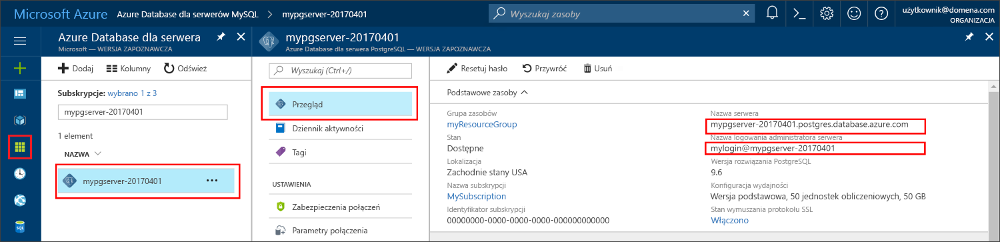

# <a name="azure-database-for-postgresql-use-net-c-tooconnect-and-query-data"></a>Bazy danych platformy Azure dla PostgreSQL: dane tooconnect i zapytań Użyj .NET (C#)
Ta opcja szybkiego startu przedstawia sposób tooconnect tooan Azure bazy danych PostgreSQL przy użyciu aplikacji C#. Widoczny jest sposób toouse tooquery instrukcji SQL, wstawiania, aktualizowania i usuwania danych w bazie danych hello. Hello krokach w tym artykule przyjęto założenie, że znasz tworzenie przy użyciu języka C# oraz czy są nowe tooworking z bazą danych Azure dla PostgreSQL.

## <a name="prerequisites"></a>Wymagania wstępne
Ta opcja szybkiego startu używa zasobów hello utworzone w jednym z tych wskazówek jako punktu wyjścia:
- [Tworzenie bazy danych — portal](quickstart-create-server-database-portal.md)
- [Tworzenie bazy danych — interfejs wiersza polecenia](quickstart-create-server-database-azure-cli.md)

Należy również:
- Zainstalować program [.NET Framework](https://www.microsoft.com/net/download). Wykonaj kroki hello hello połączyć artykuł tooinstall .NET specjalnie dla danej platformy (Windows, Ubuntu Linux lub macOS). 
- Zainstaluj [programu Visual Studio](https://www.visualstudio.com/downloads/) lub Visual Studio Code tootype i Edycja kodu.
- Zainstalować bibliotekę [Npgsql](http://www.npgsql.org/doc/index.html) zgodnie z poniższym opisem.

## <a name="install-npgsql-references-into-your-visual-studio-solution"></a>Instalowanie odwołań Npgsql do rozwiązania programu Visual Studio
tooconnect z hello C# tooPostgreSQL aplikacji, użyj biblioteki ADO.NET typu open source hello o nazwie Npgsql. NuGet pomaga pobierania i łatwego zarządzania hello odwołań.

1. Utwórz nowe rozwiązanie języka C# lub otwórz istniejące: 
   - W programie Visual Studio utwórz rozwiązanie, klikając menu Plik **Nowy** > **Projekt**.
   - W hello dialogu nowego projektu, rozwiń węzeł **szablony** > **Visual C#**. 
   - Wybierz odpowiedni szablon, taki jak **Aplikacja konsoli (.NET Core)**.

2. Użyj hello Npgsql tooinstall Menedżera pakietów Nuget:
   - Kliknij przycisk hello **narzędzia** menu > **Menedżera pakietów NuGet** > **Konsola Menedżera pakietów**.
   - W hello **Konsola Menedżera pakietów**, typ`Install-Package Npgsql`
   - Witaj zainstalować polecenia pliki do pobrania hello Npgsql.dll i powiązanych zestawów i dodaje je jako zależności w rozwiązaniu hello.

## <a name="get-connection-information"></a>Pobieranie informacji o połączeniu
Pobierz PostgreSQL hello połączenia potrzebnych tooconnect toohello bazy danych Azure. Należy hello serwera w pełni kwalifikowaną nazwę i poświadczenia logowania.

1. Zaloguj się za toohello [portalu Azure](https://portal.azure.com/).
2. Z menu po lewej stronie powitania w portalu Azure, kliknij przycisk **wszystkie zasoby** i wyszukaj powitania serwera po utworzeniu, takich jak **mypgserver 20170401**.
3. Kliknij nazwę serwera hello **mypgserver 20170401**.
4. Wybierz powitania serwera **omówienie** strony. Zanotuj hello **nazwy serwera** i **nazwę logowania administratora serwera**.
 
5. Jeśli użytkownik zapomni swoje informacje logowania serwera, przejdź toohello **omówienie** strony nazwę logowania administratora serwera hello tooview i w razie potrzeby zresetowania hasła hello.

## <a name="connect-create-table-and-insert-data"></a>Nawiązywanie połączenia, tworzenie tabeli i wstawianie danych
Użyj hello następujący kod tooconnect i załadować hello danych przy użyciu **CREATE TABLE** i **INSERT INTO** instrukcji SQL. Kod Hello używa klasy NpgsqlCommand metodą [metody Open()](http://www.npgsql.org/api/Npgsql.NpgsqlConnection.html#Npgsql_NpgsqlConnection_Open) tooestablish tooPostgreSQL połączenia. Następnie hello kod używa metody [CreateCommand()](http://www.npgsql.org/api/Npgsql.NpgsqlConnection.html#Npgsql_NpgsqlConnection_CreateCommand), ustawia właściwość CommandText hello i wywołuje metodę [ExecuteNonQuery()](http://www.npgsql.org/api/Npgsql.NpgsqlCommand.html#Npgsql_NpgsqlCommand_ExecuteNonQuery) toorun hello bazy danych poleceń. 

Zastąp parametry hosta, DBName użytkownika i hasło hello wartościami hello określone podczas tworzenia powitania serwera i bazy danych. 

```csharp
using System;
using System.Collections.Generic;
using System.Linq;
using System.Text;
using System.Threading.Tasks;
using Npgsql;

namespace Driver
{
    public class AzurePostgresCreate
    {
        // Obtain connection string information from hello portal
        //
        private static string Host = "mypgserver-20170401.postgres.database.azure.com";
        private static string User = "mylogin@mypgserver-20170401";
        private static string DBname = "mypgsqldb";
        private static string Password = "<server_admin_password>";
        private static string Port = "5432";

        static void Main(string[] args)
        {
            // Build connection string using parameters from portal
            //
            string connString =
                String.Format(
                    "Server={0}; User Id={1}; Database={2}; Port={3}; Password={4}; SSL Mode=Prefer; Trust Server Certificate=true",
                    Host,
                    User,
                    DBname,
                    Port,
                    Password);

            var conn = new NpgsqlConnection(connString);

            Console.Out.WriteLine("Opening connection");
            conn.Open();

            var command = conn.CreateCommand();
            command.CommandText = "DROP TABLE IF EXISTS inventory;";
            command.ExecuteNonQuery();
            Console.Out.WriteLine("Finished dropping table (if existed)");

            command.CommandText = "CREATE TABLE inventory (id serial PRIMARY KEY, name VARCHAR(50), quantity INTEGER);";
            command.ExecuteNonQuery();
            Console.Out.WriteLine("Finished creating table");

            command.CommandText =
                String.Format(
                    @"
                                INSERT INTO inventory (name, quantity) VALUES ({0}, {1});
                                INSERT INTO inventory (name, quantity) VALUES ({2}, {3});
                                INSERT INTO inventory (name, quantity) VALUES ({4}, {5});
                            ",
                    "\'banana\'", 150,
                    "\'orange\'", 154,
                    "\'apple\'", 100
                    );

            int nRows = command.ExecuteNonQuery();
            Console.Out.WriteLine(String.Format("Number of rows inserted={0}", nRows));

            Console.Out.WriteLine("Closing connection");
            conn.Close();

            Console.WriteLine("Press RETURN tooexit");
            Console.ReadLine();
        }
    }
}
```

## <a name="read-data"></a>Odczyt danych
Użyj hello następujący kod tooconnect i odczytu hello danych przy użyciu **wybierz** instrukcji SQL. Kod Hello używa klasy NpgsqlCommand metodą [metody Open()](http://www.npgsql.org/api/Npgsql.NpgsqlConnection.html#Npgsql_NpgsqlConnection_Open) tooestablish tooPostgreSQL połączenia. Następnie hello kod używa metody [CreateCommand()](http://www.npgsql.org/api/Npgsql.NpgsqlConnection.html#Npgsql_NpgsqlConnection_CreateCommand) i metody [Executereader())](http://www.npgsql.org/api/Npgsql.NpgsqlCommand.html#Npgsql_NpgsqlCommand_ExecuteReader) toorun hello bazy danych poleceń. Następnie hello kod używa [Read()](http://www.npgsql.org/api/Npgsql.NpgsqlDataReader.html#Npgsql_NpgsqlDataReader_Read) tooadvance toohello rekordów w wynikach hello. Następnie używa kod hello [GetInt32()](http://www.npgsql.org/api/Npgsql.NpgsqlDataReader.html#Npgsql_NpgsqlDataReader_GetInt32_System_Int32_) i [GetString()](http://www.npgsql.org/api/Npgsql.NpgsqlDataReader.html#Npgsql_NpgsqlDataReader_GetString_System_Int32_) tooparse hello wartości w rekordzie hello.

Zastąp parametry hosta, DBName użytkownika i hasło hello wartościami hello określone podczas tworzenia powitania serwera i bazy danych. 

```csharp
using System;
using System.Collections.Generic;
using System.Linq;
using System.Text;
using System.Threading.Tasks;
using Npgsql;

namespace Driver
{
    public class AzurePostgresRead
    {
        // Obtain connection string information from hello portal
        //
        private static string Host = "mypgserver-20170401.postgres.database.azure.com";
        private static string User = "mylogin@mypgserver-20170401";
        private static string DBname = "mypgsqldb";
        private static string Password = "<server_admin_password>";
        private static string Port = "5432";

        static void Main(string[] args)
        {
            // Build connection string using parameters from portal
            //
            string connString =
                String.Format(
                    "Server={0}; User Id={1}; Database={2}; Port={3}; Password={4};",
                    Host,
                    User,
                    DBname,
                    Port,
                    Password);

            var conn = new NpgsqlConnection(connString);

            Console.Out.WriteLine("Opening connection");
            conn.Open();

            var command = conn.CreateCommand();
            command.CommandText = "SELECT * FROM inventory;";

            var reader = command.ExecuteReader();
            while (reader.Read())
            {
                Console.WriteLine(
                    string.Format(
                        "Reading from table=({0}, {1}, {2})",
                        reader.GetInt32(0).ToString(),
                        reader.GetString(1),
                        reader.GetInt32(2).ToString()
                        )
                    );
            }

            Console.Out.WriteLine("Closing connection");
            conn.Close();

            Console.WriteLine("Press RETURN tooexit");
            Console.ReadLine();
        }
    }
}
```


## <a name="update-data"></a>Aktualizowanie danych
Użyj hello następujący kod tooconnect i odczytu hello danych przy użyciu **aktualizacji** instrukcji SQL. Kod Hello używa klasy NpgsqlCommand metodą [metody Open()](http://www.npgsql.org/api/Npgsql.NpgsqlConnection.html#Npgsql_NpgsqlConnection_Open) tooestablish tooPostgreSQL połączenia. Następnie hello kod używa metody [CreateCommand()](http://www.npgsql.org/api/Npgsql.NpgsqlConnection.html#Npgsql_NpgsqlConnection_CreateCommand), ustawia właściwość CommandText hello i wywołuje metodę [ExecuteNonQuery()](http://www.npgsql.org/api/Npgsql.NpgsqlCommand.html#Npgsql_NpgsqlCommand_ExecuteNonQuery) toorun hello bazy danych poleceń.

Zastąp parametry hosta, DBName użytkownika i hasło hello wartościami hello określone podczas tworzenia powitania serwera i bazy danych. 

```csharp
using System;
using System.Collections.Generic;
using System.Linq;
using System.Text;
using System.Threading.Tasks;
using Npgsql;

namespace Driver
{
    public class AzurePostgresUpdate
    {
        // Obtain connection string information from hello portal
        //
        private static string Host = "mypgserver-20170401.postgres.database.azure.com";
        private static string User = "mylogin@mypgserver-20170401";
        private static string DBname = "mypgsqldb";
        private static string Password = "<server_admin_password>";
        private static string Port = "5432";

        static void Main(string[] args)
        {
            // Build connection string using parameters from portal
            //
            string connString =
                String.Format(
                    "Server={0}; User Id={1}; Database={2}; Port={3}; Password={4};",
                    Host,
                    User,
                    DBname,
                    Port,
                    Password);

            var conn = new NpgsqlConnection(connString);

            Console.Out.WriteLine("Opening connection");
            conn.Open();

            var command = conn.CreateCommand();
            command.CommandText =
            String.Format("UPDATE inventory SET quantity = {0} WHERE name = {1};",
                200,
                "\'banana\'"
                );

            int nRows = command.ExecuteNonQuery();
            Console.Out.WriteLine(String.Format("Number of rows updated={0}", nRows));

            Console.Out.WriteLine("Closing connection");
            conn.Close();

            Console.WriteLine("Press RETURN tooexit");
            Console.ReadLine();
        }
    }
}
```


## <a name="delete-data"></a>Usuwanie danych
Użyj hello następujący kod tooconnect i odczytu hello danych przy użyciu **usunąć** instrukcji SQL. 

 Kod Hello używa klasy NpgsqlCommand metodą [metody Open()](http://www.npgsql.org/api/Npgsql.NpgsqlConnection.html#Npgsql_NpgsqlConnection_Open) tooestablish tooPostgreSQL połączenia. Następnie hello kod używa metody [CreateCommand()](http://www.npgsql.org/api/Npgsql.NpgsqlConnection.html#Npgsql_NpgsqlConnection_CreateCommand), ustawia właściwość CommandText hello i wywołuje metodę [ExecuteNonQuery()](http://www.npgsql.org/api/Npgsql.NpgsqlCommand.html#Npgsql_NpgsqlCommand_ExecuteNonQuery) toorun hello bazy danych poleceń.

Zastąp parametry hosta, DBName użytkownika i hasło hello wartościami hello określone podczas tworzenia powitania serwera i bazy danych. 

```csharp
using System;
using System.Collections.Generic;
using System.Linq;
using System.Text;
using System.Threading.Tasks;
using Npgsql;

namespace Driver
{
    public class AzurePostgresDelete
    {
        // Obtain connection string information from hello portal
        //
        private static string Host = "mypgserver-20170401.postgres.database.azure.com";
        private static string User = "mylogin@mypgserver-20170401";
        private static string DBname = "mypgsqldb";
        private static string Password = "<server_admin_password>";
        private static string Port = "5432";

        static void Main(string[] args)
        {
            // Build connection string using parameters from portal
            //
            string connString =
                String.Format(
                    "Server={0}; User Id={1}; Database={2}; Port={3}; Password={4};",
                    Host,
                    User,
                    DBname,
                    Port,
                    Password);

            var conn = new NpgsqlConnection(connString);

            Console.Out.WriteLine("Opening connection");
            conn.Open();

            var command = conn.CreateCommand();
            command.CommandText =
            String.Format("DELETE FROM inventory WHERE name = {0};",
                "\'orange\'");
            int nRows = command.ExecuteNonQuery();
            Console.Out.WriteLine(String.Format("Number of rows deleted={0}", nRows));

            Console.Out.WriteLine("Closing connection");
            conn.Close();

            Console.WriteLine("Press RETURN tooexit");
            Console.ReadLine();
        }
    }
}
```

## <a name="next-steps"></a>Następne kroki
> [!div class="nextstepaction"]
> [Migrowanie bazy danych przy użyciu funkcji eksportowania i importowania](./howto-migrate-using-export-and-import.md)
