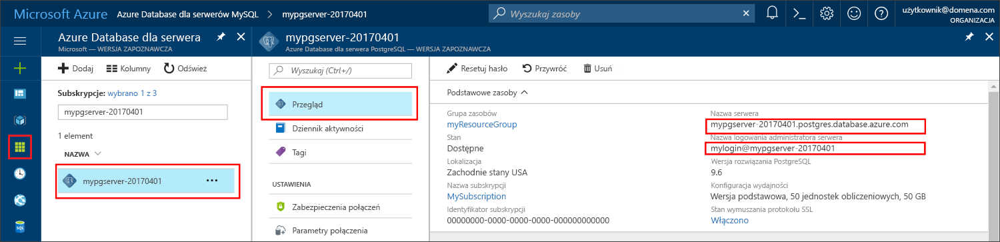

# <a name="azure-database-for-postgresql-use-java-tooconnect-and-query-data"></a><span data-ttu-id="c2c11-103">Bazy danych platformy Azure dla PostgreSQL: Użyj języka Java tooconnect i zapytań danych.</span><span class="sxs-lookup"><span data-stu-id="c2c11-103">Azure Database for PostgreSQL: Use Java tooconnect and query data</span></span>
<span data-ttu-id="c2c11-104">Ta opcja szybkiego startu przedstawia sposób tooconnect tooan Azure bazy danych PostgreSQL przy użyciu aplikacji Java.</span><span class="sxs-lookup"><span data-stu-id="c2c11-104">This quickstart demonstrates how tooconnect tooan Azure Database for PostgreSQL using a Java application.</span></span> <span data-ttu-id="c2c11-105">Widoczny jest sposób toouse tooquery instrukcji SQL, wstawiania, aktualizowania i usuwania danych w bazie danych hello.</span><span class="sxs-lookup"><span data-stu-id="c2c11-105">It shows how toouse SQL statements tooquery, insert, update, and delete data in hello database.</span></span> <span data-ttu-id="c2c11-106">Hello krokach w tym artykule przyjęto założenie, że znasz tworzenie przy użyciu języka Java i czy nowy tooworking z bazą danych Azure dla PostgreSQL.</span><span class="sxs-lookup"><span data-stu-id="c2c11-106">hello steps in this article assume that you are familiar with developing using Java, and that you are new tooworking with Azure Database for PostgreSQL.</span></span>

## <a name="prerequisites"></a><span data-ttu-id="c2c11-107">Wymagania wstępne</span><span class="sxs-lookup"><span data-stu-id="c2c11-107">Prerequisites</span></span>
<span data-ttu-id="c2c11-108">Ta opcja szybkiego startu używa zasobów hello utworzone w jednym z tych wskazówek jako punktu wyjścia:</span><span class="sxs-lookup"><span data-stu-id="c2c11-108">This quickstart uses hello resources created in either of these guides as a starting point:</span></span>
- [<span data-ttu-id="c2c11-109">Tworzenie bazy danych — portal</span><span class="sxs-lookup"><span data-stu-id="c2c11-109">Create DB - Portal</span></span>](quickstart-create-server-database-portal.md)
- [<span data-ttu-id="c2c11-110">Tworzenie bazy danych — interfejs wiersza polecenia platformy Azure</span><span class="sxs-lookup"><span data-stu-id="c2c11-110">Create DB - Azure CLI</span></span>](quickstart-create-server-database-azure-cli.md)

<span data-ttu-id="c2c11-111">Należy również:</span><span class="sxs-lookup"><span data-stu-id="c2c11-111">You also need to:</span></span>
- <span data-ttu-id="c2c11-112">Pobierz hello [sterownik JDBC PostgreSQL](https://jdbc.postgresql.org/download.html) odpowiadającym używanej wersji programu Java i hello Java Development Kit.</span><span class="sxs-lookup"><span data-stu-id="c2c11-112">Download hello [PostgreSQL JDBC Driver](https://jdbc.postgresql.org/download.html) matching your version of Java and hello Java Development Kit.</span></span>
- <span data-ttu-id="c2c11-113">Uwzględnij hello plik jar PostgreSQL JDBC (na przykład 42.1.1.jar postgresql) w ścieżce klas aplikacji.</span><span class="sxs-lookup"><span data-stu-id="c2c11-113">Include hello PostgreSQL JDBC jar file (for example postgresql-42.1.1.jar) in your application classpath.</span></span> <span data-ttu-id="c2c11-114">Aby uzyskać więcej informacji, zobacz [szczegóły ścieżki klasy](https://jdbc.postgresql.org/documentation/head/classpath.html).</span><span class="sxs-lookup"><span data-stu-id="c2c11-114">For more information, see [classpath details](https://jdbc.postgresql.org/documentation/head/classpath.html).</span></span>

## <a name="get-connection-information"></a><span data-ttu-id="c2c11-115">Pobieranie informacji o połączeniu</span><span class="sxs-lookup"><span data-stu-id="c2c11-115">Get connection information</span></span>
<span data-ttu-id="c2c11-116">Pobierz PostgreSQL hello połączenia potrzebnych tooconnect toohello bazy danych Azure.</span><span class="sxs-lookup"><span data-stu-id="c2c11-116">Get hello connection information needed tooconnect toohello Azure Database for PostgreSQL.</span></span> <span data-ttu-id="c2c11-117">Należy hello serwera w pełni kwalifikowaną nazwę i poświadczenia logowania.</span><span class="sxs-lookup"><span data-stu-id="c2c11-117">You need hello fully qualified server name and login credentials.</span></span>

1. <span data-ttu-id="c2c11-118">Zaloguj się za toohello [portalu Azure](https://portal.azure.com/).</span><span class="sxs-lookup"><span data-stu-id="c2c11-118">Log in toohello [Azure portal](https://portal.azure.com/).</span></span>
2. <span data-ttu-id="c2c11-119">Z menu po lewej stronie powitania w portalu Azure, kliknij przycisk **wszystkie zasoby** i wyszukaj powitania serwera po utworzeniu, takich jak **mypgserver 20170401**.</span><span class="sxs-lookup"><span data-stu-id="c2c11-119">From hello left-hand menu in Azure portal, click **All resources** and search for hello server you have created, such as **mypgserver-20170401**.</span></span>
3. <span data-ttu-id="c2c11-120">Kliknij nazwę serwera hello **mypgserver 20170401**.</span><span class="sxs-lookup"><span data-stu-id="c2c11-120">Click hello server name **mypgserver-20170401**.</span></span>
4. <span data-ttu-id="c2c11-121">Wybierz powitania serwera **omówienie** strony.</span><span class="sxs-lookup"><span data-stu-id="c2c11-121">Select hello server's **Overview** page.</span></span> <span data-ttu-id="c2c11-122">Zanotuj hello **nazwy serwera** i **nazwę logowania administratora serwera**.</span><span class="sxs-lookup"><span data-stu-id="c2c11-122">Make a note of hello **Server name** and **Server admin login name**.</span></span>
 <span data-ttu-id="c2c11-123"></span><span class="sxs-lookup"><span data-stu-id="c2c11-123"></span></span>
5. <span data-ttu-id="c2c11-124">Jeśli użytkownik zapomni swoje informacje logowania serwera, przejdź toohello **omówienie** strony nazwę logowania administratora serwera hello tooview i w razie potrzeby zresetowania hasła hello.</span><span class="sxs-lookup"><span data-stu-id="c2c11-124">If you forget your server login information, navigate toohello **Overview** page tooview hello Server admin login name and, if necessary, reset hello password.</span></span>

## <a name="connect-create-table-and-insert-data"></a><span data-ttu-id="c2c11-125">Nawiązywanie połączenia, tworzenie tabeli i wstawianie danych</span><span class="sxs-lookup"><span data-stu-id="c2c11-125">Connect, create table, and insert data</span></span>
<span data-ttu-id="c2c11-126">Witaj Użyj następującego kodu tooconnect i obciążenia hello danych przy użyciu funkcji hello z **Wstaw** instrukcji SQL.</span><span class="sxs-lookup"><span data-stu-id="c2c11-126">Use hello following code tooconnect and load hello data using hello function with an **INSERT** SQL statement.</span></span> <span data-ttu-id="c2c11-127">Witaj metody [getConnection()](https://www.postgresql.org/docs/7.4/static/jdbc-use.html), [createStatement()](https://jdbc.postgresql.org/documentation/head/query.html), i [executeQuery()](https://jdbc.postgresql.org/documentation/head/query.html) są używane tooconnect, Porzuć i Utwórz hello tabeli.</span><span class="sxs-lookup"><span data-stu-id="c2c11-127">hello methods [getConnection()](https://www.postgresql.org/docs/7.4/static/jdbc-use.html), [createStatement()](https://jdbc.postgresql.org/documentation/head/query.html), and [executeQuery()](https://jdbc.postgresql.org/documentation/head/query.html) are used tooconnect, drop, and create hello table.</span></span> <span data-ttu-id="c2c11-128">Witaj [prepareStatement](https://jdbc.postgresql.org/documentation/head/query.html) toobuild używanych poleceń insert hello, z wartościami parametru hello toobind setString() i setInt() jest obiekt.</span><span class="sxs-lookup"><span data-stu-id="c2c11-128">hello [prepareStatement](https://jdbc.postgresql.org/documentation/head/query.html) object is used toobuild hello insert commands, with setString() and setInt() toobind hello parameter values.</span></span> <span data-ttu-id="c2c11-129">Metoda [executeUpdate()](https://jdbc.postgresql.org/documentation/head/update.html) uruchamia hello polecenie dla każdego zestawu parametrów.</span><span class="sxs-lookup"><span data-stu-id="c2c11-129">Method [executeUpdate()](https://jdbc.postgresql.org/documentation/head/update.html) runs hello command for each set of parameters.</span></span> 

<span data-ttu-id="c2c11-130">Zamień hello hosta, bazy danych użytkownika i hasło Parametry hello wartości, które określono podczas tworzenia własnych serwera i bazy danych.</span><span class="sxs-lookup"><span data-stu-id="c2c11-130">Replace hello host, database, user, and password parameters with hello values that you specified when you created your own server and database.</span></span>

```java
import java.sql.*;
import java.util.Properties;

public class CreateTableInsertRows {

    public static void main (String[] args)  throws Exception
    {

        // Initialize connection variables.
        String host = "mypgserver-20170401.postgres.database.azure.com";
        String database = "mypgsqldb";
        String user = "mylogin@mypgserver-20170401";
        String password = "<server_admin_password>";

        // check that hello driver is installed
        try
        {
            Class.forName("org.postgresql.Driver");
        }
        catch (ClassNotFoundException e)
        {
            throw new ClassNotFoundException("PostgreSQL JDBC driver NOT detected in library path.", e);
        }

        System.out.println("PostgreSQL JDBC driver detected in library path.");

        Connection connection = null;

        // Initialize connection object
        try
        {
            String url = String.format("jdbc:postgresql://%s/%s", host, database);
            
            // set up hello connection properties
            Properties properties = new Properties();
            properties.setProperty("user", user);
            properties.setProperty("password", password);
            properties.setProperty("ssl", "true");

            // get connection
            connection = DriverManager.getConnection(url, properties);
        }
        catch (SQLException e)
        {
            throw new SQLException("Failed toocreate connection toodatabase.", e);
        }
        if (connection != null) 
        { 
            System.out.println("Successfully created connection toodatabase.");
        
            // Perform some SQL queries over hello connection.
            try
            {
                // Drop previous table of same name if one exists.
                Statement statement = connection.createStatement();
                statement.execute("DROP TABLE IF EXISTS inventory;");
                System.out.println("Finished dropping table (if existed).");
    
                // Create table.
                statement.execute("CREATE TABLE inventory (id serial PRIMARY KEY, name VARCHAR(50), quantity INTEGER);");
                System.out.println("Created table.");
    
                // Insert some data into table.
                int nRowsInserted = 0;
                PreparedStatement preparedStatement = connection.prepareStatement("INSERT INTO inventory (name, quantity) VALUES (?, ?);");
                preparedStatement.setString(1, "banana");
                preparedStatement.setInt(2, 150);
                nRowsInserted += preparedStatement.executeUpdate();

                preparedStatement.setString(1, "orange");
                preparedStatement.setInt(2, 154);
                nRowsInserted += preparedStatement.executeUpdate();

                preparedStatement.setString(1, "apple");
                preparedStatement.setInt(2, 100);
                nRowsInserted += preparedStatement.executeUpdate();
                System.out.println(String.format("Inserted %d row(s) of data.", nRowsInserted));
    
                // NOTE No need toocommit all changes toodatabase, as auto-commit is enabled by default.
    
            }
            catch (SQLException e)
            {
                throw new SQLException("Encountered an error when executing given sql statement.", e);
            }       
        }
        else {
            System.out.println("Failed toocreate connection toodatabase.");
        }
        System.out.println("Execution finished.");
    }
}
```

## <a name="read-data"></a><span data-ttu-id="c2c11-131">Odczyt danych</span><span class="sxs-lookup"><span data-stu-id="c2c11-131">Read data</span></span>
<span data-ttu-id="c2c11-132">Użyj hello poniższy kod tooread hello danych za pomocą **wybierz** instrukcji SQL.</span><span class="sxs-lookup"><span data-stu-id="c2c11-132">Use hello following code tooread hello data with a **SELECT** SQL statement.</span></span> <span data-ttu-id="c2c11-133">Witaj metody [getConnection()](https://www.postgresql.org/docs/7.4/static/jdbc-use.html), [createStatement()](https://jdbc.postgresql.org/documentation/head/query.html), i [executeQuery()](https://jdbc.postgresql.org/documentation/head/query.html) są używane tooconnect, tworzenie i uruchamianie hello instrukcji select.</span><span class="sxs-lookup"><span data-stu-id="c2c11-133">hello methods [getConnection()](https://www.postgresql.org/docs/7.4/static/jdbc-use.html), [createStatement()](https://jdbc.postgresql.org/documentation/head/query.html), and [executeQuery()](https://jdbc.postgresql.org/documentation/head/query.html) are used tooconnect, create, and run hello select statement.</span></span> <span data-ttu-id="c2c11-134">wyniki Hello są przetwarzane przy użyciu [zestaw wyników](https://www.postgresql.org/docs/7.4/static/jdbc-query.html) obiektu.</span><span class="sxs-lookup"><span data-stu-id="c2c11-134">hello results are processed using a [ResultSet](https://www.postgresql.org/docs/7.4/static/jdbc-query.html) object.</span></span> 

<span data-ttu-id="c2c11-135">Zamień hello hosta, bazy danych użytkownika i hasło Parametry hello wartości, które określono podczas tworzenia własnych serwera i bazy danych.</span><span class="sxs-lookup"><span data-stu-id="c2c11-135">Replace hello host, database, user, and password parameters with hello values that you specified when you created your own server and database.</span></span>

```java
import java.sql.*;
import java.util.Properties;

public class ReadTable {

    public static void main (String[] args)  throws Exception
    {

        // Initialize connection variables.
        String host = "mypgserver-20170401.postgres.database.azure.com";
        String database = "mypgsqldb";
        String user = "mylogin@mypgserver-20170401";
        String password = "<server_admin_password>";

        // check that hello driver is installed
        try
        {
            Class.forName("org.postgresql.Driver");
        }
        catch (ClassNotFoundException e)
        {
            throw new ClassNotFoundException("PostgreSQL JDBC driver NOT detected in library path.", e);
        }

        System.out.println("PostgreSQL JDBC driver detected in library path.");

        Connection connection = null;

        // Initialize connection object
        try
        {
            String url = String.format("jdbc:postgresql://%s/%s", host, database);
            
            // set up hello connection properties
            Properties properties = new Properties();
            properties.setProperty("user", user);
            properties.setProperty("password", password);
            properties.setProperty("ssl", "true");

            // get connection
            connection = DriverManager.getConnection(url, properties);
        }
        catch (SQLException e)
        {
            throw new SQLException("Failed toocreate connection toodatabase.", e);
        }
        if (connection != null) 
        { 
            System.out.println("Successfully created connection toodatabase.");
        
            // Perform some SQL queries over hello connection.
            try
            {
    
                Statement statement = connection.createStatement();
                ResultSet results = statement.executeQuery("SELECT * from inventory;");
                while (results.next())
                {
                    String outputString = 
                        String.format(
                            "Data row = (%s, %s, %s)",
                            results.getString(1),
                            results.getString(2),
                            results.getString(3));
                    System.out.println(outputString);
                }
            }
            catch (SQLException e)
            {
                throw new SQLException("Encountered an error when executing given sql statement.", e);
            }       
        }
        else {
            System.out.println("Failed toocreate connection toodatabase.");
        }
        System.out.println("Execution finished.");
    }
}

```

## <a name="update-data"></a><span data-ttu-id="c2c11-136">Aktualizowanie danych</span><span class="sxs-lookup"><span data-stu-id="c2c11-136">Update data</span></span>
<span data-ttu-id="c2c11-137">Użyj hello poniższy kod toochange hello danych za pomocą **aktualizacji** instrukcji SQL.</span><span class="sxs-lookup"><span data-stu-id="c2c11-137">Use hello following code toochange hello data with an **UPDATE** SQL statement.</span></span> <span data-ttu-id="c2c11-138">Witaj metody [getConnection()](https://www.postgresql.org/docs/7.4/static/jdbc-use.html), [prepareStatement()](https://jdbc.postgresql.org/documentation/head/query.html), i [executeUpdate()](https://jdbc.postgresql.org/documentation/head/update.html) są używane tooconnect Przygotuj, a następnie uruchom hello instrukcji update.</span><span class="sxs-lookup"><span data-stu-id="c2c11-138">hello methods [getConnection()](https://www.postgresql.org/docs/7.4/static/jdbc-use.html), [prepareStatement()](https://jdbc.postgresql.org/documentation/head/query.html), and [executeUpdate()](https://jdbc.postgresql.org/documentation/head/update.html) are used tooconnect, prepare, and run hello update statement.</span></span> 

<span data-ttu-id="c2c11-139">Zamień hello hosta, bazy danych użytkownika i hasło Parametry hello wartości, które określono podczas tworzenia własnych serwera i bazy danych.</span><span class="sxs-lookup"><span data-stu-id="c2c11-139">Replace hello host, database, user, and password parameters with hello values that you specified when you created your own server and database.</span></span>

```java
import java.sql.*;
import java.util.Properties;

public class UpdateTable {
    public static void main (String[] args)  throws Exception
    {

        // Initialize connection variables.
        String host = "mypgserver-20170401.postgres.database.azure.com";
        String database = "mypgsqldb";
        String user = "mylogin@mypgserver-20170401";
        String password = "<server_admin_password>";

        // check that hello driver is installed
        try
        {
            Class.forName("org.postgresql.Driver");
        }
        catch (ClassNotFoundException e)
        {
            throw new ClassNotFoundException("PostgreSQL JDBC driver NOT detected in library path.", e);
        }

        System.out.println("PostgreSQL JDBC driver detected in library path.");

        Connection connection = null;

        // Initialize connection object
        try
        {
            String url = String.format("jdbc:postgresql://%s/%s", host, database);
            
            // set up hello connection properties
            Properties properties = new Properties();
            properties.setProperty("user", user);
            properties.setProperty("password", password);
            properties.setProperty("ssl", "true");

            // get connection
            connection = DriverManager.getConnection(url, properties);
        }
        catch (SQLException e)
        {
            throw new SQLException("Failed toocreate connection toodatabase.", e);
        }
        if (connection != null) 
        { 
            System.out.println("Successfully created connection toodatabase.");
        
            // Perform some SQL queries over hello connection.
            try
            {
                // Modify some data in table.
                int nRowsUpdated = 0;
                PreparedStatement preparedStatement = connection.prepareStatement("UPDATE inventory SET quantity = ? WHERE name = ?;");
                preparedStatement.setInt(1, 200);
                preparedStatement.setString(2, "banana");
                nRowsUpdated += preparedStatement.executeUpdate();
                System.out.println(String.format("Updated %d row(s) of data.", nRowsUpdated));
    
                // NOTE No need toocommit all changes toodatabase, as auto-commit is enabled by default.
            }
            catch (SQLException e)
            {
                throw new SQLException("Encountered an error when executing given sql statement.", e);
            }       
        }
        else {
            System.out.println("Failed toocreate connection toodatabase.");
        }
        System.out.println("Execution finished.");
    }
}
```
## <a name="delete-data"></a><span data-ttu-id="c2c11-140">Usuwanie danych</span><span class="sxs-lookup"><span data-stu-id="c2c11-140">Delete data</span></span>
<span data-ttu-id="c2c11-141">Użyj hello poniższy kod tooremove danych za pomocą **usunąć** instrukcji SQL.</span><span class="sxs-lookup"><span data-stu-id="c2c11-141">Use hello following code tooremove data with a **DELETE** SQL statement.</span></span> <span data-ttu-id="c2c11-142">Witaj metody [getConnection()](https://www.postgresql.org/docs/7.4/static/jdbc-use.html), [prepareStatement()](https://jdbc.postgresql.org/documentation/head/query.html), i [executeUpdate()](https://jdbc.postgresql.org/documentation/head/update.html) są używane tooconnect Przygotuj, a następnie uruchom hello instrukcji delete.</span><span class="sxs-lookup"><span data-stu-id="c2c11-142">hello methods [getConnection()](https://www.postgresql.org/docs/7.4/static/jdbc-use.html), [prepareStatement()](https://jdbc.postgresql.org/documentation/head/query.html), and [executeUpdate()](https://jdbc.postgresql.org/documentation/head/update.html) are used tooconnect, prepare, and run hello delete statement.</span></span> 

<span data-ttu-id="c2c11-143">Zamień hello hosta, bazy danych użytkownika i hasło Parametry hello wartości, które określono podczas tworzenia własnych serwera i bazy danych.</span><span class="sxs-lookup"><span data-stu-id="c2c11-143">Replace hello host, database, user, and password parameters with hello values that you specified when you created your own server and database.</span></span>

```java
import java.sql.*;
import java.util.Properties;

public class DeleteTable {
    public static void main (String[] args)  throws Exception
    {

        // Initialize connection variables.
        String host = "mypgserver-20170401.postgres.database.azure.com";
        String database = "mypgsqldb";
        String user = "mylogin@mypgserver-20170401";
        String password = "<server_admin_password>";

        // check that hello driver is installed
        try
        {
            Class.forName("org.postgresql.Driver");
        }
        catch (ClassNotFoundException e)
        {
            throw new ClassNotFoundException("PostgreSQL JDBC driver NOT detected in library path.", e);
        }

        System.out.println("PostgreSQL JDBC driver detected in library path.");

        Connection connection = null;

        // Initialize connection object
        try
        {
            String url = String.format("jdbc:postgresql://%s/%s", host, database);
            
            // set up hello connection properties
            Properties properties = new Properties();
            properties.setProperty("user", user);
            properties.setProperty("password", password);
            properties.setProperty("ssl", "true");

            // get connection
            connection = DriverManager.getConnection(url, properties);
        }
        catch (SQLException e)
        {
            throw new SQLException("Failed toocreate connection toodatabase.", e);
        }
        if (connection != null) 
        { 
            System.out.println("Successfully created connection toodatabase.");
        
            // Perform some SQL queries over hello connection.
            try
            {
                // Delete some data from table.
                int nRowsDeleted = 0;
                PreparedStatement preparedStatement = connection.prepareStatement("DELETE FROM inventory WHERE name = ?;");
                preparedStatement.setString(1, "orange");
                nRowsDeleted += preparedStatement.executeUpdate();
                System.out.println(String.format("Deleted %d row(s) of data.", nRowsDeleted));
    
                // NOTE No need toocommit all changes toodatabase, as auto-commit is enabled by default.
            }
            catch (SQLException e)
            {
                throw new SQLException("Encountered an error when executing given sql statement.", e);
            }       
        }
        else {
            System.out.println("Failed toocreate connection toodatabase.");
        }
        System.out.println("Execution finished.");
    }
}
```

## <a name="next-steps"></a><span data-ttu-id="c2c11-144">Następne kroki</span><span class="sxs-lookup"><span data-stu-id="c2c11-144">Next steps</span></span>
> [!div class="nextstepaction"]
> [<span data-ttu-id="c2c11-145">Migrowanie bazy danych przy użyciu funkcji eksportowania i importowania</span><span class="sxs-lookup"><span data-stu-id="c2c11-145">Migrate your database using Export and Import</span></span>](./howto-migrate-using-export-and-import.md)
