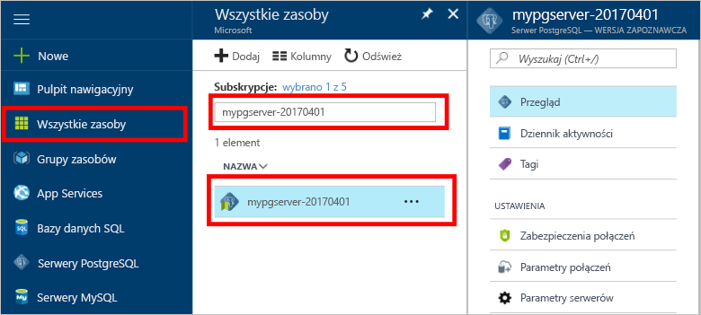

# Jak tooBackup i przywracania serwera w bazie danych Azure poświęcone PostgreSQL hello portalu Azure

## Kopia zapasowa jest wykonywana automatycznie
Korzystając z bazy danych Azure PostgreSQL, hello bazy danych usługi automatycznie tworzy kopię zapasową usługi hello co 5 minut. 

kopie zapasowe Hello są dostępne przez 7 dni, korzystając z warstwy podstawowej i 35 dni po użyciu warstwy standardowa. Aby uzyskać więcej informacji, zobacz [bazą danych Azure dla warstwy usług PostgreSQL](concepts-service-tiers.md)

Tej funkcji automatycznego tworzenia kopii zapasowej można przywrócić powitania serwera i wszystkich jego baz danych do nowego serwera tooan wcześniej punktu w czasie.

## Przywracanie w hello portalu Azure
Bazy danych platformy Azure dla PostgreSQL pozwala toorestore powitania serwera zapasowego tooa punktu w czasie, do nowej kopii tooa powitania serwera. Ten nowy toorecover serwera można użyć danych. 

Na przykład jeśli tabela została przypadkowo porzucony w południe dzisiaj, można przywrócenie czasu toohello tuż przed południe i pobrać hello Brak tabeli i danych z tej nowej kopii powitania serwera.

Witaj następujące kroki hello przykładowy serwer tooa punkt przywracania w czasie:
1. Zaloguj się na powitania [portalu Azure](https://portal.azure.com/)
2. Zlokalizuj PostgreSQL serwera bazy danych Azure. W portalu Azure hello, kliknij przycisk **wszystkie zasoby** z menu po lewej stronie powitania i wpisz nazwę hello, takich jak **mypgserver 20170401**, toosearch dla istniejącego serwera. Kliknij nazwę serwera hello hello wynik wyszukiwania na liście. Witaj **omówienie** strony dla serwera zostanie otwarty i udostępnia opcje dla dalszej konfiguracji.

   

3. U góry hello powitania serwera omówienie bloku, kliknij przycisk **przywrócić** na powitania narzędzi. zostanie otwarty blok przywracania Hello.

   

4. Wypełnij formularz przywracania hello hello wymagane informacje:

   
  - **Punkt przywracania**: Wybierz w momencie po hello serwer został zmieniony
  - **Serwer docelowy**: Podaj nową nazwę serwera ma toorestore do
  - **Lokalizacja**: nie można wybrać hello region, domyślnie jest taka sama jak powitania serwera źródłowego
  - **Warstwa cenowa**: nie można zmienić tę wartość podczas przywracania serwera. Jest taki sam jak powitania serwera źródłowego. 

5. Kliknij przycisk **OK** toorestore powitania serwera toorestore tooa punktu w czasie. 

6. Po zakończeniu przywracania hello zlokalizować hello nowy serwer, który jest tworzony powitalne tooverify danych zostało przywrócone, zgodnie z oczekiwaniami.

## Następne kroki
- [Biblioteki połączeń dla bazy danych Azure dla PostgreSQL](concepts-connection-libraries.md)
