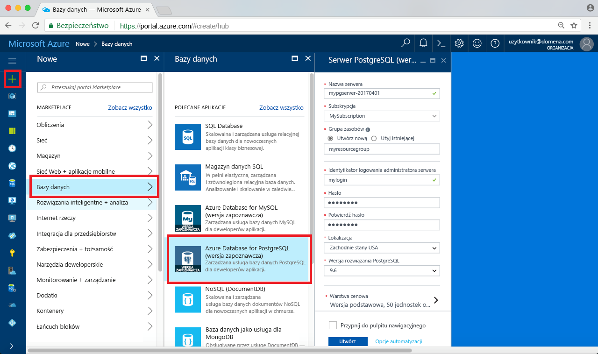
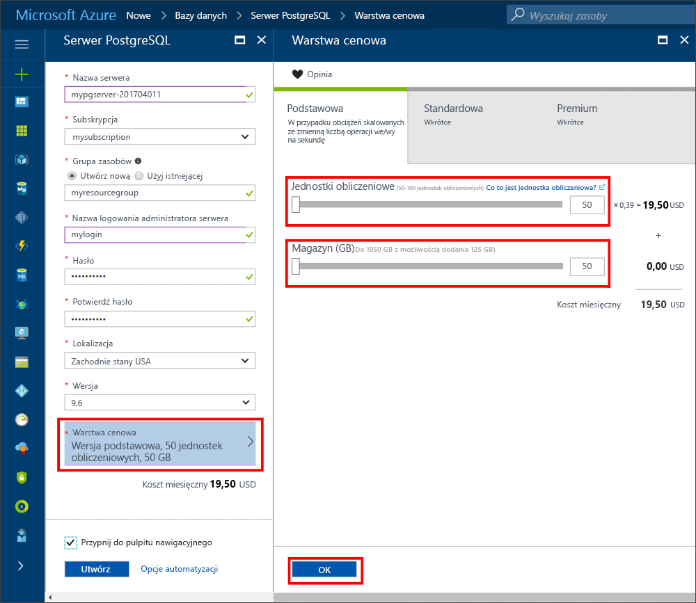
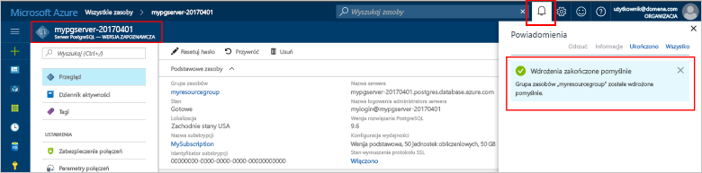
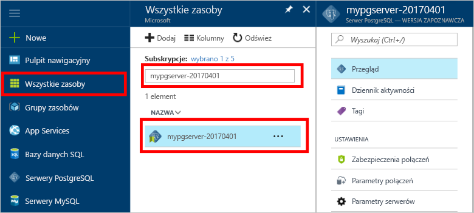
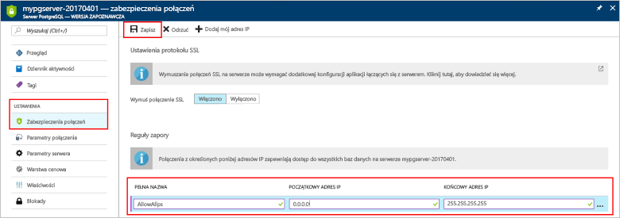
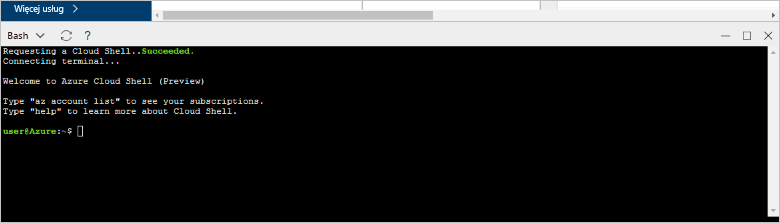
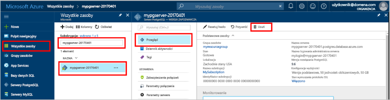

# <a name="create-an-azure-database-for-postgresql-in-hello-azure-portal"></a>Tworzenie bazy danych Azure dla PostgreSQL w hello portalu Azure

Bazy danych platformy Azure dla PostgreSQL jest zarządzana usługa, która pozwala toorun, zarządzanie i skalowania wysokiej dostępności PostgreSQL baz danych w chmurze hello. Ta opcja szybkiego startu pokazuje, jak toocreate Azure bazy danych dla serwera PostgreSQL przy użyciu portalu Azure hello około pięciu minut.

Jeśli nie masz subskrypcji platformy Azure, przed rozpoczęciem utwórz [bezpłatne](https://azure.microsoft.com/free/) konto.

## <a name="log-in-toohello-azure-portal"></a>Zaloguj się za toohello portalu Azure
Otwórz przeglądarkę sieci web i przejdź toohello [portalu Microsoft Azure](https://portal.azure.com/). Wprowadź toosign Twoje poświadczenia w portalu toohello. Widok domyślny Hello jest pulpit nawigacyjny usługi.

## <a name="create-an-azure-database-for-postgresql"></a>Tworzenie serwera usługi Azure Database for PostgreSQL

Serwer usługi Azure Database for PostgreSQL jest tworzony ze zdefiniowanym zestawem [zasobów obliczeniowych i przestrzeni dyskowej](./concepts-compute-unit-and-storage.md). Serwer Hello jest tworzony w [grupy zasobów platformy Azure](../azure-resource-manager/resource-group-overview.md).

Wykonaj te kroki toocreate bazy danych Azure PostgreSQL serwera:
1.  Kliknij przycisk hello **nowy** przycisk (+) na powitania lewym górnym rogu hello portalu Azure.
2.  Wybierz **baz danych** z hello **nowy** i wybrać opcję **bazą danych Azure dla PostgreSQL** z hello **baz danych** strony.
 

3.  Wypełnianie hello nowego serwera szczegóły formularza z hello następujących informacji, jak pokazano na powitania poprzedzających obrazu:

    Ustawienie|Sugerowana wartość|Opis
    ---|---|---
    Nazwa serwera |*mypgserver-20170401*|Wybierz unikatową nazwę, która identyfikuje serwer usługi Azure Database for PostgreSQL. Nazwa domeny Hello *postgres.database.azure.com* jest nazwą serwera dołączany toohello podanie tooconnect aplikacje do. Nazwa serwera Hello może zawierać tylko małe litery, cyfry i znaki łącznika (-) hello i musi zawierać od 3 do 63 znaków.
    Subskrypcja|*Twoja subskrypcja*|Witaj subskrypcji platformy Azure mają toouse serwera. Jeśli masz wiele subskrypcji, wybierz subskrypcję odpowiednie hello, w którym zasobów hello jest on rozliczany dla.
    Grupa zasobów|*myresourcegroup*| Możesz wprowadzić nową nazwę grupy zasobów lub użyć istniejącej nazwy z subskrypcji.
    Identyfikator logowania administratora serwera |*mylogin*| Podczas łączenia z serwerem toohello, należy własne toouse konta logowania. Nazwa logowania administracyjnego Hello nie może być "azure_superuser", "azure_pg_admin", "admin", "administrator", "root", "Gość" lub "public" i nie może zaczynać się od "pg_".
    Hasło |*Wartość wybrana przez użytkownika* | Utwórz nowe hasło dla konta administratora serwera hello. Musi zawierać od 8 znaków too128. Hasło musi zawierać znaki z trzech z następujących kategorii hello — wielkie litery, angielskiej wersji językowej małe litery, cyfry (0-9) i znaki inne niż alfanumeryczne (!, $, #, % itp.).
    Lokalizacja|*Witaj region najbliższy tooyour użytkowników*| Wybierz lokalizację hello najbliższego tooyour użytkowników.
    Wersja PostgreSQL|*Wybierz hello najnowszej wersji.*| Wybierz hello najnowszej wersji, jeśli nie ma określonych wymagań.
    Warstwa cenowa | **Podstawowa**, **50 jednostek obliczeniowych** **50 GB** | Kliknij przycisk **warstwa cenowa** toospecify hello warstwę i poziom wydajności usługi dla nowej bazy danych. Wybierz warstwę Podstawowa karta hello u góry hello. Kliknij przycisk hello lewego końca hello obliczeniowe jednostki suwaka tooadjust hello wartość toohello najmniejszą dostępne dla tego przewodnika Szybki Start. Kliknij przycisk **Ok** hello toosave wybór warstwy cenowej. Zobacz hello następującego zrzutu ekranu.
    | Toodashboard numeru PIN | Zaznacz | Sprawdź hello **toodashboard numeru Pin** opcji tooallow łatwe monitorowanie serwera na stronie pulpitu nawigacyjnego front hello portalem Azure.

  > [!IMPORTANT]
  > Hello identyfikator logowania administratora serwera i hasło, które są określone w tym miejscu są wymagane toolog Server toohello i jej baz danych w dalszej części tego szybki start. Zapamiętaj lub zapisz te informacje do wykorzystania w przyszłości.

    

4.  Kliknij przycisk **Utwórz** tooprovision powitania serwera. Inicjowanie obsługi administracyjnej zajmuje kilka minut, zapasowej minut too20 maksymalna.

5.  Na pasku narzędzi hello, kliknij przycisk **powiadomienia** procesu wdrażania hello toomonitor.
 
   
  Domyślnie baza danych **postgres** zostanie utworzona na Twoim serwerze. Witaj [postgres](https://www.postgresql.org/docs/9.6/static/app-initdb.html) baza danych jest domyślna baza danych przeznaczone do użytku przez użytkowników, narzędzia i aplikacje innych producentów. 

## <a name="configure-a-server-level-firewall-rule"></a>Konfigurowanie reguły zapory na poziomie serwera

Hello Azure bazy danych dla usługi PostgreSQL tworzy zapory na poziomie serwera hello. Zapora uniemożliwi aplikacji zewnętrznych i narzędzia połączenie toohello serwera i żadnych baz danych na serwerze hello, chyba że tooopen hello zapory dla określonych adresów IP jest tworzona reguła zapory. 

1.  Zlokalizuj serwera po zakończeniu wdrażania hello. W razie potrzeby wyszukaj go. Na przykład kliknij pozycję **wszystkie zasoby** z menu po lewej stronie powitania i wpisz nazwę serwera hello (np. przykład Witaj *mypgserver 20170401*) toosearch dla nowo utworzonego serwera. Kliknij nazwę serwera na liście wyników wyszukiwania hello. Witaj **omówienie** strony dla serwera zostanie otwarty i udostępnia opcje dla dalszej konfiguracji.
 
    

2.  Na stronie powitania serwera wybierz **zabezpieczenia połączeń**. 
    

3.  W obszarze hello **reguły zapory** nagłówek, kliknij w polu tekstowym puste hello w hello **Nazwa reguły** Tworzenie reguły zapory hello toobegin kolumny. 

    Dla tego szybki start umożliwia zezwalanie na wszystkie adresy IP na powitania serwera według wypełnianie w polu tekstowym hello w każdej kolumnie hello następujące wartości:

    Nazwa reguły | Początkowy adres IP | Końcowy adres IP 
    ---|---|---
    AllowAllIps |  0.0.0.0 | 255.255.255.255

4. Polecenie hello narzędzi u góry strony zabezpieczeń połączenia hello **zapisać**. Poczekaj chwilę, po czym powiadomień hello powiadomienia pokazujący, że aktualizacja zabezpieczeń połączenia zakończyło się pomyślnie przed kontynuowaniem.

    > [!NOTE]
    > Tooyour połączenia bazy danych platformy Azure dla serwera PostgreSQL komunikują się za pośrednictwem portu 5432. Jeśli próbujesz tooconnect z sieci firmowej, ruch wychodzący przez port 5432 może nie być dozwolone przez zaporę w sieci. Jeśli tak, nie będzie możliwe tooconnect tooyour serwera, chyba że dział IT otwiera port 5432.
    >

## <a name="get-hello-connection-information"></a>Pobierz informacje o połączeniu hello

Podczas tworzenia serwera usługi Azure Database for PostgreSQL jest także tworzona domyślna baza danych o nazwie **postgres**. tooconnect tooyour serwera bazy danych, należy tooremember hello pełny serwer administrator i nazwę poświadczenia logowania. Może mieć zauważyć tych wartości w artykule szybki start hello. W przypadku, gdy nie, można łatwo odnaleźć hello informacje nazwy i logowania serwera ze strony Przegląd powitania serwera w hello portalu Azure.

1. Otwórz stronę **Przegląd** serwera. Zanotuj hello **nazwy serwera** i **nazwę logowania administratora serwera**.
    Umieść kursor nad każdego pola i hello kopiowania ikona jest wyświetlana po prawej toohello hello tekstu. Kliknij ikonę kopiowania hello jako wartości hello toocopy potrzebne.

 

## <a name="connect-toopostgresql-database-using-psql-in-cloud-shell"></a>Połącz tooPostgreSQL bazy danych przy użyciu psql w powłoce chmury

Istnieje wiele aplikacji można użyć tooyour tooconnect Azure bazy danych dla serwera PostgreSQL. Najpierw Użyjmy hello psql narzędzia wiersza polecenia tooillustrate jak tooconnect toohello serwera.  Korzystanie z przeglądarki internetowej i hello powłoki chmury Azure zgodnie z opisem w tym miejscu bez hello wymagają tooinstall żadnego dodatkowego oprogramowania. Jeśli masz narzędzie psql hello zainstalowane lokalnie na własnym komputerze mogą łączyć się z nim również.

1. Uruchom program hello powłoki chmury Azure za pomocą ikony terminali hello w okienku nawigacji w górnym hello.

   

2. Witaj powłoki chmury Azure otwiera w przeglądarce, umożliwiając poleceń powłoki bash tootype.

   

3. W wierszu polecenia powłoki chmury hello połączyć tooa bazy danych Azure, PostgreSQL serwera bazy danych, wpisując hello psql polecenie w wierszu hello zielony.

    Witaj następujący format jest używane tooconnect tooan Azure bazy danych dla serwera PostgreSQL z hello [psql](https://www.postgresql.org/docs/9.6/static/app-psql.html) narzędzie:
    ```bash
    psql --host=<yourserver> --port=<port> --username=<server admin login> --dbname=<database name>
    ```

    Na przykład następujące polecenie hello łączy serwer przykład tooan:

    ```bash
    psql --host=mypgserver-20170401.postgres.database.azure.com --port=5432 --username=mylogin@mypgserver-20170401 --dbname=postgres
    ```

    Parametr psql |Sugerowana wartość|Opis
    ---|---|---
    --host | *nazwa serwera* | Określ wartość hello nazwy serwera, który został użyty podczas dla PostgreSQL utworzony wcześniej hello Azure bazy danych. Pokazany przykładowy serwer to mypgserver-20170401.postgres.database.azure.com. Użyj hello pełną nazwę domeny (\*. postgres.database.azure.com) jak pokazano w przykładzie hello. Wykonaj kroki hello hello poprzedniej sekcji tooget hello informacje dotyczące połączenia, jeśli nie pamiętasz nazwę serwera. 
    --port | **5432** | Należy zawsze używać portu 5432 podczas łączenia tooAzure bazy danych dla PostgreSQL. 
    --username | *nazwa logowania administratora serwera* |Wpisz powitania serwera admin logowania użytkownika dostarczana, gdy dla PostgreSQL utworzony wcześniej hello bazy danych Azure. Wykonaj kroki hello hello poprzedniej sekcji tooget hello informacje dotyczące połączenia, jeśli nie pamiętasz hello nazwy użytkownika.  Hello format jest  *username@servername* .
    --dbname | **postgres** | Użyj hello domyślna nazwa bazy danych wygenerowany przez system *postgres* hello pierwszego połączenia. Później możesz utworzyć własną bazę danych.

    Po uruchomione polecenie psql hello z własnych wartości parametrów jest hasło administratora serwera hello tootype zostanie wyświetlony monit o. To hasło jest hello samej podane podczas tworzenia powitania serwera. 

    Parametr psql |Sugerowana wartość|Opis
    ---|---|---
    hasło | *hasło administratora* | Należy pamiętać, hello typu znaki nie są pokazywane na powitania bash monitu o hasło. Naciśnij klawisz enter po wpisana wszystkich tooauthenticate znaków hello i połącz.

    Po nawiązaniu połączenia hello psql narzędzie wyświetla monit o postgres należy wpisać poleceń sql. W danych wyjściowych hello początkowego połączenia mogą być wyświetlane ostrzeżenie psql hello w hello powłoki chmury Azure może być inna wersja niż hello Azure bazy danych programu PostgreSQL serwera. 
    
    Przykład danych wyjściowych narzędzia psql:
    ```bash
    psql (9.5.7, server 9.6.2)
    WARNING: psql major version 9.5, server major version 9.6.
        Some psql features might not work.
    SSL connection (protocol: TLSv1.2, cipher: ECDHE-RSA-AES256-SHA384, bits: 256, compression: off)
    Type "help" for help.
   
    postgres=> 
    ```

    > [!TIP]
    > Jeśli Zapora hello nie jest skonfigurowany adres IP hello tooallow hello powłoki chmury Azure, hello wystąpił następujący błąd:
    > 
    > psql: BŁĄD KRYTYCZNY: brak pliku pg_hba.conf dla hosta „138.91.195.82”, użytkownik „mylogin”, baza danych „postgres”, BŁĄD KRYTYCZNY dla SSL: wymagane połączenie SSL. Określ opcje protokołu SSL i spróbuj ponownie.
    > 
    > tooresolve hello błąd, upewnij się, że powitania serwera konfiguracji dopasowań hello etapami hello *skonfigurować regułę zapory poziomu serwera* hello artykułu.

4.  Utwórz pustą bazę danych na powitania monitu, wpisując następujące polecenie hello:
    ```bash
    CREATE DATABASE mypgsqldb;
    ```
    polecenie Hello może potrwać kilka minut toocomplete. 

5.  W wierszu polecenia hello wykonania hello następujące polecenia tooswitch połączenia toohello nowo utworzone w bazie danych **mypgsqldb**.
    ```bash
    \c mypgsqldb
    ```

6.  Wpisz \q, a następnie naciśnij klawisz ENTER tooquit psql. Po wykonaniu tych czynności możesz zamknąć hello powłoki chmury Azure.

Teraz po połączeniu toohello bazy danych platformy Azure dla PostgreSQL i utworzyć bazę danych użytkownika. Nadal toohello przy użyciu innego narzędzia wspólnej pgAdmin dalej tooconnect sekcji.

## <a name="connect-toopostgresql-database-using-pgadmin"></a>Połącz tooPostgreSQL bazy danych przy użyciu pgAdmin

Serwer PostgreSQL tooAzure tooconnect przy użyciu hello graficznego interfejsu użytkownika narzędzia _pgAdmin_
1.  Uruchamianie hello _pgAdmin_ aplikacji na komputerze klienckim. Aplikację _pgAdmin_ można zainstalować ze strony http://www.pgadmin.org/.
2.  Kliknij przycisk hello **dodać nowy serwer** ikony z hello **szybkie linki** sekcji w Centrum hello hello strony pulpitu nawigacyjnego.
3.  W hello **Utwórz — serwer** okno dialogowe **ogólne** wprowadź unikatową przyjazną nazwę dla serwera hello, takich jak **serwera PostgreSQL Azure**.

4.  W hello **Utwórz — serwer** okno dialogowe **połączenia** , użyj ustawień hello określone i kliknij **zapisać**.
   

    Parametr narzędzia pgAdmin |Sugerowana wartość|Opis
    ---|---|---
    Nazwa lub adres hosta | *nazwa serwera* | Określ wartość hello nazwy serwera, który został użyty podczas dla PostgreSQL utworzony wcześniej hello Azure bazy danych. Pokazany przykładowy serwer to mypgserver-20170401.postgres.database.azure.com. Użyj hello pełną nazwę domeny (\*. postgres.database.azure.com) jak pokazano w przykładzie hello. Wykonaj kroki hello hello poprzedniej sekcji tooget hello informacje dotyczące połączenia, jeśli nie pamiętasz nazwę serwera. 
    Port | **5432** | Należy zawsze używać portu 5432 podczas łączenia tooAzure bazy danych dla PostgreSQL.  
    Baza danych konserwacji | **postgres** | Użyj hello domyślna nazwa bazy danych wygenerowany przez system *postgres*.
    Nazwa użytkownika | *nazwa logowania administratora serwera* | Wpisz powitania serwera admin logowania użytkownika dostarczana, gdy dla PostgreSQL utworzony wcześniej hello bazy danych Azure. Wykonaj kroki hello hello poprzedniej sekcji tooget hello informacje dotyczące połączenia, jeśli nie pamiętasz hello nazwy użytkownika. Hello format jest  *username@servername* .
    Hasło | *hasło administratora* |  hasło Hello została wybrana opcja utworzenia serwera hello we wcześniejszej części tego przewodnika Szybki Start.
    Rola | *Pozostaw puste* | Nie należy tooprovide roli nazw w tym momencie. Witaj pole puste.
    Tryb SSL | Wymagane | Domyślnie wszystkie serwery Azure PostgreSQL są tworzone z włączonym wymuszaniem protokołu SSL. tooturn Wyłącz wymuszanie protokołu SSL, zobacz szczegóły w [wymuszania SSL](./concepts-ssl-connection-security.md).
    
5.  Kliknij pozycję **Zapisz**.
6.  W okienku po lewej stronie przeglądarki hello, rozwiń węzeł hello **serwerów** węzła. Wybierz serwer, na przykład **serwera PostgreSQL Azure** i kliknij przycisk tooconnect tooit.
7. Rozwiń węzeł serwera hello, a następnie rozwiń **baz danych** na jego podstawie. Witaj lista powinna zawierać istniejące *postgres* bazy danych, a wszelkie nowo utworzonego użytkownika bazy danych, takich jak *mypgsqldb*, utworzonej w poprzedniej sekcji hello. Zwróć uwagę, że za pomocą usługi Azure Database for PostgreSQL można utworzyć wiele baz danych na jednym serwerze.
8. Kliknij prawym przyciskiem myszy **baz danych**, wybierz hello **Utwórz** menu, a następnie kliknij przycisk **bazy danych**.
9.  Wpisz nazwę bazy danych w wybranym w hello **bazy danych** pola, takie jak *mypgsqldb* pokazano w przykładzie hello. 
10. Wybierz hello **właściciela** hello bazy danych, z pola rozwijanego hello. Wybierz nazwę logowania administratora serwera, np. przykładową nazwę *mylogin*.
10. Kliknij przycisk **zapisać** toocreate nowej pustej bazy danych.
11. W hello **przeglądarki** okienku, zobacz hello baza danych utworzona w hello listy baz danych pod nazwą serwera.
 


## <a name="clean-up-resources"></a>Oczyszczanie zasobów
Oczyszczanie zasobów hello utworzony w szybkiego startu hello przez usunięcie hello [grupy zasobów platformy Azure](../azure-resource-manager/resource-group-overview.md), która obejmuje wszystkie zasoby hello w grupie zasobów hello lub usuwając hello jeden serwer zasobów, jeśli chcesz tookeep hello inne zasoby bez zmian.

> [!TIP]
> Inne przewodniki Szybki start w tej kolekcji bazują na tym przewodniku. Jeśli planujesz toocontinue toowork kolejne Przewodniki Szybki Start, czy nie Oczyszczanie hello zasoby utworzone w tym Szybki Start. Jeśli nie planujesz toocontinue, użyj hello następujące kroki toodelete zasoby utworzone przez tego szybkiego startu w hello portalu Azure.

toodelete hello całej grupy zasobów serwera hello nowo utworzone w tym:
1.  Znajdź grupie zasobów w hello portalu Azure. Z menu po lewej stronie powitania w hello portalu Azure, kliknij przycisk **grup zasobów** a następnie kliknij nazwę hello grupy zasobów, takich jak naszym przykładzie **myresourcegroup**.
2.  Na stronie grupy zasobów kliknij polecenie **Usuń**. Następnie typu hello Nazwa grupy zasobów, takich jak naszym przykładzie **myresourcegroup**, w hello usunięcia tooconfirm pola tekstowego, a następnie kliknij przycisk **usunąć**.

Lub zamiast tego toodelete hello nowo utworzonego serwera:
1.  Znajdź serwer w hello portalu Azure, jeśli nie masz otwarty. Z menu po lewej stronie powitania w portalu Azure, kliknij przycisk **wszystkie zasoby**, a następnie wyszukaj powitania serwera został utworzony.
2.  Na powitania **omówienie** kliknij przycisk hello **usunąć** przycisk w górnym okienku hello.

3.  Upewnij się, nazwy serwera hello toodelete, a następnie Pokaż hello baz danych, których dotyczy problem. Wpisz nazwę serwera w polu tekstowym hello, takich jak naszym przykładzie **mypgserver 20170401**, a następnie kliknij przycisk **usunąć**.

## <a name="next-steps"></a>Następne kroki
> [!div class="nextstepaction"]
> [Migrowanie bazy danych przy użyciu funkcji eksportowania i importowania](./howto-migrate-using-export-and-import.md)
