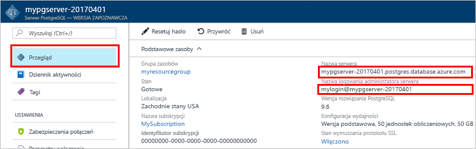

# <a name="design-your-first-azure-database-for-postgresql-using-hello-azure-portal"></a>Projektowanie pierwszą bazę danych Azure do PostgreSQL przy użyciu hello portalu Azure

Bazy danych platformy Azure dla PostgreSQL jest zarządzana usługa, która pozwala toorun, zarządzanie i skalowania wysokiej dostępności PostgreSQL baz danych w chmurze hello. Przy użyciu hello portalu Azure, można łatwo zarządzać serwerem i projektowanie bazy danych.

W tym samouczku użyjesz hello toolearn portalu Azure, jak do:
> [!div class="checklist"]
> * Tworzenie serwera usługi Azure Database for PostgreSQL
> * Konfigurowanie zapory serwera hello
> * Użyj [ **psql** ](https://www.postgresql.org/docs/9.6/static/app-psql.html) toocreate Narzędzia bazy danych
> * Ładuj dane przykładowe
> * Zapytania o dane
> * Aktualizowanie danych
> * Przywracanie danych

## <a name="prerequisites"></a>Wymagania wstępne
Jeśli nie masz subskrypcji platformy Azure, przed rozpoczęciem utwórz [bezpłatne](https://azure.microsoft.com/free/) konto.

## <a name="log-in-toohello-azure-portal"></a>Zaloguj się za toohello portalu Azure
Zaloguj się za toohello [portalu Azure](https://portal.azure.com).

## <a name="create-an-azure-database-for-postgresql"></a>Tworzenie serwera usługi Azure Database for PostgreSQL

Serwer usługi Azure Database for PostgreSQL jest tworzony ze zdefiniowanym zestawem [zasobów obliczeniowych i przestrzeni dyskowej](./concepts-compute-unit-and-storage.md). Serwer Hello jest tworzony w [grupy zasobów platformy Azure](../azure-resource-manager/resource-group-overview.md).

Wykonaj te kroki toocreate bazy danych Azure PostgreSQL serwera:
1.  Kliknij przycisk hello **+ nowy** znaleziono przycisku na powitania lewym górnym rogu hello portalu Azure.
2.  Wybierz **baz danych** z hello **nowy** i wybrać opcję **bazą danych Azure dla PostgreSQL** z hello **baz danych** strony.
 

3.  Wypełnianie hello nowego serwera szczegóły formularza z hello następujących informacji, jak pokazano na powitania poprzedzających obrazu:
    - Nazwa serwera: **mypgserver 20170401** (nazwa serwera mapuje nazwę tooDNS i w związku z tym jest wymagana toobe globalnie unikatowy) 
    - Subskrypcja: Jeśli masz wiele subskrypcji, wybierz hello odpowiednie subskrypcji, w którym hello zasobów istnieje lub jest on rozliczany dla.
    - Grupa zasobów: **myresourcegroup**
    - Wybrane przez Ciebie login i hasło administratora serwera
    - Lokalizacja
    - Wersja PostgreSQL

  > [!IMPORTANT]
  > Hello identyfikator logowania administratora serwera i hasło, które są określone w tym miejscu są wymagane toolog Server toohello i jej baz danych w dalszej części tego szybki start. Zapamiętaj lub zapisz te informacje do wykorzystania w przyszłości.

4.  Kliknij przycisk **warstwa cenowa** toospecify hello warstwę i poziom wydajności usługi dla nowej bazy danych. W tym przewodniku Szybki start wybierz warstwę **Podstawowa**, **50 jednostek obliczeniowych** i **50 GB** dołączonej pamięci.
 
5.  Kliknij przycisk **OK**.
6.  Kliknij przycisk **Utwórz** tooprovision powitania serwera. Aprowizacja zajmuje kilka minut.

  > [!TIP]
  > Sprawdź hello **toodashboard numeru Pin** opcji tooallow łatwe monitorowanie wdrożeń.

7.  Na pasku narzędzi hello, kliknij przycisk **powiadomienia** procesu wdrażania hello toomonitor.
 
   
  Domyślnie baza danych **postgres** zostanie utworzona na Twoim serwerze. Witaj [postgres](https://www.postgresql.org/docs/9.6/static/app-initdb.html) baza danych jest domyślna baza danych przeznaczone do użytku przez użytkowników, narzędzia i aplikacje innych producentów. 

## <a name="configure-a-server-level-firewall-rule"></a>Konfigurowanie reguły zapory na poziomie serwera

Hello Azure bazy danych dla usługi PostgreSQL tworzy zapory na poziomie serwera hello. Zapora uniemożliwia aplikacji zewnętrznych i narzędzia łączenia serwera toohello i żadnych baz danych na serwerze hello, chyba że tooopen hello zapory dla określonych adresów IP jest tworzona reguła zapory. 

1.  Po zakończeniu wdrażania hello, kliknij przycisk **wszystkie zasoby** z menu po lewej stronie powitania i wpisz nazwę hello **mypgserver 20170401** toosearch dla nowo utworzonego serwera. Kliknij nazwę serwera hello hello wynik wyszukiwania na liście. Witaj **omówienie** strony dla serwera zostanie otwarty i udostępnia opcje dla dalszej konfiguracji.
 
 

2.  W bloku serwera hello, wybierz **zabezpieczenia połączeń**. 
3.  Kliknij w polu tekstowym hello w obszarze **Nazwa reguły** i dodać nowe zapory reguły toowhitelist hello zakres adresów IP w łączności. W tym samouczku umożliwia Zezwalaj na wszystkie adresy IP, wpisując w **Rule Name = AllowAllIps**, **Start IP = 0.0.0.0** i **końcowemu adresowi IP = 255.255.255.255** , a następnie kliknij przycisk **Zapisz** . Można ustawić reguły zapory, która obejmuje IP zakresu toobe stanie tooconnect z sieci.
 
 

4.  Kliknij przycisk **zapisać** , a następnie kliknij przycisk hello **X** tooclose hello **zabezpieczenia połączeń** strony.

  > [!NOTE]
  > Serwer Azure PostgreSQL komunikuje się przez port 5432. Jeśli próbujesz tooconnect z sieci firmowej, ruch wychodzący przez port 5432 może nie być dozwolone przez zaporę w sieci. Jeśli tak, nie będzie serwera bazy danych SQL Azure tooyour stanie tooconnect, chyba że dział IT otwiera port 5432.
  >


## <a name="get-hello-connection-information"></a>Pobierz informacje o połączeniu hello

Tworząc naszej bazie danych Azure dla serwera PostgreSQL, hello domyślne **postgres** bazy danych również pobiera utworzony. tooconnect tooyour serwera bazy danych, należy tooprovide hosta dostępu i informacji o poświadczenia.

1. Z menu po lewej stronie powitania w portalu Azure, kliknij przycisk **wszystkie zasoby** i wyszukaj serwera hello właśnie utworzony **mypgserver 20170401**.

  

3. Kliknij nazwę serwera hello **mypgserver 20170401**.
4. Wybierz powitania serwera **omówienie** strony. Zanotuj hello **nazwy serwera** i **nazwę logowania administratora serwera**.

 


## <a name="connect-toopostgresql-database-using-psql-in-cloud-shell"></a>Połącz tooPostgreSQL bazy danych przy użyciu psql w powłoce chmury

Użyjmy teraz hello psql narzędzia wiersza polecenia tooconnect toohello bazy danych Azure, PostgreSQL serwera. 
1. Uruchom program hello powłoki chmury Azure za pomocą ikony terminali hello w okienku nawigacji w górnym hello.

   

2. Witaj powłoki chmury Azure otwiera w przeglądarce, umożliwiając tootype bash polecenia.

   

3. W wierszu polecenia powłoki chmury hello połączyć tooyour bazy danych Azure za pomocą poleceń psql powitania serwera PostgreSQL. Witaj następujący format jest używane tooconnect tooan Azure bazy danych dla serwera PostgreSQL z hello [psql](https://www.postgresql.org/docs/9.6/static/app-psql.html) narzędzie:
   ```bash
   psql --host=<myserver> --port=<port> --username=<server admin login> --dbname=<database name>
   ```

   Na przykład następujące polecenie hello łączy toohello domyślna baza danych o nazwie **postgres** na serwerze PostgreSQL **mypgserver 20170401.postgres.database.azure.com** przy użyciu poświadczeń dostępu. Po wyświetleniu monitu wprowadź hasło administratora serwera.

   ```bash
   psql --host=mypgserver-20170401.postgres.database.azure.com --port=5432 --username=mylogin@mypgserver-20170401 --dbname=postgres
   ```

## <a name="create-a-new-database"></a>Utwórz nową bazę danych
Po wyświetleniu toohello połączony serwer Utwórz pustą bazę danych w wierszu hello.
```bash
CREATE DATABASE mypgsqldb;
```

W wierszu polecenia hello wykonania hello następujące polecenia tooswitch połączenia toohello nowo utworzone w bazie danych **mypgsqldb**.
```bash
\c mypgsqldb
```
## <a name="create-tables-in-hello-database"></a>Tworzenie tabel w bazie danych hello
Teraz, gdy wiesz, jak toohello tooconnect bazą danych Azure dla PostgreSQL, firma Microsoft może przejść w sposób toocomplete niektóre podstawowe zadania.

Firma Microsoft najpierw utwórz tabelę i załaduj go z niektórych danych. Ta funkcja pozwala utworzyć tabelę, która śledzi informacje o spisie.
```sql
CREATE TABLE inventory (
    id serial PRIMARY KEY, 
    name VARCHAR(50), 
    quantity INTEGER
);
```

Można wyświetlić hello nowo utworzona tabela hello liście tabvles teraz, wpisując:
```sql
\dt
```

## <a name="load-data-into-hello-tables"></a>Ładowanie danych do tabel hello
Teraz, gdy mamy tabeli możemy wstawić niektóre dane do niego. W oknie wiersza polecenia Otwórz hello uruchom następujące zapytanie tooinsert hello niektórych wierszy danych
```sql
INSERT INTO inventory (id, name, quantity) VALUES (1, 'banana', 150); 
INSERT INTO inventory (id, name, quantity) VALUES (2, 'orange', 154);
```

Masz teraz dwa wiersze przykładowych danych do tabeli hello, utworzony wcześniej.

## <a name="query-and-update-hello-data-in-hello-tables"></a>Zapytania i Aktualizuj hello dane w tabelach hello
Wykonanie poniższych informacji tooretrieve zapytania z tabeli bazy danych hello hello. 
```sql
SELECT * FROM inventory;
```

Można także zaktualizować hello dane w tabelach hello
```sql
UPDATE inventory SET quantity = 200 WHERE name = 'banana';
```

wiersz Hello pobiera odpowiednio aktualizowany podczas pobierania danych.
```sql
SELECT * FROM inventory;
```

## <a name="restore-data-tooa-previous-point-in-time"></a>Przywracanie danych tooa wcześniejszego punktu w czasie
Załóżmy, że zostanie przypadkowo usunięte w tej tabeli. Ta sytuacja jest coś, co nie można łatwo odzyskać z. Bazy danych platformy Azure dla PostgreSQL umożliwia toogo tooany Wstecz w momencie (w hello ostatnich dni too7 (Basic) i 35 dni (standardowe)) i przywracania w momencie tooa nowego serwera. Można użyć tego nowego serwera toorecover usunięte dane. Witaj następujące kroki przywracania hello przykładowy serwer tooa punkt przed dodano hello tabeli.

1.  Na hello Azure bazy danych PostgreSQL strony serwera, kliknij przycisk **przywrócić** na powitania narzędzi. Witaj **przywrócić** zostanie otwarta strona.
  
2.  Wypełnianie hello **przywrócić** formularza hello wymagane informacje:

  
  - **Punkt przywracania**: Wybierz w momencie po hello serwer został zmieniony
  - **Serwer docelowy**: Podaj nową nazwę serwera ma toorestore do
  - **Lokalizacja**: nie można wybrać hello region, domyślnie jest taka sama jak powitania serwera źródłowego
  - **Warstwa cenowa**: nie można zmienić tę wartość podczas przywracania serwera. Jest taki sam jak powitania serwera źródłowego. 
3.  Kliknij przycisk **OK** toorestore hello serwera zbyt[tooa w momencie przywracania](./howto-restore-server-portal.md) przed tabel hello został usunięty. Przywracanie serwera tooa innego punktu w czasie tworzy zduplikowane nowy serwer jako hello oryginalny serwer określoną hello punktu w czasie, pod warunkiem, że w okresie przechowywania hello dla Twojego [warstwy usług](./concepts-service-tiers.md).

## <a name="next-steps"></a>Następne kroki
W tym samouczku przedstawiono sposób toouse hello portalu Azure i inne narzędzia do:
> [!div class="checklist"]
> * Tworzenie serwera usługi Azure Database for PostgreSQL
> * Konfigurowanie zapory serwera hello
> * Użyj [ **psql** ](https://www.postgresql.org/docs/9.6/static/app-psql.html) toocreate Narzędzia bazy danych
> * Ładuj dane przykładowe
> * Zapytania o dane
> * Aktualizowanie danych
> * Przywracanie danych

Następnie Dowiedz się, jak toouse interfejsu wiersza polecenia Azure toodo podobne zadania, przejrzyj tego samouczka: [projektowanie pierwszą bazę danych Azure do PostgreSQL przy użyciu wiersza polecenia platformy Azure](tutorial-design-database-using-azure-cli.md)
