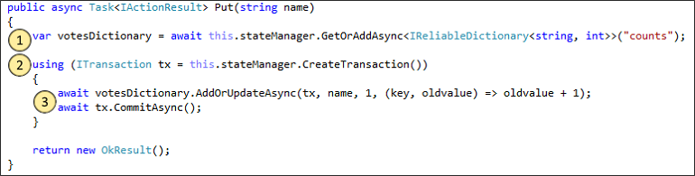

# <a name="create-a-net-service-fabric-application-in-azure"></a>Tworzenie aplikacji sieci szkieletowej usług .NET na platformie Azure
Usługa Azure Service Fabric to platforma systemów rozproszonych ułatwiająca pakowanie i wdrażanie skalowalnych oraz niezawodnych mikrousług i kontenerów, a także zarządzanie nimi. 

Ta opcja szybkiego startu przedstawia sposób toodeploy Twojego pierwszego tooService aplikacja .NET sieci szkieletowej. Po zakończeniu, masz aplikację do głosowania z frontonu, który zapisuje wyniki głosowania stanowe usługi zaplecza w klastrze hello sieci web platformy ASP.NET Core.


Za pomocą tej aplikacji, możesz dowiedzieć się, jak:
> [!div class="checklist"]
> * Tworzenie aplikacji przy użyciu platformy .NET i sieci szkieletowej usług
> * Użyj jako frontonu sieci web platformy ASP.NET core
> * Przechowywanie danych aplikacji w usługi stanowej
> * Debugowanie aplikacji lokalnie
> * Wdrażanie klastra tooa aplikacji hello na platformie Azure
> * Aplikacja hello skalowalnego w poziomie w wielu węzłach
> * Uaktualnienie stopniowe aplikacji

## <a name="prerequisites"></a>Wymagania wstępne
toocomplete tego przewodnika Szybki Start:
1. [Zainstaluj program Visual Studio 2017](https://www.visualstudio.com/) z hello **Azure programowanie** i **ASP.NET i sieć web development** obciążeń.
2. [Zainstaluj oprogramowanie Git](https://git-scm.com/)
3. [Zainstaluj zestaw SDK usługi Microsoft Azure Service Fabric hello](http://www.microsoft.com/web/handlers/webpi.ashx?command=getinstallerredirect&appid=MicrosoftAzure-ServiceFabric-CoreSDK)
4. Uruchom następujące polecenie tooenable Visual Studio toodeploy toohello lokalnego klastra sieci szkieletowej usług hello:
    ```powershell
    Set-ExecutionPolicy -ExecutionPolicy Unrestricted -Force -Scope CurrentUser
    ```

## <a name="download-hello-sample"></a>Pobierz przykładowe hello
W oknie polecenie Uruchom hello następujące polecenia tooclone hello przykładowej aplikacji repozytorium tooyour komputera lokalnego.
```
git clone https://github.com/Azure-Samples/service-fabric-dotnet-quickstart
```

## <a name="run-hello-application-locally"></a>Uruchamianie aplikacji hello lokalnie
Kliknij prawym przyciskiem myszy ikonę programu Visual Studio hello hello Start Menu i wybierz polecenie **Uruchom jako administrator**. W kolejności tooattach hello debugera tooyour usługi należy toorun Visual Studio jako administrator.

Otwórz hello **Voting.sln** rozwiązania Visual Studio z sklonowanego repozytorium hello.

Aplikacja hello toodeploy, naciśnij klawisz **F5**.

> [!NOTE]
> Witaj pierwszego uruchomienia i wdrażanie aplikacji hello, Visual Studio tworzy lokalny klaster na potrzeby debugowania. Ta operacja może potrwać pewien czas. Stan tworzenia klastra Hello jest wyświetlany w oknie danych wyjściowych programu Visual Studio hello.

Po zakończeniu wdrażania hello przeglądarkę i otwórz tę stronę: `http://localhost:8080` -hello frontonu hello aplikacji sieci web.


Można teraz dodać zestaw głosowania opcje i Rozpocznij tworzenie głosów. Aplikacja Hello jest uruchamiana i przechowuje wszystkie dane w klastrze usługi sieć szkieletowa, bez potrzeby hello oddzielnej bazy danych.

## <a name="walk-through-hello-voting-sample-application"></a>Przewodnik po głosowanie w przykładowej aplikacji hello
głosowania aplikacji Hello składa się z dwóch usług:
- Usługa frontonu (VotingWeb) sieci Web — platformy ASP.NET Core usługi frontonu, która służy hello strony sieci web i ujawnia sieci web API toocommunicate hello usługi wewnętrznej bazy danych.
- Usługi zaplecza (VotingData) — usługi sieci web platformy ASP.NET Core, która ujawnia interfejsu API toostore hello głos powoduje niezawodnej słownika utrwalony na dysku.


Po głosowanie w hello aplikacji hello następującego wystąpienia zdarzeń:
1. JavaScript wysyła hello głos żądanie toohello interfejsu API sieci web usługi frontonu sieci web hello jako żądanie HTTP PUT.

2. Usługa frontonu sieci web Hello używa toolocate serwera proxy i przesyła usługi zaplecza HTTP PUT toohello żądania.

3. usługi zaplecza Hello przyjmuje hello żądania przychodzącego, a hello magazynów zaktualizowany wynik w niezawodnej słownik, który pobiera replikowanych toomultiple węzłów w klastrze hello i utrwalony na dysku. Dane wszystkich aplikacji hello są przechowywane w klastrze hello, więc nie bazy danych nie jest wymagane.

## <a name="debug-in-visual-studio"></a>Debugowanie w programie Visual Studio
Podczas debugowania aplikacji w programie Visual Studio, czy używasz klastra lokalnego Projektowanie sieci szkieletowej usług. Masz hello tooadjust opcji debugowania scenariusz tooyour środowisko. W tej aplikacji są przechowywane dane w naszej usługi zaplecza przy użyciu niezawodnych słownika. Po zatrzymaniu debugera hello programu Visual Studio spowoduje usunięcie aplikacji hello na domyślne. Usunięcie aplikacji hello powoduje hello danych w wewnętrznej hello tooalso usługi można usunąć. toopersist hello danych między sesji debugowania, możesz zmienić hello **tryb debugowania aplikacji** jako właściwość hello **głosowania** projektu programu Visual Studio.

toolook na co się stanie w kodzie hello, pełną hello następujące kroki:
1. Otwórz hello **VotesController.cs** pliku i ustaw punkt przerwania w składniku web API hello **Put** — metoda (linii 47) — możesz wyszukać plik hello w hello Eksploratora rozwiązań w programie Visual Studio.

2. Otwórz hello **VoteDataController.cs** pliku i ustaw punkt przerwania w tym składnika web API **Put** — metoda (wiersz 50).

3. Przejść toohello przeglądarki i kliknij opcję głosu lub dodać nową opcję głosu. Naciśniesz hello pierwszy punkt przerwania hello web przodu end w kontrolerze interfejsu api.
    - Jest to, gdzie hello JavaScript w przeglądarce hello wysyła kontrolera interfejsu API sieci web toohello żądania w hello usługi frontonu.
    
    

    - Najpierw możemy utworzyć hello adresu URL toohello ReverseProxy dla naszej usługi zaplecza **(1)**.
    - Następnie możemy wysłać hello HTTP PUT żądanie toohello ReverseProxy **(2)**.
    - Na koniec hello zostanie zwrócona odpowiedź hello z klienta toohello usługi zaplecza hello **(3)**.

4. Naciśnij klawisz **F5** toocontinue
    - Jesteś teraz w punkcie przerwania hello hello usługi zaplecza.
    
    

    - W hello pierwszego wiersza w metodzie hello **(1)** używamy hello `StateManager` tooget lub dodać słownika niezawodnej o nazwie `counts`.
    - Wszystkie interakcje z wartości w słowniku niezawodnej wymagają transakcji, za pomocą tej instrukcji **(2)** tworzy tej transakcji.
    - W transakcji hello modyfikacjom następnie hello wartość hello odpowiedniego klucza hello głosowania opcji i zatwierdzeń hello operacji **(3)**. Po zatwierdzić hello metoda zwróci wartość, hello danych jest aktualizowany w słowniku hello i replikowane tooother węzłów w klastrze hello. dane Hello teraz są bezpiecznie przechowywane w hello klastra, a usługi zaplecza hello może przełączyć się węzłów tooother zachowaniu hello dostępnych danych.
5. Naciśnij klawisz **F5** toocontinue

hello toostop sesję, naciśnij klawisz debugowania **Shift + F5**.

## <a name="deploy-hello-application-tooazure"></a>Wdrażanie tooAzure aplikacji hello
toodeploy hello tooa klastrze aplikacji na platformie Azure, można wybrać toocreate własnych klastra lub użyj klastra strony.

Klastry firm są bezpłatne, ograniczonej czasowo klastrów sieci szkieletowej usług hostowanej na platformie Azure i uruchom przez zespół usługi sieć szkieletowa hello którym każda osoba, która wdrażania aplikacji i Dowiedz się więcej o hello platformy. tooget dostępu tooa klastra strona [postępuj zgodnie z instrukcjami hello](http://aka.ms/tryservicefabric). 

Aby uzyskać informacje na temat tworzenia własnego klastra, zobacz [Tworzenie pierwszego klastra usługi Service Fabric na platformie Azure](service-fabric-get-started-azure-cluster.md).

> [!Note]
> Usługa frontonu sieci web Hello jest skonfigurowany toolisten na porcie 8080 dla ruchu przychodzącego. Upewnij się, że port w klastrze został otwarty. Jeśli używasz hello klastra strona ten port jest otwarty.
>

### <a name="deploy-hello-application-using-visual-studio"></a>Wdrażanie aplikacji hello przy użyciu programu Visual Studio
Teraz, aplikacja hello jest gotowy, można wdrożyć klaster tooa bezpośrednio z programu Visual Studio.

1. Kliknij prawym przyciskiem myszy **głosowania** w hello Eksploratorze rozwiązań i wybierz polecenie **publikowania**. zostanie wyświetlone okno dialogowe publikowania Hello.

    

2. Typ w hello punktu końcowego połączenia klastra hello w hello **punktu końcowego połączenia** a następnie kliknij przycisk **publikowania**. Podczas rejestracji hello strona klastra, hello punktu końcowego połączenia znajduje się w przeglądarce hello. — na przykład `winh1x87d1d.westus.cloudapp.azure.com:19000`.

3. Otwórz przeglądarkę i typ adres klastra hello — na przykład `http://winh1x87d1d.westus.cloudapp.azure.com`. Powinna zostać wyświetlona aplikacja hello uruchomiona w klastrze hello na platformie Azure.


## <a name="scale-applications-and-services-in-a-cluster"></a>Skalowanie aplikacji i usług w klastrze
Łatwo można skalować usługi sieć szkieletowa usług między tooaccommodate klastra, zmiany w hello obciążenie hello usług. Zmieniając hello liczbę wystąpień w klastrze hello zmiany skali usługi. Istnieje wiele sposobów skalowania usługi, możesz użyć skryptów lub poleceń programu PowerShell lub interfejsu wiersza polecenia usługi sieci szkieletowej (sfctl). W tym przykładzie użyto Service Fabric Explorer.

Service Fabric Explorer działa we wszystkich klastrach sieci szkieletowej usług i jest dostępny z poziomu przeglądarki, przeglądając port zarządzania klastrami HTTP toohello (19080), na przykład `http://winh1x87d1d.westus.cloudapp.azure.com:19080`.

Witaj tooscale usługi frontonu sieci web, hello następujące kroki:

1. Otwórz narzędzie Service Fabric Explorer w klastrze — na przykład `http://winh1x87d1d.westus.cloudapp.azure.com:19080`.
2. Kliknij pozycję dalej toohello wielokropka (wielokropek) hello **sieci szkieletowej: / głosowania/VotingWeb** węzła w hello treeview i wybierz polecenie **skali usługi**.

    

    Teraz możesz tooscale hello liczbę wystąpień usługi frontonu sieci web hello.

3. Zmień numer hello zbyt**2** i kliknij przycisk **skali usługi**.
4. Polecenie hello **fabric: / głosowania/VotingWeb** węzeł w widoku drzewa hello i rozwiń węzeł partycji hello (reprezentowane przez identyfikator GUID).

    

    Usługa hello ma dwa wystąpienia, czy w widoku drzewa hello Zobacz węzły, których wystąpienia hello uruchamiane na będą teraz widoczne.

Przez to zadanie proste zarządzanie możemy podwójny dostępnych zasobów hello obciążenie użytkownikami tooprocess naszej usługi frontonu. Jest ważne toounderstand, który nie ma potrzeby wielu wystąpień toohave usługi, działa on prawidłowo. W przypadku niepowodzenia usługi sieć szkieletowa usług zapewnia, że nowe wystąpienie usługi działa w klastrze hello.

## <a name="perform-a-rolling-application-upgrade"></a>Uaktualnienie stopniowe aplikacji
Podczas wdrażania nowej aplikacji tooyour aktualizacje, Service Fabric wprowadza hello aktualizacji w bezpieczny sposób. Uaktualnień stopniowych daje bez przestojów podczas uaktualniania oraz automatycznego wycofywania powinien wystąpić błędy.

tooupgrade hello aplikacji, hello następujące:

1. Otwórz hello **Index.cshtml** pliku w Visual Studio — można wyszukać plik hello w hello Eksploratora rozwiązań w programie Visual Studio.
2. Zmień nagłówek hello na stronie powitania przez dodanie tekstem — na przykład.
    ```html
        <div class="col-xs-8 col-xs-offset-2 text-center">
            <h2>Service Fabric Voting Sample v2</h2>
        </div>
    ```
3. Zapisz plik hello.
4. Kliknij prawym przyciskiem myszy **głosowania** w hello Eksploratorze rozwiązań i wybierz polecenie **publikowania**. zostanie wyświetlone okno dialogowe publikowania Hello.
5. Kliknij przycisk hello **wersji manifestu** przycisk toochange hello wersji hello usług i aplikacji.
6. Zmiana wersji hello hello **kod** elementu w obszarze **VotingWebPkg** zbyt "2.0.0", na przykład, a następnie kliknij przycisk **zapisać**.

    
7. W hello **publikowania aplikacji sieci szkieletowej usług** okna dialogowego, sprawdź hello hello uaktualniania aplikacji wyboru i kliknij **publikowania**.

    
8. Otwórz przeglądarkę i przejdź toohello adres klastra na porcie 19080 — na przykład `http://winh1x87d1d.westus.cloudapp.azure.com:19080`.
9. Polecenie hello **aplikacji** węzła w widoku drzewa hello, a następnie **uaktualnień w toku** w okienku po prawej stronie powitania. Zostanie wyświetlony sposobu uaktualniania hello przedstawia za pośrednictwem hello domen uaktualnienia w klastrze, upewniając się, że każdej domeny jest w dobrej kondycji przed kontynuowaniem toohello dalej.
    

    Sieć szkieletowa usług pozwala uaktualnienia bezpieczne oczekuje dwóch minut po uaktualnieniu usługi hello w każdym węźle klastra hello. Oczekiwane tootake aktualizowania hello około 8 minut.

10. Podczas uaktualniania hello, można nadal używać aplikacji hello. Ponieważ dwa wystąpienia usługi hello uruchomiona w klastrze hello, niektóre żądania mogą wystąpić uaktualnionej wersji aplikacji hello, podczas gdy inne osoby, może nadal otrzymywać hello starą wersję.

## <a name="next-steps"></a>Następne kroki
W tym przewodniku Szybki start zawarto informacje na temat wykonywania następujących czynności:

> [!div class="checklist"]
> * Tworzenie aplikacji przy użyciu platformy .NET i sieci szkieletowej usług
> * Użyj jako frontonu sieci web platformy ASP.NET core
> * Przechowywanie danych aplikacji w usługi stanowej
> * Debugowanie aplikacji lokalnie
> * Wdrażanie klastra tooa aplikacji hello na platformie Azure
> * Aplikacja hello skalowalnego w poziomie w wielu węzłach
> * Uaktualnienie stopniowe aplikacji

toolearn więcej informacji na temat sieci szkieletowej usług i .NET, zapoznaj się z informacjami w tym samouczku:
> [!div class="nextstepaction"]
> [Aplikacji .NET w sieci szkieletowej usług](service-fabric-tutorial-create-dotnet-app.md)