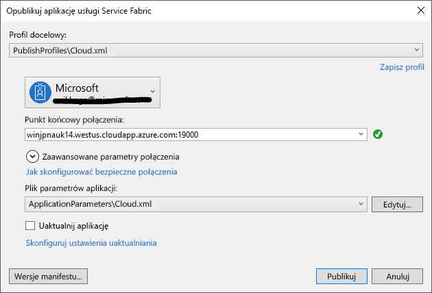

# <a name="deploy-an-application-tooa-party-cluster-in-azure"></a>Wdrażanie aplikacji tooa klastra strony na platformie Azure
W tym samouczku jest częścią dwóch serii i przedstawiono toodeploy tooa aplikacji sieci szkieletowej usług Azure klastra strony na platformie Azure.

W części samouczka serii hello, możesz dowiedzieć się, jak:
> [!div class="checklist"]
> * Wdrażanie aplikacji tooa zdalnego klastra przy użyciu programu Visual Studio
> * Usuń aplikację z klastra przy użyciu Eksploratora usługi sieć szkieletowa

W tym samouczku dowiesz się, jak:
> [!div class="checklist"]
> * [Tworzenie aplikacji sieci szkieletowej usług .NET](service-fabric-tutorial-create-dotnet-app.md)
> * Wdrażanie klastra zdalnego tooa aplikacji hello
> * [Konfigurowanie elementu konfiguracji/CD za pomocą programu Visual Studio Team Services](service-fabric-tutorial-deploy-app-with-cicd-vsts.md)

## <a name="prerequisites"></a>Wymagania wstępne
Przed rozpoczęciem tego samouczka:
- Jeśli nie masz subskrypcji platformy Azure, Utwórz [bezpłatne konto](https://azure.microsoft.com/free/?WT.mc_id=A261C142F)
- [Zainstaluj program Visual Studio 2017](https://www.visualstudio.com/) i zainstaluj hello **Azure programowanie** i **ASP.NET i sieć web development** obciążeń.
- [Zainstaluj hello zestawu SDK sieci szkieletowej usług](service-fabric-get-started.md)

## <a name="download-hello-voting-sample-application"></a>Pobierz hello głosowania przykładowej aplikacji
Jeśli nie zbudować hello głosowania przykładowej aplikacji [część jednego z tego samouczka serii](service-fabric-tutorial-create-dotnet-app.md), można go pobrać. W oknie polecenie Uruchom hello następujące polecenia tooclone hello przykładowej aplikacji repozytorium tooyour komputera lokalnego.

```
git clone https://github.com/Azure-Samples/service-fabric-dotnet-quickstart
```

## <a name="set-up-a-party-cluster"></a>Konfigurowanie klastra strony
Klastry firm są bezpłatne, ograniczonej czasowo klastrów sieci szkieletowej usług hostowanej na platformie Azure i uruchom przez zespół usługi sieć szkieletowa hello którym każda osoba, która wdrażania aplikacji i Dowiedz się więcej o hello platformy. Bezpłatnie!

tooget dostępu tooa klastra strony Przeglądanie witryny toothis: http://aka.ms/tryservicefabric i wykonaj hello instrukcje tooget tooa klastra dostępu. Należy Facebook lub GitHub konta tooget dostępu tooa strona klastra.

> [!NOTE]
> Klastry firm nie są zabezpieczone, dlatego aplikacji i danych, które należy umieścić w nich może być widoczny tooothers. Nie zostanie wdrożona niczego nie ma innych toosee. Być tooread się za pośrednictwem szczegółowe hello naszych warunków użytkowania.

## <a name="configure-hello-listening-port"></a>Skonfiguruj port nasłuchujący hello
Po utworzeniu hello VotingWeb frontonu usługi Visual Studio losowo wybiera port toolisten usługi hello na.  Hello usługi VotingWeb działa jako hello frontonu dla tej aplikacji i akceptuje ruch zewnętrzny, więc warto powiązać tooa tej usługi, stałe i także znać port. W Eksploratorze rozwiązań Otwórz *VotingWeb/PackageRoot/ServiceManifest.xml*.  Znajdź hello **punktu końcowego** zasobu w hello **zasobów** sekcji i zmień hello **portu** too80 wartość.

```xml
<Resources>
    <Endpoints>
      <!-- This endpoint is used by hello communication listener tooobtain hello port on which too
           listen. Please note that if your service is partitioned, this port is shared with 
           replicas of different partitions that are placed in your code. -->
      <Endpoint Protocol="http" Name="ServiceEndpoint" Type="Input" Port="80" />
    </Endpoints>
  </Resources>
```

Również zaktualizować wartość właściwości adresu URL aplikacji hello w projekcie głosowania hello, więc przeglądarki sieci web otwiera toohello poprawnego portu podczas debugowania za pomocą "F5".  W Eksploratorze rozwiązań wybierz hello **głosowania** hello projektu i zaktualizuj **adres URL aplikacji** właściwości.


## <a name="deploy-hello-app-toohello-azure"></a>Wdrażanie toohello aplikacji hello Azure
Teraz, aplikacja hello jest gotowy, można wdrożyć toohello strona klastra bezpośrednio z programu Visual Studio.

1. Kliknij prawym przyciskiem myszy **głosowania** w hello Eksploratorze rozwiązań i wybierz polecenie **publikowania**.

    

2. Typ w hello punktu końcowego połączenia hello klastra strony w hello **punktu końcowego połączenia** a następnie kliknij przycisk **publikowania**.

    Po hello Publikowanie zakończone, należy stanie toosend aplikacją toohello żądanie za pośrednictwem przeglądarki.

3. Otwórz preferowane przeglądarkę i wprowadź adres klastra hello (hello punktu końcowego połączenia bez informacji o porcie hello — na przykład win1kw5649s.westus.cloudapp.azure.com).

    Powinna zostać wyświetlona hello powoduje takie same, jak przedstawiono przy uruchamianiu aplikacji hello lokalnie.

    

## <a name="remove-hello-application-from-a-cluster-using-service-fabric-explorer"></a>Usuwanie aplikacji hello z klastra za pomocą Eksploratora usługi sieć szkieletowa
Eksploratora usługi sieć szkieletowa jest tooexplore interfejsu graficznego użytkownika aplikacji i zarządzanie nimi w klastrze usługi sieć szkieletowa usług.

Aplikacja hello tooremove z hello strona klastra:

1. Przeglądaj toohello Service Fabric Explorer, za pomocą łącza hello dostarczonych przez stronę tworzenia konta hello strona klastra. Na przykład http://win1kw5649s.westus.cloudapp.azure.com:19080/Explorer/index.html.

2. W narzędziu Service Fabric Explorer, przejdź toohello **fabric://Voting** węzła w elemencie treeview hello na powitania po lewej stronie.

3. Kliknij przycisk hello **akcji** przycisku na powitania po prawej stronie **Essentials** okienko i wybierz polecenie **Usuń aplikację**. Potwierdź usunięcie hello wystąpienia aplikacji, co spowoduje usunięcie wystąpienia hello naszej aplikacji uruchomionych w klastrze hello.


## <a name="remove-hello-application-type-from-a-cluster-using-service-fabric-explorer"></a>Usuń typ aplikacji hello z klastra przy użyciu Eksploratora usługi sieć szkieletowa
Jako typy aplikacji w klastrze usługi sieć szkieletowa, dzięki czemu można toohave wiele wystąpień i wersji aplikacji hello uruchomiona w klastrze hello wdrożenia aplikacji. Po usunięto hello uruchomione wystąpienie aplikacji, firma Microsoft również usunąć hello typu oczyszczania hello toocomplete hello wdrożenia.

Aby uzyskać więcej informacji na temat modelu aplikacji hello w sieci szkieletowej usług, zobacz [modelu aplikacji w sieci szkieletowej usług](service-fabric-application-model.md).

1. Przejdź toohello **VotingType** węzła w elemencie treeview hello.

2. Kliknij przycisk hello **akcji** przycisku na powitania po prawej stronie **Essentials** okienko i wybierz polecenie **Cofnij Aprowizację typu**. Potwierdź cofanie aprowizacji typu aplikacji hello.


To jest zakończenie samouczka hello.

## <a name="next-steps"></a>Następne kroki
W niniejszym samouczku zawarto informacje na temat wykonywania następujących czynności:

> [!div class="checklist"]
> * Wdrażanie aplikacji tooa zdalnego klastra przy użyciu programu Visual Studio
> * Usuń aplikację z klastra przy użyciu Eksploratora usługi sieć szkieletowa

Następny samouczek toohello wyprzedzeniem:
> [!div class="nextstepaction"]
> [Konfigurowanie ciągłej integracji przy użyciu programu Visual Studio Team Services](service-fabric-tutorial-deploy-app-with-cicd-vsts.md)