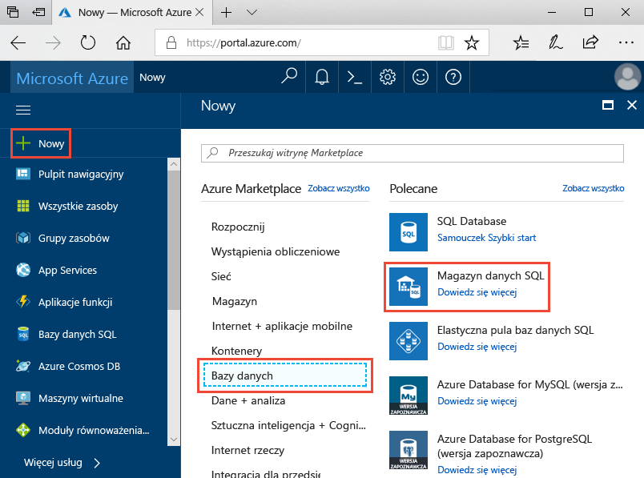
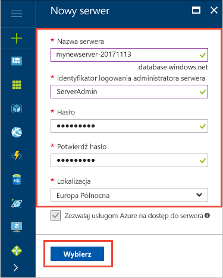
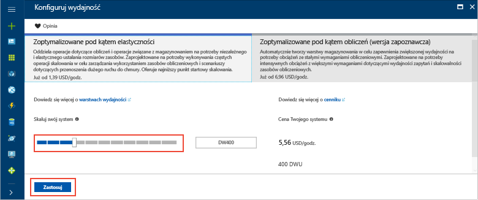
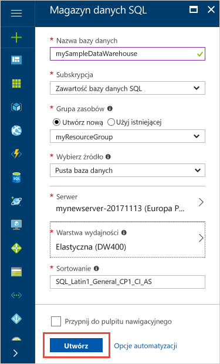

# <a name="use-polybase-to-load-data-from-azure-blob-storage-to-azure-sql-data-warehouse"></a>Użyj programu PolyBase, aby załadować dane z magazynu obiektów blob platformy Azure do usługi Azure SQL Data Warehouse

Program PolyBase jest standardowym ładowania technologii pobierania danych do usługi SQL Data Warehouse. W tym samouczku Użyj programu PolyBase do ładowania danych Nowy Jork Taxicab z magazynu obiektów blob platformy Azure do usługi Azure SQL Data Warehouse. W samouczku [portalu Azure](https://portal.azure.com) i [programu SQL Server Management Studio](/sql/ssms/download-sql-server-management-studio-ssms.md) (SSMS) do: 

> [!div class="checklist"]
> * Utwórz magazyn danych w portalu Azure
> * Reguły zapory poziomu serwera w portalu Azure
> * Nawiązać data warehouse przy użyciu narzędzia SSMS
> * Utwórz użytkownika wyznaczone do ładowania danych
> * Utwórz tabele zewnętrzne dla danych w magazynie obiektów blob platformy Azure
> * Użyj instrukcji CTAS T-SQL, aby załadować dane do magazynu danych
> * Wyświetlić postęp danych, ponieważ trwa jego ładowanie
> * Tworzenie statystyk na nowo załadowanych danych

Jeśli nie masz subskrypcji platformy Azure, [utworzyć bezpłatne konto](https://azure.microsoft.com/free/) przed rozpoczęciem.

## <a name="before-you-begin"></a>Przed rozpoczęciem

Przed rozpoczęciem tego samouczka, Pobierz i zainstaluj najnowszą wersję [programu SQL Server Management Studio](/sql/ssms/download-sql-server-management-studio-ssms.md) (SSMS).


## <a name="log-in-to-the-azure-portal"></a>Logowanie do witryny Azure Portal

Zaloguj się do witryny [Azure Portal](https://portal.azure.com/).

## <a name="create-a-blank-sql-data-warehouse"></a>Utwórz pusty magazyn danych SQL

Magazyn danych Azure SQL Data Warehouse jest tworzony ze zdefiniowanym zestawem [zasobów obliczeniowych](performance-tiers.md). Baza danych jest tworzona w [grupie zasobów platformy Azure](../azure-resource-manager/resource-group-overview.md) oraz na [serwerze logicznym SQL platformy Azure](../sql-database/sql-database-features.md). 

Wykonaj następujące kroki, aby utworzyć pusty SQL data warehouse. 

1. Kliknij przycisk **Nowy** w lewym górnym rogu witryny Azure Portal.

2. Na stronie **Nowy** wybierz pozycję **Bazy danych**, a następnie na stronie **Nowy** w obszarze **Polecane** wybierz pozycję **SQL Data Warehouse**.

    

3. Wypełnij formularz magazynu danych SQL Data Warehouse, używając następujących informacji:   

   | Ustawienie | Sugerowana wartość | Opis | 
   | ------- | --------------- | ----------- | 
   | **Nazwa bazy danych** | mySampleDataWarehouse | Prawidłowe nazwy baz danych opisano w artykule [Database Identifiers](/sql/relational-databases/databases/database-identifiers) (Identyfikatory baz danych). | 
   | **Subskrypcja** | Twoja subskrypcja  | Aby uzyskać szczegółowe informacje o subskrypcjach, zobacz [Subskrypcje](https://account.windowsazure.com/Subscriptions). |
   | **Grupa zasobów** | myResourceGroup | Prawidłowe nazwy grup zasobów opisano w artykule [Naming rules and restrictions](https://docs.microsoft.com/azure/architecture/best-practices/naming-conventions) (Reguły i ograniczenia nazewnictwa). |
   | **Wybierz źródło** | Pusta baza danych | Określa, aby utworzyć pustą bazę danych. Pamiętaj, że magazyn danych jest jednym z typów bazy danych.|

    

4. Kliknij pozycję **Serwer**, aby utworzyć i skonfigurować nowy serwer dla nowej bazy danych. Wypełnij **formularz nowego serwera**, używając następujących informacji: 

    | Ustawienie | Sugerowana wartość | Opis | 
    | ------- | --------------- | ----------- |
    | **Nazwa serwera** | Dowolna nazwa unikatowa w skali globalnej | Prawidłowe nazwy serwera opisano w artykule [Naming rules and restrictions](https://docs.microsoft.com/azure/architecture/best-practices/naming-conventions) (Reguły i ograniczenia nazewnictwa). | 
    | **Identyfikator logowania administratora serwera** | Dowolna prawidłowa nazwa | Prawidłowe nazwy identyfikatorów logowania opisano w artykule [Database Identifiers](https://docs.microsoft.com/sql/relational-databases/databases/database-identifiers) (Identyfikatory baz danych).|
    | **Hasło** | Dowolne prawidłowe hasło | Hasło musi mieć co najmniej osiem znaków i musi zawierać znaki z trzech z następujących kategorii: wielkie litery, małe litery, cyfry i znaki inne niż alfanumeryczne. |
    | **Lokalizacja** | Dowolna prawidłowa lokalizacja | Aby uzyskać informacje na temat regionów, zobacz temat [Regiony systemu Azure](https://azure.microsoft.com/regions/). |

    

5. Kliknij pozycję **Wybierz**.

6. Kliknij przycisk **warstwę wydajności** można określić, czy magazyn danych jest optymalizowany elastyczność lub obliczeniowych oraz liczbę danych magazynu jednostki. 

7. W tym samouczku, wybierz **zoptymalizowane pod kątem elastyczność** warstwy usług. Suwak jest domyślnie ustawiony na pozycję **DW400**.  Spróbuj przesunąć go w górę i w dół, aby zobaczyć, jak działa. 

    

8. Kliknij przycisk **Zastosuj**.
9. Na stronie usługi SQL Data Warehouse, wybierz **sortowania** dla bazy danych puste. W tym samouczku Użyj wartości domyślnej. Aby uzyskać więcej informacji na temat sortowań zobacz [sortowania](/sql/t-sql/statements/collations.md)

11. Teraz po uzupełnieniu formularza SQL Database kliknij przycisk **Utwórz**, aby aprowizować bazę danych. Aprowizacja zajmuje kilka minut. 

    

12. Na pasku narzędzi kliknij pozycję **Powiadomienia**, aby monitorować proces wdrażania.
    
     

## <a name="create-a-server-level-firewall-rule"></a>Tworzenie reguły zapory na poziomie serwera

Usługa SQL Data Warehouse tworzy zaporę na poziomie serwera, która uniemożliwia zewnętrznym aplikacjom i narzędziom łączenie się z serwerem i wszelkimi bazami danych na tym serwerze. Aby umożliwić łączność, możesz dodać reguły zezwalające na połączenia dla konkretnych adresów IP.  Wykonaj następujące kroki, aby utworzyć [regułę zapory na poziomie serwera](../sql-database/sql-database-firewall-configure.md) dla Twojego adresu IP klienta. 

> [!NOTE]
> Usługa SQL Data Warehouse komunikuje się przez port 1433. Jeśli próbujesz nawiązać połączenie z sieci firmowej, ruch wychodzący na porcie 1433 może być blokowany przez zaporę sieciową. Jeśli nastąpi taka sytuacja, nie będzie można nawiązać połączenia z serwerem usługi Azure SQL Database, chyba że dział IT otworzy port 1433.
>

1. Po ukończeniu wdrażania kliknij pozycję **Bazy danych SQL** w menu po lewej stronie i kliknij bazę danych **mySampleDatabase** na stronie **Bazy danych SQL**. Zostanie otwarta strona przeglądu bazy danych zawierająca w pełni kwalifikowaną nazwę serwera (na przykład **mynewserver-20171113.database.windows.net**) i opcje dalszej konfiguracji. 

2. Skopiuj tę w pełni kwalifikowaną nazwę serwera w celu nawiązania połączenia z serwerem i jego bazami danych w kolejnych przewodnikach Szybki start. Następnie kliknij nazwę serwera, aby otworzyć ustawienia serwera.

     

3. Kliknij nazwę serwera, aby otworzyć ustawienia serwera.

     

5. Kliknij pozycję **Pokaż ustawienia zapory**. Zostanie otwarta strona **Ustawienia zapory** dla serwera SQL Database. 

     

4. Kliknij pozycję **Dodaj adres IP klienta** na pasku narzędzi, aby dodać bieżący adres IP do nowej reguły zapory. Reguła zapory może otworzyć port 1433 dla pojedynczego adresu IP lub zakresu adresów IP.

5. Kliknij pozycję **Zapisz**. Dla bieżącego adresu IP zostanie utworzona reguła zapory na poziomie serwera otwierająca port 1433 na serwerze logicznym.

6. Kliknij przycisk **OK**, a następnie zamknij stronę **Ustawienia zapory**.

Teraz możesz łączyć się z serwerem SQL i jego magazynami danych przy użyciu tego adresu IP. Połączenie działa z programu SQL Server Management Studio lub dowolnego innego narzędzia. Przy łączeniu się używaj wcześniej utworzonego konta administratora serwera.  

> [!IMPORTANT]
> Domyślnie dostęp za pośrednictwem zapory usługi SQL Database jest włączony dla wszystkich usług platformy Azure. Kliknij pozycję **WYŁĄCZ** na tej stronie, a następnie kliknij przycisk **Zapisz**, aby wyłączyć zaporę dla wszystkich usług platformy Azure.

## <a name="get-the-fully-qualified-server-name"></a>Uzyskiwanie w pełni kwalifikowanej nazwy serwera

Uzyskaj w pełni kwalifikowaną nazwę serwera dla swojego serwera SQL w witrynie Azure Portal. Później będzie używać w pełni kwalifikowana nazwa podczas nawiązywania połączenia z serwerem.

1. Zaloguj się do witryny [Azure Portal](https://portal.azure.com/).
2. Wybierz opcję **Bazy danych SQL** z menu po lewej stronie, a następnie kliknij bazę danych na stronie **Bazy danych SQL**. 
3. W okienku **Essentials** na stronie bazy danych w witrynie Azure Portal zlokalizuj i skopiuj **nazwę serwera**. W tym przykładzie w pełni kwalifikowana nazwa to mynewserver-20171113.database.windows.net. 

      

## <a name="connect-to-the-server-as-server-admin"></a>Nawiąż połączenie z serwerem jako administrator serwera

W tej sekcji używany jest program [SQL Server Management Studio](/sql/ssms/download-sql-server-management-studio-ssms.md) (SSMS) do nawiązywania połączenia z serwerem SQL platformy Azure.

1. Otwórz program SQL Server Management Studio.

2. W oknie dialogowym **Połącz z serwerem** wprowadź następujące informacje:

    | Ustawienie      | Sugerowana wartość | Opis | 
    | ------------ | --------------- | ----------- | 
    | Typ serwera | Aparat bazy danych | Ta wartość jest wymagana |
    | Nazwa serwera | W pełni kwalifikowana nazwa serwera | Nazwa powinna być podobny do następującego: **mynewserver 20171113.database.windows.net**. |
    | Authentication | Uwierzytelnianie programu SQL Server | Uwierzytelnianie SQL to jedyny typ uwierzytelniania skonfigurowany w tym samouczku. |
    | Login | Konto administratora serwera | To konto określono podczas tworzenia serwera. |
    | Hasło | Hasło konta administratora serwera | To hasło określono podczas tworzenia serwera. |

    

4. Kliknij przycisk **Połącz**. W programie SSMS zostanie otwarte okno Eksplorator obiektów. 

5. W Eksploratorze obiektów rozwiń pozycję **Bazy danych**. Następnie rozwiń węzeł **systemowych baz danych** i **wzorca** Aby wyświetlić obiekty w bazie danych master.  Rozwiń węzeł **mySampleDatabase** Aby wyświetlić obiekty w nowej bazy danych.

     

## <a name="create-a-user-for-loading-data"></a>Utwórz użytkownika ładowania danych

Konto administratora serwera jest przeznaczona do wykonywania operacji zarządzania i nie jest przeznaczone do uruchamiania zapytań na danych użytkownika. Podczas ładowania danych jest operacją intensywnie pamięci. [Maksymalne wartości pamięci](performance-tiers.md#memory-maximums) są zdefiniowane zgodnie z [warstwę wydajności](performance-tiers.md), i [klasy zasobów](resource-classes-for-workload-management.md). 

Najlepiej utworzyć identyfikator logowania i użytkownika, który jest przeznaczony do ładowania danych. Następnie dodaj ładowania użytkownikowi [klasy zasobów](resource-classes-for-workload-management.md) alokacji odpowiednie maksymalna ilość pamięci, który umożliwia.

Ponieważ jesteś obecnie podłączony jako administrator serwera, można utworzyć nazwy logowania i użytkowników. Wykonaj następujące czynności, aby utworzyć identyfikator logowania i użytkownika o nazwie **LoaderRC20**. Następnie przypisz użytkownika do **staticrc20** klasy zasobów. 

1.  W programie SSMS, kliknij prawym przyciskiem myszy **wzorca** Pokaż menu rozwijane i wybierz **nowe zapytanie**. Otworzy się okno nowego zapytania.

    

2. W oknie zapytania wprowadź następujące polecenia T-SQL, aby utworzyć identyfikator logowania i użytkownika o nazwie LoaderRC20, podstawiając własne hasło "a123STRONGpassword!". 

    ```sql
    CREATE LOGIN LoaderRC20 WITH PASSWORD = 'a123STRONGpassword!';
    CREATE USER LoaderRC20 FOR LOGIN LoaderRC20;
    ```

3. Kliknij przycisk **Execute** (Wykonaj).

4. Kliknij prawym przyciskiem myszy **mySampleDataWarehouse**i wybierz polecenie **nowe zapytanie**. Nowe zapytanie zostanie otwarte okno.  

    
 
5. Wprowadź następujące polecenia T-SQL, aby utworzyć użytkownika bazy danych o nazwie LoaderRC20 LoaderRC20 logowania. Drugi wiersz przyznaje nowego użytkownika uprawnienia kontroli do nowego magazynu danych.  Te uprawnienia są podobne do wprowadzania właściciela bazy danych użytkownika. Trzeci wiersz dodaje nowy użytkownik jest członkiem staticrc20 [klasy zasobów](resource-classes-for-workload-management.md).

    ```sql
    CREATE USER LoaderRC20 FOR LOGIN LoaderRC20;
    GRANT CONTROL ON DATABASE::[mySampleDataWarehouse] to LoaderRC20;
    EXEC sp_addrolemember 'staticrc20', 'LoaderRC20';
    ```

6. Kliknij przycisk **Execute** (Wykonaj).

## <a name="connect-to-the-server-as-the-loading-user"></a>Połącz się do serwera jako użytkownik ładowania

Pierwszym krokiem procesu ładowania danych jest zalogować jako LoaderRC20.  

1. W Eksploratorze obiektów kliknij **Connect** rozwijane menu i wybierz **aparatu bazy danych**. **Połącz z serwerem** zostanie wyświetlone okno dialogowe.

    

2. Wprowadź nazwę FQDN serwera, a następnie wprowadź **LoaderRC20** jako nazwy logowania.  Wprowadź hasło dla LoaderRC20.

3. Kliknij przycisk **Połącz**.

4. Gdy połączenie jest gotowe, zobaczysz dwa połączenia serwera w Eksploratorze obiektów. Jedno połączenie jako administratora serwera i jedno połączenie jako MedRCLogin.

    

## <a name="create-external-tables-for-the-sample-data"></a>Tworzenie tabel zewnętrznych dla przykładowych danych

Wszystko jest gotowe do rozpoczęcia procesu ładowania danych do nowego magazynu danych. Ten samouczek przedstawia sposób użycia [Polybase](/sql/relational-databases/polybase/polybase-guide.md) do ładowania danych pliku cab taksówki nowego Jorku z obiektu blob magazynu Azure. Aby dowiedzieć się, jak przesłać dane do usługi Azure Blob Storage lub załadować je bezpośrednio ze źródła do usługi SQL Data Warehouse, zobacz [omówienie ładowania](sql-data-warehouse-overview-load.md).

Uruchom następujące instrukcje SQL skrypty Podaj informacje o danych do załadowania. Informacje te obejmują, którym się znajduje, dane formatu zawartości danych i definicji tabeli danych. 

1. W poprzedniej sekcji zalogowania do magazynu danych jako LoaderRC20. W programie SSMS, kliknij prawym przyciskiem myszy połączenie LoaderRC20, a następnie wybierz **nowe zapytanie**.  Pojawi się okno nowego zapytania. 

    

2. Porównaj okna zapytania na poprzedniej ilustracji.  Sprawdź działa jako LoaderRC20 i wykonywania kwerend w bazie danych MySampleDataWarehouse Twojego okna nowej kwerendy. To okno zapytanie służy do wykonywania pozostałych czynności ładowania.

3. Utwórz klucz główny bazy danych MySampleDataWarehouse. Musisz utworzyć klucz główny tylko raz dla danej bazy danych. 

    ```sql
    CREATE MASTER KEY;
    ```

4. Uruchom następujące polecenie [Tworzenie zewnętrznego źródła danych](/sql/t-sql/statements/create-external-data-source-transact-sql.md) instrukcji, aby określić lokalizację obiektów blob platformy Azure. Jest to lokalizacja danych taksówki zewnętrznego pliku cab.  Aby uruchomić polecenie, które zostały dołączone do okna zapytania, zaznacz polecenia chcesz uruchomić, a następnie kliknij przycisk **Execute**.

    ```sql
    CREATE EXTERNAL DATA SOURCE NYTPublic
    WITH
    (
        TYPE = Hadoop,
        LOCATION = 'wasbs://2013@nytaxiblob.blob.core.windows.net/'
    );
    ```

5. Uruchom następujące polecenie [utworzyć EXTERNAL FILE FORMAT](/sql/t-sql/statements/create-external-file-format-transact-sql.md) instrukcji T-SQL, aby określić formatowania właściwości i opcje dla pliku danych zewnętrznych. Ta instrukcja Określa zewnętrzne dane są przechowywane jako tekst i wartości są oddzielone znakiem potoku ('| ') znaków. Plik zewnętrzny jest kompresowany z Gzip. 

    ```sql
    CREATE EXTERNAL FILE FORMAT uncompressedcsv
    WITH (
        FORMAT_TYPE = DELIMITEDTEXT,
        FORMAT_OPTIONS ( 
            FIELD_TERMINATOR = ',',
            STRING_DELIMITER = '',
            DATE_FORMAT = '',
            USE_TYPE_DEFAULT = False
        )
    );
    CREATE EXTERNAL FILE FORMAT compressedcsv
    WITH ( 
        FORMAT_TYPE = DELIMITEDTEXT,
        FORMAT_OPTIONS ( FIELD_TERMINATOR = '|',
            STRING_DELIMITER = '',
        DATE_FORMAT = '',
            USE_TYPE_DEFAULT = False
        ),
        DATA_COMPRESSION = 'org.apache.hadoop.io.compress.GzipCodec'
    );
    ```

6.  Uruchom następujące polecenie [CREATE SCHEMA](/sql/t-sql/statements/create-schema-transact-sql.md) instrukcji można utworzyć schematu z zewnętrznego formatu pliku. Schemat umożliwia organizowanie tabel zewnętrznych, które zostały utworzone.

    ```sql
    CREATE SCHEMA ext;
    ```

7. Utwórz tabele zewnętrzne. Tabela, definicje są przechowywane w usłudze SQL Data Warehouse, ale tabele odwoływać się do danych przechowywanych w magazynie obiektów blob platformy Azure. Uruchom poniższe polecenia T-SQL, aby utworzyć tabele zewnętrzne wskazujące obiekt blob platformy Azure zdefiniowany wcześniej w naszym zewnętrznym źródle danych.

    ```sql
    CREATE EXTERNAL TABLE [ext].[Date] 
    (
        [DateID] int NOT NULL,
        [Date] datetime NULL,
        [DateBKey] char(10) COLLATE SQL_Latin1_General_CP1_CI_AS NULL,
        [DayOfMonth] varchar(2) COLLATE SQL_Latin1_General_CP1_CI_AS NULL,
        [DaySuffix] varchar(4) COLLATE SQL_Latin1_General_CP1_CI_AS NULL,
        [DayName] varchar(9) COLLATE SQL_Latin1_General_CP1_CI_AS NULL,
        [DayOfWeek] char(1) COLLATE SQL_Latin1_General_CP1_CI_AS NULL,
        [DayOfWeekInMonth] varchar(2) COLLATE SQL_Latin1_General_CP1_CI_AS NULL,
        [DayOfWeekInYear] varchar(2) COLLATE SQL_Latin1_General_CP1_CI_AS NULL,
        [DayOfQuarter] varchar(3) COLLATE SQL_Latin1_General_CP1_CI_AS NULL,
        [DayOfYear] varchar(3) COLLATE SQL_Latin1_General_CP1_CI_AS NULL,
        [WeekOfMonth] varchar(1) COLLATE SQL_Latin1_General_CP1_CI_AS NULL,
        [WeekOfQuarter] varchar(2) COLLATE SQL_Latin1_General_CP1_CI_AS NULL,
        [WeekOfYear] varchar(2) COLLATE SQL_Latin1_General_CP1_CI_AS NULL,
        [Month] varchar(2) COLLATE SQL_Latin1_General_CP1_CI_AS NULL,
        [MonthName] varchar(9) COLLATE SQL_Latin1_General_CP1_CI_AS NULL,
        [MonthOfQuarter] varchar(2) COLLATE SQL_Latin1_General_CP1_CI_AS NULL,
        [Quarter] char(1) COLLATE SQL_Latin1_General_CP1_CI_AS NULL,
        [QuarterName] varchar(9) COLLATE SQL_Latin1_General_CP1_CI_AS NULL,
        [Year] char(4) COLLATE SQL_Latin1_General_CP1_CI_AS NULL,
        [YearName] char(7) COLLATE SQL_Latin1_General_CP1_CI_AS NULL,
        [MonthYear] char(10) COLLATE SQL_Latin1_General_CP1_CI_AS NULL,
        [MMYYYY] char(6) COLLATE SQL_Latin1_General_CP1_CI_AS NULL,
        [FirstDayOfMonth] date NULL,
        [LastDayOfMonth] date NULL,
        [FirstDayOfQuarter] date NULL,
        [LastDayOfQuarter] date NULL,
        [FirstDayOfYear] date NULL,
        [LastDayOfYear] date NULL,
        [IsHolidayUSA] bit NULL,
        [IsWeekday] bit NULL,
        [HolidayUSA] varchar(50) COLLATE SQL_Latin1_General_CP1_CI_AS NULL
    )
    WITH
    (
        LOCATION = 'Date',
        DATA_SOURCE = NYTPublic,
        FILE_FORMAT = uncompressedcsv,
        REJECT_TYPE = value,
        REJECT_VALUE = 0
    ); 
    CREATE EXTERNAL TABLE [ext].[Geography]
    (
        [GeographyID] int NOT NULL,
        [ZipCodeBKey] varchar(10) COLLATE SQL_Latin1_General_CP1_CI_AS NOT NULL,
        [County] varchar(50) COLLATE SQL_Latin1_General_CP1_CI_AS NULL,
        [City] varchar(50) COLLATE SQL_Latin1_General_CP1_CI_AS NULL,
        [State] varchar(50) COLLATE SQL_Latin1_General_CP1_CI_AS NULL,
        [Country] varchar(50) COLLATE SQL_Latin1_General_CP1_CI_AS NULL,
        [ZipCode] varchar(50) COLLATE SQL_Latin1_General_CP1_CI_AS NULL
    )
    WITH
    (
        LOCATION = 'Geography',
        DATA_SOURCE = NYTPublic,
        FILE_FORMAT = uncompressedcsv,
        REJECT_TYPE = value,
        REJECT_VALUE = 0 
    );      
    CREATE EXTERNAL TABLE [ext].[HackneyLicense]
    (
        [HackneyLicenseID] int NOT NULL,
        [HackneyLicenseBKey] varchar(50) COLLATE SQL_Latin1_General_CP1_CI_AS NOT NULL,
        [HackneyLicenseCode] varchar(50) COLLATE SQL_Latin1_General_CP1_CI_AS NULL
    )
    WITH
    (
        LOCATION = 'HackneyLicense',
        DATA_SOURCE = NYTPublic,
        FILE_FORMAT = uncompressedcsv,
        REJECT_TYPE = value,
        REJECT_VALUE = 0
    );
    CREATE EXTERNAL TABLE [ext].[Medallion]
    (
        [MedallionID] int NOT NULL,
        [MedallionBKey] varchar(50) COLLATE SQL_Latin1_General_CP1_CI_AS NOT NULL,
        [MedallionCode] varchar(50) COLLATE SQL_Latin1_General_CP1_CI_AS NULL
    )
    WITH
    (
        LOCATION = 'Medallion',
        DATA_SOURCE = NYTPublic,
        FILE_FORMAT = uncompressedcsv,
        REJECT_TYPE = value,
        REJECT_VALUE = 0
    )
    ;  
    CREATE EXTERNAL TABLE [ext].[Time]
    (
        [TimeID] int NOT NULL,
        [TimeBKey] varchar(8) COLLATE SQL_Latin1_General_CP1_CI_AS NOT NULL,
        [HourNumber] tinyint NOT NULL,
        [MinuteNumber] tinyint NOT NULL,
        [SecondNumber] tinyint NOT NULL,
        [TimeInSecond] int NOT NULL,
        [HourlyBucket] varchar(15) COLLATE SQL_Latin1_General_CP1_CI_AS NOT NULL,
        [DayTimeBucketGroupKey] int NOT NULL,
        [DayTimeBucket] varchar(100) COLLATE SQL_Latin1_General_CP1_CI_AS NOT NULL
    )
    WITH
    (
        LOCATION = 'Time',
        DATA_SOURCE = NYTPublic,
        FILE_FORMAT = uncompressedcsv,
        REJECT_TYPE = value,
        REJECT_VALUE = 0
    );
    CREATE EXTERNAL TABLE [ext].[Trip]
    (
        [DateID] int NOT NULL,
        [MedallionID] int NOT NULL,
        [HackneyLicenseID] int NOT NULL,
        [PickupTimeID] int NOT NULL,
        [DropoffTimeID] int NOT NULL,
        [PickupGeographyID] int NULL,
        [DropoffGeographyID] int NULL,
        [PickupLatitude] float NULL,
        [PickupLongitude] float NULL,
        [PickupLatLong] varchar(50) COLLATE SQL_Latin1_General_CP1_CI_AS NULL,
        [DropoffLatitude] float NULL,
        [DropoffLongitude] float NULL,
        [DropoffLatLong] varchar(50) COLLATE SQL_Latin1_General_CP1_CI_AS NULL,
        [PassengerCount] int NULL,
        [TripDurationSeconds] int NULL,
        [TripDistanceMiles] float NULL,
        [PaymentType] varchar(50) COLLATE SQL_Latin1_General_CP1_CI_AS NULL,
        [FareAmount] money NULL,
        [SurchargeAmount] money NULL,
        [TaxAmount] money NULL,
        [TipAmount] money NULL,
        [TollsAmount] money NULL,
        [TotalAmount] money NULL
    )
    WITH
    (
        LOCATION = 'Trip2013',
        DATA_SOURCE = NYTPublic,
        FILE_FORMAT = compressedcsv,
        REJECT_TYPE = value,
        REJECT_VALUE = 0
    );
    CREATE EXTERNAL TABLE [ext].[Weather]
    (
        [DateID] int NOT NULL,
        [GeographyID] int NOT NULL,
        [PrecipitationInches] float NOT NULL,
        [AvgTemperatureFahrenheit] float NOT NULL
    )
    WITH
    (
        LOCATION = 'Weather',
        DATA_SOURCE = NYTPublic,
        FILE_FORMAT = uncompressedcsv,
        REJECT_TYPE = value,
        REJECT_VALUE = 0
    )
    ;
    ```

8. W Eksploratorze obiektów rozwiń mySampleDataWarehouse, aby zapoznać się z listą tabel zewnętrznych, który został utworzony.

    

## <a name="load-the-data-into-your-data-warehouse"></a>Ładowanie danych do magazynu danych

Ta sekcja używa tabel zewnętrznych zdefiniowany załadować przykładowe dane z obiektu Blob magazynu Azure SQL Data Warehouse.  

> [!NOTE]
> W tym samouczku ładuje dane bezpośrednio do tabeli końcowej. W środowisku produkcyjnym zwykle użyjesz CREATE TABLE AS SELECT załadować do tabeli tymczasowej. Gdy dane znajdują się w tabeli przemieszczania możesz wykonać wszelkie niezbędne przekształcenia. Aby dołączyć dane w tabeli tymczasowej do tabeli produkcji, można użyć INSERT... Instrukcja SELECT. Aby uzyskać więcej informacji, zobacz [Wstawianie danych do tabeli produkcji](guidance-for-loading-data.md#inserting-data-into-a-production-table).
> 

Skrypt używa [Tworzenie tabeli jako wybierz (CTAS)](/sql/t-sql/statements/create-table-as-select-azure-sql-data-warehouse.md) instrukcji T-SQL do ładowania danych z obiektu Blob magazynu Azure do nowych tabel w magazynie danych. CTAS tworzy nową tabelę na podstawie wyników instrukcji select. Nowa tabela ma takie same kolumny i typy danych jak wyniki instrukcji select. Po wybraniu instrukcji select z tabeli zewnętrznej, SQL Data Warehouse importuje dane do tabeli relacyjnych w magazynie danych. 

1. Uruchom następujący skrypt, aby załadować dane do nowych tabel w magazynie danych.

    ```sql
    CREATE TABLE [dbo].[Date]
    WITH
    ( 
        DISTRIBUTION = ROUND_ROBIN,
        CLUSTERED COLUMNSTORE INDEX
    )
    AS SELECT * FROM [ext].[Date]
    OPTION (LABEL = 'CTAS : Load [dbo].[Date]')
    ;
    CREATE TABLE [dbo].[Geography]
    WITH
    ( 
        DISTRIBUTION = ROUND_ROBIN,
        CLUSTERED COLUMNSTORE INDEX
    )
    AS
    SELECT * FROM [ext].[Geography]
    OPTION (LABEL = 'CTAS : Load [dbo].[Geography]')
    ;
    CREATE TABLE [dbo].[HackneyLicense]
    WITH
    ( 
        DISTRIBUTION = ROUND_ROBIN,
        CLUSTERED COLUMNSTORE INDEX
    )
    AS SELECT * FROM [ext].[HackneyLicense]
    OPTION (LABEL = 'CTAS : Load [dbo].[HackneyLicense]')
    ;
    CREATE TABLE [dbo].[Medallion]
    WITH
    (
        DISTRIBUTION = ROUND_ROBIN,
        CLUSTERED COLUMNSTORE INDEX
    )
    AS SELECT * FROM [ext].[Medallion]
    OPTION (LABEL = 'CTAS : Load [dbo].[Medallion]')
    ;
    CREATE TABLE [dbo].[Time]
    WITH
    (
        DISTRIBUTION = ROUND_ROBIN,
        CLUSTERED COLUMNSTORE INDEX
    )
    AS SELECT * FROM [ext].[Time]
    OPTION (LABEL = 'CTAS : Load [dbo].[Time]')
    ;
    CREATE TABLE [dbo].[Weather]
    WITH
    ( 
        DISTRIBUTION = ROUND_ROBIN,
        CLUSTERED COLUMNSTORE INDEX
    )
    AS SELECT * FROM [ext].[Weather]
    OPTION (LABEL = 'CTAS : Load [dbo].[Weather]')
    ;
    CREATE TABLE [dbo].[Trip]
    WITH
    (
        DISTRIBUTION = ROUND_ROBIN,
        CLUSTERED COLUMNSTORE INDEX
    )
    AS SELECT * FROM [ext].[Trip]
    OPTION (LABEL = 'CTAS : Load [dbo].[Trip]')
    ;
    ```

2. Wyświetlaj dane podczas ładowania. Ładowane jest kilka gigabajtów danych, które są kompresowane do wysoce wydajnych indeksów magazynu kolumn klastra. Uruchom następujące zapytanie korzystające z dynamicznych widoków zarządzania (DMV), aby wyświetlić stan ładowania. Po uruchomieniu zapytania można zrobić sobie przerwę, podczas gdy usługa SQL Data Warehouse będzie wykonywała skomplikowane obliczenia.

    ```sql
    SELECT
        r.command,
        s.request_id,
        r.status,
        count(distinct input_name) as nbr_files,
        sum(s.bytes_processed)/1024/1024/1024 as gb_processed
    FROM 
        sys.dm_pdw_exec_requests r
        INNER JOIN sys.dm_pdw_dms_external_work s
        ON r.request_id = s.request_id
    WHERE
        r.[label] = 'CTAS : Load [dbo].[Date]' OR
        r.[label] = 'CTAS : Load [dbo].[Geography]' OR
        r.[label] = 'CTAS : Load [dbo].[HackneyLicense]' OR
        r.[label] = 'CTAS : Load [dbo].[Medallion]' OR
        r.[label] = 'CTAS : Load [dbo].[Time]' OR
        r.[label] = 'CTAS : Load [dbo].[Weather]' OR
        r.[label] = 'CTAS : Load [dbo].[Trip]'
    GROUP BY
        r.command,
        s.request_id,
        r.status
    ORDER BY
        nbr_files desc, 
        gb_processed desc;
    ```

3. Wyświetl wszystkie zapytania systemowe.

    ```sql
    SELECT * FROM sys.dm_pdw_exec_requests;
    ```

4. Kredyty wyświetlać dane dobrze załadowane do magazynu danych.

    

## <a name="create-statistics-on-newly-loaded-data"></a>Tworzenie statystyk na nowo załadowanych danych

Usługa SQL Data Warehouse nie tworzy ani nie aktualizuje statystyk w sposób automatyczny. Dlatego, aby uzyskać wysoką wydajność zapytań, ważne jest tworzenie statystyk dotyczących poszczególnych kolumn każdej tabeli po pierwszym załadowaniu. Istotne jest również aktualizowanie statystyk po wprowadzeniu istotnych zmian w danych.

Uruchom następujące polecenia, aby utworzyć statystyki dotyczące kolumny, które mogą być używane w sprzężeniach.

    ```sql
    CREATE STATISTICS [dbo.Date DateID stats] ON dbo.Date (DateID);
    CREATE STATISTICS [dbo.Trip DateID stats] ON dbo.Trip (DateID);
    ```

## <a name="clean-up-resources"></a>Oczyszczanie zasobów

Czy są naliczane opłaty za zasoby obliczeniowe i dane, które są ładowane do magazynu danych. Te są rozliczane oddzielnie. 

- Jeśli chcesz przechowywać dane w magazynie, możesz wstrzymać obliczenia, gdy nie korzystasz z magazynu danych. Dzięki wstrzymanie obliczeniowe można tylko opłaty za magazyn danych i będzie możliwe wznowienie mocy obliczeniowej, gdy wszystko będzie gotowe do pracy z danymi.
- Aby uniknąć opłat w przyszłości, możesz usunąć magazyn danych. 

Wykonaj następujące kroki, aby wyczyścić zasoby zgodnie z potrzebami.

1. Zaloguj się do [portalu Azure](https://portal.azure.com), kliknij polecenie w magazynie danych.

    

2. Aby wstrzymać obliczenia, kliknij przycisk **Wstrzymaj**. Magazyn danych jest wstrzymana, zobaczysz **Start** przycisku.  Aby wznowić obliczenia, kliknij przycisk **Uruchom**.

3. Aby usunąć hurtowni danych, więc nie zostanie obciążona obliczeń lub magazynu, kliknij przycisk **usunąć**.

4. Aby usunąć utworzony serwer SQL, kliknij pozycję **mynewserver-20171113.database.windows.net** na poprzednim obrazie, a następnie kliknij przycisk **Usuń**.  Należy zachować ostrożność przy jako usunięcie serwera spowoduje usunięcie wszystkich baz danych do serwera.

5. Aby usunąć grupę zasobów, kliknij pozycję **myResourceGroup**, a następnie kliknij pozycję **Usuń grupę zasobów**.

## <a name="next-steps"></a>Kolejne kroki 
W tym samouczku przedstawiono sposób tworzenia magazynu danych i Utwórz użytkownika ładowania danych. Utworzono tabel zewnętrznych do definiowania struktury danych przechowywanych w obiekcie Blob magazynu Azure, a następnie użyć instrukcji PolyBase CREATE TABLE AS SELECT ładowanie danych do magazynu danych. 

Jak te czynności:
> [!div class="checklist"]
> * Utworzony magazyn danych w portalu Azure
> * Reguły zapory poziomu serwera w portalu Azure
> * Połączony data warehouse przy użyciu narzędzia SSMS
> * Utworzony użytkownik wyznaczone do ładowania danych
> * Utworzony tabele zewnętrzne dla danych obiektu Blob magazynu Azure
> * Używana instrukcja CTAS T-SQL do ładowania danych do magazynu danych
> * Wyświetlanie postępu danych jako wczytywania
> * Utworzone statystyki dotyczące nowo załadowanych danych

Przejście do Omówienie migracji, aby dowiedzieć się, jak przeprowadzić migrację z istniejącej bazy danych SQL Data Warehouse.

> [!div class="nextstepaction"]
>[Dowiedz się, jak przeprowadzić migrację z istniejącej bazy danych do usługi SQL Data Warehouse](sql-data-warehouse-overview-migrate.md)
