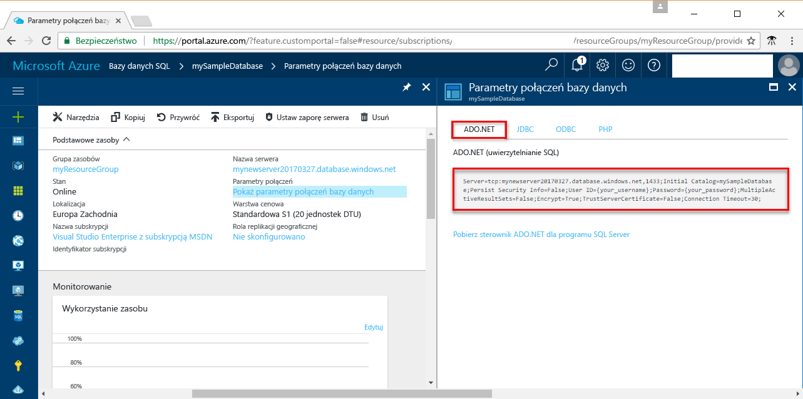

# <a name="use-net-c-with-visual-studio-tooconnect-and-query-an-azure-sql-database"></a><span data-ttu-id="ad137-103">.NET (C#) za pomocą programu Visual Studio tooconnect i zapytanie bazy danych Azure SQL</span><span class="sxs-lookup"><span data-stu-id="ad137-103">Use .NET (C#) with Visual Studio tooconnect and query an Azure SQL database</span></span>

<span data-ttu-id="ad137-104">Tego samouczka szybkiego startu przedstawia sposób toouse hello [.NET framework](https://www.microsoft.com/net/) toocreate C# program z bazy danych programu Visual Studio tooconnect tooan Azure SQL i użyć danych tooquery instrukcji języka Transact-SQL.</span><span class="sxs-lookup"><span data-stu-id="ad137-104">This quick start tutorial demonstrates how toouse hello [.NET framework](https://www.microsoft.com/net/) toocreate a C# program with Visual Studio tooconnect tooan Azure SQL database and use Transact-SQL statements tooquery data.</span></span>

## <a name="prerequisites"></a><span data-ttu-id="ad137-105">Wymagania wstępne</span><span class="sxs-lookup"><span data-stu-id="ad137-105">Prerequisites</span></span>

<span data-ttu-id="ad137-106">toocomplete tym szybki start samouczka, upewnij się, że masz następujące hello:</span><span class="sxs-lookup"><span data-stu-id="ad137-106">toocomplete this quick start tutorial, make sure you have hello following:</span></span>

- <span data-ttu-id="ad137-107">Baza danych Azure SQL.</span><span class="sxs-lookup"><span data-stu-id="ad137-107">An Azure SQL database.</span></span> <span data-ttu-id="ad137-108">To szybki start używa zasobów hello tworzony w jednej z tych Szybki Start:</span><span class="sxs-lookup"><span data-stu-id="ad137-108">This quick start uses hello resources created in one of these quick starts:</span></span> 

   - [<span data-ttu-id="ad137-109">Tworzenie bazy danych — portal</span><span class="sxs-lookup"><span data-stu-id="ad137-109">Create DB - Portal</span></span>](sql-database-get-started-portal.md)
   - [<span data-ttu-id="ad137-110">Tworzenie bazy danych — interfejs wiersza polecenia</span><span class="sxs-lookup"><span data-stu-id="ad137-110">Create DB - CLI</span></span>](sql-database-get-started-cli.md)
   - [<span data-ttu-id="ad137-111">Tworzenie bazy danych — PowerShell</span><span class="sxs-lookup"><span data-stu-id="ad137-111">Create DB - PowerShell</span></span>](sql-database-get-started-powershell.md)

- <span data-ttu-id="ad137-112">A [regułę zapory poziomu serwera](sql-database-get-started-portal.md#create-a-server-level-firewall-rule) dla hello publiczny adres IP komputera hello, możesz użyć w tym samouczku szybki start.</span><span class="sxs-lookup"><span data-stu-id="ad137-112">A [server-level firewall rule](sql-database-get-started-portal.md#create-a-server-level-firewall-rule) for hello public IP address of hello computer you use for this quick start tutorial.</span></span>
- <span data-ttu-id="ad137-113">Zainstalowany program [Visual Studio Community 2017, Visual Studio Professional 2017 lub Visual Studio Enterprise 2017](https://www.visualstudio.com/downloads/).</span><span class="sxs-lookup"><span data-stu-id="ad137-113">An installation of [Visual Studio Community 2017, Visual Studio Professional 2017, or Visual Studio Enterprise 2017](https://www.visualstudio.com/downloads/).</span></span>

## <a name="sql-server-connection-information"></a><span data-ttu-id="ad137-114">Informacje o połączeniu z serwerem SQL</span><span class="sxs-lookup"><span data-stu-id="ad137-114">SQL server connection information</span></span>

<span data-ttu-id="ad137-115">Pobierz hello połączenia potrzebnych tooconnect toohello usługa Azure SQL database.</span><span class="sxs-lookup"><span data-stu-id="ad137-115">Get hello connection information needed tooconnect toohello Azure SQL database.</span></span> <span data-ttu-id="ad137-116">Konieczne będzie hello pełni kwalifikowaną nazwę serwera, nazwa bazy danych i informacji o logowaniu w hello kolejnych procedur.</span><span class="sxs-lookup"><span data-stu-id="ad137-116">You will need hello fully qualified server name, database name, and login information in hello next procedures.</span></span>

1. <span data-ttu-id="ad137-117">Zaloguj się za toohello [portalu Azure](https://portal.azure.com/).</span><span class="sxs-lookup"><span data-stu-id="ad137-117">Log in toohello [Azure portal](https://portal.azure.com/).</span></span>
2. <span data-ttu-id="ad137-118">Wybierz **baz danych SQL** z menu po lewej stronie powitania i kliknij bazę danych na powitania **baz danych SQL** strony.</span><span class="sxs-lookup"><span data-stu-id="ad137-118">Select **SQL Databases** from hello left-hand menu, and click your database on hello **SQL databases** page.</span></span> 
3. <span data-ttu-id="ad137-119">Na powitania **omówienie** stron dla bazy danych, przejrzyj hello w pełni kwalifikowana nazwa serwera, pokazane na powitania po obrazu.</span><span class="sxs-lookup"><span data-stu-id="ad137-119">On hello **Overview** page for your database, review hello fully qualified server name as shown in hello following image.</span></span> <span data-ttu-id="ad137-120">Ustawieniu kursora toobring nazwy serwera hello zapasowej hello **kliknij toocopy** opcji.</span><span class="sxs-lookup"><span data-stu-id="ad137-120">You can hover over hello server name toobring up hello **Click toocopy** option.</span></span> 

    

4. <span data-ttu-id="ad137-122">Jeśli użytkownik zapomni swoje informacje logowania serwera bazy danych SQL Azure, przejdź toohello bazy danych SQL strony tooview powitania serwera nazwa administratora serwera.</span><span class="sxs-lookup"><span data-stu-id="ad137-122">If you forget your Azure SQL Database server login information, navigate toohello SQL Database server page tooview hello server admin name.</span></span> <span data-ttu-id="ad137-123">Jeśli to konieczne, można zresetować hasła hello.</span><span class="sxs-lookup"><span data-stu-id="ad137-123">You can reset hello password if necessary.</span></span>

5. <span data-ttu-id="ad137-124">Kliknij pozycję **Pokaż parametry połączenia bazy danych**.</span><span class="sxs-lookup"><span data-stu-id="ad137-124">Click **Show database connection strings**.</span></span>

6. <span data-ttu-id="ad137-125">Przejrzyj hello pełną **ADO.NET** parametry połączenia.</span><span class="sxs-lookup"><span data-stu-id="ad137-125">Review hello complete **ADO.NET** connection string.</span></span>

    

> [!IMPORTANT]
> <span data-ttu-id="ad137-127">W przypadku hello publiczny adres IP komputera hello, na którym jest wykonywana w tym samouczku, musi mieć reguły zapory.</span><span class="sxs-lookup"><span data-stu-id="ad137-127">You must have a firewall rule in place for hello public IP address of hello computer on which you perform this tutorial.</span></span> <span data-ttu-id="ad137-128">Jeśli na innym komputerze lub inny publiczny adres IP, należy utworzyć [reguły zapory poziomu serwera przy użyciu hello portalu Azure](sql-database-get-started-portal.md#create-a-server-level-firewall-rule).</span><span class="sxs-lookup"><span data-stu-id="ad137-128">If you are on a different computer or have a different public IP address, create a [server-level firewall rule using hello Azure portal](sql-database-get-started-portal.md#create-a-server-level-firewall-rule).</span></span> 
>
  
## <a name="create-a-new-visual-studio-project"></a><span data-ttu-id="ad137-129">Tworzenie nowego projektu programu Visual Studio</span><span class="sxs-lookup"><span data-stu-id="ad137-129">Create a new Visual Studio project</span></span>

1. <span data-ttu-id="ad137-130">W programie Visual Studio wybierz pozycje **Plik**, **Nowy**, **Projekt**.</span><span class="sxs-lookup"><span data-stu-id="ad137-130">In Visual Studio, choose **File**, **New**, **Project**.</span></span> 
2. <span data-ttu-id="ad137-131">W hello **nowy projekt** okna dialogowego i rozwiń **Visual C#**.</span><span class="sxs-lookup"><span data-stu-id="ad137-131">In hello **New Project** dialog, and expand **Visual C#**.</span></span>
3. <span data-ttu-id="ad137-132">Wybierz **aplikacji konsoli** , a następnie wprowadź *sqltest* hello nazwy projektu.</span><span class="sxs-lookup"><span data-stu-id="ad137-132">Select **Console App** and enter *sqltest* for hello project name.</span></span>
4. <span data-ttu-id="ad137-133">Kliknij przycisk **OK** toocreate i hello Otwórz nowy projekt w programie Visual Studio</span><span class="sxs-lookup"><span data-stu-id="ad137-133">Click **OK** toocreate and open hello new project in Visual Studio</span></span>
4. <span data-ttu-id="ad137-134">W Eksploratorze rozwiązań kliknij prawym przyciskiem myszy pozycję **sqltest**, a następnie kliknij pozycję **Zarządzaj pakietami NuGet**.</span><span class="sxs-lookup"><span data-stu-id="ad137-134">In Solution Explorer, right-click **sqltest** and click **Manage NuGet Packages**.</span></span> 
5. <span data-ttu-id="ad137-135">Na powitania **Przeglądaj**, wyszukaj ```System.Data.SqlClient``` i, jeśli znaleziono, wybierz ją.</span><span class="sxs-lookup"><span data-stu-id="ad137-135">On hello **Browse**, search for ```System.Data.SqlClient``` and, when found, select it.</span></span>
6. <span data-ttu-id="ad137-136">W hello **System.Data.SqlClient** kliknij przycisk **zainstalować**.</span><span class="sxs-lookup"><span data-stu-id="ad137-136">In hello **System.Data.SqlClient** page, click **Install**.</span></span>
7. <span data-ttu-id="ad137-137">Po zakończeniu instalacji hello Przejrzyj hello zmiany, a następnie kliknij przycisk **OK** tooclose hello **Podgląd** okna.</span><span class="sxs-lookup"><span data-stu-id="ad137-137">When hello install completes, review hello changes and then click **OK** tooclose hello **Preview** window.</span></span> 
8. <span data-ttu-id="ad137-138">W przypadku wyświetlenia okna **Akceptacja licencji** kliknij przycisk **Akceptuję**.</span><span class="sxs-lookup"><span data-stu-id="ad137-138">If a **License Acceptance** window appears, click **I Accept**.</span></span>

## <a name="insert-code-tooquery-sql-database"></a><span data-ttu-id="ad137-139">Wstaw baza danych SQL tooquery kodu</span><span class="sxs-lookup"><span data-stu-id="ad137-139">Insert code tooquery SQL database</span></span>
1. <span data-ttu-id="ad137-140">Przełącz zbyt (lub otworzyć w razie potrzeby) **Program.cs**</span><span class="sxs-lookup"><span data-stu-id="ad137-140">Switch too(or open if necessary) **Program.cs**</span></span>

2. <span data-ttu-id="ad137-141">Zamień zawartość hello **Program.cs** z hello następujący kod i dodaj odpowiednie wartości powitania serwera, bazy danych, użytkownika i hasło.</span><span class="sxs-lookup"><span data-stu-id="ad137-141">Replace hello contents of **Program.cs** with hello following code and add hello appropriate values for your server, database, user, and password.</span></span>

```csharp
using System;
using System.Data.SqlClient;
using System.Text;

namespace sqltest
{
    class Program
    {
        static void Main(string[] args)
        {
            try 
            { 
                SqlConnectionStringBuilder builder = new SqlConnectionStringBuilder();
                builder.DataSource = "your_server.database.windows.net"; 
                builder.UserID = "your_user";            
                builder.Password = "your_password";     
                builder.InitialCatalog = "your_database";

                using (SqlConnection connection = new SqlConnection(builder.ConnectionString))
                {
                    Console.WriteLine("\nQuery data example:");
                    Console.WriteLine("=========================================\n");
                    
                    connection.Open();       
                    StringBuilder sb = new StringBuilder();
                    sb.Append("SELECT TOP 20 pc.Name as CategoryName, p.name as ProductName ");
                    sb.Append("FROM [SalesLT].[ProductCategory] pc ");
                    sb.Append("JOIN [SalesLT].[Product] p ");
                    sb.Append("ON pc.productcategoryid = p.productcategoryid;");
                    String sql = sb.ToString();

                    using (SqlCommand command = new SqlCommand(sql, connection))
                    {
                        using (SqlDataReader reader = command.ExecuteReader())
                        {
                            while (reader.Read())
                            {
                                Console.WriteLine("{0} {1}", reader.GetString(0), reader.GetString(1));
                            }
                        }
                    }                    
                }
            }
            catch (SqlException e)
            {
                Console.WriteLine(e.ToString());
            }
            Console.ReadLine();
        }
    }
}
```

## <a name="run-hello-code"></a><span data-ttu-id="ad137-142">Uruchamianie hello kodu</span><span class="sxs-lookup"><span data-stu-id="ad137-142">Run hello code</span></span>

1. <span data-ttu-id="ad137-143">Naciśnij klawisz **F5** toorun hello aplikacji.</span><span class="sxs-lookup"><span data-stu-id="ad137-143">Press **F5** toorun hello application.</span></span>
2. <span data-ttu-id="ad137-144">Sprawdź, czy górnych wierszy 20 hello są zwracane, a następnie zamknij okno aplikacji hello.</span><span class="sxs-lookup"><span data-stu-id="ad137-144">Verify that hello top 20 rows are returned and then close hello application window.</span></span>

## <a name="next-steps"></a><span data-ttu-id="ad137-145">Następne kroki</span><span class="sxs-lookup"><span data-stu-id="ad137-145">Next steps</span></span>

- <span data-ttu-id="ad137-146">Dowiedz się, jak za[połączenia i wykonywać zapytania bazy danych Azure SQL przy użyciu platformy .NET core](sql-database-connect-query-dotnet-core.md) na Windows/Linux/macOS.</span><span class="sxs-lookup"><span data-stu-id="ad137-146">Learn how too[connect and query an Azure SQL database using .NET core](sql-database-connect-query-dotnet-core.md) on Windows/Linux/macOS.</span></span>  
- <span data-ttu-id="ad137-147">Dowiedz się więcej o [Rozpoczynanie pracy z platformą .NET Core na Windows/Linux/macOS przy użyciu wiersza polecenia hello](/dotnet/core/tutorials/using-with-xplat-cli).</span><span class="sxs-lookup"><span data-stu-id="ad137-147">Learn about [Getting started with .NET Core on Windows/Linux/macOS using hello command line](/dotnet/core/tutorials/using-with-xplat-cli).</span></span>
- <span data-ttu-id="ad137-148">Dowiedz się, jak za[projektowania pierwszą bazę danych Azure SQL przy użyciu narzędzia SSMS](sql-database-design-first-database.md) lub [projektowania pierwszą bazę danych Azure SQL przy użyciu platformy .NET](sql-database-design-first-database-csharp.md).</span><span class="sxs-lookup"><span data-stu-id="ad137-148">Learn how too[Design your first Azure SQL database using SSMS](sql-database-design-first-database.md) or [Design your first Azure SQL database using .NET](sql-database-design-first-database-csharp.md).</span></span>
- <span data-ttu-id="ad137-149">Aby uzyskać więcej informacji na temat platformy .NET, zobacz [.NET documentation](https://docs.microsoft.com/dotnet/) (Dokumentacja platformy .NET).</span><span class="sxs-lookup"><span data-stu-id="ad137-149">For more information about .NET, see [.NET documentation](https://docs.microsoft.com/dotnet/).</span></span>
