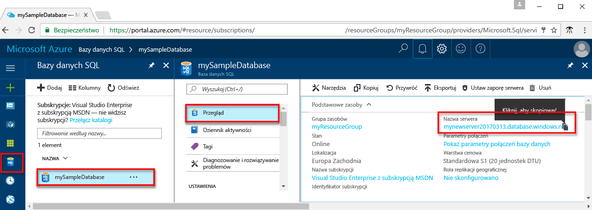

# <a name="use-net-c-with-visual-studio-tooconnect-and-query-an-azure-sql-database"></a>.NET (C#) za pomocą programu Visual Studio tooconnect i zapytanie bazy danych Azure SQL

Tego samouczka szybkiego startu przedstawia sposób toouse hello [.NET framework](https://www.microsoft.com/net/) toocreate C# program z bazy danych programu Visual Studio tooconnect tooan Azure SQL i użyć danych tooquery instrukcji języka Transact-SQL.

## <a name="prerequisites"></a>Wymagania wstępne

toocomplete tym szybki start samouczka, upewnij się, że masz następujące hello:

- Baza danych Azure SQL. To szybki start używa zasobów hello tworzony w jednej z tych Szybki Start: 

   - [Tworzenie bazy danych — portal](sql-database-get-started-portal.md)
   - [Tworzenie bazy danych — interfejs wiersza polecenia](sql-database-get-started-cli.md)
   - [Tworzenie bazy danych — PowerShell](sql-database-get-started-powershell.md)

- A [regułę zapory poziomu serwera](sql-database-get-started-portal.md#create-a-server-level-firewall-rule) dla hello publiczny adres IP komputera hello, możesz użyć w tym samouczku szybki start.
- Zainstalowany program [Visual Studio Community 2017, Visual Studio Professional 2017 lub Visual Studio Enterprise 2017](https://www.visualstudio.com/downloads/).

## <a name="sql-server-connection-information"></a>Informacje o połączeniu z serwerem SQL

Pobierz hello połączenia potrzebnych tooconnect toohello usługa Azure SQL database. Konieczne będzie hello pełni kwalifikowaną nazwę serwera, nazwa bazy danych i informacji o logowaniu w hello kolejnych procedur.

1. Zaloguj się za toohello [portalu Azure](https://portal.azure.com/).
2. Wybierz **baz danych SQL** z menu po lewej stronie powitania i kliknij bazę danych na powitania **baz danych SQL** strony. 
3. Na powitania **omówienie** stron dla bazy danych, przejrzyj hello w pełni kwalifikowana nazwa serwera, pokazane na powitania po obrazu. Ustawieniu kursora toobring nazwy serwera hello zapasowej hello **kliknij toocopy** opcji. 

    

4. Jeśli użytkownik zapomni swoje informacje logowania serwera bazy danych SQL Azure, przejdź toohello bazy danych SQL strony tooview powitania serwera nazwa administratora serwera. Jeśli to konieczne, można zresetować hasła hello.

5. Kliknij pozycję **Pokaż parametry połączenia bazy danych**.

6. Przejrzyj hello pełną **ADO.NET** parametry połączenia.

    

> [!IMPORTANT]
> W przypadku hello publiczny adres IP komputera hello, na którym jest wykonywana w tym samouczku, musi mieć reguły zapory. Jeśli na innym komputerze lub inny publiczny adres IP, należy utworzyć [reguły zapory poziomu serwera przy użyciu hello portalu Azure](sql-database-get-started-portal.md#create-a-server-level-firewall-rule). 
>
  
## <a name="create-a-new-visual-studio-project"></a>Tworzenie nowego projektu programu Visual Studio

1. W programie Visual Studio wybierz pozycje **Plik**, **Nowy**, **Projekt**. 
2. W hello **nowy projekt** okna dialogowego i rozwiń **Visual C#**.
3. Wybierz **aplikacji konsoli** , a następnie wprowadź *sqltest* hello nazwy projektu.
4. Kliknij przycisk **OK** toocreate i hello Otwórz nowy projekt w programie Visual Studio
4. W Eksploratorze rozwiązań kliknij prawym przyciskiem myszy pozycję **sqltest**, a następnie kliknij pozycję **Zarządzaj pakietami NuGet**. 
5. Na powitania **Przeglądaj**, wyszukaj ```System.Data.SqlClient``` i, jeśli znaleziono, wybierz ją.
6. W hello **System.Data.SqlClient** kliknij przycisk **zainstalować**.
7. Po zakończeniu instalacji hello Przejrzyj hello zmiany, a następnie kliknij przycisk **OK** tooclose hello **Podgląd** okna. 
8. W przypadku wyświetlenia okna **Akceptacja licencji** kliknij przycisk **Akceptuję**.

## <a name="insert-code-tooquery-sql-database"></a>Wstaw baza danych SQL tooquery kodu
1. Przełącz zbyt (lub otworzyć w razie potrzeby) **Program.cs**

2. Zamień zawartość hello **Program.cs** z hello następujący kod i dodaj odpowiednie wartości powitania serwera, bazy danych, użytkownika i hasło.

```csharp
using System;
using System.Data.SqlClient;
using System.Text;

namespace sqltest
{
    class Program
    {
        static void Main(string[] args)
        {
            try 
            { 
                SqlConnectionStringBuilder builder = new SqlConnectionStringBuilder();
                builder.DataSource = "your_server.database.windows.net"; 
                builder.UserID = "your_user";            
                builder.Password = "your_password";     
                builder.InitialCatalog = "your_database";

                using (SqlConnection connection = new SqlConnection(builder.ConnectionString))
                {
                    Console.WriteLine("\nQuery data example:");
                    Console.WriteLine("=========================================\n");
                    
                    connection.Open();       
                    StringBuilder sb = new StringBuilder();
                    sb.Append("SELECT TOP 20 pc.Name as CategoryName, p.name as ProductName ");
                    sb.Append("FROM [SalesLT].[ProductCategory] pc ");
                    sb.Append("JOIN [SalesLT].[Product] p ");
                    sb.Append("ON pc.productcategoryid = p.productcategoryid;");
                    String sql = sb.ToString();

                    using (SqlCommand command = new SqlCommand(sql, connection))
                    {
                        using (SqlDataReader reader = command.ExecuteReader())
                        {
                            while (reader.Read())
                            {
                                Console.WriteLine("{0} {1}", reader.GetString(0), reader.GetString(1));
                            }
                        }
                    }                    
                }
            }
            catch (SqlException e)
            {
                Console.WriteLine(e.ToString());
            }
            Console.ReadLine();
        }
    }
}
```

## <a name="run-hello-code"></a>Uruchamianie hello kodu

1. Naciśnij klawisz **F5** toorun hello aplikacji.
2. Sprawdź, czy górnych wierszy 20 hello są zwracane, a następnie zamknij okno aplikacji hello.

## <a name="next-steps"></a>Następne kroki

- Dowiedz się, jak za[połączenia i wykonywać zapytania bazy danych Azure SQL przy użyciu platformy .NET core](sql-database-connect-query-dotnet-core.md) na Windows/Linux/macOS.  
- Dowiedz się więcej o [Rozpoczynanie pracy z platformą .NET Core na Windows/Linux/macOS przy użyciu wiersza polecenia hello](/dotnet/core/tutorials/using-with-xplat-cli).
- Dowiedz się, jak za[projektowania pierwszą bazę danych Azure SQL przy użyciu narzędzia SSMS](sql-database-design-first-database.md) lub [projektowania pierwszą bazę danych Azure SQL przy użyciu platformy .NET](sql-database-design-first-database-csharp.md).
- Aby uzyskać więcej informacji na temat platformy .NET, zobacz [.NET documentation](https://docs.microsoft.com/dotnet/) (Dokumentacja platformy .NET).
