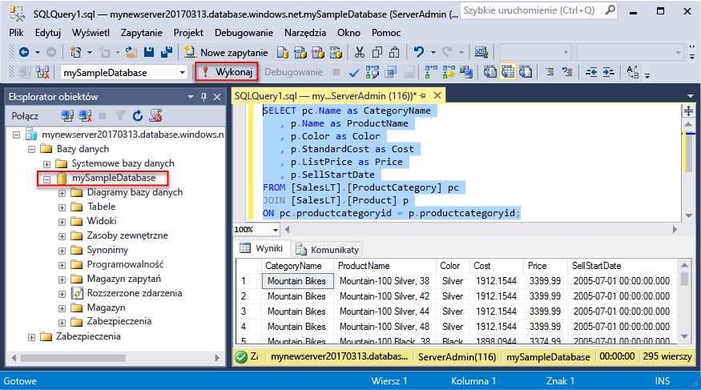
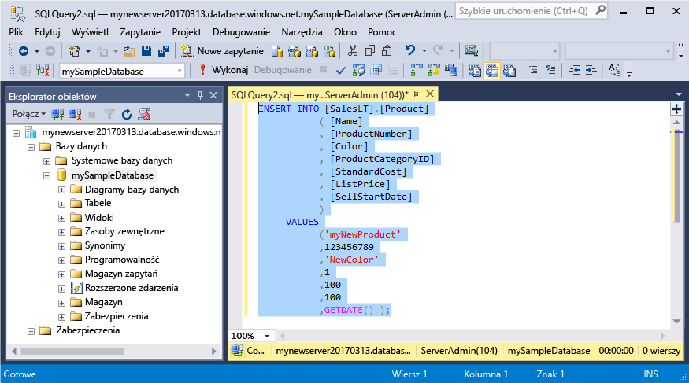
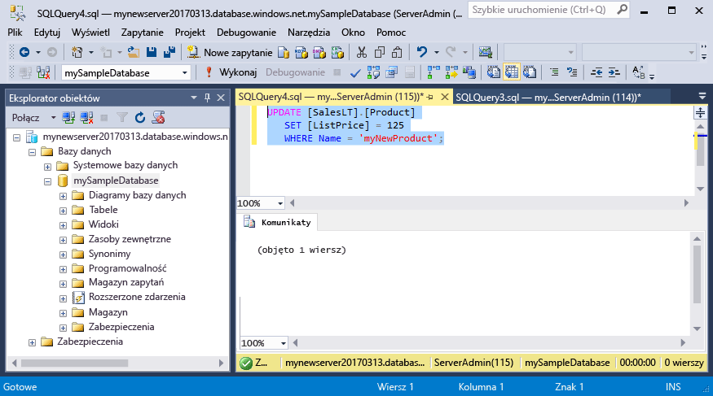
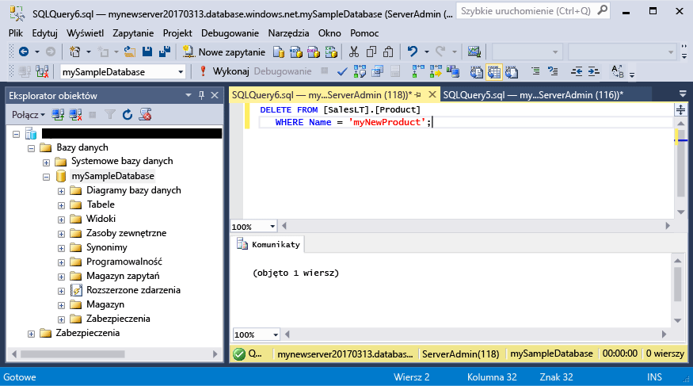

# <a name="azure-sql-database-use-sql-server-management-studio-tooconnect-and-query-data"></a><span data-ttu-id="c13b0-105">Baza danych SQL Azure: Użyj programu SQL Server Management Studio tooconnect i zapytań danych</span><span class="sxs-lookup"><span data-stu-id="c13b0-105">Azure SQL Database: Use SQL Server Management Studio tooconnect and query data</span></span>

<span data-ttu-id="c13b0-106">[SQL Server Management Studio](https://msdn.microsoft.com/library/ms174173.aspx) (SSMS) jest zintegrowane środowisko umożliwiające zarządzanie dowolnej infrastruktury SQL z programu SQL Server tooSQL bazy danych systemu Microsoft Windows.</span><span class="sxs-lookup"><span data-stu-id="c13b0-106">[SQL Server Management Studio](https://msdn.microsoft.com/library/ms174173.aspx) (SSMS) is an integrated environment for managing any SQL infrastructure, from SQL Server tooSQL Database for Microsoft Windows.</span></span> <span data-ttu-id="c13b0-107">To szybki start pokazuje, jak baza danych Azure SQL tooan toouse SSMS tooconnect, a następnie tooquery instrukcje użycia języka Transact-SQL, wstawiania, aktualizowania i usuwania danych w bazie danych hello.</span><span class="sxs-lookup"><span data-stu-id="c13b0-107">This quick start demonstrates how toouse SSMS tooconnect tooan Azure SQL database, and then use Transact-SQL statements tooquery, insert, update, and delete data in hello database.</span></span> 

## <a name="prerequisites"></a><span data-ttu-id="c13b0-108">Wymagania wstępne</span><span class="sxs-lookup"><span data-stu-id="c13b0-108">Prerequisites</span></span>

<span data-ttu-id="c13b0-109">To szybki start używa jako początkowy punkt zasobów hello tworzony w jednej z tych Szybki Start:</span><span class="sxs-lookup"><span data-stu-id="c13b0-109">This quick start uses as its starting point hello resources created in one of these quick starts:</span></span>

- [<span data-ttu-id="c13b0-110">Tworzenie bazy danych — portal</span><span class="sxs-lookup"><span data-stu-id="c13b0-110">Create DB - Portal</span></span>](sql-database-get-started-portal.md)
- [<span data-ttu-id="c13b0-111">Tworzenie bazy danych — interfejs wiersza polecenia</span><span class="sxs-lookup"><span data-stu-id="c13b0-111">Create DB - CLI</span></span>](sql-database-get-started-cli.md)
- [<span data-ttu-id="c13b0-112">Tworzenie bazy danych — PowerShell</span><span class="sxs-lookup"><span data-stu-id="c13b0-112">Create DB - PowerShell</span></span>](sql-database-get-started-powershell.md)

<span data-ttu-id="c13b0-113">Przed rozpoczęciem upewnij się, zainstalowano hello najnowsza wersja [SSMS](https://msdn.microsoft.com/library/mt238290.aspx).</span><span class="sxs-lookup"><span data-stu-id="c13b0-113">Before you start, make sure you have installed hello newest version of [SSMS](https://msdn.microsoft.com/library/mt238290.aspx).</span></span> 

## <a name="sql-server-connection-information"></a><span data-ttu-id="c13b0-114">Informacje o połączeniu z serwerem SQL</span><span class="sxs-lookup"><span data-stu-id="c13b0-114">SQL server connection information</span></span>

<span data-ttu-id="c13b0-115">Pobierz hello połączenia potrzebnych tooconnect toohello usługa Azure SQL database.</span><span class="sxs-lookup"><span data-stu-id="c13b0-115">Get hello connection information needed tooconnect toohello Azure SQL database.</span></span> <span data-ttu-id="c13b0-116">Konieczne będzie hello pełni kwalifikowaną nazwę serwera, nazwa bazy danych i informacji o logowaniu w hello kolejnych procedur.</span><span class="sxs-lookup"><span data-stu-id="c13b0-116">You will need hello fully qualified server name, database name, and login information in hello next procedures.</span></span>

1. <span data-ttu-id="c13b0-117">Zaloguj się za toohello [portalu Azure](https://portal.azure.com/).</span><span class="sxs-lookup"><span data-stu-id="c13b0-117">Log in toohello [Azure portal](https://portal.azure.com/).</span></span>
2. <span data-ttu-id="c13b0-118">Wybierz **baz danych SQL** z menu po lewej stronie powitania i kliknij bazę danych na powitania **baz danych SQL** strony.</span><span class="sxs-lookup"><span data-stu-id="c13b0-118">Select **SQL Databases** from hello left-hand menu, and click your database on hello **SQL databases** page.</span></span> 
3. <span data-ttu-id="c13b0-119">Na powitania **omówienie** stron dla bazy danych, przejrzyj hello pełni kwalifikowaną nazwę serwera, jak pokazano w poniższym obrazie hello.</span><span class="sxs-lookup"><span data-stu-id="c13b0-119">On hello **Overview** page for your database, review hello fully qualified server name as shown in hello image below.</span></span> <span data-ttu-id="c13b0-120">Ustawieniu kursora toobring nazwy serwera hello zapasowej hello **kliknij toocopy** opcji.</span><span class="sxs-lookup"><span data-stu-id="c13b0-120">You can hover over hello server name toobring up hello **Click toocopy** option.</span></span>

    

4. <span data-ttu-id="c13b0-122">Jeśli pamiętasz hello informacje logowania dla serwera bazy danych SQL Azure, przejdź toohello bazy danych SQL strony tooview powitania serwera nazwa administratora serwera i, w razie potrzeby zresetowania hasła hello.</span><span class="sxs-lookup"><span data-stu-id="c13b0-122">If you have forgotten hello login information for your Azure SQL Database server, navigate toohello SQL Database server page tooview hello server admin name and, if necessary, reset hello password.</span></span> 

## <a name="connect-tooyour-database"></a><span data-ttu-id="c13b0-123">Połącz tooyour bazy danych</span><span class="sxs-lookup"><span data-stu-id="c13b0-123">Connect tooyour database</span></span>

<span data-ttu-id="c13b0-124">Użyj programu SQL Server Management Studio tooestablish serwer bazy danych SQL Azure tooyour połączenia.</span><span class="sxs-lookup"><span data-stu-id="c13b0-124">Use SQL Server Management Studio tooestablish a connection tooyour Azure SQL Database server.</span></span> 

> [!IMPORTANT]
> <span data-ttu-id="c13b0-125">Serwer logiczny usługi Azure SQL Database nasłuchuje na porcie 1433.</span><span class="sxs-lookup"><span data-stu-id="c13b0-125">An Azure SQL Database logical server listens on port 1433.</span></span> <span data-ttu-id="c13b0-126">Jeśli próbujesz tooconnect tooan bazy danych SQL Azure serwera logicznego od w obrębie firmowej zapory, ten port musi być otwarty w hello firmowej zapory dla toosuccessfully można połączyć z usługą.</span><span class="sxs-lookup"><span data-stu-id="c13b0-126">If you are attempting tooconnect tooan Azure SQL Database logical server from within a corporate firewall, this port must be open in hello corporate firewall for you toosuccessfully connect.</span></span>
>

1. <span data-ttu-id="c13b0-127">Otwórz program SQL Server Management Studio.</span><span class="sxs-lookup"><span data-stu-id="c13b0-127">Open SQL Server Management Studio.</span></span>

2. <span data-ttu-id="c13b0-128">W hello **połączyć tooServer** okna dialogowego wprowadź hello następujących informacji:</span><span class="sxs-lookup"><span data-stu-id="c13b0-128">In hello **Connect tooServer** dialog box, enter hello following information:</span></span>

   | <span data-ttu-id="c13b0-129">Ustawienie</span><span class="sxs-lookup"><span data-stu-id="c13b0-129">Setting</span></span>       | <span data-ttu-id="c13b0-130">Sugerowana wartość</span><span class="sxs-lookup"><span data-stu-id="c13b0-130">Suggested value</span></span> | <span data-ttu-id="c13b0-131">Opis</span><span class="sxs-lookup"><span data-stu-id="c13b0-131">Description</span></span> | 
   | ------------ | ------------------ | ------------------------------------------------- | 
   | <span data-ttu-id="c13b0-132">**Typ serwera**</span><span class="sxs-lookup"><span data-stu-id="c13b0-132">**Server type**</span></span> | <span data-ttu-id="c13b0-133">Aparat bazy danych</span><span class="sxs-lookup"><span data-stu-id="c13b0-133">Database engine</span></span> | <span data-ttu-id="c13b0-134">Ta wartość jest wymagana.</span><span class="sxs-lookup"><span data-stu-id="c13b0-134">This value is required.</span></span> |
   | <span data-ttu-id="c13b0-135">**Nazwa serwera**</span><span class="sxs-lookup"><span data-stu-id="c13b0-135">**Server name**</span></span> | <span data-ttu-id="c13b0-136">Nazwa FQDN serwera Hello</span><span class="sxs-lookup"><span data-stu-id="c13b0-136">hello fully qualified server name</span></span> | <span data-ttu-id="c13b0-137">Witaj nazwa powinna być podobny do następującego: **mynewserver20170313.database.windows.net**.</span><span class="sxs-lookup"><span data-stu-id="c13b0-137">hello name should be something like this: **mynewserver20170313.database.windows.net**.</span></span> |
   | <span data-ttu-id="c13b0-138">**Uwierzytelnianie**</span><span class="sxs-lookup"><span data-stu-id="c13b0-138">**Authentication**</span></span> | <span data-ttu-id="c13b0-139">Uwierzytelnianie programu SQL Server</span><span class="sxs-lookup"><span data-stu-id="c13b0-139">SQL Server Authentication</span></span> | <span data-ttu-id="c13b0-140">Uwierzytelnianie programu SQL jest typ uwierzytelniania tylko hello ma został skonfigurowany w tym samouczku.</span><span class="sxs-lookup"><span data-stu-id="c13b0-140">SQL Authentication is hello only authentication type that we have configured in this tutorial.</span></span> |
   | <span data-ttu-id="c13b0-141">**Logowanie**</span><span class="sxs-lookup"><span data-stu-id="c13b0-141">**Login**</span></span> | <span data-ttu-id="c13b0-142">konto administratora powitania serwera</span><span class="sxs-lookup"><span data-stu-id="c13b0-142">hello server admin account</span></span> | <span data-ttu-id="c13b0-143">To konto hello określone podczas tworzenia powitania serwera.</span><span class="sxs-lookup"><span data-stu-id="c13b0-143">This is hello account that you specified when you created hello server.</span></span> |
   | <span data-ttu-id="c13b0-144">**Hasło**</span><span class="sxs-lookup"><span data-stu-id="c13b0-144">**Password**</span></span> | <span data-ttu-id="c13b0-145">Witaj hasło do konta administratora serwera</span><span class="sxs-lookup"><span data-stu-id="c13b0-145">hello password for your server admin account</span></span> | <span data-ttu-id="c13b0-146">Jest to hasło hello określone podczas tworzenia powitania serwera.</span><span class="sxs-lookup"><span data-stu-id="c13b0-146">This is hello password that you specified when you created hello server.</span></span> |

     

3. <span data-ttu-id="c13b0-148">Kliknij przycisk **opcje** w hello **połączyć tooserver** okno dialogowe.</span><span class="sxs-lookup"><span data-stu-id="c13b0-148">Click **Options** in hello **Connect tooserver** dialog box.</span></span> <span data-ttu-id="c13b0-149">W hello **połączyć toodatabase** wprowadź **mySampleDatabase** tooconnect toothis w bazie danych.</span><span class="sxs-lookup"><span data-stu-id="c13b0-149">In hello **Connect toodatabase** section, enter **mySampleDatabase** tooconnect toothis database.</span></span>

     

4. <span data-ttu-id="c13b0-151">Kliknij przycisk **Połącz**.</span><span class="sxs-lookup"><span data-stu-id="c13b0-151">Click **Connect**.</span></span> <span data-ttu-id="c13b0-152">Okno Eksploratora obiektów Hello zostanie otwarty w programie SSMS.</span><span class="sxs-lookup"><span data-stu-id="c13b0-152">hello Object Explorer window opens in SSMS.</span></span> 

     

5. <span data-ttu-id="c13b0-154">W Eksploratorze obiektów rozwiń **baz danych** , a następnie rozwiń węzeł **mySampleDatabase** tooview hello obiektów hello przykładowej bazy danych.</span><span class="sxs-lookup"><span data-stu-id="c13b0-154">In Object Explorer, expand **Databases** and then expand **mySampleDatabase** tooview hello objects in hello sample database.</span></span>

## <a name="query-data"></a><span data-ttu-id="c13b0-155">Zapytania o dane</span><span class="sxs-lookup"><span data-stu-id="c13b0-155">Query data</span></span>

<span data-ttu-id="c13b0-156">Użyj hello poniższy kod tooquery produktów pierwsza 20. wg hello według kategorii przy użyciu hello [wybierz](https://msdn.microsoft.com/library/ms189499.aspx) instrukcji języka Transact-SQL.</span><span class="sxs-lookup"><span data-stu-id="c13b0-156">Use hello following code tooquery for hello top 20 products by category using hello [SELECT](https://msdn.microsoft.com/library/ms189499.aspx) Transact-SQL statement.</span></span>

1. <span data-ttu-id="c13b0-157">W Eksploratorze obiektów kliknij prawym przyciskiem myszy pozycję **mySampleDatabase** i kliknij opcję **Nowe zapytanie**.</span><span class="sxs-lookup"><span data-stu-id="c13b0-157">In Object Explorer, right-click **mySampleDatabase** and click **New Query**.</span></span> <span data-ttu-id="c13b0-158">Puste zapytanie zostanie otwarte okno czyli tooyour połączenia bazy danych.</span><span class="sxs-lookup"><span data-stu-id="c13b0-158">A blank query window opens that is connected tooyour database.</span></span>
2. <span data-ttu-id="c13b0-159">W oknie zapytania hello wprowadź hello następujące zapytanie:</span><span class="sxs-lookup"><span data-stu-id="c13b0-159">In hello query window, enter hello following query:</span></span>

   ```sql
   SELECT pc.Name as CategoryName, p.name as ProductName
   FROM [SalesLT].[ProductCategory] pc
   JOIN [SalesLT].[Product] p
   ON pc.productcategoryid = p.productcategoryid;
   ```

3. <span data-ttu-id="c13b0-160">Na pasku narzędzi hello, kliknij przycisk **Execute** tooretrieve danych z tabel hello produktu i ProductCategory.</span><span class="sxs-lookup"><span data-stu-id="c13b0-160">On hello toolbar, click **Execute** tooretrieve data from hello Product and ProductCategory tables.</span></span>

    

## <a name="insert-data"></a><span data-ttu-id="c13b0-162">Wstawianie danych</span><span class="sxs-lookup"><span data-stu-id="c13b0-162">Insert data</span></span>

<span data-ttu-id="c13b0-163">Poniższy hello używany kod tooinsert nowego produktu do hello SalesLT.Product tabeli hello [Wstaw](https://msdn.microsoft.com/library/ms174335.aspx) instrukcji języka Transact-SQL.</span><span class="sxs-lookup"><span data-stu-id="c13b0-163">Use hello following code tooinsert a new product into hello SalesLT.Product table using hello [INSERT](https://msdn.microsoft.com/library/ms174335.aspx) Transact-SQL statement.</span></span>

1. <span data-ttu-id="c13b0-164">W oknie zapytania hello Zastąp poprzednie zapytanie hello hello następujące zapytania:</span><span class="sxs-lookup"><span data-stu-id="c13b0-164">In hello query window, replace hello previous query with hello following query:</span></span>

   ```sql
   INSERT INTO [SalesLT].[Product]
           ( [Name]
           , [ProductNumber]
           , [Color]
           , [ProductCategoryID]
           , [StandardCost]
           , [ListPrice]
           , [SellStartDate]
           )
     VALUES
           ('myNewProduct'
           ,123456789
           ,'NewColor'
           ,1
           ,100
           ,100
           ,GETDATE() );
   ```

2. <span data-ttu-id="c13b0-165">Na pasku narzędzi hello, kliknij przycisk **Execute** tooinsert nowy wiersz w tabeli produktu hello.</span><span class="sxs-lookup"><span data-stu-id="c13b0-165">On hello toolbar, click **Execute**  tooinsert a new row in hello Product table.</span></span>

    

## <a name="update-data"></a><span data-ttu-id="c13b0-166">Aktualizowanie danych</span><span class="sxs-lookup"><span data-stu-id="c13b0-166">Update data</span></span>

<span data-ttu-id="c13b0-167">Użyj hello poniższy kod tooupdate hello nowego produktu czy wcześniej dodane za pomocą hello [aktualizacji](https://msdn.microsoft.com/library/ms177523.aspx) instrukcji języka Transact-SQL.</span><span class="sxs-lookup"><span data-stu-id="c13b0-167">Use hello following code tooupdate hello new product that you previously added using hello [UPDATE](https://msdn.microsoft.com/library/ms177523.aspx) Transact-SQL statement.</span></span>

1. <span data-ttu-id="c13b0-168">W oknie zapytania hello Zastąp poprzednie zapytanie hello hello następujące zapytania:</span><span class="sxs-lookup"><span data-stu-id="c13b0-168">In hello query window, replace hello previous query with hello following query:</span></span>

   ```sql
   UPDATE [SalesLT].[Product]
   SET [ListPrice] = 125
   WHERE Name = 'myNewProduct';
   ```

2. <span data-ttu-id="c13b0-169">Na pasku narzędzi hello, kliknij przycisk **Execute** tooupdate hello określony wiersz w tabeli produktu hello.</span><span class="sxs-lookup"><span data-stu-id="c13b0-169">On hello toolbar, click **Execute** tooupdate hello specified row in hello Product table.</span></span>

    

## <a name="delete-data"></a><span data-ttu-id="c13b0-170">Usuwanie danych</span><span class="sxs-lookup"><span data-stu-id="c13b0-170">Delete data</span></span>

<span data-ttu-id="c13b0-171">Użyj hello poniższy kod toodelete hello nowego produktu czy wcześniej dodane za pomocą hello [usunąć](https://msdn.microsoft.com/library/ms189835.aspx) instrukcji języka Transact-SQL.</span><span class="sxs-lookup"><span data-stu-id="c13b0-171">Use hello following code toodelete hello new product that you previously added using hello [DELETE](https://msdn.microsoft.com/library/ms189835.aspx) Transact-SQL statement.</span></span>

1. <span data-ttu-id="c13b0-172">W oknie zapytania hello Zastąp poprzednie zapytanie hello hello następujące zapytania:</span><span class="sxs-lookup"><span data-stu-id="c13b0-172">In hello query window, replace hello previous query with hello following query:</span></span>

   ```sql
   DELETE FROM [SalesLT].[Product]
   WHERE Name = 'myNewProduct';
   ```

2. <span data-ttu-id="c13b0-173">Na pasku narzędzi hello, kliknij przycisk **Execute** toodelete hello określony wiersz w tabeli produktu hello.</span><span class="sxs-lookup"><span data-stu-id="c13b0-173">On hello toolbar, click **Execute** toodelete hello specified row in hello Product table.</span></span>

    

## <a name="next-steps"></a><span data-ttu-id="c13b0-174">Następne kroki</span><span class="sxs-lookup"><span data-stu-id="c13b0-174">Next steps</span></span>

- <span data-ttu-id="c13b0-175">toolearn dotyczących tworzenia i zarządzania serwerami i bazami danych z języka Transact-SQL, zobacz [więcej informacji na temat usługi Azure SQL Database serwerów i baz danych](sql-database-servers-databases.md).</span><span class="sxs-lookup"><span data-stu-id="c13b0-175">toolearn about creating and managing servers and databases with Transact-SQL, see [Learn about Azure SQL Database servers and databases](sql-database-servers-databases.md).</span></span>
- <span data-ttu-id="c13b0-176">Aby uzyskać więcej informacji o programie SSMS, zobacz [Korzystanie z programu SQL Server Management Studio](https://msdn.microsoft.com/library/ms174173.aspx).</span><span class="sxs-lookup"><span data-stu-id="c13b0-176">For information about SSMS, see [Use SQL Server Management Studio](https://msdn.microsoft.com/library/ms174173.aspx).</span></span>
- <span data-ttu-id="c13b0-177">tooconnect i zapytania przy użyciu kodu programu Visual Studio, zobacz [Connect i zapytanie z kodem Visual Studio](sql-database-connect-query-vscode.md).</span><span class="sxs-lookup"><span data-stu-id="c13b0-177">tooconnect and query using Visual Studio Code, see [Connect and query with Visual Studio Code](sql-database-connect-query-vscode.md).</span></span>
- <span data-ttu-id="c13b0-178">tooconnect i zapytania przy użyciu platformy .NET, zobacz [Connect i zapytania z platformą .NET](sql-database-connect-query-dotnet.md).</span><span class="sxs-lookup"><span data-stu-id="c13b0-178">tooconnect and query using .NET, see [Connect and query with .NET](sql-database-connect-query-dotnet.md).</span></span>
- <span data-ttu-id="c13b0-179">tooconnect i zapytania za pomocą języka PHP, zobacz [Connect i zapytań za pomocą języka PHP](sql-database-connect-query-php.md).</span><span class="sxs-lookup"><span data-stu-id="c13b0-179">tooconnect and query using PHP, see [Connect and query with PHP](sql-database-connect-query-php.md).</span></span>
- <span data-ttu-id="c13b0-180">tooconnect i zapytania przy użyciu środowiska Node.js, zobacz [Connect i zapytań za pomocą języka Node.js](sql-database-connect-query-nodejs.md).</span><span class="sxs-lookup"><span data-stu-id="c13b0-180">tooconnect and query using Node.js, see [Connect and query with Node.js](sql-database-connect-query-nodejs.md).</span></span>
- <span data-ttu-id="c13b0-181">tooconnect i zapytania za pomocą języka Java, zobacz [Connect i zapytań z języka Java](sql-database-connect-query-java.md).</span><span class="sxs-lookup"><span data-stu-id="c13b0-181">tooconnect and query using Java, see [Connect and query with Java](sql-database-connect-query-java.md).</span></span>
- <span data-ttu-id="c13b0-182">tooconnect i zapytania przy użyciu języka Python, zobacz [Connect i zapytania języka Python](sql-database-connect-query-python.md).</span><span class="sxs-lookup"><span data-stu-id="c13b0-182">tooconnect and query using Python, see [Connect and query with Python](sql-database-connect-query-python.md).</span></span>
- <span data-ttu-id="c13b0-183">tooconnect i zapytania przy użyciu Ruby, zobacz [Connect i zapytanie o języku Ruby](sql-database-connect-query-ruby.md).</span><span class="sxs-lookup"><span data-stu-id="c13b0-183">tooconnect and query using Ruby, see [Connect and query with Ruby](sql-database-connect-query-ruby.md).</span></span>
