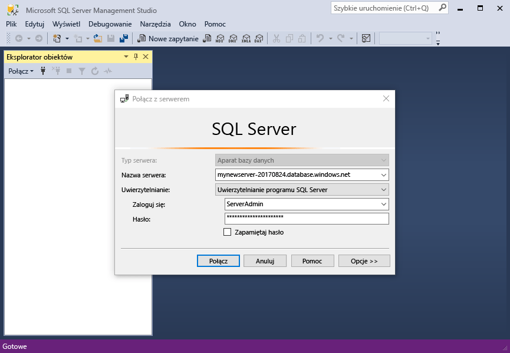

# <a name="azure-sql-database-use-sql-server-management-studio-tooconnect-and-query-data"></a>Baza danych SQL Azure: Użyj programu SQL Server Management Studio tooconnect i zapytań danych

[SQL Server Management Studio](https://msdn.microsoft.com/library/ms174173.aspx) (SSMS) jest zintegrowane środowisko umożliwiające zarządzanie dowolnej infrastruktury SQL z programu SQL Server tooSQL bazy danych systemu Microsoft Windows. To szybki start pokazuje, jak baza danych Azure SQL tooan toouse SSMS tooconnect, a następnie tooquery instrukcje użycia języka Transact-SQL, wstawiania, aktualizowania i usuwania danych w bazie danych hello. 

## <a name="prerequisites"></a>Wymagania wstępne

To szybki start używa jako początkowy punkt zasobów hello tworzony w jednej z tych Szybki Start:

- [Tworzenie bazy danych — portal](sql-database-get-started-portal.md)
- [Tworzenie bazy danych — interfejs wiersza polecenia](sql-database-get-started-cli.md)
- [Tworzenie bazy danych — PowerShell](sql-database-get-started-powershell.md)

Przed rozpoczęciem upewnij się, zainstalowano hello najnowsza wersja [SSMS](https://msdn.microsoft.com/library/mt238290.aspx). 

## <a name="sql-server-connection-information"></a>Informacje o połączeniu z serwerem SQL

Pobierz hello połączenia potrzebnych tooconnect toohello usługa Azure SQL database. Konieczne będzie hello pełni kwalifikowaną nazwę serwera, nazwa bazy danych i informacji o logowaniu w hello kolejnych procedur.

1. Zaloguj się za toohello [portalu Azure](https://portal.azure.com/).
2. Wybierz **baz danych SQL** z menu po lewej stronie powitania i kliknij bazę danych na powitania **baz danych SQL** strony. 
3. Na powitania **omówienie** stron dla bazy danych, przejrzyj hello pełni kwalifikowaną nazwę serwera, jak pokazano w poniższym obrazie hello. Ustawieniu kursora toobring nazwy serwera hello zapasowej hello **kliknij toocopy** opcji.

    

4. Jeśli pamiętasz hello informacje logowania dla serwera bazy danych SQL Azure, przejdź toohello bazy danych SQL strony tooview powitania serwera nazwa administratora serwera i, w razie potrzeby zresetowania hasła hello. 

## <a name="connect-tooyour-database"></a>Połącz tooyour bazy danych

Użyj programu SQL Server Management Studio tooestablish serwer bazy danych SQL Azure tooyour połączenia. 

> [!IMPORTANT]
> Serwer logiczny usługi Azure SQL Database nasłuchuje na porcie 1433. Jeśli próbujesz tooconnect tooan bazy danych SQL Azure serwera logicznego od w obrębie firmowej zapory, ten port musi być otwarty w hello firmowej zapory dla toosuccessfully można połączyć z usługą.
>

1. Otwórz program SQL Server Management Studio.

2. W hello **połączyć tooServer** okna dialogowego wprowadź hello następujących informacji:

   | Ustawienie       | Sugerowana wartość | Opis | 
   | ------------ | ------------------ | ------------------------------------------------- | 
   | **Typ serwera** | Aparat bazy danych | Ta wartość jest wymagana. |
   | **Nazwa serwera** | Nazwa FQDN serwera Hello | Witaj nazwa powinna być podobny do następującego: **mynewserver20170313.database.windows.net**. |
   | **Uwierzytelnianie** | Uwierzytelnianie programu SQL Server | Uwierzytelnianie programu SQL jest typ uwierzytelniania tylko hello ma został skonfigurowany w tym samouczku. |
   | **Logowanie** | konto administratora powitania serwera | To konto hello określone podczas tworzenia powitania serwera. |
   | **Hasło** | Witaj hasło do konta administratora serwera | Jest to hasło hello określone podczas tworzenia powitania serwera. |

     

3. Kliknij przycisk **opcje** w hello **połączyć tooserver** okno dialogowe. W hello **połączyć toodatabase** wprowadź **mySampleDatabase** tooconnect toothis w bazie danych.

     

4. Kliknij przycisk **Połącz**. Okno Eksploratora obiektów Hello zostanie otwarty w programie SSMS. 

     

5. W Eksploratorze obiektów rozwiń **baz danych** , a następnie rozwiń węzeł **mySampleDatabase** tooview hello obiektów hello przykładowej bazy danych.

## <a name="query-data"></a>Zapytania o dane

Użyj hello poniższy kod tooquery produktów pierwsza 20. wg hello według kategorii przy użyciu hello [wybierz](https://msdn.microsoft.com/library/ms189499.aspx) instrukcji języka Transact-SQL.

1. W Eksploratorze obiektów kliknij prawym przyciskiem myszy pozycję **mySampleDatabase** i kliknij opcję **Nowe zapytanie**. Puste zapytanie zostanie otwarte okno czyli tooyour połączenia bazy danych.
2. W oknie zapytania hello wprowadź hello następujące zapytanie:

   ```sql
   SELECT pc.Name as CategoryName, p.name as ProductName
   FROM [SalesLT].[ProductCategory] pc
   JOIN [SalesLT].[Product] p
   ON pc.productcategoryid = p.productcategoryid;
   ```

3. Na pasku narzędzi hello, kliknij przycisk **Execute** tooretrieve danych z tabel hello produktu i ProductCategory.

    

## <a name="insert-data"></a>Wstawianie danych

Poniższy hello używany kod tooinsert nowego produktu do hello SalesLT.Product tabeli hello [Wstaw](https://msdn.microsoft.com/library/ms174335.aspx) instrukcji języka Transact-SQL.

1. W oknie zapytania hello Zastąp poprzednie zapytanie hello hello następujące zapytania:

   ```sql
   INSERT INTO [SalesLT].[Product]
           ( [Name]
           , [ProductNumber]
           , [Color]
           , [ProductCategoryID]
           , [StandardCost]
           , [ListPrice]
           , [SellStartDate]
           )
     VALUES
           ('myNewProduct'
           ,123456789
           ,'NewColor'
           ,1
           ,100
           ,100
           ,GETDATE() );
   ```

2. Na pasku narzędzi hello, kliknij przycisk **Execute** tooinsert nowy wiersz w tabeli produktu hello.

    

## <a name="update-data"></a>Aktualizowanie danych

Użyj hello poniższy kod tooupdate hello nowego produktu czy wcześniej dodane za pomocą hello [aktualizacji](https://msdn.microsoft.com/library/ms177523.aspx) instrukcji języka Transact-SQL.

1. W oknie zapytania hello Zastąp poprzednie zapytanie hello hello następujące zapytania:

   ```sql
   UPDATE [SalesLT].[Product]
   SET [ListPrice] = 125
   WHERE Name = 'myNewProduct';
   ```

2. Na pasku narzędzi hello, kliknij przycisk **Execute** tooupdate hello określony wiersz w tabeli produktu hello.

    

## <a name="delete-data"></a>Usuwanie danych

Użyj hello poniższy kod toodelete hello nowego produktu czy wcześniej dodane za pomocą hello [usunąć](https://msdn.microsoft.com/library/ms189835.aspx) instrukcji języka Transact-SQL.

1. W oknie zapytania hello Zastąp poprzednie zapytanie hello hello następujące zapytania:

   ```sql
   DELETE FROM [SalesLT].[Product]
   WHERE Name = 'myNewProduct';
   ```

2. Na pasku narzędzi hello, kliknij przycisk **Execute** toodelete hello określony wiersz w tabeli produktu hello.

    

## <a name="next-steps"></a>Następne kroki

- toolearn dotyczących tworzenia i zarządzania serwerami i bazami danych z języka Transact-SQL, zobacz [więcej informacji na temat usługi Azure SQL Database serwerów i baz danych](sql-database-servers-databases.md).
- Aby uzyskać więcej informacji o programie SSMS, zobacz [Korzystanie z programu SQL Server Management Studio](https://msdn.microsoft.com/library/ms174173.aspx).
- tooconnect i zapytania przy użyciu kodu programu Visual Studio, zobacz [Connect i zapytanie z kodem Visual Studio](sql-database-connect-query-vscode.md).
- tooconnect i zapytania przy użyciu platformy .NET, zobacz [Connect i zapytania z platformą .NET](sql-database-connect-query-dotnet.md).
- tooconnect i zapytania za pomocą języka PHP, zobacz [Connect i zapytań za pomocą języka PHP](sql-database-connect-query-php.md).
- tooconnect i zapytania przy użyciu środowiska Node.js, zobacz [Connect i zapytań za pomocą języka Node.js](sql-database-connect-query-nodejs.md).
- tooconnect i zapytania za pomocą języka Java, zobacz [Connect i zapytań z języka Java](sql-database-connect-query-java.md).
- tooconnect i zapytania przy użyciu języka Python, zobacz [Connect i zapytania języka Python](sql-database-connect-query-python.md).
- tooconnect i zapytania przy użyciu Ruby, zobacz [Connect i zapytanie o języku Ruby](sql-database-connect-query-ruby.md).
