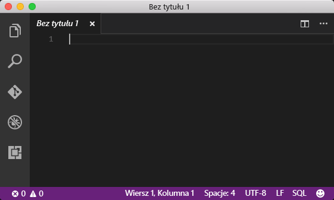
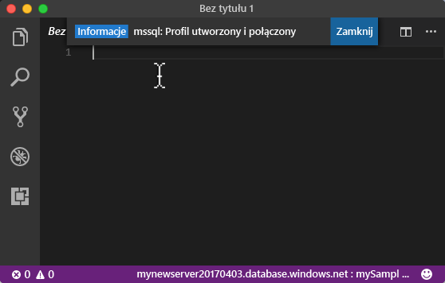
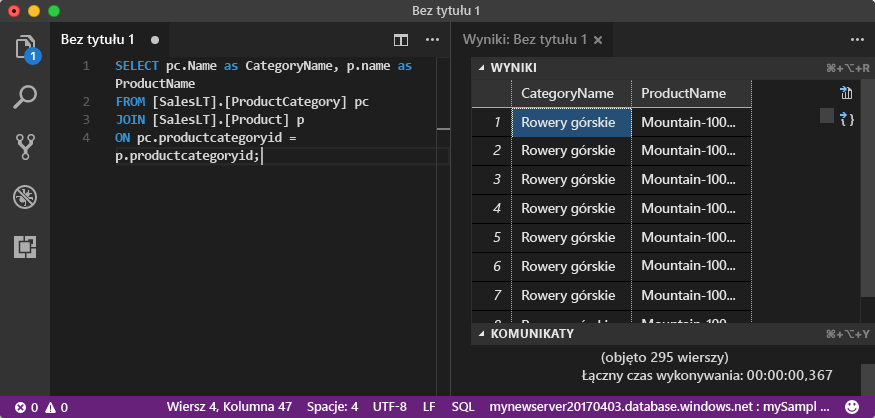

# <a name="azure-sql-database-use-visual-studio-code-tooconnect-and-query-data"></a>Baza danych SQL Azure: Użyj Visual Studio Code tooconnect i zapytań danych

[Visual Studio Code](https://code.visualstudio.com/docs) to edytor graficzny kodu dla systemu Linux, macOS, i systemu Windows, które obsługuje rozszerzenia, w tym hello [rozszerzenia mssql](https://aka.ms/mssql-marketplace) do wykonywania zapytań programu Microsoft SQL Server, bazy danych SQL Azure i SQL Data Warehouse. To szybki start pokazuje, jak baza danych Azure SQL tooan toouse Visual Studio Code tooconnect, a następnie tooquery instrukcje użycia języka Transact-SQL, wstawiania, aktualizowania i usuwania danych w bazie danych hello.

## <a name="prerequisites"></a>Wymagania wstępne

To szybki start używa jako początkowy punkt zasobów hello tworzony w jednej z tych Szybki Start:

- [Tworzenie bazy danych — portal](sql-database-get-started-portal.md)
- [Tworzenie bazy danych — interfejs wiersza polecenia](sql-database-get-started-cli.md)
- [Tworzenie bazy danych — PowerShell](sql-database-get-started-powershell.md)

Przed rozpoczęciem upewnij się, zainstalowano hello najnowsza wersja [Visual Studio Code](https://code.visualstudio.com/Download) i załadować hello [rozszerzenia mssql](https://aka.ms/mssql-marketplace). Aby instalacja rozszerzenia mssql hello, zobacz [Zainstaluj kod programu VS](https://docs.microsoft.com/sql/linux/sql-server-linux-develop-use-vscode#install-vs-code) i zobacz [mssql dla programu Visual Studio Code](https://marketplace.visualstudio.com/items?itemName=ms-mssql.mssql). 

## <a name="configure-vs-code"></a>Konfigurowanie kodu programu VS 

### <a name="mac-os"></a>**Mac OS**
System macOS należy tooinstall biblioteki OpenSSL, które jest wymagań wstępnych dla podstawowej platformy DotNet rozszerzenie tego mssql używa. Otwórz terminala i wprowadź następujące polecenia tooinstall hello **brew** i **OpenSSL**. 

```bash
ruby -e "$(curl -fsSL https://raw.githubusercontent.com/Homebrew/install/master/install)"
brew update
brew install openssl
mkdir -p /usr/local/lib
ln -s /usr/local/opt/openssl/lib/libcrypto.1.0.0.dylib /usr/local/lib/
ln -s /usr/local/opt/openssl/lib/libssl.1.0.0.dylib /usr/local/lib/
```

### <a name="linux-ubuntu"></a>**Linux (Ubuntu)**

Nie jest potrzebna specjalna konfiguracja.

### <a name="windows"></a>**Windows**

Nie jest potrzebna specjalna konfiguracja.

## <a name="sql-server-connection-information"></a>Informacje o połączeniu z serwerem SQL

Pobierz hello połączenia potrzebnych tooconnect toohello usługa Azure SQL database. Konieczne będzie hello pełni kwalifikowaną nazwę serwera, nazwa bazy danych i informacji o logowaniu w hello kolejnych procedur.

1. Zaloguj się za toohello [portalu Azure](https://portal.azure.com/).
2. Wybierz **baz danych SQL** z menu po lewej stronie powitania i kliknij bazę danych na powitania **baz danych SQL** strony. 
3. Na powitania **omówienie** stron dla bazy danych, przejrzyj hello w pełni kwalifikowana nazwa serwera, pokazane na powitania po obrazu. Ustawieniu kursora toobring nazwy serwera hello zapasowej hello **kliknij toocopy** opcji.

    

4. Jeśli pamiętasz hello informacje logowania dla serwera bazy danych SQL Azure, przejdź toohello bazy danych SQL strony tooview powitania serwera nazwa administratora serwera i, w razie potrzeby zresetowania hasła hello. 

## <a name="set-language-mode-toosql"></a>TooSQL tryb języka zestawu

Ustaw tryb języka hello ustawiono zbyt**SQL** w programie Visual Studio Code tooenable mssql poleceń i IntelliSense T-SQL.

1. Otwórz nowe okno programu Visual Studio Code. 

2. Kliknij przycisk **zwykły tekst** w hello prawym dolnym rogu paska stanu hello.
3. W hello **tryb wybrany język** menu rozwijanego, który zostanie otwarty, typ **SQL**, a następnie naciśnij klawisz **ENTER** tooset hello języka tryb tooSQL. 

   

## <a name="connect-tooyour-database"></a>Połącz tooyour bazy danych

Za pomocą programu Visual Studio Code tooestablish serwer bazy danych SQL Azure tooyour połączenia.

> [!IMPORTANT]
> Przed kontynuowaniem upewnij się, że masz przygotowany serwer, bazę danych i informacje logowania. Po rozpoczęciu wprowadzania informacji o profilu połączenia hello, jeżeli zmienić fokus w Visual Studio Code, masz toorestart tworzenia profilu połączenia hello.
>

1. W kodzie VS, naciśnij klawisz **CTRL + SHIFT + P** (lub **F1**) tooopen hello palety polecenia.

2. Wpisz **sqlcon** i naciśnij klawisz **ENTER**.

3. Naciśnij klawisz **ENTER** tooselect **Utwórz profil połączenia**. W ten sposób zostanie utworzony profil połączenia dla wystąpienia programu SQL Server.

4. Wykonaj hello monity toospecify hello właściwości połączenia hello nowy profil połączenia. Po określeniu każdej wartości, naciśnij klawisz **ENTER** toocontinue. 

   | Ustawienie       | Sugerowana wartość | Opis |
   | ------------ | ------------------ | ------------------------------------------------- | 
   | **Nazwa serwera | Nazwa FQDN serwera Hello | Witaj nazwa powinna być podobny do następującego: **mynewserver20170313.database.windows.net**. |
   | **Nazwa bazy danych** | mySampleDatabase | Nazwa Hello hello bazy danych toowhich tooconnect. |
   | **Uwierzytelnianie** | Identyfikator logowania SQL| Uwierzytelnianie programu SQL jest typ uwierzytelniania tylko hello ma został skonfigurowany w tym samouczku. |
   | **Nazwa użytkownika** | konto administratora powitania serwera | To konto hello określone podczas tworzenia powitania serwera. |
   | **Hasło (identyfikator logowania SQL)** | Witaj hasło do konta administratora serwera | Jest to hasło hello określone podczas tworzenia powitania serwera. |
   | **Zapisać hasło?** | Tak lub Nie | Wybierz opcję Tak, jeśli nie chcesz tooenter hello hasła zawsze. |
   | **Wprowadź nazwę dla tego profilu** | Nazwa profilu, np. **mySampleDatabase** | Zapisana nazwa profilu przyspiesza połączenie podczas kolejnych logowań. | 

5. Naciśnij klawisz hello **ESC** klucza tooclose hello komunikat z informacjami o informujące, że profil hello jest utworzone i połączone.

6. Sprawdź połączenie na pasku stanu hello.

   

## <a name="query-data"></a>Zapytania o dane

Użyj hello poniższy kod tooquery produktów pierwsza 20. wg hello według kategorii przy użyciu hello [wybierz](https://msdn.microsoft.com/library/ms189499.aspx) instrukcji języka Transact-SQL.

1. W hello **edytor** okna, wprowadź następujące zapytanie w oknie zapytania pusty hello hello:

   ```sql
   SELECT pc.Name as CategoryName, p.name as ProductName
   FROM [SalesLT].[ProductCategory] pc
   JOIN [SalesLT].[Product] p
   ON pc.productcategoryid = p.productcategoryid;
   ```

2. Naciśnij klawisz **CTRL + SHIFT + E** tooretrieve danych z tabel hello produktu i ProductCategory.

    

## <a name="insert-data"></a>Wstawianie danych

Poniższy hello używany kod tooinsert nowego produktu do hello SalesLT.Product tabeli hello [Wstaw](https://msdn.microsoft.com/library/ms174335.aspx) instrukcji języka Transact-SQL.

1. W hello **edytor** okna, Usuń poprzednie zapytanie hello i wprowadź hello następujące zapytania:

   ```sql
   INSERT INTO [SalesLT].[Product]
           ( [Name]
           , [ProductNumber]
           , [Color]
           , [ProductCategoryID]
           , [StandardCost]
           , [ListPrice]
           , [SellStartDate]
           )
     VALUES
           ('myNewProduct'
           ,123456789
           ,'NewColor'
           ,1
           ,100
           ,100
           ,GETDATE() );
   ```

2. Naciśnij klawisz **CTRL + SHIFT + E** tooinsert nowy wiersz w tabeli produktu hello.

## <a name="update-data"></a>Aktualizowanie danych

Użyj hello poniższy kod tooupdate hello nowego produktu czy wcześniej dodane za pomocą hello [aktualizacji](https://msdn.microsoft.com/library/ms177523.aspx) instrukcji języka Transact-SQL.

1.  W hello **edytor** okna, Usuń poprzednie zapytanie hello i wprowadź hello następujące zapytania:

   ```sql
   UPDATE [SalesLT].[Product]
   SET [ListPrice] = 125
   WHERE Name = 'myNewProduct';
   ```

2. Naciśnij klawisz **CTRL + SHIFT + E** tooupdate hello określony wiersz w tabeli produktu hello.

## <a name="delete-data"></a>Usuwanie danych

Użyj hello poniższy kod toodelete hello nowego produktu czy wcześniej dodane za pomocą hello [usunąć](https://msdn.microsoft.com/library/ms189835.aspx) instrukcji języka Transact-SQL.

1. W hello **edytor** okna, Usuń poprzednie zapytanie hello i wprowadź hello następujące zapytania:

   ```sql
   DELETE FROM [SalesLT].[Product]
   WHERE Name = 'myNewProduct';
   ```

2. Naciśnij klawisz **CTRL + SHIFT + E** toodelete hello określony wiersz w tabeli produktu hello.

## <a name="next-steps"></a>Następne kroki

- tooconnect i zapytania za pomocą programu SQL Server Management Studio, zobacz [Connect i zapytanie z SSMS](sql-database-connect-query-ssms.md).
- Aby zapoznać się z artykułem w magazynie MSDN dotyczącym programu Visual Studio Code, zobacz temat [Create a database IDE with MSSQL extension blog post](https://msdn.microsoft.com/magazine/mt809115) (Tworzenie bazy danych w środowisku IDE, korzystając z wpisu na blogu dotyczącym rozszerzenia MSSQL).
