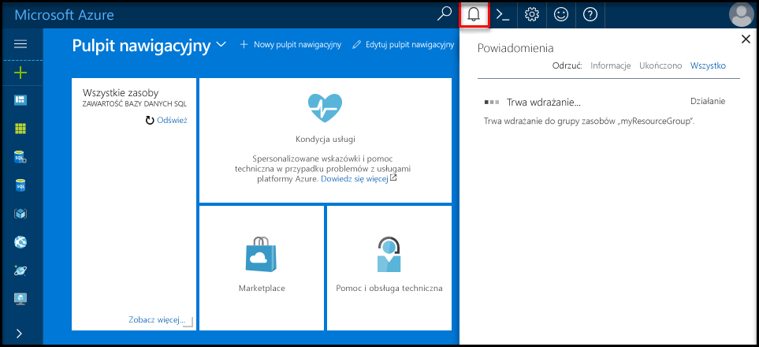
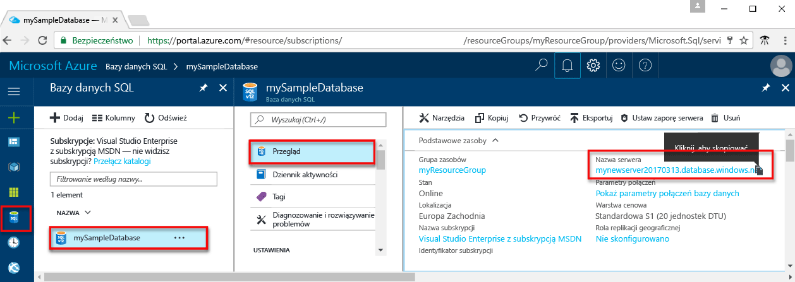
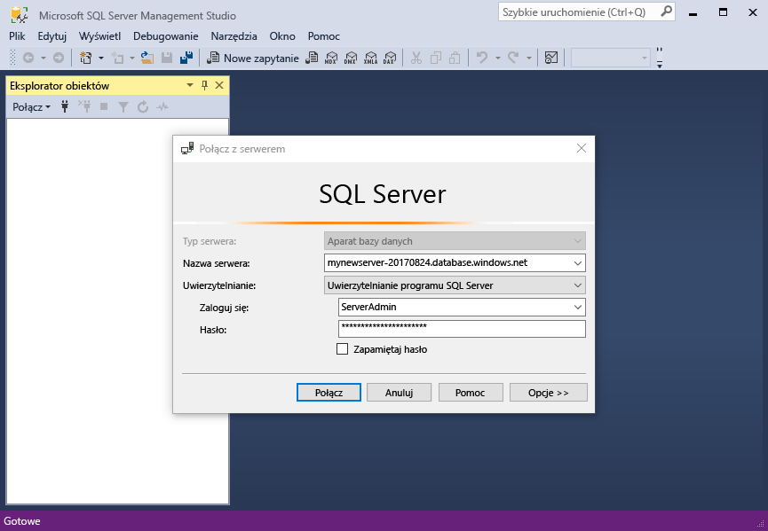
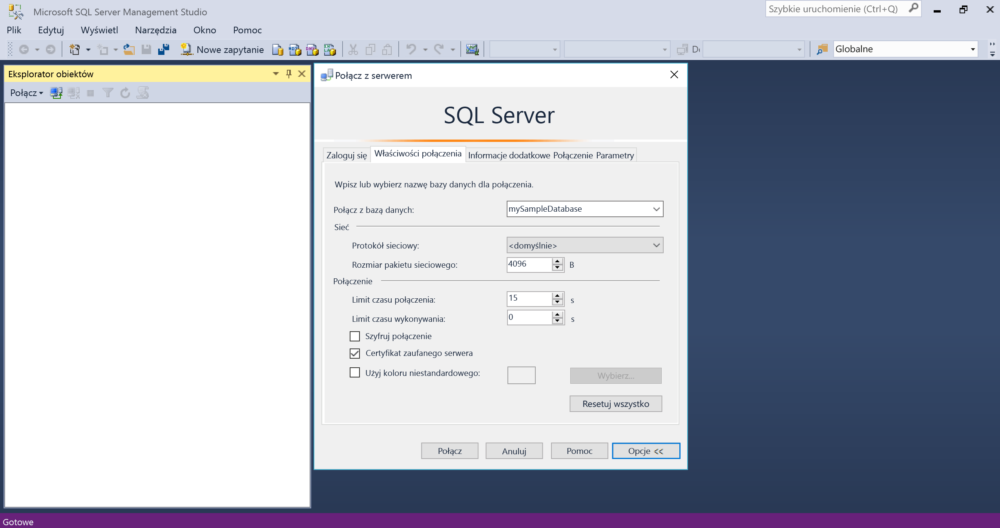
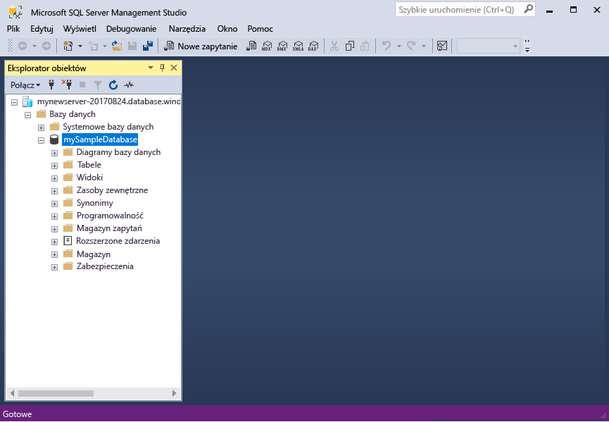

# <a name="design-your-first-azure-sql-database"></a><span data-ttu-id="66721-103">Projektowanie pierwszą bazę danych Azure SQL</span><span class="sxs-lookup"><span data-stu-id="66721-103">Design your first Azure SQL database</span></span>

<span data-ttu-id="66721-104">Baza danych SQL Azure to relacyjnej bazy danych — jako a usługa (DBaaS) w Microsoft Cloud ("Azure").</span><span class="sxs-lookup"><span data-stu-id="66721-104">Azure SQL Database is a relational database-as-a service (DBaaS) in the Microsoft Cloud ("Azure").</span></span> <span data-ttu-id="66721-105">W tym samouczku, możesz dowiedzieć się, jak korzystać z portalu Azure i [programu SQL Server Management Studio](https://msdn.microsoft.com/library/ms174173.aspx) (SSMS) do:</span><span class="sxs-lookup"><span data-stu-id="66721-105">In this tutorial, you learn how to use the Azure portal and [SQL Server Management Studio](https://msdn.microsoft.com/library/ms174173.aspx) (SSMS) to:</span></span> 

> [!div class="checklist"]
> * <span data-ttu-id="66721-106">Utwórz bazę danych w portalu Azure</span><span class="sxs-lookup"><span data-stu-id="66721-106">Create a database in the Azure portal</span></span>
> * <span data-ttu-id="66721-107">Reguły zapory poziomu serwera w portalu Azure</span><span class="sxs-lookup"><span data-stu-id="66721-107">Set up a server-level firewall rule in the Azure portal</span></span>
> * <span data-ttu-id="66721-108">Połączenie z bazą danych z narzędzia SSMS</span><span class="sxs-lookup"><span data-stu-id="66721-108">Connect to the database with SSMS</span></span>
> * <span data-ttu-id="66721-109">Tworzenie tabel z SSMS</span><span class="sxs-lookup"><span data-stu-id="66721-109">Create tables with SSMS</span></span>
> * <span data-ttu-id="66721-110">Danych ładowania zbiorczego, za pomocą narzędzia BCP</span><span class="sxs-lookup"><span data-stu-id="66721-110">Bulk load data with BCP</span></span>
> * <span data-ttu-id="66721-111">Zapytanie danych z narzędzia SSMS</span><span class="sxs-lookup"><span data-stu-id="66721-111">Query that data with SSMS</span></span>
> * <span data-ttu-id="66721-112">Przywróć bazę danych do poprzedniej [punktu w czasie przywracania](sql-database-recovery-using-backups.md#point-in-time-restore) w portalu Azure</span><span class="sxs-lookup"><span data-stu-id="66721-112">Restore the database to a previous [point in time restore](sql-database-recovery-using-backups.md#point-in-time-restore) in the Azure portal</span></span>

<span data-ttu-id="66721-113">Jeśli nie masz subskrypcji platformy Azure, [utworzyć bezpłatne konto](https://azure.microsoft.com/free/) przed rozpoczęciem.</span><span class="sxs-lookup"><span data-stu-id="66721-113">If you don't have an Azure subscription, [create a free account](https://azure.microsoft.com/free/) before you begin.</span></span>

## <a name="prerequisites"></a><span data-ttu-id="66721-114">Wymagania wstępne</span><span class="sxs-lookup"><span data-stu-id="66721-114">Prerequisites</span></span>

<span data-ttu-id="66721-115">Do ukończenia tego samouczka, upewnij się, że jest zainstalowana:</span><span class="sxs-lookup"><span data-stu-id="66721-115">To complete this tutorial, make sure you have installed:</span></span>
- <span data-ttu-id="66721-116">Najnowsza wersja [programu SQL Server Management Studio](https://msdn.microsoft.com/library/ms174173.aspx) (SSMS).</span><span class="sxs-lookup"><span data-stu-id="66721-116">The newest version of [SQL Server Management Studio](https://msdn.microsoft.com/library/ms174173.aspx) (SSMS).</span></span>
- <span data-ttu-id="66721-117">Najnowsza wersja [BCP i SQLCMD](https://www.microsoft.com/download/details.aspx?id=36433).</span><span class="sxs-lookup"><span data-stu-id="66721-117">The newest version of [BCP and SQLCMD](https://www.microsoft.com/download/details.aspx?id=36433).</span></span>

## <a name="log-in-to-the-azure-portal"></a><span data-ttu-id="66721-118">Logowanie do witryny Azure Portal</span><span class="sxs-lookup"><span data-stu-id="66721-118">Log in to the Azure portal</span></span>

<span data-ttu-id="66721-119">Zaloguj się do witryny [Azure Portal](https://portal.azure.com/).</span><span class="sxs-lookup"><span data-stu-id="66721-119">Log in to the [Azure portal](https://portal.azure.com/).</span></span>

## <a name="create-a-blank-sql-database"></a><span data-ttu-id="66721-120">Utwórz pustą bazę danych SQL</span><span class="sxs-lookup"><span data-stu-id="66721-120">Create a blank SQL database</span></span>

<span data-ttu-id="66721-121">Baza danych Azure SQL jest tworzona ze zdefiniowanym zestawem [zasobów obliczeniowych i przechowywania](sql-database-service-tiers.md).</span><span class="sxs-lookup"><span data-stu-id="66721-121">An Azure SQL database is created with a defined set of [compute and storage resources](sql-database-service-tiers.md).</span></span> <span data-ttu-id="66721-122">Baza danych jest tworzona w [grupie zasobów platformy Azure](../azure-resource-manager/resource-group-overview.md) oraz na [serwerze logicznym bazy danych Azure SQL Database](sql-database-features.md).</span><span class="sxs-lookup"><span data-stu-id="66721-122">The database is created within an [Azure resource group](../azure-resource-manager/resource-group-overview.md) and in an [Azure SQL Database logical server](sql-database-features.md).</span></span> 

<span data-ttu-id="66721-123">Wykonaj następujące kroki, aby utworzyć pustą bazę danych SQL.</span><span class="sxs-lookup"><span data-stu-id="66721-123">Follow these steps to create a blank SQL database.</span></span> 

1. <span data-ttu-id="66721-124">Kliknij przycisk **Nowy** znajdujący się w lewym górnym rogu witryny Azure Portal.</span><span class="sxs-lookup"><span data-stu-id="66721-124">Click the **New** button found on the upper left-hand corner of the Azure portal.</span></span>

2. <span data-ttu-id="66721-125">Na stronie **Nowy** wybierz pozycję **Bazy danych**, a następnie na stronie **Bazy danych** wybierz pozycję **SQL Database**.</span><span class="sxs-lookup"><span data-stu-id="66721-125">Select **Databases** from the **New** page, and select **SQL Database** from the **Databases** page.</span></span> 

   

3. <span data-ttu-id="66721-127">Wypełnij formularz Baza danych SQL w sposób pokazany na wcześniejszej ilustracji, używając następujących informacji:</span><span class="sxs-lookup"><span data-stu-id="66721-127">Fill out the SQL Database form with the following information, as shown on the preceding image:</span></span>   

   | <span data-ttu-id="66721-128">Ustawienie</span><span class="sxs-lookup"><span data-stu-id="66721-128">Setting</span></span>       | <span data-ttu-id="66721-129">Sugerowana wartość</span><span class="sxs-lookup"><span data-stu-id="66721-129">Suggested value</span></span> | <span data-ttu-id="66721-130">Opis</span><span class="sxs-lookup"><span data-stu-id="66721-130">Description</span></span> | 
   | ------------ | ------------------ | ------------------------------------------------- | 
   | <span data-ttu-id="66721-131">**Nazwa bazy danych**</span><span class="sxs-lookup"><span data-stu-id="66721-131">**Database name**</span></span> | <span data-ttu-id="66721-132">mySampleDatabase</span><span class="sxs-lookup"><span data-stu-id="66721-132">mySampleDatabase</span></span> | <span data-ttu-id="66721-133">Prawidłowe nazwy baz danych opisano w artykule [Database Identifiers](https://docs.microsoft.com/sql/relational-databases/databases/database-identifiers) (Identyfikatory baz danych).</span><span class="sxs-lookup"><span data-stu-id="66721-133">For valid database names, see [Database Identifiers](https://docs.microsoft.com/sql/relational-databases/databases/database-identifiers).</span></span> | 
   | <span data-ttu-id="66721-134">**Subskrypcja**</span><span class="sxs-lookup"><span data-stu-id="66721-134">**Subscription**</span></span> | <span data-ttu-id="66721-135">Twoja subskrypcja</span><span class="sxs-lookup"><span data-stu-id="66721-135">Your subscription</span></span>  | <span data-ttu-id="66721-136">Aby uzyskać szczegółowe informacje o subskrypcjach, zobacz [Subskrypcje](https://account.windowsazure.com/Subscriptions).</span><span class="sxs-lookup"><span data-stu-id="66721-136">For details about your subscriptions, see [Subscriptions](https://account.windowsazure.com/Subscriptions).</span></span> |
   | <span data-ttu-id="66721-137">**Grupa zasobów**</span><span class="sxs-lookup"><span data-stu-id="66721-137">**Resource group**</span></span> | <span data-ttu-id="66721-138">myResourceGroup</span><span class="sxs-lookup"><span data-stu-id="66721-138">myResourceGroup</span></span> | <span data-ttu-id="66721-139">Prawidłowe nazwy grup zasobów opisano w artykule [Naming rules and restrictions](https://docs.microsoft.com/azure/architecture/best-practices/naming-conventions) (Reguły i ograniczenia nazewnictwa).</span><span class="sxs-lookup"><span data-stu-id="66721-139">For valid resource group names, see [Naming rules and restrictions](https://docs.microsoft.com/azure/architecture/best-practices/naming-conventions).</span></span> |
   | <span data-ttu-id="66721-140">**Wybierz źródło**</span><span class="sxs-lookup"><span data-stu-id="66721-140">**Select source**</span></span> | <span data-ttu-id="66721-141">Pusta baza danych</span><span class="sxs-lookup"><span data-stu-id="66721-141">Blank database</span></span> | <span data-ttu-id="66721-142">Określa, czy można utworzyć pustej bazy danych.</span><span class="sxs-lookup"><span data-stu-id="66721-142">Specifies that a blank database should be created.</span></span> |

4. <span data-ttu-id="66721-143">Kliknij pozycję **Serwer**, aby utworzyć i skonfigurować nowy serwer dla nowej bazy danych.</span><span class="sxs-lookup"><span data-stu-id="66721-143">Click **Server** to create and configure a new server for your new database.</span></span> <span data-ttu-id="66721-144">Wypełnianie **nowy formularz serwera** z następującymi informacjami:</span><span class="sxs-lookup"><span data-stu-id="66721-144">Fill out the **New server form** with the following information:</span></span> 

   | <span data-ttu-id="66721-145">Ustawienie</span><span class="sxs-lookup"><span data-stu-id="66721-145">Setting</span></span>       | <span data-ttu-id="66721-146">Sugerowana wartość</span><span class="sxs-lookup"><span data-stu-id="66721-146">Suggested value</span></span> | <span data-ttu-id="66721-147">Opis</span><span class="sxs-lookup"><span data-stu-id="66721-147">Description</span></span> | 
   | ------------ | ------------------ | ------------------------------------------------- | 
   | <span data-ttu-id="66721-148">**Nazwa serwera**</span><span class="sxs-lookup"><span data-stu-id="66721-148">**Server name**</span></span> | <span data-ttu-id="66721-149">Dowolna nazwa unikatowa w skali globalnej</span><span class="sxs-lookup"><span data-stu-id="66721-149">Any globally unique name</span></span> | <span data-ttu-id="66721-150">Prawidłowe nazwy serwera opisano w artykule [Naming rules and restrictions](https://docs.microsoft.com/azure/architecture/best-practices/naming-conventions) (Reguły i ograniczenia nazewnictwa).</span><span class="sxs-lookup"><span data-stu-id="66721-150">For valid server names, see [Naming rules and restrictions](https://docs.microsoft.com/azure/architecture/best-practices/naming-conventions).</span></span> | 
   | <span data-ttu-id="66721-151">**Identyfikator logowania administratora serwera**</span><span class="sxs-lookup"><span data-stu-id="66721-151">**Server admin login**</span></span> | <span data-ttu-id="66721-152">Dowolna prawidłowa nazwa</span><span class="sxs-lookup"><span data-stu-id="66721-152">Any valid name</span></span> | <span data-ttu-id="66721-153">Prawidłowe nazwy identyfikatorów logowania opisano w artykule [Database Identifiers](https://docs.microsoft.com/sql/relational-databases/databases/database-identifiers) (Identyfikatory baz danych).</span><span class="sxs-lookup"><span data-stu-id="66721-153">For valid login names, see [Database Identifiers](https://docs.microsoft.com/sql/relational-databases/databases/database-identifiers).</span></span>|
   | <span data-ttu-id="66721-154">**Hasło**</span><span class="sxs-lookup"><span data-stu-id="66721-154">**Password**</span></span> | <span data-ttu-id="66721-155">Dowolne prawidłowe hasło</span><span class="sxs-lookup"><span data-stu-id="66721-155">Any valid password</span></span> | <span data-ttu-id="66721-156">Hasło musi mieć co najmniej 8 znaków i musi zawierać znaki z trzech z następujących kategorii: wielkich liter, małych liter, cyfr i znaków innych niż alfanumeryczne.</span><span class="sxs-lookup"><span data-stu-id="66721-156">Your password must have at least 8 characters and must contain characters from three of the following categories: upper case characters, lower case characters, numbers, and non-alphanumeric characters.</span></span> |
   | <span data-ttu-id="66721-157">**Lokalizacja**</span><span class="sxs-lookup"><span data-stu-id="66721-157">**Location**</span></span> | <span data-ttu-id="66721-158">Dowolna prawidłowa lokalizacja</span><span class="sxs-lookup"><span data-stu-id="66721-158">Any valid location</span></span> | <span data-ttu-id="66721-159">Aby uzyskać informacje na temat regionów, zobacz temat [Regiony systemu Azure](https://azure.microsoft.com/regions/).</span><span class="sxs-lookup"><span data-stu-id="66721-159">For information about regions, see [Azure Regions](https://azure.microsoft.com/regions/).</span></span> |

   

5. <span data-ttu-id="66721-161">Kliknij pozycję **Wybierz**.</span><span class="sxs-lookup"><span data-stu-id="66721-161">Click **Select**.</span></span>

6. <span data-ttu-id="66721-162">Kliknij pozycję **Warstwa cenowa**, aby określić warstwę usługi i poziom wydajności dla nowej bazy danych.</span><span class="sxs-lookup"><span data-stu-id="66721-162">Click **Pricing tier** to specify the service tier and performance level for your new database.</span></span> <span data-ttu-id="66721-163">W tym samouczku, wybierz **20 jednostek Dtu** i **250** GB miejsca do magazynowania.</span><span class="sxs-lookup"><span data-stu-id="66721-163">For this tutorial, select **20 DTUs** and **250** GB of storage.</span></span>

   

7. <span data-ttu-id="66721-165">Kliknij przycisk **Zastosuj**.</span><span class="sxs-lookup"><span data-stu-id="66721-165">Click **Apply**.</span></span>  

8. <span data-ttu-id="66721-166">Wybierz **sortowania** dla pustą bazę danych (w tym samouczku, użyj wartości domyślnej).</span><span class="sxs-lookup"><span data-stu-id="66721-166">Select a **collation** for the blank database (for this tutorial, use the default value).</span></span> <span data-ttu-id="66721-167">Aby uzyskać więcej informacji na temat sortowań zobacz [sortowania](https://docs.microsoft.com/sql/t-sql/statements/collations)</span><span class="sxs-lookup"><span data-stu-id="66721-167">For more information about collations, see [Collations](https://docs.microsoft.com/sql/t-sql/statements/collations)</span></span>

9. <span data-ttu-id="66721-168">Kliknij pozycję **Utwórz**, aby aprowizować bazę danych.</span><span class="sxs-lookup"><span data-stu-id="66721-168">Click **Create** to provision the database.</span></span> <span data-ttu-id="66721-169">Inicjowanie obsługi administracyjnej ma temat minutę i pół do wykonania.</span><span class="sxs-lookup"><span data-stu-id="66721-169">Provisioning takes about a minute and a half to complete.</span></span> 

10. <span data-ttu-id="66721-170">Na pasku narzędzi kliknij pozycję **Powiadomienia**, aby monitorować proces wdrażania.</span><span class="sxs-lookup"><span data-stu-id="66721-170">On the toolbar, click **Notifications** to monitor the deployment process.</span></span>

   

## <a name="create-a-server-level-firewall-rule"></a><span data-ttu-id="66721-172">Tworzenie reguły zapory na poziomie serwera</span><span class="sxs-lookup"><span data-stu-id="66721-172">Create a server-level firewall rule</span></span>

<span data-ttu-id="66721-173">Usługa SQL Database tworzy zaporę na poziomie serwera, która uniemożliwia zewnętrznym aplikacjom i narzędziom łączenie się z serwerem i wszelkimi bazami danych na tym serwerze, chyba że zostanie utworzona reguła zapory otwierająca zaporę dla konkretnych adresów IP.</span><span class="sxs-lookup"><span data-stu-id="66721-173">The SQL Database service creates a firewall at the server-level that prevents external applications and tools from connecting to the server or any databases on the server unless a firewall rule is created to open the firewall for specific IP addresses.</span></span> <span data-ttu-id="66721-174">Wykonaj następujące kroki, aby utworzyć [regułę zapory na poziomie serwera usługi SQL Database](sql-database-firewall-configure.md) dla podanego adresu IP klienta i włączyć zewnętrzną łączność przez zaporę usługi SQL Database wyłącznie dla konkretnego adresu IP.</span><span class="sxs-lookup"><span data-stu-id="66721-174">Follow these steps to create a [SQL Database server-level firewall rule](sql-database-firewall-configure.md) for your client's IP address and enable external connectivity through the SQL Database firewall for your IP address only.</span></span> 

> [!NOTE]
> <span data-ttu-id="66721-175">Usługa SQL Database nawiązuje komunikację na porcie 1433.</span><span class="sxs-lookup"><span data-stu-id="66721-175">SQL Database communicates over port 1433.</span></span> <span data-ttu-id="66721-176">Jeśli próbujesz nawiązać połączenie z sieci firmowej, ruch wychodzący na porcie 1433 może być zablokowany przez firmową zaporę.</span><span class="sxs-lookup"><span data-stu-id="66721-176">If you are trying to connect from within a corporate network, outbound traffic over port 1433 may not be allowed by your network's firewall.</span></span> <span data-ttu-id="66721-177">Jeśli nastąpi taka sytuacja, nie będzie można nawiązać połączenia z serwerem usługi Azure SQL Database, chyba że dział IT otworzy port 1433.</span><span class="sxs-lookup"><span data-stu-id="66721-177">If so, you cannot connect to your Azure SQL Database server unless your IT department opens port 1433.</span></span>
>

1. <span data-ttu-id="66721-178">Po ukończeniu wdrażania kliknij pozycję **Bazy danych SQL** w menu po lewej stronie i kliknij bazę danych **mySampleDatabase** na stronie **Bazy danych SQL**.</span><span class="sxs-lookup"><span data-stu-id="66721-178">After the deployment completes, click **SQL databases** from the left-hand menu and then click **mySampleDatabase** on the **SQL databases** page.</span></span> <span data-ttu-id="66721-179">Zostanie otwarta strona przeglądu bazy danych zawierająca w pełni kwalifikowaną nazwę serwera (na przykład **mynewserver20170313.database.windows.net**) i opcje dalszej konfiguracji.</span><span class="sxs-lookup"><span data-stu-id="66721-179">The overview page for your database opens, showing you the fully qualified server name (such as **mynewserver20170313.database.windows.net**) and provides options for further configuration.</span></span> <span data-ttu-id="66721-180">Skopiuj tę w pełni kwalifikowaną nazwę serwera do użycia w przyszłości.</span><span class="sxs-lookup"><span data-stu-id="66721-180">Copy this fully qualified server name for use later.</span></span>

   > [!IMPORTANT]
   > <span data-ttu-id="66721-181">Ta w pełni kwalifikowana nazwa serwera będzie potrzebna do nawiązania połączenia z serwerem i jego bazami danych w kolejnych przewodnikach Szybki start.</span><span class="sxs-lookup"><span data-stu-id="66721-181">You need this fully qualified server name to connect to your server and its databases in subsequent quick starts.</span></span>
   > 

    

2. <span data-ttu-id="66721-183">Kliknij pozycję **Ustaw zaporę serwera** na pasku narzędzi, tak jak pokazano to na wcześniejszej ilustracji.</span><span class="sxs-lookup"><span data-stu-id="66721-183">Click **Set server firewall** on the toolbar as shown in the previous image.</span></span> <span data-ttu-id="66721-184">Zostanie otwarta strona **Ustawienia zapory** dla serwera SQL Database.</span><span class="sxs-lookup"><span data-stu-id="66721-184">The **Firewall settings** page for the SQL Database server opens.</span></span> 

    


3. <span data-ttu-id="66721-186">Kliknij pozycję **Dodaj adres IP klienta** na pasku narzędzi, aby dodać bieżący adres IP do nowej reguły zapory.</span><span class="sxs-lookup"><span data-stu-id="66721-186">Click **Add client IP** on the toolbar to add your current IP address to a new firewall rule.</span></span> <span data-ttu-id="66721-187">Reguła zapory może otworzyć port 1433 dla pojedynczego adresu IP lub zakresu adresów IP.</span><span class="sxs-lookup"><span data-stu-id="66721-187">A firewall rule can open port 1433 for a single IP address or a range of IP addresses.</span></span>

4. <span data-ttu-id="66721-188">Kliknij pozycję **Zapisz**.</span><span class="sxs-lookup"><span data-stu-id="66721-188">Click **Save**.</span></span> <span data-ttu-id="66721-189">Dla bieżącego adresu IP zostanie utworzona reguła zapory na poziomie serwera otwierająca port 1433 na serwerze logicznym.</span><span class="sxs-lookup"><span data-stu-id="66721-189">A server-level firewall rule is created for your current IP address opening port 1433 on the logical server.</span></span>

    

4. <span data-ttu-id="66721-191">Kliknij przycisk **OK**, a następnie zamknij stronę **Ustawienia zapory**.</span><span class="sxs-lookup"><span data-stu-id="66721-191">Click **OK** and then close the **Firewall settings** page.</span></span>

<span data-ttu-id="66721-192">Teraz można połączyć się z serwerem usługi SQL Database i jego bazami danych przy użyciu programu SQL Server Management Studio lub innego wybranego narzędzia z tego adresu IP przy użyciu poprzednio utworzonego konta administratora serwera.</span><span class="sxs-lookup"><span data-stu-id="66721-192">You can now connect to the SQL Database server and its databases using SQL Server Management Studio or another tool of your choice from this IP address using the server admin account created previously.</span></span>

> [!IMPORTANT]
> <span data-ttu-id="66721-193">Domyślnie dostęp za pośrednictwem zapory usługi SQL Database jest włączony dla wszystkich usług platformy Azure.</span><span class="sxs-lookup"><span data-stu-id="66721-193">By default, access through the SQL Database firewall is enabled for all Azure services.</span></span> <span data-ttu-id="66721-194">Kliknij przycisk **WYŁ.** na tej stronie, aby wyłączyć tę opcję dla wszystkich usług platformy Azure.</span><span class="sxs-lookup"><span data-stu-id="66721-194">Click **OFF** on this page to disable for all Azure services.</span></span>

## <a name="sql-server-connection-information"></a><span data-ttu-id="66721-195">Informacje o połączeniu z serwerem SQL</span><span class="sxs-lookup"><span data-stu-id="66721-195">SQL server connection information</span></span>

<span data-ttu-id="66721-196">Pobierz w pełni kwalifikowaną nazwę serwera dla serwera Azure SQL Database w witrynie Azure Portal.</span><span class="sxs-lookup"><span data-stu-id="66721-196">Get the fully qualified server name for your Azure SQL Database server in the Azure portal.</span></span> <span data-ttu-id="66721-197">W pełni kwalifikowanej nazwy serwera używa się do nawiązywania połączenia z serwerem przy użyciu programu SQL Server Management Studio.</span><span class="sxs-lookup"><span data-stu-id="66721-197">You use the fully qualified server name to connect to your server using SQL Server Management Studio.</span></span>

1. <span data-ttu-id="66721-198">Zaloguj się do witryny [Azure Portal](https://portal.azure.com/).</span><span class="sxs-lookup"><span data-stu-id="66721-198">Log in to the [Azure portal](https://portal.azure.com/).</span></span>
2. <span data-ttu-id="66721-199">Wybierz opcję **Bazy danych SQL** z menu po lewej stronie, a następnie kliknij bazę danych na stronie **Bazy danych SQL**.</span><span class="sxs-lookup"><span data-stu-id="66721-199">Select **SQL Databases** from the left-hand menu, and click your database on the **SQL databases** page.</span></span> 
3. <span data-ttu-id="66721-200">W okienku **Essentials** na stronie bazy danych w witrynie Azure Portal zlokalizuj i skopiuj **nazwę serwera**.</span><span class="sxs-lookup"><span data-stu-id="66721-200">In the **Essentials** pane in the Azure portal page for your database, locate and then copy the **Server name**.</span></span>

   

## <a name="connect-to-the-database-with-ssms"></a><span data-ttu-id="66721-202">Połączenie z bazą danych z narzędzia SSMS</span><span class="sxs-lookup"><span data-stu-id="66721-202">Connect to the database with SSMS</span></span>

<span data-ttu-id="66721-203">Użyj [programu SQL Server Management Studio](https://docs.microsoft.com/sql/ssms/sql-server-management-studio-ssms) nawiązać połączenia z serwerem bazy danych SQL Azure.</span><span class="sxs-lookup"><span data-stu-id="66721-203">Use [SQL Server Management Studio](https://docs.microsoft.com/sql/ssms/sql-server-management-studio-ssms) to establish a connection to your Azure SQL Database server.</span></span>

1. <span data-ttu-id="66721-204">Otwórz program SQL Server Management Studio.</span><span class="sxs-lookup"><span data-stu-id="66721-204">Open SQL Server Management Studio.</span></span>

2. <span data-ttu-id="66721-205">W oknie dialogowym **Połącz z serwerem** wprowadź następujące informacje:</span><span class="sxs-lookup"><span data-stu-id="66721-205">In the **Connect to Server** dialog box, enter the following information:</span></span>

   | <span data-ttu-id="66721-206">Ustawienie</span><span class="sxs-lookup"><span data-stu-id="66721-206">Setting</span></span>       | <span data-ttu-id="66721-207">Sugerowana wartość</span><span class="sxs-lookup"><span data-stu-id="66721-207">Suggested value</span></span> | <span data-ttu-id="66721-208">Opis</span><span class="sxs-lookup"><span data-stu-id="66721-208">Description</span></span> | 
   | ------------ | ------------------ | ------------------------------------------------- | 
   | <span data-ttu-id="66721-209">Typ serwera</span><span class="sxs-lookup"><span data-stu-id="66721-209">Server type</span></span> | <span data-ttu-id="66721-210">Aparat bazy danych</span><span class="sxs-lookup"><span data-stu-id="66721-210">Database engine</span></span> | <span data-ttu-id="66721-211">Ta wartość jest wymagana</span><span class="sxs-lookup"><span data-stu-id="66721-211">This value is required</span></span> |
   | <span data-ttu-id="66721-212">Nazwa serwera</span><span class="sxs-lookup"><span data-stu-id="66721-212">Server name</span></span> | <span data-ttu-id="66721-213">W pełni kwalifikowana nazwa serwera</span><span class="sxs-lookup"><span data-stu-id="66721-213">The fully qualified server name</span></span> | <span data-ttu-id="66721-214">Nazwa może mieć taką formę: **mynewserver20170313.database.windows.net**.</span><span class="sxs-lookup"><span data-stu-id="66721-214">The name should be something like this: **mynewserver20170313.database.windows.net**.</span></span> |
   | <span data-ttu-id="66721-215">Authentication</span><span class="sxs-lookup"><span data-stu-id="66721-215">Authentication</span></span> | <span data-ttu-id="66721-216">Uwierzytelnianie programu SQL Server</span><span class="sxs-lookup"><span data-stu-id="66721-216">SQL Server Authentication</span></span> | <span data-ttu-id="66721-217">Uwierzytelnianie SQL to jedyny typ uwierzytelniania skonfigurowany w tym samouczku.</span><span class="sxs-lookup"><span data-stu-id="66721-217">SQL Authentication is the only authentication type that we have configured in this tutorial.</span></span> |
   | <span data-ttu-id="66721-218">Login</span><span class="sxs-lookup"><span data-stu-id="66721-218">Login</span></span> | <span data-ttu-id="66721-219">Konto administratora serwera</span><span class="sxs-lookup"><span data-stu-id="66721-219">The server admin account</span></span> | <span data-ttu-id="66721-220">To konto określono podczas tworzenia serwera.</span><span class="sxs-lookup"><span data-stu-id="66721-220">This is the account that you specified when you created the server.</span></span> |
   | <span data-ttu-id="66721-221">Hasło</span><span class="sxs-lookup"><span data-stu-id="66721-221">Password</span></span> | <span data-ttu-id="66721-222">Hasło konta administratora serwera</span><span class="sxs-lookup"><span data-stu-id="66721-222">The password for your server admin account</span></span> | <span data-ttu-id="66721-223">To hasło określono podczas tworzenia serwera.</span><span class="sxs-lookup"><span data-stu-id="66721-223">This is the password that you specified when you created the server.</span></span> |

   

3. <span data-ttu-id="66721-225">Kliknij przycisk **Opcje** w oknie dialogowym **Połącz z serwerem**.</span><span class="sxs-lookup"><span data-stu-id="66721-225">Click **Options** in the **Connect to server** dialog box.</span></span> <span data-ttu-id="66721-226">W sekcji **Nawiązywanie połączenia z bazą danych** wprowadź ciąg **mySampleDatabase**, aby nawiązać połączenie z tą bazą danych.</span><span class="sxs-lookup"><span data-stu-id="66721-226">In the **Connect to database** section, enter **mySampleDatabase** to connect to this database.</span></span>

     

4. <span data-ttu-id="66721-228">Kliknij przycisk **Połącz**.</span><span class="sxs-lookup"><span data-stu-id="66721-228">Click **Connect**.</span></span> <span data-ttu-id="66721-229">W programie SSMS zostanie otwarte okno Eksplorator obiektów.</span><span class="sxs-lookup"><span data-stu-id="66721-229">The Object Explorer window opens in SSMS.</span></span> 

5. <span data-ttu-id="66721-230">W Eksploratorze obiektów rozwiń pozycję **Bazy danych**, a następnie rozwiń pozycję **mySampleDatabase**, aby wyświetlić obiekty w przykładowej bazie danych.</span><span class="sxs-lookup"><span data-stu-id="66721-230">In Object Explorer, expand **Databases** and then expand **mySampleDatabase** to view the objects in the sample database.</span></span>

     

## <a name="create-tables-in-the-database"></a><span data-ttu-id="66721-232">Tworzenie tabel w bazie danych</span><span class="sxs-lookup"><span data-stu-id="66721-232">Create tables in the database</span></span> 

<span data-ttu-id="66721-233">Tworzenie schematu bazy danych z czterech tabel, które system zarządzania uczniów uczelni przy użyciu modelu [języka Transact-SQL](https://docs.microsoft.com/sql/t-sql/language-reference):</span><span class="sxs-lookup"><span data-stu-id="66721-233">Create a database schema with four tables that model a student management system for universities using [Transact-SQL](https://docs.microsoft.com/sql/t-sql/language-reference):</span></span>

- <span data-ttu-id="66721-234">Osoby</span><span class="sxs-lookup"><span data-stu-id="66721-234">Person</span></span>
- <span data-ttu-id="66721-235">Plan</span><span class="sxs-lookup"><span data-stu-id="66721-235">Course</span></span>
- <span data-ttu-id="66721-236">Dla użytkowników domowych</span><span class="sxs-lookup"><span data-stu-id="66721-236">Student</span></span>
- <span data-ttu-id="66721-237">System zarządzania uczniów uczelni modelu karty kredytowej</span><span class="sxs-lookup"><span data-stu-id="66721-237">Credit that model a student management system for universities</span></span>

<span data-ttu-id="66721-238">Na poniższym diagramie przedstawiono, jak te tabele są ze sobą powiązane.</span><span class="sxs-lookup"><span data-stu-id="66721-238">The following diagram shows how these tables are related to each other.</span></span> <span data-ttu-id="66721-239">Niektóre z tych tabel odwoływać się do kolumn w innych tabelach.</span><span class="sxs-lookup"><span data-stu-id="66721-239">Some of these tables reference columns in other tables.</span></span> <span data-ttu-id="66721-240">Na przykład odwołuje się do tabeli uczniowie **PersonId** kolumny **osoby** tabeli.</span><span class="sxs-lookup"><span data-stu-id="66721-240">For example, the Student table references the **PersonId** column of the **Person** table.</span></span> <span data-ttu-id="66721-241">Badanie na diagramie, aby zrozumieć, jak tabele w tym samouczku są ze sobą powiązane.</span><span class="sxs-lookup"><span data-stu-id="66721-241">Study the diagram to understand how the tables in this tutorial are related to one another.</span></span> <span data-ttu-id="66721-242">Aby omówiono sposób tworzenia tabel skuteczne bazy danych, zobacz [tworzenia tabel bazy danych skuteczne](https://msdn.microsoft.com/library/cc505842.aspx).</span><span class="sxs-lookup"><span data-stu-id="66721-242">For an in-depth look at how to create effective database tables, see [Create effective database tables](https://msdn.microsoft.com/library/cc505842.aspx).</span></span> <span data-ttu-id="66721-243">Aby uzyskać informacje dotyczące wybierania typów danych, zobacz [typy danych](https://docs.microsoft.com/sql/t-sql/data-types/data-types-transact-sql).</span><span class="sxs-lookup"><span data-stu-id="66721-243">For information about choosing data types, see [Data types](https://docs.microsoft.com/sql/t-sql/data-types/data-types-transact-sql).</span></span>

> [!NOTE]
> <span data-ttu-id="66721-244">Można również użyć [projektanta tabel w programie SQL Server Management Studio](https://msdn.microsoft.com/library/hh272695.aspx) tworzenie i projektowanie tabelach.</span><span class="sxs-lookup"><span data-stu-id="66721-244">You can also use the [table designer in SQL Server Management Studio](https://msdn.microsoft.com/library/hh272695.aspx) to create and design your tables.</span></span> 


1. <span data-ttu-id="66721-246">W Eksploratorze obiektów kliknij prawym przyciskiem myszy pozycję **mySampleDatabase** i kliknij opcję **Nowe zapytanie**.</span><span class="sxs-lookup"><span data-stu-id="66721-246">In Object Explorer, right-click **mySampleDatabase** and click **New Query**.</span></span> <span data-ttu-id="66721-247">Zostanie otwarte puste okno zapytania, które jest połączone z Twoją bazą danych.</span><span class="sxs-lookup"><span data-stu-id="66721-247">A blank query window opens that is connected to your database.</span></span>

2. <span data-ttu-id="66721-248">W oknie zapytania wykonaj następujące zapytanie, aby utworzyć cztery tabele w bazie danych:</span><span class="sxs-lookup"><span data-stu-id="66721-248">In the query window, execute the following query to create four tables in your database:</span></span> 

   ```sql 
   -- Create Person table

   CREATE TABLE Person
   (
   PersonId   INT IDENTITY PRIMARY KEY,
   FirstName   NVARCHAR(128) NOT NULL,
   MiddelInitial NVARCHAR(10),
   LastName   NVARCHAR(128) NOT NULL,
   DateOfBirth   DATE NOT NULL
   )
   
   -- Create Student table
 
   CREATE TABLE Student
   (
   StudentId INT IDENTITY PRIMARY KEY,
   PersonId  INT REFERENCES Person (PersonId),
   Email   NVARCHAR(256)
   )
   
   -- Create Course table
 
   CREATE TABLE Course
   (
   CourseId  INT IDENTITY PRIMARY KEY,
   Name   NVARCHAR(50) NOT NULL,
   Teacher   NVARCHAR(256) NOT NULL
   ) 

   -- Create Credit table
 
   CREATE TABLE Credit
   (
   StudentId   INT REFERENCES Student (StudentId),
   CourseId   INT REFERENCES Course (CourseId),
   Grade   DECIMAL(5,2) CHECK (Grade <= 100.00),
   Attempt   TINYINT,
   CONSTRAINT  [UQ_studentgrades] UNIQUE CLUSTERED
   (
   StudentId, CourseId, Grade, Attempt
   )
   )
   ```

   

3. <span data-ttu-id="66721-250">Rozwiń węzeł "tabele" w Eksploratorze programu SQL Server Management Studio obiektu, aby zobaczyć tabele, który został utworzony.</span><span class="sxs-lookup"><span data-stu-id="66721-250">Expand the 'tables' node in the SQL Server Management Studio Object explorer to see the tables you created.</span></span>

   

## <a name="load-data-into-the-tables"></a><span data-ttu-id="66721-252">Ładowanie danych do tabel</span><span class="sxs-lookup"><span data-stu-id="66721-252">Load data into the tables</span></span>

1. <span data-ttu-id="66721-253">Utwórz folder o nazwie **SampleTableData** w folderze pobrane do przechowywania przykładowych danych bazy danych.</span><span class="sxs-lookup"><span data-stu-id="66721-253">Create a folder called **SampleTableData** in your Downloads folder to store sample data for your database.</span></span> 

2. <span data-ttu-id="66721-254">Kliknij prawym przyciskiem myszy poniższe łącza, a następnie zapisać je w **SampleTableData** folderu.</span><span class="sxs-lookup"><span data-stu-id="66721-254">Right-click the following links and save them into the **SampleTableData** folder.</span></span> 

   - [<span data-ttu-id="66721-255">SampleCourseData</span><span class="sxs-lookup"><span data-stu-id="66721-255">SampleCourseData</span></span>](https://sqldbtutorial.blob.core.windows.net/tutorials/SampleCourseData)
   - [<span data-ttu-id="66721-256">SamplePersonData</span><span class="sxs-lookup"><span data-stu-id="66721-256">SamplePersonData</span></span>](https://sqldbtutorial.blob.core.windows.net/tutorials/SamplePersonData)
   - [<span data-ttu-id="66721-257">SampleStudentData</span><span class="sxs-lookup"><span data-stu-id="66721-257">SampleStudentData</span></span>](https://sqldbtutorial.blob.core.windows.net/tutorials/SampleStudentData)
   - [<span data-ttu-id="66721-258">SampleCreditData</span><span class="sxs-lookup"><span data-stu-id="66721-258">SampleCreditData</span></span>](https://sqldbtutorial.blob.core.windows.net/tutorials/SampleCreditData)

3. <span data-ttu-id="66721-259">Otwórz okno wiersza polecenia i przejdź do folderu SampleTableData.</span><span class="sxs-lookup"><span data-stu-id="66721-259">Open a command prompt window and navigate to the SampleTableData folder.</span></span>

4. <span data-ttu-id="66721-260">Wykonaj następujące polecenia, aby wstawić przykładowych danych do tabel, zastępując wartości **ServerName**, **DatabaseName**, **UserName**, i  **Hasło** wartościami dla danego środowiska.</span><span class="sxs-lookup"><span data-stu-id="66721-260">Execute the following commands to insert sample data into the tables replacing the values for **ServerName**, **DatabaseName**, **UserName**, and **Password** with the values for your environment.</span></span>
  
   ```bcp
   bcp Course in SampleCourseData -S <ServerName>.database.windows.net -d <DatabaseName> -U <Username> -P <password> -q -c -t ","
   bcp Person in SamplePersonData -S <ServerName>.database.windows.net -d <DatabaseName> -U <Username> -P <password> -q -c -t ","
   bcp Student in SampleStudentData -S <ServerName>.database.windows.net -d <DatabaseName> -U <Username> -P <password> -q -c -t ","
   bcp Credit in SampleCreditData -S <ServerName>.database.windows.net -d <DatabaseName> -U <Username> -P <password> -q -c -t ","
   ```

<span data-ttu-id="66721-261">Teraz załadowano przykładowych danych do tabel, który został utworzony wcześniej.</span><span class="sxs-lookup"><span data-stu-id="66721-261">You have now loaded sample data into the tables you created earlier.</span></span>

## <a name="query-data"></a><span data-ttu-id="66721-262">Zapytania o dane</span><span class="sxs-lookup"><span data-stu-id="66721-262">Query data</span></span>

<span data-ttu-id="66721-263">Wykonaj następujące kwerendy, aby pobrać informacje z tabel bazy danych.</span><span class="sxs-lookup"><span data-stu-id="66721-263">Execute the following queries to retrieve information from the database tables.</span></span> <span data-ttu-id="66721-264">Zobacz [Pisanie zapytań SQL](https://technet.microsoft.com/library/bb264565.aspx) Aby dowiedzieć się więcej na temat Pisanie zapytań SQL.</span><span class="sxs-lookup"><span data-stu-id="66721-264">See [Writing SQL Queries](https://technet.microsoft.com/library/bb264565.aspx) to learn more about writing SQL queries.</span></span> <span data-ttu-id="66721-265">Pierwsza kwerenda łączy wszystkie cztery tabele, aby znaleźć wszystkie studentów nauczanych przez "Dominick Pope", którzy mają wyższe niż 75% stopnia w swojej klasie.</span><span class="sxs-lookup"><span data-stu-id="66721-265">The first query joins all four tables to find all the students taught by 'Dominick Pope' who have a grade higher than 75% in his class.</span></span> <span data-ttu-id="66721-266">Dołącza wszystkie cztery tabele drugiego zapytania i klient znajdzie wszystkich kursów, w których kiedykolwiek zarejestrował "Noe Coleman".</span><span class="sxs-lookup"><span data-stu-id="66721-266">The second query joins all four tables and finds all courses in which 'Noe Coleman' has ever enrolled.</span></span>

1. <span data-ttu-id="66721-267">W oknie zapytania SQL Server Management Studio wykonaj następujące zapytanie:</span><span class="sxs-lookup"><span data-stu-id="66721-267">In a SQL Server Management Studio query window, execute the following query:</span></span>

   ```sql 
   -- Find the students taught by Dominick Pope who have a grade higher than 75%

   SELECT  person.FirstName,
   person.LastName,
   course.Name,
   credit.Grade
   FROM  Person AS person
   INNER JOIN Student AS student ON person.PersonId = student.PersonId
   INNER JOIN Credit AS credit ON student.StudentId = credit.StudentId
   INNER JOIN Course AS course ON credit.CourseId = course.courseId
   WHERE course.Teacher = 'Dominick Pope' 
   AND Grade > 75
   ```

2. <span data-ttu-id="66721-268">W oknie zapytania SQL Server Management Studio wykonaj następujące zapytanie:</span><span class="sxs-lookup"><span data-stu-id="66721-268">In a SQL Server Management Studio query window, execute following query:</span></span>

   ```sql
   -- Find all the courses in which Noe Coleman has ever enrolled

   SELECT  course.Name,
   course.Teacher,
   credit.Grade
   FROM  Course AS course
   INNER JOIN Credit AS credit ON credit.CourseId = course.CourseId
   INNER JOIN Student AS student ON student.StudentId = credit.StudentId
   INNER JOIN Person AS person ON person.PersonId = student.PersonId
   WHERE person.FirstName = 'Noe'
   AND person.LastName = 'Coleman'
   ```

## <a name="restore-a-database-to-a-previous-point-in-time"></a><span data-ttu-id="66721-269">Przywracanie bazy danych do określonego punktu w czasie</span><span class="sxs-lookup"><span data-stu-id="66721-269">Restore a database to a previous point in time</span></span>

<span data-ttu-id="66721-270">Załóżmy, że przypadkowo usunięto tabelę.</span><span class="sxs-lookup"><span data-stu-id="66721-270">Imagine you have accidentally deleted a table.</span></span> <span data-ttu-id="66721-271">Jest to coś, co nie można łatwo odzyskać z.</span><span class="sxs-lookup"><span data-stu-id="66721-271">This is something you cannot easily recover from.</span></span> <span data-ttu-id="66721-272">Baza danych SQL Azure umożliwia wróć do dowolnego punktu w czasie w górę ostatnich 35 dni i przywrócić ten punkt w czasie do nowej bazy danych.</span><span class="sxs-lookup"><span data-stu-id="66721-272">Azure SQL Database allows you to go back to any point in time in the last up to 35 days and restore this point in time to a new database.</span></span> <span data-ttu-id="66721-273">Można odzyskać danych usuniętych tej bazy danych.</span><span class="sxs-lookup"><span data-stu-id="66721-273">You can you this database to recover your deleted data.</span></span> <span data-ttu-id="66721-274">Poniższe kroki przywrócenie przykładowej bazy danych do punktu przed dodaniem tabel.</span><span class="sxs-lookup"><span data-stu-id="66721-274">The following steps restore the sample database to a point before the tables were added.</span></span>

1. <span data-ttu-id="66721-275">Na stronie Baza danych SQL dla bazy danych, kliknij przycisk **przywrócić** na pasku narzędzi.</span><span class="sxs-lookup"><span data-stu-id="66721-275">On the SQL Database page for your database, click **Restore** on the toolbar.</span></span> <span data-ttu-id="66721-276">**Przywrócić** zostanie otwarta strona.</span><span class="sxs-lookup"><span data-stu-id="66721-276">The **Restore** page opens.</span></span>

   

2. <span data-ttu-id="66721-278">Wypełnianie **przywrócić** formularza z informacjami wymaganymi:</span><span class="sxs-lookup"><span data-stu-id="66721-278">Fill out the **Restore** form with the required information:</span></span>
    * <span data-ttu-id="66721-279">Nazwa bazy danych: podaj nazwę bazy danych</span><span class="sxs-lookup"><span data-stu-id="66721-279">Database name: Provide a database name</span></span> 
    * <span data-ttu-id="66721-280">W momencie: Wybierz **w momencie** kartę w formularzu przywracania</span><span class="sxs-lookup"><span data-stu-id="66721-280">Point-in-time: Select the **Point-in-time** tab on the Restore form</span></span> 
    * <span data-ttu-id="66721-281">Punkt przywracania: Wybierz godzinę, która występuje przed zmianą bazy danych</span><span class="sxs-lookup"><span data-stu-id="66721-281">Restore point: Select a time that occurs before the database was changed</span></span>
    * <span data-ttu-id="66721-282">Serwer docelowy: nie można zmienić tę wartość podczas przywracania bazy danych</span><span class="sxs-lookup"><span data-stu-id="66721-282">Target server: You cannot change this value when restoring a database</span></span> 
    * <span data-ttu-id="66721-283">Elastyczna pula baz danych: Wybierz **None**</span><span class="sxs-lookup"><span data-stu-id="66721-283">Elastic database pool: Select **None**</span></span>  
    * <span data-ttu-id="66721-284">Warstwa cenowa: Wybierz **20 jednostek Dtu** i **250 GB** magazynu.</span><span class="sxs-lookup"><span data-stu-id="66721-284">Pricing tier: Select **20 DTUs** and **250 GB** of storage.</span></span>

   

3. <span data-ttu-id="66721-286">Kliknij przycisk **OK** Aby przywrócić bazę danych do [Przywracanie do punktu w czasie](sql-database-recovery-using-backups.md#point-in-time-restore) przed dodaniem tabel.</span><span class="sxs-lookup"><span data-stu-id="66721-286">Click **OK** to restore the database to [restore to a point in time](sql-database-recovery-using-backups.md#point-in-time-restore) before the tables were added.</span></span> <span data-ttu-id="66721-287">Przywracanie bazy danych do innego punktu w czasie tworzy duplikat bazy danych w tym samym serwerze co oryginalnej bazy danych, począwszy od punktu w czasie, możesz określić, tak długo, jak jest w okresie przechowywania dla Twojego [warstwy usług](sql-database-service-tiers.md).</span><span class="sxs-lookup"><span data-stu-id="66721-287">Restoring a database to a different point in time creates a duplicate database in the same server as the original database as of the point in time you specify, as long as it is within the retention period for your [service tier](sql-database-service-tiers.md).</span></span>

## <a name="next-steps"></a><span data-ttu-id="66721-288">Następne kroki</span><span class="sxs-lookup"><span data-stu-id="66721-288">Next Steps</span></span> 
<span data-ttu-id="66721-289">W tym samouczku przedstawiono bazy danych podstawowych zadań takich jak utworzyć bazę danych i tabele, załadować zapytania na danych i Przywróć bazę danych z wcześniejszego punktu w czasie.</span><span class="sxs-lookup"><span data-stu-id="66721-289">In this tutorial, you learned basic database tasks such as create a database and tables, load and query data, and restore the database to a previous point in time.</span></span> <span data-ttu-id="66721-290">Możesz przedstawiono sposób do:</span><span class="sxs-lookup"><span data-stu-id="66721-290">You learned how to:</span></span>
> [!div class="checklist"]
> * <span data-ttu-id="66721-291">Tworzenie bazy danych</span><span class="sxs-lookup"><span data-stu-id="66721-291">Create a database</span></span>
> * <span data-ttu-id="66721-292">Konfigurowanie reguł zapory</span><span class="sxs-lookup"><span data-stu-id="66721-292">Set up a firewall rule</span></span>
> * <span data-ttu-id="66721-293">Połączenie z bazą danych z [programu SQL Server Management Studio](https://msdn.microsoft.com/library/ms174173.aspx) (SSMS)</span><span class="sxs-lookup"><span data-stu-id="66721-293">Connect to the database with [SQL Server Management Studio](https://msdn.microsoft.com/library/ms174173.aspx) (SSMS)</span></span>
> * <span data-ttu-id="66721-294">Tworzenie tabel</span><span class="sxs-lookup"><span data-stu-id="66721-294">Create tables</span></span>
> * <span data-ttu-id="66721-295">Danych ładowania zbiorczego</span><span class="sxs-lookup"><span data-stu-id="66721-295">Bulk load data</span></span>
> * <span data-ttu-id="66721-296">Dane zapytania</span><span class="sxs-lookup"><span data-stu-id="66721-296">Query that data</span></span>
> * <span data-ttu-id="66721-297">Przywróć bazę danych z wcześniejszego punktu w czasie przy użyciu bazy danych SQL [punktu w czasie przywracania](sql-database-recovery-using-backups.md#point-in-time-restore) możliwości</span><span class="sxs-lookup"><span data-stu-id="66721-297">Restore the database to a previous point in time using SQL Database [point in time restore](sql-database-recovery-using-backups.md#point-in-time-restore) capabilities</span></span>

<span data-ttu-id="66721-298">Przejdź do następnego samouczek, aby dowiedzieć się więcej o projektowaniu bazy danych przy użyciu programu Visual Studio i C#.</span><span class="sxs-lookup"><span data-stu-id="66721-298">Advance to the next tutorial to learn about designing a database using Visual Studio and C#.</span></span>

> [!div class="nextstepaction"]
>[<span data-ttu-id="66721-299">Projekt bazy danych Azure SQL i Połącz z C# i ADO.NET</span><span class="sxs-lookup"><span data-stu-id="66721-299">Design an Azure SQL database and connect with C# and ADO.NET</span></span>](sql-database-design-first-database-csharp.md)
