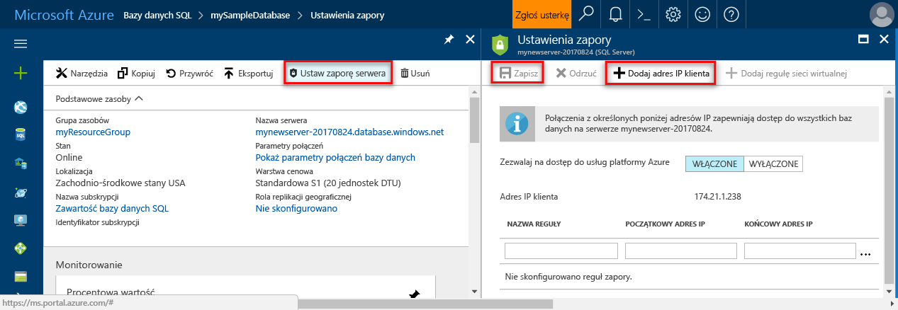

# <a name="azure-sql-database-server-level-and-database-level-firewall-rules"></a>Reguły zapory poziomu serwera i bazy danych na poziomie bazy danych SQL Azure 

Usługa Microsoft Azure SQL Database udostępnia usługę relacyjnej bazy danych dla platformy Azure i innych aplikacji internetowych. toohelp chronić dane, zapór zapobiec wszystkich serwera bazy danych tooyour dostępu do chwili określenia komputery, które ma uprawnienia. Zapora Hello przyznaje toodatabases dostępu oparte na powitania pochodzące z adresu IP dla każdego żądania.

## <a name="overview"></a>Omówienie

Początkowo wszystkie języka Transact-SQL dostępu tooyour Azure SQL server jest blokowany przez zaporę hello. toobegin przy użyciu serwera Azure SQL, należy określić co najmniej jedną regułę zapory poziomu serwera umożliwiających dostęp tooyour Azure SQL server. Użyj toospecify reguły zapory hello, który adres IP od hello są dozwolone przez Internet, i czy aplikacjami platformy Azure może próbować tooconnect tooyour Azure SQL server.

tooselectively Udziel dostępu toojust, jeden hello baz danych serwera Azure SQL, należy utworzyć regułę poziom bazy danych dla hello wymaganej bazy danych. Określ zakres adresów IP dla hello reguły zapory bazy danych, która wykracza poza hello określone w regule zapory poziomu serwera hello zakres adresów IP i upewnij się, że adres IP hello powitania klienta znajduje się w zakresie hello określone w regule bazy danych na poziomie hello.

Próby nawiązania połączenia z hello Internet i Azure musi najpierw przejść przez zaporę Windows hello przed dotarciem serwera Azure SQL lub bazy danych SQL, pokazane na powitania po diagramu:

   ![Diagram opisujący konfigurację zapory.][1]

* **Reguły zapory poziomu serwera:** reguły te umożliwiają klientom tooaccess cały serwer Azure SQL, oznacza to, że wszystkie hello bazy danych w ramach hello tym samym serwerze logicznym. Te reguły są przechowywane w hello **wzorca** bazy danych. Reguły zapory poziomu serwera można skonfigurować przy użyciu portalu hello lub za pomocą instrukcji języka Transact-SQL. reguły zapory poziomu serwera toocreate przy użyciu hello portalu Azure lub programu PowerShell, muszą być hello subskrypcji właścicielem lub współautorem subskrypcji. toocreate regułę zapory poziomu serwera przy użyciu języka Transact-SQL, należy połączyć toohello wystąpienie bazy danych SQL jako głównego identyfikatora logowania poziomu serwera hello lub administratora usługi Azure Active Directory hello, (co oznacza, że należy najpierw utworzyć regułę zapory poziomu serwera Użytkownik z uprawnieniami na poziomie usługi Azure).
* **Reguły zapory poziomu bazy danych:** reguły te umożliwiają klientom tooaccess niektórych (bezpieczny) baz danych w ramach hello sam serwer logiczny. Można utworzyć zasady dla każdej bazy danych (w tym hello **wzorca** database0) i są przechowywane w poszczególnych bazach danych hello. Reguły zapory poziomu bazy danych można skonfigurować tylko za pomocą instrukcji języka Transact-SQL i dopiero po skonfigurowaniu hello pierwszy zapory poziomu serwera. Jeśli określisz hello reguły zapory poziomu bazy danych, która jest określone w regule zapory poziomu serwera hello zakres hello poza zakres adresów IP, tylko tych klientów, którzy mają hello bazy danych na poziomie zakresu adresów IP komputerowi dostęp hello bazy danych. Dla bazy danych można określić maksymalnie 128 reguł zapory na poziomie bazy danych. Reguły zapory poziomu bazy danych dla baz danych master i użytkownika tylko można tworzyć i zarządzać nimi przy użyciu języka Transact-SQL. Aby uzyskać więcej informacji na temat konfigurowania reguł zapory na poziomie bazy danych, zobacz przykład hello później w tym artykuł i zobacz [sp_set_database_firewall_rule (baz danych SQL Azure)](https://msdn.microsoft.com/library/dn270010.aspx).

**Zalecenie:** firma Microsoft zaleca korzystanie z reguł zapory na poziomie bazy danych przy każdym możliwe tooenhance zabezpieczeń i toomake przenośną bazy danych. Przy użyciu reguły zapory poziomu serwera dla administratorów, a jeśli masz wiele baz danych, które mają hello te same wymagania dostępu, a nie ma czasu toospend indywidualnie skonfigurowanie każdej bazy danych.

> [!Note]
> Aby uzyskać informacje o przenośne baz danych w kontekście hello ciągłość prowadzenia działalności biznesowej, zobacz [wymagania dotyczące uwierzytelniania dla odzyskiwania po awarii](sql-database-geo-replication-security-config.md).
>

### <a name="connecting-from-hello-internet"></a>Łączenie z hello Internet

Gdy komputer próbuje tooconnect tooyour bazy danych serwera z hello Internet, zapory hello najpierw sprawdza hello pochodzące z adresu IP hello żądania dotyczącego hello reguły zapory poziomu bazy danych, hello bazy danych, który żąda połączenia hello:

* Jeśli adres IP hello żądania hello jest w jednej z określonych w regułach zapory na poziomie bazy danych hello zakresach hello, toohello bazy danych SQL, która zawiera regułę hello zostanie ustanowione połączenie hello.
* Jeśli adres IP hello hello żądania nie jest w jednym z zakresów hello określone w regule zapory na poziomie bazy danych hello, reguły zapory poziomu serwera hello są sprawdzane. Jeśli adres IP hello żądania hello jest w jednej z określonych w regułach zapory poziomu serwera hello zakresach hello, zostanie ustanowione połączenie hello. Reguły zapory poziomu serwera stosowanie tooall baz danych na serwerze Azure SQL hello.  
* Jeśli adres IP hello hello żądania nie jest w hello zakresy określone w żadnym hello poziom bazy danych lub reguły zapory poziomu serwera hello żądanie połączenia zakończy się niepowodzeniem.

> [!NOTE]
> tooaccess bazy danych SQL Azure z komputera lokalnego, upewnij się, że hello zapory w sieci i komputera lokalnego umożliwia komunikację wychodzący na porcie TCP 1433.
> 

### <a name="connecting-from-azure"></a>Łączenie z platformy Azure
tooallow aplikacji Azure tooconnect tooyour serwera Azure SQL Azure połączenia musi być włączony. Po aplikacji z platformy Azure prób tooconnect tooyour bazy danych serwera, zapory hello sprawdza, czy są dozwolone połączenia platformy Azure. Zapora ustawienie początkową i końcową too0.0.0.0 taki sam adres wskazuje, że te połączenia są dozwolone. Niedozwolona próba połączenia hello hello żądania nie dochodzi powitania serwera bazy danych SQL Azure.

> [!IMPORTANT]
> Ta opcja powoduje skonfigurowanie hello zapory tooallow wszystkich połączeń z Azure połączeń między innymi w subskrypcji hello innych klientów. Wybranie tej opcji upewnij się, że logowanie po tooonly dostępu ograniczyć uprawnienia użytkowników autoryzowanych użytkowników.
> 

## <a name="creating-and-managing-firewall-rules"></a>Tworzenie i zarządzanie nimi reguł zapory
Pierwsze ustawienie zapory poziomu serwera Hello można tworzyć przy użyciu hello [portalu Azure](https://portal.azure.com/) lub programowo przy użyciu [programu Azure PowerShell](https://msdn.microsoft.com/library/azure/dn546724.aspx), [interfejsu wiersza polecenia Azure](/cli/azure/sql/server/firewall-rule#create), lub hello [Interfejsu API REST](https://msdn.microsoft.com/library/azure/dn505712.aspx). Kolejne reguły zapory na poziomie serwera mogą być tworzone i zarządzane przy użyciu tych metod oraz za pomocą języka Transact-SQL. 

> [!IMPORTANT]
> Reguły zapory poziomu bazy danych można tworzyć tylko i zarządzane przy użyciu języka Transact-SQL. 
>

wydajność tooimprove, reguły są tymczasowo przechowywane na poziomie bazy danych hello zapory poziomu serwera. pamięć podręczna hello toorefresh, zobacz [DBCC FLUSHAUTHCACHE](https://msdn.microsoft.com/library/mt627793.aspx). 

> [!TIP]
> Można użyć [SQL Database Auditing](sql-database-auditing.md) tooaudit zmiany zapory poziomu serwera i poziom bazy danych.
>

### <a name="azure-portal"></a>Azure Portal

tooset regułę zapory poziomu serwera w portalu Azure hello albo możesz strony Przegląd toohello strony Przegląd bazy danych lub hello Azure SQL dla serwera logicznego bazy danych Azure.

> [!TIP]
> Samouczek, zobacz [tworzenie bazy danych przy użyciu hello portalu Azure](sql-database-get-started-portal.md).
>

**Na stronie Przegląd bazy danych**

1. tooset reguły zapory poziomu serwera z hello strony Przegląd bazy danych, kliknij przycisk **ustawić Zapora serwera** na powitania narzędzi pokazane na powitania po obrazu: hello **ustawienia zapory** stronę hello SQL Otwiera serwera bazy danych.

       

2. Kliknij przycisk **Dodaj adres IP klienta** na powitania narzędzi tooadd hello adres IP komputera hello obecnie używasz a następnie kliknij przycisk **zapisać**. Dla bieżącego adresu IP zostanie utworzona reguła zapory na poziomie serwera.

       

**Na stronie Przegląd serwera**

Witaj strona przeglądu otwartym serwera przedstawiający hello w pełni kwalifikowana nazwa serwera (takich jak **mynewserver20170403.database.windows.net**) i udostępnia opcje dla dalszej konfiguracji.

1. Kliknij tooset reguły poziom serwera, na stronie Omówienie serwera **zapory** w menu po lewej stronie powitania w obszarze Ustawienia, jak wynika powitania po obrazu: 

     

2. Kliknij przycisk **Dodaj adres IP klienta** na powitania narzędzi tooadd hello adres IP komputera hello obecnie używasz a następnie kliknij przycisk **zapisać**. Dla bieżącego adresu IP zostanie utworzona reguła zapory na poziomie serwera.

     

### <a name="transact-sql"></a>Język Transact-SQL
| Widok wykazu lub procedura składowana | Poziom | Opis |
| --- | --- | --- |
| [sys.firewall_rules](https://msdn.microsoft.com/library/dn269980.aspx) |Serwer |Wyświetla bieżące reguły zapory poziomu serwera hello |
| [sp_set_firewall_rule](https://msdn.microsoft.com/library/dn270017.aspx) |Serwer |Tworzy lub aktualizuje reguły zapory na poziomie serwera |
| [sp_delete_firewall_rule](https://msdn.microsoft.com/library/dn270024.aspx) |Serwer |Usuwa reguły zapory na poziomie serwera |
| [sys.database_firewall_rules](https://msdn.microsoft.com/library/dn269982.aspx) |Database (Baza danych) |Wyświetla hello bieżące reguły zapory poziomu bazy danych |
| [sp_set_database_firewall_rule](https://msdn.microsoft.com/library/dn270010.aspx) |Database (Baza danych) |Tworzy lub aktualizuje hello reguły zapory poziomu bazy danych |
| [sp_delete_database_firewall_rule](https://msdn.microsoft.com/library/dn270030.aspx) |Bazy danych |Usuwa reguły zapory na poziomie bazy danych |


Witaj następujące przykłady Sprawdź hello istniejących reguł, Włącz zakres adresów IP na serwerze hello Contoso i usuwa regułę zapory:
   
```sql
SELECT * FROM sys.firewall_rules ORDER BY name;
```
  
Następnie dodaj regułę zapory.
   
```sql
EXECUTE sp_set_firewall_rule @name = N'ContosoFirewallRule',
   @start_ip_address = '192.168.1.1', @end_ip_address = '192.168.1.10'
```

toodelete regułę zapory poziomu serwera wykonać hello sp_delete_firewall_rule przechowywane procedury. Witaj poniższy przykład powoduje usunięcie hello reguły o nazwie ContosoFirewallRule:
   
```sql
EXECUTE sp_delete_firewall_rule @name = N'ContosoFirewallRule'
```   

### <a name="azure-powershell"></a>Azure PowerShell
| Polecenie cmdlet | Poziom | Opis |
| --- | --- | --- |
| [Get-AzureSqlDatabaseServerFirewallRule](https://msdn.microsoft.com/library/azure/dn546731.aspx) |Serwer |Zwraca bieżące reguły zapory poziomu serwera hello |
| [New-AzureSqlDatabaseServerFirewallRule](https://msdn.microsoft.com/library/azure/dn546724.aspx) |Serwer |Tworzy nową regułę zapory na poziomie serwera |
| [Set-AzureSqlDatabaseServerFirewallRule](https://msdn.microsoft.com/library/azure/dn546739.aspx) |Serwer |Aktualizuje właściwości hello istniejącej reguły zapory poziomu serwera |
| [Remove-AzureSqlDatabaseServerFirewallRule](https://msdn.microsoft.com/library/azure/dn546727.aspx) |Serwer |Usuwa reguły zapory na poziomie serwera |


Poniższy przykład Hello Ustawia regułę zapory poziomu serwera przy użyciu programu PowerShell:

```powershell
New-AzureRmSqlServerFirewallRule -ResourceGroupName "myResourceGroup" `
    -ServerName $servername `
    -FirewallRuleName "AllowSome" -StartIpAddress "0.0.0.0" -EndIpAddress "0.0.0.0"
```

> [!TIP]
> Przykłady programu PowerShell w kontekście hello Szybki Start można znaleźć [utworzyć DB - PowerShell](sql-database-get-started-powershell.md) i [utworzyć pojedynczą bazę danych i skonfigurować regułę zapory przy użyciu programu PowerShell](scripts/sql-database-create-and-configure-database-powershell.md)
>

### <a name="azure-cli"></a>Interfejs wiersza polecenia platformy Azure
| Polecenie cmdlet | Poziom | Opis |
| --- | --- | --- |
| [Utwórz zapory serwera sql az](/cli/azure/sql/server/firewall-rule#create) | Tworzy zapory reguły tooallow dostępu tooall baz danych na serwerze hello z zakresu adresów IP hello wprowadzona.|
| [Usuń zapory serwera sql az](/cli/azure/sql/server/firewall-rule#delete)| Usuwa regułę zapory.|
| [Lista zapory serwera sql az](/cli/azure/sql/server/firewall-rule#list)| Wyświetla listę reguł zapory hello.|
| [Pokaż reguły zapory serwera sql az](/cli/azure/sql/server/firewall-rule#show)| Wyświetla szczegóły hello reguły zapory.|
| [AX aktualizacja reguły zapory programu sql server](/cli/azure/sql/server/firewall-rule#update)| Aktualizuje regułę zapory.

Poniższy przykład Hello Ustawia regułę zapory poziomu serwera przy użyciu interfejsu wiersza polecenia Azure hello: 

```azurecli-interactive
az sql server firewall-rule create --resource-group myResourceGroup --server $servername \
    -n AllowYourIp --start-ip-address 0.0.0.0 --end-ip-address 0.0.0.0
```

> [!TIP]
> Przykład wiersza polecenia platformy Azure w kontekście hello szybki start, zobacz [utworzyć DDB - Azure CLI](sql-database-get-started-cli.md) i [utworzyć pojedynczą bazę danych i skonfigurować regułę zapory przy użyciu hello wiersza polecenia platformy Azure](scripts/sql-database-create-and-configure-database-cli.md)
>

### <a name="rest-api"></a>Interfejs API REST
| Interfejs API | Poziom | Opis |
| --- | --- | --- |
| [List Firewall Rules](https://msdn.microsoft.com/library/azure/dn505715.aspx) (Lista reguł zapory) |Serwer |Wyświetla bieżące reguły zapory poziomu serwera hello |
| [Create Firewall Rule](https://msdn.microsoft.com/library/azure/dn505712.aspx) (Tworzenie reguły zapory) |Serwer |Tworzy lub aktualizuje reguły zapory na poziomie serwera |
| [Set Firewall Rule](https://msdn.microsoft.com/library/azure/dn505707.aspx) (Ustawianie reguły zapory) |Serwer |Aktualizuje właściwości hello istniejącej reguły zapory poziomu serwera |
| [Delete Firewall Rule](https://msdn.microsoft.com/library/azure/dn505706.aspx) (Usuwanie reguły zapory) |Serwer |Usuwa reguły zapory na poziomie serwera |

## <a name="server-level-firewall-rule-versus-a-database-level-firewall-rule"></a>Reguły zapory poziomu serwera i regułę zapory poziomu bazy danych
Q. Użytkownicy z jednej bazy danych należy całkowicie odizolowane od innej bazy danych?   
  Jeśli tak, należy przyznać dostęp przy użyciu reguł zapory na poziomie bazy danych. Dzięki temu można uniknąć przy użyciu reguły zapory poziomu serwera, które zezwalają na dostęp przez zaporę Windows hello tooall baz danych, zmniejszenie głębokości hello dalszej.   
 
Q. Czy użytkownicy pod adresem IP hello muszą uzyskiwać dostęp do baz danych tooall?   
  Użyj zapory poziomu serwera reguły tooreduce hello liczbę razy, należy skonfigurować reguły zapory.   

Q. Hello osobę lub zespół Konfigurowanie reguł zapory hello tylko ma dostęp za pośrednictwem portalu Azure, programu PowerShell, hello lub hello interfejsu API REST?   
  Należy użyć reguły zapory poziomu serwera. Reguły zapory poziomu bazy danych można skonfigurować tylko za pomocą języka Transact-SQL.  

Q. Jest hello osobę lub zespół Konfigurowanie reguł zapory hello zabroniony z konieczności wysokiego poziomu uprawnień na poziomie bazy danych hello?   
  Użyj reguł zapory na poziomie serwera. Konfigurowanie reguł zapory na poziomie bazy danych przy użyciu języka Transact-SQL, wymaga co najmniej `CONTROL DATABASE` uprawnienia na poziomie bazy danych hello.  

Q. Jest hello osobie lub zespołowi inspekcję hello reguły zapory, i konfigurowanie centralne zarządzanie reguły zapory dla wielu (prawdopodobnie 100) baz danych?   
  Tego wyboru zależy od środowiska i potrzeb użytkowników. Reguły zapory poziomu serwera może być łatwiejsze tooconfigure, ale skryptów można skonfigurować reguły w hello poziom bazy danych. A nawet wtedy, gdy używasz reguły zapory poziomu serwera, może być potrzebny reguły zapory bazy danych tooaudit hello toosee użytkownikom `CONTROL` uprawnień w bazie danych hello zostały utworzone reguły zapory poziomu bazy danych.   

Q. Czy można używać różnych obie reguły zapory poziomu serwera i poziom bazy danych?   
  Tak. W przypadku niektórych użytkowników, takich jak Administratorzy mogą wymagać reguły zapory poziomu serwera. Innych użytkowników, takich jak użytkownicy aplikacji bazy danych, może być konieczne reguły zapory poziomu bazy danych.   

## <a name="troubleshooting-hello-database-firewall"></a>Rozwiązywanie problemów dotyczących zapory bazy danych hello
Należy wziąć pod uwagę następujące punkty, gdy toohello dostępu do usługi Microsoft Azure SQL Database nie działają zgodnie z oczekiwaniami hello:

* **Konfiguracja zapory lokalnej:** zanim komputer może uzyskać dostęp do bazy danych SQL Azure, konieczne może toocreate wyjątek zapory na komputerze dla portu TCP 1433. Jeśli tworzysz połączeń wewnątrz granic chmury Azure hello, może być tooopen dodatkowych portów. Aby uzyskać więcej informacji, zobacz hello **bazy danych SQL: poza vs wewnątrz** sekcji [porty inne niż 1433 ADO.NET 4.5 i bazy danych SQL](sql-database-develop-direct-route-ports-adonet-v12.md).
* **Adres translatora adresów sieciowych:** tooNAT termin, hello adres IP używany przez Twoje tooAzure tooconnect komputera bazy danych SQL mogą różnić się od adresu IP hello wyświetlany w ustawieniach konfiguracji adresu IP komputera. tooview hello adres IP komputera przy użyciu tooconnect tooAzure, zaloguj się w portalu toohello i przejdź toohello **Konfiguruj** kartę na powitania serwera, który hostuje bazę danych. W obszarze hello **dozwolone adresy IP** sekcji, hello **bieżącego adresu IP klienta** jest wyświetlany. Kliknij przycisk **Dodaj** toohello **dozwolone adresy IP** tooallow serwera hello tooaccess tego komputera.
* **Lista dozwolonych toohello zmiany nie zostały uwzględnione jeszcze:** może być jak opóźnienie 5 minutową zmienia toohello bazy danych SQL Azure zapory konfiguracji tootake efekt.
* **nie ma uprawnień logowania Hello lub niepoprawne hasło było używane:** Jeśli nazwa logowania nie ma uprawnień na serwerze bazy danych SQL Azure hello lub hello hasło używane jest niepoprawny, serwera bazy danych SQL Azure toohello połączeń hello zostanie odrzucone. Tworzenie ustawień zapory tylko zapewnia klientom tooattempt możliwość łączenia serwera tooyour; Każdy klient musi podać poświadczenia zabezpieczeń wymaganymi hello. Aby uzyskać więcej informacji na temat przygotowywania logowań, zobacz sekcję Zarządzanie bazami danych, logowaniami i użytkownikami w usłudze Azure SQL Database.
* **Dynamicznego adresu IP:** Jeśli masz kłopot przez zaporę Windows hello ma połączenia internetowego z dynamicznych adresów IP, można Wypróbuj jedną z następujących rozwiązań hello:
  
  * Zapytaj dostawcę usługi internetowego (ISP) dla zakresu adresów IP hello przypisane tooyour komputerów klienckich serwera bazy danych SQL Azure hello tego dostępu, a następnie Dodaj zakres adresów IP hello jako regułę zapory.
  * Pobierz statycznych adresów IP zamiast tego dla komputerów klienckich, a następnie dodaj adresy IP hello jako reguły zapory.

## <a name="next-steps"></a>Następne kroki

- Aby uzyskać szybki start dotyczące tworzenia bazy danych i regułę zapory poziomu serwera, zobacz [tworzenie bazy danych Azure SQL](sql-database-get-started-portal.md).
- Aby uzyskać pomoc w bazie danych Azure SQL z tooan nawiązujący połączenie z typu open source lub aplikacje innych firm, [tooSQL bazy danych — przykłady kodu szybki start klienta](https://msdn.microsoft.com/library/azure/ee336282.aspx).
- Informacje dotyczące dodatkowych portów, że może być konieczne tooopen znajdują się w temacie hello **bazy danych SQL: poza vs wewnątrz** sekcji [porty inne niż 1433 ADO.NET 4.5 i bazy danych SQL](sql-database-develop-direct-route-ports-adonet-v12.md)
- Omówienie zabezpieczeń usługi Azure SQL Database, zobacz [zabezpieczania bazy danych](sql-database-security-overview.md)

<!--Image references-->
[1]: ./media/sql-database-firewall-configure/sqldb-firewall-1.png
