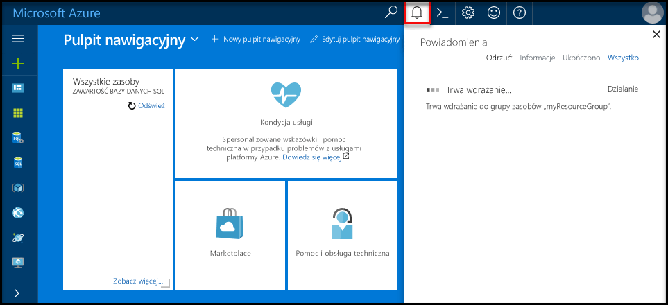

# <a name="create-an-azure-sql-database-in-hello-azure-portal"></a>Tworzenie bazy danych Azure SQL w portalu Azure hello

Ten samouczek szybki start przedstawiono sposób toocreate SQL bazy danych na platformie Azure. Bazy danych SQL Azure jest "bazy danych jako — usługa" oferty, które umożliwia toorun i skali wysokiej dostępności bazy danych SQL Server w chmurze hello. To szybki start przedstawia sposób uruchamiania tooget przez utworzenie bazy danych SQL przy użyciu hello portalu Azure.

Jeśli nie masz subskrypcji platformy Azure, przed rozpoczęciem utwórz [bezpłatne](https://azure.microsoft.com/free/) konto.

## <a name="log-in-toohello-azure-portal"></a>Zaloguj się za toohello portalu Azure

Zaloguj się za toohello [portalu Azure](https://portal.azure.com/).

## <a name="create-a-sql-database"></a>Tworzenie bazy danych SQL

Baza danych Azure SQL jest tworzona ze zdefiniowanym zestawem [zasobów obliczeniowych i przechowywania](sql-database-service-tiers.md). Witaj baza danych została utworzona w ramach [grupy zasobów platformy Azure](../azure-resource-manager/resource-group-overview.md) i [serwera logicznego bazy danych SQL Azure](sql-database-features.md). 

Wykonaj te kroki toocreate zawierający hello Adventure Works LT przykładowych danych bazy danych SQL. 

1. Kliknij przycisk hello **nowy** znaleziono przycisku na powitania lewym górnym rogu hello portalu Azure.

2. Wybierz **baz danych** z hello **nowy** i wybrać opcję **bazy danych SQL** z hello **baz danych** strony.

   

3. Wypełnianie hello bazy danych SQL formularza z hello następujących informacji, jak pokazano na powitania poprzedzających obrazu:   

   | Ustawienie       | Sugerowana wartość | Opis | 
   | ------------ | ------------------ | ------------------------------------------------- | 
   | **Nazwa bazy danych** | mySampleDatabase | Prawidłowe nazwy baz danych opisano w artykule [Database Identifiers](https://docs.microsoft.com/en-us/sql/relational-databases/databases/database-identifiers) (Identyfikatory baz danych). | 
   | **Subskrypcja** | Twoja subskrypcja  | Aby uzyskać szczegółowe informacje o subskrypcjach, zobacz [Subskrypcje](https://account.windowsazure.com/Subscriptions). |
   | **Grupa zasobów**  | myResourceGroup | Prawidłowe nazwy grup zasobów opisano w artykule [Naming rules and restrictions](https://docs.microsoft.com/azure/architecture/best-practices/naming-conventions) (Reguły i ograniczenia nazewnictwa). |
   | **Źródło źródła** | Próbka (AdventureWorksLT) | Ładuje hello AdventureWorksLT schemat i dane do nowej bazy danych |

   > [!IMPORTANT]
   > Musisz wybrać hello przykładowej bazy danych w tym formularzu, ponieważ jest on używany w hello pozostałą część tej szybki start.
   > 

4. W obszarze **serwera**, kliknij przycisk **Skonfiguruj wymagane ustawienia** i wypełnij hello programu SQL server (serwer logiczny) formularza z hello następujących informacji, jak pokazano na powitania po obrazu:   

   | Ustawienie       | Sugerowana wartość | Opis | 
   | ------------ | ------------------ | ------------------------------------------------- | 
   | **Nazwa serwera** | Dowolna nazwa unikatowa w skali globalnej | Prawidłowe nazwy serwera opisano w artykule [Naming rules and restrictions](https://docs.microsoft.com/azure/architecture/best-practices/naming-conventions) (Reguły i ograniczenia nazewnictwa). | 
   | **Identyfikator logowania administratora serwera** | Dowolna prawidłowa nazwa | Prawidłowe nazwy identyfikatorów logowania opisano w artykule [Database Identifiers](https://docs.microsoft.com/en-us/sql/relational-databases/databases/database-identifiers) (Identyfikatory baz danych). |
   | **Hasło** | Dowolne prawidłowe hasło | Hasło musi mieć co najmniej 8 znaków i musi zawierać znaki z trzech z następujących kategorii hello: wielkich liter, małych liter, cyfr i i znaki inne niż alfanumeryczne. |
   | **Subskrypcja** | Twoja subskrypcja | Aby uzyskać szczegółowe informacje o subskrypcjach, zobacz [Subskrypcje](https://account.windowsazure.com/Subscriptions). |
   | **Grupa zasobów** | myResourceGroup | Prawidłowe nazwy grup zasobów opisano w artykule [Naming rules and restrictions](https://docs.microsoft.com/azure/architecture/best-practices/naming-conventions) (Reguły i ograniczenia nazewnictwa). |
   | **Lokalizacja** | Dowolna prawidłowa lokalizacja | Aby uzyskać informacje na temat regionów, zobacz temat [Regiony systemu Azure](https://azure.microsoft.com/regions/). |

   > [!IMPORTANT]
   > Hello identyfikator logowania administratora serwera i hasło, które są określone w tym miejscu są wymagane toolog Server toohello i jej baz danych w dalszej części tego szybki start. Zapamiętaj lub zapisz te informacje do wykorzystania w przyszłości. 
   >  

   

5. Po wypełnieniu formularza powitania kliknij **wybierz**.

6. Kliknij przycisk **warstwa cenowa** toospecify hello warstwę i poziom wydajności usługi dla nowej bazy danych. Użyj hello suwaka tooselect **20 jednostek Dtu** i **250** GB miejsca do magazynowania. Aby uzyskać więcej informacji o jednostkach DTU, zobacz [Co to jest jednostka DTU?](sql-database-what-is-a-dtu.md).

   

7. Po hello wybranych jednostek Dtu, kliknij przycisk **Zastosuj**.  

8. Teraz, zostały ukończone hello formularz bazy danych SQL, kliknij przycisk **Utwórz** tooprovision hello w bazie danych. Aprowizacja zajmuje kilka minut. 

9. Na pasku narzędzi hello, kliknij przycisk **powiadomienia** procesu wdrażania hello toomonitor.

   

## <a name="create-a-server-level-firewall-rule"></a>Tworzenie reguły zapory na poziomie serwera

Hello usługi baza danych SQL tworzy zapory na poziomie hello server — które uniemożliwiają połączenie serwera toohello lub żadnych baz danych na serwerze hello, chyba że tooopen hello zapory dla określonych adresów IP jest tworzona reguła zapory aplikacji zewnętrznych i narzędzia. Wykonaj te kroki toocreate [regułę zapory poziomu serwera bazy danych SQL](sql-database-firewall-configure.md) dla adresów IP klienta i włączyć łączność zewnętrzną przez zaporę bazy danych SQL hello tylko adresu IP. 

> [!NOTE]
> Usługa SQL Database nawiązuje komunikację na porcie 1433. Jeśli próbujesz tooconnect z sieci firmowej, ruch wychodzący przez port 1433 może nie być dozwolone przez zaporę w sieci. Jeśli tak, nie można połączyć tooyour serwera bazy danych SQL Azure, chyba że dział IT otwiera port 1433.
>

1. Po zakończeniu wdrażania hello, kliknij przycisk **baz danych SQL** z menu po lewej stronie powitania, a następnie kliknij przycisk **mySampleDatabase** na powitania **baz danych SQL** strony. Witaj strona przeglądu otwartym bazy danych przedstawiający hello w pełni kwalifikowana nazwa serwera (takich jak **mynewserver20170313.database.windows.net**) i udostępnia opcje dla dalszej konfiguracji. Skopiuj tę w pełni kwalifikowaną nazwę serwera do użycia w przyszłości.

   > [!IMPORTANT]
   > Należy to pełna nazwa tooconnect tooyour serwera i jego baz danych w kolejnych Szybki Start.
   > 

    

2. Kliknij przycisk **ustawić Zapora serwera** na powitania narzędzi, jak pokazano na poprzedniej ilustracji hello. Witaj **ustawienia zapory** zostanie otwarta strona hello bazy danych SQL Server. 

    

3. Kliknij przycisk **Dodaj adres IP klienta** na powitania narzędzi tooadd IP bieżący adres tooa nowej reguły zapory. Reguła zapory może otworzyć port 1433 dla pojedynczego adresu IP lub zakresu adresów IP.

4. Kliknij pozycję **Zapisz**. Dla bieżącego adresu IP otwierania portu 1433 na serwerze logicznym hello tworzona jest reguła zapory poziomu serwera.

    

4. Kliknij przycisk **OK** , a następnie zamknij hello **ustawienia zapory** strony.

Teraz można podłączyć toohello bazy danych programu SQL server i bazy danych przy użyciu programu SQL Server Management Studio lub inne narzędzie do dowolnego z tego adresu IP przy użyciu konta administratora serwera hello utworzone wcześniej.

> [!IMPORTANT]
> Domyślnie dostęp za pośrednictwem zapory bazy danych SQL hello jest włączona dla wszystkich usług platformy Azure. Kliknij przycisk **OFF** na toodisable tej strony dla wszystkich usług platformy Azure.
>

## <a name="query-hello-sql-database"></a>Baza danych SQL hello zapytania

Teraz, po utworzeniu przykładowej bazy danych na platformie Azure, umożliwia narzędzie hello wbudowaną kwerendę w hello Azure tooconfirm portalu, że możesz połączyć dane hello toohello bazy danych i zapytania. 

1. Na stronie Baza danych SQL hello bazy danych, kliknij przycisk **narzędzia** na powitania narzędzi. Witaj **narzędzia** zostanie otwarta strona.

    

2. Kliknij przycisk **edytora zapytań (wersja zapoznawcza)**, kliknij hello **Podgląd warunki** pole wyboru, a następnie kliknij przycisk **OK**. zostanie otwarta strona Edytor zapytań Hello.

3. Kliknij przycisk **logowania** , a następnie po wyświetleniu monitu wybierz **uwierzytelniania programu SQL server** , a następnie podaj identyfikator logowania administratora serwera hello i hasła, który został utworzony wcześniej.

    

4. Kliknij przycisk **OK** toolog w.

5. Po uwierzytelnieniu użytkownik typu hello następujące zapytanie w okienku edytora zapytań hello.

   ```sql
   SELECT TOP 20 pc.Name as CategoryName, p.name as ProductName
   FROM SalesLT.ProductCategory pc
   JOIN SalesLT.Product p
   ON pc.productcategoryid = p.productcategoryid;
   ```

6. Kliknij przycisk **Uruchom** , a następnie przejrzyj wyniki zapytania hello w hello **wyniki** okienka.

   

7. Zamknij hello **edytora zapytań** strony i hello **narzędzia** strony.

## <a name="clean-up-resources"></a>Oczyszczanie zasobów

Jeśli nie potrzebujesz tych zasobów innym Szybki Start/samouczek (zobacz [następne kroki](#next-steps)), można je usunąć, wykonując następujące hello:


1. Z menu po lewej stronie powitania w hello portalu Azure, kliknij przycisk **grup zasobów** , a następnie kliknij przycisk **myResourceGroup**. 
2. Na stronie grupy zasobów, kliknij przycisk **usunąć**, typ **myResourceGroup** w hello pola tekstowego, a następnie kliknij przycisk **usunąć**.

## <a name="next-steps"></a>Następne kroki

Teraz, gdy już masz bazę danych, możesz nawiązać z nią połączenie i uruchamiać zapytania za pomocą ulubionych narzędzi. Dowiedz się więcej, wybierając narzędzie poniżej:

- [SQL Server Management Studio](sql-database-connect-query-ssms.md)
- [Visual Studio Code](sql-database-connect-query-vscode.md)
- [.NET](sql-database-connect-query-dotnet.md)
- [PHP](sql-database-connect-query-php.md)
- [Node.js](sql-database-connect-query-nodejs.md)
- [Java](sql-database-connect-query-java.md)
- [Python](sql-database-connect-query-python.md)
- [Ruby](sql-database-connect-query-ruby.md)
