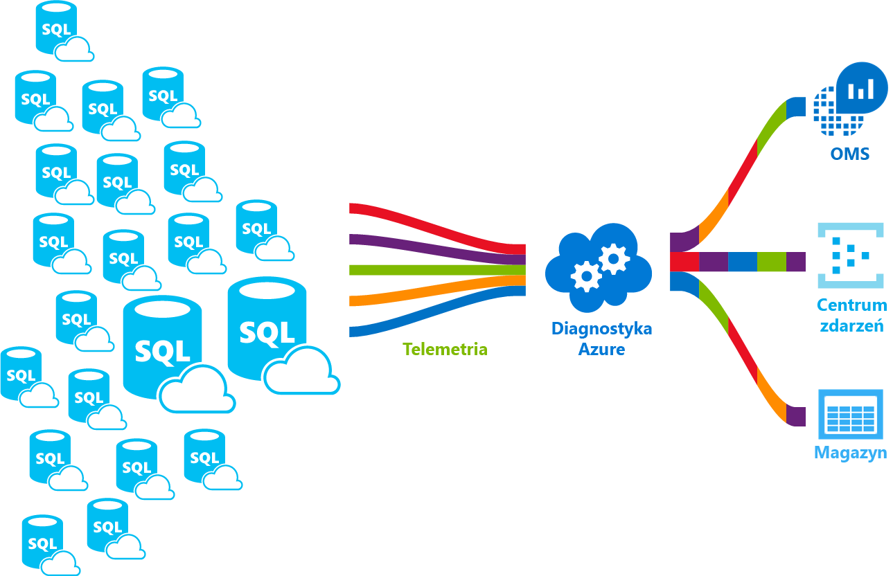

# <a name="azure-sql-database-metrics-and-diagnostics-logging"></a>Metryki bazy danych SQL Azure i rejestrowanie danych diagnostycznych 
Baza danych SQL Azure może emitować metryki i dzienników diagnostycznych do monitorowania łatwiejsze. Można skonfigurować użycie zasobów toostore bazy danych SQL Azure, pracowników i sesje i łączności do jednej z tych zasobów platformy Azure:
- **Usługa Azure Storage**: w celu archiwizowania ogromnych ilości danych telemetrycznych za niewielką cenę
- **Azure Centrum zdarzeń**: do integracji z niestandardowe rozwiązanie monitorowania lub potoki gorących telemetrii bazy danych SQL Azure
- **Analiza dzienników Azure**: dla fabrycznej hello rozwiązania z raportowania, alerty i zmniejszenia możliwości monitorowania 

    

## <a name="enable-logging"></a>Włącz rejestrowanie

Metryki i rejestrowania diagnostyki nie jest włączona domyślnie. Można włączyć i zarządzać metryki i rejestrowanie danych diagnostycznych przy użyciu jednej z następujących metod hello:
- Azure Portal
- PowerShell
- Interfejs wiersza polecenia platformy Azure
- Interfejs API REST 
- Szablon usługi Resource Manager

Po włączeniu metryki i rejestrowanie danych diagnostycznych należy hello toospecify zasobów platformy Azure, w którym są zbierane wybranych danych. Dostępne opcje:
- Log Analytics
- Centrum zdarzeń
- Azure Storage 

Można udostępnić nowych zasobów platformy Azure lub wybierz istniejący zasób. Po wybraniu hello zasobów magazynu, należy toospecify które toocollect danych. Dostępne opcje to:

- **[metryki 1 minutę](sql-database-metrics-diag-logging.md#1-minute-metrics)**  — zawiera procent użycia jednostek DTU, limit jednostek dtu w warstwie, procent użycia procesora CPU danych fizycznych odczytu procent, dziennika zapisu procent, Powodzenie/nie powiodło się/zablokowane przez połączeń zapory, wartość procentowa sesji, procent pracowników Magazyn, procent użycia magazynu, XTP procent użycia magazynu

Jeśli określisz konto AzureStorage lub Centrum zdarzeń można określić toospecify zasad przechowywania tych danych, która jest starsza niż wybrany okres jest usuwany. Jeśli określisz analizy dzienników zasady przechowywania hello zależy od wybranej warstwy cenowej hello. Przeczytaj więcej na temat [cennik analizy dzienników](https://azure.microsoft.com/pricing/details/log-analytics/). 

Zalecamy przeczytanie zarówno hello [omówienie metryk w Microsoft Azure](../monitoring-and-diagnostics/monitoring-overview-metrics.md) i [Omówienie programu Azure dzienników diagnostycznych](../monitoring-and-diagnostics/monitoring-overview-of-diagnostic-logs.md) artykuły toogain zrozumienia nie tylko sposób rejestrowania tooenable, ale hello kategorie metryki i dziennika obsługiwane przez hello różne usługi platformy Azure.

### <a name="azure-portal"></a>Azure Portal

metryki tooenable i zbierania dzienników diagnostycznych w hello portalu Azure, przejdź do bazy danych Azure SQL tooyour lub puli elastycznej strony, a następnie kliknij **ustawień diagnostycznych**.

   

### <a name="powershell"></a>PowerShell

metryki tooenable i informacji diagnostycznych rejestrowanie przy użyciu programu PowerShell, użyj hello następującego polecenia:

- Magazyn tooenable dzienników diagnostycznych na koncie magazynu, użyj tego polecenia:

   ```powershell
   Set-AzureRmDiagnosticSetting -ResourceId [your resource id] -StorageAccountId [your storage account id] -Enabled $true
   ```

   Hello Identyfikatora konta magazynu jest identyfikator zasobu hello toowhich konta magazynu hello ma toosend hello dzienniki.

- tooenable przesyłania strumieniowego dzienników diagnostycznych tooan Centrum zdarzeń, użyj tego polecenia:

   ```powershell
   Set-AzureRmDiagnosticSetting -ResourceId [your resource id] -ServiceBusRuleId [your service bus rule id] -Enabled $true
   ```

   Hello identyfikator reguły magistrali usług to ciąg w formacie:

   ```powershell
   {service bus resource ID}/authorizationrules/{key name}
   ``` 

- tooenable wysyłania dzienników diagnostycznych obszaru roboczego analizy dzienników tooa, użyj tego polecenia:

   ```powershell
   Set-AzureRmDiagnosticSetting -ResourceId [your resource id] -WorkspaceId [resource id of hello log analytics workspace] -Enabled $true
   ```

- Można uzyskać identyfikatora zasobu hello obszaru roboczego analizy dzienników przy użyciu hello następujące polecenie:

   ```powershell
   (Get-AzureRmOperationalInsightsWorkspace).ResourceId
   ```

Tooenable te parametry można łączyć wiele opcji danych wyjściowych.

### <a name="cli"></a>Interfejs wiersza polecenia

metryki tooenable i diagnostyki rejestrowania przy użyciu hello Azure CLI hello Użyj następującego polecenia:

- Magazyn tooenable dzienników diagnostycznych na koncie magazynu, użyj tego polecenia:

   ```azurecli-interactive
   azure insights diagnostic set --resourceId <resourceId> --storageId <storageAccountId> --enabled true
   ```

   Hello Identyfikatora konta magazynu jest identyfikator zasobu hello toowhich konta magazynu hello ma toosend hello dzienniki.

- tooenable przesyłania strumieniowego dzienników diagnostycznych tooan Centrum zdarzeń, użyj tego polecenia:

   ```azurecli-interactive
   azure insights diagnostic set --resourceId <resourceId> --serviceBusRuleId <serviceBusRuleId> --enabled true
   ```

   Hello identyfikator reguły magistrali usług to ciąg w formacie:

   ```azurecli-interactive
   {service bus resource ID}/authorizationrules/{key name}
   ```

- tooenable wysyłania dzienników diagnostycznych obszaru roboczego analizy dzienników tooa, użyj tego polecenia:

   ```azurecli-interactive
   azure insights diagnostic set --resourceId <resourceId> --workspaceId <resource id of hello log analytics workspace> --enabled true
   ```

Tooenable te parametry można łączyć wiele opcji danych wyjściowych.

### <a name="rest-api"></a>Interfejs API REST

Przeczytaj temat zbyt[zmiany ustawień diagnostycznych przy użyciu interfejsu API REST Monitor Azure hello](https://msdn.microsoft.com/library/azure/dn931931.aspx). 

### <a name="resource-manager-template"></a>Szablon usługi Resource Manager

Przeczytaj temat zbyt[Włącz ustawienia diagnostyki na tworzenie zasobów przy użyciu szablonu usługi Resource Manager](../monitoring-and-diagnostics/monitoring-enable-diagnostic-logs-using-template.md). 

## <a name="stream-into-log-analytics"></a>Strumień do analizy dzienników 
Metryki bazy danych SQL Azure i dzienników diagnostycznych mogła być przesłana strumieniowo do analizy dzienników przy użyciu opcji wbudowanych "Wyślij tooLog Analytics" hello, w portalu hello lub przez włączenie analizy dzienników diagnostycznych ustawienia za pomocą poleceń cmdlet programu Azure PowerShell, Azure CLI lub Azure Monitor REST INTERFEJS API.

### <a name="installation-overview"></a>Omówienie instalacji

Monitorowanie floty bazy danych SQL Azure jest proste — analizy dzienników. Wymagane są trzy kroki:

1.  Utwórz zasób analizy dzienników
2.  Konfigurowanie metryki toorecord baz danych i dzienników diagnostycznych do hello utworzone analizy dzienników
3.  Zainstaluj **analiza SQL Azure** rozwiązania z galerii w analizy dzienników

### <a name="create-log-analytics-resource"></a>Utwórz zasób analizy dzienników

1. Kliknij przycisk **nowy** w menu po lewej stronie powitania.
2. Kliknij przycisk **monitorowanie i zarządzanie**
3. Kliknij przycisk **dziennika analityka**
4. Wypełnienie w postaci analizy dzienników hello hello wymagane informacje dodatkowe: Nazwa obszaru roboczego, subskrypcji, grupy zasobów, lokalizacji i warstwę cenową.

   

### <a name="configure-databases-toorecord-metrics-and-diagnostic-logs"></a>Konfigurowanie metryki toorecord baz danych i dzienników diagnostycznych

Hello Najprostszym sposobem tooconfigure gdzie baz danych rejestrowania ich metryki odbywa się za pośrednictwem hello portalu Azure. W portalu Azure Witaj, przejdź tooyour zasobów bazy danych SQL Azure i kliknij **ustawień diagnostycznych**. 

### <a name="install-hello-azure-sql-analytics-solution-from-gallery"></a>Zainstaluj hello rozwiązania analizy SQL Azure z galerii  

1. Po utworzeniu hello zasobów analizy dzienników i danych jest przepływać do niego, należy zainstalować rozwiązania analizy SQL Azure. Można to zrobić za pomocą hello **galerii rozwiązań** który można znaleźć na powitania OMS głównej i w menu po stronie powitania. W galerii hello, Znajdź i kliknij **analiza SQL Azure** rozwiązanie i kliknij przycisk **Dodaj**.

   

2. Na stronie głównej OMS nowy Kafelek o nazwie **analiza SQL Azure** pojawi się. Wybranie tego kafelka otwiera pulpitu nawigacyjnego Azure SQL Analytics hello.

### <a name="using-azure-sql-analytics-solution"></a>Przy użyciu rozwiązania analizy Azure SQL

Analiza SQL Azure jest hierarchiczne pulpit nawigacyjny, który pozwala toonavigate przez hierarchię hello zasobów bazy danych SQL Azure. Ta umożliwia możliwości możesz toodo wysokiego poziomu, monitorowania może również umożliwia tooscope Twojego monitorowania hello toojust prawo zestawu zasobów.
Pulpit nawigacyjny zawiera listy hello różnych zasobów w ramach zasobu hello wybrane. Na przykład dla wybranej subskrypcji można wyświetlić hello wszystkich serwerów, pule elastyczne i baz danych, które należy toohello wybrane subskrypcji. Ponadto baz danych i pul elastycznych widać hello metryki użycia zasobów tego zasobu. Obejmuje wykresy jednostek dtu w warstwie, procesor CPU we/wy, dziennika, sesje, pracowników, połączeń i magazynu w GB.

## <a name="stream-into-azure-event-hub"></a>Strumień do Centrum zdarzeń platformy Azure

Metryki bazy danych SQL Azure i dzienników diagnostycznych mogła być przesłana strumieniowo do Centrum zdarzeń przy użyciu opcji wbudowanych "strumienia tooan Centrum zdarzeń" hello, w portalu hello, lub włączenie identyfikator reguły magistrali usług w ustawienie diagnostyczne za pomocą polecenia cmdlet programu PowerShell usługi Azure, Azure CLI lub Azure Monitor REST INTERFEJS API. 

### <a name="what-toodo-with-metrics-and-diagnostic-logs-in-event-hub"></a>Jakie toodo dzienników diagnostycznych w Centrum zdarzeń i metryk?
Po hello wybrane dane są przesyłane strumieniowo do Centrum zdarzeń, jesteś jedną tooenabling bliżej krok zaawansowanych scenariuszy monitorowania. Usługa Event Hubs działa jako "drzwi wejściowe" dla potoku zdarzeń hello, a po pobraniu danych do Centrum zdarzeń, można je przekształcać i przechowywane za pomocą dowolnego dostawcy analiz w czasie rzeczywistym lub kart przetwarzania wsadowego i magazynowania. Usługa Event Hubs oddziela hello Wytwarzanie strumienia zdarzeń od użycia hello tych zdarzeń, dzięki czemu odbiorcy zdarzeń mogą uzyskiwać dostęp do zdarzeń hello w swoim własnym harmonogramem. Aby uzyskać więcej informacji o Centrum zdarzeń Zobacz:

- [Co to jest usługa Azure Event Hubs](../event-hubs/event-hubs-what-is-event-hubs.md)?
- [Rozpoczynanie pracy z usługą Event Hubs](../event-hubs/event-hubs-csharp-ephcs-getstarted.md)


Poniżej przedstawiono kilka sposobów może używać hello przesyłania strumieniowego możliwości:

-   Wyświetl kondycję usługi przez przesyłania strumieniowego "aktywnej ścieżki" danych tooPowerBI — za pomocą usługi Event Hubs, Stream Analytics i usługi Power BI, metryki i diagnostyki danych w pobliżu wgląd w czasie rzeczywistym mogą łatwo przekształcić na usługami Azure. Omówienie sposobu przetwarzania danych za pomocą usługi Stream Analytics tooset się usługi Event Hubs i używać usługi Power BI jako dane wyjściowe, zobacz [Stream Analytics i usługi Power BI](../stream-analytics/stream-analytics-power-bi-dashboard.md).
-   Strumień dzienniki firm toothird rejestrowania i dane telemetryczne strumieni — centra zdarzeń przy użyciu przesyłania strumieniowego można można uzyskać Twoje metryki i dzienniki diagnostyczne w toodifferent rozwiązań analitycznych innych firm monitorowania i dziennika. 
-   Jeśli masz już platformy telemetrii niestandardowej lub są tylko pomyśleć o budynku jedną hello skalowalnej publikowania / subskrypcji, rodzaj usługi Event Hubs umożliwia tooflexibly pozyskiwania dzienników diagnostycznych kompilacji telemetria niestandardowa i platforma rejestrowania. Zobacz [Dan Rosanova przewodnik toousing centra zdarzeń w skali globalnej platformę telemetrii](https://azure.microsoft.com/documentation/videos/build-2015-designing-and-sizing-a-global-scale-telemetry-platform-on-azure-event-Hubs/).

## <a name="stream-into-azure-storage"></a>Strumień do magazynu Azure

Metryki bazy danych SQL Azure i dzienniki diagnostyczne mogą być przechowywane w magazynie Azure przy użyciu wbudowanych opcji "Archiwum tooa konta magazynu" hello, w portalu Azure hello, lub włączenie usługi Azure Storage w ustawienie diagnostyczne za pomocą polecenia cmdlet programu PowerShell usługi Azure, Azure CLI lub Azure Monitor interfejsu API REST.

### <a name="schema-of-metrics-and-diagnostic-logs-in-hello-storage-account"></a>Schemat metryki i dzienników diagnostycznych na koncie magazynu hello

Po skonfigurowaniu metryki i zbierania dzienników diagnostycznych kontenera magazynu jest tworzony na koncie magazynu hello wybranych podczas hello pierwsze wiersze danych są dostępne. Struktura Hello tych obiektów blob jest:

```powershell
insights-{metrics|logs}-{category name}/resourceId=/SUBSCRIPTIONS/{subscription ID}/ RESOURCEGROUPS/{resource group name}/PROVIDERS/Microsoft.SQL/servers/{resource_server}/ databases/{database_name}/y={four-digit numeric year}/m={two-digit numeric month}/d={two-digit numeric day}/h={two-digit 24-hour clock hour}/m=00/PT1H.json
```
    
Lub po prostu:

```powershell
insights-{metrics|logs}-{category name}/resourceId=/{resource Id}/y={four-digit numeric year}/m={two-digit numeric month}/d={two-digit numeric day}/h={two-digit 24-hour clock hour}/m=00/PT1H.json
```

Na przykład może być nazwa obiektu blob dla 1-minutowych metryki:

```powershell
insights-metrics-minute/resourceId=/SUBSCRIPTIONS/s1id1234-5679-0123-4567-890123456789/RESOURCEGROUPS/TESTRESOURCEGROUP/PROVIDERS/MICROSOFT.SQL/ servers/Server1/databases/database1/y=2016/m=08/d=22/h=18/m=00/PT1H.json
```

W przypadku, gdy chcesz toorecord hello dane z hello puli elastycznej, nazwa obiektu blob różni się nieco:

```powershell
insights-{metrics|logs}-{category name}/resourceId=/SUBSCRIPTIONS/{subscription ID}/ RESOURCEGROUPS/{resource group name}/PROVIDERS/Microsoft.SQL/servers/{resource_server}/ elasticPools/{elastic_pool_name}/y={four-digit numeric year}/m={two-digit numeric month}/d={two-digit numeric day}/h={two-digit 24-hour clock hour}/m=00/PT1H.json
```

### <a name="download-metrics-and-logs-from-azure-storage"></a>Pobierz dzienniki i metryki z usługi Azure storage

Zobacz [pobrać metryki i dzienników diagnostycznych z usługi Azure Storage](../storage/blobs/storage-dotnet-how-to-use-blobs.md#download-blobs)

## <a name="1-minute-metrics"></a>metryki 1 minuta

| |  |
|---|---|
|**Zasób**|**Metryki**|
|Database (Baza danych)|Procent użycia jednostek DTU, używane jednostek dtu w warstwie, limit jednostek dtu w warstwie, procent użycia procesora CPU i procent odczytu danych fizycznych, dziennika zapisu procent, Powodzenie/nie powiodło się/zablokowane przez połączeń zapory, wartość procentowa sesji, procent pracowników, magazynu, procent użycia magazynu, XTP procent użycia magazynu, Zakleszczenie |
|Puli elastycznej|procent liczby jednostek eDTU używany eDTU, limit liczby jednostek eDTU, procent użycia procesora CPU i procent odczytu danych fizycznych, dziennika zapisu procent, procent sesji, procent pracowników, magazynu, procent użycia magazynu, limit magazynu, XTP procent użycia magazynu |
|||

## <a name="next-steps"></a>Następne kroki

- Przeczytaj zarówno hello [omówienie metryk w Microsoft Azure](../monitoring-and-diagnostics/monitoring-overview-metrics.md) i [Omówienie programu Azure dzienników diagnostycznych](../monitoring-and-diagnostics/monitoring-overview-of-diagnostic-logs.md) artykuły toogain zrozumienia nie tylko jak tooenable rejestrowania, ale hello metryki i dziennika kategorii obsługiwane przez hello różne usługi platformy Azure.
- Przeczytaj te toolearn artykuły dotyczące centra zdarzeń:
   - [Co to jest usługa Azure Event Hubs](../event-hubs/event-hubs-what-is-event-hubs.md)?
   - [Rozpoczynanie pracy z usługą Event Hubs](../event-hubs/event-hubs-csharp-ephcs-getstarted.md)
- Zobacz [pobrać metryki i dzienników diagnostycznych z usługi Azure Storage](../storage/blobs/storage-dotnet-how-to-use-blobs.md#download-blobs)
